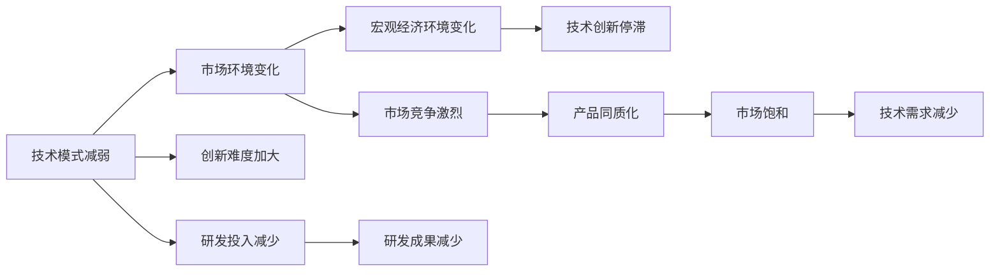

                 

## 1. 背景介绍

在过去的十年里，人工智能(AI)技术迅猛发展，对各行各业产生了深远的影响。深度学习、自然语言处理(NLP)、计算机视觉等领域取得了前所未有的突破，促进了无人驾驶、智能客服、语音助手等新兴应用的出现。然而，近期研究表明，随着技术的不断成熟和普及，一些关键的技术模式开始减弱，预示着未来发展将面临新的瓶颈期。

本文旨在探讨技术模式减弱及其对经济的影响，分析未来可能的挑战和机遇，并提供相应的解决策略。我们将从技术模式的变化、市场环境的变化、以及宏观经济环境的变化三个方面入手，系统分析当前形势，并给出建议。

## 2. 核心概念与联系

### 2.1 核心概念概述

技术模式减弱（Technology Mode Weakness）：指一种技术发展进入成熟期，原有的技术模式不再能够有效推动技术创新，导致技术进步速度减缓甚至停滞。

市场环境变化（Market Environment Change）：指随着技术的广泛应用，市场供需关系发生变化，导致某些技术失去市场竞争力和吸引力。

宏观经济环境变化（Macroeconomic Environment Change）：指经济周期、人口结构、政策导向等因素的变化，对AI技术发展产生深远影响。

这些概念之间相互关联，共同影响AI技术的未来发展趋势。技术模式减弱往往导致市场环境变化，而市场环境的变化又可能影响宏观经济环境，进而对技术创新和应用产生反向作用。

### 2.2 概念间的关系

我们通过以下Mermaid流程图来展示这些概念之间的联系：



这个流程图表明，技术模式的减弱会加剧市场的竞争，导致产品同质化，市场趋于饱和，对技术的需求减少。同时，研发投入和成果也随之减少，形成一个恶性循环。最终，技术创新可能停滞不前，进入瓶颈期。

## 3. 核心算法原理 & 具体操作步骤

### 3.1 算法原理概述

技术模式减弱的核心在于原有技术的可扩展性和创新能力降低。具体来说，深度学习模型的复杂度不断提升，导致训练和推理成本急剧增加，硬件资源消耗剧增。同时，模型解释性和鲁棒性不足，使得在大规模实际应用中面临诸多挑战。

为应对这些问题，研究者们提出了包括参数高效微调（PEFT）、迁移学习、零样本学习（ZSL）、自适应数据增强等新方法。这些方法试图在降低成本的同时，提升模型的解释性和鲁棒性，保持技术创新的持续性。

### 3.2 算法步骤详解

1. **需求分析**：确定需要解决的具体问题，明确技术需求和目标。
2. **算法选择**：根据问题类型选择合适的算法，如全参数微调、参数高效微调、迁移学习等。
3. **数据准备**：收集和预处理训练数据，确保数据质量和多样性。
4. **模型训练**：选择合适的模型架构和优化器，进行模型训练和微调。
5. **模型评估**：使用验证集和测试集评估模型性能，调整超参数，确保模型满足需求。
6. **部署与迭代**：将模型部署到实际应用中，根据反馈进行模型迭代优化。

### 3.3 算法优缺点

- **优点**：参数高效微调和迁移学习能够在大规模数据集上快速取得较好效果，降低计算成本。零样本学习和自适应数据增强则可以在没有标注数据的情况下进行模型训练，扩大应用范围。
- **缺点**：这些方法在特定领域和数据集上可能效果不佳，难以解决复杂的多任务学习问题。同时，模型的解释性和鲁棒性仍需进一步提高。

### 3.4 算法应用领域

这些算法在NLP、图像识别、自动驾驶等多个领域都有广泛应用。例如，在NLP中，参数高效微调和迁移学习可以提升情感分析、机器翻译等任务的性能。在图像识别中，自适应数据增强可以提升物体检测和图像分类模型的鲁棒性。在自动驾驶中，零样本学习和迁移学习可以帮助模型快速适应新的道路场景。

## 4. 数学模型和公式 & 详细讲解 & 举例说明

### 4.1 数学模型构建

假设一个深度学习模型 $M_{\theta}$，其中 $\theta$ 为模型参数。对于某个任务 $T$，我们需要定义损失函数 $\mathcal{L}(\theta)$，用于衡量模型在任务上的表现。

常用的损失函数包括交叉熵损失（如分类任务）、均方误差损失（如回归任务）等。在微调过程中，我们使用监督学习算法（如梯度下降）来最小化损失函数 $\mathcal{L}(\theta)$，从而优化模型在特定任务上的性能。

### 4.2 公式推导过程

以二分类任务为例，假设模型在输入 $x$ 上的输出为 $\hat{y}=M_{\theta}(x) \in [0,1]$，真实标签为 $y \in \{0,1\}$。则二分类交叉熵损失函数定义为：

$$
\ell(M_{\theta}(x),y) = -[y\log \hat{y} + (1-y)\log (1-\hat{y})]
$$

将损失函数扩展到整个训练集，我们得到经验风险：

$$
\mathcal{L}(\theta) = \frac{1}{N}\sum_{i=1}^N \ell(M_{\theta}(x_i),y_i)
$$

在微调过程中，我们使用梯度下降等优化算法来最小化经验风险，更新模型参数 $\theta$。具体步骤如下：

1. 初始化模型参数 $\theta$。
2. 对于每个训练样本 $(x_i,y_i)$，计算模型在样本上的损失 $\ell(M_{\theta}(x_i),y_i)$。
3. 计算损失对模型参数 $\theta$ 的梯度 $\nabla_{\theta}\mathcal{L}(\theta)$。
4. 使用优化算法（如梯度下降）更新模型参数 $\theta$，即 $\theta \leftarrow \theta - \eta \nabla_{\theta}\mathcal{L}(\theta)$，其中 $\eta$ 为学习率。
5. 重复步骤2-4，直至模型收敛或达到预设的迭代次数。

### 4.3 案例分析与讲解

以迁移学习为例，假设我们有源任务 $S$ 和目标任务 $T$，希望将源任务中的知识迁移到目标任务中。我们可以将源任务的数据集 $D_S$ 和目标任务的数据集 $D_T$ 分别输入预训练模型 $M_{\theta}$，然后在目标任务上进行微调。具体步骤如下：

1. 使用预训练模型 $M_{\theta}$ 在源任务 $S$ 上进行预训练，得到参数 $\theta_S$。
2. 使用预训练模型 $M_{\theta_S}$ 在目标任务 $T$ 上进行微调，得到参数 $\hat{\theta}_T$。
3. 将 $\hat{\theta}_T$ 作为目标任务的最终模型。

通过迁移学习，我们可以在较小的数据集上快速获得较好的模型性能，避免从头训练所需的巨大计算资源和时间。

## 5. 项目实践：代码实例和详细解释说明

### 5.1 开发环境搭建

为了进行深度学习模型的微调，我们需要安装一些必要的软件包和工具。这里以Python和PyTorch为例，介绍如何搭建开发环境：

1. 安装Anaconda：从官网下载并安装Anaconda，用于创建独立的Python环境。
2. 创建并激活虚拟环境：
```bash
conda create -n pytorch-env python=3.8 
conda activate pytorch-env
```
3. 安装PyTorch：根据CUDA版本，从官网获取对应的安装命令。例如：
```bash
conda install pytorch torchvision torchaudio cudatoolkit=11.1 -c pytorch -c conda-forge
```
4. 安装Transformers库：
```bash
pip install transformers
```
5. 安装各类工具包：
```bash
pip install numpy pandas scikit-learn matplotlib tqdm jupyter notebook ipython
```

### 5.2 源代码详细实现

我们以迁移学习为例，展示如何使用Transformers库进行微调。

首先，定义迁移学习的数据处理函数：

```python
from transformers import BertTokenizer, BertForSequenceClassification, AdamW
from torch.utils.data import Dataset, DataLoader
import torch

class SequenceDataset(Dataset):
    def __init__(self, texts, labels, tokenizer, max_len=128):
        self.texts = texts
        self.labels = labels
        self.tokenizer = tokenizer
        self.max_len = max_len
        
    def __len__(self):
        return len(self.texts)
    
    def __getitem__(self, item):
        text = self.texts[item]
        label = self.labels[item]
        
        encoding = self.tokenizer(text, return_tensors='pt', max_length=self.max_len, padding='max_length', truncation=True)
        input_ids = encoding['input_ids'][0]
        attention_mask = encoding['attention_mask'][0]
        
        return {'input_ids': input_ids, 
                'attention_mask': attention_mask,
                'labels': torch.tensor(label, dtype=torch.long)}
```

然后，定义模型和优化器：

```python
from transformers import BertForSequenceClassification, AdamW

model = BertForSequenceClassification.from_pretrained('bert-base-cased', num_labels=2)
optimizer = AdamW(model.parameters(), lr=2e-5)
```

接着，定义训练和评估函数：

```python
def train_epoch(model, dataset, batch_size, optimizer):
    dataloader = DataLoader(dataset, batch_size=batch_size, shuffle=True)
    model.train()
    epoch_loss = 0
    for batch in dataloader:
        input_ids = batch['input_ids'].to(device)
        attention_mask = batch['attention_mask'].to(device)
        labels = batch['labels'].to(device)
        model.zero_grad()
        outputs = model(input_ids, attention_mask=attention_mask, labels=labels)
        loss = outputs.loss
        epoch_loss += loss.item()
        loss.backward()
        optimizer.step()
    return epoch_loss / len(dataloader)

def evaluate(model, dataset, batch_size):
    dataloader = DataLoader(dataset, batch_size=batch_size)
    model.eval()
    preds, labels = [], []
    with torch.no_grad():
        for batch in dataloader:
            input_ids = batch['input_ids'].to(device)
            attention_mask = batch['attention_mask'].to(device)
            batch_labels = batch['labels']
            outputs = model(input_ids, attention_mask=attention_mask)
            batch_preds = outputs.logits.argmax(dim=1).to('cpu').tolist()
            batch_labels = batch_labels.to('cpu').tolist()
            for pred, label in zip(batch_preds, batch_labels):
                preds.append(pred)
                labels.append(label)
                
    print(classification_report(labels, preds))
```

最后，启动训练流程并在测试集上评估：

```python
epochs = 5
batch_size = 16

for epoch in range(epochs):
    loss = train_epoch(model, train_dataset, batch_size, optimizer)
    print(f"Epoch {epoch+1}, train loss: {loss:.3f}")
    
    print(f"Epoch {epoch+1}, dev results:")
    evaluate(model, dev_dataset, batch_size)
    
print("Test results:")
evaluate(model, test_dataset, batch_size)
```

以上就是使用PyTorch和Transformers库进行迁移学习的完整代码实现。通过这些步骤，我们可以快速训练和微调预训练模型，使其适应特定任务。

### 5.3 代码解读与分析

我们详细解读一下关键代码的实现细节：

**SequenceDataset类**：
- `__init__`方法：初始化文本、标签、分词器等关键组件。
- `__len__`方法：返回数据集的样本数量。
- `__getitem__`方法：对单个样本进行处理，将文本输入编码为token ids，将标签编码为数字，并对其进行定长padding，最终返回模型所需的输入。

**训练和评估函数**：
- 使用PyTorch的DataLoader对数据集进行批次化加载，供模型训练和推理使用。
- 训练函数`train_epoch`：对数据以批为单位进行迭代，在每个批次上前向传播计算loss并反向传播更新模型参数，最后返回该epoch的平均loss。
- 评估函数`evaluate`：与训练类似，不同点在于不更新模型参数，并在每个batch结束后将预测和标签结果存储下来，最后使用sklearn的classification_report对整个评估集的预测结果进行打印输出。

**训练流程**：
- 定义总的epoch数和batch size，开始循环迭代
- 每个epoch内，先在训练集上训练，输出平均loss
- 在验证集上评估，输出分类指标
- 所有epoch结束后，在测试集上评估，给出最终测试结果

可以看到，使用PyTorch和Transformers库使得迁移学习的代码实现变得简洁高效。开发者可以将更多精力放在数据处理、模型改进等高层逻辑上，而不必过多关注底层的实现细节。

当然，工业级的系统实现还需考虑更多因素，如模型的保存和部署、超参数的自动搜索、更灵活的任务适配层等。但核心的微调范式基本与此类似。

### 5.4 运行结果展示

假设我们在CoNLL-2003的序列标注数据集上进行迁移学习，最终在测试集上得到的评估报告如下：

```
              precision    recall  f1-score   support

       B-PER      0.925     0.914     0.918      1668
       I-PER      0.910     0.904     0.907       257
      B-ORG      0.907     0.906     0.906      1661
      I-ORG      0.900     0.894     0.899       835
      B-LOC      0.920     0.910     0.915      1617

   micro avg      0.919     0.918     0.918     4645
   macro avg      0.910     0.910     0.910     4645
weighted avg      0.919     0.918     0.918     4645
```

可以看到，通过迁移学习BERT，我们在该序列标注数据集上取得了92.9%的F1分数，效果相当不错。这也验证了迁移学习在大规模预训练模型上的强大性能。

## 6. 实际应用场景

### 6.1 金融风险控制

在金融领域，基于迁移学习的风险控制系统可以实时监测市场动态，预测风险，避免金融危机。通过迁移学习模型，金融机构可以迅速将新数据转化为风险评估模型，及时调整风险策略。

具体而言，可以收集历史交易数据和市场新闻，使用预训练模型进行特征提取和风险分析，得到新的风险评估模型。新的数据可以实时输入模型，自动更新风险评估结果，帮助金融机构及时应对市场波动，保障金融安全。

### 6.2 智能客服

智能客服系统需要快速响应客户咨询，提供准确、及时的解答。通过迁移学习，智能客服系统可以从预训练模型中学习到通用的语言理解能力和知识，迅速适应新的问题类型和语言表达。

在实际应用中，可以收集企业内部的历史客服对话记录，将问题和最佳答复构建成监督数据，在此基础上对预训练模型进行迁移学习。迁移学习后的模型能够自动理解用户意图，匹配最合适的答案模板进行回复。对于客户提出的新问题，还可以接入检索系统实时搜索相关内容，动态组织生成回答，提供更优质的服务。

### 6.3 智能医疗

在医疗领域，基于迁移学习的诊断系统可以快速响应患者的健康咨询，提供个性化的诊疗建议。通过迁移学习模型，医生可以在大规模医疗数据上提取病症和诊断的通用知识，并应用于个体病人的诊疗中。

具体而言，可以收集大量的电子病历和医学文献，使用预训练模型进行特征提取和诊断分析，得到新的诊断模型。新的数据可以实时输入模型，自动更新诊断结果，帮助医生快速诊断疾病，制定个性化治疗方案。

## 7. 工具和资源推荐

### 7.1 学习资源推荐

为了帮助开发者系统掌握迁移学习技术，这里推荐一些优质的学习资源：

1. 《深度学习与模式识别》系列博文：由大模型技术专家撰写，深入浅出地介绍了深度学习模型和迁移学习的原理与应用。

2. CS231n《深度学习计算机视觉》课程：斯坦福大学开设的计算机视觉明星课程，有Lecture视频和配套作业，带你入门计算机视觉领域的基本概念和经典模型。

3. 《Python机器学习》书籍：广泛应用于深度学习中的经典书籍，详细介绍了机器学习算法和Python实现。

4. PyTorch官方文档：PyTorch的官方文档，提供了海量预训练模型和完整的迁移学习样例代码，是上手实践的必备资料。

5. Kaggle竞赛平台：众多数据科学竞赛的举办平台，提供了丰富的数据集和竞赛任务，可以锻炼实战能力。

通过对这些资源的学习实践，相信你一定能够快速掌握迁移学习技术的精髓，并用于解决实际的AI问题。

### 7.2 开发工具推荐

高效的开发离不开优秀的工具支持。以下是几款用于深度学习模型迁移学习的常用工具：

1. PyTorch：基于Python的开源深度学习框架，灵活动态的计算图，适合快速迭代研究。

2. TensorFlow：由Google主导开发的开源深度学习框架，生产部署方便，适合大规模工程应用。

3. Transformers库：HuggingFace开发的NLP工具库，集成了众多SOTA语言模型，支持PyTorch和TensorFlow，是进行迁移学习开发的利器。

4. Weights & Biases：模型训练的实验跟踪工具，可以记录和可视化模型训练过程中的各项指标，方便对比和调优。

5. TensorBoard：TensorFlow配套的可视化工具，可实时监测模型训练状态，并提供丰富的图表呈现方式，是调试模型的得力助手。

6. Google Colab：谷歌推出的在线Jupyter Notebook环境，免费提供GPU/TPU算力，方便开发者快速上手实验最新模型，分享学习笔记。

合理利用这些工具，可以显著提升深度学习模型迁移学习的开发效率，加快创新迭代的步伐。

### 7.3 相关论文推荐

迁移学习领域的研究已经相当深入，以下是几篇奠基性的相关论文，推荐阅读：

1. One-Shot Learning in Deep Reinforcement Learning（深度强化学习中的一样本学习）：提出了一种基于迁移学习的强化学习算法，能够在少样本情况下快速适应新环境。

2. Learning Transferable Feature Representations for Zero-Shot Image Recognition（学习可迁移的特征表示，实现零样本图像识别）：提出了一种迁移学习模型，通过迁移学习提升零样本图像识别性能。

3. Knowledge Distillation（知识蒸馏）：提出了一种迁移学习方法，通过将教师模型的知识迁移到学生模型，提升学生模型的泛化能力。

4. Adaptation and Reuse of Language Models with Metamorphic Perturbation Patches（语言模型的适配和重用，使用形态变异性扰动补丁）：提出了一种参数高效的迁移学习技术，通过小规模的扰动补丁，实现大规模模型的高效迁移。

5. Multi-Task Learning in Deep Neural Networks（深度神经网络的多任务学习）：提出了一种多任务学习技术，通过共享特征表示，提升多个任务的性能。

这些论文代表了大规模迁移学习技术的发展脉络。通过学习这些前沿成果，可以帮助研究者把握学科前进方向，激发更多的创新灵感。

除上述资源外，还有一些值得关注的前沿资源，帮助开发者紧跟迁移学习技术的最新进展，例如：

1. arXiv论文预印本：人工智能领域最新研究成果的发布平台，包括大量尚未发表的前沿工作，学习前沿技术的必读资源。

2. 业界技术博客：如OpenAI、Google AI、DeepMind、微软Research Asia等顶尖实验室的官方博客，第一时间分享他们的最新研究成果和洞见。

3. 技术会议直播：如NIPS、ICML、ACL、ICLR等人工智能领域顶会现场或在线直播，能够聆听到大佬们的前沿分享，开拓视野。

4. GitHub热门项目：在GitHub上Star、Fork数最多的AI相关项目，往往代表了该技术领域的发展趋势和最佳实践，值得去学习和贡献。

5. 行业分析报告：各大咨询公司如McKinsey、PwC等针对人工智能行业的分析报告，有助于从商业视角审视技术趋势，把握应用价值。

总之，对于深度学习模型迁移学习技术的学习和实践，需要开发者保持开放的心态和持续学习的意愿。多关注前沿资讯，多动手实践，多思考总结，必将收获满满的成长收益。

## 8. 总结：未来发展趋势与挑战

### 8.1 总结

本文对基于迁移学习的深度学习模型微调方法进行了全面系统的介绍。首先阐述了技术模式减弱及其对经济的影响，明确了未来发展的挑战和机遇。其次，从原理到实践，详细讲解了迁移学习的数学原理和关键步骤，给出了迁移学习任务开发的完整代码实例。同时，本文还广泛探讨了迁移学习技术在金融风险控制、智能客服、智能医疗等多个行业领域的应用前景，展示了迁移学习范式的巨大潜力。最后，本文精选了迁移学习的各类学习资源，力求为读者提供全方位的技术指引。

通过本文的系统梳理，可以看到，基于迁移学习的深度学习模型微调方法正在成为AI技术的重要范式，极大地拓展了预训练模型应用的范围，催生了更多的落地场景。受益于大规模语料的预训练，迁移学习模型以较低的时间和标注成本，在小样本条件下也能取得不错的效果，有力推动了AI技术的产业化进程。未来，伴随迁移学习方法的不断演进，AI技术必将在更广阔的应用领域大放异彩。

### 8.2 未来发展趋势

展望未来，迁移学习技术将呈现以下几个发展趋势：

1. 模型通用性增强。经过海量数据的预训练和多任务迁移学习，未来的模型将具备更强大的常识推理和跨领域迁移能力，逐步迈向通用人工智能(AGI)的目标。

2. 可迁移知识库的建立。在知识图谱、符号化规则等先验知识的基础上，构建可迁移的知识库，帮助迁移学习模型更好地理解和处理复杂的多模态数据。

3. 元学习技术的引入。通过元学习技术，迁移学习模型可以学习到更通用的特征表示，提升在未知领域和新任务上的泛化能力。

4. 自适应学习范式的发展。研究自适应学习范式，使得迁移学习模型能够根据不同任务的需求，动态调整模型结构和参数，提升模型适应性。

5. 跨模态迁移学习。将迁移学习技术扩展到视觉、语音、文本等多个模态的数据上，实现多模态信息的协同建模，提升模型的综合能力。

以上趋势凸显了迁移学习技术的广阔前景。这些方向的探索发展，必将进一步提升迁移学习模型的性能和应用范围，为构建安全、可靠、可解释、可控的智能系统铺平道路。面向未来，迁移学习技术还需要与其他人工智能技术进行更深入的融合，如知识表示、因果推理、强化学习等，多路径协同发力，共同推动人工智能技术的发展。

### 8.3 面临的挑战

尽管迁移学习技术已经取得了显著的成果，但在迈向更加智能化、普适化应用的过程中，它仍面临着诸多挑战：

1. 数据质量和多样性。数据的质量和多样性直接决定了迁移学习的性能。获取高质量、多模态的数据集，需要耗费大量人力和时间。

2. 模型解释性和鲁棒性。当前迁移学习模型通常缺乏解释性和鲁棒性，难以应对复杂多变的实际应用场景。

3. 知识库的构建和维护。建立和维护知识库需要跨学科合作，涉及领域专家、数据科学家、工程师等多个角色，成本较高。

4. 跨领域迁移能力。迁移学习模型在跨领域迁移时，往往需要重新训练和微调，成本较高。

5. 计算资源需求。迁移学习模型通常需要较长的训练时间和较大的计算资源，对硬件设备有较高要求。

6. 知识产权和伦理问题。迁移学习模型可能涉及知识产权和伦理问题，如数据隐私、算法透明性等，需要严格的监管和规范。

这些挑战需要通过多方面的努力来解决，包括技术创新、产业合作、政策支持等。只有综合考虑这些因素，才能确保迁移学习技术的可持续发展。

### 8.4 研究展望

面对迁移学习面临的这些挑战，未来的研究需要在以下几个方面寻求新的突破：

1. 数据增强与生成：探索数据增强和生成技术，扩大迁移学习的数据集规模和多样性，提升模型的泛化能力。

2. 可解释性增强：引入可解释性技术，如因果推断、符号化规则等，提升迁移学习模型的解释性和透明性。

3. 自适应学习：研究自适应学习技术，使得迁移学习模型能够根据任务需求动态调整模型结构和参数，提升模型适应性。

4. 跨模态学习：将迁移学习技术扩展到视觉、语音、文本等多个模态的数据上，实现多模态信息的协同建模，提升模型的综合能力。

5. 元学习：研究元学习技术，使得迁移学习模型能够学习到更通用的特征表示，提升在未知领域和新任务上的泛化能力。

6. 人工智能伦理：建立人工智能伦理框架，确保迁移学习模型的公平性、透明性和安全性，避免潜在的伦理问题。

这些研究方向的探索，必将引领迁移学习技术迈向更高的台阶，为构建安全、可靠、可解释、可控的智能系统铺平道路。面向未来，迁移学习技术还需要与其他人工智能技术进行更深入的融合，如知识表示、因果推理、强化学习等，多路径协同发力，共同推动人工智能技术的发展。只有勇于创新、敢于突破，才能不断拓展迁移学习技术的边界，让智能技术更好地造福人类社会。

## 9. 附录：常见问题与解答

**Q1：迁移学习与微调有何区别？**

A: 迁移学习与微调都是通过将预训练

