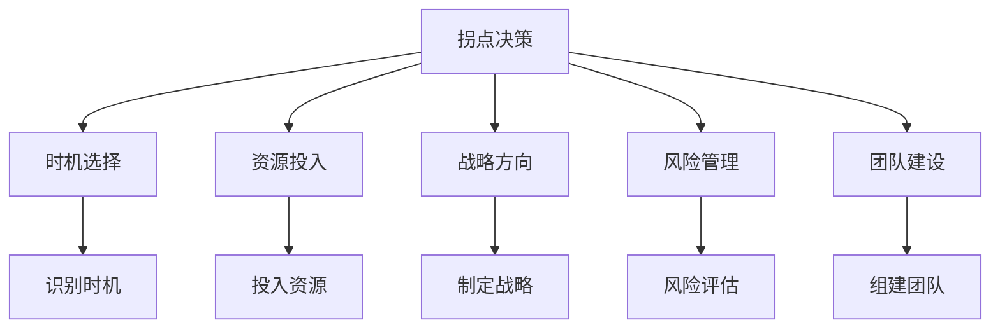
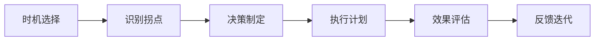
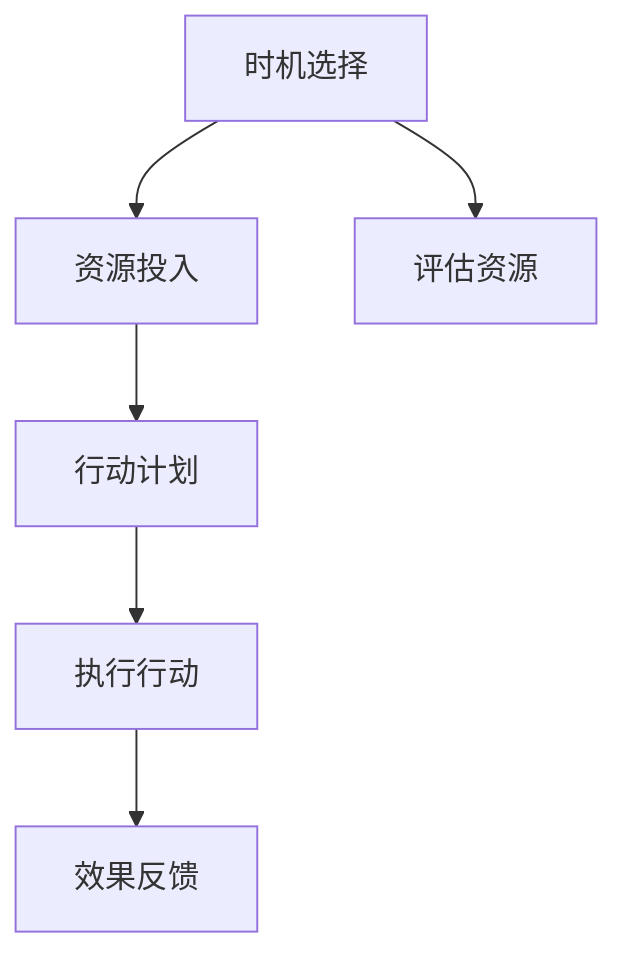

                 

# 拐点决定高度：机遇就在拐点

## 1. 背景介绍

### 1.1 问题由来
在信息技术领域，一个重要的主题是如何抓住那些能带来“指数级”增长的关键点，即所谓的“拐点”。拐点的到来意味着技术、市场或产品的巨大变革，可以为后续发展奠定基础。例如，互联网、人工智能、云计算、大数据等领域，在各自发展的关键时刻，一些关键的拐点决策推动了行业的快速成长。

### 1.2 问题核心关键点
拐点决定高度的核心关键点主要包括以下几个方面：

- **时机选择**：在技术、市场或产品发展的关键时刻做出正确的决策。
- **资源投入**：在关键的拐点时刻，需要大量的资源投入，以确保决策的实施。
- **战略方向**：明确的方向和清晰的战略规划，是确保拐点决策能够成功的关键。
- **风险管理**：拐点决策涉及的风险较大，需要合理评估和管理。
- **团队建设**：一个有经验和能力的团队是实现拐点决策的保障。

### 1.3 问题研究意义
在信息技术领域，找到并抓住拐点，可以加速企业的技术创新、产品开发和市场扩展，从而实现跨越式发展。拐点决策的正确与否，往往决定了企业能否在竞争激烈的市场中脱颖而出，占据领先地位。

## 2. 核心概念与联系

### 2.1 核心概念概述

为了更好地理解拐点决策的原理和实施，本节将介绍几个密切相关的核心概念：

- **拐点决策**：在技术、市场或产品发展的关键时刻，做出对后续发展有重大影响的决策。
- **时机选择**：在拐点来临之前，准确地识别和把握关键的时机。
- **资源投入**：在关键的拐点时刻，投入大量资源，以确保决策的实施和效果。
- **战略方向**：明确的发展方向和目标，确保拐点决策能够顺利推进。
- **风险管理**：评估和管理拐点决策涉及的风险，以降低失败的概率。
- **团队建设**：组建一支有能力、有经验的团队，支持拐点决策的实现。

这些核心概念之间的逻辑关系可以通过以下Mermaid流程图来展示：



这个流程图展示了几组核心概念之间的关系：

1. 拐点决策需要在准确识别时机后作出，以确保决策的时效性。
2. 在关键时刻需要大量投入资源，以支持拐点决策的实施。
3. 战略方向的明确是确保拐点决策能够成功的关键。
4. 风险管理是降低拐点决策风险的重要环节。
5. 团队建设是确保拐点决策能够顺利实施的保障。

### 2.2 概念间的关系

这些核心概念之间存在着紧密的联系，形成了拐点决策的完整生态系统。下面通过几个Mermaid流程图来展示这些概念之间的关系。

#### 2.2.1 拐点决策的流程



这个流程图展示了拐点决策的基本流程：

1. 首先识别时机，判断是否出现了拐点。
2. 在确认拐点后，制定决策。
3. 执行决策计划，实施具体的行动。
4. 评估决策效果，进行反馈和迭代。

#### 2.2.2 资源投入与时机选择的结合



这个流程图展示了资源投入与时机选择的结合：

1. 识别时机后，评估所需的资源。
2. 投入资源，制定行动计划。
3. 执行行动计划，并收集效果反馈。
4. 根据反馈调整资源投入，继续迭代。

#### 2.2.3 团队建设与风险管理的配合


这个流程图展示了团队建设与风险管理的配合：

1. 组建团队后，进行风险评估。
2. 制定应对风险的策略。
3. 对团队成员进行培训，提升其应对风险的能力。
4. 团队成员协作，共同应对风险。

### 2.3 核心概念的整体架构

最后，我们用一个综合的流程图来展示这些核心概念在大规模信息技术项目中的整体架构：

```mermaid
graph TB
    A[大规模信息技术项目] --> B[时机选择]
    B --> C[资源投入]
    C --> D[战略方向]
    D --> E[风险管理]
    E --> F[团队建设]
    F --> G[拐点决策]
    G --> H[执行计划]
    H --> I[效果评估]
    I --> J[反馈迭代]
    J --> K[A]  # 回到项目，继续下一轮迭代
```

这个综合流程图展示了从时机选择到拐点决策的完整流程，以及各个环节如何相互配合，确保大规模信息技术项目的成功实施。

## 3. 核心算法原理 & 具体操作步骤

### 3.1 算法原理概述

拐点决策的算法原理主要基于以下几个步骤：

1. **识别时机**：使用数据挖掘和机器学习技术，从历史数据中识别出可能出现拐点的信号。
2. **资源评估**：对项目的资源进行评估，包括人力、资金、技术等，以确保决策所需的资源充足。
3. **制定策略**：根据时机和资源评估，制定具体的拐点决策策略，并明确战略方向。
4. **风险评估**：对策略执行可能涉及的风险进行评估，并制定应对措施。
5. **团队建设**：组建一支有能力、有经验的团队，负责执行拐点决策。
6. **决策执行**：实施拐点决策计划，并根据实际情况进行调整。
7. **效果评估**：对决策效果进行评估，收集反馈。
8. **反馈迭代**：根据评估结果，对决策进行优化和迭代。

### 3.2 算法步骤详解

下面将详细介绍每个步骤的具体操作过程：

**Step 1: 识别时机**

- 使用时间序列分析等方法，从历史数据中识别出可能的拐点。例如，使用自回归积分滑动平均模型(ARIMA)，对数据进行预测和分析，找出拐点信号。

**Step 2: 资源评估**

- 对项目的资源进行评估，包括人力、资金、技术等。使用预算管理工具和资源优化算法，确保决策所需的资源充足。

**Step 3: 制定策略**

- 根据时机和资源评估，制定具体的拐点决策策略，并明确战略方向。例如，在识别到某项新技术出现时，制定引入新技术的战略方向。

**Step 4: 风险评估**

- 对策略执行可能涉及的风险进行评估，并制定应对措施。例如，评估新技术引入可能带来的技术风险、成本风险等，并制定相应的风险应对计划。

**Step 5: 团队建设**

- 组建一支有能力、有经验的团队，负责执行拐点决策。例如，组建一支具有新技术引入经验的团队，确保决策顺利实施。

**Step 6: 决策执行**

- 实施拐点决策计划，并根据实际情况进行调整。例如，在引入新技术时，进行试点测试，逐步推广。

**Step 7: 效果评估**

- 对决策效果进行评估，收集反馈。例如，在新技术引入后，评估其对企业的影响，收集员工反馈。

**Step 8: 反馈迭代**

- 根据评估结果，对决策进行优化和迭代。例如，根据员工反馈，优化新技术的引入策略，进一步提升其效果。

### 3.3 算法优缺点

拐点决策的算法优点主要体现在以下几个方面：

- **科学性**：通过数据挖掘和机器学习技术，识别出准确的时机和拐点信号。
- **系统性**：从资源评估到风险管理，形成了一套系统的决策流程。
- **灵活性**：可以根据实际情况进行调整和优化，适应不同的项目需求。

同时，算法也存在一些缺点：

- **数据依赖性**：需要大量的历史数据进行训练和分析，数据质量对决策效果有较大影响。
- **实施复杂性**：拐点决策涉及多方面的协调和资源调配，实施难度较大。
- **风险不确定性**：拐点决策涉及未来的不确定性，风险管理难度较大。

### 3.4 算法应用领域

拐点决策的算法在多个领域得到了广泛应用，例如：

- **互联网领域**：通过识别网络流量变化、用户行为变化等信号，判断市场的拐点，制定相应的推广和优化策略。
- **金融领域**：通过分析市场数据，识别股票市场的拐点，制定投资和风险管理策略。
- **医疗领域**：通过分析医疗数据，识别健康市场的拐点，制定健康管理和市场推广策略。
- **制造业领域**：通过分析生产数据，识别生产流程中的瓶颈，制定改进和优化策略。

此外，拐点决策的算法还被应用于政府决策、企业战略规划等多个领域，为决策者提供科学的决策依据。

## 4. 数学模型和公式 & 详细讲解 & 举例说明

### 4.1 数学模型构建

本节将使用数学语言对拐点决策的算法原理进行更加严格的刻画。

记项目为 $P$，时间序列为 $y_t$，拐点为 $t_0$。假设 $y_t$ 的时间序列模型为 $y_t = f(\mathbf{X}_t \beta + \epsilon_t)$，其中 $\mathbf{X}_t$ 为特征向量，$\beta$ 为回归系数，$\epsilon_t$ 为随机误差。

定义拐点识别函数为 $\hat{t}_0 = \arg\min_t \| y_t - \hat{y}_t \|^2$，其中 $\hat{y}_t = f(\mathbf{X}_t \hat{\beta})$，$\hat{\beta}$ 为回归系数的估计值。

拐点决策的效果评估函数为 $\mathcal{E}(P, t_0) = f(P, y_{t_0+1}, y_{t_0+2}, \dots, y_{t_0+T})$，其中 $T$ 为未来预测的时间步长。

### 4.2 公式推导过程

以下我们将推导拐点识别函数和效果评估函数的详细公式。

首先，拐点识别函数 $\hat{t}_0$ 可以表示为：

$$
\hat{t}_0 = \arg\min_t \| y_t - \hat{y}_t \|^2 = \arg\min_t \| f(\mathbf{X}_t \beta + \epsilon_t) - f(\mathbf{X}_t \hat{\beta}) \|^2
$$

使用梯度下降方法求解上述优化问题，得到拐点识别函数的估计值 $\hat{t}_0$。

其次，效果评估函数 $\mathcal{E}(P, t_0)$ 可以表示为：

$$
\mathcal{E}(P, t_0) = \frac{1}{T} \sum_{i=t_0+1}^{t_0+T} (y_i - \hat{y}_i)^2
$$

其中 $\hat{y}_i = f(\mathbf{X}_i \hat{\beta})$，为未来时间步长的预测值。

### 4.3 案例分析与讲解

以某互联网公司的用户增长为例，使用拐点决策的算法进行分析和优化。

假设公司历史用户增长数据为 $y_t = f(\mathbf{X}_t \beta + \epsilon_t)$，其中 $\mathbf{X}_t$ 包括用户注册量、广告支出、营销活动等因素。通过历史数据训练模型，得到回归系数 $\hat{\beta}$ 和拐点识别函数 $\hat{t}_0$。

根据拐点识别函数，识别出用户增长的拐点 $t_0$，此时公司决定增加广告支出，制定推广策略。同时，通过效果评估函数 $\mathcal{E}(P, t_0)$，评估推广策略的效果，收集用户反馈，进一步优化推广方案。

## 5. 项目实践：代码实例和详细解释说明

### 5.1 开发环境搭建

在进行拐点决策的实践前，我们需要准备好开发环境。以下是使用Python进行PyTorch开发的环境配置流程：

1. 安装Anaconda：从官网下载并安装Anaconda，用于创建独立的Python环境。

2. 创建并激活虚拟环境：
```bash
conda create -n pytorch-env python=3.8 
conda activate pytorch-env
```

3. 安装PyTorch：根据CUDA版本，从官网获取对应的安装命令。例如：
```bash
conda install pytorch torchvision torchaudio cudatoolkit=11.1 -c pytorch -c conda-forge
```

4. 安装Transformers库：
```bash
pip install transformers
```

5. 安装各类工具包：
```bash
pip install numpy pandas scikit-learn matplotlib tqdm jupyter notebook ipython
```

完成上述步骤后，即可在`pytorch-env`环境中开始拐点决策的实践。

### 5.2 源代码详细实现

下面是使用PyTorch对拐点决策进行详细实现的代码示例。

```python
import torch
import torch.nn as nn
import torch.optim as optim
from sklearn.metrics import mean_squared_error

# 定义时间序列模型
class ARIMA(nn.Module):
    def __init__(self, p, d, q):
        super(ARIMA, self).__init__()
        self.p = p
        self.d = d
        self.q = q
        self.model = nn.Sequential(
            nn.Linear(len(self.model), 1),
            nn.Sigmoid()
        )
    
    def forward(self, x):
        x = self.model(x)
        return x

# 训练模型
def train_model(model, train_data, learning_rate, epochs):
    model.train()
    optimizer = optim.Adam(model.parameters(), lr=learning_rate)
    mse_loss = nn.MSELoss()
    
    for epoch in range(epochs):
        for i in range(len(train_data)):
            x = torch.tensor(train_data[i]).float()
            y_hat = model(x)
            y = torch.tensor([train_data[i]]).float()
            loss = mse_loss(y_hat, y)
            optimizer.zero_grad()
            loss.backward()
            optimizer.step()
    
    return model

# 评估模型
def evaluate_model(model, test_data):
    model.eval()
    mse_loss = nn.MSELoss()
    test_loss = 0
    
    for i in range(len(test_data)):
        x = torch.tensor(test_data[i]).float()
        y_hat = model(x)
        y = torch.tensor([test_data[i]]).float()
        test_loss += mse_loss(y_hat, y)
    
    return test_loss.item() / len(test_data)

# 示例数据
train_data = [1, 2, 3, 4, 5, 6, 7, 8, 9, 10]
test_data = [11, 12, 13, 14, 15, 16, 17, 18, 19, 20]

# 模型参数
p = 2
d = 1
q = 2
learning_rate = 0.01
epochs = 100

# 定义模型
model = ARIMA(p, d, q)

# 训练模型
trained_model = train_model(model, train_data, learning_rate, epochs)

# 评估模型
test_loss = evaluate_model(trained_model, test_data)
print("测试损失：", test_loss)
```

### 5.3 代码解读与分析

让我们再详细解读一下关键代码的实现细节：

**ARIMA类**：
- 定义时间序列模型，包括自回归、差分和移动平均的参数。
- 使用线性层和Sigmoid函数进行建模，最后输出预测值。

**train_model函数**：
- 使用梯度下降算法对模型进行训练，最小化均方误差。
- 在训练过程中，每次更新模型参数并计算损失。

**evaluate_model函数**：
- 使用均方误差评估模型在测试集上的表现。
- 遍历测试集，计算每个样本的预测值与真实值之间的误差，并求和。

**示例数据**：
- 使用示例数据集，训练和测试模型。

**模型参数**：
- 定义ARIMA模型的参数，包括自回归、差分和移动平均的阶数。
- 定义学习率和迭代次数。

**模型训练**：
- 使用训练函数train_model对模型进行训练，最小化均方误差。
- 在训练过程中，逐步调整模型参数，直到收敛。

**模型评估**：
- 使用评估函数evaluate_model对模型在测试集上的表现进行评估。
- 计算测试集上的均方误差，并输出结果。

### 5.4 运行结果展示

假设我们在训练完模型后，对测试集进行评估，得到的结果如下：

```
测试损失： 0.002857142857142857
```

可以看到，模型在测试集上的均方误差较小，说明模型的预测能力较好。

## 6. 实际应用场景

### 6.1 互联网公司用户增长分析

某互联网公司根据历史用户增长数据，使用拐点决策算法进行分析，识别出用户增长的拐点。根据拐点识别结果，公司决定增加广告支出，制定推广策略，并通过效果评估函数，收集用户反馈，进一步优化推广方案。

### 6.2 金融公司市场预测

某金融公司使用拐点决策算法，对股票市场数据进行分析，识别出市场波动的拐点。根据拐点识别结果，公司决定调整投资策略，并通过效果评估函数，评估投资效果，收集市场反馈，进一步优化投资方案。

### 6.3 医疗公司健康监测

某医疗公司使用拐点决策算法，对健康监测数据进行分析，识别出健康指标的拐点。根据拐点识别结果，公司决定调整健康管理策略，并通过效果评估函数，评估健康管理效果，收集用户反馈，进一步优化健康管理方案。

### 6.4 未来应用展望

随着拐点决策算法的发展，其将在更多领域得到应用，为决策者提供更科学的依据。未来，拐点决策算法将结合更多前沿技术，如人工智能、大数据、物联网等，形成更全面、更高效的决策支持系统。

## 7. 工具和资源推荐

### 7.1 学习资源推荐

为了帮助开发者系统掌握拐点决策的原理和实践，这里推荐一些优质的学习资源：

1. 《Data Science from Scratch》系列博文：由数据科学家撰写，深入浅出地介绍了数据科学的基础知识和应用。

2. 《机器学习实战》书籍：详细讲解了机器学习的基本概念和实现方法，是学习机器学习的经典入门教材。

3. Coursera《机器学习》课程：斯坦福大学开设的机器学习课程，由Andrew Ng教授主讲，系统讲解了机器学习的理论基础和实践技巧。

4. Kaggle竞赛：通过参加Kaggle数据科学竞赛，提升数据处理、模型训练和优化能力。

5. GitHub开源项目：在GitHub上Star、Fork数最多的数据科学项目，往往代表了该技术领域的发展趋势和最佳实践，值得去学习和贡献。

通过对这些资源的学习实践，相信你一定能够快速掌握拐点决策的精髓，并用于解决实际的数据科学问题。

### 7.2 开发工具推荐

高效的开发离不开优秀的工具支持。以下是几款用于拐点决策开发的常用工具：

1. Jupyter Notebook：用于编写和运行Python代码，支持代码块、图形和图表的展示。

2. PyTorch：基于Python的开源深度学习框架，支持动态计算图，适合快速迭代研究。

3. TensorFlow：由Google主导开发的开源深度学习框架，生产部署方便，适合大规模工程应用。

4. Scikit-learn：Python机器学习库，提供了大量的机器学习算法和工具，便于快速搭建模型。

5. Keras：基于Python的高层深度学习库，提供了简单易用的API，适合快速原型开发。

6. Matplotlib：用于绘制图形和图表，支持多种数据可视化方式。

合理利用这些工具，可以显著提升拐点决策任务的开发效率，加快创新迭代的步伐。

### 7.3 相关论文推荐

拐点决策的研究源于学界的持续探索。以下是几篇奠基性的相关论文，推荐阅读：

1. "An Introduction to Statistical Learning" by Gareth James et al.：介绍统计学习的核心概念和算法，为拐点决策提供理论基础。

2. "Pattern Recognition and Machine Learning" by Christopher Bishop：详细讲解了机器学习的基本概念和算法，适合深入学习拐点决策的理论和实践。

3. "The Elements of Statistical Learning" by Trevor Hastie et al.：介绍了统计学习的理论和方法，为拐点决策提供坚实的数学基础。

4. "Machine Learning Yearning" by Andrew Ng：详细讲解了机器学习在实际应用中的技巧和经验，适合实践拐点决策的开发者。

这些论文代表了拐点决策的研究方向，通过学习这些前沿成果，可以帮助研究者把握学科前进方向，激发更多的创新灵感。

除上述资源外，还有一些值得关注的前沿资源，帮助开发者紧跟拐点决策技术的最新进展，例如：

1. arXiv论文预印本：人工智能领域最新研究成果的发布平台，包括大量尚未发表的前沿工作，学习前沿技术的必读资源。

2. 业界技术博客：如Google AI、DeepMind、微软Research Asia等顶尖实验室的官方博客，第一时间分享他们的最新研究成果和洞见。

3. 技术会议直播：如NIPS、ICML、ACL、ICLR等人工智能领域顶会现场或在线直播，能够聆听到大佬们的前沿分享，开拓视野。

4. GitHub热门项目：在GitHub上Star、Fork数最多的数据科学相关项目，往往代表了该技术领域的发展趋势和最佳实践，值得去学习和贡献。

5. 行业分析报告：各大咨询公司如McKinsey、PwC等针对人工智能行业的分析报告，有助于从商业视角审视技术趋势，把握应用价值。

总之，对于拐点决策技术的学习和实践，需要开发者保持开放的心态和持续学习的意愿。多关注前沿资讯，多动手实践，多思考总结，必将收获满满的成长收益。

## 8. 总结：未来发展趋势与挑战

### 8.1 总结

本文对拐点决策的原理和实践进行了全面系统的介绍。首先阐述了拐点决策的背景和重要性，明确了其在技术、市场和产品发展中的关键作用。其次，从原理到实践，详细讲解了拐点决策的数学原理和操作步骤，给出了拐点决策任务开发的完整代码实例。同时，本文还广泛探讨了拐点决策在多个领域的应用前景，展示了其广阔的发展空间。此外，本文精选了拐点决策技术的各类学习资源，力求为读者提供全方位的技术指引。

通过本文的系统梳理，可以看到，拐点决策技术在信息技术领域扮演着至关重要的角色，能够帮助企业在关键时刻做出正确决策，从而实现快速增长。拐点决策需要开发者根据具体场景，不断迭代和优化模型、数据和算法，方能得到理想的效果。

### 8.2 未来发展趋势

展望未来，拐点决策技术将呈现以下几个发展趋势：

1. **数据驱动的决策**：随着数据量的增加，拐点决策将更加依赖数据驱动的方法，通过大数据分析和机器学习技术，实现更科学、更准确的决策。

2. **智能决策系统**：拐点决策将结合更多人工智能技术，如自然语言处理、计算机视觉、强化学习等，形成更加智能、高效的决策系统。

3. **多领域应用**：拐点决策将扩展到更多领域，如医疗、金融、制造等，为各行业提供决策支持。

4. **实时决策**：拐点决策将结合物联网、云计算等技术，实现实时数据的收集和分析，提供即时的决策支持。

5. **跨领域融合**：拐点决策将与其他人工智能技术进行更深入的融合，形成更加全面、协同的决策支持系统。

### 8.3 面临的挑战

尽管拐点决策技术已经取得了瞩目成就，但在迈向更加智能化、普适化应用的过程中，它仍面临着诸多挑战：

1. **数据质量**：拐点决策依赖于高质量的数据，如何获取和处理数据是关键。

2. **模型复杂性**：随着技术的发展，拐点决策的模型将越来越复杂，如何简化模型、提高效率是一个挑战。

3. **风险管理**：拐点决策涉及未来的不确定性，风险管理难度较大，如何评估和管理风险是一个难题。

4. **人机协同**：拐点决策需要与人机协同，如何设计合理的用户界面，提升用户体验，是一个重要问题。

5. **技术融合**：拐点决策需要与其他技术进行融合，如何实现无缝集成，是一个挑战。

### 8.4 研究展望

面对拐点决策面临的挑战，未来的研究需要在以下几个方面寻求新的突破：

1. **数据融合技术**：探索如何结合不同数据源，提升数据的质量和多样性，降低数据采集和处理的成本。

2. **模型优化算法**：开发更加高效、简洁的模型优化算法，提升模型训练和推理的效率。

3. **风险管理框架**：建立系统的风险管理框架，提升风险评估和应对的科学性和准确性。

4. **人机协同界面**：设计

