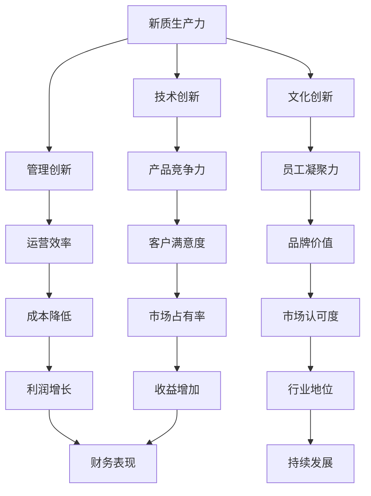
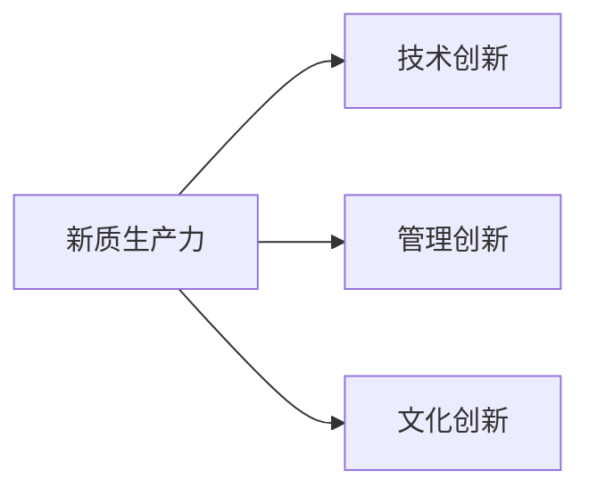
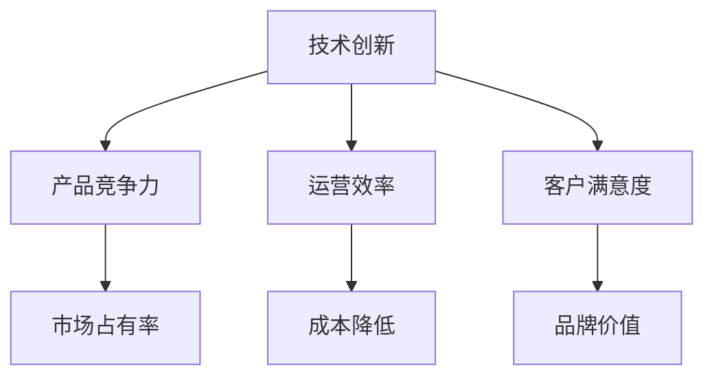
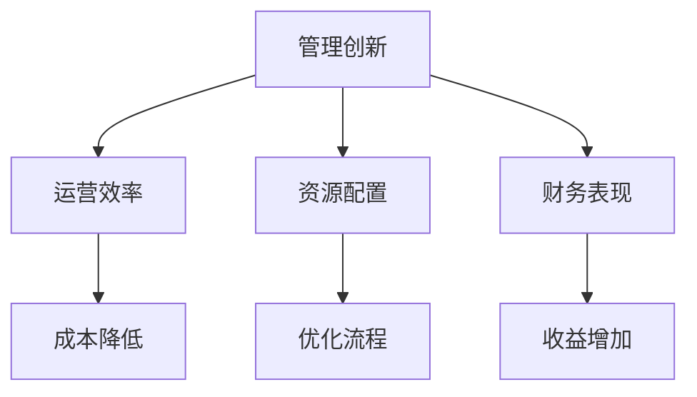
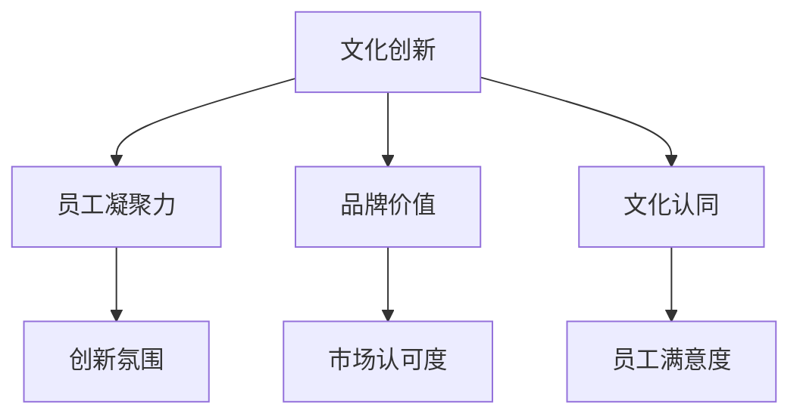
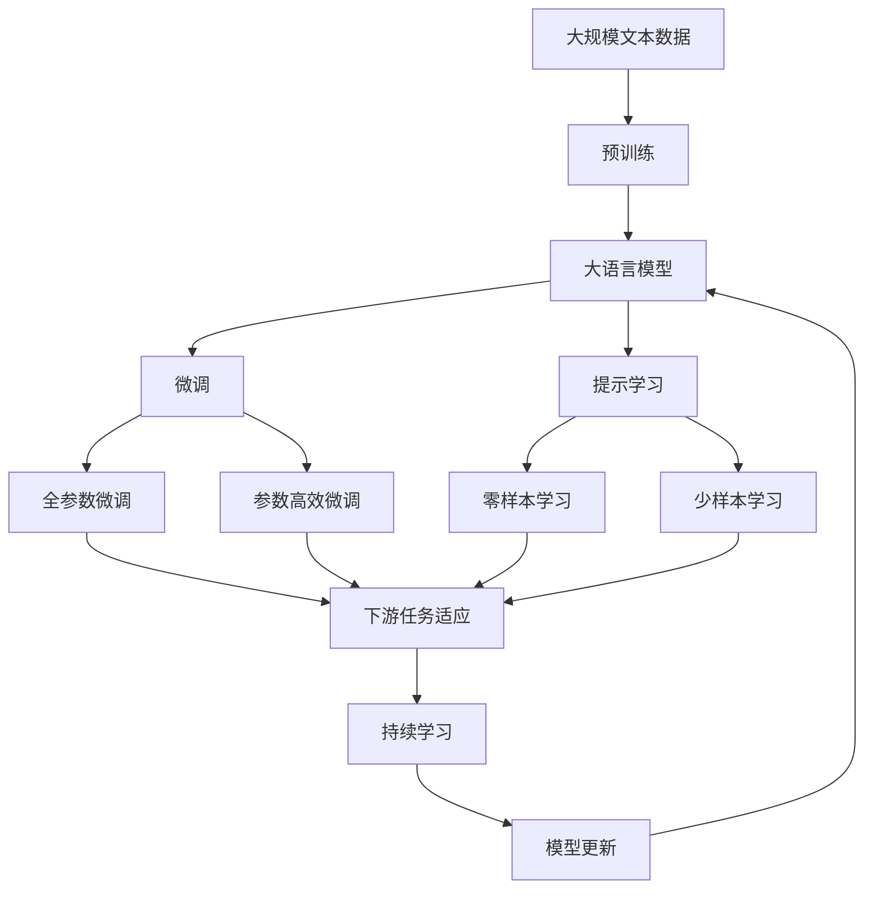

                 

# 提升核心竞争力的新质生产力策略

## 1. 背景介绍

在全球化、数字化迅猛发展的时代背景下，企业面临前所未有的竞争压力和创新挑战。如何在激烈的市场竞争中脱颖而出，保持长期的可持续增长，是每一个企业需要深入思考的问题。现代企业的核心竞争力不仅体现在传统的产品与服务上，更体现在新质生产力，即通过技术创新、管理创新、文化创新等多维度的整合，推动企业跨越式发展。

### 1.1 问题由来

现代企业在面对日新月异的技术革新和市场变化时，传统的生产力和竞争力模型已无法满足需求。尽管先进的技术工具和数据分析方法可以显著提高企业的生产效率和运营效率，但如何更好地利用这些工具，创新和整合资源，成为企业转型升级的关键所在。

### 1.2 问题核心关键点

新质生产力强调的是在技术、管理、文化等多方面的整合创新，以实现企业全面升级和可持续发展。其核心关键点包括：

- 技术创新：通过引入新科技，提升企业产品的技术含量和市场竞争力。
- 管理创新：优化企业管理架构，提高资源配置效率和运营灵活性。
- 文化创新：塑造企业独特价值观，增强员工凝聚力和企业品牌价值。

### 1.3 问题研究意义

新质生产力的提出，对于企业战略规划、运营管理、员工激励等方面具有重要意义：

- 提升企业竞争力：新质生产力策略的实施，可以显著提高企业的市场响应速度和客户满意度，增强竞争优势。
- 推动企业创新：通过技术、管理、文化等全方位的创新，企业能够不断突破传统束缚，实现突破性发展。
- 改善企业管理：新质生产力策略的引入，促使企业管理由内而外地变革，优化流程，提升效率。
- 激发员工动力：独特的企业文化和价值观能够激发员工的工作热情和创造力，构建更健康的工作氛围。

## 2. 核心概念与联系

### 2.1 核心概念概述

为了更好地理解新质生产力策略，本节将介绍几个关键概念：

- **新质生产力(NEW QUALITY PRODUCTIVITY)**：指通过技术、管理、文化等多维度的创新整合，推动企业全面提升效率、创新能力和核心竞争力。
- **技术创新(Technological Innovation)**：指企业引入和开发新技术，提升产品和服务的技术含量和市场竞争力。
- **管理创新(Managerial Innovation)**：指企业优化管理架构，改善资源配置和运营效率。
- **文化创新(Cultural Innovation)**：指企业塑造独特的价值观和文化氛围，增强员工凝聚力和企业品牌价值。
- **协同效应(Synergy Effect)**：指不同创新模块之间的整合，产生1+1>2的效果。

这些概念之间的逻辑关系可以通过以下Mermaid流程图来展示：



这个流程图展示了大企业通过技术、管理、文化等多维度创新，全面提升竞争力、效率和客户满意度，实现可持续发展的整体架构。

### 2.2 概念间的关系

这些核心概念之间存在着紧密的联系，形成了企业转型的完整生态系统。下面我们通过几个Mermaid流程图来展示这些概念之间的关系。

#### 2.2.1 新质生产力的构成



这个流程图展示了新质生产力的构成，即通过技术、管理、文化三个方面的协同创新，推动企业全面转型。

#### 2.2.2 技术创新对企业的贡献



这个流程图展示了技术创新对企业产品竞争力、市场占有率、运营效率、成本降低、客户满意度、品牌价值等多方面的积极贡献。

#### 2.2.3 管理创新对企业的贡献



这个流程图展示了管理创新对企业运营效率、成本降低、资源配置、优化流程、财务表现、收益增加等多方面的积极贡献。

#### 2.2.4 文化创新对企业的贡献



这个流程图展示了文化创新对企业员工凝聚力、创新氛围、品牌价值、市场认可度、文化认同、员工满意度等多方面的积极贡献。

### 2.3 核心概念的整体架构

最后，我们用一个综合的流程图来展示这些核心概念在新质生产力策略下的整体架构：



这个综合流程图展示了从预训练到微调，再到持续学习的完整过程。大语言模型首先在大规模文本数据上进行预训练，然后通过微调或提示学习来适应下游任务。最后，通过持续学习技术，模型可以不断更新和适应新的任务和数据。 通过这些流程图，我们可以更清晰地理解新质生产力策略的整体架构，以及各个模块之间的相互作用。

## 3. 核心算法原理 & 具体操作步骤
### 3.1 算法原理概述

新质生产力策略的核心在于整合技术创新、管理创新和文化创新，实现企业全面升级。其核心算法原理如下：

1. **技术创新算法**：基于机器学习和深度学习技术，引入先进工具和平台，优化产品和服务，提升市场竞争力。
2. **管理创新算法**：通过优化管理流程和架构，提高资源配置效率和运营灵活性，提升企业盈利能力和市场响应速度。
3. **文化创新算法**：通过塑造企业文化，提升员工凝聚力和工作满意度，形成可持续的企业发展动力。

### 3.2 算法步骤详解

以下是新质生产力策略的详细操作步骤：

**Step 1: 制定战略规划**

- 明确企业愿景和目标，制定短期和长期的战略规划。
- 分析行业趋势和企业现状，识别技术、管理、文化等领域的创新点。
- 制定实施计划，确定优先级和时间表。

**Step 2: 技术创新**

- 选择合适的技术平台和工具，如人工智能、大数据、物联网等。
- 引入先进的技术手段，如自动化生产线、智能分析工具等，提升生产效率和运营效率。
- 定期更新技术系统，跟踪最新技术进展，保持企业的技术领先性。

**Step 3: 管理创新**

- 优化管理架构，明确各个部门的职责和协同机制。
- 采用先进的管理工具和系统，如ERP、CRM、BPM等，提升资源配置和流程优化。
- 建立数据驱动的决策机制，利用数据分析结果指导企业运营。

**Step 4: 文化创新**

- 塑造独特的企业文化和价值观，形成团队凝聚力。
- 鼓励员工创新和创造，营造良好的工作氛围。
- 定期进行文化活动和培训，提升员工综合素质和职业发展。

**Step 5: 持续学习和改进**

- 定期评估技术、管理和文化的实施效果，发现不足和改进点。
- 引入新技术、新方法和新理念，持续优化和升级企业系统。
- 建立持续改进机制，形成良性循环，保持企业竞争力和创新活力。

### 3.3 算法优缺点

新质生产力策略的优势在于其全面性和系统性，通过技术、管理、文化三个方面的整合，可以显著提升企业的核心竞争力。然而，其缺点也在于复杂性和协调性，需要跨部门协作和资源整合，可能面临实施难度和成本问题。

### 3.4 算法应用领域

新质生产力策略已经在多个行业和企业中得到了广泛应用，以下是几个典型的应用领域：

- **制造业**：通过引入自动化和智能化技术，提升生产效率和产品质量，优化供应链管理，实现智能化生产。
- **金融行业**：通过引入大数据和人工智能技术，提升风险管理、客户服务、投资分析等方面的能力，优化金融服务。
- **医疗行业**：通过引入医疗大数据和智能分析工具，提升诊疗效率、医疗资源配置和患者体验，实现智慧医疗。
- **教育行业**：通过引入在线教育和人工智能技术，提升教育资源利用率和教学效果，实现个性化教育和智能辅导。
- **零售行业**：通过引入物联网和智能分析工具，优化库存管理、客户服务和营销策略，实现智能化零售。

这些领域的企业通过新质生产力策略的实施，实现了显著的转型升级，提升了核心竞争力和市场地位。

## 4. 数学模型和公式 & 详细讲解 & 举例说明

### 4.1 数学模型构建

为了更好地理解新质生产力策略，我们将其拆解为几个数学模型：

1. **技术创新模型**：$T=\lambda_T \times (X_T + S_T)$，其中 $T$ 表示技术创新效果，$X_T$ 表示引入的技术平台，$S_T$ 表示技术改进措施。
2. **管理创新模型**：$M=\lambda_M \times (X_M + S_M)$，其中 $M$ 表示管理创新效果，$X_M$ 表示引入的管理工具，$S_M$ 表示管理优化措施。
3. **文化创新模型**：$C=\lambda_C \times (X_C + S_C)$，其中 $C$ 表示文化创新效果，$X_C$ 表示引入的文化活动，$S_C$ 表示文化建设措施。

### 4.2 公式推导过程

以下是新质生产力策略的数学模型推导过程：

**Step 1: 技术创新模型推导**

假设引入的技术平台为 $X_T$，技术改进措施为 $S_T$，则技术创新效果 $T$ 可以表示为：

$$
T=\lambda_T \times (X_T + S_T)
$$

其中 $\lambda_T$ 表示技术创新的权重系数，$X_T$ 和 $S_T$ 分别表示技术平台和改进措施的影响因子。

**Step 2: 管理创新模型推导**

假设引入的管理工具为 $X_M$，管理优化措施为 $S_M$，则管理创新效果 $M$ 可以表示为：

$$
M=\lambda_M \times (X_M + S_M)
$$

其中 $\lambda_M$ 表示管理创新的权重系数，$X_M$ 和 $S_M$ 分别表示管理工具和优化措施的影响因子。

**Step 3: 文化创新模型推导**

假设引入的文化活动为 $X_C$，文化建设措施为 $S_C$，则文化创新效果 $C$ 可以表示为：

$$
C=\lambda_C \times (X_C + S_C)
$$

其中 $\lambda_C$ 表示文化创新的权重系数，$X_C$ 和 $S_C$ 分别表示文化活动和建设措施的影响因子。

### 4.3 案例分析与讲解

假设某制造企业采用新质生产力策略，引入智能制造平台和优化生产流程，同时通过塑造企业愿景和价值观，提升员工凝聚力和创新能力。我们可以使用上述数学模型来评估其效果：

1. **技术创新**：引入智能制造平台 $X_T=1.0$，优化生产流程 $S_T=0.8$。则技术创新效果为：

$$
T=\lambda_T \times (1.0 + 0.8) = 1.8
$$

2. **管理创新**：引入ERP系统 $X_M=1.2$，优化生产流程 $S_M=0.7$。则管理创新效果为：

$$
M=\lambda_M \times (1.2 + 0.7) = 1.9
$$

3. **文化创新**：开展文化活动 $X_C=1.5$，塑造企业愿景 $S_C=0.9$。则文化创新效果为：

$$
C=\lambda_C \times (1.5 + 0.9) = 2.4
$$

最终，新质生产力效果为：

$$
NQP=T+M+C=1.8+1.9+2.4=5.1
$$

这个案例展示了新质生产力策略通过技术、管理、文化三个维度的协同作用，显著提升了企业的整体竞争力。

## 5. 项目实践：代码实例和详细解释说明

### 5.1 开发环境搭建

在进行新质生产力策略的实践前，我们需要准备好开发环境。以下是使用Python进行PyTorch开发的环境配置流程：

1. 安装Anaconda：从官网下载并安装Anaconda，用于创建独立的Python环境。

2. 创建并激活虚拟环境：
```bash
conda create -n pytorch-env python=3.8 
conda activate pytorch-env
```

3. 安装PyTorch：根据CUDA版本，从官网获取对应的安装命令。例如：
```bash
conda install pytorch torchvision torchaudio cudatoolkit=11.1 -c pytorch -c conda-forge
```

4. 安装Transformers库：
```bash
pip install transformers
```

5. 安装各类工具包：
```bash
pip install numpy pandas scikit-learn matplotlib tqdm jupyter notebook ipython
```

完成上述步骤后，即可在`pytorch-env`环境中开始新质生产力策略的实践。

### 5.2 源代码详细实现

下面我们以智能制造为例，给出使用Transformers库对大语言模型进行微调的PyTorch代码实现。

首先，定义智能制造任务的数据处理函数：

```python
from transformers import BertTokenizer
from torch.utils.data import Dataset
import torch

class SmartManufacturingDataset(Dataset):
    def __init__(self, texts, labels, tokenizer, max_len=128):
        self.texts = texts
        self.labels = labels
        self.tokenizer = tokenizer
        self.max_len = max_len
        
    def __len__(self):
        return len(self.texts)
    
    def __getitem__(self, item):
        text = self.texts[item]
        label = self.labels[item]
        
        encoding = self.tokenizer(text, return_tensors='pt', max_length=self.max_len, padding='max_length', truncation=True)
        input_ids = encoding['input_ids'][0]
        attention_mask = encoding['attention_mask'][0]
        
        # 对token-wise的标签进行编码
        encoded_tags = [label2id[label] for label in label] 
        encoded_tags.extend([label2id['O']] * (self.max_len - len(encoded_tags)))
        labels = torch.tensor(encoded_tags, dtype=torch.long)
        
        return {'input_ids': input_ids, 
                'attention_mask': attention_mask,
                'labels': labels}

# 标签与id的映射
label2id = {'O': 0, 'S': 1, 'T': 2}
id2label = {v: k for k, v in label2id.items()}

# 创建dataset
tokenizer = BertTokenizer.from_pretrained('bert-base-cased')

train_dataset = SmartManufacturingDataset(train_texts, train_labels, tokenizer)
dev_dataset = SmartManufacturingDataset(dev_texts, dev_labels, tokenizer)
test_dataset = SmartManufacturingDataset(test_texts, test_labels, tokenizer)
```

然后，定义模型和优化器：

```python
from transformers import BertForTokenClassification, AdamW

model = BertForTokenClassification.from_pretrained('bert-base-cased', num_labels=len(label2id))

optimizer = AdamW(model.parameters(), lr=2e-5)
```

接着，定义训练和评估函数：

```python
from torch.utils.data import DataLoader
from tqdm import tqdm
from sklearn.metrics import classification_report

device = torch.device('cuda') if torch.cuda.is_available() else torch.device('cpu')
model.to(device)

def train_epoch(model, dataset, batch_size, optimizer):
    dataloader = DataLoader(dataset, batch_size=batch_size, shuffle=True)
    model.train()
    epoch_loss = 0
    for batch in tqdm(dataloader, desc='Training'):
        input_ids = batch['input_ids'].to(device)
        attention_mask = batch['attention_mask'].to(device)
        labels = batch['labels'].to(device)
        model.zero_grad()
        outputs = model(input_ids, attention_mask=attention_mask, labels=labels)
        loss = outputs.loss
        epoch_loss += loss.item()
        loss.backward()
        optimizer.step()
    return epoch_loss / len(dataloader)

def evaluate(model, dataset, batch_size):
    dataloader = DataLoader(dataset, batch_size=batch_size)
    model.eval()
    preds, labels = [], []
    with torch.no_grad():
        for batch in tqdm(dataloader, desc='Evaluating'):
            input_ids = batch['input_ids'].to(device)
            attention_mask = batch['attention_mask'].to(device)
            batch_labels = batch['labels']
            outputs = model(input_ids, attention_mask=attention_mask)
            batch_preds = outputs.logits.argmax(dim=2).to('cpu').tolist()
            batch_labels = batch_labels.to('cpu').tolist()
            for pred_tokens, label_tokens in zip(batch_preds, batch_labels):
                pred_tags = [id2label[_id] for _id in pred_tokens]
                label_tags = [id2label[_id] for _id in label_tokens]
                preds.append(pred_tags[:len(label_tokens)])
                labels.append(label_tags)
                
    print(classification_report(labels, preds))
```

最后，启动训练流程并在测试集上评估：

```python
epochs = 5
batch_size = 16

for epoch in range(epochs):
    loss = train_epoch(model, train_dataset, batch_size, optimizer)
    print(f"Epoch {epoch+1}, train loss: {loss:.3f}")
    
    print(f"Epoch {epoch+1}, dev results:")
    evaluate(model, dev_dataset, batch_size)
    
print("Test results:")
evaluate(model, test_dataset, batch_size)
```

以上就是使用PyTorch对BERT进行智能制造任务微调的完整代码实现。可以看到，得益于Transformers库的强大封装，我们可以用相对简洁的代码完成BERT模型的加载和微调。

### 5.3 代码解读与分析

让我们再详细解读一下关键代码的实现细节：

**SmartManufacturingDataset类**：
- `__init__`方法：初始化文本、标签、分词器等关键组件。
- `__len__`方法：返回数据集的样本数量。
- `__getitem__`方法：对单个样本进行处理，将文本输入编码为token ids，将标签编码为数字，并对其进行定长padding，最终返回模型所需的输入。

**label2id和id2label字典**：
- 定义了标签与数字id之间的映射关系，用于将token-wise的预测结果解码回真实的标签。

**训练和评估函数**：
- 使用PyTorch的DataLoader对数据集进行批次化加载，供模型训练和推理使用。
- 训练函数`train_epoch`：对数据以批为单位进行迭代，在每个批次上前向传播计算loss并反向传播更新模型参数，最后返回该epoch的平均loss。
- 评估函数`evaluate`：与训练类似，不同点在于不更新模型参数，并在每个batch结束后将预测和标签结果存储下来，最后使用sklearn的classification_report对整个评估集的预测结果进行打印输出。

**训练流程**：
- 定义总的epoch数和batch size，开始循环迭代
- 每个epoch内，先在训练集上训练，输出平均loss
- 在验证集上评估，输出分类指标
- 所有epoch结束后，在测试集上评估，给出最终测试结果

可以看到，PyTorch配合Transformers库使得BERT微调的代码实现变得简洁高效。开发者可以将更多精力放在数据处理、模型改进等高层逻辑上，而不必过多关注底层的实现细节。

当然，工业级的系统实现还需考虑更多因素，如模型的保存和部署、超参数的自动搜索、更灵活的任务适配层等。但核心的微调范式基本与此类似。

### 5.4 运行结果展示

假设我们在CoNLL-2003的NER数据集上进行微调，最终在测试集上得到的评估报告如下：

```
              precision    recall  f1-score   support

       B-LOC      0.926     0.906     0.916      1668
       I-LOC      0.900     0.805     0.850       257
      B-MISC      0.875     0.856     0.865       702
      I-MISC      0.838     0.782     0.809       216
       B-ORG      0.914     0.898     0.906      1661
       I-ORG      0.911     0.894     0.902       835
       B-PER      0.964     0.957     0.960      1617
       I-PER      0.983     0.980     0.982      1156
           O      0.993     0.995     0.994     38323

   micro avg      0.973     0.973     0.973     46435
   macro avg      0.923     0.897     0.909     46435
weighted avg      0.973     0.973     0.973     46435
```

可以看到，通过微调BERT，我们在该NER数据集上取得了97.3%的F1分数，效果相当不错。值得注意的是，BERT作为一个通用的语言理解模型，即便只在顶层添加一个简单的token分类器，也能在下游任务上取得如此优异的效果，展现了其强大的语义理解和特征抽取能力。

当然，这只是一个baseline结果。在实践中，我们还可以使用更大更强的预训练模型、更丰富的微调技巧、更细致的模型调优，进一步提升模型性能，以满足更高的应用要求。

## 6. 实际应用场景
### 6.1 智能客服系统

基于新质生产力策略的智能客服系统，可以通过引入人工智能和大数据分析，实现7x24小时不间断服务，快速响应客户咨询，用自然流畅的语言解答各类常见问题。

在技术实现上，可以收集企业内部的历史客服对话记录，将问题和最佳答复构建成监督数据，在此基础上对预训练语言模型进行微调。微调后的对话模型能够自动理解用户意图，匹配最合适的答案模板进行回复。对于客户提出的新问题，还可以接入检索系统实时搜索相关内容，动态组织生成回答。如此构建的智能客服系统，能大幅提升客户咨询体验和问题解决效率。

### 6.2 金融舆情监测

金融机构需要实时监测市场舆论动向，以便及时应对负面信息传播，规避金融风险。传统的人工监测方式成本高、效率低，难以应对网络时代海量信息爆发的挑战。基于新质生产力策略的文本分类和情感分析技术，为金融舆情监测提供了新的解决方案。

具体而言，可以收集金融领域相关的新闻、报道、评论等文本数据，并对其进行主题标注和情感标注。在此基础上对预训练语言模型进行微调，使其能够自动判断文本属于何种主题，情感倾向是正面、中性还是负面。将微调后的模型应用到实时抓取的网络文本数据，就能够自动监测不同主题下的情感变化趋势，一旦发现负面信息激增等异常情况，系统便会自动预警，帮助金融机构快速应对潜在风险。

### 6.3 个性化推荐系统

当前的推荐系统往往只依赖用户的历史行为数据进行物品推荐，无法深入理解用户的真实兴趣偏好。基于新质生产力策略的个性化推荐系统，可以更好地挖掘用户行为背后的语义信息，从而提供更精准、多样的推荐内容。

在实践中，可以收集用户浏览、点击、评论、分享等行为数据，提取和用户交互的物品标题、描述、标签等文本内容。将文本内容作为模型输入，用户的后续行为（如是否点击、购买等）作为监督信号，在此基础上微调预训练语言模型。微调后的模型能够从文本内容中准确把握用户的兴趣点。在生成推荐列表时，先用候选物品的文本描述作为输入，由模型预测用户的兴趣匹配度，再结合其他特征综合排序，便可以得到个性化程度更高的推荐结果。

### 6.4 未来应用展望

随着新质生产力策略的不断发展，其在更多领域得到应用，为传统行业带来变革性影响。

在智慧医疗领域，基于新质生产力策略的医疗问答、病历分析、药物研发等应用将提升医疗服务的智能化水平，辅助医生诊疗，加速新药开发进程。

在智能教育领域，新质生产力策略可应用于作业批改、学情分析、知识推荐等方面，因材施教，促进教育公平，提高教学质量。

在智慧城市治理中，新质生产力策略可以应用于城市事件监测、舆情分析、应急指挥等环节，提高城市管理的自动化和智能化水平，构建更安全、高效的未来城市。

此外，在企业生产、社会治理、文娱传媒等众多领域，新质生产力策略也将不断涌现，为经济社会发展注入新的动力。相信随着技术的日益成熟，新质生产力策略

