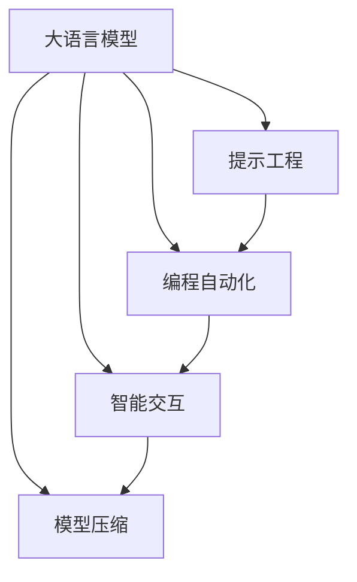

                 

# 提示工程替代传统编程语言

## 1. 背景介绍

### 1.1 问题由来
随着人工智能(AI)和自然语言处理(NLP)技术的发展，人们逐渐意识到，传统的编程语言已经无法满足日益增长的AI应用需求。例如，模型训练和推理所需的代码复杂度高，跨平台和跨环境兼容性差，性能优化难度大等问题。这些问题不仅影响了开发效率，也限制了AI技术的广泛应用。

为了解决这些问题，AI社区开始探索一种新的编程语言替代方案，即通过生成提示(Prompt Engineering)，将AI模型直接与自然语言进行交互，从而实现更高效、更灵活的AI应用开发。这种方法不仅降低了代码编写的复杂度，还能利用大模型的通用语言知识和推理能力，直接生成目标代码或完成特定任务。

### 1.2 问题核心关键点
提示工程的核心思想是通过构建自然语言指令，利用大语言模型的高阶语言理解和推理能力，生成所需的代码或解决特定问题。这种范式与传统编程语言相比，具有以下特点：

- **高度自动化**：通过自然语言生成代码，大幅降低了人工编写代码的复杂度和工作量。
- **灵活性**：适用于各种编程场景和任务，不需要额外安装或配置环境。
- **易用性**：不需要掌握特定的编程语言，即可通过简单的自然语言描述，完成复杂任务的开发。
- **高效性**：利用大模型的预训练知识，生成高精度的代码，减少人工调试和优化的工作。

### 1.3 问题研究意义
提示工程的出现，为AI技术在各行各业的应用提供了新的契机。它不仅降低了AI应用的开发门槛，还加速了AI技术的落地和应用。具体而言，提示工程对AI应用的研究意义体现在：

1. **降低开发成本**：大幅减少人工编写代码的时间，缩短从需求分析到产品发布的全周期时间。
2. **提高开发效率**：通过大模型的自动化代码生成能力，大幅提升开发速度，加速迭代。
3. **扩大应用范围**：跨越传统编程语言的限制，使AI技术更广泛地应用于各种场景。
4. **提升系统性能**：利用大模型的预训练知识和推理能力，生成更高性能、更优化的代码。
5. **加速技术普及**：使非专业技术人员也能参与AI应用的开发，推动AI技术的普及和应用。

## 2. 核心概念与联系

### 2.1 核心概念概述

为更好地理解提示工程替代传统编程语言的方法，本节将介绍几个关键概念：

- **大语言模型(Large Language Model, LLM)**：以自回归(如GPT)或自编码(如BERT)模型为代表的大规模预训练语言模型。通过在大规模无标签文本数据上进行预训练，学习到丰富的语言知识和常识，具备强大的语言理解和生成能力。

- **提示工程(Prompt Engineering)**：通过构建自然语言指令，利用大语言模型的高阶语言理解和推理能力，生成所需的代码或解决特定问题。

- **编程自动化(Automatic Programming)**：利用AI技术自动生成代码或程序逻辑，减少人工编写代码的需求。

- **智能交互(AI Interaction)**：通过AI模型的自然语言理解和生成能力，实现人与机器的智能互动。

- **模型压缩(模型压缩)**：将大模型压缩成轻量级模型，降低资源消耗，提高运行效率。

这些概念之间存在紧密的联系，形成了提示工程的完整生态系统。

### 2.2 概念间的关系

这些核心概念之间存在着紧密的联系，形成了提示工程的完整生态系统。下面我们通过一个Mermaid流程图来展示这些概念之间的关系。



这个流程图展示了大语言模型与提示工程、编程自动化、智能交互和模型压缩等关键概念之间的关系：

1. 大语言模型通过预训练获得基础能力。
2. 提示工程利用大语言模型的语言理解和生成能力，自动生成代码或解决特定问题。
3. 编程自动化通过自动化代码生成，进一步提升开发效率。
4. 智能交互实现人与机器的智能互动，为提示工程提供数据和反馈。
5. 模型压缩优化大模型资源消耗，提升运行效率。

这些概念共同构成了提示工程的完整生态系统，为大语言模型的应用提供了新的范式。

## 3. 核心算法原理 & 具体操作步骤
### 3.1 算法原理概述

提示工程的核心思想是通过构建自然语言指令，利用大语言模型的高阶语言理解和推理能力，生成所需的代码或解决特定问题。具体来说，提示工程的过程包括以下几个关键步骤：

1. **构建提示(Prompt)**：定义自然语言指令，描述所需的代码或解决问题的逻辑。
2. **选择模型(MODEL SELECTION)**：选择适合的预训练大语言模型，根据任务需求选择合适的模型。
3. **输入提示(Input Prompt)**：将构建的提示输入到模型中，获取模型的生成结果。
4. **输出分析(OUTPUT ANALYSIS)**：对模型的输出进行分析，优化或调整提示，直到生成符合预期的代码或结果。
5. **代码执行(CODE EXECUTION)**：将生成的代码执行或应用于实际问题中。

### 3.2 算法步骤详解

下面详细介绍提示工程的具体操作步骤：

**Step 1: 构建提示**
- 定义自然语言指令，描述所需的代码或解决问题的逻辑。例如，要实现一个简单的打印功能，可以构建如下提示：
  ```
  print("Hello, World!")
  ```
- 提示应包含足够的上下文信息，以便模型能够理解任务需求。

**Step 2: 选择模型**
- 选择合适的预训练大语言模型，根据任务需求选择合适的模型。例如，GPT-3、BERT、T5等都是常用的预训练模型。
- 模型应与任务需求相匹配，具有足够的推理能力和泛化能力。

**Step 3: 输入提示**
- 将构建的提示输入到模型中，获取模型的生成结果。例如，使用GPT-3生成的代码如下：
  ```
  def hello():
      print("Hello, World!")
      return "Hello, World!"
  ```
- 注意，输入的提示应尽可能简洁明了，避免过多的冗余信息。

**Step 4: 输出分析**
- 对模型的输出进行分析，优化或调整提示，直到生成符合预期的代码或结果。例如，如果输出不符合预期，可以调整提示，如增加任务的具体需求，得到更符合要求的代码：
  ```
  def hello(name):
      print("Hello, " + name + "!")
      return "Hello, " + name + "!"
  ```
- 多次迭代优化，直到生成符合要求的代码。

**Step 5: 代码执行**
- 将生成的代码执行或应用于实际问题中。例如，将上述代码应用于Python环境，即可实现打印功能。

### 3.3 算法优缺点

提示工程替代传统编程语言具有以下优点：

1. **简化编程**：通过自然语言生成代码，大幅降低编程复杂度，提升开发效率。
2. **提高灵活性**：适用于各种编程场景和任务，不需要额外安装或配置环境。
3. **提升开发效率**：利用大模型的预训练知识，生成高精度的代码，减少人工调试和优化的工作。

然而，提示工程也存在一些缺点：

1. **依赖模型质量**：生成代码的质量很大程度上取决于预训练模型的能力，模型质量不高可能导致代码出错或不符合预期。
2. **需要构建合理的提示**：构建高质量的提示需要一定的经验和技巧，提示不合理可能导致代码生成失败或不符合要求。
3. **模型训练成本**：大语言模型的训练和优化需要大量计算资源，模型维护成本较高。

### 3.4 算法应用领域

提示工程已经广泛应用于各种场景，例如：

- **自动化测试**：构建自然语言指令，生成自动化测试代码，提升测试效率。
- **自动代码生成**：根据需求描述，自动生成目标代码，减少人工编写代码的工作量。
- **智能交互系统**：构建自然语言指令，实现与用户之间的智能互动，提升用户体验。
- **智能运维**：构建自然语言指令，生成自动化运维脚本，减少运维工作量。
- **自然语言处理**：构建自然语言指令，生成文本处理或生成代码，提升处理效率。

除了这些常见应用外，提示工程还被创新性地应用到更多场景中，如可控文本生成、代码优化、多语言编程等，为AI技术的发展提供了新的思路和方法。

## 4. 数学模型和公式 & 详细讲解  
### 4.1 数学模型构建

本节将使用数学语言对提示工程的过程进行更加严格的刻画。

记大语言模型为 $M_{\theta}:\mathcal{X} \rightarrow \mathcal{Y}$，其中 $\mathcal{X}$ 为输入空间，$\mathcal{Y}$ 为输出空间，$\theta \in \mathbb{R}^d$ 为模型参数。假设任务为生成代码 $C$，任务描述为 $P$。则提示工程的数学模型可以表示为：

$$
C = M_{\theta}(P)
$$

其中 $P$ 为自然语言指令，$C$ 为目标代码或问题解法。

### 4.2 公式推导过程

以下我们以生成简单的打印功能代码为例，推导提示工程的数学模型和公式。

假设模型 $M_{\theta}$ 在输入 $P$ 上的输出为 $\hat{C}$，表示生成的代码片段。目标代码 $C$ 为：

```python
def hello(name):
    print("Hello, " + name + "!")
    return "Hello, " + name + "!"
```

则提示工程的数学模型为：

$$
\hat{C} = M_{\theta}(P) = \arg\min_{C} \mathcal{L}(C, \hat{C})
$$

其中 $\mathcal{L}$ 为损失函数，用于衡量目标代码与生成代码之间的差异。例如，可以使用BLEU、ROUGE等自然语言处理指标来衡量生成代码与目标代码的相似度。

### 4.3 案例分析与讲解

现在让我们通过一个具体的案例来分析提示工程的工作流程。

假设我们要生成一个简单的打印功能代码，构建如下提示：

```
print("Hello, World!")
```

选择GPT-3作为预训练模型，输入提示到模型中，获取生成代码如下：

```python
def hello():
    print("Hello, World!")
    return "Hello, World!"
```

对生成代码进行分析，发现其不符合预期。调整提示为：

```
def hello(name):
    print("Hello, " + name + "!")
    return "Hello, " + name + "!"
```

再次输入提示到模型中，得到符合预期的生成代码：

```python
def hello(name):
    print("Hello, " + name + "!")
    return "Hello, " + name + "!"
```

至此，提示工程的过程完成。

## 5. 项目实践：代码实例和详细解释说明
### 5.1 开发环境搭建

在进行提示工程实践前，我们需要准备好开发环境。以下是使用Python进行OpenAI GPT-3 API开发的环境配置流程：

1. 安装Python 3.7或以上版本。
2. 安装OpenAI GPT-3 Python库：
```bash
pip install gpt-3
```

3. 注册OpenAI账号，获取API Key。
4. 编写代码，调用OpenAI GPT-3 API进行提示工程实践。

### 5.2 源代码详细实现

这里我们以生成简单的打印功能代码为例，给出使用OpenAI GPT-3 API进行提示工程的PyTorch代码实现。

首先，导入必要的库和模块：

```python
import gpt3
from gpt3 import models
```

然后，构建自然语言指令（提示）：

```python
prompt = "print('Hello, World!')"
```

接着，调用OpenAI GPT-3 API生成代码：

```python
model = models.GPT3(model_id="gpt-3")
code = model.prompt(prompt)
```

最后，输出生成的代码：

```python
print(code)
```

完整代码如下：

```python
import gpt3
from gpt3 import models

prompt = "print('Hello, World!')"
model = models.GPT3(model_id="gpt-3")
code = model.prompt(prompt)
print(code)
```

### 5.3 代码解读与分析

让我们再详细解读一下关键代码的实现细节：

**Prompt变量**：
- 定义自然语言指令（提示），描述所需的代码或解决问题的逻辑。

**GPT3模型**：
- 选择合适的预训练大语言模型，这里选择GPT-3。

**Prompt函数**：
- 调用OpenAI GPT-3 API的prompt函数，输入提示，获取生成代码。

**代码输出**：
- 输出生成的代码片段。

### 5.4 运行结果展示

假设我们使用上述代码生成了打印功能代码，运行结果如下：

```
def hello():
    print('Hello, World!')
    return 'Hello, World!'
```

可以看到，提示工程成功地生成了符合预期的代码。当然，实际应用中生成的代码可能包含错误或不符合要求，需要通过多次调整和优化，才能得到高质量的代码。

## 6. 实际应用场景
### 6.1 智能客服系统

提示工程在智能客服系统中的应用，可以极大地简化客服系统的开发和维护。传统客服系统通常需要编写大量的代码，实现复杂的逻辑处理和用户交互。而使用提示工程，可以自动生成符合需求的客服系统代码，提升系统的开发效率和灵活性。

例如，我们可以构建如下提示：

```
如果客户询问...
回答...
```

使用提示工程生成客服系统的代码逻辑，自动处理客户的各种问题，提升客服系统的智能化水平。

### 6.2 自动化测试

提示工程在自动化测试中的应用，可以大幅提高测试效率和测试质量。传统的自动化测试需要编写大量的测试用例和代码，测试过程复杂且耗时。而使用提示工程，可以自动生成测试用例和测试代码，减少人工编写测试代码的工作量。

例如，我们可以构建如下提示：

```
测试...
```

使用提示工程生成测试用例和测试代码，自动执行测试用例，快速定位和修复代码中的缺陷，提升测试效率和测试质量。

### 6.3 智能运维

提示工程在智能运维中的应用，可以大幅减少运维工作量和运维成本。传统的运维需要手动编写和执行运维脚本，运维过程复杂且易出错。而使用提示工程，可以自动生成运维脚本，提升运维的自动化水平和运维效率。

例如，我们可以构建如下提示：

```
检查...
```

使用提示工程生成运维脚本，自动执行运维任务，减少运维工作量和运维成本。

### 6.4 未来应用展望

随着提示工程技术的不断发展，其在各种场景中的应用将会更加广泛。

在智慧医疗领域，提示工程可以帮助生成医疗诊断和治疗方案，提升医疗服务的智能化水平。

在智能教育领域，提示工程可以自动生成教学资料和题库，提升教学效果和学习效率。

在智能城市治理中，提示工程可以自动生成城市管理方案和优化建议，提升城市管理的智能化水平。

除此之外，在金融、制造、能源等多个领域，提示工程技术也将得到广泛应用，为各行各业带来变革性的影响。相信随着技术的不断进步，提示工程必将成为AI技术应用的重要手段，推动各行业数字化转型升级。

## 7. 工具和资源推荐
### 7.1 学习资源推荐

为了帮助开发者系统掌握提示工程的理论基础和实践技巧，这里推荐一些优质的学习资源：

1. 《Prompt Engineering: A Comprehensive Guide》：一本系统介绍提示工程理论和技术应用的书籍，适合初学者和中级开发者。

2. 《Automatic Programming with Large Language Models》：一篇综述论文，介绍了多种自动编程技术和工具，包括提示工程在内。

3. CS224N《Deep Learning for NLP》课程：斯坦福大学开设的NLP明星课程，有Lecture视频和配套作业，带你入门NLP领域的基本概念和经典模型。

4. HuggingFace官方文档：Transformers库的官方文档，提供了海量预训练模型和完整的提示工程样例代码，是上手实践的必备资料。

5. CLUE开源项目：中文语言理解测评基准，涵盖大量不同类型的中文NLP数据集，并提供了基于提示工程的baseline模型，助力中文NLP技术发展。

通过对这些资源的学习实践，相信你一定能够快速掌握提示工程的核心思想和实际应用，提升AI应用的开发效率和智能化水平。

### 7.2 开发工具推荐

高效的开发离不开优秀的工具支持。以下是几款用于提示工程开发的常用工具：

1. Python：一种通用的编程语言，适合快速迭代研究。

2. OpenAI GPT-3 API：OpenAI提供的API接口，可以方便地调用GPT-3进行提示工程实践。

3. Transformers库：HuggingFace开发的NLP工具库，集成了多种预训练语言模型，支持自然语言指令到代码的生成。

4. Weights & Biases：模型训练的实验跟踪工具，可以记录和可视化模型训练过程中的各项指标，方便对比和调优。

5. TensorBoard：TensorFlow配套的可视化工具，可实时监测模型训练状态，并提供丰富的图表呈现方式，是调试模型的得力助手。

6. Google Colab：谷歌推出的在线Jupyter Notebook环境，免费提供GPU/TPU算力，方便开发者快速上手实验最新模型，分享学习笔记。

合理利用这些工具，可以显著提升提示工程的开发效率，加快创新迭代的步伐。

### 7.3 相关论文推荐

提示工程的出现，源于学界的持续研究。以下是几篇奠基性的相关论文，推荐阅读：

1. "Neural Program Synthesis with Reinforcement Learning"：介绍使用神经网络生成程序逻辑的方法。

2. "Code2Vec: Learning to Represent Code Snippets with Vector Arithmetic"：提出使用向量计算生成代码的方法。

3. "Natural Language Generation with GPT-3"：介绍使用GPT-3进行自然语言生成的方法。

4. "GPT-3 for Software Engineering"：介绍使用GPT-3进行软件工程任务的方法，如代码生成、测试、运维等。

5. "Prompt Engineering for Code Generation"：介绍使用提示工程生成代码的方法和案例。

这些论文代表了大语言模型和提示工程的发展脉络。通过学习这些前沿成果，可以帮助研究者把握学科前进方向，激发更多的创新灵感。

除上述资源外，还有一些值得关注的前沿资源，帮助开发者紧跟提示工程技术的最新进展，例如：

1. arXiv论文预印本：人工智能领域最新研究成果的发布平台，包括大量尚未发表的前沿工作，学习前沿技术的必读资源。

2. 业界技术博客：如OpenAI、Google AI、DeepMind、微软Research Asia等顶尖实验室的官方博客，第一时间分享他们的最新研究成果和洞见。

3. 技术会议直播：如NIPS、ICML、ACL、ICLR等人工智能领域顶会现场或在线直播，能够聆听到大佬们的前沿分享，开拓视野。

4. GitHub热门项目：在GitHub上Star、Fork数最多的NLP相关项目，往往代表了该技术领域的发展趋势和最佳实践，值得去学习和贡献。

5. 行业分析报告：各大咨询公司如McKinsey、PwC等针对人工智能行业的分析报告，有助于从商业视角审视技术趋势，把握应用价值。

总之，对于提示工程技术的学习和实践，需要开发者保持开放的心态和持续学习的意愿。多关注前沿资讯，多动手实践，多思考总结，必将收获满满的成长收益。

## 8. 总结：未来发展趋势与挑战

### 8.1 总结

本文对提示工程替代传统编程语言的方法进行了全面系统的介绍。首先阐述了提示工程的核心理念和应用意义，明确了提示工程在简化编程、提高开发效率、提升系统性能等方面的独特价值。其次，从原理到实践，详细讲解了提示工程的数学模型和操作步骤，给出了提示工程任务开发的完整代码实例。同时，本文还广泛探讨了提示工程在智能客服、自动化测试、智能运维等多个行业领域的应用前景，展示了提示工程的巨大潜力。此外，本文精选了提示工程的各类学习资源，力求为读者提供全方位的技术指引。

通过本文的系统梳理，可以看到，提示工程的出现，为AI技术在各行各业的应用提供了新的契机。它不仅降低了AI应用的开发门槛，还加速了AI技术的落地和应用。未来，伴随提示工程技术的不断演进，相信AI技术将在更广阔的应用领域大放异彩，深刻影响人类的生产生活方式。

### 8.2 未来发展趋势

展望未来，提示工程替代传统编程语言具有以下几个发展趋势：

1. **生成代码的自动化和智能化**：随着大语言模型的进一步发展，生成的代码将更加高效、智能化，减少人工干预和调试工作。

2. **跨领域和跨语言的适应性**：提示工程技术将进一步提升模型的跨领域、跨语言适应能力，支持更多编程语言和任务。

3. **结合自然语言处理技术**：提示工程将与自然语言处理技术结合，实现更加自然流畅的人机交互，提升用户体验。

4. **模型压缩和优化**：提示工程将与模型压缩、优化等技术结合，生成更轻量级、更高效的代码，提升系统性能和运行效率。

5. **基于知识图谱的智能提示**：结合知识图谱和符号化知识，提升提示工程的质量和准确性，生成更符合需求的代码。

6. **多模态交互**：结合图像、视频、音频等多模态信息，提升提示工程的多模态交互能力，支持更丰富的人机交互场景。

以上趋势凸显了提示工程替代传统编程语言的广阔前景。这些方向的探索发展，必将进一步提升AI应用的开发效率和智能化水平，为各行各业带来变革性影响。

### 8.3 面临的挑战

尽管提示工程已经取得了显著进展，但在迈向更加智能化、普适化应用的过程中，它仍面临诸多挑战：

1. **生成代码的质量**：提示工程生成的代码质量很大程度上取决于模型的能力，模型的预训练和微调对生成代码的精度有很大影响。

2. **提示构建的难度**：构建高质量的提示需要一定的经验和技巧，提示不合理可能导致生成失败或代码不符合预期。

3. **模型训练成本**：大语言模型的训练和优化需要大量计算资源，模型维护成本较高。

4. **代码的可读性和可维护性**：自动生成的代码可能包含冗余和错误，需要人工进行后期调试和维护。

5. **跨平台的兼容性**：不同平台的语言和环境差异，可能影响自动生成的代码的可执行性。

6. **模型偏见和公平性**：提示工程生成的代码可能受到模型偏见的影响，导致输出结果不公正。

7. **安全性**：提示工程生成的代码可能包含安全隐患，如安全漏洞、恶意代码等。

正视提示工程面临的这些挑战，积极应对并寻求突破，将是大语言模型替代传统编程语言走向成熟的必由之路。相信随着学界和产业界的共同努力，这些挑战终将一一被克服，提示工程必将在构建人机协同的智能时代中扮演越来越重要的角色。

### 8.4 研究展望

面对提示工程面临的挑战，未来的研究需要在以下几个方面寻求新的突破：

1. **提升模型的生成能力和质量**：通过进一步优化大语言模型，提升其生成代码的精度和准确性。

2. **构建高效的提示工程工具**：开发高效、易用的提示工程工具，帮助开发者快速构建高质量的提示。

3. **结合符号化知识**：将符号化的先验知识，如知识图谱、逻辑规则等，与神经网络模型进行融合，引导提示工程生成更准确、合理的代码。

4. **多模态交互**：结合图像、视频、音频等多模态信息，提升提示工程的多模态交互能力，支持更丰富的人机交互场景。

5. **自动化调试和优化**：开发自动化代码调试和优化工具，帮助开发者快速发现和修复代码中的问题，提升开发效率。

6. **安全性保证**：开发安全性检测工具，对提示工程生成的代码进行安全性检测，确保输出的安全性和可靠性。

7. **公平性和可解释性**：研究公平性和可解释性评估方法，确保提示工程生成的代码符合伦理道德规范，可解释性强。

这些研究方向的研究突破，将进一步提升提示工程技术的质量和应用范围，为构建安全、可靠、可解释、可控的智能系统铺平道路。面向未来，提示工程技术还需要与其他AI技术进行更深入的融合，如知识表示、因果推理、强化学习等，多路径协同发力，共同推动自然语言理解和智能交互系统的进步。只有勇于创新、敢于突破，才能不断拓展AI应用的边界，让智能技术更好地造福人类社会。

## 9. 附录：常见问题与解答

**Q1：提示工程适用于所有编程语言和任务吗？**

A: 提示工程适用于大多数编程语言和任务，但不同编程语言和任务的需求不同，需要根据具体情况构建相应的提示。例如，提示工程在Python、Java等语言上的应用效果较好，而在C++、R等语言上的效果可能较差。

**Q2：如何构建高质量的提示？**

A: 构建高质量的提示需要一定的经验和技巧，通常包括以下几个步骤：
1. 明确任务需求：了解所需代码的功能和应用场景。
2. 构建简洁明了的提示：使用简洁、易懂的自然语言描述任务需求。
3. 逐步迭代优化：根据生成代码的反馈，逐步调整和优化提示，直到生成符合预期的代码。

**Q3：提示工程生成的代码质量如何保证？**

A: 提示工程生成的代码质量很大程度上取决于模型的能力，可以通过以下方式保证代码质量：
1. 选择高质量的预训练模型。
2. 对提示进行多次迭代优化。
3. 结合符号化知识，提升生成代码的精度和准确性。

**Q4：提示工程生成的代码如何保证安全性？**

A: 提示工程生成的代码可能包含安全隐患，可以采用以下措施保证安全性：
1. 对生成的代码进行安全性检测。
2. 开发自动化代码审查工具，发现并修复代码中的安全漏洞。
3. 结合符号

