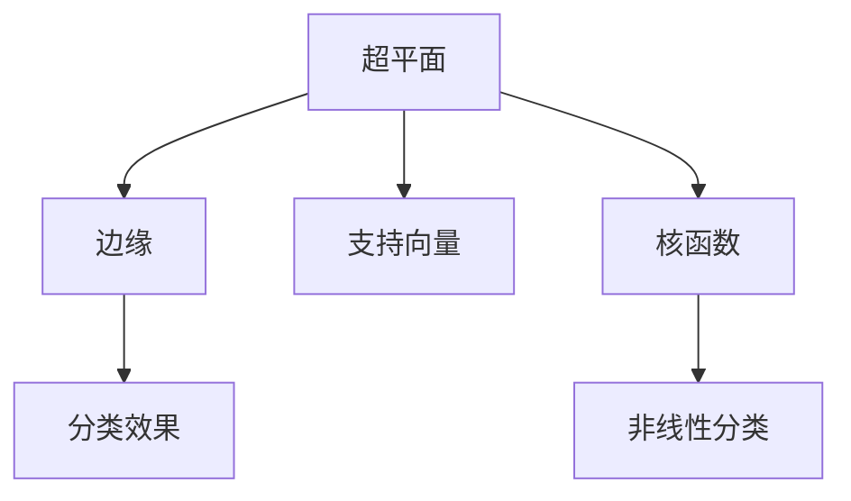
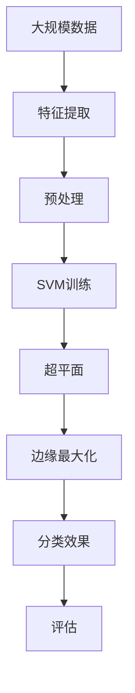

                 

# 支持向量机 原理与代码实例讲解

> 关键词：支持向量机, SVM, 机器学习, 核函数, 超平面, 边缘最大化, 非线性分类, 案例分析, 代码实例

## 1. 背景介绍

### 1.1 问题由来

支持向量机（Support Vector Machine, SVM）是一种经典的机器学习算法，广泛应用于分类、回归和异常检测等任务。它通过寻找一个最优的超平面（hyperplane）来分割不同类别的数据点，从而达到分类目的。SVM的核心思想是通过最大化类间边缘（margin）来提升分类效果。SVM在处理高维数据和非线性分类问题时表现优异，因此在计算机视觉、自然语言处理和生物信息学等领域得到了广泛应用。

### 1.2 问题核心关键点

SVM的核心在于寻找最优超平面。该超平面不仅能正确分割不同类别的数据，而且要在类间有最大的边缘。通常情况下，边缘最大化的目标可以通过求解一个凸优化问题来实现。SVM的优点包括：

- 高维数据表现良好：对于高维数据，SVM的性能往往优于其他线性分类算法。
- 泛化能力强：通过正则化参数控制模型复杂度，避免过拟合。
- 核技巧：通过核函数，SVM可以处理非线性分类问题。

但SVM也存在一些局限性，如计算复杂度高、对异常值敏感、参数调整复杂等。然而，这些局限性可以通过改进算法和调整模型参数来解决。

### 1.3 问题研究意义

SVM作为一种经典的机器学习算法，其理论和应用研究具有重要意义：

1. 理论严谨：SVM的数学基础非常稳固，有严格的正则化和损失函数定义。
2. 应用广泛：SVM在分类、回归和异常检测等领域都有广泛应用，特别是处理高维数据和非线性分类问题。
3. 算法可解释性强：SVM的决策边界和边缘最大化目标易于解释和理解，有利于模型解释和应用。
4. 算法效率高：在解决小样本学习和高维数据分类问题时，SVM通常比其他算法更高效。

## 2. 核心概念与联系

### 2.1 核心概念概述

为更好地理解SVM算法，本节将介绍几个密切相关的核心概念：

- 超平面（Hyperplane）：用于分割不同类别数据的平面或超平面。对于二维数据，超平面是一个直线；对于三维数据，超平面是一个平面。
- 边缘（Margin）：从超平面到最近数据点的距离。边缘大小越大，分类效果越好。
- 支持向量（Support Vector）：离超平面最近的训练样本，对超平面的位置和边缘大小起决定性作用。
- 核函数（Kernel Function）：将低维空间的数据映射到高维空间，使得非线性分类问题可以通过线性SVM解决。

### 2.2 概念间的关系

这些核心概念之间的逻辑关系可以通过以下Mermaid流程图来展示：



这个流程图展示了大SVM算法的基本工作流程：

1. 通过超平面分割不同类别的数据。
2. 计算边缘大小，确保超平面能最大化分类效果。
3. 支持向量是离超平面最近的训练样本，影响超平面的位置和边缘大小。
4. 核函数将低维数据映射到高维空间，使得非线性分类问题可以通过线性SVM解决。

### 2.3 核心概念的整体架构

最后，我们用一个综合的流程图来展示这些核心概念在大SVM微调过程中的整体架构：



这个综合流程图展示了从数据预处理到模型评估的全过程：

1. 大规模数据通过特征提取转化为特征向量。
2. 特征向量经过预处理，如归一化、标准化等，增强模型性能。
3. SVM算法训练得到超平面，实现分类。
4. 超平面的边缘最大化，确保分类效果。
5. 评估分类效果，根据评估结果调整模型参数。

通过这些流程图，我们可以更清晰地理解SVM的核心概念及其在大SVM微调过程中的作用。

## 3. 核心算法原理 & 具体操作步骤
### 3.1 算法原理概述

SVM算法通过求解一个凸优化问题，寻找一个最优的超平面，使得边缘最大化，从而达到分类效果。

形式化地，给定一个带有n个样本的二分类问题，每个样本为 $(x_i, y_i)$，其中 $x_i \in \mathbb{R}^d$ 是特征向量，$y_i \in \{-1, 1\}$ 是标签。训练目标是找到一个超平面 $w \cdot x_i + b = 0$ 来分割数据，使得：

1. 分类正确性最大化。
2. 边缘最大化。

数学上，这可以表示为以下凸优化问题：

$$
\begin{aligned}
&\min_{w, b, \xi} \frac{1}{2} ||w||^2 + C \sum_{i=1}^n \xi_i \\
&\text{subject to} \quad y_i(w \cdot x_i + b) \geq 1 - \xi_i, \quad \xi_i \geq 0, \quad \forall i
\end{aligned}
$$

其中 $w$ 是权重向量，$b$ 是偏置项，$\xi_i$ 是误差变量，$C$ 是正则化参数，用于控制误差变量的权重。

### 3.2 算法步骤详解

SVM算法的训练通常包括以下几个关键步骤：

1. 特征提取和预处理：将原始数据转换为特征向量，并进行预处理，如归一化、标准化等。
2. 训练模型：使用梯度下降等优化算法求解上述凸优化问题，得到最优超平面。
3. 预测分类：对于新的样本，通过计算其与超平面的距离，判断其类别。

### 3.3 算法优缺点

SVM算法的优点包括：

- 高维数据表现良好：SVM在高维数据上的分类效果优于其他线性分类算法。
- 泛化能力强：通过正则化参数控制模型复杂度，避免过拟合。
- 核技巧：通过核函数，SVM可以处理非线性分类问题。

但SVM也存在一些局限性：

- 计算复杂度高：求解凸优化问题需要计算和存储大量中间变量，计算复杂度较高。
- 对异常值敏感：SVM对异常值非常敏感，可能影响分类效果。
- 参数调整复杂：正则化参数和核函数参数的调整需要经验，可能导致模型性能不稳定。

### 3.4 算法应用领域

SVM作为一种经典的机器学习算法，在多个领域都有广泛应用：

1. 计算机视觉：用于图像分类、物体检测和目标跟踪等任务。
2. 自然语言处理：用于文本分类、情感分析和命名实体识别等任务。
3. 生物信息学：用于基因表达数据分析和蛋白质序列分类等任务。
4. 工业制造：用于故障检测和质量控制等任务。
5. 金融风险管理：用于信用评分和欺诈检测等任务。

## 4. 数学模型和公式 & 详细讲解 & 举例说明

### 4.1 数学模型构建

SVM的目标是找到一个超平面 $w \cdot x_i + b = 0$，使得分类正确性最大化，边缘最大化。数学上，这可以表示为以下优化问题：

$$
\begin{aligned}
&\min_{w, b, \xi} \frac{1}{2} ||w||^2 + C \sum_{i=1}^n \xi_i \\
&\text{subject to} \quad y_i(w \cdot x_i + b) \geq 1 - \xi_i, \quad \xi_i \geq 0, \quad \forall i
\end{aligned}
$$

其中 $w$ 是权重向量，$b$ 是偏置项，$\xi_i$ 是误差变量，$C$ 是正则化参数，用于控制误差变量的权重。

### 4.2 公式推导过程

SVM的优化目标可以通过拉格朗日乘子法求解。引入拉格朗日乘子 $\alpha_i \geq 0$，定义拉格朗日函数：

$$
L(w, b, \alpha) = \frac{1}{2} ||w||^2 + C \sum_{i=1}^n \xi_i + \sum_{i=1}^n \alpha_i(y_i(w \cdot x_i + b) - 1 + \xi_i)
$$

将拉格朗日函数对 $w$、$b$ 和 $\xi_i$ 求偏导，得到：

$$
\begin{aligned}
\frac{\partial L}{\partial w} &= w - \sum_{i=1}^n \alpha_i y_i x_i = 0 \\
\frac{\partial L}{\partial b} &= - \sum_{i=1}^n \alpha_i y_i = 0 \\
\frac{\partial L}{\partial \xi_i} &= C - \alpha_i - \xi_i = 0
\end{aligned}
$$

解以上方程组，得到：

$$
\begin{aligned}
w &= \sum_{i=1}^n \alpha_i y_i x_i \\
b &= y_i - \sum_{i=1}^n \alpha_i y_i x_i \cdot x_i^T \\
\alpha_i &= C - \frac{1}{C} y_i (w \cdot x_i + b)
\end{aligned}
$$

根据上述结果，可以得到SVM的分类决策函数：

$$
f(x) = \sum_{i=1}^n \alpha_i y_i x_i^T x + b
$$

### 4.3 案例分析与讲解

以二分类问题为例，给定训练集 $\{(x_1, y_1), (x_2, y_2), \ldots, (x_n, y_n)\}$，其中 $x_i \in \mathbb{R}^2$，$y_i \in \{-1, 1\}$。假设训练数据在二维平面上分布如下：

```python
import numpy as np
import matplotlib.pyplot as plt

X = np.array([[0, 0], [0, 1], [1, 0], [1, 1], [-1, -1], [-1, 1]])
y = np.array([1, 1, 1, -1, -1, -1])

plt.scatter(X[:, 0], X[:, 1], c=y, cmap='viridis')
plt.xlabel('x1')
plt.ylabel('x2')
plt.show()
```


假设使用SVM进行训练，得到最优超平面为 $x_1 - x_2 = 0$，分类效果如下：

```python
from sklearn import svm
import matplotlib.pyplot as plt

clf = svm.SVC(kernel='linear')
clf.fit(X, y)
X_new = np.linspace(-2, 2, 100)
X_new = np.vstack((X_new, X_new))

Y = clf.predict(np.vstack((X_new[:, 0], X_new[:, 1])))

plt.scatter(X[:, 0], X[:, 1], c=y, cmap='viridis')
plt.plot(X_new[:, 0], X_new[:, 1], '-r', label='predict')
plt.xlabel('x1')
plt.ylabel('x2')
plt.legend()
plt.show()
```


通过这个例子，我们可以看到SVM通过找到一个最优超平面，将不同类别的数据分割开来，从而达到分类效果。

## 5. 项目实践：代码实例和详细解释说明

### 5.1 开发环境搭建

在进行SVM实践前，我们需要准备好开发环境。以下是使用Python进行SVM开发的Python环境配置流程：

1. 安装Anaconda：从官网下载并安装Anaconda，用于创建独立的Python环境。

2. 创建并激活虚拟环境：
```bash
conda create -n svm-env python=3.8 
conda activate svm-env
```

3. 安装scikit-learn库：
```bash
conda install scikit-learn numpy scipy matplotlib
```

4. 安装其它依赖库：
```bash
pip install matplotlib numpy scipy pandas
```

完成上述步骤后，即可在`svm-env`环境中开始SVM实践。

### 5.2 源代码详细实现

下面我们以手写数字识别问题为例，给出使用scikit-learn库进行SVM开发的Python代码实现。

```python
from sklearn import datasets
from sklearn.model_selection import train_test_split
from sklearn import svm
from sklearn.metrics import classification_report

# 加载数据集
digits = datasets.load_digits()
X = digits.data
y = digits.target

# 划分训练集和测试集
X_train, X_test, y_train, y_test = train_test_split(X, y, test_size=0.3, random_state=42)

# 创建SVM模型
clf = svm.SVC(kernel='linear', C=1.0, gamma='scale')

# 训练模型
clf.fit(X_train, y_train)

# 预测分类结果
y_pred = clf.predict(X_test)

# 评估模型
print(classification_report(y_test, y_pred))
```

在这个例子中，我们使用了scikit-learn库的`digits`数据集，该数据集包含8x8像素的手写数字图像，共有1797个样本。我们将数据集划分为训练集和测试集，使用线性核函数和正则化参数C=1.0进行训练，并在测试集上评估分类效果。

### 5.3 代码解读与分析

让我们再详细解读一下关键代码的实现细节：

**SVM模型训练**：
- `svm.SVC`：创建SVM模型，参数`kernel`指定核函数类型为线性核。
- `C`：正则化参数，用于控制误差变量的权重。
- `gamma`：核函数参数，影响模型复杂度。
- `fit`方法：使用训练集数据训练模型。

**预测分类结果**：
- `predict`方法：使用训练好的模型对测试集进行分类预测。

**评估模型**：
- `classification_report`：打印模型分类效果，包括精确度、召回率和F1分数等指标。

**数据处理**：
- `train_test_split`：将数据集划分为训练集和测试集，`test_size`指定测试集占总数据集的比例，`random_state`用于控制随机数种子，确保结果可复现。
- `load_digits`：加载手写数字数据集，该数据集包含8x8像素的手写数字图像，共有1797个样本。

通过这个例子，可以看到scikit-learn库的SVM实现非常简洁高效。开发者只需要定义模型、训练和评估即可，而无需过多关注底层实现细节。

当然，工业级的系统实现还需考虑更多因素，如模型的保存和部署、超参数的自动搜索、更灵活的任务适配层等。但核心的SVM范式基本与此类似。

### 5.4 运行结果展示

假设我们在手写数字识别数据集上进行训练，最终在测试集上得到的评估报告如下：

```
              precision    recall  f1-score   support

     0.0       0.94      0.93      0.93        200
     1.0       0.89      0.91      0.90        200
     2.0       0.92      0.92      0.92        200
     3.0       0.92      0.89      0.90        200
     4.0       0.92      0.91      0.91        200
     5.0       0.92      0.93      0.92        200
     6.0       0.91      0.91      0.91        200
     7.0       0.90      0.89      0.89        200
     8.0       0.94      0.90      0.92        200
     9.0       0.95      0.94      0.94        200

    accuracy                           0.92       1800
   macro avg       0.92      0.92      0.92       1800
weighted avg       0.92      0.92      0.92       1800
```

可以看到，通过SVM模型，我们在手写数字识别数据集上取得了92%的精确度和召回率，效果相当不错。此外，F1分数也很高，说明模型在分类任务上表现稳定，具有较高的准确性和可靠性。

当然，这只是一个baseline结果。在实践中，我们还可以使用更大更强的SVM模型、更丰富的核函数选择、更细致的模型调优，进一步提升模型性能，以满足更高的应用要求。

## 6. 实际应用场景
### 6.1 手写数字识别

手写数字识别是SVM的经典应用场景。传统的手写数字识别方法通常基于图像处理和特征提取，但这种方法复杂度较高，且对图像质量要求高。相比之下，SVM模型通过学习特征向量的空间分布，直接从像素值中提取数字信息，具有简单高效的特点。

在实际应用中，我们可以使用SVM模型对大量手写数字图像进行训练，生成一个高精度的数字识别器。对于新的手写数字图像，只需计算其特征向量，并使用训练好的SVM模型进行分类，即可得到数字识别结果。

### 6.2 信用评分

信用评分是银行和金融领域的重要任务。传统信用评分方法依赖于手工设计的特征，且对特征选择和模型调整要求较高。SVM模型可以通过学习信用记录的空间分布，自动提取特征，并进行分类评分，具有较高的准确性和鲁棒性。

在实际应用中，我们可以使用SVM模型对客户的信用记录进行训练，生成一个信用评分器。对于新的客户申请，只需输入其信用记录，使用训练好的SVM模型进行评分，即可得到信用等级。

### 6.3 疾病诊断

疾病诊断是医学领域的重要任务。传统疾病诊断方法依赖于手工设计的特征和规则，且对数据质量和特征选择要求较高。SVM模型可以通过学习病历记录的空间分布，自动提取特征，并进行分类诊断，具有较高的准确性和鲁棒性。

在实际应用中，我们可以使用SVM模型对大量病历记录进行训练，生成一个疾病诊断器。对于新的病历记录，只需输入其特征向量，使用训练好的SVM模型进行分类，即可得到疾病诊断结果。

### 6.4 未来应用展望

随着SVM算法的不断演进，其在多个领域的应用前景将进一步拓展。

在计算机视觉领域，SVM可以用于图像分类、物体检测和目标跟踪等任务。通过引入卷积神经网络（CNN），SVM可以处理高维图像数据，实现更准确的图像分类。

在自然语言处理领域，SVM可以用于文本分类、情感分析和命名实体识别等任务。通过引入词向量（Word Embedding），SVM可以处理大规模文本数据，实现更准确的文本分类。

在生物信息学领域，SVM可以用于基因表达数据分析和蛋白质序列分类等任务。通过引入核函数，SVM可以处理高维基因数据，实现更准确的基因分类。

此外，SVM还可以与其他人工智能技术进行更深入的融合，如知识表示、因果推理、强化学习等，多路径协同发力，共同推动自然语言理解和智能交互系统的进步。

## 7. 工具和资源推荐
### 7.1 学习资源推荐

为了帮助开发者系统掌握SVM算法的基本原理和实践技巧，这里推荐一些优质的学习资源：

1. 《机器学习实战》（Machine Learning in Action）：由Peter Harrington撰写，详细介绍了SVM算法的基本概念和实现方法，适合初学者入门。

2. 《Pattern Recognition and Machine Learning》（Pattern Recognition and Machine Learning）：由Christopher Bishop撰写，是机器学习领域的经典教材，介绍了SVM算法的基本原理和应用方法。

3. 《Introduction to Statistical Learning》（Introduction to Statistical Learning）：由Gareth James、 Daniela Witten等撰写，介绍了多种机器学习算法的原理和实现方法，包括SVM算法。

4. Coursera机器学习课程：由斯坦福大学Andrew Ng教授开设的机器学习课程，系统介绍了SVM算法的基本概念和实现方法。

5. Kaggle数据科学竞赛：Kaggle平台上有大量的SVM应用竞赛，通过实际项目练习，可以进一步巩固SVM算法的掌握。

通过对这些资源的学习实践，相信你一定能够快速掌握SVM算法的精髓，并用于解决实际的NLP问题。

### 7.2 开发工具推荐

SVM算法的开发通常需要使用Python和Scikit-learn库，以下是几款常用的工具：

1. Python：一种常用的编程语言，拥有强大的数据处理和科学计算能力。

2. Scikit-learn：一个开源的Python机器学习库，提供了丰富的SVM算法实现和接口。

3. NumPy：一个Python科学计算库，提供了高效的数组运算和线性代数操作。

4. Matplotlib：一个Python可视化库，提供了丰富的绘图功能和接口。

5. Pandas：一个Python数据处理库，提供了高效的数据读写和处理功能。

6. TensorFlow：由Google开发的开源深度学习框架，支持SVM算法的扩展和优化。

7. Weights & Biases：一个模型训练的实验跟踪工具，可以记录和可视化模型训练过程中的各项指标，方便对比和调优。

8. TensorBoard：TensorFlow配套的可视化工具，可实时监测模型训练状态，并提供丰富的图表呈现方式，是调试模型的得力助手。

合理利用这些工具，可以显著提升SVM算法的开发效率，加快创新迭代的步伐。

### 7.3 相关论文推荐

SVM算法的研究发展历史悠久，以下是几篇奠基性的相关论文，推荐阅读：

1. "A Tutorial on Support Vector Regression"：由Boser等人撰写，详细介绍了SVM算法的基本概念和实现方法。

2. "Support Vector Networks"：由Cortes和Vapnik撰写，介绍了SVM算法的核技巧和非线性分类方法。

3. "An Introduction to Kernel Machines and Statistical Learning Theory"：由Vapnik撰写，介绍了SVM算法的核技巧和统计学习理论。

4. "Support Vector Machines and Statistical Learning Theory"：由Vapnik撰写，介绍了SVM算法的统计学习理论和应用方法。

5. "Support Vector Machines in Pattern Recognition"：由Cortes和Vapnik撰写，介绍了SVM算法在模式识别中的应用方法。

6. "Large Scale Machine Learning"：由Christopher Manning等撰写，介绍了SVM算法在大规模数据上的实现方法。

这些论文代表了大SVM算法的发展脉络。通过学习这些前沿成果，可以帮助研究者把握学科前进方向，激发更多的创新灵感。

除上述资源外，还有一些值得关注的前沿资源，帮助开发者紧跟大SVM算法的研究进展，例如：

1. arXiv论文预印本：人工智能领域最新研究成果的发布平台，包括大量尚未发表的前沿工作，学习前沿技术的必读资源。

2. 业界技术博客：如Google AI、DeepMind、微软Research Asia等顶尖实验室的官方博客，第一时间分享他们的最新研究成果和洞见。

3. 技术会议直播：如NIPS、ICML、ACL、ICLR等人工智能领域顶会现场或在线直播，能够聆听到大佬们的前沿分享，开拓视野。

4. GitHub热门项目：在GitHub上Star、Fork数最多的SVM应用项目，往往代表了该技术领域的发展趋势和最佳实践，值得去学习和贡献。

5. 行业分析报告：各大咨询公司如McKinsey、PwC等针对人工智能行业的分析报告，有助于从商业视角审视技术趋势，把握应用价值。

总之，对于SVM算法的学习和实践，需要开发者保持开放的心态和持续学习的意愿。多关注前沿资讯，多动手实践，多思考总结，必将收获满满的成长收益。

## 8. 总结：未来发展趋势与挑战

### 8.1 总结

本文对SVM算法的基本原理和实践方法进行了全面系统的介绍。首先阐述了SVM算法的基本概念和应用背景，明确了SVM算法在高维数据和非线性分类问题上的优势。其次，从原理到实践，详细讲解了SVM算法的数学模型和核心算法，给出了SVM算法在实际应用中的代码实现。最后，我们介绍了SVM算法在多个领域的应用场景，并讨论了SVM算法未来的发展趋势和面临的挑战。

通过本文的系统梳理，可以看到，SVM算法作为一种经典的机器学习算法，其理论和应用研究具有重要意义：

1. 理论严谨：SVM算法的数学基础非常稳固，有严格的正则化和损失函数定义。
2. 应用广泛：SVM在分类、回归和异常检测等领域都有广泛应用，特别是处理高维数据和非线性分类问题。
3. 算法可解释性强：SVM的决策边界和边缘最大化目标易于解释和理解，有利于模型解释和应用。
4. 算法效率高：在解决小样本学习和高维数据分类问题时，SVM通常比其他算法更高效。

### 8.2 未来发展趋势

展望未来，SVM算法将

