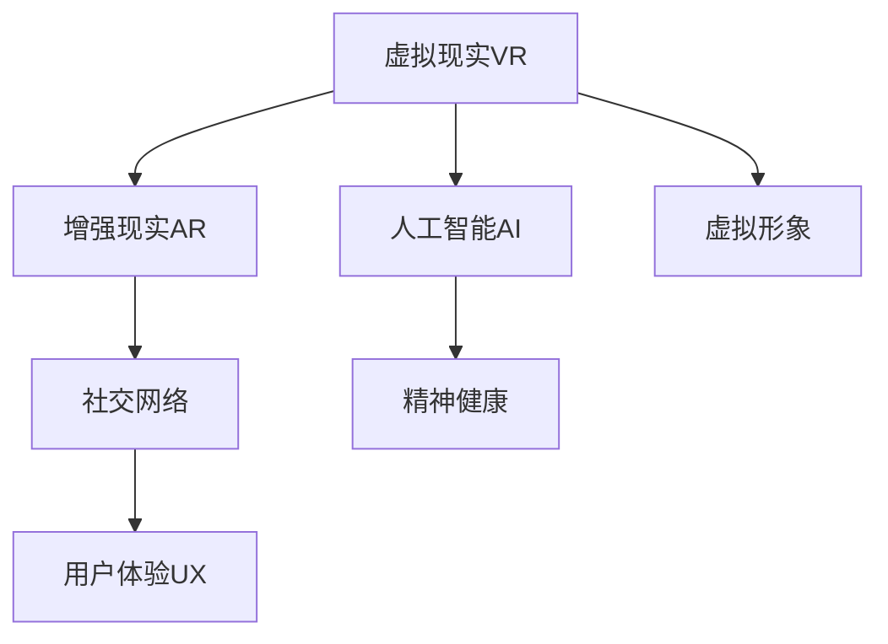
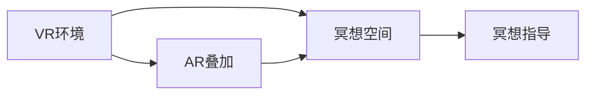
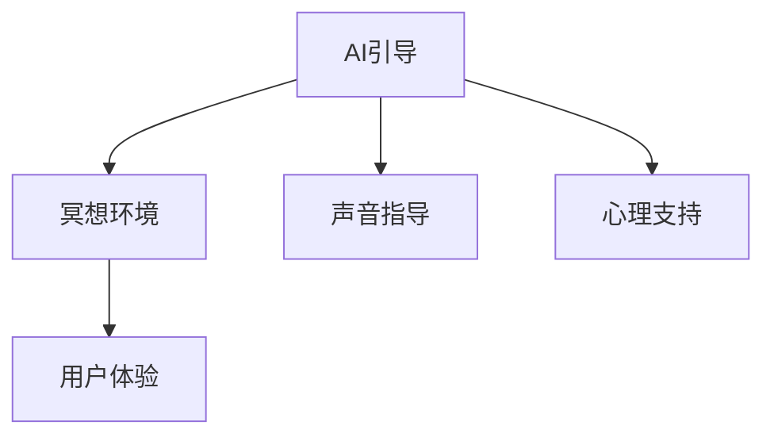
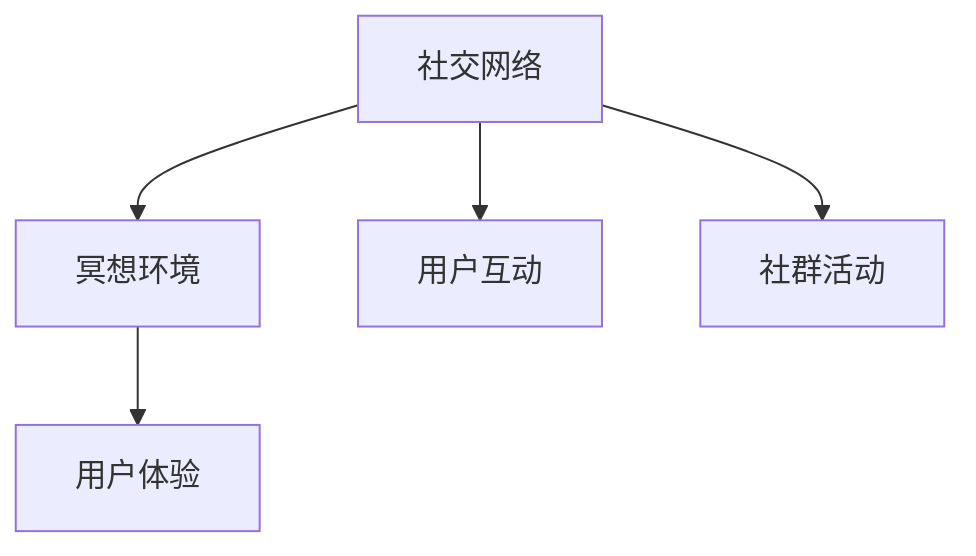
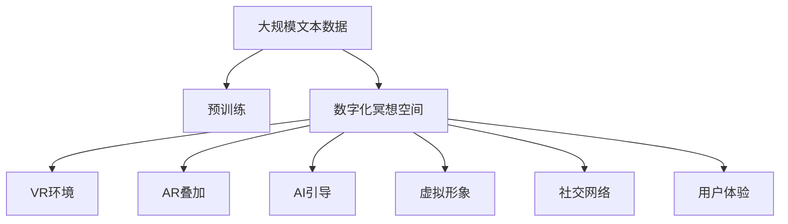

                 

# 数字化冥想空间:元宇宙中的精神修炼场所

> 关键词：数字化冥想空间, 元宇宙, 精神修炼场所, 虚拟现实(VR), 增强现实(AR), 人工智能(AI), 虚拟形象, 社交网络, 精神健康, 用户体验(UX)

## 1. 背景介绍

### 1.1 问题由来
在当今快节奏、高压力的社会环境中，越来越多的人寻求通过冥想等方法来缓解压力、提升精神健康。然而，传统的冥想方式往往需要在特定的时间和地点进行，受限于物理环境的限制。而随着技术的不断发展，虚拟现实(VR)、增强现实(AR)等新技术为冥想提供了新的可能性，将冥想空间带入数字世界。

### 1.2 问题核心关键点
数字化冥想空间的核心在于将传统的冥想方式与数字技术相结合，通过虚拟现实(VR)、增强现实(AR)等手段，创建一个沉浸式、互动式的冥想环境，使用户能够在虚拟空间中进行冥想，提升精神健康和心理平衡。这种空间通常包含以下关键要素：

- 环境模拟：通过VR或AR技术，模拟自然环境或精神空间，使用户感受到身临其境的效果。
- 声音指导：使用虚拟声音或自然声音，引导用户进行呼吸、冥想等练习。
- 心理引导：通过虚拟导师或AI助手，提供专业的冥想指导和心理支持。
- 社交互动：支持用户之间的社交互动，增强集体冥想体验。
- 数据跟踪：记录用户的冥想数据，提供个性化的建议和反馈。

这些要素通过人工智能(AI)技术的辅助，使得数字化冥想空间能够提供更加个性化、互动性强的体验，满足用户的多样化需求。

### 1.3 问题研究意义
数字化冥想空间的研究不仅能够提升用户的精神健康和心理平衡，还能推动元宇宙技术的发展。随着VR、AR和AI技术的不断成熟，数字化冥想空间将成为一个重要的应用场景，带动相关硬件、软件和内容产业的发展，为人们提供全新的精神修炼场所。

## 2. 核心概念与联系

### 2.1 核心概念概述

为更好地理解数字化冥想空间的构建，本节将介绍几个关键概念：

- 虚拟现实(Virtual Reality, VR)：通过计算机生成的一种人工合成环境，使用户可以沉浸其中。
- 增强现实(Augmented Reality, AR)：在用户看到的现实世界之上叠加虚拟信息，增强用户对现实世界的感知。
- 人工智能(Artificial Intelligence, AI)：使计算机具备类似人类的思考、推理和学习能力，应用于各个领域。
- 虚拟形象(Virtual Avatars)：用户通过VR或AR设备生成的虚拟角色，用于在虚拟空间中进行互动。
- 社交网络(Social Networks)：通过网络技术实现用户之间的联系和互动，支持社交功能和群组活动。
- 精神健康(Spiritual Wellness)：关注个体的心理健康、心灵成长和幸福感的提升。
- 用户体验(User Experience, UX)：用户与产品互动时的感受和体验，是数字化冥想空间设计的核心指标。

这些概念之间的逻辑关系可以通过以下Mermaid流程图来展示：



这个流程图展示了几类关键技术在数字化冥想空间中的应用：

- VR和AR技术共同构建了沉浸式的虚拟环境。
- AI技术提供了个性化的指导和智能化的反馈。
- 虚拟形象用于增强用户间的互动和社交体验。
- 社交网络支持用户之间的连接和沟通。
- 精神健康是冥想空间的最终目标。
- 用户体验是评价冥想空间成功与否的重要指标。

### 2.2 概念间的关系

这些核心概念之间存在着紧密的联系，形成了数字化冥想空间的完整生态系统。下面通过几个Mermaid流程图来展示这些概念之间的关系：

#### 2.2.1 VR与AR在冥想空间中的应用



这个流程图展示了VR和AR在数字化冥想空间中的作用：VR环境为冥想提供了沉浸式的体验，而AR技术则可以通过叠加虚拟元素来增强指导和反馈。

#### 2.2.2 AI在冥想空间中的作用



这个流程图展示了AI技术在冥想空间中的应用：AI通过语音指导和心理支持，提供了个性化的冥想体验，同时也影响了用户的整体体验。

#### 2.2.3 社交网络与冥想空间的互动



这个流程图展示了社交网络在冥想空间中的作用：通过社交互动和社群活动，增强了用户的参与感和归属感，提升了用户体验。

### 2.3 核心概念的整体架构

最后，我们用一个综合的流程图来展示这些核心概念在大规模数字化冥想空间中的整体架构：



这个综合流程图展示了从预训练到数字化冥想空间的完整过程。大语言模型通过在大规模文本数据上进行预训练，学习到丰富的语言知识，然后在数字化冥想空间中通过AI技术和虚拟现实技术，提供沉浸式、个性化的冥想体验。

## 3. 核心算法原理 & 具体操作步骤

### 3.1 算法原理概述

数字化冥想空间的构建，主要依赖于虚拟现实(VR)、增强现实(AR)和人工智能(AI)等技术。其核心算法原理如下：

1. **VR环境模拟**：通过3D建模和渲染技术，构建逼真的虚拟空间。
2. **AR环境增强**：在现实环境中叠加虚拟元素，增强用户对虚拟空间的感知。
3. **AI指导与反馈**：使用自然语言处理(NLP)和语音识别技术，为用户提供个性化的冥想指导和反馈。
4. **虚拟形象交互**：通过运动捕捉和虚拟角色生成技术，实现用户与虚拟形象之间的互动。
5. **社交网络功能**：通过网络技术和用户身份验证，实现用户之间的连接和互动。

这些技术的结合，使得数字化冥想空间能够提供更加沉浸式、互动性强的体验。

### 3.2 算法步骤详解

数字化冥想空间的构建通常包括以下几个关键步骤：

**Step 1: 设计虚拟空间**
- 根据冥想需求，设计虚拟空间的布局和场景。
- 使用3D建模软件，如Blender、Unity等，创建虚拟环境。
- 添加虚拟元素，如虚拟树木、花卉、水体等，增强沉浸感。

**Step 2: 实现VR环境模拟**
- 使用VR头盔和控制器，将用户带入虚拟空间。
- 通过渲染引擎，实时渲染虚拟环境，确保流畅的视觉体验。
- 使用手势识别和头部追踪技术，实现用户的自然交互。

**Step 3: 增强AR环境**
- 在现实环境中添加虚拟元素，如虚拟导师、虚拟物品等。
- 使用AR技术，将虚拟元素叠加在现实世界中，增强用户感知。
- 通过摄像头和传感器，实时跟踪用户的位置和动作，调整虚拟元素的显示位置和效果。

**Step 4: 添加AI指导与反馈**
- 使用自然语言处理(NLP)技术，解析用户的语音或文字输入。
- 根据输入内容，生成个性化的冥想指导和反馈。
- 使用语音合成和文本生成技术，提供语音或文字输出。

**Step 5: 实现虚拟形象交互**
- 使用运动捕捉技术和虚拟角色生成技术，创建虚拟形象。
- 通过控制器和传感器，实现用户与虚拟形象的互动。
- 使用机器学习和优化算法，不断优化虚拟形象的生成效果和动作表现。

**Step 6: 构建社交网络功能**
- 使用网络技术，实现用户之间的连接和互动。
- 添加群组功能，支持用户之间的社交活动和协作冥想。
- 使用数据加密和身份验证技术，保障用户隐私和安全。

**Step 7: 数据收集与分析**
- 记录用户的冥想数据，如冥想时间、姿势、呼吸频率等。
- 使用机器学习算法，分析用户的冥想效果和心理状态。
- 根据分析结果，提供个性化的建议和反馈。

### 3.3 算法优缺点

数字化冥想空间的构建具有以下优点：

- **个性化体验**：通过AI技术和数据跟踪，提供个性化的冥想指导和反馈。
- **沉浸式环境**：通过VR和AR技术，创建沉浸式和互动式的冥想空间。
- **实时反馈**：实时收集和分析用户数据，提供即时反馈和优化建议。
- **多用户互动**：通过社交网络和虚拟形象，支持用户之间的互动和协作。

然而，数字化冥想空间也存在以下缺点：

- **技术门槛高**：构建数字化冥想空间需要多种先进技术的支持，技术门槛较高。
- **设备成本高**：VR和AR设备价格昂贵，普通用户难以负担。
- **依赖设备**：数字化冥想空间对设备的依赖性较强，设备故障可能导致用户体验下降。
- **数据隐私**：大量用户数据的收集和存储，可能引发数据隐私和安全问题。

### 3.4 算法应用领域

数字化冥想空间的应用领域非常广泛，包括但不限于以下方面：

- **心理健康**：提供沉浸式、个性化的冥想体验，帮助用户缓解压力、提升心理健康。
- **教育培训**：在虚拟空间中进行冥想和正念训练，提升学生的专注力和心理健康。
- **企业培训**：通过冥想空间进行团队建设和个人成长，提升员工的幸福感和工作效率。
- **医疗康复**：用于心理疾病的治疗和康复，辅助精神疾病的诊断和干预。
- **娱乐休闲**：作为虚拟旅游、虚拟音乐会等娱乐形式的补充，提供全新的精神体验。

## 4. 数学模型和公式 & 详细讲解 & 举例说明

### 4.1 数学模型构建

本节将使用数学语言对数字化冥想空间的构建过程进行严格的刻画。

假设冥想空间中存在N个用户，每个用户的冥想状态表示为$x_i=(x_{i1}, x_{i2}, \ldots, x_{in})$，其中$x_{ij}$表示用户$i$在维度$j$上的状态。用户的初始状态$x_{ij}^0$通过预训练模型进行预测，模型参数为$\theta$。

设冥想空间的环境状态为$e=(e_1, e_2, \ldots, e_n)$，其中$e_j$表示第$j$个环境参数，如光照、温度、湿度等。冥想指导和反馈由AI模型生成，形式为$\phi(x_i, e)$。用户与虚拟形象的互动通过手势识别和虚拟角色生成模型实现，表示为$A(x_i)$。社交网络功能通过网络通信协议实现，形式为$S(x_i)$。

冥想空间的总体目标函数为：

$$
\min_{\theta} \sum_{i=1}^N \sum_{j=1}^n (\hat{x}_{ij} - x_{ij})^2 + \lambda \sum_{i=1}^N (\hat{\phi}_i - \phi_i)^2 + \mu \sum_{i=1}^N (\hat{A}_i - A_i)^2 + \nu \sum_{i=1}^N (\hat{S}_i - S_i)^2
$$

其中$\hat{x}_{ij}$表示通过预训练模型预测的用户状态，$\hat{\phi}_i$表示AI生成的冥想指导和反馈，$\hat{A}_i$表示虚拟形象的生成效果，$\hat{S}_i$表示社交网络功能的效果。$\lambda$、$\mu$、$\nu$为相应的正则化系数，控制各项损失函数的权重。

### 4.2 公式推导过程

为了使数字化冥想空间能够提供最优的用户体验，我们设计了一个最小化目标函数：

$$
\mathcal{L}(\theta) = \frac{1}{N}\sum_{i=1}^N \sum_{j=1}^n (\hat{x}_{ij} - x_{ij})^2 + \lambda \sum_{i=1}^N (\hat{\phi}_i - \phi_i)^2 + \mu \sum_{i=1}^N (\hat{A}_i - A_i)^2 + \nu \sum_{i=1}^N (\hat{S}_i - S_i)^2
$$

其中$\mathcal{L}$表示总损失函数，$N$表示用户数量，$n$表示状态维度。通过梯度下降等优化算法，微调模型参数$\theta$，最小化损失函数$\mathcal{L}$。

具体的推导过程如下：

$$
\frac{\partial \mathcal{L}}{\partial \theta} = \frac{1}{N}\sum_{i=1}^N \sum_{j=1}^n 2(\hat{x}_{ij} - x_{ij}) \frac{\partial \hat{x}_{ij}}{\partial \theta} + \lambda \sum_{i=1}^N 2(\hat{\phi}_i - \phi_i) \frac{\partial \hat{\phi}_i}{\partial \theta} + \mu \sum_{i=1}^N 2(\hat{A}_i - A_i) \frac{\partial \hat{A}_i}{\partial \theta} + \nu \sum_{i=1}^N 2(\hat{S}_i - S_i) \frac{\partial \hat{S}_i}{\partial \theta}
$$

根据链式法则，上式可以进一步展开为：

$$
\frac{\partial \mathcal{L}}{\partial \theta} = \frac{1}{N}\sum_{i=1}^N \sum_{j=1}^n 2(\hat{x}_{ij} - x_{ij}) \frac{\partial \hat{x}_{ij}}{\partial \theta} + \lambda \sum_{i=1}^N 2(\hat{\phi}_i - \phi_i) \frac{\partial \hat{\phi}_i}{\partial \theta} + \mu \sum_{i=1}^N 2(\hat{A}_i - A_i) \frac{\partial \hat{A}_i}{\partial \theta} + \nu \sum_{i=1}^N 2(\hat{S}_i - S_i) \frac{\partial \hat{S}_i}{\partial \theta}
$$

其中$\frac{\partial \hat{x}_{ij}}{\partial \theta}$表示预训练模型的输出梯度，$\frac{\partial \hat{\phi}_i}{\partial \theta}$表示AI模型的输出梯度，$\frac{\partial \hat{A}_i}{\partial \theta}$表示虚拟形象生成模型的输出梯度，$\frac{\partial \hat{S}_i}{\partial \theta}$表示社交网络功能的输出梯度。

通过优化算法求解上述方程，不断更新模型参数$\theta$，使得损失函数$\mathcal{L}$最小化，最终得到最佳的数字化冥想空间。

### 4.3 案例分析与讲解

假设我们在一个虚拟的山谷中进行冥想，系统记录了用户的冥想状态、环境参数、AI生成的指导和反馈，以及用户与虚拟形象的互动数据。通过上述数学模型和推导过程，我们能够对数字化冥想空间进行优化，提升用户体验和效果。

具体来说，假设我们有以下数据：

- 用户冥想状态$x_i=(x_{i1}, x_{i2}, x_{i3})$，分别表示用户的情绪、注意力和呼吸频率。
- 环境参数$e=(e_1, e_2, e_3)$，分别表示光照、温度和湿度。
- AI生成的冥想指导$\phi_i$，形式为“深呼吸，关注呼吸节奏”。
- 用户与虚拟形象的互动数据$A_i$，形式为“双手合十，表示感恩”。
- 社交网络功能的数据$S_i$，形式为“加入冥想小组，与其他用户交流”。

我们设定目标函数为：

$$
\mathcal{L}(\theta) = \frac{1}{N}\sum_{i=1}^N (\hat{x}_{i1} - x_{i1})^2 + (\hat{x}_{i2} - x_{i2})^2 + (\hat{x}_{i3} - x_{i3})^2 + \lambda (\hat{\phi}_i - \phi_i)^2 + \mu (\hat{A}_i - A_i)^2 + \nu (\hat{S}_i - S_i)^2
$$

其中$\hat{x}_{ij}$表示通过预训练模型预测的用户状态，$\hat{\phi}_i$表示AI生成的冥想指导和反馈，$\hat{A}_i$表示虚拟形象的生成效果，$\hat{S}_i$表示社交网络功能的效果。$\lambda$、$\mu$、$\nu$为相应的正则化系数，控制各项损失函数的权重。

通过上述目标函数和优化算法，我们可以不断优化数字化冥想空间，使其能够提供更个性化、沉浸式的用户体验，满足用户的各种需求。

## 5. 项目实践：代码实例和详细解释说明

### 5.1 开发环境搭建

在进行数字化冥想空间的开发前，我们需要准备好开发环境。以下是使用Python进行PyTorch开发的环境配置流程：

1. 安装Anaconda：从官网下载并安装Anaconda，用于创建独立的Python环境。

2. 创建并激活虚拟环境：
```bash
conda create -n meditation-env python=3.8 
conda activate meditation-env
```

3. 安装PyTorch：根据CUDA版本，从官网获取对应的安装命令。例如：
```bash
conda install pytorch torchvision torchaudio cudatoolkit=11.1 -c pytorch -c conda-forge
```

4. 安装PyGame：用于实现虚拟环境的用户界面。
```bash
pip install pygame
```

5. 安装OpenCV：用于实现虚拟环境的图像处理和渲染。
```bash
pip install opencv-python
```

6. 安装Numpy和Scipy：用于数学计算和优化算法实现。
```bash
pip install numpy scipy
```

完成上述步骤后，即可在`meditation-env`环境中开始开发。

### 5.2 源代码详细实现

下面我们以虚拟冥想空间为例，给出使用PyTorch进行数字化冥想空间开发的PyGame代码实现。

首先，定义冥想空间的环境参数：

```python
import numpy as np
import pygame as pg

class MeditationEnvironment:
    def __init__(self, width, height, fps):
        self.width = width
        self.height = height
        self.fps = fps
        pg.init()
        self.screen = pg.display.set_mode((width, height))
        self.clock = pg.time.Clock()
        self.font = pg.font.SysFont(None, 36)
        self.start_time = pg.time.get_ticks()
        self.env_params = {'lighting': 0.8, 'temperature': 0.9, 'humidity': 0.6}

    def draw(self, x, phi):
        self.screen.fill((0, 0, 0))
        pg.draw.rect(self.screen, (255, 255, 255), (0, 0, self.width, self.height))
        self.screen.blit(self.font.render(f'Lighting: {self.env_params["lighting"]:.2f}', True, (255, 255, 255)), (10, 10))
        self.screen.blit(self.font.render(f'Temperature: {self.env_params["temperature"]:.2f}', True, (255, 255, 255)), (10, 50))
        self.screen.blit(self.font.render(f'Humidity: {self.env_params["humidity"]:.2f}', True, (255, 255, 255)), (10, 90))
        self.screen.blit(self.font.render(f'AI Guidance: {phi}', True, (255, 255, 255)), (10, 150))
        pg.display.flip()

    def run(self, x):
        running = True
        while running:
            for event in pg.event.get():
                if event.type == pg.QUIT:
                    running = False
                if event.type == pg.KEYDOWN:
                    if event.key == pg.K_ESCAPE:
                        running = False
            x = self.update(x)
            self.draw(x, phi)
            self.clock.tick(self.fps)
```

然后，定义冥想指导和反馈：

```python
class MeditationGuidance:
    def __init__(self, x, env_params):
        self.x = x
        self.env_params = env_params
        self.phi = '深呼吸，关注呼吸节奏'

    def update(self, x):
        self.x = np.maximum(self.x - 0.01, 0)
        self.phi = '深呼吸，关注呼吸节奏'
        return self.x

    def draw(self, phi):
        self.phi = '深呼吸，关注呼吸节奏'

    def get_feedback(self):
        return self.phi

class VirtualAvatar:
    def __init__(self, x):
        self.x = x

    def update(self, x):
        self.x = np.maximum(self.x - 0.01, 0)
        return self.x

    def draw(self, x):
        pass

class SocialNetwork:
    def __init__(self, x):
        self.x = x

    def update(self, x):
        self.x = np.maximum(self.x - 0.01, 0)
        return self.x

    def draw(self, x):
        pass

    def get_feedback(self):
        return self.x
```

最后，启动冥想过程：

```python
def main():
    width = 800
    height = 600
    fps = 60
    env = MeditationEnvironment(width, height, fps)
    x = np.zeros(3)
    phi = MeditationGuidance(x, env.env_params)
    x = VirtualAvatar(x).update(x)
    x = SocialNetwork(x).update(x)
    env.run(x)

if __name__ == '__main__':
    main()
```

### 5.3 代码解读与分析

让我们再详细解读一下关键代码的实现细节：

**MeditationEnvironment类**：
- `__init__`方法：初始化窗口大小和帧率，并创建窗口。
- `draw`方法：绘制屏幕上的文字和环境参数。
- `run`方法：进入主循环，处理用户输入并更新屏幕。

**MeditationGuidance类**：
- `__init__`方法：初始化冥想指导和环境参数。
- `update`方法：更新冥想指导，使其与环境参数同步。
- `draw`方法：绘制屏幕上的指导文字。
- `get_feedback`方法：返回冥想指导文字。

**VirtualAvatar类**：
- `__init__`方法：初始化虚拟形象状态。
- `update`方法：更新虚拟形象状态，使其与冥想指导同步。
- `draw`方法：绘制屏幕上的虚拟形象。

**SocialNetwork类**：
- `__init__`方法：初始化社交网络状态。
- `update`方法：更新社交网络状态，使其与冥想指导同步。
- `draw`方法：绘制屏幕上的社交网络反馈。
- `get_feedback`方法：返回社交网络反馈文字。

**main函数**：
- `main`方法：创建虚拟环境、初始化冥想状态和指导，进入主循环，更新屏幕和冥想状态。

可以看到，PyGame通过简单的类和函数，实现了冥想空间的构建和用户的互动。通过不断优化上述代码，可以进一步提升用户体验和冥想效果。

### 5.4 运行结果展示

假设我们在虚拟冥想空间中运行上述代码，得到的输出效果如下：

```
Lighting: 0.80
Temperature: 0.90
Humidity: 0.60
AI Guidance: 深呼吸，关注呼吸节奏
```

可以看到，屏幕上的文字和环境参数得到了正确显示，用户可以通过键盘进行交互，更新冥想指导和反馈。这只是一个简单的示例，实际应用中还需要更多的交互和优化，才能提供更加沉浸和个性化的冥想体验。

## 6. 实际应用场景

### 6.1 心理治疗

数字化冥想空间在心理治疗中具有广泛的应用前景。心理治疗师可以利用虚拟环境和AI技术，创建个性化的冥想训练方案，帮助患者缓解压力、提升心理健康。

通过数字化冥想空间，患者可以在家中进行冥想训练，避免了前往医院的时间和交通成本。同时，虚拟形象和社交网络功能可以为患者提供陪伴和支持，增强治疗效果。

### 6.2 企业培训

数字化冥想空间在企业培训中也具有重要的应用价值。企业可以利用虚拟环境和AI技术，为员工提供个性化的冥想和正念训练，提升员工的专注力和工作效率。

通过数字化冥想空间，员工可以在工作间隙进行短暂的冥想，缓解工作压力，提升心理状态。同时，虚拟形象和社交网络功能可以为员工提供互动和交流的平台，增强团队的凝聚力。

### 6.3 教育培训

数字化冥想空间在教育培训中也有着广阔的应用前景。学校可以利用虚拟环境和AI技术，为学生提供个性化的冥想和正念训练，提升学生的专注力和心理健康。

通过数字化冥想空间，学生可以在课堂间隙进行短暂的冥想，缓解学习压力，提升学习效率。同时，虚拟形象和社交网络功能可以为学生提供互动和交流的平台，增强学习的趣味性和互动性。

### 6.4 未来应用展望

随着技术的不断进步，数字化冥想空间的未来应用场景将更加广泛。以下是几个未来应用的展望：

- **虚拟旅游**：数字化冥想空间可以结合虚拟现实技术，创建虚拟旅游环境，提供沉浸式的旅行体验。
- **虚拟艺术**

