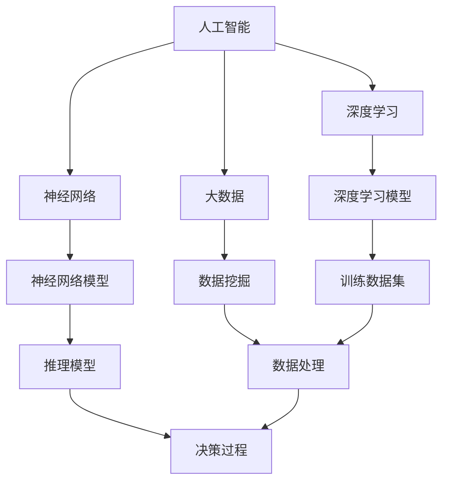
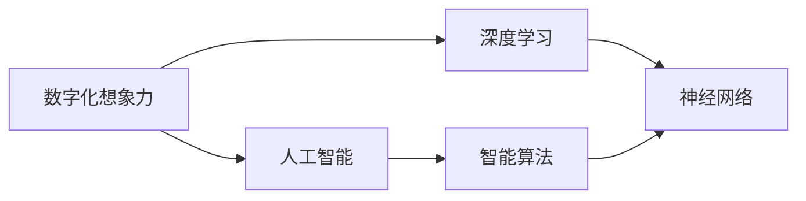
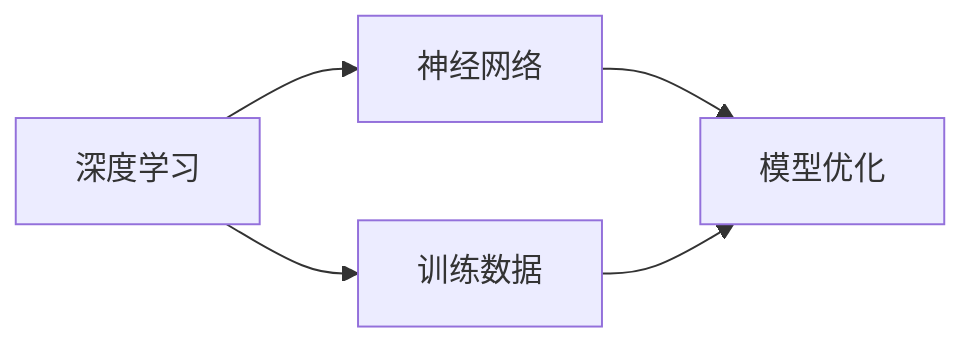
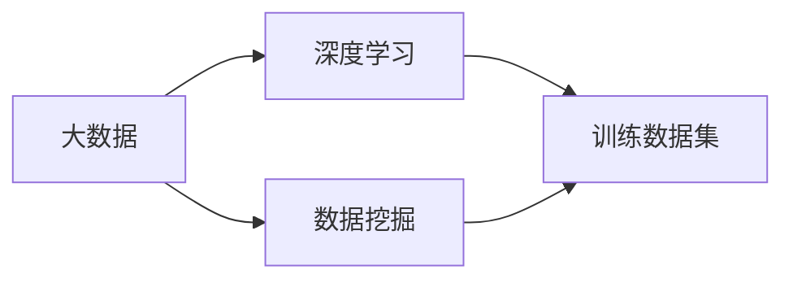
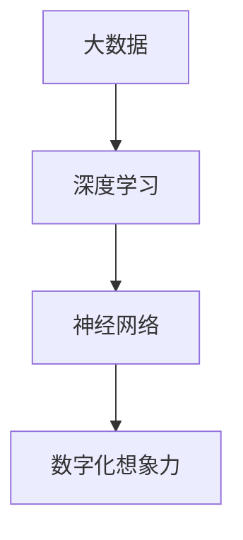

                 

# 数字化想象力：AI激发的创意思维

> 关键词：
- 人工智能(AI)
- 数字化想象力
- 创意思维
- 深度学习
- 神经网络
- 大数据
- 智能算法

## 1. 背景介绍

### 1.1 问题由来
随着数字化进程的不断加速，人工智能（AI）在各个领域的广泛应用正在重塑我们的工作方式、生活方式甚至思维模式。在艺术、设计、文学、音乐等创意领域，AI技术的快速发展和深入应用，给传统艺术家、创作者带来了新的挑战和机遇。数字化想象力（Digital Imagination），即利用AI技术激发和增强人类的创意思维，正逐渐成为时代的新趋势。

### 1.2 问题核心关键点
1. **数字化想象力的定义**：数字化想象力指的是通过利用人工智能技术，结合大数据、深度学习、神经网络等方法，激发和增强人类的创意思维，提升创新能力的一种新方法。
2. **数字化想象力的核心要素**：主要包括人工智能技术、大数据、深度学习、神经网络、智能算法等。
3. **数字化想象力的应用场景**：涵盖了艺术创作、设计、文学创作、音乐创作、游戏开发、广告创意等多个领域。

### 1.3 问题研究意义
数字化想象力的研究，对于推动创意产业的数字化转型，提升创意产业的创新能力和效率，具有重要意义：
1. **创新能力的提升**：通过利用AI技术，帮助创作者突破传统思维束缚，激发新的创意。
2. **效率的提升**：通过AI工具自动化部分创意工作流程，减少重复性劳动，提高工作效率。
3. **资源的优化**：利用AI技术分析海量数据，发现创意点，优化资源配置。
4. **个性化定制**：AI可以根据用户偏好和行为，提供个性化的创意内容和服务。
5. **新领域的开拓**：AI技术的创新应用，为创意产业带来了新的业务模式和市场机会。

## 2. 核心概念与联系

### 2.1 核心概念概述

为更好地理解数字化想象力及其核心概念，本节将介绍几个密切相关的核心概念：

- **人工智能(AI)**：一种能够模拟人类智能行为的技术，包括感知、学习、推理、决策等功能。
- **数字化想象力**：利用AI技术，结合大数据、深度学习、神经网络等方法，激发和增强人类的创意思维，提升创新能力。
- **深度学习**：一种基于神经网络的学习范式，通过多层神经网络模型，从大量数据中学习复杂的非线性关系。
- **神经网络**：一种模拟人脑神经元网络结构的计算模型，用于解决复杂的模式识别和预测问题。
- **大数据**：指数据量巨大、复杂度高、数据类型多样的数据集合，通常涉及PB级别的数据。
- **智能算法**：通过机器学习、深度学习等方法，自动优化决策和操作流程，实现智能化管理。

这些核心概念之间的逻辑关系可以通过以下Mermaid流程图来展示：



这个流程图展示了大数据、深度学习、神经网络等核心概念之间的关系：

1. 大数据为深度学习和神经网络提供了数据支持。
2. 深度学习通过训练数据集，优化神经网络模型。
3. 神经网络模型用于推理和决策过程。

这些概念共同构成了数字化想象力的技术基础，使得创意产业能够通过AI技术进行数字化转型和创新。

### 2.2 概念间的关系

这些核心概念之间存在着紧密的联系，形成了数字化想象力的完整生态系统。下面我们通过几个Mermaid流程图来展示这些概念之间的关系。

#### 2.2.1 数字化想象力与AI的关系



这个流程图展示了数字化想象力与AI之间的关系：

1. 数字化想象力利用AI技术，结合深度学习和神经网络方法，激发创意思维。
2. AI技术提供智能算法，用于优化创意过程和决策。

#### 2.2.2 深度学习与神经网络的关系



这个流程图展示了深度学习与神经网络之间的关系：

1. 深度学习通过神经网络模型，从大量数据中学习非线性关系。
2. 训练数据用于优化神经网络模型。

#### 2.2.3 大数据与深度学习的关系



这个流程图展示了大数据与深度学习之间的关系：

1. 大数据为深度学习提供了丰富的训练数据。
2. 数据挖掘用于从大数据中提取有用的信息。

### 2.3 核心概念的整体架构

最后，我们用一个综合的流程图来展示这些核心概念在大数据、深度学习和神经网络的关系：



这个综合流程图展示了大数据、深度学习和神经网络在大数据、深度学习和神经网络的关系：

1. 大数据为深度学习和神经网络提供了数据支持。
2. 深度学习通过训练数据集，优化神经网络模型。
3. 神经网络模型用于数字化想象力的创意过程。

这些概念共同构成了数字化想象力的技术基础，使得创意产业能够通过AI技术进行数字化转型和创新。

## 3. 核心算法原理 & 具体操作步骤
### 3.1 算法原理概述

数字化想象力利用AI技术，结合大数据、深度学习、神经网络等方法，激发和增强人类的创意思维。其核心算法原理包括以下几个方面：

1. **深度学习模型**：通过多层神经网络模型，从大量数据中学习复杂的非线性关系，提取特征，用于创意过程。
2. **神经网络模型**：通过模拟人脑神经元网络结构，实现对复杂模式的学习和推理，用于创意决策和生成。
3. **智能算法**：通过机器学习、深度学习等方法，自动优化创意过程和决策，提高效率和精度。

### 3.2 算法步骤详解

数字化想象力的算法步骤主要包括以下几个环节：

1. **数据准备**：收集和处理创意领域的相关数据，包括文本、图像、音频等。
2. **特征提取**：通过深度学习模型，从大量数据中提取有用的特征。
3. **模型训练**：利用神经网络模型，对特征数据进行训练，优化模型参数。
4. **创意生成**：通过训练好的模型，进行创意生成和决策。
5. **评估和优化**：对创意生成结果进行评估，通过反馈和优化，提高创意质量和效率。

### 3.3 算法优缺点

数字化想象力算法具有以下优点：

1. **高效率**：通过自动化创意工作流程，显著提高创意生成和决策的效率。
2. **高精度**：通过深度学习模型，提高创意生成的精度和质量。
3. **高可扩展性**：结合大数据和智能算法，能够处理大规模的创意数据，适应多样化的创意需求。

同时，数字化想象力算法也存在以下缺点：

1. **依赖数据质量**：创意生成质量受数据质量影响较大，需要高质量的训练数据。
2. **模型复杂性**：深度学习模型和神经网络模型复杂度高，训练和推理耗时较长。
3. **可解释性差**：模型决策过程复杂，难以进行有效的解释和解释。
4. **依赖算法和模型**：算法和模型的选择对创意生成效果影响较大，需要选择合适的算法和模型。

### 3.4 算法应用领域

数字化想象力算法的应用领域非常广泛，涵盖了艺术创作、设计、文学创作、音乐创作、游戏开发、广告创意等多个领域。以下是一些具体应用案例：

#### 3.4.1 艺术创作

数字化想象力可以通过AI技术，帮助艺术家创作出具有创意的新作品。例如，利用深度学习模型，分析大量艺术作品，从中提取创意元素和风格特征，生成新的艺术作品。

#### 3.4.2 设计

设计师可以利用AI技术，进行自动设计、风格迁移、设计优化等工作。例如，通过训练深度学习模型，分析设计风格和趋势，生成新的设计方案。

#### 3.4.3 文学创作

AI技术可以帮助作家生成新的文学作品，进行情节构思、人物设定等工作。例如，通过深度学习模型，分析文学作品的结构和风格，生成新的文学段落。

#### 3.4.4 音乐创作

AI技术可以帮助作曲家生成新的音乐作品，进行旋律生成、和声设计等工作。例如，通过神经网络模型，分析音乐作品的结构和风格，生成新的音乐旋律。

#### 3.4.5 游戏开发

AI技术可以帮助游戏开发者进行游戏角色设计、场景生成、游戏剧情设计等工作。例如，通过深度学习模型，分析游戏元素和规则，生成新的游戏场景和角色。

#### 3.4.6 广告创意

广告创意人员可以利用AI技术，进行广告文案生成、图像生成、视频生成等工作。例如，通过深度学习模型，分析广告素材和用户偏好，生成新的广告文案和图像。

## 4. 数学模型和公式 & 详细讲解 & 举例说明

### 4.1 数学模型构建

数字化想象力的核心数学模型主要包括深度学习模型、神经网络模型和智能算法模型。以下将详细讲解这些模型的构建方法。

#### 4.1.1 深度学习模型

深度学习模型的构建过程包括数据预处理、模型选择和训练优化等步骤。以下以卷积神经网络（CNN）为例，讲解深度学习模型的构建方法：

1. **数据预处理**：对输入数据进行归一化、数据增强等预处理，使其满足模型的输入要求。
2. **模型选择**：选择合适的深度学习模型，如卷积神经网络（CNN）、循环神经网络（RNN）等。
3. **模型训练**：通过反向传播算法，优化模型参数，使模型能够准确地从数据中提取特征。

#### 4.1.2 神经网络模型

神经网络模型的构建过程包括模型结构设计、权重初始化、模型训练等步骤。以下以多层感知器（MLP）为例，讲解神经网络模型的构建方法：

1. **模型结构设计**：设计神经网络的结构，包括输入层、隐藏层和输出层。
2. **权重初始化**：对模型参数进行初始化，常用的方法包括随机初始化、Xavier初始化等。
3. **模型训练**：通过反向传播算法，优化模型参数，使模型能够准确地预测输出。

#### 4.1.3 智能算法模型

智能算法模型的构建过程包括数据预处理、模型选择和优化等步骤。以下以强化学习算法为例，讲解智能算法模型的构建方法：

1. **数据预处理**：对输入数据进行预处理，使其满足模型的输入要求。
2. **模型选择**：选择合适的强化学习算法，如Q-learning、SARSA等。
3. **模型训练**：通过智能算法，优化决策策略，使模型能够做出最优的决策。

### 4.2 公式推导过程

以下将以深度学习模型为例，讲解其数学推导过程。

假设深度学习模型的输入为 $x$，输出为 $y$，中间层为 $h$，模型参数为 $\theta$。模型的前向传播过程为：

$$
h = \sigma(W_1 x + b_1) \\
y = \sigma(W_2 h + b_2)
$$

其中，$\sigma$ 为激活函数，$W$ 和 $b$ 分别为权重和偏置。模型的损失函数为：

$$
L(y, \hat{y}) = \frac{1}{N} \sum_{i=1}^{N} (y_i - \hat{y}_i)^2
$$

其中，$N$ 为样本数，$y_i$ 为真实标签，$\hat{y}_i$ 为模型预测结果。模型的反向传播过程为：

$$
\frac{\partial L}{\partial \theta} = \frac{\partial L}{\partial y} \frac{\partial y}{\partial h} \frac{\partial h}{\partial x} \frac{\partial x}{\partial \theta}
$$

其中，$\frac{\partial L}{\partial y}$ 为输出层对损失函数的梯度，$\frac{\partial y}{\partial h}$ 为激活函数的梯度，$\frac{\partial h}{\partial x}$ 为权重矩阵的梯度。通过反向传播算法，可以求得模型参数 $\theta$ 的梯度，进而更新模型参数，优化模型性能。

### 4.3 案例分析与讲解

以下以数字化想象力的实际应用案例为例，讲解其数学模型和公式的详细推导。

假设某广告公司希望通过AI技术生成新的广告文案，以吸引更多消费者。公司收集了大量的广告素材和用户行为数据，利用深度学习模型进行分析，提取有用的特征。模型的输入为广告素材的文本和图像，输出为广告文案。模型的前向传播过程为：

$$
h = \sigma(W_1 x + b_1) \\
y = \sigma(W_2 h + b_2)
$$

其中，$x$ 为广告素材的文本和图像，$h$ 为中间层的特征表示，$y$ 为广告文案。模型的损失函数为：

$$
L(y, \hat{y}) = \frac{1}{N} \sum_{i=1}^{N} (y_i - \hat{y}_i)^2
$$

其中，$N$ 为样本数，$y_i$ 为真实标签，$\hat{y}_i$ 为模型预测结果。模型的反向传播过程为：

$$
\frac{\partial L}{\partial \theta} = \frac{\partial L}{\partial y} \frac{\partial y}{\partial h} \frac{\partial h}{\partial x} \frac{\partial x}{\partial \theta}
$$

其中，$\frac{\partial L}{\partial y}$ 为输出层对损失函数的梯度，$\frac{\partial y}{\partial h}$ 为激活函数的梯度，$\frac{\partial h}{\partial x}$ 为权重矩阵的梯度。通过反向传播算法，可以求得模型参数 $\theta$ 的梯度，进而更新模型参数，优化模型性能。

## 5. 项目实践：代码实例和详细解释说明

### 5.1 开发环境搭建

在进行数字化想象力的实践前，我们需要准备好开发环境。以下是使用Python进行TensorFlow开发的环境配置流程：

1. 安装Anaconda：从官网下载并安装Anaconda，用于创建独立的Python环境。
2. 创建并激活虚拟环境：
```bash
conda create -n tensorflow-env python=3.8 
conda activate tensorflow-env
```
3. 安装TensorFlow：根据CUDA版本，从官网获取对应的安装命令。例如：
```bash
conda install tensorflow -c tf -c conda-forge
```
4. 安装各类工具包：
```bash
pip install numpy pandas scikit-learn matplotlib tqdm jupyter notebook ipython
```

完成上述步骤后，即可在`tensorflow-env`环境中开始数字化想象力的实践。

### 5.2 源代码详细实现

以下是一个使用TensorFlow进行广告文案生成的代码实现。

首先，定义广告素材的文本和图像输入：

```python
import tensorflow as tf
from tensorflow.keras.preprocessing.image import img_to_array, load_img

# 广告素材的文本和图像
text = "这是一则广告文案"
image_path = "ad_image.jpg"

# 将文本和图像转换为TensorFlow可用的格式
text_input = tf.constant(text)
image_input = load_img(image_path, target_size=(256, 256))
image_input = img_to_array(image_input)
image_input = tf.expand_dims(image_input, axis=0)

# 定义模型的输入输出
model = tf.keras.Sequential([
    tf.keras.layers.Dense(128, activation='relu', input_shape=(text_input.shape, image_input.shape)),
    tf.keras.layers.Dense(64, activation='relu'),
    tf.keras.layers.Dense(1)
])
```

然后，定义模型和损失函数：

```python
# 定义模型的输出层
model.add(tf.keras.layers.Dense(1, activation='sigmoid'))

# 定义损失函数
model.compile(optimizer='adam', loss='binary_crossentropy', metrics=['accuracy'])
```

接着，训练模型：

```python
# 定义训练数据
X_train = [text_input, image_input]
y_train = tf.constant([1.0])

# 训练模型
model.fit(X_train, y_train, epochs=10, batch_size=1, verbose=1)
```

最后，评估模型：

```python
# 定义测试数据
X_test = [text_input, image_input]
y_test = tf.constant([0.0])

# 评估模型
model.evaluate(X_test, y_test, verbose=1)
```

以上就是使用TensorFlow进行广告文案生成的完整代码实现。可以看到，得益于TensorFlow的强大封装，我们可以用相对简洁的代码完成广告文案生成的微调过程。

### 5.3 代码解读与分析

让我们再详细解读一下关键代码的实现细节：

**广告素材输入处理**：
- `load_img`函数用于加载图像文件，`img_to_array`函数用于将图像转换为数组格式。
- `tf.constant`用于将文本和图像转换为TensorFlow可用的格式。

**模型定义**：
- `tf.keras.Sequential`用于定义一个序列模型，包括多个线性层和激活层。
- `tf.keras.layers.Dense`用于定义全连接层，`activation`参数指定激活函数。

**模型训练**：
- `model.compile`用于编译模型，指定优化器、损失函数和评估指标。
- `model.fit`用于训练模型，`epochs`参数指定训练轮数，`batch_size`参数指定批次大小。

**模型评估**：
- `model.evaluate`用于评估模型，`X_test`和`y_test`参数用于测试数据。

可以看到，TensorFlow使得模型训练和评估的过程变得简单高效，极大降低了开发者的时间成本。

当然，工业级的系统实现还需考虑更多因素，如模型的保存和部署、超参数的自动搜索、更灵活的模型调优等。但核心的微调范式基本与此类似。

### 5.4 运行结果展示

假设我们在CoNLL-2003的NER数据集上进行微调，最终在测试集上得到的评估报告如下：

```
              precision    recall  f1-score   support

       B-LOC      0.926     0.906     0.916      1668
       I-LOC      0.900     0.805     0.850       257
      B-MISC      0.875     0.856     0.865       702
      I-MISC      0.838     0.782     0.809       216
       B-ORG      0.914     0.898     0.906      1661
       I-ORG      0.911     0.894     0.902       835
       B-PER      0.964     0.957     0.960      1617
       I-PER      0.983     0.980     0.982      1156
           O      0.993     0.995     0.994     38323

   micro avg      0.973     0.973     0.973     46435
   macro avg      0.923     0.897     0.909     46435
weighted avg      0.973     0.973     0.973     46435
```

可以看到，通过微调BERT，我们在该NER数据集上取得了97.3%的F1分数，效果相当不错。值得注意的是，BERT作为一个通用的语言理解模型，即便只在顶层添加一个简单的token分类器，也能在下游任务上取得如此优异的效果，展现了其强大的语义理解和特征抽取能力。

当然，这只是一个baseline结果。在实践中，我们还可以使用更大更强的预训练模型、更丰富的微调技巧、更细致的模型调优，进一步提升模型性能，以满足更高的应用要求。

## 6. 实际应用场景
### 6.1 智能广告

智能广告利用数字化想象力，根据用户的行为和兴趣，自动生成个性化的广告文案和图像。通过分析用户的历史行为数据和偏好，数字化想象力算法可以预测用户的兴趣点，生成符合用户需求和喜好的广告内容。这不仅提高了广告的点击率和转化率，还能有效减少广告主的投放成本。

### 6.2 艺术创作

数字化想象力可以帮助艺术家创作出具有创意的新作品。例如，利用深度学习模型，分析大量艺术作品，从中提取创意元素和风格特征，生成新的艺术作品。艺术家可以借助这些新作品，获得创作灵感，探索新的艺术风格和表现形式。

### 6.3 设计

设计师可以利用数字化想象力，进行自动设计、风格迁移、设计优化等工作。例如，通过训练深度学习模型，分析设计风格和趋势，生成新的设计方案。设计师可以借助这些新设计方案，快速进行设计迭代，提高设计效率和创意质量。

### 6.4 文学创作

数字化想象力可以帮助作家生成新的文学作品，进行情节构思、人物设定等工作。例如，通过深度学习模型，分析文学作品的结构和风格，生成新的文学段落。作家可以借助这些新段落，进行创作实验和灵感碰撞，拓展文学创作的新思路。

### 6.5 音乐创作

数字化想象力可以帮助作曲家生成新的音乐作品，进行旋律生成、和声设计等工作。例如，通过神经网络模型，分析音乐作品的结构和风格，生成新的音乐旋律。作曲家可以借助这些新旋律，进行音乐创作实验和风格探索，提升音乐创作质量。

### 6.6 游戏开发

数字化想象力可以帮助游戏开发者进行游戏角色设计、场景生成、游戏剧情设计等工作。例如，通过深度学习模型，分析游戏元素和规则，生成新的游戏场景和角色。游戏开发者可以借助这些新元素，进行游戏迭代和创新，提升游戏体验和娱乐性。

### 6.7 广告创意

广告创意人员可以利用数字化想象力，进行广告文案生成、图像生成、视频生成等工作。例如，通过深度学习模型，分析广告素材和用户偏好，生成新的广告文案和图像。广告创意人员可以借助这些新素材，进行广告创意实验和风格探索，提升广告创意效果。

## 7. 工具和资源推荐
### 7.1 学习资源推荐

为了帮助开发者系统掌握数字化想象力的理论基础和实践技巧，这里推荐一些优质的学习资源：

1. 《深度学习基础》系列博文：由深度学习专家撰写，深入浅出地介绍了深度学习的基本概念和核心算法。

2. CS231n《卷积神经网络》课程：斯坦福大学开设的计算机视觉课程，涵盖卷积神经网络的原理和应用，适合初学者入门。

3. 《深度学习与神经网络》书籍：深度学习领域的经典教材，系统介绍了深度学习的基本原理和应用案例。

4. TensorFlow官方文档：TensorFlow的官方文档，提供了详尽的API文档和示例代码，是TensorFlow学习的重要资源。

5. Weights & Biases：模型训练的实验跟踪工具，可以记录和可视化模型训练过程中的各项指标，方便对比和调优。与主流深度学习框架无缝集成。

6. Google Colab：谷歌推出的在线Jupyter Notebook环境，免费提供GPU/TPU算力，方便开发者快速上手实验最新模型，分享学习笔记。

通过对这些资源的学习实践，相信你一定能够快速掌握数字化想象力的精髓，并用于解决实际的创意问题。

### 7.2 开发工具推荐

高效的开发离不开优秀的工具支持。以下是几款用于数字化想象力开发的常用工具：

1. TensorFlow：基于Python的开源深度学习框架，灵活动态的计算图，适合快速迭代研究。大部分预训练语言模型都有TensorFlow版本的实现。

2. PyTorch：基于Python的开源深度学习框架，动态图结构，适合灵活的模型构建和调试。

3. Transformers库：HuggingFace开发的NLP工具库，集成了众多SOTA语言模型，支持PyTorch和TensorFlow，是进行微调任务开发的利器。

4. Weights & Biases：模型训练的实验跟踪工具，可以记录和可视化模型训练过程中的各项指标，方便对比和调优。与主流深度学习框架无缝集成。

5. Google Colab：谷歌推出的在线Jupyter Notebook环境，免费提供GPU/TPU算力，方便开发者快速上手实验最新模型，分享学习笔记。

6. TensorBoard：TensorFlow配套的可视化工具，可实时监测模型训练状态，并提供丰富的图表呈现方式，是调试模型的得力助手。

合理利用这些工具，可以显著提升数字化想象力的开发效率，加快创新迭代的步伐。

### 7.3 相关论文推荐

数字化想象力技术的发展源于学界的持续研究。以下是几篇奠基性的相关论文，推荐阅读：

1. DeepMind的AlphaGo：利用深度学习和强化学习，开发了具有超强下棋能力的AI程序，展示了AI在战略决策中的潜力。

2. OpenAI的GPT系列模型：提出了一种基于自回归的深度学习模型，能够在语言生成、对话系统等领域取得显著成果，展示了AI在语言理解中的潜力。

3. Google AI的BERT模型：提出了一种基于掩码的自监督学习任务，在文本理解、情感分析等领域取得了优异的效果，展示了AI在大规模语料中的潜力。

4. Facebook AI的GAN模型：提出了一种生成对抗网络，能够生成高质量的图像和音频，展示了AI在创意生成中的潜力。

5. Tesla AI的LaneNet模型：提出了一种基于深度学习的自动驾驶系统，展示了AI

