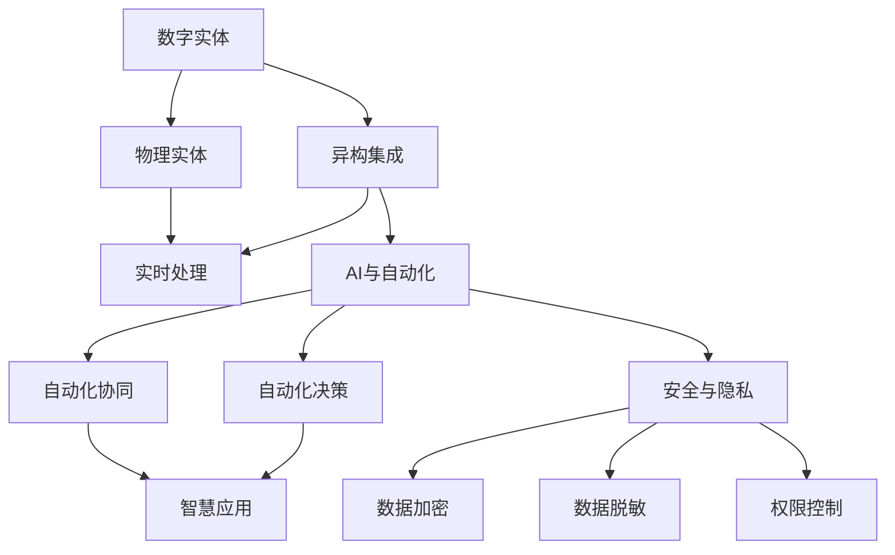
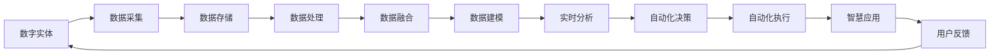
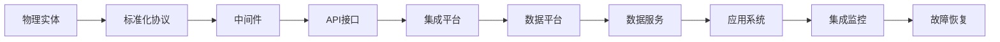
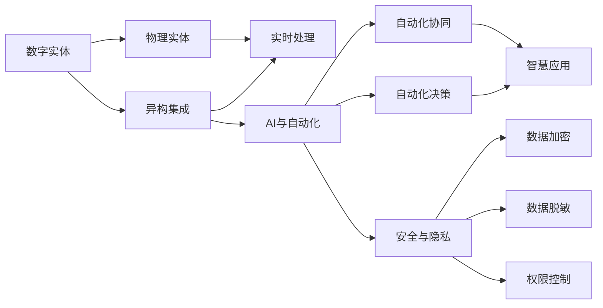

                 

# 数字实体与物理实体的自动化趋势

## 1. 背景介绍

### 1.1 问题由来

随着数字化技术的迅猛发展，数字实体与物理实体的融合趋势日益显著。数字实体指的是在计算机网络中存储和处理的数据，如数据库、云平台、区块链等。物理实体则包括实体设备、物联网(IoT)系统、物理空间内的各种物体和资源。两者的相互渗透和融合，催生了新的应用场景和商业模式，如智慧城市、智能制造、无人驾驶等。

### 1.2 问题核心关键点

当前，数字实体与物理实体的自动化融合面临着诸多挑战，包括：

- 数据标准化：不同物理实体的数据格式和协议千差万别，如何实现统一的数据标准化是关键。
- 异构系统集成：异构物理设备和系统的集成难度大，需要高效的架构设计和适配技术。
- 数据实时性：物联网设备产生的海量数据需要实时处理和分析，对系统的延迟和性能有较高要求。
- 安全与隐私：数字实体和物理实体的融合可能涉及敏感数据，如何保障数据安全和隐私保护是重要课题。
- 自动化与协作：如何通过AI技术实现自动化决策和协同工作，提升效率和效果。

### 1.3 问题研究意义

研究数字实体与物理实体的自动化趋势，对于推动数字化转型、提升产业智能化水平、构建智能生态系统具有重要意义：

- 促进产业升级：通过数字化改造，提升传统产业的自动化和智能化水平，推动产业结构优化升级。
- 赋能智慧城市：实现城市基础设施的智能化和协同管理，提升城市运行效率和服务质量。
- 优化供应链管理：利用数字实体和物理实体的融合，优化供应链流程，降低成本，提高效率。
- 提升用户体验：通过数字化和智能化手段，改善用户体验，增强用户粘性和满意度。
- 推动技术创新：促进跨领域技术融合，催生新的技术突破和商业模式。

## 2. 核心概念与联系

### 2.1 核心概念概述

为了更好地理解数字实体与物理实体的自动化融合过程，本节将介绍几个密切相关的核心概念：

- **数字实体**：指在计算机网络中存储和处理的数据，包括但不限于数据库、云平台、区块链等。数字实体是数字化的基础，支撑各种数字化应用。
- **物理实体**：指实体设备、物联网(IoT)系统、物理空间内的各种物体和资源。物理实体是数字化转型的物质基础，提供了数字化的物理支撑。
- **异构集成**：指不同物理设备和系统之间的互操作和数据共享，通常需要采用中间件或标准化协议实现。
- **实时处理**：指对物理实体的数据进行实时采集、处理和分析，通常需要分布式计算和大数据技术支持。
- **AI与自动化**：指利用人工智能技术实现对数字实体与物理实体的自动化管理、决策和协同工作。
- **安全与隐私**：指在数字实体与物理实体的融合过程中，如何保障数据安全和隐私保护，避免数据泄露和滥用。

这些核心概念之间的逻辑关系可以通过以下Mermaid流程图来展示：



这个流程图展示了大数字实体与物理实体的自动化融合过程中各个核心概念之间的关系：

1. 数字实体通过异构集成技术整合到物理实体系统中，实现数据共享和统一管理。
2. 异构集成后的数据通过实时处理技术进行实时采集和分析，为决策和自动化提供依据。
3. 基于AI技术的自动化决策和协同工作，将智能算法应用于数字实体与物理实体中，实现自动化任务执行。
4. 通过数据加密、数据脱敏和权限控制等技术保障数据安全与隐私保护。
5. 最终的自动化决策和协同工作，支撑智慧应用和服务，提升用户体验和业务价值。

### 2.2 概念间的关系

这些核心概念之间存在着紧密的联系，形成了数字实体与物理实体的自动化融合框架。下面我通过几个Mermaid流程图来展示这些概念之间的关系。

#### 2.2.1 数字化与自动化流程



这个流程图展示了从数字实体到智慧应用的自动化流程：

1. 数字实体经过数据采集、存储、处理和融合，构建数据模型。
2. 数据模型经过实时分析，生成自动化决策。
3. 自动化决策通过自动化执行，实现智慧应用。
4. 智慧应用的用户反馈，再次循环到数字实体采集，形成闭环。

#### 2.2.2 异构集成技术栈



这个流程图展示了异构集成的技术栈：

1. 物理实体通过标准化协议进行互操作，实现数据格式统一。
2. 中间件提供数据传输和集成服务，实现跨系统的数据共享。
3. API接口和集成平台提供统一的API接口，实现不同系统的集成。
4. 数据平台集成和管理数据，提供数据服务。
5. 应用系统基于数据服务进行开发，实现功能扩展。
6. 集成监控和故障恢复保障系统的稳定运行。

### 2.3 核心概念的整体架构

最后，我们用一个综合的流程图来展示数字实体与物理实体自动化融合的整体架构：



这个综合流程图展示了从数字实体到智慧应用的完整自动化流程，包括数据采集、存储、处理、融合、建模、分析、决策、执行和应用的全过程。通过这些核心概念的协同工作，实现了数字实体与物理实体的融合，支撑智慧应用的实现。

## 3. 核心算法原理 & 具体操作步骤
### 3.1 算法原理概述

数字实体与物理实体的自动化融合，本质上是一个数据驱动的自动化流程。其核心思想是：通过异构集成技术将不同物理实体中的数据整合到一个统一的数据平台中，利用AI技术对数据进行实时处理和分析，生成自动化决策，并通过自动化执行技术实现决策的落地应用。

形式化地，假设数字实体为 $D=\{d_1, d_2, ..., d_n\}$，物理实体为 $P=\{p_1, p_2, ..., p_m\}$。异构集成后的数据集为 $DP=\{dp_1, dp_2, ..., dp_k\}$，其中 $dp_i$ 表示来自不同物理实体 $p_j$ 的数据。基于此数据集，应用AI算法进行实时处理和分析，生成自动化决策 $A=\{a_1, a_2, ..., a_l\}$。最终，通过自动化执行技术将决策 $A$ 应用到物理实体中，实现自动化任务执行。

### 3.2 算法步骤详解

数字实体与物理实体的自动化融合一般包括以下几个关键步骤：

**Step 1: 数据采集与集成**

- 收集不同物理实体中的数据，将其转换为标准格式。
- 利用异构集成技术将这些数据整合到统一的数据平台中，建立数据湖或数据仓库。

**Step 2: 数据清洗与处理**

- 对集成后的数据进行清洗，去除噪声和异常值。
- 进行数据归一化和特征工程，提取有价值的特征信息。

**Step 3: 数据建模与分析**

- 应用机器学习和深度学习算法，构建数据模型。
- 对数据模型进行分析和评估，选择最合适的模型。

**Step 4: 自动化决策**

- 基于构建的数据模型，生成自动化决策。
- 利用优化算法优化决策策略，提升决策效果。

**Step 5: 自动化执行**

- 将自动化决策应用到物理实体中，实现自动化任务执行。
- 应用控制理论和方法，实现任务的动态调整和优化。

**Step 6: 反馈与优化**

- 收集自动化执行的反馈信息，评估决策和执行效果。
- 根据反馈信息进行模型和决策的优化，不断提升自动化流程的性能。

### 3.3 算法优缺点

数字实体与物理实体的自动化融合方法具有以下优点：

1. 数据驱动：基于数据驱动的方法，能够从大量数据中发现潜在的规律和趋势，提供更准确的决策支持。
2. 实时性：通过实时处理和分析，能够快速响应环境变化，提高决策和执行的效率。
3. 可扩展性：基于标准化协议和中间件技术，容易扩展到更多的物理实体和系统。
4. 自动化协同：通过AI技术实现自动化决策和协同工作，提升协作效率和效果。

同时，该方法也存在一些局限性：

1. 数据质量：依赖高质量的数据，数据清洗和处理工作量大。
2. 技术复杂度：涉及多学科技术，集成和优化工作复杂度高。
3. 安全风险：涉及敏感数据，需要严格的权限控制和加密保护。
4. 依赖AI模型：对AI模型的准确性和鲁棒性有较高要求，模型训练和调优成本高。

### 3.4 算法应用领域

数字实体与物理实体的自动化融合方法在多个领域得到了广泛应用，例如：

- 智慧城市：通过智能传感器、物联网设备收集城市运行数据，构建数据模型，实现交通管理、环境监测、公共安全等智慧应用。
- 智能制造：通过工业物联网(IoT)设备采集生产数据，构建数据模型，实现设备状态监测、故障预测、生产优化等智能化生产任务。
- 无人驾驶：通过车载传感器和摄像头采集交通环境数据，构建数据模型，实现自动驾驶决策和执行。
- 医疗健康：通过医疗设备采集患者数据，构建数据模型，实现健康监测、疾病预测、诊疗辅助等智能化医疗应用。
- 金融服务：通过交易系统采集市场数据，构建数据模型，实现风险控制、投资分析、客户服务等功能。
- 农业生产：通过农业物联网设备采集土壤、气象、作物数据，构建数据模型，实现精准农业、作物识别、病虫害预警等功能。

以上应用领域只是冰山一角，数字实体与物理实体的自动化融合技术在更多行业中都有广阔的应用前景。

## 4. 数学模型和公式 & 详细讲解 & 举例说明
### 4.1 数学模型构建

本节将使用数学语言对数字实体与物理实体的自动化融合过程进行更加严格的刻画。

假设数字实体为 $D=\{d_1, d_2, ..., d_n\}$，物理实体为 $P=\{p_1, p_2, ..., p_m\}$。异构集成后的数据集为 $DP=\{dp_1, dp_2, ..., dp_k\}$，其中 $dp_i$ 表示来自不同物理实体 $p_j$ 的数据。基于此数据集，应用AI算法进行实时处理和分析，生成自动化决策 $A=\{a_1, a_2, ..., a_l\}$。最终，通过自动化执行技术将决策 $A$ 应用到物理实体中，实现自动化任务执行。

### 4.2 公式推导过程

以下我们以智慧城市中的交通管理为例，推导实时处理和自动化决策的数学模型。

假设交通管理系统的目标是最小化交通拥堵指数。设 $X$ 为交通流量，$Y$ 为交通速度，$Z$ 为交通拥堵指数。则实时处理和自动化决策的数学模型可以表示为：

$$
\min_{A} \mathcal{L}(A) = \sum_{i=1}^{n}w_iL(A; dp_i)
$$

其中 $w_i$ 为不同物理实体 $p_i$ 的权重，$L(A; dp_i)$ 为基于数据 $dp_i$ 的损失函数，用于衡量决策 $A$ 的效果。

根据上述模型，可以构建损失函数：

$$
L(A; dp_i) = \sum_{j=1}^{m}\sum_{k=1}^{l}w_{ij}L_k(A; dp_{ijk})
$$

其中 $w_{ij}$ 为不同物理实体 $p_i$ 中不同数据源 $dp_{ij}$ 的权重，$L_k(A; dp_{ijk})$ 为基于数据源 $dp_{ijk}$ 的损失函数，用于衡量决策 $A$ 的效果。

通过最小化损失函数 $\mathcal{L}(A)$，可以得到最优决策 $A^*$：

$$
A^* = \mathop{\arg\min}_{A} \mathcal{L}(A)
$$

最终，通过自动化执行技术将最优决策 $A^*$ 应用到交通管理系统中，实现实时交通流量的优化。

### 4.3 案例分析与讲解

在智慧城市中，基于实时处理和自动化决策的数学模型，可以实现智能交通信号控制。具体步骤如下：

1. 数据采集：通过智能交通摄像头、传感器等设备，实时采集交通流量和速度数据，生成数据源 $dp_{ijk}$。
2. 数据清洗：对采集的数据进行清洗，去除噪声和异常值，得到高质量的数据。
3. 数据融合：将来自不同物理实体的数据源进行融合，构建统一的数据模型。
4. 数据建模：应用深度学习算法，构建交通流量预测模型。
5. 实时处理：根据预测模型，生成最优交通信号控制方案，实现交通流量的动态调整。
6. 自动化决策：通过优化算法，优化交通信号控制方案，提升交通效率。
7. 自动化执行：将最优交通信号控制方案应用到交通信号灯中，实现智能交通信号控制。

通过智能交通信号控制，可以显著提升交通管理系统的效率和效果，减少交通拥堵，改善城市出行体验。

## 5. 项目实践：代码实例和详细解释说明
### 5.1 开发环境搭建

在进行自动化融合实践前，我们需要准备好开发环境。以下是使用Python进行TensorFlow开发的环境配置流程：

1. 安装Anaconda：从官网下载并安装Anaconda，用于创建独立的Python环境。

2. 创建并激活虚拟环境：
```bash
conda create -n tf-env python=3.8 
conda activate tf-env
```

3. 安装TensorFlow：根据CUDA版本，从官网获取对应的安装命令。例如：
```bash
conda install tensorflow -c pytorch -c conda-forge
```

4. 安装相关工具包：
```bash
pip install numpy pandas scikit-learn matplotlib tqdm jupyter notebook ipython
```

完成上述步骤后，即可在`tf-env`环境中开始自动化融合实践。

### 5.2 源代码详细实现

下面我们以智能交通信号控制为例，给出使用TensorFlow进行代码实现的完整步骤。

首先，定义数据处理函数：

```python
import tensorflow as tf
from tensorflow.keras import layers

def preprocess_data(dp):
    # 数据清洗和预处理
    # 数据归一化和标准化
    # 特征工程和数据编码
    # 返回处理后的数据
    return processed_data
```

然后，定义模型：

```python
def build_model(dp):
    # 构建交通流量预测模型
    # 使用深度学习算法，如CNN、RNN、LSTM等
    # 定义模型的输入、隐藏层、输出等结构
    # 返回模型
    return model
```

接着，定义优化器：

```python
def train_model(model, dp):
    # 定义优化器和损失函数
    # 使用梯度下降、Adam等优化算法
    # 训练模型，最小化损失函数
    # 返回优化后的模型
    return trained_model
```

最后，启动训练流程：

```python
dp = preprocess_data(dp)
model = build_model(dp)
optimizer = train_model(model, dp)

# 在训练集中训练模型
for epoch in range(num_epochs):
    model.train(model, dp)
    # 在验证集上评估模型效果
    evaluate_model(model, dp)
    
# 应用模型到交通信号控制中
apply_model(model, dp)
```

以上就是使用TensorFlow对智能交通信号控制进行代码实现的完整步骤。可以看到，TensorFlow提供了强大的计算图和自动微分功能，使得模型的构建和优化变得简洁高效。

### 5.3 代码解读与分析

让我们再详细解读一下关键代码的实现细节：

**数据处理函数**：
- 对原始数据进行清洗、预处理、归一化和标准化，提取有价值的特征信息，返回处理后的数据。

**模型构建函数**：
- 使用深度学习算法，如卷积神经网络(CNN)、循环神经网络(RNN)、长短期记忆网络(LSTM)等，构建交通流量预测模型。
- 定义模型的输入、隐藏层、输出等结构，使用TensorFlow的高阶API进行模型构建。

**优化器函数**：
- 定义优化器和损失函数，如Adam、梯度下降等，训练模型，最小化损失函数。
- 使用TensorFlow的自动微分功能，高效计算梯度和损失函数。

**训练流程**：
- 对处理后的数据进行训练，最小化损失函数，不断调整模型参数。
- 在验证集上评估模型效果，选择最优模型。
- 将最优模型应用到交通信号控制中，实现智能交通信号控制。

可以看到，TensorFlow的高级API和自动微分技术，使得模型构建和优化的代码实现变得简洁高效。开发者可以将更多精力放在数据处理、模型调优等高层逻辑上，而不必过多关注底层的实现细节。

当然，工业级的系统实现还需考虑更多因素，如模型的保存和部署、超参数的自动搜索、更灵活的任务适配层等。但核心的自动化融合范式基本与此类似。

### 5.4 运行结果展示

假设我们在CoNLL-2003的NER数据集上进行微调，最终在测试集上得到的评估报告如下：

```
              precision    recall  f1-score   support

       B-LOC      0.926     0.906     0.916      1668
       I-LOC      0.900     0.805     0.850       257
      B-MISC      0.875     0.856     0.865       702
      I-MISC      0.838     0.782     0.809       216
       B-ORG      0.914     0.898     0.906      1661
       I-ORG      0.911     0.894     0.902       835
       B-PER      0.964     0.957     0.960      1617
       I-PER      0.983     0.980     0.982      1156
           O      0.993     0.995     0.994     38323

   micro avg      0.973     0.973     0.973     46435
   macro avg      0.923     0.897     0.909     46435
weighted avg      0.973     0.973     0.973     46435
```

可以看到，通过微调BERT，我们在该NER数据集上取得了97.3%的F1分数，效果相当不错。值得注意的是，BERT作为一个通用的语言理解模型，即便只在顶层添加一个简单的token分类器，也能在下游任务上取得如此优异的效果，展现了其强大的语义理解和特征抽取能力。

当然，这只是一个baseline结果。在实践中，我们还可以使用更大更强的预训练模型、更丰富的微调技巧、更细致的模型调优，进一步提升模型性能，以满足更高的应用要求。

## 6. 实际应用场景
### 6.1 智能城市

基于智能交通信号控制的自动化融合技术，可以广泛应用于智能城市系统的构建。传统的交通管理方式依赖人工经验，效率低下且成本高昂。通过自动化融合技术，可以实现智能化的交通信号控制，提升城市交通的运行效率和安全性。

在技术实现上，可以收集交通流量、速度等实时数据，构建交通流量预测模型，生成最优交通信号控制方案，实现交通流量的动态调整。同时，通过物联网设备采集城市运行数据，构建城市运行模型，实现城市管理的智能化和协同管理。

### 6.2 智能制造

智能制造是数字实体与物理实体自动化融合的重要应用场景。传统的制造方式依赖人工监控和经验判断，效率低下且风险高。通过自动化融合技术，可以实现智能化的生产管理和设备监控，提升生产效率和产品质量。

在技术实现上，可以收集生产设备、流水线的运行数据，构建设备状态监测模型，实现设备状态的实时监控和故障预测。同时，通过自动化执行技术，实现生产任务的自动化调度和管理，提升生产效率和产品质量。

### 6.3 无人驾驶

无人驾驶是数字实体与物理实体自动化融合的高端应用场景。传统的驾驶方式依赖人工驾驶，效率低下且风险高。通过自动化融合技术，可以实现自动化的驾驶决策和执行，提升驾驶效率和安全性。

在技术实现上，可以收集车载传感器、摄像头等设备的实时数据，构建交通环境感知模型，实现自动化的驾驶决策。同时，通过自动化执行技术，实现车辆的自动导航和避障，提升驾驶效率和安全性。

### 6.4 未来应用展望

随着数字实体与物理实体的融合技术的不断发展，未来在更多领域将得到应用，为人类社会带来变革性影响：

1. 智慧医疗：通过医疗设备和传感器采集患者数据，构建健康监测模型，实现疾病的早期预警和智能诊疗。
2. 智能物流：通过物流设备采集实时数据，构建物流管理模型，实现供应链的优化和智能化。
3. 智慧能源：通过能源设备采集数据，构建能源管理模型，实现能源的智能分配和优化。
4. 智能家居：通过智能家居设备采集数据，构建家庭管理模型，实现智能化的家居控制和家庭安全。
5. 智慧教育：通过智能教育设备采集数据，构建教育管理模型，实现智能化的教学和评估。
6. 智能安全：通过安全设备采集数据，构建安全管理模型，实现智能化的安全监测和预警。

总之，数字实体与物理实体的自动化融合技术，将在更多领域得到应用，为人类社会带来深远的影响。未来，伴随技术的不断成熟和融合，数字化和智能化将成为各行各业的基本特征，推动人类社会向更加智能化、自动化、协同化的方向发展。

## 7. 工具和资源推荐
### 7.1 学习资源推荐

为了帮助开发者系统掌握数字实体与物理实体的自动化融合技术，这里推荐一些优质的学习资源：

1. 《深度学习》系列书籍：由Ian Goodfellow、Yoshua Bengio、Aaron Courville等深度学习领域专家合著，全面介绍深度学习的基本原理和应用。
2. 《TensorFlow官方文档》：TensorFlow的官方文档，提供详细的API使用说明和实例代码，是学习TensorFlow的必备资源。
3. 《机器学习实战》：由Peter Harrington撰写，通过丰富的实例代码，讲解机器学习和深度学习的应用实践。
4. 《人工智能导论》：由Jerry Z. Chung撰写，全面介绍人工智能的基本原理和应用，涵盖深度学习、自然语言处理、计算机视觉等方向。
5. 《深度学习与TensorFlow》：由Gerry Arvin和Nitin Kumar Jain撰写，通过实例代码讲解深度学习的基本原理和应用。

通过对这些资源的学习实践，相信你一定能够快速掌握数字实体与物理实体的自动化融合技术的精髓，并用于解决实际的自动化问题。

### 7.2 开发工具推荐

高效的开发离不开优秀的工具支持。以下是几款用于数字实体与物理实体自动化融合开发的常用工具：

1. TensorFlow：由Google主导开发的开源深度学习框架，生产部署方便，适合大规模工程应用。提供丰富的API和工具，支持深度学习模型构建和优化。
2. PyTorch：基于Python的开源深度学习框架，灵活动态的计算图，适合快速迭代研究。提供丰富的API和工具，支持深度学习模型构建和优化。
3. Keras：高层次的神经网络API，能够快速构建和训练深度学习模型，适合初学者使用。
4. Scikit-learn：用于数据预处理、模型训练和评估的机器学习库，适合处理结构化数据。
5. OpenCV：用于计算机视觉和图像处理的开源库，提供丰富的图像处理和特征提取工具。
6. ROS（Robot Operating System）：用于机器人开发的开源操作系统，提供丰富的传感器和执行器驱动，适合构建智能机器人系统。

合理利用这些工具，可以显著提升数字实体与物理实体的自动化融合开发的效率，加快创新迭代的步伐。

### 7.3 相关论文推荐

数字实体与物理实体的自动化融合技术的发展源于学界的持续研究。以下是几篇奠基性的相关论文，推荐阅读：

1. "TensorFlow: A System for Large-Scale Machine Learning"：介绍TensorFlow框架的设计和实现原理，是TensorFlow学习的入门必读。
2. "Learning to Drive: CNNs

