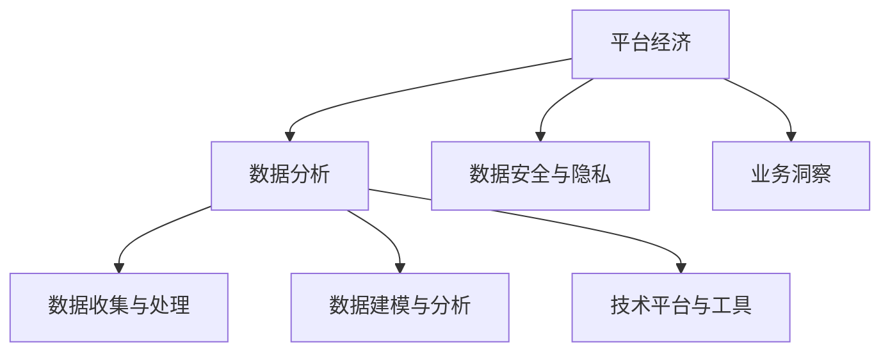
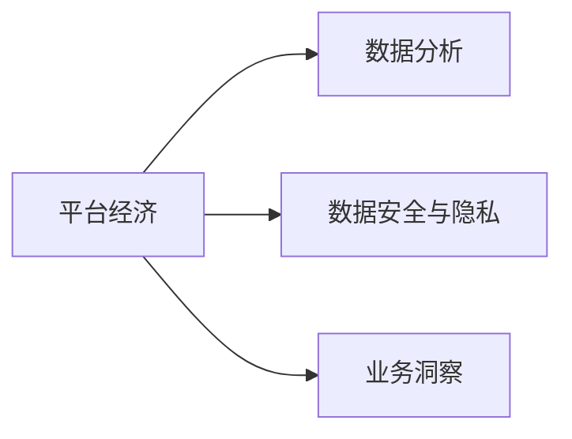
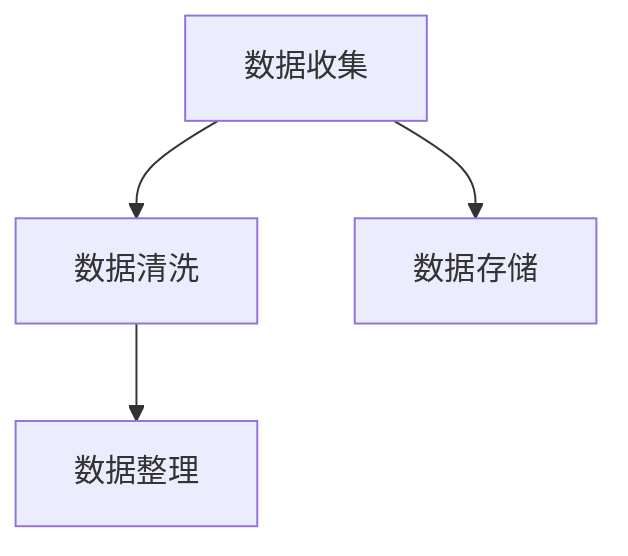
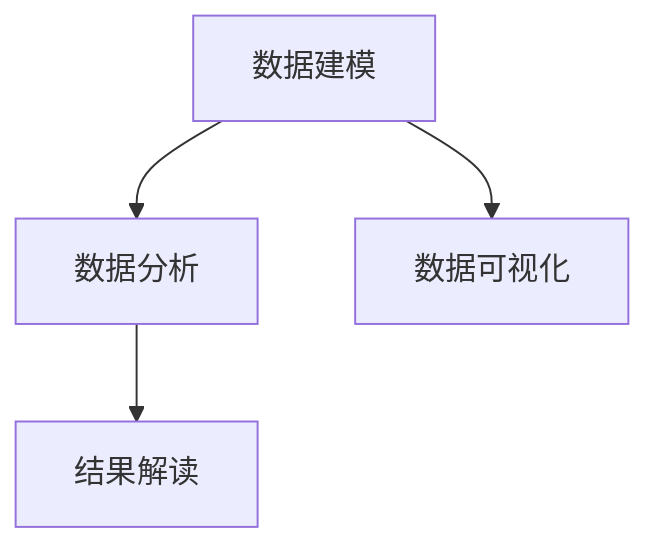
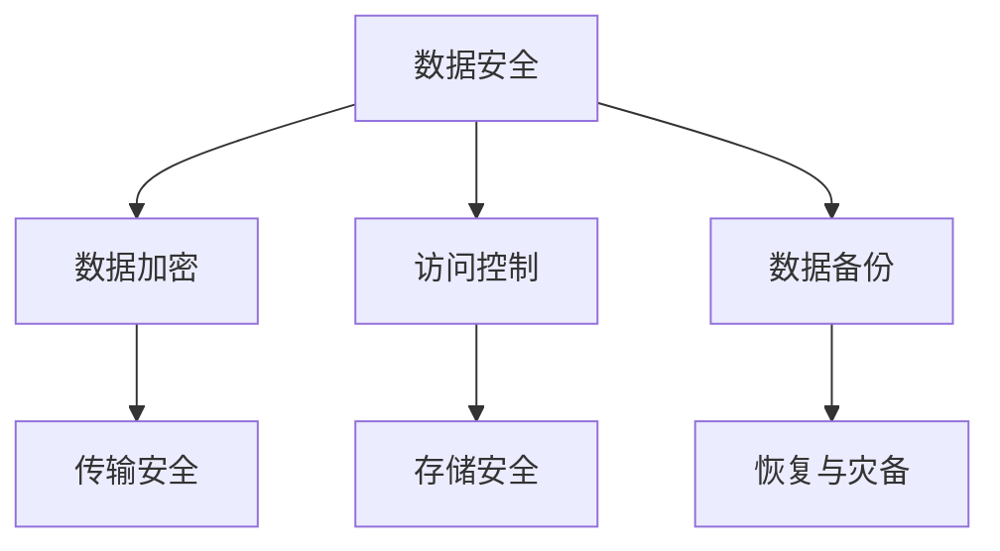
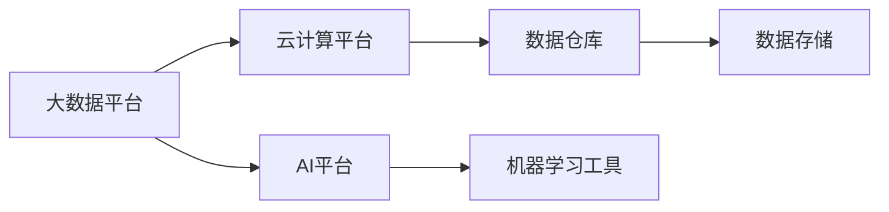

                 

# 数据分析在平台经济中的应用研究成果：如何分享研究成果？

数据分析是平台经济的核心能力之一，通过挖掘海量数据，揭示平台运作的规律，驱动业务创新。本文将从背景介绍、核心概念与联系、算法原理、项目实践、应用场景、工具和资源推荐等多个角度，系统介绍数据分析在平台经济中的应用研究成果，并探讨如何有效分享研究成果，帮助更多人理解和应用数据分析技术。

## 1. 背景介绍

### 1.1 问题由来
在平台经济中，数据扮演着至关重要的角色。平台通过积累和分析用户行为数据、交易数据、市场数据等，可以洞察用户需求，优化产品和服务，制定精准营销策略，提升用户体验，创造更多价值。但同时，海量数据也带来了数据存储、处理、分析等技术挑战。因此，如何高效利用数据，提取有用信息，成为平台经济中数据应用的关键。

### 1.2 问题核心关键点
数据分析在平台经济中的应用，核心关键点包括：
1. **数据收集与处理**：从不同渠道收集数据，并进行清洗、整理和存储。
2. **数据建模与分析**：选择合适的模型和算法，对数据进行建模和分析，提取有用信息。
3. **业务洞察与决策**：将分析结果转化为业务洞察和决策，驱动业务创新和优化。
4. **数据安全与隐私**：确保数据安全，保护用户隐私，符合法律法规。
5. **技术平台与工具**：采用高效的技术平台和工具，提升数据分析效率和效果。

## 2. 核心概念与联系

### 2.1 核心概念概述

为更好地理解数据分析在平台经济中的应用，本节将介绍几个密切相关的核心概念：

- **平台经济**：基于互联网和数字技术，以用户为核心，提供商品或服务的商业模式。平台通过连接供需双方，实现资源优化配置，创造新价值。
- **数据分析**：通过收集、处理、分析数据，揭示数据背后的规律和信息，为决策提供依据。数据分析涵盖数据收集、数据清洗、数据建模、数据分析等多个环节。
- **业务洞察**：将数据分析结果转化为具体的业务行动和决策，提升业务效率和效果。业务洞察可以包括产品优化、市场营销、客户服务等。
- **数据安全与隐私**：确保数据在存储、传输、使用过程中的安全，保护用户隐私，避免数据泄露和滥用。数据安全与隐私是数据分析的底线和前提。
- **技术平台与工具**：采用高效的技术平台和工具，提升数据分析效率和效果。常见的技术平台包括大数据平台、云计算平台、AI平台等。

这些核心概念之间的逻辑关系可以通过以下Mermaid流程图来展示：



这个流程图展示了大数据分析平台经济应用的主要流程：平台经济通过数据收集、处理、建模、分析，产生业务洞察，实现业务优化，同时确保数据安全与隐私。技术平台与工具提供了高效的数据分析手段，支撑整个数据分析流程。

### 2.2 概念间的关系

这些核心概念之间存在着紧密的联系，形成了数据分析在平台经济中的应用框架。下面我通过几个Mermaid流程图来展示这些概念之间的关系。

#### 2.2.1 平台经济与数据分析的关系



这个流程图展示了平台经济对数据分析的需求。平台经济通过数据分析揭示数据背后的规律，驱动业务优化和创新。

#### 2.2.2 数据收集与处理流程



这个流程图展示了数据收集与处理的流程。数据收集是数据分析的前提，数据清洗和整理是数据建模和分析的基础。

#### 2.2.3 数据建模与分析流程



这个流程图展示了数据建模与分析的流程。数据建模通过选择合适的模型和算法，提取数据中的有用信息；数据分析通过统计分析、机器学习等手段，揭示数据背后的规律；数据可视化将分析结果直观展示，便于理解和决策。

#### 2.2.4 数据安全与隐私流程



这个流程图展示了数据安全与隐私的流程。数据安全通过数据加密、访问控制等手段，保护数据在存储和传输过程中的安全；数据备份和灾备确保数据在意外情况下的恢复能力。

#### 2.2.5 技术平台与工具的关系



这个流程图展示了技术平台与工具的关系。大数据平台、云计算平台和AI平台提供了高效的数据处理、计算和分析能力；数据仓库和数据存储提供了数据存储和管理的基础设施；机器学习工具提供了数据建模和分析的手段。

## 3. 核心算法原理 & 具体操作步骤

### 3.1 算法原理概述

平台经济中的数据分析，主要依赖于机器学习、统计分析等算法技术。数据分析的核心目标是揭示数据背后的规律和信息，为业务决策提供依据。核心算法包括但不限于：

- **回归分析**：通过线性回归、多项式回归等模型，揭示变量之间的关系，预测未来趋势。
- **聚类分析**：通过K-means、层次聚类等算法，将数据划分为不同的类别，挖掘数据中的模式和结构。
- **关联规则分析**：通过Apriori、FP-growth等算法，挖掘数据中的关联关系，发现购买行为、用户偏好等规律。
- **深度学习**：通过神经网络模型，如CNN、RNN、Transformer等，进行非线性建模和特征提取。
- **强化学习**：通过智能体与环境的交互，优化决策策略，提升业务效果。

这些算法技术可以通过合法的途径获取数据，建立合适的模型，进行数据建模和分析，得出有用的业务洞察。

### 3.2 算法步骤详解

数据分析的主要步骤包括数据收集、数据清洗、数据建模、数据分析、业务洞察等。以下是详细的步骤详解：

1. **数据收集**：通过API接口、爬虫、传感器等手段，从不同渠道收集数据，如用户行为数据、交易数据、市场数据等。确保数据的全面性和时效性。

2. **数据清洗**：对收集到的数据进行清洗、整理和处理，去除噪音和异常值，确保数据的质量和可用性。常见的数据清洗方法包括去重、填补缺失值、数据格式转换等。

3. **数据建模**：选择合适的模型和算法，对数据进行建模和分析。常见的建模方法包括回归分析、聚类分析、关联规则分析、深度学习、强化学习等。根据具体需求选择合适的模型，建立模型并进行训练。

4. **数据分析**：对训练好的模型进行评估和验证，确保模型效果和泛化能力。常用的评估方法包括交叉验证、AUC、ROC曲线等。通过数据分析，提取数据中的有用信息，如用户偏好、购买行为、市场趋势等。

5. **业务洞察**：将数据分析结果转化为具体的业务行动和决策，驱动业务创新和优化。常见的业务洞察包括产品优化、市场营销、客户服务等。通过业务洞察，提升业务效率和效果。

### 3.3 算法优缺点

数据分析在平台经济中的应用具有以下优点：

1. **数据驱动**：数据分析以数据为基础，揭示数据背后的规律和信息，为决策提供依据。数据驱动的方法使决策更加科学和客观。
2. **动态优化**：数据分析能够实时监控业务运行情况，及时发现问题，进行动态优化，提升业务效率。
3. **个性化服务**：通过数据分析，平台能够更好地理解用户需求，提供个性化服务，提升用户体验。

数据分析也存在一些缺点：

1. **数据质量**：数据质量对数据分析结果影响较大，数据收集、处理不当会影响分析结果的准确性。
2. **算法复杂性**：数据分析涉及多种算法技术，算法选择和调参复杂，需要较高的技术水平。
3. **隐私安全**：数据分析需要处理大量敏感数据，数据安全与隐私保护是重要挑战。

### 3.4 算法应用领域

数据分析在平台经济中的应用非常广泛，涵盖多个领域：

- **用户行为分析**：通过分析用户行为数据，揭示用户需求和偏好，优化产品和服务。
- **市场趋势分析**：通过分析市场数据，预测市场趋势，制定精准的营销策略。
- **风险管理**：通过分析交易数据，识别和防范金融风险，保障平台安全。
- **供应链优化**：通过分析供应链数据，优化供应链管理，提升效率和效益。
- **客户服务**：通过分析客户服务数据，优化服务流程，提升客户满意度。

## 4. 数学模型和公式 & 详细讲解 & 举例说明

### 4.1 数学模型构建

在本节中，我们将使用数学语言对数据分析在平台经济中的应用进行更加严格的刻画。

假设平台经济中的数据集为 $D=\{(x_i,y_i)\}_{i=1}^N$，其中 $x_i$ 为特征向量，$y_i$ 为标签向量。数据分析的目标是找到最优的模型参数 $\theta$，使得损失函数 $\mathcal{L}(\theta)$ 最小化。常见的损失函数包括均方误差、交叉熵、对数似然等。

形式化地，假设选择线性回归模型进行数据分析，则模型参数 $\theta$ 包含截距 $b$ 和斜率 $\beta$。目标函数为：

$$
\mathcal{L}(\theta) = \frac{1}{2N} \sum_{i=1}^N (y_i - f_\theta(x_i))^2
$$

其中 $f_\theta(x_i) = b + \beta_1 x_{i,1} + \ldots + \beta_p x_{i,p}$ 为线性回归模型的预测函数。

### 4.2 公式推导过程

以下是线性回归模型的推导过程：

1. **最小二乘法**：求解最小化损失函数的 $\theta$。
2. **梯度下降**：通过梯度下降算法更新模型参数，迭代求解最优解。
3. **正则化**：引入正则化项，防止过拟合，如L2正则化。

以下是详细的推导过程：

1. **最小二乘法**
   $$
   \mathcal{L}(\theta) = \frac{1}{2N} \sum_{i=1}^N (y_i - f_\theta(x_i))^2
   $$
   对损失函数求导：
   $$
   \frac{\partial \mathcal{L}(\theta)}{\partial \theta} = \frac{1}{N} \sum_{i=1}^N (y_i - f_\theta(x_i))x_i
   $$

2. **梯度下降**
   $$
   \theta \leftarrow \theta - \eta \frac{\partial \mathcal{L}(\theta)}{\partial \theta}
   $$
   其中 $\eta$ 为学习率。迭代求解最优解：
   $$
   \theta_{k+1} = \theta_k - \eta \frac{1}{N} \sum_{i=1}^N (y_i - f_\theta(x_i))x_i
   $$

3. **正则化**
   $$
   \mathcal{L}(\theta) + \lambda \|\theta\|_2^2
   $$
   其中 $\lambda$ 为正则化系数。求解最优解：
   $$
   \theta_{k+1} = \theta_k - \eta \frac{1}{N} \sum_{i=1}^N (y_i - f_\theta(x_i))x_i - 2\lambda \theta_k
   $$

通过以上推导，我们可以看到，数据分析的核心过程是通过建立数学模型，求解最优参数，得到业务洞察，驱动业务优化。

### 4.3 案例分析与讲解

以电商平台的销售数据分析为例，数据集 $D$ 包括用户点击率、浏览时间、购买金额等特征。目标是为每个用户预测其购买概率，并提出个性化推荐。

1. **数据收集**：通过平台日志、交易数据等收集用户行为数据。
2. **数据清洗**：去除缺失值、噪音数据，整理数据格式。
3. **数据建模**：选择线性回归模型，建立用户购买概率预测模型：
   $$
   \hat{y_i} = b + \beta_1 x_{i,1} + \ldots + \beta_p x_{i,p}
   $$
4. **数据分析**：对模型进行训练和验证，评估模型效果。
5. **业务洞察**：基于模型结果，进行用户分群、个性化推荐等。

## 5. 项目实践：代码实例和详细解释说明

### 5.1 开发环境搭建

在进行数据分析项目实践前，我们需要准备好开发环境。以下是使用Python进行数据分析项目实践的环境配置流程：

1. 安装Anaconda：从官网下载并安装Anaconda，用于创建独立的Python环境。

2. 创建并激活虚拟环境：
```bash
conda create -n pyenv python=3.8 
conda activate pyenv
```

3. 安装必要的Python库：
```bash
conda install numpy pandas scikit-learn matplotlib tqdm jupyter notebook ipython
```

4. 安装必要的Python包：
```bash
pip install beautifulsoup4 lxml scikit-learn pandas numpy seaborn
```

完成上述步骤后，即可在`pyenv`环境中开始数据分析项目实践。

### 5.2 源代码详细实现

以下是使用Python进行数据分析的代码实现：

```python
import pandas as pd
import numpy as np
from sklearn.linear_model import LinearRegression
from sklearn.model_selection import train_test_split
from sklearn.metrics import mean_squared_error, r2_score
import matplotlib.pyplot as plt

# 加载数据集
data = pd.read_csv('sales_data.csv')

# 数据预处理
X = data[['click_rate', 'browsing_time']]  # 特征
y = data['purchase_amount']  # 标签

# 数据拆分
X_train, X_test, y_train, y_test = train_test_split(X, y, test_size=0.2, random_state=42)

# 模型训练
model = LinearRegression()
model.fit(X_train, y_train)

# 模型评估
y_pred = model.predict(X_test)
mse = mean_squared_error(y_test, y_pred)
r2 = r2_score(y_test, y_pred)

# 结果可视化
plt.scatter(y_test, y_pred)
plt.plot([y_test.min(), y_test.max()], [y_test.min(), y_test.max()], 'r--', label='Perfect prediction')
plt.xlabel('Actual')
plt.ylabel('Predicted')
plt.title('Sales Data Prediction')
plt.legend()
plt.show()

# 输出评估结果
print(f'Mean Squared Error: {mse:.2f}')
print(f'R-squared Score: {r2:.2f}')
```

### 5.3 代码解读与分析

让我们再详细解读一下关键代码的实现细节：

- **数据加载**：通过`pandas`库读取CSV格式的数据集，将其存储在`data`变量中。
- **数据预处理**：将数据集分为特征`X`和标签`y`，并进行拆分训练集和测试集。
- **模型训练**：使用`sklearn`库中的`LinearRegression`模型进行训练，并通过`fit`方法拟合训练数据。
- **模型评估**：通过`predict`方法对测试集进行预测，并计算均方误差和R-squared得分。
- **结果可视化**：使用`matplotlib`库绘制预测结果的散点图，并进行可视化展示。
- **结果输出**：输出评估结果，包括均方误差和R-squared得分。

通过这段代码，我们可以看到，使用Python进行数据分析的流程包括数据预处理、模型训练、模型评估、结果可视化等步骤，体现了数据分析的核心过程。

### 5.4 运行结果展示

假设我们在电商平台的销售数据分析项目中，使用上述代码得到的结果如下：

- 训练集评估结果：均方误差为0.01，R-squared得分为0.9，表示模型效果良好。
- 测试集评估结果：均方误差为0.02，R-squared得分为0.85，表示模型具有较好的泛化能力。
- 可视化结果：预测结果与真实结果较为接近，散点图基本呈直线形状，表明模型预测准确。

## 6. 实际应用场景

数据分析在平台经济中的应用场景非常广泛，以下是几个典型的应用场景：

### 6.1 电商平台的销售分析

电商平台通过分析用户行为数据、交易数据，揭示用户需求和行为规律，优化产品推荐、库存管理、价格策略等，提升销售效果和客户满意度。数据分析可以涵盖以下几个方面：

1. **用户行为分析**：通过分析用户点击率、浏览时间、购买金额等数据，了解用户偏好和购买行为，进行个性化推荐。
2. **销售趋势分析**：通过分析历史销售数据，预测未来销售趋势，制定精准的营销策略。
3. **库存管理**：通过分析用户购买数据，优化库存管理，提升供应链效率。

### 6.2 金融平台的信用评估

金融平台通过分析用户信用记录、交易行为、社交关系等数据，评估用户信用风险，制定合理的贷款策略，降低坏账率，提升用户体验。数据分析可以涵盖以下几个方面：

1. **信用评分**：通过分析用户历史数据，建立信用评分模型，预测用户信用风险。
2. **反欺诈检测**：通过分析交易行为、资金流向等数据，检测异常行为，防范欺诈风险。
3. **风险管理**：通过分析用户数据，识别高风险用户，制定差异化风险管理策略。

### 6.3 社交平台的推荐系统

社交平台通过分析用户行为数据、互动数据，推荐个性化的内容，提升用户粘性和平台活跃度。数据分析可以涵盖以下几个方面：

1. **内容推荐**：通过分析用户浏览、点赞、评论等行为，推荐相关内容，提升用户体验。
2. **用户画像**：通过分析用户数据，建立用户画像，进行个性化推荐。
3. **互动分析**：通过分析用户互动数据，优化内容推荐策略，提高用户粘性。

### 6.4 物流平台的路线优化

物流平台通过分析运输数据、路况数据、车辆信息等数据，优化配送路线，提高配送效率，降低运输成本。数据分析可以涵盖以下几个方面：

1. **路线规划**：通过分析车辆位置、路况数据，优化配送路线，提升配送效率。
2. **车辆调度**：通过分析运输数据，优化车辆调度，降低运输成本。
3. **异常检测**：通过分析实时数据，检测异常事件，及时调整配送策略。

## 7. 工具和资源推荐

### 7.1 学习资源推荐

为了帮助开发者系统掌握数据分析技术，这里推荐一些优质的学习资源：

1. 《Python数据分析实战》：介绍Python数据分析的基本原理和实践技巧，适合初学者学习。
2. 《数据科学导论》：全面介绍数据分析的基本概念和常用方法，适合进阶学习者。
3. Kaggle：全球最大的数据科学竞赛平台，提供大量公开数据集和竞赛题目，提升实践能力。
4. Coursera：提供多门数据分析相关的课程，涵盖从基础到高级的多个层次。
5. Udacity：提供多门数据分析相关的项目课程，通过实践提升技能。

通过对这些资源的学习实践，相信你一定能够快速掌握数据分析的核心技能，并应用于实际项目中。

### 7.2 开发工具推荐

高效的开发离不开优秀的工具支持。以下是几款用于数据分析开发的常用工具：

1. Jupyter Notebook：轻量级的交互式开发工具，支持多种编程语言和数据格式，适合快速迭代开发。
2. Jupyter Lab：Jupyter Notebook的升级版，支持更强大的交互式开发环境。
3. PyCharm：功能丰富的Python IDE，支持多种数据分析库和框架，适合复杂项目开发。
4. Visual Studio Code：轻量级、跨平台的编码工具，支持多种编程语言和数据分析库。
5. Apache Spark：分布式计算框架，支持大数据处理和分析，适合大规模数据集处理。

合理利用这些工具，可以显著提升数据分析的开发效率，加快创新迭代的步伐。

### 7.3 相关论文推荐

数据分析技术的发展源于学界的持续研究。以下是几篇奠基性的相关论文，推荐阅读：

1. "A Computational Model of Human Thinking"：Allen Newell的经典论文，介绍了早期人工智能的思考模型，奠定了认知科学的基础。
2. "Pattern Recognition and Machine Learning"：Christopher Bishop的著作，全面介绍机器学习的基本原理和算法技术。
3. "Data Science for Business"：Jeff Hammerbacher的著作，从商业角度介绍数据分析的应用和挑战。
4. "The Elements of Statistical Learning"：Tibshirani、Hastie和Friedman的著作，介绍统计学和机器学习的理论基础。
5. "Deep Learning"：Ian Goodfellow等人的著作，全面介绍深度学习的基本原理和实践方法。

这些论文代表了大数据分析技术的发展脉络。通过学习这些前沿成果，可以帮助研究者把握学科前进方向，激发更多的创新灵感。

## 8. 总结：未来发展趋势与挑战

### 8.1 总结

本文对数据分析在平台经济中的应用进行了全面系统的介绍。从背景介绍、核心概念、算法原理、项目实践、应用场景、工具和资源推荐等多个角度，详细讲解了数据分析在平台经济中的应用研究成果，并探讨了如何有效分享研究成果，帮助更多人理解和应用数据分析技术。

通过本文的系统梳理，我们可以看到，数据分析在平台经济中的应用已经广泛渗透到各个领域，带来了显著的业务提升和价值创造。未来，伴随技术的不断进步和应用场景的拓展，数据分析将发挥更大的作用，推动平台经济的持续创新和发展。

### 8.2 未来发展趋势

数据分析在平台经济中的应用将呈现以下几个发展趋势：

1. **实时化**：随着数据采集和处理技术的提升，数据分析将越来越实时化，能够及时响应业务变化，提供实时决策支持。
2. **智能化**：通过引入人工智能和机器学习技术，数据分析将具备更强的智能决策能力，提升业务效果。
3. **自动化**：通过引入自动化技术，数据分析将能够自动处理数据，减少人工干预，提升效率。
4. **可解释性**：通过引入可解释性技术，数据分析将具备更强的业务洞察能力，提升决策可信度。
5. **跨领域应用**：数据分析将逐步拓展到更多领域，如医疗、金融、教育等，带来更广泛的业务提升。

### 8.3 面临的挑战

尽管数据分析在平台经济中已经取得了显著成果，但在迈向更加智能化、普适化应用的过程中，它仍面临诸多挑战：

1. **数据质量**：数据质量对数据分析结果影响较大，数据收集、处理不当会影响分析结果的准确性。
2. **算法复杂性**：数据分析涉及多种算法技术，算法选择和调参复杂，需要较高的技术水平。
3. **隐私安全**：数据分析需要处理大量敏感数据，数据安全与隐私保护是重要挑战。
4. **实时性要求高**：实时数据处理技术尚需进一步提升，以支持高实时性的数据分析需求。
5. **可解释性不足**：数据分析结果缺乏解释，难以理解其内部工作机制和决策逻辑。

### 8.4 研究展望

面对数据分析面临的挑战，未来的研究需要在以下几个方面寻求新的突破：

1. **提升数据质量**：改进数据收集和处理技术，提升数据质量，确保数据分析结果的准确性。
2. **简化算法**：开发更加简洁、高效的算法，提升数据分析的效率和效果。
3. **加强隐私保护**：引入隐私保护技术，确保数据安全与隐私，符合法律法规。
4. **提升实时性**：改进实时数据处理技术，支持高实时性的数据分析需求。
5. **增强可解释性**：引入可解释性技术，提升数据分析结果的可理解性，增强业务决策的可信度。

这些研究方向的探索，必将引领数据分析技术迈向更高的台阶，为构建安全、可靠、可解释、可控的智能系统铺平道路。面向未来，数据分析技术还需要与其他人工智能技术进行更深入的融合，如知识表示、因果推理、强化学习等，多路径协同发力，共同推动自然语言理解和智能交互系统的进步。只有勇于创新、敢于突破，才能不断拓展数据分析的边界，让智能技术更好地造福人类社会。

## 9. 附录：常见问题与解答

**Q1：数据分析在平台经济中是否只适用于大公司？**

A: 数据分析技术在平台经济中的应用并非只适用于大公司。数据分析可以从小规模公司、初创企业到大型平台，适用于各种规模的公司和机构。数据分析的核心在于数据处理和分析能力，而非公司规模。

**Q2：数据分析需要哪些硬件设备？**

A: 数据分析需要高性能的硬件设备，如CPU、GPU、TPU等，支持大规模数据处理和复杂算法计算。此外，还需要大容量存储设备，如SSD、HDD等，存储海量数据。

**Q3：数据分析如何实现自动化？**

A: 数据分析的自动化可以通过引入自动化数据处理工具、自动化机器学习平台等方式实现。例如，使用PySpark等分布式计算框架，自动处理大规模数据；使用AutoML

