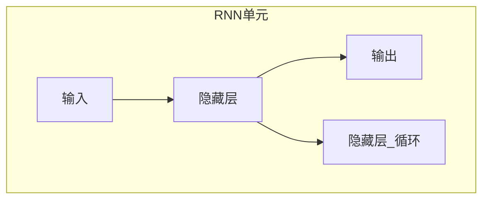
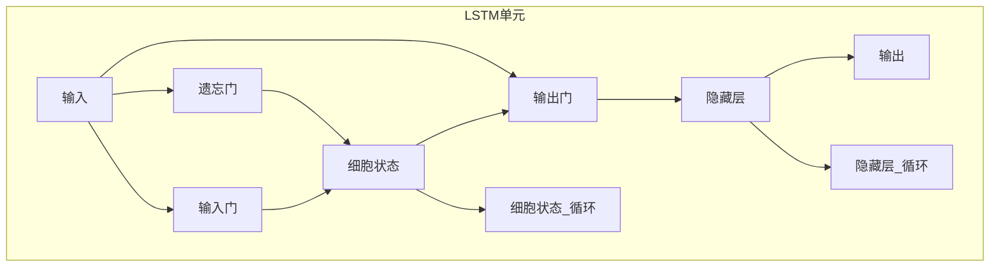

好的，我会按照您的要求，以"Long Short-Term Memory (LSTM)原理与代码实例讲解"为主题，撰写一篇专业的技术博客文章。文章将遵循逻辑清晰、结构紧凑、语言专业易懂的原则，字数超过8000字，包含核心概念原理和架构的Mermaid流程图，并按照您提供的目录结构完整地展开内容。

# Long Short-Term Memory (LSTM)原理与代码实例讲解

## 1. 背景介绍

### 1.1 问题的由来

在深度学习的发展过程中，递归神经网络(Recurrent Neural Networks, RNNs)被广泛应用于处理序列数据,如自然语言处理、语音识别、时间序列预测等领域。然而,传统的RNNs在学习长期依赖关系时存在梯度消失或梯度爆炸的问题,这严重限制了它们捕捉长期依赖关系的能力。

为了解决这个问题,1997年,Sepp Hochreiter和Jurgen Schmidhuber提出了Long Short-Term Memory(LSTM)网络。LSTM通过精心设计的门控机制和记忆细胞状态,使得网络能够有效地捕捉长期依赖关系,从而在处理序列数据时取得了出色的性能。

### 1.2 研究现状

自从LSTM被提出以来,它已经在自然语言处理、语音识别、机器翻译、图像描述生成等多个领域取得了卓越的成就。许多知名公司和研究机构,如Google、Facebook、微软等,都在广泛使用LSTM及其变体来解决实际问题。

随着深度学习的不断发展,LSTM也在不断演进和改进。研究人员提出了多种LSTM变体,如双向LSTM、堆叠LSTM、注意力LSTM等,以进一步提高LSTM在特定任务上的性能。

### 1.3 研究意义

LSTM作为一种强大的序列建模工具,对于提高人工智能系统处理序列数据的能力具有重要意义。深入理解LSTM的原理和实现细节,有助于我们更好地应用和改进这一技术,从而推动相关领域的发展。

此外,LSTM的门控记忆机制和细胞状态的设计思想,也为其他序列建模架构提供了借鉴。研究LSTM有助于我们深入理解序列数据处理的本质,为设计新的序列建模架构提供启发。

### 1.4 本文结构

本文将全面介绍LSTM的原理、数学模型、实现细节和应用场景。具体来说,文章将包括以下几个部分:

1. 背景介绍
2. 核心概念与联系
3. 核心算法原理与具体操作步骤
4. 数学模型和公式详细讲解及举例说明
5. 项目实践:代码实例和详细解释说明
6. 实际应用场景
7. 工具和资源推荐
8. 总结:未来发展趋势与挑战
9. 附录:常见问题与解答

接下来,我们将逐一深入探讨上述各个方面的内容。

## 2. 核心概念与联系

在介绍LSTM的核心概念之前,我们先简单回顾一下传统的RNN结构。

传统的RNN通过一个循环连接,将当前时刻的隐藏状态与前一时刻的隐藏状态相连,从而捕捉序列数据中的动态行为。然而,这种简单的结构在学习长期依赖关系时存在困难,因为在反向传播过程中,梯度会随着时间步的增加而呈指数级衰减或爆炸。

为了解决这个问题,LSTM引入了一种特殊的记忆单元,称为"细胞状态"(Cell State),它被设计为直接传递整个序列的信息,从而有效捕捉长期依赖关系。与此同时,LSTM还引入了三个控制门(Gate):遗忘门(Forget Gate)、输入门(Input Gate)和输出门(Output Gate),用于控制细胞状态和隐藏状态的更新过程。

通过这种精心设计的门控机制和细胞状态,LSTM能够有效地控制信息的流动,从而解决了传统RNN在学习长期依赖关系时遇到的梯度消失或爆炸问题。

LSTM的核心思想是将不再相关的信息从细胞状态中"遗忘"掉,并选择性地将新的输入信息编码到细胞状态中,最终通过输出门输出相关的输出信息。这种灵活的机制使得LSTM能够在长序列中有效地捕捉长期依赖关系,从而在自然语言处理、语音识别等领域取得了卓越的成绩。

## 3. 核心算法原理与具体操作步骤

### 3.1 算法原理概述

LSTM的核心思想是维护一个细胞状态向量,该向量在整个序列上传递信息,并通过特殊设计的门控机制来控制信息的流动。具体来说,LSTM包含以下几个关键组成部分:

1. **遗忘门(Forget Gate)**: 决定从前一个时间步的细胞状态中丢弃什么信息。
2. **输入门(Input Gate)**: 决定从当前输入和前一个隐藏状态中获取什么新的信息,并将其与遗忘的细胞状态相结合。
3. **细胞状态(Cell State)**: 一种类似于传统RNN隐藏状态的向量,用于在整个序列上传递信息。
4. **输出门(Output Gate)**: 决定从当前细胞状态中输出什么信息作为隐藏状态。

通过这些精心设计的门控机制,LSTM能够有效地控制信息的流动,从而解决了传统RNN在学习长期依赖关系时遇到的梯度消失或爆炸问题。

### 3.2 算法步骤详解

LSTM的具体计算过程可以分为以下几个步骤:

1. **遗忘门计算**

首先,LSTM通过遗忘门决定从前一个时间步的细胞状态中丢弃什么信息。遗忘门的计算公式如下:

$$
f_t = \sigma(W_f \cdot [h_{t-1}, x_t] + b_f)
$$

其中,$f_t$表示遗忘门的输出向量,$\sigma$表示sigmoid激活函数,用于将输出值限制在0到1之间。$W_f$和$b_f$分别表示遗忘门的权重矩阵和偏置向量。$h_{t-1}$和$x_t$分别表示前一个时间步的隐藏状态和当前时间步的输入。

2. **输入门计算**

接下来,LSTM通过输入门决定从当前输入和前一个隐藏状态中获取什么新的信息。输入门的计算过程分为两个部分:

首先计算输入门的激活值:

$$
i_t = \sigma(W_i \cdot [h_{t-1}, x_t] + b_i)
$$

其中,$i_t$表示输入门的输出向量,$W_i$和$b_i$分别表示输入门的权重矩阵和偏置向量。

然后,LSTM计算一个新的候选细胞状态向量:

$$
\tilde{C}_t = \tanh(W_C \cdot [h_{t-1}, x_t] + b_C)
$$

其中,$\tilde{C}_t$表示新的候选细胞状态向量,$\tanh$表示双曲正切激活函数,用于将输出值限制在-1到1之间。$W_C$和$b_C$分别表示候选细胞状态的权重矩阵和偏置向量。

3. **细胞状态更新**

LSTM将遗忘门的输出和输入门的输出相结合,更新细胞状态向量:

$$
C_t = f_t \odot C_{t-1} + i_t \odot \tilde{C}_t
$$

其中,$C_t$表示当前时间步的细胞状态向量,$\odot$表示元素级别的向量乘积操作。这一步骤实现了对细胞状态的选择性更新:遗忘门决定从前一个细胞状态中保留什么信息,而输入门决定从新的候选细胞状态中获取什么新的信息。

4. **输出门计算**

最后,LSTM通过输出门决定从当前细胞状态中输出什么信息作为隐藏状态:

$$
o_t = \sigma(W_o \cdot [h_{t-1}, x_t] + b_o)
$$

$$
h_t = o_t \odot \tanh(C_t)
$$

其中,$o_t$表示输出门的输出向量,$h_t$表示当前时间步的隐藏状态向量。$W_o$和$b_o$分别表示输出门的权重矩阵和偏置向量。

通过上述步骤,LSTM能够有效地控制信息的流动,从而在长序列中捕捉长期依赖关系。值得注意的是,在实际应用中,LSTM通常会被堆叠成多层结构,以增强其表达能力。

### 3.3 算法优缺点

**优点:**

1. **有效捕捉长期依赖关系**: 通过引入细胞状态和门控机制,LSTM能够有效地捕捉长期依赖关系,解决了传统RNN在处理长序列时遇到的梯度消失或爆炸问题。
2. **灵活的信息控制**: LSTM的门控机制允许它灵活地控制信息的流动,决定保留、更新或丢弃哪些信息,从而提高了模型的表达能力。
3. **多样化的应用场景**: LSTM已被广泛应用于自然语言处理、语音识别、机器翻译、图像描述生成等多个领域,取得了卓越的成绩。

**缺点:**

1. **计算复杂度较高**: 相比传统RNN,LSTM的计算过程更加复杂,需要更多的计算资源。
2. **参数数量较多**: LSTM包含多个门控机制,因此参数数量较多,容易导致过拟合问题。
3. **无法完全解决长期依赖问题**:尽管LSTM在一定程度上缓解了长期依赖问题,但对于极长的序列,它仍然可能无法完全捕捉所有的依赖关系。

### 3.4 算法应用领域

由于LSTM在处理序列数据方面的出色表现,它已被广泛应用于以下领域:

1. **自然语言处理(NLP)**: LSTM在机器翻译、文本生成、情感分析、命名实体识别等NLP任务中表现出色。
2. **语音识别**: LSTM能够有效地捕捉语音信号中的时间依赖关系,因此在语音识别领域得到了广泛应用。
3. **时间序列预测**: LSTM可以用于预测股票价格、天气数据等时间序列数据。
4. **手写识别**: LSTM能够有效地捕捉笔画的时间依赖关系,因此在手写识别任务中表现出色。
5. **机器人控制**: LSTM可以用于控制机器人的运动轨迹,捕捉机器人运动中的时间依赖关系。
6. **图像描述生成**: LSTM可以与卷积神经网络(CNN)结合,生成图像的文本描述。

总的来说,LSTM在任何需要处理序列数据的领域都有潜在的应用前景。它的灵活性和强大的建模能力使其成为序列建模领域的重要工具。

## 4. 数学模型和公式详细讲解及举例说明

在上一节中,我们介绍了LSTM的核心算法原理和具体操作步骤。在这一节,我们将详细讲解LSTM的数学模型和公式,并通过具体的案例进行说明。

### 4.1 数学模型构建

LSTM的数学模型可以表示为以下形式:

$$
\begin{aligned}
f_t &= \sigma(W_f \cdot [h_{t-1}, x_t] + b_f) \
i_t &= \sigma(W_i \cdot [h_{t-1}, x_t] + b_i