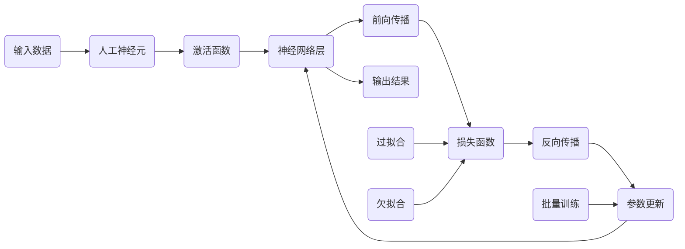

# 深度学习原理与代码实例讲解

作者：禅与计算机程序设计艺术 / Zen and the Art of Computer Programming 

## 1. 背景介绍
### 1.1  问题的由来
深度学习作为人工智能领域的一个重要分支,其强大的特征学习和表示能力使其在计算机视觉、语音识别、自然语言处理等诸多领域取得了突破性的进展。然而,对于很多初学者和非专业人士来说,深度学习的原理和实现过程仍然是一个黑箱。如何通俗易懂地解释深度学习的核心概念,并提供详细的代码实例,成为了一个亟待解决的问题。

### 1.2  研究现状
目前市面上已经有不少关于深度学习的书籍和教程,但大多数要么过于理论化,要么只提供简单的代码示例,很难对深度学习形成全面而深入的理解。一些网络上的教程质量参差不齐,缺乏系统性和权威性。因此,写一篇既能深入浅出地阐述深度学习原理,又能提供完整代码实践的技术博客,显得尤为重要和必要。

### 1.3  研究意义
通过本文的研究和讲解,可以帮助读者:
1. 理解深度学习的核心概念和原理,包括人工神经网络、前向传播、反向传播、损失函数、优化算法等。
2. 掌握深度学习常用的数学模型和公式,并能够灵活运用。
3. 获得项目实战经验,能够使用Python和主流深度学习框架如TensorFlow/Keras、PyTorch等搭建自己的网络模型。
4. 了解深度学习在计算机视觉、自然语言处理等领域的应用案例,启发解决实际问题的思路。
5. 预见深度学习技术的发展趋势,把握未来的研究方向。

总的来说,本文致力于为深度学习初学者提供一个全面、系统、实用的学习指南,同时也为相关研究人员提供一定的参考价值。

### 1.4  本文结构
全文共分为9个章节,主要内容安排如下:
- 第1章 背景介绍。说明选题背景、研究现状、意义以及全文结构。  
- 第2章 核心概念与联系。介绍深度学习的核心概念,如人工神经元、激活函数、神经网络、损失函数等,并分析它们之间的内在联系。
- 第3章 核心算法原理。对深度学习使用的主要算法如前向传播、反向传播等进行原理讲解,并提供具体的操作步骤。
- 第4章 数学模型和公式。介绍深度学习常用的数学模型,推导相关公式,并举例说明其应用。
- 第5章 项目实践。提供完整的深度学习项目代码实例,包括开发环境搭建、源代码实现、运行结果展示等,并进行代码解读。
- 第6章 实际应用场景。列举深度学习在图像分类、目标检测、语音识别、机器翻译等领域的实际应用案例。
- 第7章 工具和资源推荐。推荐深度学习的学习资源、开发工具、相关论文等。
- 第8章 总结与展望。总结全文的研究成果,分析深度学习的未来发展趋势、面临的挑战,并对进一步的研究工作提出展望。
- 第9章 附录。罗列深度学习领域一些常见问题,并给出解答。

## 2. 核心概念与联系

深度学习是基于人工神经网络的一种机器学习方法。它通过模拟人脑的神经元结构和工作机制,构建多层次的神经网络模型,从大量数据中自动学习特征表示,从而对未知数据进行预测和决策。

下面我们来了解一下深度学习的一些核心概念:

- 人工神经元(Artificial Neuron):也称作感知机(Perceptron),是神经网络的基本组成单元。它接收一组输入信号,通过加权求和以及非线性变换,得到输出结果。常见的神经元有McCulloch-Pitts(M-P)模型和Sigmoid神经元等。

- 激活函数(Activation Function):用于给神经元的输出添加非线性变换,使神经网络能够逼近任意复杂的函数。常用的激活函数包括Sigmoid、Tanh、ReLU (Rectified Linear Unit)等。

- 神经网络(Neural Network):由大量神经元按一定层次结构和连接方式构成的网络。一般包括输入层、隐藏层和输出层。隐藏层可以有多个,层数越多,网络的表达能力越强,但训练难度也越大。

- 前向传播(Forward Propagation):信号从输入层经各隐藏层传递到输出层的过程。通过逐层计算神经元的输出,得到网络的最终输出。

- 损失函数(Loss Function):也叫目标函数(Objective Function),用于衡量网络预测值与真实值之间的差距。常见的损失函数有均方误差(Mean Squared Error,MSE)、交叉熵(Cross Entropy)等。网络训练的目标就是最小化损失函数。

- 反向传播(Backpropagation):根据损失函数计算误差并将其反向传播到每一层,并使用梯度下降等优化算法更新网络参数(权重和偏置)的过程。通过多轮迭代,使网络的预测结果尽可能接近真实值。

- 过拟合(Overfitting):模型过度拟合训练数据,导致在测试集和实际应用中泛化能力下降的现象。解决方法包括增加数据量、使用正则化技术如L1/L2正则化、Dropout等。

- 欠拟合(Underfitting):模型拟合能力不足,无法很好地捕捉数据的内在模式和规律。解决方法包括增加网络复杂度、使用更强的特征表示等。

- 批量训练(Batch Training):将数据集分成若干个批次,每次使用一个批次的数据对网络进行训练并更新参数。与单个样本训练相比,批量训练可以提高训练效率和速度。

理解了这些核心概念,我们再来看它们之间的联系:

可以看出,输入数据经过神经元和激活函数的处理,在神经网络的各层之间进行前向传播,最终得到输出结果。然后通过损失函数评估输出与真实值的差距,再用反向传播算法计算梯度并更新网络参数,不断迭代直至模型性能达到最优。其中,过拟合和欠拟合会影响模型的泛化能力,需要采取相应的策略来缓解。批量训练可以加速模型学习过程。

总之,深度学习的各个概念环环相扣,共同构建起一个完整的理论和方法体系。后面我们将继续探讨其核心算法原理。

## 3. 核心算法原理 & 具体操作步骤
### 3.1  算法原理概述
深度学习的核心算法主要包括前向传播(Forward Propagation)和反向传播(Backpropagation)两大类。前者负责将输入信号从输入层传递到输出层,得到网络的预测输出;后者则根据损失函数计算误差并将其反向传播到每一层,并使用优化算法更新网络参数,使得预测输出尽可能接近真实值。两者相互配合,不断迭代,最终得到一个性能优异的深度学习模型。

### 3.2  算法步骤详解

#### 3.2.1 前向传播
假设我们有一个L层的神经网络,l=1,2,...,L表示网络的层数,第0层为输入层。前向传播的过程可以用数学公式表示为:

$$
a^{(0)} = x \
z^{(l)} = W^{(l)}a^{(l-1)} + b^{(l)}, l=1,2,...,L \  
a^{(l)} = g^{(l)}(z^{(l)}), l=1,2,...,L \
\hat{y} = a^{(L)} = g^{(L)}(z^{(L)})
$$

其中,
- $a^{(0)}=x$ 是输入层的激活值,也就是输入特征。
- $z^{(l)}$ 是第 $l$ 层的加权输入,由上一层的激活值 $a^{(l-1)}$ 与权重矩阵 $W^{(l)}$ 相乘,再加上偏置项 $b^{(l)}$ 得到。
- $g^{(l)}$ 是第 $l$ 层的激活函数,将加权输入 $z^{(l)}$ 映射为激活值 $a^{(l)}$。
- $\hat{y}=a^{(L)}$ 是网络的输出层激活值,也就是最终的预测输出。

前向传播的具体步骤如下:
1. 输入数据 $x$,令 $a^{(0)}=x$。
2. 对于 $l$ 从 1 到 $L$:
    - 计算第 $l$ 层的加权输入 $z^{(l)} = W^{(l)}a^{(l-1)} + b^{(l)}$
    - 计算第 $l$ 层的激活值 $a^{(l)} = g^{(l)}(z^{(l)})$
3. 输出层的激活值 $a^{(L)}$ 即为网络的预测输出 $\hat{y}$。

#### 3.2.2 反向传播
假设我们使用损失函数 $J(W,b)$ 来衡量网络预测输出与真实值之间的误差,反向传播算法的目标是求出损失函数 $J(W,b)$ 对每一层权重 $W^{(l)}$ 和偏置 $b^{(l)}$ 的梯度 $\frac{\partial J}{\partial W^{(l)}}$、$\frac{\partial J}{\partial b^{(l)}}$,并用梯度下降等优化算法更新网络参数,最小化损失函数。

反向传播的核心是链式法则,即损失函数 $J$ 的梯度可以层层反向传播:

$$
\frac{\partial J}{\partial W^{(l)}} = \frac{\partial J}{\partial z^{(l)}} \cdot \frac{\partial z^{(l)}}{\partial W^{(l)}} \
\frac{\partial J}{\partial b^{(l)}} = \frac{\partial J}{\partial z^{(l)}} \cdot \frac{\partial z^{(l)}}{\partial b^{(l)}}
$$

其中 $\frac{\partial J}{\partial z^{(l)}}$ 是第 $l$ 层加权输入 $z^{(l)}$ 的梯度,可以根据下一层的梯度 $\frac{\partial J}{\partial z^{(l+1)}}$ 递归计算得到:

$$
\frac{\partial J}{\partial z^{(l)}} = \frac{\partial J}{\partial z^{(l+1)}} \cdot \frac{\partial z^{(l+1)}}{\partial a^{(l)}} \cdot \frac{\partial a^{(l)}}{\partial z^{(l)}} = \frac{\partial J}{\partial z^{(l+1)}} \cdot {W^{(l+1)}}^T \cdot g'^{(l)}(z^{(l)})
$$

这里 $g'^{(l)}$ 表示激活函数 $g^{(l)}$ 的导数。

因此,反向传播的具体步骤为:

1. 对输出层 $L$,计算损失函数 $J$ 对最后一层加权输入 $z^{(L)}$ 的梯度 $\frac{\partial J}{\partial z^{(L)}}$。
2. 对于 $l$ 从 $L-1$ 到 1:
    - 计算损失函数 $J$ 对第 $l$ 层加权输入 $z^{(l)}$ 的梯度: $\frac{\partial J}{\partial z^{(l)}} = \frac{\partial J}{\partial z^{(l+1)}} \cdot {W^{(l+1)}}^T \cdot g'^{(l)}(z^{(l)})$
    - 计算损失函数 $J$ 对第 $l$ 层权重 $W^{(l)}$ 和偏置 $b^{(l)}$ 的梯度: $\frac{\partial J}{\partial W^{(l)}} = \frac{\partial J}{\partial z^{(l)}}