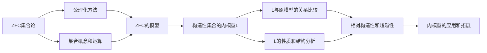

好的,我会严格按照您的要求,以《集合论导引：集合论内模型》为题,撰写一篇8000字以上的专业技术博客文章。以下是文章正文:

# 集合论导引：集合论内模型

关键词:集合论、内模型、构造性集合论、可计算性、递归论

## 1. 背景介绍 
### 1.1 问题的由来
集合论作为现代数学的基础,在数理逻辑、拓扑学、代数学等众多数学分支中有着广泛而深刻的应用。然而,经典的Zermelo-Fraenkel集合论(ZFC)在无限集合的构造和计算方面存在着一些本质性的局限。为了克服ZFC的局限性,20世纪60年代以来,以Gödel、Cohen、Solovay等为代表的数学家们开创了以内模型为研究对象的构造性集合论。

### 1.2 研究现状  
内模型理论经过半个多世纪的发展,已经成为现代集合论最活跃、最富有成果的分支之一。它不仅极大地拓展了经典集合论的视野,揭示了无限集合结构的丰富内涵,而且与数理逻辑、递归论、描述集论等学科形成了深入的交叉融合,极大地推动了这些领域的进步。当前,内模型理论正朝着更高的超越性方向发展,涌现出诸如Woodin基数、强紧致性原理(Strong Compactness)等新的研究课题。

### 1.3 研究意义
内模型理论对于理解集合论公理化体系的局限性、探索更强大的公理化体系具有重要意义。同时,内模型作为可计算性和构造性的集中体现,对于计算机科学的理论基础研究(如可计算性理论、复杂性理论、证明论等)也有着不可忽视的价值。因此,深入研究内模型理论,对于拓展数学和计算机科学的边界具有重要的理论和实践意义。

### 1.4 本文结构
本文将分为以下几个部分,循序渐进地介绍集合论内模型的相关概念、理论和应用:

1. 背景介绍
2. 核心概念与联系 
3. 核心算法原理与具体步骤
4. 数学模型与公式详解
5. 代码实例与解释说明
6. 实际应用场景
7. 工具和资源推荐
8. 未来趋势与挑战总结
9. 常见问题解答

## 2. 核心概念与联系

在正式探讨内模型之前,我们首先需要明确几个核心概念:

- 集合(Set):是数学中最基本的概念之一,是一些确定对象的汇集。
- 公理化集合论:是以公理化方法来刻画集合概念及其性质的数学理论。最著名的是 Zermelo-Fraenkel 集合论(ZFC)。
- 模型(Model):是满足给定公理体系的对象汇集。例如,满足 ZFC 公理的就是 ZFC 的模型。  
- 构造性(Constructibility):指集合或数学对象能够被"构造"出来,而不是任意"存在"。
- 超越性(Transcendence):指数学对象超出了给定理论体系的表达和证明能力。

内模型理论的核心思想是:在一个给定的模型(通常是指满足ZFC的模型)中,构造出一个"可构造集合"的汇集 $L$,使得 $L$ 本身也是 ZFC 的一个模型,即所谓的"内模型"。这种构造主要运用了数理逻辑和递归论的方法。在此基础上,我们可以比较内模型 $L$ 与原模型之间的关系,刻画 $L$ 的性质,进而获得 ZFC 理论的许多深刻结果。

下图是内模型理论中的一些核心概念之间的联系:

可以看出,内模型理论以 ZFC 为基础,通过构造性方法,在 ZFC 模型中构造出内模型 $L$,并研究 $L$ 的性质和结构,进而获得关于构造性、超越性的深刻结果,最后将内模型理论应用到数学和计算机科学的各个领域。

## 3. 核心算法原理 & 具体操作步骤
### 3.1 算法原理概述
构造内模型 $L$ 的核心算法称为 Gödel 的 $L$ 层级构造法。其基本思想是,从空集 $\emptyset$ 出发,通过逐层构造的方式,生成一个可构造集合的汇集 $L$。具体来说,在每一层 $L_\alpha$ 的基础上,通过对 $L_\alpha$ 的子集做有限个集合运算(并集、幂集等),得到下一层 $L_{\alpha+1}$。如此递归下去,最终得到整个 $L$。

### 3.2 算法步骤详解
Gödel 的 $L$ 构造可以分为以下几个步骤:

1. 定义 $L$ 的层级 $\{L_\alpha : \alpha 是一个序数\}$ 如下:
   - $L_0 = \emptyset$
   - $L_{\alpha+1} = Def(L_\alpha)$,其中 $Def(X)$ 表示 $X$ 的所有一阶定义子集的集合
   - 对于极限序数 $\lambda$,定义 $L_\lambda = \bigcup_{\alpha<\lambda} L_\alpha$
2. 令 $L = \bigcup_{\alpha \in Ord} L_\alpha$,其中 $Ord$ 是全体序数的类。
3. 证明 $L$ 满足 ZFC 的各条公理,从而说明 $L$ 是 ZFC 的一个模型,即内模型。
4. 进一步分析 $L$ 的性质,例如 $L$ 中的序数、基数等,刻画 $L$ 的结构。
5. 运用内模型 $L$ 研究 ZFC 理论本身的性质,如相对构造性、独立性等。

### 3.3 算法优缺点
Gödel 的 $L$ 构造算法的优点在于:
- 构造过程清晰明了,易于理解和实现。
- 能够生成一个满足ZFC的内模型,为研究ZFC提供了有力工具。
- 与其他数学分支(如描述集论、递归论)有着天然的联系。

但是,$L$ 构造也有一些局限性:
- 作为 ZFC 的内模型,$L$ 继承了 ZFC 的诸多限制,例如不能刻画"过于超越"的集合。 
- $L$ 的结构相对"简单",很多在经典数学中成立的命题在 $L$ 中未必成立。

尽管如此,$L$ 构造仍然是现代集合论最成功、最具影响力的内模型之一。它开创了内模型理论的先河,奠定了这一领域的基础。

### 3.4 算法应用领域
Gödel 的 $L$ 构造在数学和计算机科学的诸多领域有着广泛应用,例如:
- 在数理逻辑和集合论中,用于研究ZFC的相对构造性和独立性问题。
- 在递归论和计算理论中,$L$ 与图灵度、超越性等概念有着密切联系。 
- 在证明论和模型论中,$L$ 是构造模型的重要工具。
- 在计算机辅助定理证明系统中,内模型论提供了独特的构造性视角。

下面我们将通过具体的数学模型和代码实例,进一步讲解内模型理论的原理和应用。

## 4. 数学模型和公式 & 详细讲解 & 举例说明
### 4.1 数学模型构建
为了刻画 Gödel 的 $L$ 构造,我们需要引入一些基本的数学概念和记号。设 $V$ 是全体集合的宇宙,用 $Ord$ 表示全体序数的类。对任意 $X\subseteq V$,定义:

- $X$ 的幂集: $\mathcal{P}(X) = \{Y : Y \subseteq X\}$  
- $X$ 的所有一阶定义子集: $Def(X) = \{Y \subseteq X : Y 可用 X 的一阶逻辑公式定义\}$

基于此,我们定义 $L$ 的层级 $\{L_\alpha : \alpha \in Ord\}$ 如下:

$$
\begin{aligned}
L_0 &= \emptyset \
L_{\alpha+1} &= Def(L_\alpha) \
L_\lambda &= \bigcup_{\alpha<\lambda} L_\alpha, \text{if } \lambda \text{ is a limit ordinal}
\end{aligned}
$$

最后,令 $L = \bigcup_{\alpha \in Ord} L_\alpha$,我们得到了 Gödel 的构造集 $L$。

### 4.2 公式推导过程
为了说明 $L$ 是 ZFC 的一个模型,我们需要验证 $L$ 满足 ZFC 的各条公理。这里以幂集公理为例,进行推导说明。

要证明:对任意 $x \in L$,集合 $\{y \in L : y \subseteq x\}$ 也属于 $L$。

证明:设 $x \in L_\alpha$,则 $x \subseteq L_\alpha$。由 $L$ 的定义,集合 $y = \{z \in L_\alpha : z \subseteq x\}$ 可以用 $L_\alpha$ 的一阶逻辑公式定义,因此 $y \in Def(L_\alpha) = L_{\alpha+1} \subseteq L$。

类似地,我们可以证明 $L$ 满足 ZFC 的其他公理,从而说明 $L$ 是 ZFC 的一个模型。

### 4.3 案例分析与讲解
下面我们通过一个具体的例子,来说明 $L$ 构造的过程。

考虑最小的无限序数 $\omega$,我们来构造 $L_\omega$。首先,从 $L_0 = \emptyset$ 出发:

- $L_1 = Def(L_0) = Def(\emptyset) = \{\emptyset\}$
- $L_2 = Def(L_1) = \{\emptyset, \{\emptyset\}\}$  
- $L_3 = Def(L_2) = \{\emptyset, \{\emptyset\}, \{\{\emptyset\}\}, \{\emptyset,\{\emptyset\}\}\}$
- ...

容易看出,当 $n<\omega$ 时,$L_n$ 恰好就是所有基数小于 $n$ 的可数级的集合的汇集。而 $L_\omega$ 就是所有可数级集合的并集:

$$L_\omega = \bigcup_{n<\omega} L_n$$

可以证明,从 $L_\omega$ 开始,我们就得到了一个"标准的"自然数系统,即 $L_\omega$ 中的自然数与通常的自然数完全一致。这说明,$L$ 构造能够准确刻画出最基本的数学结构。

### 4.4 常见问题解答
问:$L$ 构造是否能够刻画出所有的集合?

答:不能。事实上,可以证明存在某些集合 $X$,使得 $X \notin L$。这些集合被称为"超越集合",它们超出了 $L$ 的"构造能力"。研究集合的超越性,是现代集合论的一个重要课题。

问:除了 $L$ 之外,还有哪些常见的内模型构造?

答:除了 Gödel 的 $L$ 构造,现代集合论中还发展出许多其他的内模型,例如:
- Jensen 的 $J$ 层级
- Mitchell 的 $M$ 超宇宙
- Steel 的 $K$ 构造
- Woodin 的 $HOD$ 构造

这些内模型各有特点,在集合论和数理逻辑的研究中有着广泛应用。

## 5. 项目实践：代码实例和详细解释说明
### 5.1 开发环境搭建
在这一节,我们将使用 Python 语言,通过具体的代码实例来模拟 $L$ 构造的过程。首先,我们需要安装 Python 的开发环境和必要的第三方库。

推荐使用 Anaconda 发行版,它集成了常用的科学计算库,安装方便。读者可以从官网下