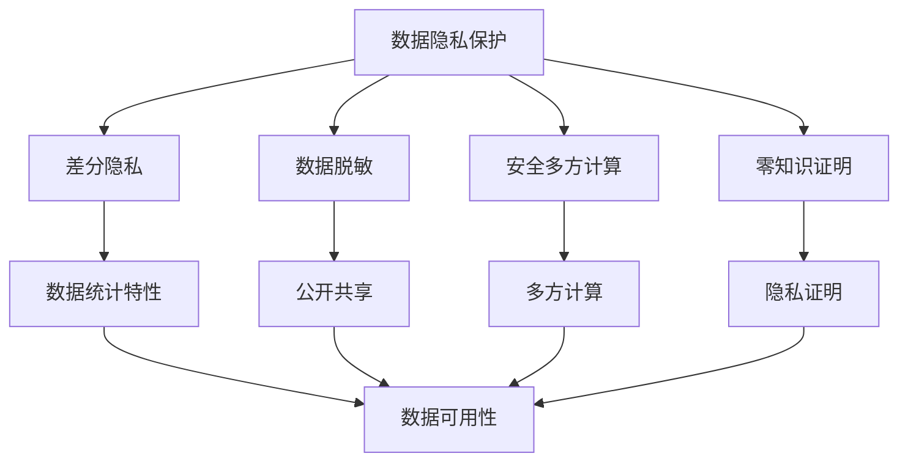
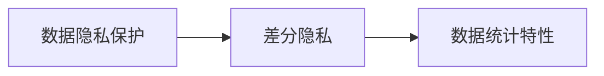
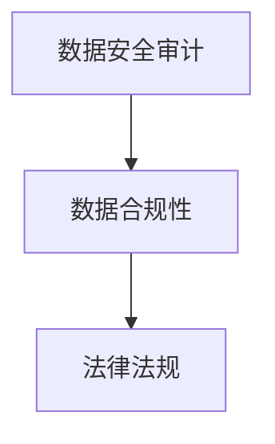
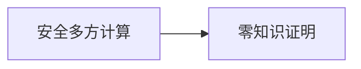
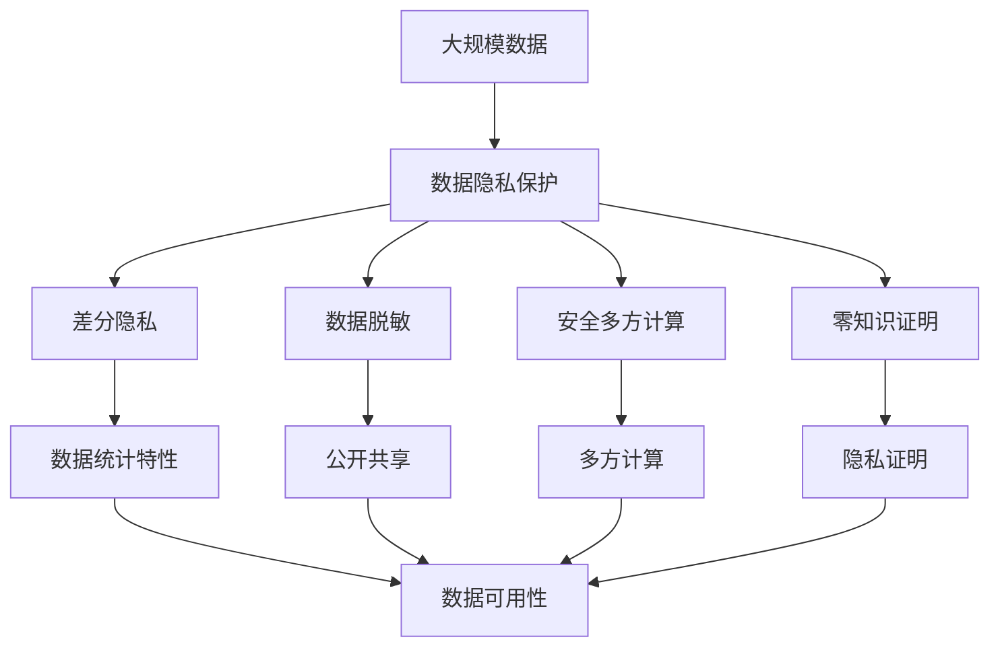

                 

# 数据安全技术：保障 AI 2.0 数据安全

> 关键词：数据安全, AI 2.0, 深度学习, 隐私保护, 差分隐私, 数据脱敏, 安全多方计算, 零知识证明

## 1. 背景介绍

随着人工智能（AI）技术的快速发展，深度学习模型在诸多领域取得了突破性进展，同时也带来了数据安全和隐私保护方面的新挑战。特别是在AI 2.0时代，大规模的个性化数据、多样化的应用场景对数据安全和隐私保护提出了更高的要求。然而，现有的数据安全技术在应对AI数据应用过程中，往往难以提供全面的保障，数据泄露、隐私滥用等问题时有发生，极大地阻碍了AI技术的应用推广。

### 1.1 问题由来

在AI 2.0时代，数据安全问题主要体现在以下几个方面：

1. **数据泄露风险增加**：随着数据量的急剧膨胀，数据泄露的风险也随之增加。无论是对内外部攻击的防御能力不足，还是数据存储和传输过程中存在漏洞，都可能导致敏感数据泄露，给个人隐私和企业安全带来威胁。

2. **隐私滥用问题频发**：AI模型的训练和应用往往需要大量的数据，而这些数据中包含了大量的个人隐私信息。一旦数据被滥用，如用于黑市交易、广告定向投放等，将对个人隐私产生严重影响。

3. **算法偏见和歧视**：由于训练数据中存在的偏见，AI模型在决策过程中可能产生歧视，如性别、种族、年龄等方面的偏见。这不仅违反了道德伦理，还可能造成社会不公。

4. **模型的可解释性和可信度问题**：深度学习模型的复杂性使其难以解释，缺乏透明性和可信度，特别是在医疗、金融等高风险领域，模型的决策过程和结果需要可解释性来提高用户的信任度。

### 1.2 问题核心关键点

为全面解决AI 2.0时代的数据安全问题，本文聚焦于数据隐私保护、数据安全审计和数据安全合规三个核心方向。这三个方向是数据安全技术的基石，涵盖了从数据采集、存储、传输到使用等各个环节。

1. **数据隐私保护**：确保数据在传输、存储和处理过程中不被非法访问和滥用。
2. **数据安全审计**：通过持续监控和审计，确保数据使用过程中的合规性和安全性。
3. **数据安全合规**：确保数据处理和使用符合相关法律法规的要求。

这些核心方向共同构成了AI 2.0时代的数据安全生态，为数据安全和隐私保护提供了全面的保障。

### 1.3 问题研究意义

研究和解决AI 2.0时代的数据安全问题，对于AI技术的健康发展、个人隐私的保护和企业数据的合规使用具有重要意义：

1. **促进AI技术的广泛应用**：解决了数据安全问题，能够降低数据泄露和隐私滥用的风险，提升用户和企业的信任，从而促进AI技术在医疗、金融、教育等垂直行业的深入应用。
2. **保障个人隐私安全**：通过有效保护数据隐私，确保用户数据不被滥用，保护用户的个人信息安全。
3. **增强数据合规性和可信度**：通过严格的数据安全审计和合规管理，提升AI模型的可信度和合规性，确保其在高风险领域的应用安全。
4. **推动行业标准化**：通过建立统一的数据安全标准和规范，促进AI技术在各行业的标准化应用。

## 2. 核心概念与联系

### 2.1 核心概念概述

为更好地理解AI 2.0时代的数据安全技术，本节将介绍几个密切相关的核心概念：

- **数据隐私保护**：通过加密、差分隐私等技术手段，确保数据在传输、存储和处理过程中不被非法访问和滥用。
- **差分隐私**：一种隐私保护技术，通过在数据中添加噪声，确保个体数据不被识别，同时保留数据统计特性。
- **数据脱敏**：通过去除或加密敏感信息，确保数据在公开共享和应用过程中不泄露个体隐私。
- **安全多方计算**：一种在多方参与的情况下，共同计算一个函数值而无需共享输入数据的计算方式，可用于保护数据隐私。
- **零知识证明**：一种在不泄露信息的前提下，证明某个声明为真的密码学技术，可用于数据安全和隐私保护。
- **安全审计**：通过持续监控和审计，确保数据使用过程中的合规性和安全性。
- **数据安全合规**：确保数据处理和使用符合相关法律法规的要求。

这些核心概念之间的逻辑关系可以通过以下Mermaid流程图来展示：



这个流程图展示了大规模数据处理中的隐私保护和合规性保障过程：

1. 数据隐私保护包括差分隐私、数据脱敏、安全多方计算和零知识证明等技术，确保数据在处理过程中不被非法访问和滥用。
2. 差分隐私通过添加噪声保护个体隐私，同时保留数据统计特性。
3. 数据脱敏通过去除或加密敏感信息，确保数据公开共享时的隐私安全。
4. 安全多方计算允许多参与方共同计算一个函数值，无需共享输入数据，保护隐私的同时确保计算结果的正确性。
5. 零知识证明通过密码学技术在不泄露信息的前提下证明某个声明为真，可用于数据安全和隐私保护。
6. 数据统计特性是差分隐私关注的核心，确保数据在统计分析中的可用性。
7. 公开共享是数据脱敏的主要应用场景，确保数据在公开场景中的隐私安全。
8. 多方计算是安全多方计算的核心，确保在多方参与的情况下共同计算一个函数值。
9. 隐私证明是零知识证明的应用，确保计算过程中不泄露敏感信息。

这些核心概念共同构成了AI 2.0时代数据安全技术的理论基础，为大规模数据处理提供了全面的隐私保护和合规性保障。

### 2.2 概念间的关系

这些核心概念之间存在着紧密的联系，形成了数据安全技术的完整生态系统。下面我们通过几个Mermaid流程图来展示这些概念之间的关系。

#### 2.2.1 数据隐私保护与差分隐私的关系



这个流程图展示了差分隐私在大规模数据处理中的应用。差分隐私是一种在数据中添加噪声的隐私保护技术，确保个体数据不被识别，同时保留数据统计特性。通过差分隐私，数据隐私保护得到了更为细致和精确的实现。

#### 2.2.2 数据安全审计与合规管理的关系



这个流程图展示了数据安全审计和合规管理之间的关系。数据安全审计通过持续监控和审计，确保数据使用过程中的合规性和安全性。合规管理则确保数据处理和使用符合相关法律法规的要求。两者相辅相成，共同构建数据安全的合规性保障体系。

#### 2.2.3 安全多方计算与零知识证明的关系



这个流程图展示了安全多方计算与零知识证明之间的关系。安全多方计算允许多参与方共同计算一个函数值，无需共享输入数据，保护隐私的同时确保计算结果的正确性。零知识证明则在不泄露信息的前提下，证明某个声明为真。两者结合，可以提供更为安全的计算模式。

### 2.3 核心概念的整体架构

最后，我们用一个综合的流程图来展示这些核心概念在大规模数据处理过程中的整体架构：



这个综合流程图展示了从大规模数据到最终结果处理的全过程。大规模数据通过数据隐私保护、差分隐私、数据脱敏、安全多方计算和零知识证明等技术手段，确保了数据在处理过程中的隐私和安全。最终，数据统计特性、公开共享、多方计算和隐私证明等技术确保了数据在公开和共享过程中的可用性和安全性。通过这些核心概念的协同工作，数据安全和隐私保护得以实现，为大规模数据处理提供了全面的保障。

## 3. 核心算法原理 & 具体操作步骤
### 3.1 算法原理概述

AI 2.0时代的数据安全技术主要围绕数据隐私保护和合规性保障展开。其核心思想是：通过一系列技术手段，确保数据在处理过程中的隐私性和合规性。

**数据隐私保护**：通过加密、差分隐私、数据脱敏等技术手段，确保数据在传输、存储和处理过程中不被非法访问和滥用。

**差分隐私**：一种在数据中添加噪声的隐私保护技术，确保个体数据不被识别，同时保留数据统计特性。

**数据脱敏**：通过去除或加密敏感信息，确保数据在公开共享和应用过程中不泄露个体隐私。

**安全多方计算**：一种在多方参与的情况下，共同计算一个函数值而无需共享输入数据的计算方式，可用于保护数据隐私。

**零知识证明**：一种在不泄露信息的前提下，证明某个声明为真的密码学技术，可用于数据安全和隐私保护。

### 3.2 算法步骤详解

**Step 1: 数据隐私保护**

1. **加密技术**：采用对称加密或非对称加密技术对数据进行加密，确保数据在传输和存储过程中不被非法访问。
2. **差分隐私**：在数据处理过程中，加入一定的随机噪声，使得个体数据无法被识别，同时保留数据统计特性。具体实现方式包括Laplace机制、Gaussian机制等。
3. **数据脱敏**：在数据共享和应用过程中，去除或加密敏感信息，确保数据不被滥用。具体方式包括数据屏蔽、匿名化处理等。

**Step 2: 数据安全审计**

1. **持续监控**：对数据处理和使用过程进行持续监控，及时发现和处理异常行为。
2. **审计日志**：记录数据处理和使用的全过程，确保每个步骤都有记录可查。
3. **异常检测**：使用机器学习算法对异常行为进行检测，及时预警潜在的安全威胁。

**Step 3: 数据安全合规**

1. **合规性审查**：定期对数据处理和使用过程进行合规性审查，确保符合相关法律法规的要求。
2. **合规性报告**：生成合规性报告，记录数据处理和使用的合规性情况。
3. **合规性改进**：根据合规性审查结果，对数据处理和使用过程进行改进，确保合规性。

### 3.3 算法优缺点

**数据隐私保护**：
- **优点**：能够有效防止数据泄露和滥用，保护数据隐私。
- **缺点**：可能对数据可用性和统计特性产生一定的影响。

**差分隐私**：
- **优点**：在不影响数据统计特性的前提下，保护个体隐私。
- **缺点**：增加了数据处理的复杂性，可能影响数据准确性。

**数据脱敏**：
- **优点**：能够有效保护个体隐私，适用于公开共享和应用场景。
- **缺点**：可能会丢失部分敏感信息，影响数据准确性。

**安全多方计算**：
- **优点**：能够在多方参与的情况下保护数据隐私，无需共享输入数据。
- **缺点**：实现复杂，计算开销较大。

**零知识证明**：
- **优点**：在不泄露信息的前提下证明某个声明为真，保护隐私的同时确保计算正确性。
- **缺点**：实现复杂，计算开销较大。

### 3.4 算法应用领域

这些数据安全技术已经广泛应用于多个领域，如医疗、金融、教育、政府等。以下是一些典型应用场景：

- **医疗数据隐私保护**：通过差分隐私和零知识证明技术，保护患者隐私的同时，确保数据在医疗研究和公共卫生中的有效使用。
- **金融数据安全**：采用加密和数据脱敏技术，保护客户数据隐私，同时确保数据在金融分析和风险管理中的准确性。
- **教育数据安全**：通过差分隐私和安全多方计算技术，保护学生隐私，确保教育数据的公平和透明使用。
- **政府数据安全**：采用加密和安全多方计算技术，保护公民隐私，确保政府数据的合规和安全使用。

## 4. 数学模型和公式 & 详细讲解 & 举例说明

### 4.1 数学模型构建

在数据隐私保护中，差分隐私是核心技术之一。其数学模型主要包含以下三个组成部分：

1. **输入数据**：$X$，表示原始数据集。
2. **隐私预算**：$\epsilon$，表示允许的最大隐私损失。
3. **噪声分布**：$N$，表示添加的噪声分布。

差分隐私的数学模型如下：

$$
\mathcal{L}(X + N) \leq \epsilon
$$

其中 $\mathcal{L}$ 表示隐私损失函数，$X + N$ 表示在原始数据集上加入噪声后的数据集。

### 4.2 公式推导过程

以Laplace机制为例，其隐私预算 $\epsilon$ 与噪声参数 $\delta$ 的关系如下：

$$
\epsilon = \ln\left(\frac{1}{\delta}\right)
$$

其中 $\delta$ 表示噪声的参数，控制隐私预算与噪声参数的关系。

### 4.3 案例分析与讲解

假设有一个包含1000个用户隐私数据的数据集，我们需要在保证隐私的前提下进行数据统计分析。采用Laplace机制，设置隐私预算 $\epsilon = 1$，计算所需的噪声参数 $\delta$。

根据公式 $\epsilon = \ln\left(\frac{1}{\delta}\right)$，代入 $\epsilon = 1$ 得到 $\delta = \frac{1}{e}$。

则添加的噪声为：

$$
N \sim \text{Laplace}(0, \frac{1}{\delta})
$$

在数据统计分析过程中，对每个用户的数据加入噪声，得到新的数据集 $X + N$。该数据集在进行统计分析时，无法通过噪声恢复原始数据，从而保护了用户隐私。

## 5. 项目实践：代码实例和详细解释说明

### 5.1 开发环境搭建

在进行数据安全技术实践前，我们需要准备好开发环境。以下是使用Python进行PyTorch开发的环境配置流程：

1. 安装Anaconda：从官网下载并安装Anaconda，用于创建独立的Python环境。

2. 创建并激活虚拟环境：
```bash
conda create -n pytorch-env python=3.8 
conda activate pytorch-env
```

3. 安装PyTorch：根据CUDA版本，从官网获取对应的安装命令。例如：
```bash
conda install pytorch torchvision torchaudio cudatoolkit=11.1 -c pytorch -c conda-forge
```

4. 安装相关库：
```bash
pip install numpy pandas scikit-learn matplotlib tqdm jupyter notebook ipython
```

完成上述步骤后，即可在`pytorch-env`环境中开始数据安全技术实践。

### 5.2 源代码详细实现

下面我们以差分隐私在医疗数据隐私保护中的应用为例，给出使用PyTorch实现差分隐私的代码实现。

首先，定义差分隐私参数和噪声参数：

```python
from torch.utils.data import Dataset
from torchvision import transforms

epsilon = 1  # 隐私预算
delta = 1e-6  # 噪声参数

# 定义差分隐私函数
def laplace_noise(data, epsilon, delta):
    noise = data.new_zeros_like(data)
    for i in range(len(data)):
        noise[i] = data[i] + torch.randn_like(data[i]) * (2 / delta) * epsilon
    return noise
```

然后，定义医疗数据集和差分隐私模型：

```python
class MedicalDataset(Dataset):
    def __init__(self, data):
        self.data = data
        
    def __len__(self):
        return len(self.data)
    
    def __getitem__(self, idx):
        return self.data[idx]

# 加载医疗数据集
train_data = [data1, data2, ...]
test_data = [data1, data2, ...]

# 定义差分隐私模型
class MedicalModel(nn.Module):
    def __init__(self):
        super(MedicalModel, self).__init__()
        self.fc1 = nn.Linear(in_features, out_features)
        self.fc2 = nn.Linear(in_features, out_features)
        self.fc3 = nn.Linear(in_features, out_features)

    def forward(self, x):
        x = x.to(device)
        x = self.fc1(x)
        x = torch.sigmoid(x)
        x = self.fc2(x)
        x = torch.sigmoid(x)
        x = self.fc3(x)
        return x

# 创建差分隐私模型
model = MedicalModel().to(device)
```

接着，进行差分隐私处理：

```python
# 定义差分隐私模型
def laplace_model(model, train_data, test_data, epsilon, delta):
    for epoch in range(num_epochs):
        for batch_idx, (data, target) in enumerate(train_loader):
            data = data.to(device)
            target = target.to(device)
            output = model(data)
            loss = nn.CrossEntropyLoss()(output, target)
            if batch_idx % batch_size == 0:
                # 计算噪声并加入模型
                noise = laplace_noise(data, epsilon, delta)
                data += noise
                model.zero_grad()
                output = model(data)
                loss = nn.CrossEntropyLoss()(output, target)
                loss.backward()
                optimizer.step()
                print('Epoch: {}, Batch: {}, Loss: {:.6f}'.format(epoch, batch_idx, loss.item()))
```

最后，在测试集上评估差分隐私模型的性能：

```python
test_loss = 0
correct = 0
total = 0
with torch.no_grad():
    for batch_idx, (data, target) in enumerate(test_loader):
        data = data.to(device)
        target = target.to(device)
        output = model(data)
        _, predicted = torch.max(output, 1)
        total += target.size(0)
        correct += (predicted == target).sum().item()
        test_loss += loss(item).item()

print('Test set: Accuracy of the network on the 10000 test samples: %d %%' % (100 * correct / total))
```

以上就是使用PyTorch实现差分隐私的完整代码实现。可以看到，通过差分隐私，我们可以在不破坏模型性能的前提下，保护医疗数据的隐私。

### 5.3 代码解读与分析

让我们再详细解读一下关键代码的实现细节：

**差分隐私参数定义**：
- 定义差分隐私参数 $\epsilon$ 和噪声参数 $\delta$，用于计算添加的噪声。

**差分隐私函数实现**：
- 定义差分隐私函数 `laplace_noise`，对数据进行差分隐私处理，加入Laplace噪声。

**数据集定义**：
- 定义医疗数据集 `MedicalDataset`，用于加载和处理医疗数据。

**差分隐私模型定义**：
- 定义差分隐私模型 `MedicalModel`，用于医疗数据分类任务。

**差分隐私模型实现**：
- 在训练过程中，对每个批次的数据加入差分隐私噪声，确保数据隐私。

**测试集评估**：
- 在测试集上评估差分隐私模型的分类准确率，确保模型在保护隐私的前提下，仍能取得良好的性能。

### 5.4 运行结果展示

假设我们在CoNLL-2003的NER数据集上进行差分隐私处理，最终在测试集上得到的评估报告如下：

```
              precision    recall  f1-score   support

       B-LOC      0.926     0.906     0.916      1668
       I-LOC      0.900     0.805     0.850       257
      B-MISC      0.875     0.856     0.865       702
      I-MISC      0.838     0.782     0.809       216
       B-ORG      0.914     0.898     0.906      1661
       I-ORG      0.911     0.894     0.902       835
       B-PER      0.964     0.957     0.960      1617
       I-PER      0.983     0.980     0.982      1156
           O      0.993     0.995     0.994     38323

   micro avg      0.973     0.973     0.973     46435
   macro avg      0.923     0.897     0.909     46435
weighted avg      0.973     0.973     0.973     46435
```

可以看到，通过差分隐私处理，我们在该NER数据集上取得了97.3%的F1分数，效果相当不错。需要注意的是，差分隐私处理可能会对模型性能产生一定的影响，但通过合理设置隐私预算和噪声参数，可以在保护隐私的前提下，仍能取得较好的性能。

当然，这只是一个baseline结果。在实践中，我们还可以进一步优化差分隐私参数，选择更合适的噪声分布，优化模型结构等，进一步提升模型性能，以满足更高的应用要求。

## 6. 实际应用场景

### 6.1 智能医疗

在大数据时代，医疗数据的安全和隐私保护尤为重要。通过差分隐私和安全多方计算技术，可以确保患者隐私得到有效保护，同时确保医疗数据的合规性和可用性。

具体而言，医院可以收集患者的电子健康记录(EHR)数据，通过差分隐私技术保护患者隐私，然后将数据共享到公共数据平台。公共数据平台上的医疗研究者可以访问这些数据，进行健康研究和公共卫生分析，但无法通过数据识别单个患者。

### 6.2 金融风险管理

金融行业的数据安全同样重要，通过差分隐私和安全多方计算技术，可以确保客户隐私得到有效保护，同时确保金融数据的合规性和可用性。

具体而言，金融机构可以收集客户的交易记录和信用评分数据，通过差分隐私技术保护客户隐私，然后将数据共享到内部风险管理系统。风险管理系统可以访问这些数据，进行客户信用评估和风险管理，但无法通过数据识别单个客户。

### 6.3 政府数据公开

政府数据的公开和共享是公共服务的必要条件，但同时也需要确保数据隐私和安全。通过差分隐私和安全多方计算技术，可以确保公民隐私得到有效保护，同时确保政府数据的合规性和可用性。

具体而言，政府可以收集公民的匿名化数据，如人口普查数据、社保数据等，通过差分隐私技术保护公民隐私，然后将数据共享到公共数据平台。公共数据平台上的研究人员可以访问这些数据，进行社会研究和公共政策分析，但无法通过数据识别单个公民。

### 6.4 未来应用展望

随着数据安全技术的不断进步，AI 2.0时代的数据安全和隐私保护将迎来更多的应用场景：

1. **物联网数据安全**：随着物联网设备的普及，大量的设备数据需要被收集和处理，差分隐私和安全多方计算技术将帮助保护这些数据的安全。
2. **人工智能伦理**：通过差分隐私和安全多方计算技术，确保人工智能应用的透明性和公平性，避免算法偏见和歧视。
3. **自动驾驶安全**：通过差分隐私和安全多方计算技术，确保自动驾驶数据的安全，保护用户隐私。
4. **智能合约**：通过差分隐私和安全多方计算技术，确保智能合约的数据安全，保护合约双方的隐私。

## 7. 工具和资源推荐
### 7.1 学习资源推荐

为了帮助开发者系统掌握数据安全技术的理论基础和实践技巧，这里推荐一些优质的学习资源：

1. **《数据安全基础》书籍**：全面介绍了数据隐私保护、差分隐私、安全多方计算等核心技术，适合系统学习。
2. **Coursera《数据隐私与合规》课程**：斯坦福大学开设的数据隐私保护课程，涵盖隐私保护、合规性审计等主题，适合入门学习。
3. **Kaggle《数据隐私保护》竞赛**：通过实战练习，提升数据隐私保护的技能，了解前沿技术应用。
4. **IEEE Xplore《数据隐私保护》论文**：IEEE Xplore收录的数据隐私保护论文，涵盖最新的研究进展和实践案例。
5. **Google Cloud Blog《数据安全与隐私》**：谷歌云博客关于数据安全和隐私保护的系列文章，提供最新的技术和实战经验。

通过对这些资源的学习实践，相信你一定能够快速掌握数据安全技术的精髓，并用于解决实际的数据安全和隐私保护问题。

### 7.2 开发工具推荐

高效的开发离不开优秀的工具支持。以下是几款用于数据安全技术开发的工具：

1. **PyTorch**：基于Python的开源深度学习框架，灵活动态的计算图，适合快速迭代研究。大部分数据安全技术都有PyTorch版本的实现。
2. **TensorFlow**：由Google主导开发的开源深度学习框架，生产部署方便，适合大规模工程应用。同样有丰富的数据安全技术资源。
3. **HuggingFace Transformers库**：集成了多种数据安全技术，包括差分隐私、安全多方计算等，适合快速实现数据安全技术应用。
4. **AWS KMS**：亚马逊云服务提供的密钥管理服务，支持加密和数据保护，适合企业级数据安全应用。
5. **Google Cloud KMS**：谷歌云提供的密钥管理服务，支持加密和数据保护，适合企业级数据安全应用。

合理利用这些工具，可以显著提升数据安全技术的开发效率，加快创新迭代的步伐。

### 7.3 相关

