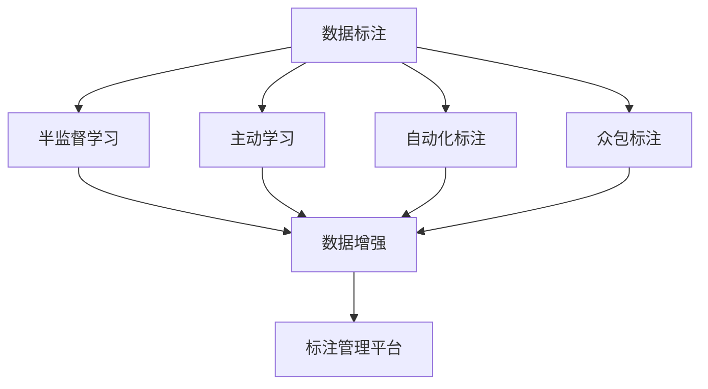
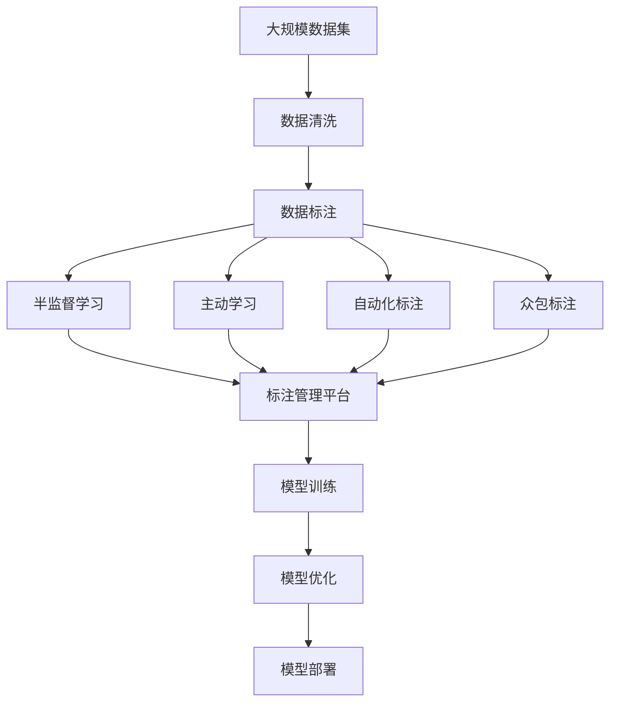

                 

## 1. 背景介绍

在人工智能(AI)技术飞速发展的今天，大数据和深度学习成为了推动AI应用的核心驱动力。然而，背后支撑这些技术运行的是庞大的数据集，而数据标注无疑是这些数据集的核心要素。数据标注不仅仅是将原始数据转化为可供模型使用的形式，更是为AI技术奠定基石的过程。无论是用于图像识别、语音识别、自然语言处理(NLP)还是其他领域，高质量的数据标注都至关重要。本文将深入探讨数据标注的艺术，探讨其原理、技术、应用及未来发展趋势，为读者提供全面的理解与思考。

### 1.1 问题由来

随着AI技术的不断成熟，数据标注的重要性愈发凸显。无论是图像分类、目标检测，还是文本分类、机器翻译，高质量的数据标注都是提升AI模型性能的关键。然而，数据标注并非易事，需要耗费大量人力物力。这不仅导致标注成本高昂，而且标注过程还可能存在主观性和不稳定性。因此，如何提高数据标注的效率和质量，成为了当下亟待解决的重要问题。

### 1.2 问题核心关键点

数据标注的核心问题包括标注数据的质量、标注成本的降低、标注效率的提升以及标注结果的可解释性。这些问题不仅影响AI模型的性能，还关系到数据标注的长期发展和应用前景。

#### 1.2.1 标注数据的质量

高质量的数据标注是AI模型性能提升的基础。标注数据应该涵盖不同的情况和场景，避免过度依赖特定的数据集，以确保模型的泛化能力。此外，标注数据应尽可能地精确、一致，避免歧义和错误。

#### 1.2.2 标注成本的降低

随着AI技术的不断进步，标注成本的降低已成为可能。通过自动化标注工具、众包平台等手段，可以在一定程度上减轻人工标注的压力，降低标注成本。

#### 1.2.3 标注效率的提升

高效的标注流程不仅能节约成本，还能加快AI模型的训练和部署速度。这需要充分利用技术手段，如自动化标注、半监督学习等，以提高标注效率。

#### 1.2.4 标注结果的可解释性

数据标注结果的可解释性对于AI模型的理解和调试至关重要。标注结果应能够清楚地展示其背后的逻辑和依据，以便于模型的优化和改进。

## 2. 核心概念与联系

### 2.1 核心概念概述

为了更好地理解数据标注的原理和应用，本节将介绍几个关键概念及其相互联系：

- **数据标注(Data Annotation)**：将原始数据转化为可供模型使用的格式，通常包括图像、文本、语音等数据的标注。

- **半监督学习(Semi-supervised Learning)**：在标注数据不足的情况下，利用未标注数据辅助模型学习，提升模型性能。

- **主动学习(Active Learning)**：根据模型反馈选择最具代表性的样本进行标注，最大化利用有限标注资源。

- **自动化标注(Automated Annotation)**：利用机器学习和计算机视觉技术，自动标注图像、文本等数据。

- **众包标注(Crowdsourced Annotation)**：通过互联网平台聚集大量标注员，完成大规模数据标注任务。

- **标注管理平台(Annotation Management Platform)**：提供统一的数据标注接口和工具，管理标注任务和数据。

这些概念相互交织，共同构成了数据标注的完整生态系统。以下是一个Mermaid流程图，展示了这些概念之间的关系：



通过这个流程图，我们可以更清晰地理解数据标注在不同技术手段和应用场景下的分布和作用。

### 2.2 概念间的关系

这些核心概念之间存在着紧密的联系，形成了数据标注的全流程：

1. **数据标注与半监督学习**：数据标注是半监督学习的前提，通过标注数据和未标注数据的结合，提升模型泛化能力。
2. **数据标注与主动学习**：主动学习在标注资源有限的情况下，通过选择最具代表性的样本进行标注，最大化利用标注资源。
3. **数据标注与自动化标注**：自动化标注技术可以在一定程度上减轻人工标注的压力，提高标注效率。
4. **数据标注与众包标注**：众包标注利用互联网平台，通过众人之力完成大规模数据标注任务，加速数据标注流程。
5. **数据标注与标注管理平台**：标注管理平台提供统一接口和工具，管理标注任务和数据，保障数据标注的规范性和高效性。

这些概念共同构成了数据标注的完整流程，使得数据标注能够高效、高质量地进行。

### 2.3 核心概念的整体架构

最后，我们用一个综合的流程图来展示这些核心概念在大数据标注中的整体架构：



这个综合流程图展示了从数据清洗到模型部署的数据标注全流程。通过不断优化各个环节，可以实现高效、高质量的数据标注，为AI模型提供坚实的数据基础。

## 3. 核心算法原理 & 具体操作步骤
### 3.1 算法原理概述

数据标注的核心原理在于将原始数据转化为模型可用的形式，并结合人工标注和机器学习技术，提升标注质量和效率。常见的数据标注方法包括半监督学习、主动学习和自动化标注等。

### 3.2 算法步骤详解

以下是一个详细的数据标注流程：

#### 3.2.1 数据预处理

数据预处理是数据标注的第一步，包括数据清洗、格式转换和数据增强等。数据清洗去除无用和错误数据，格式转换将数据转换为模型可用的形式，数据增强通过增加数据多样性提高模型泛化能力。

#### 3.2.2 标注规则制定

标注规则的制定是数据标注的基础。规则应尽量覆盖所有可能情况，避免歧义和错误。标注规则应由专家团队制定，并经过多轮评审和验证。

#### 3.2.3 标注任务分配

标注任务分配应根据标注员的专长和经验进行合理分配，确保标注质量。同时，应设立质量控制机制，定期抽查标注结果，及时纠正错误。

#### 3.2.4 标注执行

标注执行是数据标注的核心环节。标注员根据制定的规则，对数据进行标注。标注结果应经过审核和验证，确保其准确性和一致性。

#### 3.2.5 标注后处理

标注后处理包括标注结果的整理和清洗，去除标注结果中的异常值和错误数据。同时，应建立标注结果的元数据，便于后续的追溯和优化。

### 3.3 算法优缺点

数据标注技术具有以下优点：

1. **提升模型性能**：通过高质量的数据标注，AI模型能够更好地理解数据，提升性能。
2. **降低标注成本**：自动化标注和半监督学习等技术可以在一定程度上减轻人工标注的压力，降低标注成本。
3. **提高标注效率**：通过标注规则和任务分配，标注过程更加高效和规范。
4. **可解释性强**：标注结果的元数据和审核机制确保了结果的可解释性，便于模型的优化和改进。

同时，数据标注技术也存在以下缺点：

1. **标注成本高**：高质量的数据标注需要大量人工投入，成本较高。
2. **标注质量不稳定**：不同标注员之间可能存在标注质量的不一致性。
3. **数据隐私问题**：在众包标注和自动化标注中，涉及大量用户数据，隐私保护问题亟待解决。

### 3.4 算法应用领域

数据标注技术在各个领域都有广泛的应用：

1. **计算机视觉**：图像分类、目标检测、图像分割等任务，都需要高质量的标注数据。
2. **自然语言处理**：文本分类、命名实体识别、机器翻译等任务，数据标注是其基础。
3. **语音识别**：语音识别任务中，文本转录和语音-文本对齐都需要数据标注。
4. **医疗健康**：医学影像诊断、病历记录等，数据标注是其关键。
5. **金融风控**：信用评分、欺诈检测等，数据标注是其基础。

## 4. 数学模型和公式 & 详细讲解  
### 4.1 数学模型构建

在数据标注的数学模型构建中，我们通常使用监督学习的方法。假设我们有 $N$ 个数据点 $(x_i, y_i)$，其中 $x_i$ 是输入，$y_i$ 是对应的标签。标注过程可以视为寻找一个函数 $f(x)$，使得 $f(x_i) = y_i$ 对所有 $i$ 成立。常见的标注函数包括线性回归、逻辑回归、支持向量机等。

### 4.2 公式推导过程

以下是一个简单的逻辑回归模型推导过程：

假设 $x$ 是特征向量，$y$ 是标签，$\theta$ 是模型参数。逻辑回归模型定义为：

$$ p(y|x) = \sigma(\theta^T x) $$

其中，$\sigma(z) = \frac{1}{1 + e^{-z}}$ 是 sigmoid 函数。

目标是最小化负对数似然损失函数：

$$ \mathcal{L}(\theta) = -\frac{1}{N}\sum_{i=1}^N [y_i\log p(y_i|x_i) + (1-y_i)\log(1-p(y_i|x_i))] $$

通过梯度下降等优化算法，求解上述最优化问题，即可得到最优参数 $\theta$。

### 4.3 案例分析与讲解

以文本分类为例，我们通过标注数据训练逻辑回归模型。假设有 $N$ 个文本和对应的标签，我们可以将其表示为：

$$ (x_1, y_1), (x_2, y_2), ..., (x_N, y_N) $$

其中 $x_i$ 是文本的特征表示，$y_i$ 是文本的分类标签。我们的目标是找到最优参数 $\theta$，使得模型对新的文本分类预测准确。

## 5. 项目实践：代码实例和详细解释说明
### 5.1 开发环境搭建

在进行数据标注实践前，我们需要准备好开发环境。以下是使用Python进行Scikit-learn开发的环境配置流程：

1. 安装Anaconda：从官网下载并安装Anaconda，用于创建独立的Python环境。

2. 创建并激活虚拟环境：
```bash
conda create -n sklearn-env python=3.8 
conda activate sklearn-env
```

3. 安装Scikit-learn：
```bash
pip install -U scikit-learn
```

4. 安装相关库：
```bash
pip install numpy pandas matplotlib seaborn joblib
```

完成上述步骤后，即可在`sklearn-env`环境中开始数据标注实践。

### 5.2 源代码详细实现

下面我们以文本分类任务为例，给出使用Scikit-learn对数据进行标注的Python代码实现。

首先，定义数据处理函数：

```python
import pandas as pd
from sklearn.model_selection import train_test_split
from sklearn.preprocessing import LabelEncoder
from sklearn.metrics import classification_report

def load_data(file_path):
    df = pd.read_csv(file_path)
    return df['text'], df['label']
```

然后，定义模型训练函数：

```python
from sklearn.linear_model import LogisticRegression
from sklearn.pipeline import make_pipeline
from sklearn.feature_extraction.text import CountVectorizer

def train_model(X, y):
    text_clf = make_pipeline(CountVectorizer(), LogisticRegression(solver='saga'))
    text_clf.fit(X, y)
    return text_clf
```

接着，定义模型评估函数：

```python
def evaluate_model(model, X, y):
    y_pred = model.predict(X)
    print(classification_report(y, y_pred))
```

最后，启动训练流程并在测试集上评估：

```python
texts, labels = load_data('data.csv')
X_train, X_test, y_train, y_test = train_test_split(texts, labels, test_size=0.2, random_state=42)

model = train_model(X_train, y_train)
evaluate_model(model, X_test, y_test)
```

以上就是使用Scikit-learn对文本分类任务进行数据标注的完整代码实现。可以看到，Scikit-learn提供了丰富的机器学习工具，使得数据标注过程变得相对简单和高效。

### 5.3 代码解读与分析

让我们再详细解读一下关键代码的实现细节：

**load_data函数**：
- 使用Pandas库读取CSV文件，获取文本和标签。
- 返回一个包含文本和标签的元组。

**train_model函数**：
- 使用Scikit-learn的管道(pipeline)封装CountVectorizer和LogisticRegression，实现文本向量化和分类器的训练。
- CountVectorizer将文本转换为词频矩阵，LogisticRegression使用SAGA优化器训练模型。

**evaluate_model函数**：
- 使用Scikit-learn的classification_report函数，输出模型在测试集上的分类报告。

**训练流程**：
- 使用train_test_split函数将数据集划分为训练集和测试集。
- 在训练集上训练模型，并在测试集上评估模型性能。

可以看到，Scikit-learn提供了丰富的机器学习工具，使得数据标注过程变得相对简单和高效。

## 6. 实际应用场景

### 6.1 智能医疗

在智能医疗领域，数据标注技术的应用尤为关键。医疗影像诊断、病历记录等数据，往往需要大量专业标注。通过数据标注，智能系统可以更好地理解病例信息，辅助医生进行诊断和治疗。例如，利用数据标注技术，智能系统可以自动识别医疗影像中的异常情况，提出诊断建议。

### 6.2 金融风控

在金融风控领域，数据标注技术同样不可或缺。通过标注大量历史交易数据，智能系统可以识别出潜在的欺诈行为和信用风险，提升风控模型的准确性。例如，利用数据标注技术，智能系统可以实时监测交易行为，自动审核异常交易，减少欺诈风险。

### 6.3 自动驾驶

在自动驾驶领域，数据标注技术可以用于标注大量传感器数据，如摄像头、雷达等。通过标注这些数据，自动驾驶系统可以更好地理解道路环境，提升决策准确性。例如，利用数据标注技术，自动驾驶系统可以自动识别交通标志、行人等，提高行驶安全。

### 6.4 未来应用展望

随着数据标注技术的不断进步，其在更多领域的应用前景也将更加广阔。例如，在工业制造、能源管理、环境保护等领域，数据标注技术可以发挥重要作用。通过标注大量相关数据，智能系统可以更好地理解行业特性，提升决策和控制能力。

## 7. 工具和资源推荐
### 7.1 学习资源推荐

为了帮助开发者系统掌握数据标注的原理和实践，这里推荐一些优质的学习资源：

1. **《机器学习实战》**：这本书由机器学习领域的知名专家编写，详细介绍了机器学习的基本概念和常用算法，是学习数据标注的重要参考。
2. **Coursera机器学习课程**：由斯坦福大学Andrew Ng教授主讲，涵盖机器学习的基本原理和实践，适合初学者学习。
3. **Kaggle竞赛平台**：Kaggle提供了大量数据标注和机器学习竞赛，通过实际项目练习，可以快速提升数据标注能力。
4. **GitHub数据标注开源项目**：在GitHub上搜索数据标注相关的开源项目，可以学习到更多的实际应用案例和技术细节。
5. **Google Colab**：Google提供的免费Jupyter Notebook环境，支持GPU计算，方便快速迭代和测试数据标注模型。

通过学习这些资源，相信你一定能够掌握数据标注的基本原理和实践技巧，为人工智能技术的发展奠定坚实的基础。

### 7.2 开发工具推荐

高效的数据标注需要借助合适的工具支持。以下是几款用于数据标注开发的常用工具：

1. **Labelbox**：一款云端数据标注平台，支持图像、文本、音频等多模态数据标注，易于使用和管理。
2. **CVAT**：一款开源数据标注工具，支持图像标注和视频标注，适用于大规模数据标注任务。
3. **Prodigy**：一款基于Web的数据标注平台，支持交互式标注和智能推荐，提高了标注效率和质量。
4. **LabelImg**：一款图像标注工具，支持标注图像中的对象，适用于计算机视觉任务。
5. **Amazon SageMaker**：亚马逊提供的云端数据标注平台，支持多种数据标注任务，与AWS生态无缝集成。

合理利用这些工具，可以显著提升数据标注的效率和质量，加速人工智能技术的研发和应用。

### 7.3 相关论文推荐

数据标注技术的发展离不开学界的持续研究。以下是几篇奠基性的相关论文，推荐阅读：

1. **《深度学习：理论与算法》**：由Goodfellow等学者编写，详细介绍了深度学习的基本原理和算法，是学习数据标注的必备参考书。
2. **《Data Annotation: A Survey》**：这篇综述文章详细介绍了数据标注的最新进展和前沿技术，涵盖了各种数据标注方法和应用场景。
3. **《Active Learning in Data Annotation》**：这篇论文介绍了主动学习在数据标注中的应用，提出了多种主动学习策略，提高了标注效率。
4. **《Crowdsourcing Data Labeling: A Survey》**：这篇综述文章介绍了众包数据标注的最新进展，分析了其优势和挑战。
5. **《Semantic Segmentation with Deep CNN-based Models》**：这篇论文介绍了深度学习在图像语义分割中的应用，并提出了多种数据标注方法。

这些论文代表了大数据标注技术的发展脉络，通过学习这些前沿成果，可以帮助研究者把握学科前进方向，激发更多的创新灵感。

## 8. 总结：未来发展趋势与挑战

### 8.1 总结

本文对数据标注的原理和应用进行了全面系统的介绍。首先阐述了数据标注在大数据和深度学习中的重要性，明确了数据标注在提升AI模型性能方面的独特价值。其次，从原理到实践，详细讲解了数据标注的数学模型和操作步骤，给出了数据标注任务开发的完整代码实例。同时，本文还探讨了数据标注在多个行业领域的应用前景，展示了数据标注技术的巨大潜力。

通过本文的系统梳理，可以看到，数据标注在大数据和深度学习中的应用不可或缺，其高效、高质量的标注流程，为AI模型提供了坚实的数据基础。未来，伴随数据标注技术的不断进步，AI模型将具备更强的泛化能力和适应性，推动人工智能技术在更多领域的应用和发展。

### 8.2 未来发展趋势

展望未来，数据标注技术将呈现以下几个发展趋势：

1. **自动化标注技术发展**：随着深度学习技术的不断进步，自动化标注技术将逐步成熟，部分数据标注任务可以完全由机器完成。
2. **多模态数据标注提升**：通过整合视觉、语音、文本等多模态数据，数据标注过程将更加全面和准确。
3. **众包标注平台优化**：基于AI技术的数据标注平台将不断优化，提高标注质量和效率。
4. **标注数据共享与开放**：通过建立开放标注数据平台，促进数据标注资源的共享，加速AI技术的发展。
5. **隐私保护与合规性增强**：随着数据标注中隐私保护问题的日益凸显，数据标注技术将更加注重隐私保护和合规性。

以上趋势凸显了数据标注技术的广阔前景。这些方向的探索发展，必将进一步提升数据标注的效率和质量，为AI模型提供坚实的数据基础。

### 8.3 面临的挑战

尽管数据标注技术已经取得了一定的进展，但在迈向更加智能化、普适化应用的过程中，仍面临诸多挑战：

1. **数据标注成本高**：高质量的数据标注需要大量人工投入，成本较高。
2. **标注质量不稳定**：不同标注员之间可能存在标注质量的不一致性。
3. **数据隐私保护**：在众包标注和自动化标注中，涉及大量用户数据，隐私保护问题亟待解决。
4. **标注数据标准化**：不同领域和任务的数据标注规范不一致，标准化问题亟待解决。
5. **标注数据多样性不足**：部分领域和任务的数据标注数据量不足，难以满足模型训练需求。

### 8.4 研究展望

未来，数据标注技术需要在以下几个方面寻求新的突破：

1. **提升标注数据多样性**：通过多样化的数据标注方法，提升数据标注的覆盖面和质量。
2. **优化标注数据标准化**：建立统一的数据标注规范，提高数据标注的规范性和一致性。
3. **增强数据隐私保护**：在数据标注过程中，加强隐私保护和合规性，确保数据安全。
4. **发展自动化标注技术**：通过深度学习和计算机视觉技术，自动化标注技术将逐步成熟，减轻人工标注的压力。
5. **推动多模态数据标注**：整合视觉、语音、文本等多模态数据，提升数据标注的全面性和准确性。

这些研究方向的探索，必将引领数据标注技术迈向更高的台阶，为人工智能技术的发展提供坚实的数据基础。

## 9. 附录：常见问题与解答

**Q1：数据标注是否适用于所有AI任务？**

A: 数据标注在大多数AI任务中都具有重要意义，尤其是需要大量标注数据的任务，如图像分类、文本分类、语音识别等。但部分任务可能不需要标注数据，如推荐系统、自动驾驶等，通过用户行为数据进行训练即可。

**Q2：如何提高数据标注的效率？**

A: 提高数据标注效率可以从以下几个方面入手：
1. 使用自动化标注工具，减少人工标注的工作量。
2. 应用半监督学习和主动学习，利用未标注数据辅助标注过程。
3. 优化标注规则和任务分配，提高标注质量。
4. 建立标注结果的元数据，便于后续的追溯和优化。

**Q3：数据标注过程中如何避免歧义和错误？**

A: 避免歧义和错误可以从以下几个方面入手：
1. 制定详细和全面的标注规则，避免歧义。
2. 设立标注审核机制，定期抽查标注结果，及时纠正错误。
3. 引入专家团队，进行多轮评审和验证，确保标注质量。
4. 采用半监督学习，利用未标注数据辅助标注过程，减少歧义和错误。

**Q4：数据标注过程中如何保护用户隐私？**

A: 保护用户隐私可以从以下几个方面入手：
1. 匿名化数据，去除个人信息。
2. 使用差分隐私技术，保护用户数据隐私。
3. 建立隐私保护机制，确保数据标注过程合规性。
4. 应用数据脱敏技术，避免敏感信息泄露。

**Q5：数据标注结果如何用于模型训练？**

A: 数据标注结果可以用于模型的训练和评估，具体步骤如下：
1. 将标注结果转换为模型可用的格式，如文本向量化、图像标注等。
2. 使用标注数据进行模型训练，优化模型参数。
3. 在测试集上评估模型性能，验证模型效果。
4. 根据模型表现，不断调整标注策略，优化标注过程。

通过以上Q&A，相信读者对数据标注有了更深入的理解和认识。数据标注技术在人工智能的发展中起到了不可替代的作用，通过不断优化和创新，必将推动人工智能技术的进一步发展。

---

作者：禅与计算机程序设计艺术 / Zen and the Art of Computer Programming

