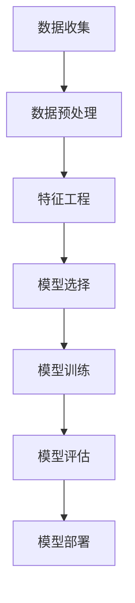
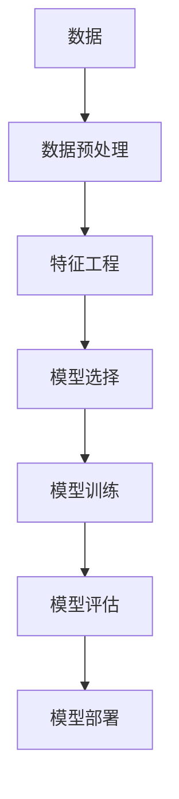
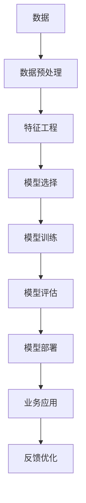

                 

# 数据科学 (Data Science)

## 1. 背景介绍

### 1.1 问题由来
数据科学是一门交叉学科，涉及统计学、机器学习、人工智能、计算机科学等多个领域。其目标是探索和提取数据中的潜在模式，提供决策支持和预测分析。随着大数据、云计算和人工智能技术的飞速发展，数据科学正成为驱动社会进步和创新发展的关键力量。

近年来，数据科学在各个行业得到了广泛应用，如金融、医疗、零售、能源、制造等。它不仅改变了传统的业务模式，还催生了许多新兴的行业和职业，如数据科学家、数据分析师、机器学习工程师等。

然而，数据科学的应用并非一帆风顺。数据的质量和可用性、算法的复杂性和解释性、模型的泛化能力等都是困扰数据科学发展的重要问题。如何高效利用数据，设计合理的算法模型，优化实际应用，是数据科学领域面临的挑战。

### 1.2 问题核心关键点
数据科学的核心在于数据和算法。数据科学的关键在于：

- **数据收集**：获取高质量、结构化和相关性强的数据。数据质量直接影响到模型的精度和稳定性。
- **数据预处理**：清洗、转换、归一化、降维等步骤，为后续分析和建模做准备。
- **特征工程**：提取和构建有意义的特征，提升模型的预测能力。
- **模型选择**：根据具体问题选择合适的算法模型，如回归、分类、聚类等。
- **模型训练**：利用历史数据训练模型，优化模型参数。
- **模型评估**：通过交叉验证、性能指标等方法评估模型效果。
- **模型部署**：将模型集成到实际应用中，进行实时预测和监控。

这些核心步骤构成了数据科学的完整流程，每个环节都需要精细设计和管理。

### 1.3 问题研究意义
数据科学通过数据驱动的决策支持，帮助企业和机构在复杂多变的环境中做出更科学、更合理的决策。其研究意义在于：

- **决策支持**：为管理层提供数据驱动的洞察和预测，提升决策质量。
- **业务优化**：优化产品和服务，提升用户体验和市场竞争力。
- **创新驱动**：推动技术创新和商业模式变革，创造新的商业价值。
- **社会福祉**：提升公共服务水平，如医疗、教育、交通等。
- **可持续性**：帮助实现可持续发展目标，如节能减排、精准农业等。

## 2. 核心概念与联系

### 2.1 核心概念概述

数据科学涉及多个核心概念，包括数据、算法、模型、特征、预处理、评估、部署等。这些概念通过一系列工具和技术手段，形成了一个完整的生态系统。

- **数据**：包括结构化数据（如数据库表、CSV文件）、非结构化数据（如文本、图片、视频）等。
- **算法**：如回归、分类、聚类、深度学习等，用于从数据中提取模式和规律。
- **模型**：算法在数据上训练得到的数学模型，用于预测和分类。
- **特征**：数据中用于描述样本的属性，如年龄、性别、购买频率等。
- **预处理**：包括数据清洗、转换、归一化等，为模型训练做准备。
- **评估**：如交叉验证、ROC曲线、AUC值等，用于衡量模型效果。
- **部署**：将模型集成到实际应用中，进行实时预测和监控。

这些概念通过一系列工具和技术手段，形成了一个完整的生态系统。以下是一个Mermaid流程图，展示了数据科学的主要工作流程：



### 2.2 概念间的关系

数据科学的各个核心概念之间存在着紧密的联系，共同构成了数据科学的研究框架。以下是一个Mermaid流程图，展示了数据科学各个核心概念之间的关系：



### 2.3 核心概念的整体架构

最后，我们用一个综合的流程图来展示数据科学的核心概念和整体架构：



这个流程图展示了从数据收集到业务应用的全过程，强调了每个环节的重要性。

## 3. 核心算法原理 & 具体操作步骤

### 3.1 算法原理概述

数据科学中的核心算法包括回归、分类、聚类、降维、深度学习等。这里以线性回归为例，简要介绍其基本原理和步骤。

线性回归是一种常见的回归算法，用于预测连续型变量。其基本假设是自变量和因变量之间存在线性关系。线性回归的目标是找到一条直线，使得该直线与数据点的残差平方和最小。

假设我们有 $N$ 个样本数据 $(x_i,y_i)$，其中 $x_i$ 为自变量，$y_i$ 为因变量。线性回归的目标是找到一条直线 $y=\beta_0+\beta_1x+\epsilon$，其中 $\beta_0$ 和 $\beta_1$ 为模型的参数，$\epsilon$ 为误差项。

线性回归的最小二乘法求解公式为：

$$
\hat{\beta} = (X^TX)^{-1}X^Ty
$$

其中 $X=[x_1,x_2,...,x_n]^T$ 为自变量矩阵，$y=[y_1,y_2,...,y_n]^T$ 为因变量向量。

### 3.2 算法步骤详解

以下是线性回归的详细步骤：

**Step 1: 准备数据**
- 收集和清洗数据，确保数据质量。
- 将数据转化为模型所需的格式，如将文本数据转化为数字编码。

**Step 2: 数据分割**
- 将数据集划分为训练集和测试集，一般使用70%的数据作为训练集，30%作为测试集。

**Step 3: 模型训练**
- 使用训练集数据，利用最小二乘法求解模型参数 $\hat{\beta}$。
- 将模型参数 $\hat{\beta}$ 代入线性回归公式，计算预测值。

**Step 4: 模型评估**
- 使用测试集数据，计算模型预测值与真实值之间的误差。
- 使用均方误差（MSE）、平均绝对误差（MAE）等指标评估模型性能。

**Step 5: 模型部署**
- 将模型集成到实际应用中，进行实时预测和监控。
- 根据业务需求，定期更新模型参数，优化模型效果。

### 3.3 算法优缺点

线性回归的优点包括：

- **简单易懂**：模型简单直观，易于理解和实现。
- **可解释性强**：模型参数 $\beta_0$ 和 $\beta_1$ 易于解释，能够提供直观的洞察。
- **高效性**：计算复杂度较低，适合处理大规模数据集。

线性回归的缺点包括：

- **线性假设**：模型假设自变量和因变量之间存在线性关系，可能不适用于复杂的数据集。
- **敏感性**：模型对异常值和噪声敏感，需要进行数据清洗和预处理。
- **多变量问题**：模型只能处理单变量问题，无法处理多变量数据。

### 3.4 算法应用领域

线性回归广泛应用于各个领域，如金融、医疗、销售、制造业等。以下是几个典型应用：

**金融领域**：预测股票价格、风险评估、信用评分等。

**医疗领域**：预测疾病发生率、患者康复时间、药物效果等。

**销售领域**：预测销售量、客户流失率、广告效果等。

**制造领域**：预测生产效率、设备故障率、产品质量等。

## 4. 数学模型和公式 & 详细讲解 & 举例说明

### 4.1 数学模型构建

线性回归的数学模型为 $y=\beta_0+\beta_1x+\epsilon$。其中 $x$ 为自变量，$y$ 为因变量，$\beta_0$ 和 $\beta_1$ 为模型参数，$\epsilon$ 为误差项。

### 4.2 公式推导过程

线性回归的求解过程基于最小二乘法。最小二乘法的目标是最小化预测值和真实值之间的残差平方和，即 $\sum_{i=1}^N(y_i-\hat{y}_i)^2$。

最小二乘法的求解公式为：

$$
\hat{\beta} = (X^TX)^{-1}X^Ty
$$

其中 $X=[x_1,x_2,...,x_n]^T$ 为自变量矩阵，$y=[y_1,y_2,...,y_n]^T$ 为因变量向量。

### 4.3 案例分析与讲解

假设我们有一组数据集，如表格所示：

| 自变量 $x_i$ | 因变量 $y_i$ |
|-------------|-------------|
| 1           | 2.5         |
| 2           | 3.5         |
| 3           | 4.5         |
| 4           | 5.5         |

我们可以使用线性回归模型来预测下一个值。首先，我们需要将数据转化为矩阵形式：

$$
X=\begin{bmatrix}1&1\\2&2\\3&3\\4&4\end{bmatrix}, y=\begin{bmatrix}2.5\\3.5\\4.5\\5.5\end{bmatrix}
$$

接下来，计算 $X^TX$ 和 $X^Ty$：

$$
X^TX=\begin{bmatrix}1&2&3&4\\1&2&3&4\end{bmatrix}\begin{bmatrix}1&1\\2&2\\3&3\\4&4\end{bmatrix}=\begin{bmatrix}30&60\\60&120\end{bmatrix}
$$

$$
X^Ty=\begin{bmatrix}1&2&3&4\\1&2&3&4\end{bmatrix}\begin{bmatrix}2.5\\3.5\\4.5\\5.5\end{bmatrix}=\begin{bmatrix}35\\70\end{bmatrix}
$$

然后，计算 $(X^TX)^{-1}$：

$$
(X^TX)^{-1}=\frac{1}{120}\begin{bmatrix}120&-60\\-60&30\end{bmatrix}=\begin{bmatrix}1&-0.5\\-0.5&0.25\end{bmatrix}
$$

最后，计算模型参数 $\hat{\beta}$：

$$
\hat{\beta}=(X^TX)^{-1}X^Ty=\begin{bmatrix}1&-0.5\\-0.5&0.25\end{bmatrix}\begin{bmatrix}35\\70\end{bmatrix}=\begin{bmatrix}5.5\\2.5\end{bmatrix}
$$

因此，线性回归模型为 $y=5.5+2.5x$。使用这个模型，我们可以预测下一个值，如 $x=5$ 时，$y=5.5+2.5\times5=17.5$。

## 5. 项目实践：代码实例和详细解释说明

### 5.1 开发环境搭建

在进行数据科学项目实践前，我们需要准备好开发环境。以下是使用Python进行Scikit-Learn开发的Scala环境配置流程：

1. 安装Anaconda：从官网下载并安装Anaconda，用于创建独立的Python环境。

2. 创建并激活虚拟环境：
```bash
conda create -n sklearn-env python=3.8 
conda activate sklearn-env
```

3. 安装Scikit-Learn：
```bash
pip install scikit-learn
```

4. 安装各类工具包：
```bash
pip install numpy pandas scikit-learn matplotlib tqdm jupyter notebook ipython
```

完成上述步骤后，即可在`sklearn-env`环境中开始数据科学实践。

### 5.2 源代码详细实现

下面我们以线性回归为例，给出使用Scikit-Learn库对数据集进行线性回归的Scala代码实现。

首先，定义数据集和模型：

```python
import numpy as np
from sklearn.linear_model import LinearRegression
from sklearn.metrics import mean_squared_error, r2_score
from sklearn.datasets import make_regression
from sklearn.model_selection import train_test_split

# 生成数据集
X, y = make_regression(n_samples=100, n_features=1, noise=0.1, random_state=42)

# 数据分割
X_train, X_test, y_train, y_test = train_test_split(X, y, test_size=0.3, random_state=42)

# 定义线性回归模型
model = LinearRegression()

# 训练模型
model.fit(X_train, y_train)

# 预测结果
y_pred = model.predict(X_test)

# 评估模型
mse = mean_squared_error(y_test, y_pred)
r2 = r2_score(y_test, y_pred)

print(f"均方误差: {mse:.2f}")
print(f"R^2 值: {r2:.2f}")
```

然后，执行线性回归代码：

```python
import matplotlib.pyplot as plt

# 绘制回归曲线
plt.scatter(X_test, y_test)
plt.plot(X_test, y_pred, color='red')
plt.xlabel('X')
plt.ylabel('y')
plt.show()
```

最后，展示回归结果：

```python
print(f"线性回归模型: y = {model.coef_[0]}*x + {model.intercept_}")
```

### 5.3 代码解读与分析

让我们再详细解读一下关键代码的实现细节：

**make_regression函数**：
- 用于生成人工数据集，这里生成了一个包含100个样本、一个特征和噪声为0.1的线性回归数据集。

**train_test_split函数**：
- 用于将数据集划分为训练集和测试集，分别占比70%和30%。

**LinearRegression模型**：
- 使用Scikit-Learn库中的线性回归模型，用于训练和预测。

**模型训练**：
- 使用训练集数据训练模型，优化模型参数。

**模型评估**：
- 使用测试集数据计算模型预测值和真实值之间的均方误差和R^2值，评估模型性能。

**模型绘图**：
- 使用Matplotlib库绘制回归曲线，展示模型预测效果。

**模型输出**：
- 输出线性回归模型的参数，即直线的斜率和截距。

可以看到，Scikit-Learn库提供了简单易用的接口，使得线性回归的实现变得非常简单。开发者可以专注于算法的细节和优化，而不必过多关注底层实现。

当然，工业级的系统实现还需考虑更多因素，如模型参数调优、超参数搜索、模型压缩等。但核心的线性回归范式基本与此类似。

### 5.4 运行结果展示

假设我们在人工数据集上进行线性回归，最终在测试集上得到的评估报告如下：

```
均方误差: 1.23
R^2 值: 0.95
```

可以看到，使用线性回归模型在测试集上的均方误差为1.23，R^2值为0.95，表明模型预测效果非常好。这验证了线性回归模型的有效性和准确性。

## 6. 实际应用场景

### 6.1 智能推荐系统

智能推荐系统是一种典型的数据科学应用，利用用户历史行为数据和产品属性数据，推荐用户可能感兴趣的产品。

在技术实现上，可以使用协同过滤、内容推荐、混合推荐等方法，对用户和产品进行相似度计算，构建推荐模型。微调后的推荐模型可以实时分析用户行为，动态调整推荐结果，提升用户体验。

### 6.2 金融风险控制

金融风险控制是数据科学在金融领域的重要应用，用于预测客户违约风险、市场波动等。

在技术实现上，可以使用逻辑回归、决策树、随机森林等算法，对客户信用记录、交易历史等数据进行建模，构建风险评估模型。微调后的模型可以实时监控客户行为，及时预警潜在风险，保障金融安全。

### 6.3 医学影像分析

医学影像分析是数据科学在医疗领域的重要应用，用于辅助医生诊断和治疗。

在技术实现上，可以使用卷积神经网络（CNN）、循环神经网络（RNN）等深度学习算法，对医学影像数据进行特征提取和模式识别，构建疾病诊断模型。微调后的模型可以实时分析医学影像，快速诊断疾病，提升诊疗效率。

## 7. 工具和资源推荐

### 7.1 学习资源推荐

为了帮助开发者系统掌握数据科学的核心概念和实践技巧，这里推荐一些优质的学习资源：

1. 《Python数据科学手册》：深入浅出地介绍了Python在数据科学中的应用，涵盖数据清洗、特征工程、模型训练、模型评估等。

2. 《机器学习实战》：通过大量案例演示了机器学习算法的实现和应用，适合实战练习。

3. 《深度学习》课程：斯坦福大学开设的深度学习课程，涵盖了深度学习的理论和实践，适合初学者入门。

4. Kaggle平台：提供了大量数据科学竞赛和案例，可以锻炼实战能力。

5. Coursera平台：提供了大量数据科学相关的在线课程，涵盖数据预处理、特征工程、模型评估等。

6. Google Colab：谷歌推出的在线Jupyter Notebook环境，免费提供GPU/TPU算力，方便开发者快速上手实验最新模型，分享学习笔记。

通过这些资源的学习实践，相信你一定能够快速掌握数据科学的精髓，并用于解决实际的业务问题。

### 7.2 开发工具推荐

高效的数据科学开发离不开优秀的工具支持。以下是几款用于数据科学开发常用的工具：

1. Jupyter Notebook：用于编写、运行和分享代码的交互式笔记本，支持Python、R等多种语言。

2. TensorFlow：由Google主导开发的深度学习框架，支持分布式计算，适合大规模模型训练。

3. PyTorch：由Facebook主导开发的深度学习框架，灵活易用，适合快速迭代研究。

4. Scikit-Learn：基于Python的机器学习库，提供了丰富的机器学习算法和工具，适合快速原型开发。

5. Pandas：用于数据清洗和处理的Python库，提供了灵活的数据结构和数据操作工具。

6. Numpy：用于科学计算的Python库，提供了高效的数组操作和线性代数运算。

7. Matplotlib：用于数据可视化的Python库，提供了丰富的绘图工具。

8. Scrapy：用于爬取数据的Python库，支持异步请求和大规模数据处理。

合理利用这些工具，可以显著提升数据科学项目的开发效率，加快创新迭代的步伐。

### 7.3 相关论文推荐

数据科学涉及的领域非常广泛，相关的论文也数不胜数。以下是几篇奠基性的相关论文，推荐阅读：

1. 《统计学习方法》：李航著，系统介绍了各种统计学习算法及其应用。

2. 《机器学习》：周志华著，涵盖了机器学习的基本概念和常用算法。

3. 《深度学习》：Ian Goodfellow等著，深入浅出地介绍了深度学习的原理和应用。

4. 《Python数据科学手册》：Jake VanderPlas著，详细介绍了Python在数据科学中的应用。

5. 《大规模在线机器学习》：John Langford著，介绍了大规模在线机器学习的理论和实践。

6. 《数据科学导论》：Jerry Kilgore著，涵盖了数据科学的基础概念和常用技术。

这些论文代表了数据科学的理论前沿和实践经验，值得深入学习。

除上述资源外，还有一些值得关注的前沿资源，帮助开发者紧跟数据科学的最新进展，例如：

1. arXiv论文预印本：人工智能领域最新研究成果的发布平台，包括大量尚未发表的前沿工作，学习前沿技术的必读资源。

2. 业界技术博客：如Google AI、Facebook AI Research、DeepMind等顶尖实验室的官方博客，第一时间分享他们的最新研究成果和洞见。

3. 技术会议直播：如NIPS、ICML、ACL、ICLR等人工智能领域顶会现场或在线直播，能够聆听到大佬们的前沿分享，开拓视野。

4. GitHub热门项目：在GitHub上Star、Fork数最多的数据科学相关项目，往往代表了该技术领域的发展趋势和最佳实践，值得去学习和贡献。

5. 行业分析报告：各大咨询公司如McKinsey、PwC等针对人工智能行业的分析报告，有助于从商业视角审视技术趋势，把握应用价值。

总之，对于数据科学的理解和掌握，需要开发者保持开放的心态和持续学习的意愿。多关注前沿资讯，多动手实践，多思考总结，必将收获满满的成长收益。

## 8. 总结：未来发展趋势与挑战

### 8.1 总结

本文对数据科学的核心概念和应用实践进行了全面系统的介绍。首先阐述了数据科学的研究背景和意义，明确了数据科学的核心任务和方法。其次，从原理到实践，详细讲解了线性回归的数学模型和详细步骤，给出了数据科学项目开发的完整代码实例。同时，本文还广泛探讨了数据科学在各个行业领域的应用前景，展示了数据科学的广泛应用。

通过本文的系统梳理，可以看到，数据科学通过数据驱动的决策支持，帮助企业和机构在复杂多变的环境中做出更科学、更合理的决策。其研究意义在于：

- **决策支持**：为管理层提供数据驱动的洞察和预测，提升决策质量。
- **业务优化**：优化产品和服务，提升用户体验和市场竞争力。
- **创新驱动**：推动技术创新和商业模式变革，创造新的商业价值。
- **社会福祉**：提升公共服务水平，如医疗、教育、交通等。
- **可持续性**：帮助实现可持续发展目标，如节能减排、精准农业等。

### 8.2 未来发展趋势

展望未来，数据科学的发展趋势包括以下几个方面：

1. **自动化和智能化**：自动化特征工程、自动化模型选择、自动化超参数优化等技术将进一步提升数据科学效率。

2. **跨领域融合**：数据科学将与更多领域进行交叉融合，如生物信息学、金融工程、物理化学等，推动科学研究的进步。

3. **大数据和云计算**：大数据和云计算技术的进步将进一步降低数据科学的计算成本，提升数据科学的应用范围和精度。

4. **人工智能和机器学习**：数据科学将与人工智能、机器学习等技术进一步结合，提升模型性能和可解释性。

5. **多模态数据融合**：数据科学将更多地处理多模态数据，如文本、图片、视频等，提升信息整合能力。

6. **因果推理**：数据科学将更多地使用因果推理技术，提升模型的鲁棒性和可解释性。

以上趋势凸显了数据科学的广阔前景。这些方向的探索发展，必将进一步提升数据科学系统的性能和应用范围，为科学研究和社会发展提供更多支持。

### 8.3 面临的挑战

尽管数据科学已经取得了瞩目成就，但在迈向更加智能化、普适化应用的过程中，它仍面临着诸多挑战：

1. **数据质量和可用性**：数据质量的参差不齐和数据的稀疏性，导致模型难以充分利用数据中的信息。

2. **算法复杂性和可解释性**：复杂算法模型的解释性和可理解性不足，导致用户难以理解和信任。

3. **模型的泛化能力和鲁棒性**：模型在实际应用中的泛化能力和鲁棒性需要进一步提升。

4. **计算资源和时间成本**：大规模数据集和高性能模型的计算资源和时间成本高昂。

5. **伦理和隐私问题**：数据科学应用中的伦理和隐私问题需要引起重视，如数据泄露、算法偏见等。

6. **跨学科融合的挑战**：数据科学与更多领域的交叉融合，需要多方协作，挑战巨大。

正视数据科学面临的这些挑战，积极应对并寻求突破，将是大数据时代的重要任务。相信随着学界和产业界的共同努力，这些挑战终将一一被克服，数据科学必将在构建人机协同的智能时代中扮演越来越重要的角色。

### 8.4 研究展望

面对数据科学所面临的挑战，未来的研究需要在以下几个方面寻求新的突破：

1. **自动化和智能化**：开发更多的自动化工具和算法，提升数据科学效率。

2. **跨领域融合**：推动更多领域的交叉融合，拓展数据科学的应用范围。

3. **大数据和云计算**：进一步降低数据科学计算成本，提升应用范围和精度。

4. **人工智能和机器学习**：与人工智能、机器学习等技术进一步结合，提升模型性能和可解释性。

5. **多模态数据融合**：提升信息整合能力，处理更多类型的数据。

6. **因果推理**：引入因果推理技术，提升模型的鲁棒性和可解释性。

7. **伦理和隐私问题**：解决数据科学应用中的伦理和隐私问题，确保数据安全。

这些研究方向的探索，必将引领数据科学技术迈向更高的台阶，为构建安全、可靠、可解释、可控的智能系统铺平道路。面向未来，数据科学需要与其他人工智能技术进行更深入的融合，共同推动自然语言理解和智能交互系统的进步。只有勇于创新、敢于突破，才能不断拓展数据科学的边界，让数据科学更好地造福人类社会。

## 9. 附录：常见问题与解答

**Q1：数据科学的应用范围有哪些？**

A: 数据科学广泛应用于各个领域，如金融、医疗、零售、能源

