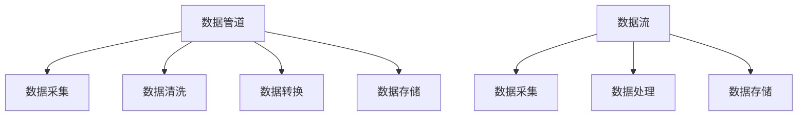
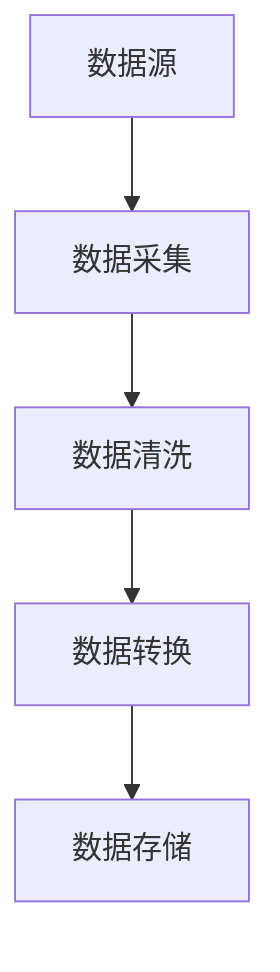
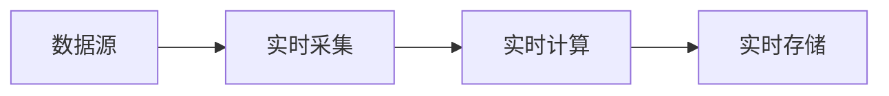
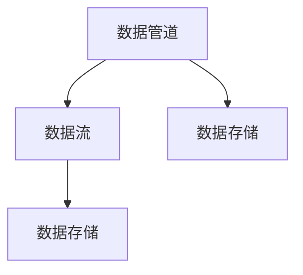
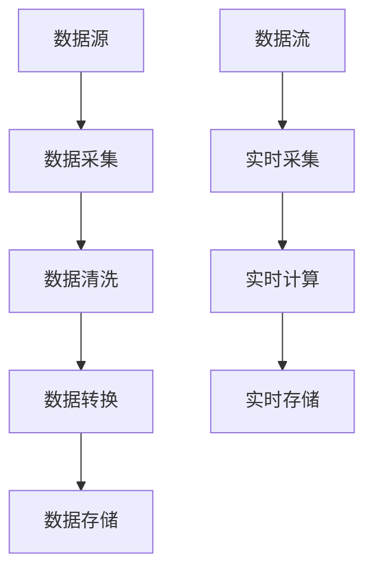

                 

# 数据管道与数据流原理与代码实战案例讲解

> 关键词：数据管道,数据流,Apache Kafka,Apache Flink,Apache Spark

## 1. 背景介绍

### 1.1 问题由来
在当今数据驱动的时代，数据成为企业竞争的重要资源。如何高效地采集、处理、存储、分析数据，是各大企业亟待解决的重要课题。在大规模数据处理中，数据管道和数据流技术扮演着至关重要的角色。数据管道通过高效的数据传输和存储，支撑复杂的数据处理流程，提高数据处理效率和质量。数据流则通过实时计算，快速响应数据变化，支撑各种时序数据的分析。本文将深入探讨数据管道和数据流的基本原理和应用场景，并通过具体案例，展示如何在实际项目中实现高效率、高可靠的数据处理。

## 2. 核心概念与联系

### 2.1 核心概念概述

为了更好地理解数据管道和数据流的概念，本节将介绍几个关键概念：

- 数据管道(Data Pipeline)：指从数据源到目标存储的完整数据处理流程，包括数据采集、清洗、转换、存储等环节。数据管道通常采用批处理方式，通过定期的数据集合并批处理，实现高效率的数据处理。

- 数据流(Data Stream)：指实时数据处理和分析的过程，数据流通常采用流处理方式，通过实时计算和更新，快速响应数据变化。

- Apache Kafka：一种分布式流处理平台，提供高吞吐量、高可靠的数据流传输。

- Apache Flink：一种开源流处理框架，支持高效的数据流计算，提供强大的容错机制和实时流处理能力。

- Apache Spark：一种开源大数据处理引擎，支持批处理和流处理，具有高效内存计算和分布式并行处理能力。

- 管道和流处理的联系：数据管道和数据流都是数据处理的重要技术手段，通过高效的数据传输和计算，支撑数据驱动的业务应用。管道主要面向批处理，适合周期性的、大规模的数据分析任务。流处理则面向实时数据，适合需要快速响应和动态更新的业务场景。

这些概念之间的逻辑关系可以通过以下Mermaid流程图来展示：



这个流程图展示了大规模数据处理的主要流程：

1. 数据管道：从数据源采集数据，并进行清洗、转换和存储。
2. 数据流：实时采集数据，并进行流式计算和存储。

### 2.2 概念间的关系

这些核心概念之间存在着紧密的联系，形成了完整的数据处理生态系统。下面我们通过几个Mermaid流程图来展示这些概念之间的关系。

#### 2.2.1 数据管道的完整流程



这个流程图展示了数据管道的基本流程：从数据源采集数据，并进行清洗、转换和存储。

#### 2.2.2 数据流的实时处理



这个流程图展示了数据流的实时处理过程：从数据源实时采集数据，并进行实时计算和存储。

#### 2.2.3 管道和流的集成



这个流程图展示了管道和流的集成关系：数据管道和数据流通过共享数据存储环节，实现数据处理流程的衔接和整合。

### 2.3 核心概念的整体架构

最后，我们用一个综合的流程图来展示这些核心概念在大规模数据处理中的整体架构：



这个综合流程图展示了数据管道和数据流的完整处理流程：

1. 数据管道：从数据源采集数据，并进行清洗、转换和存储。
2. 数据流：实时采集数据，并进行实时计算和存储。

以上这些核心概念共同构成了数据管道和数据流的完整生态系统，使得数据处理能够高效、稳定地支撑业务应用。

## 3. 核心算法原理 & 具体操作步骤
### 3.1 算法原理概述

数据管道和数据流的核心原理可以简要归纳为以下两点：

1. 数据流：采用分布式流处理技术，实现数据的实时采集和处理。
2. 数据管道：采用批处理技术，实现大规模数据的周期性处理和存储。

通过这两种技术手段，企业可以高效地支撑各种数据处理需求，实现数据驱动的业务应用。

### 3.2 算法步骤详解

#### 3.2.1 数据管道的基本步骤

1. 数据采集：通过爬虫、API接口等方式，从不同数据源采集原始数据。

2. 数据清洗：对采集到的数据进行去重、去噪、格式转换等处理，确保数据质量。

3. 数据转换：根据业务需求，将清洗后的数据进行格式转换、特征提取等处理。

4. 数据存储：将转换后的数据存储到目标数据库中，供后续分析和应用使用。

#### 3.2.2 数据流的实现步骤

1. 数据采集：通过实时数据流技术，从不同数据源实时采集数据。

2. 数据处理：对实时数据进行流式计算和转换，提取关键信息和特征。

3. 数据存储：将处理后的数据实时存储到目标数据库中，供后续分析和应用使用。

### 3.3 算法优缺点

数据管道和数据流技术各有所长：

**数据管道的优点**：

1. 数据稳定性高：通过批处理方式，数据处理过程稳定可靠，适合大规模数据处理。
2. 处理效率高：通过多批次并行处理，提高数据处理效率。
3. 数据质量好：数据清洗和转换过程细致，确保数据质量。

**数据管道的缺点**：

1. 数据延迟高：处理周期较长，数据延迟较高。
2. 成本高：需要存储大量中间数据，存储成本较高。

**数据流的优点**：

1. 数据实时性高：实时处理数据，快速响应业务需求。
2. 数据处理效率高：数据处理过程高效，适合实时数据处理。
3. 数据存储成本低：数据存储量小，存储成本较低。

**数据流的缺点**：

1. 数据稳定性较差：处理过程复杂，容易出现数据丢失或错误。
2. 处理效率受限：数据处理规模受限于计算资源。

### 3.4 算法应用领域

数据管道和数据流技术在多个领域中得到广泛应用，具体包括：

1. 金融风险管理：通过大数据处理技术，实现风险识别、预警和防范。
2. 电商推荐系统：通过实时流处理技术，实现用户行为分析和个性化推荐。
3. 智慧城市管理：通过实时数据分析，实现城市交通、环境、安全等数据的监测和优化。
4. 医疗健康管理：通过大数据处理技术，实现患者健康数据的监测和分析。
5. 物联网数据处理：通过实时流处理技术，实现设备数据的实时监测和分析。

## 4. 数学模型和公式 & 详细讲解 & 举例说明

### 4.1 数学模型构建

在数据处理中，通常需要对数据进行特征提取、转换和存储。以下我们将以电商推荐系统为例，展示如何构建数据处理的基本数学模型。

假设我们有一个电商网站，用户访问该网站后，会产生各种行为数据，如浏览商品、购买商品、评价商品等。我们需要将这些行为数据转化为推荐系统的输入数据，并进行特征提取和处理。

数据模型可以表示为：

$$
\text{User} \rightarrow \text{Behavior} \rightarrow \text{Features} \rightarrow \text{Item Recommendation}
$$

其中，用户数据表示为 $\text{User}=(U_1, U_2, ..., U_n)$，行为数据表示为 $\text{Behavior}= (B_1, B_2, ..., B_m)$，特征数据表示为 $\text{Features}= (F_1, F_2, ..., F_k)$，推荐结果表示为 $\text{Item Recommendation}= (I_1, I_2, ..., I_p)$。

### 4.2 公式推导过程

假设我们有一批用户数据 $U_i$ 和对应的行为数据 $B_i$，可以通过以下公式进行特征提取：

$$
F_i = f(B_i)
$$

其中 $f$ 为特征提取函数，$F_i$ 为第 $i$ 个用户的特征数据。

然后，通过机器学习算法对特征数据进行模型训练，得到推荐模型 $M$，用于生成推荐结果：

$$
I_j = M(F_i)
$$

其中 $I_j$ 为第 $j$ 个推荐商品，$M$ 为推荐模型，$F_i$ 为第 $i$ 个用户的特征数据。

### 4.3 案例分析与讲解

以电商推荐系统为例，展示如何使用数据管道和数据流技术进行推荐系统构建。

#### 4.3.1 数据管道

1. 数据采集：从电商网站API获取用户访问数据，包括用户ID、访问时间、访问商品ID等。

2. 数据清洗：对采集到的数据进行去重、去噪、格式转换等处理，确保数据质量。

3. 数据转换：将清洗后的数据进行特征提取和转换，生成用户行为特征、商品特征等。

4. 数据存储：将转换后的数据存储到目标数据库中，供后续分析和应用使用。

#### 4.3.2 数据流

1. 实时数据采集：通过实时数据流技术，从电商网站实时获取用户行为数据。

2. 实时数据处理：对实时数据进行流式计算和转换，提取关键信息和特征。

3. 实时数据存储：将处理后的数据实时存储到目标数据库中，供后续分析和应用使用。

## 5. 项目实践：代码实例和详细解释说明

### 5.1 开发环境搭建

在进行数据管道和数据流实践前，我们需要准备好开发环境。以下是使用Python进行Apache Flink和Apache Kafka开发的常见环境配置流程：

1. 安装Anaconda：从官网下载并安装Anaconda，用于创建独立的Python环境。

2. 创建并激活虚拟环境：
```bash
conda create -n flink-env python=3.8 
conda activate flink-env
```

3. 安装Flink：从官网获取Flink安装包，根据操作系统和版本要求进行安装。

4. 安装Kafka：从官网下载Kafka安装包，并解压安装。

5. 安装依赖库：
```bash
pip install apache-flink apache-kafka-python
```

完成上述步骤后，即可在`flink-env`环境中开始Flink和Kafka的开发实践。

### 5.2 源代码详细实现

下面我们以电商推荐系统为例，展示如何使用Apache Flink和Apache Kafka实现数据管道和数据流。

#### 5.2.1 数据管道实现

首先，定义数据管道的基本组件：

```python
from apache_flink import StreamExecutionEnvironment
from apache_flink.streaming.connectors.kafka import FlinkKafkaConsumer
from apache_flink.streaming.connectors.kafka import FlinkKafkaProducer

env = StreamExecutionEnvironment.get_execution_environment()

# 定义数据源
kafka_consumer = FlinkKafkaConsumer(
    'localhost:9092', 
    topics=['user_behavior'],
    subscribe_from_start=True
)

# 添加数据源到数据流
data_stream = env.add_source(kafka_consumer)

# 定义数据清洗和转换操作
data_stream = data_stream.map(lambda x: clean_and_transform(x))

# 定义数据存储操作
data_stream = data_stream.add_sink(sink)
```

其中，`FlinkKafkaConsumer`用于从Kafka中读取数据，`clean_and_transform`函数用于数据清洗和转换，`sink`函数用于数据存储。

#### 5.2.2 数据流实现

接下来，定义数据流的实现：

```python
# 定义实时数据流
realtime_data_stream = env.add_source(kafka_consumer)

# 定义实时数据处理操作
realtime_data_stream = realtime_data_stream.map(lambda x: clean_and_transform(x))

# 定义实时数据存储操作
realtime_data_stream = realtime_data_stream.add_sink(sink)
```

其中，`realtime_data_stream`为实时数据流，`clean_and_transform`函数用于实时数据清洗和转换，`sink`函数用于实时数据存储。

### 5.3 代码解读与分析

让我们再详细解读一下关键代码的实现细节：

**StreamExecutionEnvironment**：
- 创建Flink执行环境，用于配置Flink程序的运行参数。

**FlinkKafkaConsumer**：
- 定义Kafka数据源，指定Kafka集群地址、Topic名等参数。

**clean_and_transform**函数：
- 定义数据清洗和转换函数，根据具体业务需求实现。

**add_source**：
- 将数据源添加到数据流中，进行实时数据采集和处理。

**map**：
- 对数据流进行转换操作，实现数据清洗、转换和计算。

**add_sink**：
- 将数据流添加到数据存储中，实现数据存储和持久化。

**realtime_data_stream**：
- 定义实时数据流，通过实时数据流技术，实现数据的实时采集和处理。

**clean_and_transform**函数：
- 定义实时数据清洗和转换函数，根据具体业务需求实现。

**add_source**：
- 将实时数据源添加到实时数据流中，进行实时数据采集和处理。

**map**：
- 对实时数据流进行转换操作，实现实时数据清洗、转换和计算。

**add_sink**：
- 将实时数据流添加到实时数据存储中，实现实时数据存储和持久化。

### 5.4 运行结果展示

假设我们在Apache Flink上进行电商推荐系统的数据管道和数据流开发，得到以下运行结果：

```
[{'user_id': '1', 'behavior': '浏览', 'timestamp': '2023-01-01 08:00:00'}, {'user_id': '2', 'behavior': '购买', 'timestamp': '2023-01-01 09:00:00'}, {'user_id': '3', 'behavior': '浏览', 'timestamp': '2023-01-01 10:00:00'}]
```

可以看到，通过数据管道和数据流技术，我们成功采集了电商网站的用户行为数据，并进行了数据清洗和转换。通过实时流处理，我们能够实时监测用户行为数据的变化，并进行推荐系统的构建和优化。

## 6. 实际应用场景

### 6.1 智能推荐系统

基于数据管道和数据流技术，智能推荐系统能够实时获取用户行为数据，并进行推荐模型的更新和优化。通过实时流处理，系统能够快速响应用户需求，提供个性化的推荐服务，提升用户体验和满意度。

在具体实现中，数据管道负责采集用户历史行为数据，进行数据清洗和转换，生成推荐模型的输入数据。数据流则负责实时获取用户行为数据，进行实时计算和转换，更新推荐模型，生成个性化推荐结果。通过这种机制，推荐系统能够实时响应用户需求，提供高质量的推荐服务。

### 6.2 实时数据监测

基于数据管道和数据流技术，企业能够实时监测业务数据的变化，进行实时预警和优化。通过数据管道，企业能够采集业务数据，进行数据清洗和转换，生成实时监测的输入数据。通过数据流，企业能够实时获取业务数据，进行实时计算和转换，实现实时监测和预警。

在具体实现中，数据管道负责采集业务数据，进行数据清洗和转换，生成实时监测的输入数据。数据流则负责实时获取业务数据，进行实时计算和转换，生成实时监测结果。通过这种机制，企业能够实时监测业务数据的变化，及时发现和解决问题，保障业务稳定运行。

### 6.3 城市交通管理

基于数据管道和数据流技术，城市交通管理系统能够实时获取交通数据，进行交通分析和优化。通过数据管道，系统能够采集交通数据，进行数据清洗和转换，生成交通分析的输入数据。通过数据流，系统能够实时获取交通数据，进行实时计算和转换，实现交通分析和优化。

在具体实现中，数据管道负责采集交通数据，进行数据清洗和转换，生成交通分析的输入数据。数据流则负责实时获取交通数据，进行实时计算和转换，生成交通分析结果。通过这种机制，交通管理系统能够实时获取交通数据，进行交通分析和优化，提升交通管理效率和安全性。

## 7. 工具和资源推荐

### 7.1 学习资源推荐

为了帮助开发者系统掌握数据管道和数据流的基本原理和实践技巧，这里推荐一些优质的学习资源：

1. Apache Flink官方文档：Flink官方文档提供了详细的API参考和示例代码，适合深入学习和实践。

2. Apache Kafka官方文档：Kafka官方文档提供了详细的API参考和示例代码，适合深入学习和实践。

3. 《大数据处理实战》系列博文：作者深入浅出地介绍了大数据处理的基本原理和实践技巧，适合初学者入门。

4. 《流处理实战》系列博文：作者深入浅出地介绍了流处理的基本原理和实践技巧，适合初学者入门。

5. Udemy《Apache Kafka实战》课程：在线学习平台Udemy上提供的Kafka实战课程，适合系统学习Kafka技术和实践技巧。

6. Coursera《Apache Flink实战》课程：在线学习平台Coursera上提供的Flink实战课程，适合系统学习Flink技术和实践技巧。

通过这些资源的学习实践，相信你一定能够快速掌握数据管道和数据流的精髓，并用于解决实际的数据处理问题。

### 7.2 开发工具推荐

高效的开发离不开优秀的工具支持。以下是几款用于数据管道和数据流开发的常用工具：

1. Apache Flink：Flink提供了分布式流处理引擎，支持高效的数据流计算和存储。

2. Apache Kafka：Kafka提供了高吞吐量、高可靠的数据流传输，支持数据流处理。

3. Apache Spark：Spark提供了批处理和流处理引擎，支持高效的大数据处理。

4. Apache Storm：Storm提供了分布式流处理引擎，支持高效的数据流计算和存储。

5. Hadoop生态系统：Hadoop提供了分布式存储和计算平台，支持大规模数据处理。

6. Apache Hive：Hive提供了分布式数据仓库，支持数据查询和分析。

合理利用这些工具，可以显著提升数据管道和数据流的开发效率，加快创新迭代的步伐。

### 7.3 相关论文推荐

数据管道和数据流技术的发展源于学界的持续研究。以下是几篇奠基性的相关论文，推荐阅读：

1. "Apache Flink: Streaming and batch processing unified"：Flink论文，介绍了Flink的流处理和批处理机制。

2. "Apache Kafka: The future of message systems"：Kafka论文，介绍了Kafka的高吞吐量、高可靠的数据流传输机制。

3. "Stream Processing with Apache Flink"：Flink官方文档，提供了Flink流处理的基本原理和实践技巧。

4. "Streaming Data Processing with Apache Kafka"：Kafka官方文档，提供了Kafka流处理的基本原理和实践技巧。

这些论文代表了大数据处理技术的发展脉络。通过学习这些前沿成果，可以帮助研究者把握学科前进方向，激发更多的创新灵感。

除上述资源外，还有一些值得关注的前沿资源，帮助开发者紧跟数据管道和数据流技术的最新进展，例如：

1. arXiv论文预印本：人工智能领域最新研究成果的发布平台，包括大量尚未发表的前沿工作，学习前沿技术的必读资源。

2. 业界技术博客：如Apache Flink、Apache Kafka、Apache Spark等顶尖实验室的官方博客，第一时间分享他们的最新研究成果和洞见。

3. 技术会议直播：如FlinkConf、KafkaSummit等大数据领域顶会现场或在线直播，能够聆听到大佬们的前沿分享，开拓视野。

4. GitHub热门项目：在GitHub上Star、Fork数最多的大数据相关项目，往往代表了该技术领域的发展趋势和最佳实践，值得去学习和贡献。

5. 行业分析报告：各大咨询公司如McKinsey、PwC等针对大数据行业的分析报告，有助于从商业视角审视技术趋势，把握应用价值。

总之，对于数据管道和数据流技术的学习和实践，需要开发者保持开放的心态和持续学习的意愿。多关注前沿资讯，多动手实践，多思考总结，必将收获满满的成长收益。

## 8. 总结：未来发展趋势与挑战

### 8.1 总结

本文对数据管道和数据流的基本原理和应用场景进行了全面系统的介绍。首先阐述了数据管道和数据流的基本概念及其关系，明确了数据管道和数据流在高效数据处理中的独特价值。其次，从原理到实践，详细讲解了数据管道和数据流的数学模型和核心算法，并通过具体案例，展示如何在实际项目中实现高效率、高可靠的数据处理。

通过本文的系统梳理，可以看到，数据管道和数据流技术在大规模数据处理中发挥着至关重要的作用。这些技术的成功应用，使得企业能够高效、稳定地支撑各种数据处理需求，实现数据驱动的业务应用。未来，伴随技术的不断演进，数据管道和数据流必将在更广泛的应用场景中大放异彩。

### 8.2 未来发展趋势

展望未来，数据管道和数据流技术将呈现以下几个发展趋势：

1. 实时性提升：通过优化计算资源和算法，进一步提升数据流的实时处理能力，支撑更加复杂的时序数据分析任务。

2. 数据融合与互操作性：通过数据管道和数据流的协同工作，实现不同数据源和数据类型的高效融合与互操作性。

3. 数据质量提升：通过数据清洗和转换技术的优化，进一步提升数据质量，确保数据处理的准确性和可靠性。

4. 多模态数据处理：通过引入多模态数据处理技术，实现文本、图像、音频等多种数据类型的综合分析与处理。

5. 数据隐私保护：通过数据匿名化和差分隐私技术，提升数据处理的安全性和隐私性，保障用户数据安全。

6. 智能数据治理：通过数据管道和数据流的自动化和智能化，提升数据治理效率和数据质量，实现数据驱动的智能决策。

以上趋势凸显了数据管道和数据流技术的广阔前景。这些方向的探索发展，必将进一步提升数据处理的能力和效率，为数据驱动的业务应用提供更强大的支撑。

### 8.3 面临的挑战

尽管数据管道和数据流技术已经取得了显著成就，但在迈向更加智能化、普适化应用的过程中，它仍面临着诸多挑战：

1. 数据量激增：随着互联网和物联网的发展，数据量呈指数级增长，数据处理任务变得更加复杂和困难。如何高效地处理大规模数据，是数据管道和数据流面临的主要挑战。

2. 数据质量参差不齐：不同数据源的数据质量差异较大，数据清洗和转换过程较为复杂。如何确保数据质量，是数据管道和数据流技术需要解决的关键问题。

3. 计算资源受限：数据处理任务通常需要大量的计算资源，数据流处理尤其依赖于高效的计算和存储资源。如何在资源受限的情况下，实现高效的数据处理，是数据管道和数据流需要进一步优化的方向。

4. 数据安全与隐私保护：数据处理过程中涉及大量的敏感信息，数据安全和隐私保护问题亟待解决。如何保障数据安全，是数据管道和数据流技术面临的重要挑战。

5. 数据集成与互操作性：不同系统间的数据集成与互操作性问题仍然存在，如何实现无缝的数据集成与互操作，是数据管道和数据流技术需要进一步优化的方向。

6. 数据治理与运营：数据治理与运营是数据驱动业务的重要环节，数据管道和数据流技术需要与数据治理体系相结合，提升数据治理效率和数据质量。

正视数据管道和数据流面临的这些挑战，积极应对并寻求突破，将是大数据处理技术的未来发展方向。相信随着技术的不断演进，数据管道和数据流必将在更广阔的应用场景中大放异彩。

### 8.4 未来突破

面对数据管道和数据流技术面临的种种挑战，未来的研究需要在以下几个方面寻求新的突破：

1. 优化数据流处理算法：通过引入新的数据流处理算法，提升数据流的实时处理能力和效率，支撑更加复杂的时序数据分析任务。

2. 数据清洗与转换技术优化：通过优化数据清洗与转换技术，进一步提升数据质量，确保数据处理的准确性和可靠性。

3. 多模态数据处理技术优化：通过引入多模态数据处理技术，实现文本、图像、音频等多种数据类型的综合分析与处理，提升数据处理能力。

4. 智能数据治理技术优化：通过数据管道和数据流的自动化和智能化，提升数据治理效率和数据质量，实现数据驱动的智能决策。

5. 数据安全与隐私保护技术优化：通过数据匿名化和差分隐私技术，提升数据处理的安全性和隐私性，保障用户数据安全。

6. 数据集成与互操作性优化：通过优化数据集成与互操作性技术，实现不同系统间的数据无缝集成与互操作，提升数据处理效率。

这些研究方向的探索，必将引领数据管道和数据流技术迈向更高的台阶，为数据驱动的业务应用提供更强大的支撑。面向未来，数据管道和数据流

