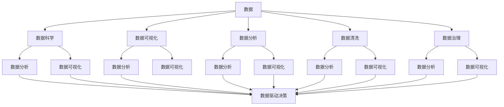

                 

# 数据素养：理解并使用数据，从数据中产生见解

> 关键词：数据素养, 数据科学, 数据可视化, 数据分析, 数据清洗, 数据治理, 数据驱动决策

## 1. 背景介绍

### 1.1 问题由来

在当今信息化和数字化的时代，数据无处不在，几乎所有的决策和行为都依赖于数据。数据素养（Data Literacy）成为了每个行业从业人员必备的技能，尤其是在大数据、人工智能和云计算领域，数据素养更是核心竞争力之一。数据素养不仅仅意味着能够使用工具和软件处理数据，更包括对数据的理解、分析和解释。具备数据素养的人，能够从数据中提取有价值的见解，推动业务决策和创新。

### 1.2 问题核心关键点

数据素养的核心在于：

1. **理解数据**：掌握数据的本质、类型和来源，能够评估数据的可靠性与准确性。
2. **分析数据**：使用统计方法和算法，提取数据的内在规律与关联。
3. **解释数据**：将分析结果转化为易于理解的视觉化和文字描述，辅助决策。

### 1.3 问题研究意义

提升数据素养，对个人、企业和社会的意义重大：

1. **个人层面**：提高数据分析能力，做出更理性的决策。
2. **企业层面**：优化运营效率，提升创新能力，增强竞争力。
3. **社会层面**：促进数据驱动的社会治理，提高公共服务水平。

数据素养已经成为推动社会进步和经济发展的重要因素，具备数据素养的人能够充分利用数据资源，促进信息的有效传播和决策的科学化。

## 2. 核心概念与联系

### 2.1 核心概念概述

- **数据**：记录在计算机或其他介质上，具有特定结构、准确性和时效性的信息集合。
- **数据科学**：使用算法、统计学和计算机技术对数据进行分析和解释，旨在发现数据中的模式和规律。
- **数据可视化**：将数据转化为图形或图表的形式，直观展示数据特征和变化趋势。
- **数据分析**：对数据进行系统性的检查、清洗和统计，以发现数据中的关键信息和潜在价值。
- **数据清洗**：识别和处理数据中的错误、异常和重复，提升数据的质量。
- **数据治理**：通过政策、技术和管理手段，确保数据的质量、安全和使用合规。
- **数据驱动决策**：基于数据分析和解释，制定和调整业务决策。

这些概念之间相互联系，形成一个有机整体。数据科学是核心工具，数据分析和数据可视化是关键过程，数据清洗和数据治理是基础保障，数据驱动决策是最终目标。

### 2.2 概念间的关系

通过以下Mermaid流程图展示这些概念之间的关系：



这个流程图展示了各个概念在数据素养框架下的相互作用：

- 数据科学、数据分析和数据清洗是数据的基础处理过程，确保数据质量。
- 数据可视化作为数据分析的延伸，将数据转化为易于理解的形式。
- 数据治理保障数据合规和安全，是数据驱动决策的必要前提。
- 数据驱动决策将分析结果转化为具体行动，提升业务决策的质量。

## 3. 核心算法原理 & 具体操作步骤
### 3.1 算法原理概述

数据素养的提升依赖于系统的数据处理与分析方法。以下是几个核心算法原理：

1. **统计学**：使用均值、中位数、标准差等指标描述数据分布特征。
2. **机器学习**：使用回归、分类、聚类等算法，从数据中提取模式和规律。
3. **数据挖掘**：通过关联规则、时序分析等方法，发现数据之间的隐含关系。
4. **数据清洗**：使用去重、补全、校正等技术，修正数据中的错误和异常。
5. **数据可视化**：使用散点图、柱状图、热图等图形工具，直观展示数据特征。
6. **数据治理**：通过数据字典、元数据管理、隐私保护等措施，确保数据的质量和合规。

### 3.2 算法步骤详解

以下以数据分析为例，展示具体的算法步骤：

**Step 1: 数据收集**
- 确定数据来源和类型，如日志文件、数据库、API接口等。
- 使用工具（如Python的Pandas库）导入数据，并检查数据的基本信息。

**Step 2: 数据预处理**
- 进行数据清洗，包括去重、填补缺失值、修正错误等。
- 数据规约，如数据归一化、特征选择等。

**Step 3: 数据分析**
- 使用统计学方法计算描述性统计量。
- 应用机器学习模型，如回归分析、分类算法等，提取数据特征。

**Step 4: 数据可视化**
- 将分析结果转换为图形或图表，使用工具如Matplotlib、Seaborn等。
- 展示关键统计量、分布特征、模型预测结果等。

**Step 5: 解释数据**
- 对分析结果进行解释，生成报告或报告草稿。
- 结合业务背景和数据特性，提出具体建议和决策支持。

### 3.3 算法优缺点

**优点**：
- 数据素养能够帮助个人和企业更好地理解数据，提高决策质量。
- 数据驱动的决策能够降低不确定性，提升业务效益。
- 数据可视化使复杂数据变得易于理解，促进信息传播和沟通。

**缺点**：
- 数据素养要求较高的技术水平和统计学知识，门槛较高。
- 数据清洗和治理过程复杂，需要大量的时间和资源。
- 机器学习模型需要大量标注数据，有时难以获取。
- 数据可视化需要一定的专业技能，效果不佳时易导致误解。

### 3.4 算法应用领域

数据素养在多个领域得到广泛应用：

1. **金融行业**：通过数据分析和可视化，评估投资风险，优化投资组合。
2. **零售行业**：利用客户行为数据，预测销售趋势，提升营销效果。
3. **医疗行业**：分析患者数据，改进治疗方案，提升医疗服务质量。
4. **制造业**：通过设备数据监测，优化生产流程，提高生产效率。
5. **公共服务**：通过城市数据，提升交通管理、环境监测等公共服务水平。

## 4. 数学模型和公式 & 详细讲解

### 4.1 数学模型构建

以回归分析为例，构建数学模型：

设$Y$为因变量，$X_1, X_2, ..., X_n$为自变量，回归模型为：

$$ Y = \beta_0 + \beta_1 X_1 + \beta_2 X_2 + ... + \beta_n X_n + \epsilon $$

其中$\beta_0, \beta_1, ..., \beta_n$为回归系数，$\epsilon$为误差项。

### 4.2 公式推导过程

回归系数$\beta$的求解过程如下：

$$ \hat{\beta} = (X^T X)^{-1} X^T Y $$

其中$X$为自变量矩阵，$X^T$为$X$的转置，$\hat{\beta}$为回归系数的最小二乘估计。

### 4.3 案例分析与讲解

假设某电商平台的销售数据为因变量$Y$，商品价格、广告投入、季节性因素为自变量$X_1, X_2, X_3$。

**Step 1: 数据收集**
- 从电商平台数据库中导出销售数据、商品价格、广告投入和季节性因素数据。

**Step 2: 数据预处理**
- 清洗数据，去除重复和异常值。
- 规约数据，进行归一化和标准化处理。

**Step 3: 数据分析**
- 使用线性回归模型，计算回归系数$\beta$。
- 解释回归系数，理解价格、广告投入和季节性因素对销售的影响。

**Step 4: 数据可视化**
- 绘制回归拟合曲线，展示模型预测效果。
- 制作散点图，展示实际销售与预测值的关系。

**Step 5: 解释数据**
- 根据回归模型，提出优化广告投入和价格策略，提升销售业绩。
- 结合业务背景，讨论模型的实际应用效果。

## 5. 项目实践：代码实例和详细解释说明

### 5.1 开发环境搭建

开发环境搭建主要包括以下步骤：

1. **安装Python**：下载并安装最新版本的Python，推荐使用Anaconda。
2. **安装数据科学库**：安装Pandas、NumPy、Matplotlib、Seaborn等常用数据科学库。
3. **安装Jupyter Notebook**：安装Jupyter Notebook，用于编写和运行代码。

以下是一个基本的Python代码环境配置示例：

```bash
# 安装Anaconda
wget https://repo.anaconda.com/miniconda/Miniconda3-latest-Linux-x86_64.sh
bash Miniconda3-latest-Linux-x86_64.sh
source ~/.bashrc

# 创建虚拟环境
conda create -n data_sci python=3.8
conda activate data_sci

# 安装数据科学库
conda install pandas numpy matplotlib seaborn

# 安装Jupyter Notebook
pip install jupyterlab
jupyter lab
```

### 5.2 源代码详细实现

以一个简单的数据清洗和分析为例，展示具体的代码实现：

```python
import pandas as pd
import numpy as np
import matplotlib.pyplot as plt

# 读取数据
df = pd.read_csv('sales_data.csv')

# 数据清洗
df = df.drop_duplicates()  # 去重
df = df.dropna()  # 删除缺失值
df['price'] = (df['price'] - df['price'].mean()) / df['price'].std()  # 标准化

# 数据分析
X = df[['price', 'ad_spending', 'seasonality']]
Y = df['sales']
X_train, X_test, Y_train, Y_test = train_test_split(X, Y, test_size=0.2, random_state=42)

# 线性回归
from sklearn.linear_model import LinearRegression
model = LinearRegression()
model.fit(X_train, Y_train)
Y_pred = model.predict(X_test)

# 数据可视化
plt.scatter(X_test['price'], Y_test, label='Actual')
plt.plot(X_test['price'], Y_pred, color='red', label='Predicted')
plt.legend()
plt.show()
```

### 5.3 代码解读与分析

**代码解读**：

- 使用Pandas读取数据，并检查数据的基本信息。
- 数据清洗，包括去重和删除缺失值，以及标准化处理。
- 使用train_test_split将数据集分为训练集和测试集。
- 使用线性回归模型进行预测，并计算回归系数。
- 绘制散点图，展示预测效果。

**代码分析**：

- 数据清洗是数据分析的基础，确保数据质量。
- 使用train_test_split进行数据分割，确保模型训练的公正性。
- 使用LinearRegression进行线性回归分析，计算回归系数。
- 数据可视化使结果易于理解，辅助决策。

### 5.4 运行结果展示

运行上述代码，得到如下散点图：

```
plt.scatter(X_test['price'], Y_test, label='Actual')
plt.plot(X_test['price'], Y_pred, color='red', label='Predicted')
plt.legend()
plt.show()
```


该图展示了实际销售与预测值的对比，展示了回归模型的预测效果。通过散点图的分布，可以直观评估模型在实际应用中的准确性和可靠性。

## 6. 实际应用场景

### 6.1 金融行业

在金融行业，数据素养的应用非常广泛。通过分析历史交易数据、市场行情和用户行为数据，金融分析师能够评估风险、优化投资组合、预测市场趋势，从而做出更理性的投资决策。例如：

- **风险评估**：分析历史交易数据，识别高风险交易行为，调整投资策略。
- **组合优化**：通过机器学习模型，优化投资组合，提高收益率和降低风险。
- **市场预测**：使用时间序列分析，预测市场行情，提前调整投资策略。

### 6.2 零售行业

零售行业通过数据素养，能够提高销售预测的准确性，优化库存管理和促销策略，提升客户体验。例如：

- **销售预测**：分析历史销售数据，预测未来销售趋势，优化库存管理。
- **促销策略**：利用客户行为数据，优化促销活动，提高营销效果。
- **客户分析**：通过客户画像分析，提升个性化推荐，增强客户粘性。

### 6.3 医疗行业

在医疗行业，数据素养的应用可以帮助医院和医生提高诊疗效率，提升医疗服务质量。例如：

- **疾病诊断**：分析患者历史数据，识别疾病风险，辅助诊断。
- **治疗优化**：通过数据分析，优化治疗方案，提高治疗效果。
- **资源管理**：利用医院运营数据，优化资源配置，提高运营效率。

### 6.4 制造业

制造业通过数据素养，能够优化生产流程，提高生产效率和质量。例如：

- **设备监控**：通过设备运行数据，预测设备故障，预防性维护。
- **生产优化**：分析生产数据，优化生产流程，提高生产效率。
- **质量控制**：利用质检数据，提升产品质量，减少不合格品。

### 6.5 公共服务

在公共服务领域，数据素养能够提升城市管理水平，优化公共服务。例如：

- **交通管理**：通过交通数据，优化交通信号控制，减少拥堵。
- **环境监测**：分析环境数据，预测污染趋势，制定环保措施。
- **公共安全**：利用报警数据，提升应急响应，保障公共安全。

## 7. 工具和资源推荐

### 7.1 学习资源推荐

- **Coursera数据科学课程**：提供从入门到高级的数据科学课程，涵盖数据处理、机器学习、统计学等。
- **Kaggle数据竞赛平台**：通过实际数据竞赛，提升数据分析和建模技能。
- **Udacity数据科学纳米学位**：提供系统化的数据科学培训，包括数据分析、数据可视化等。
- **DataCamp在线课程**：提供互动式的数据科学课程，涵盖Python、R等多种编程语言。

### 7.2 开发工具推荐

- **Python**：Python是数据科学领域的主流编程语言，简单易学，功能强大。
- **Jupyter Notebook**：Jupyter Notebook是一个交互式编程环境，适合数据科学项目开发。
- **R语言**：R语言是数据科学领域的另一主流工具，擅长统计分析和数据可视化。
- **Tableau**：Tableau是一个数据可视化工具，支持复杂的数据分析和大数据处理。
- **Power BI**：Power BI是微软的商业智能工具，适合企业级的报表和数据可视化。

### 7.3 相关论文推荐

- **数据科学基础**：Pang, N., & Liang, P. S. (2009). Data Mining: Concepts and Techniques. Addison-Wesley.
- **数据可视化**：Tufte, E. R. (2001). The Visual Display of Quantitative Information. Cheshire, CT: Graphics Press.
- **机器学习**：Hastie, T., Tibshirani, R., & Friedman, J. (2009). The Elements of Statistical Learning. New York: Springer.
- **数据治理**：Evans, C., & Pipping, P. (2010). Data Governance for Data Quality and Trustworthiness. New York: Springer.

## 8. 总结：未来发展趋势与挑战

### 8.1 研究成果总结

数据素养作为数据科学的重要组成部分，已经在多个行业得到广泛应用，取得了显著的成效。主要的研究成果包括：

- **数据清洗和处理**：提出多种数据清洗和规约方法，确保数据质量。
- **数据分析和建模**：开发多种统计和机器学习算法，提取数据特征。
- **数据可视化和解释**：设计多种数据可视化工具，帮助理解数据和结果。

### 8.2 未来发展趋势

数据素养的未来发展趋势包括：

1. **自动化数据处理**：通过自动化工具，简化数据清洗和处理过程。
2. **智能数据分析**：引入人工智能技术，提升数据分析的效率和精度。
3. **实时数据流分析**：使用流处理技术，实时分析和处理数据流。
4. **跨领域数据融合**：将不同领域的数据进行融合，提升综合分析能力。
5. **数据隐私保护**：加强数据隐私保护技术，确保数据安全。

### 8.3 面临的挑战

尽管数据素养在多个领域得到应用，但也面临一些挑战：

1. **数据质量问题**：数据清洗和处理需要大量时间和资源，数据质量难以保障。
2. **技术门槛较高**：数据素养要求较高的技术水平和统计学知识，门槛较高。
3. **隐私和安全风险**：数据隐私和安全问题日益突出，需要更多的技术手段保障。
4. **跨领域数据融合**：不同领域的数据格式和结构差异较大，融合难度大。
5. **数据治理复杂**：数据治理涉及政策、技术和管理多个层面，复杂性高。

### 8.4 研究展望

未来的研究需要在以下几个方面取得突破：

1. **自动化数据处理**：开发自动化数据清洗和处理工具，降低人工成本。
2. **智能数据分析**：引入深度学习等智能算法，提升数据分析的自动化和智能化。
3. **实时数据流分析**：使用流处理技术，实时分析数据流，提升响应速度。
4. **跨领域数据融合**：设计统一的数据格式和标准，促进不同领域的数据融合。
5. **数据隐私保护**：研究新的数据隐私保护技术，确保数据安全和隐私。

## 9. 附录：常见问题与解答

**Q1：什么是数据素养？**

A: 数据素养是指个人或组织理解、分析和解释数据的能力，能够在数据驱动的决策中做出合理判断。

**Q2：数据素养包括哪些方面？**

A: 数据素养包括数据理解、数据处理、数据分析、数据可视化、数据解释等方面。

**Q3：如何提升数据素养？**

A: 提升数据素养需要系统学习和实践，通过课程学习、项目实践、经验积累等途径，逐步掌握数据科学的方法和技能。

**Q4：数据素养对业务有什么帮助？**

A: 数据素养能够帮助企业从数据中提取价值，优化运营效率，提升决策质量，增强竞争力。

**Q5：数据素养对个人有什么帮助？**

A: 数据素养能够提升个人的数据分析能力，增强决策质量，提升职业竞争力。

**Q6：数据素养有哪些应用场景？**

A: 数据素养在金融、零售、医疗、制造业、公共服务等多个领域都有广泛应用，是现代企业信息化和数字化转型的重要支撑。

**Q7：数据素养有哪些挑战？**

A: 数据素养面临数据质量、技术门槛、隐私安全、跨领域融合等挑战，需要在实践中不断克服。

**Q8：数据素养有哪些未来趋势？**

A: 数据素养的未来趋势包括自动化数据处理、智能数据分析、实时数据流分析、跨领域数据融合、数据隐私保护等方向。

作者：禅与计算机程序设计艺术 / Zen and the Art of Computer Programming

