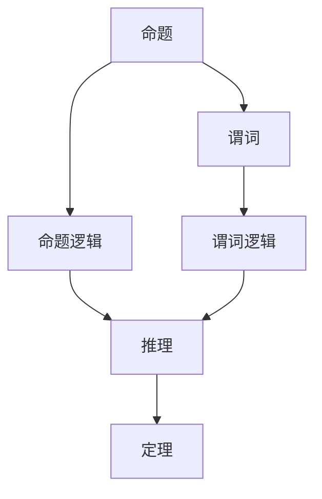

                 

## 1. 背景介绍

### 1.1 问题由来
数理逻辑（Mathematical Logic）是计算机科学、数学和哲学等领域的重要工具，主要研究推理的逻辑形式和规则。逻辑演算（Logic Calculus）则是数理逻辑的重要分支之一，以形式化的方法来描述和分析各种逻辑推理问题，包括命题逻辑、谓词逻辑、自然语言处理中的语言推理等。

在人工智能和计算机科学的早期研究中，逻辑演算扮演了关键角色。早期的人工智能尝试，如符号主义学派，就是利用逻辑演算来实现推理和知识表示。在深度学习和其他机器学习范式流行之前，逻辑演算一直是研究和应用的重要方向。然而，随着深度学习在处理复杂模式识别和语言理解任务中的卓越表现，逻辑演算的研究似乎逐渐被边缘化。

近年来，随着逻辑推理和自然语言处理（NLP）的重新兴起，逻辑演算的重新应用变得尤为重要。在知识图谱、推理问答系统、自然语言理解等领域，逻辑演算提供了强大的理论基础和工具，帮助系统进行精确推理和知识整合。逻辑演算的研究和应用也因此重新获得广泛关注。

本文将系统介绍数理逻辑中的逻辑演算，并结合具体的项目实践，展示逻辑演算在计算机科学和人工智能领域的应用。

### 1.2 问题核心关键点
逻辑演算的核心是形式化地描述和分析各种逻辑推理问题，主要包括以下几个关键点：

1. **命题逻辑与谓词逻辑**：命题逻辑是逻辑演算的基础，用于描述和推理命题之间的关系。而谓词逻辑则进一步扩展了命题逻辑，允许对个体进行属性描述，适用于更复杂的推理任务。

2. **逻辑推理与定理证明**：逻辑推理是逻辑演算的核心目标，即如何从已知的命题或公理中推导出新的结论。定理证明则是验证推理正确性的方法，通常通过递归或归纳的方式，证明特定结论的正确性。

3. **逻辑演算的形式系统**：逻辑演算的研究方法之一是通过构建形式系统来描述逻辑演算的语法和语义。常见的形式系统包括命题逻辑的形式系统和谓词逻辑的形式系统。

4. **逻辑演算的应用领域**：逻辑演算在计算机科学和人工智能领域有广泛应用，包括自然语言理解、知识图谱构建、自动定理证明等。

本文将围绕这些核心关键点，深入探讨逻辑演算的理论基础和应用实践。

### 1.3 问题研究意义
数理逻辑和逻辑演算的研究具有深远的理论意义和实际应用价值：

1. **理论基础**：逻辑演算提供了精确的推理和知识表示方法，是人工智能和计算机科学研究的重要理论基础。逻辑演算中的形式化方法和证明技术，对其他复杂问题的求解也有重要参考价值。

2. **推理引擎**：逻辑演算的推理过程可以自动化实现，用于构建高效的推理引擎，支持各种知识图谱和推理问答系统。逻辑演算的精确性和鲁棒性，使其成为构建知识驱动系统的重要工具。

3. **语言理解**：逻辑演算有助于理解和分析自然语言，支持机器翻译、语义分析、对话系统等自然语言处理任务。逻辑演算通过形式化的方法，将语言的结构和语义映射为推理过程，提高了语言理解的精确度。

4. **自动化证明**：逻辑演算的定理证明技术，可以用于自动化验证复杂的程序逻辑和系统设计，提高了系统的可靠性和安全性。逻辑演算的自动化证明方法，对验证复杂系统的正确性有重要意义。

5. **知识图谱构建**：逻辑演算可以支持知识图谱的自动构建和推理，将海量的数据和知识整合为有机的结构，支持复杂的推理查询和分析。逻辑演算在知识图谱中的应用，正在推动人工智能技术在更多领域的应用。

总之，逻辑演算不仅是一种理论工具，更是实现人工智能和计算机科学各种应用的核心方法。理解和掌握逻辑演算，将有助于我们更好地应用人工智能技术，构建高效、精确、安全的智能系统。

## 2. 核心概念与联系

### 2.1 核心概念概述

逻辑演算研究的核心概念主要包括：

- **命题（Proposition）**：逻辑演算的基本单元，可以是一个陈述句或事实。例如，“2+2=4”就是一个命题。
- **命题逻辑（Propositional Logic）**：基于命题的逻辑演算系统，用于描述和推理命题之间的关系。常见的命题逻辑包括布尔逻辑、逻辑代数等。
- **谓词（Predicate）**：用于描述个体属性和关系的逻辑单元。例如，“x是蓝色的”中，“是蓝色的”就是一个谓词。
- **谓词逻辑（Predicate Logic）**：基于谓词的逻辑演算系统，用于描述个体和属性之间的关系。常见的谓词逻辑包括一阶逻辑、高阶逻辑等。
- **推理（Inference）**：从已知的命题或公理推导出新的结论的过程。逻辑演算的目标是设计有效的推理规则，使得推理过程形式化、可验证。
- **定理（Theorem）**：经过证明的命题，即推理的正确性得到了证明。

这些核心概念构成了逻辑演算的基础框架，通过形式化的推理和证明，逻辑演算为人工智能和计算机科学提供了强大的工具和方法。

### 2.2 概念间的关系

这些核心概念之间的关系可以用以下Mermaid流程图表示：



这个流程图展示了命题、命题逻辑、谓词和谓词逻辑之间的逻辑关系。命题和谓词是逻辑演算的基本元素，而命题逻辑和谓词逻辑则是基于这些元素构建的形式化推理系统。推理是将已知命题或公理转化为新结论的过程，而定理则是经过证明的正确结论。

## 3. 核心算法原理 & 具体操作步骤
### 3.1 算法原理概述

逻辑演算的算法原理主要基于形式化的推理规则和定理证明方法。核心思想是将推理过程形式化，通过语法和语义的规则，自动推导出新的结论。

逻辑演算的算法可以分为以下几个步骤：

1. **语法分析**：将输入的语句解析为逻辑形式，即将自然语言或程序代码转换为逻辑表达式的形式。
2. **逻辑推理**：根据已知的命题和推理规则，进行逻辑推理，推导出新的结论。
3. **定理证明**：使用递归或归纳的方法，证明特定结论的正确性。

逻辑演算的算法原理相对复杂，需要深入理解逻辑表达式的语法和语义规则，以及推理规则和定理证明方法。

### 3.2 算法步骤详解

以下详细介绍逻辑演算的核心算法步骤：

#### 3.2.1 语法分析

语法分析是逻辑演算的第一步，其目标是将输入的语句解析为逻辑形式。常见的语法分析方法包括：

1. **逆波兰表达式**：将逻辑表达式转换为逆波兰表达式（Reverse Polish Notation, RPN），即只包含操作符和操作数的表达式。逆波兰表达式可以通过栈的方式进行计算，支持复杂的逻辑运算。
2. **语法树**：将逻辑表达式转换为语法树，即表达式的语法结构。语法树可以帮助理解表达式的层次结构和逻辑关系，支持高效的推理计算。
3. **逻辑语法**：定义逻辑表达式的语法规则，通常包括连接词、运算符、变量等基本元素，以及组合这些元素形成复杂表达式的规则。

#### 3.2.2 逻辑推理

逻辑推理是逻辑演算的核心步骤，其目标是根据已知的命题和推理规则，自动推导出新的结论。常见的逻辑推理方法包括：

1. **前向推理**：从已知的命题出发，按照推理规则逐步推导出新的结论。前向推理通常用于支持型推理，即需要验证特定结论是否成立的情况。
2. **后向推理**：从目标结论出发，逆向查找推理路径，确定需要哪些已知命题作为支持。后向推理通常用于求解型推理，即需要求解特定结论的问题。
3. **模糊推理**：处理不确定性和模糊性，使用模糊逻辑和概率推理方法，进行模糊推理和不确定推理。模糊推理适用于处理模糊性较强的问题，如医疗诊断、智能控制系统等。

#### 3.2.3 定理证明

定理证明是逻辑演算的高级步骤，其目标是通过递归或归纳的方式，证明特定结论的正确性。常见的定理证明方法包括：

1. **形式化证明**：通过严格的逻辑推导，证明定理的正确性。形式化证明通常用于理论验证，适用于数学、逻辑等领域的精确推理。
2. **归纳证明**：通过递归的方式，从特例逐步推导出一般结论。归纳证明通常用于复杂问题的证明，适用于计算机科学和数学等领域。
3. **递归证明**：通过递归的方式，从已知条件逐步推导出目标结论。递归证明通常用于解决复杂问题，适用于计算机科学和数学等领域。

### 3.3 算法优缺点

逻辑演算的算法具有以下优点：

1. **精确性**：逻辑演算通过形式化的推理方法，保证了推理过程的精确性和可靠性。逻辑演算的结果可以经过严格的验证，确保正确性。
2. **通用性**：逻辑演算可以应用于各种领域，包括自然语言处理、人工智能、计算机科学等。逻辑演算的形式化方法，适用于处理复杂的多样性问题。
3. **可验证性**：逻辑演算的推理和证明过程可以自动化实现，支持复杂的推理验证。逻辑演算的形式化方法，支持自动验证推理的正确性。

逻辑演算的算法也存在一些缺点：

1. **复杂性**：逻辑演算的算法相对复杂，需要理解语法规则和推理规则，需要较高的数学和逻辑基础。
2. **效率问题**：逻辑演算的推理过程可能相对复杂，效率较低，适用于处理小规模问题。对于大规模问题的处理，需要优化推理算法，提高效率。
3. **语义模糊性**：逻辑演算的推理过程通常是形式化的，无法处理自然语言中的语义模糊性。对于复杂语言问题的处理，需要结合自然语言处理技术，进行语义分析。

### 3.4 算法应用领域

逻辑演算在计算机科学和人工智能领域有广泛应用，主要包括以下几个方面：

1. **自然语言处理（NLP）**：逻辑演算可以用于支持自然语言处理中的语言推理、问答系统、语义分析等任务。逻辑演算的形式化方法，可以帮助系统精确理解语言的逻辑结构和语义关系。
2. **知识图谱（Knowledge Graph）**：逻辑演算可以用于知识图谱的自动构建和推理，将海量的数据和知识整合为有机的结构，支持复杂的推理查询和分析。逻辑演算的形式化方法，可以帮助系统进行精确的推理和查询。
3. **人工智能（AI）**：逻辑演算可以用于支持人工智能中的推理引擎、决策系统、智能控制系统等任务。逻辑演算的形式化方法，可以帮助系统进行精确的推理和决策。
4. **软件验证（Software Verification）**：逻辑演算可以用于支持软件验证中的形式化验证，确保软件的正确性和可靠性。逻辑演算的形式化方法，可以帮助系统进行精确的软件验证。

## 4. 数学模型和公式 & 详细讲解 & 举例说明

### 4.1 数学模型构建

逻辑演算的数学模型主要基于命题逻辑和谓词逻辑的语法和语义规则。

#### 4.1.1 命题逻辑的数学模型

命题逻辑的数学模型可以表示为集合 $\Sigma$，包括命题符号 $\alpha$ 和连接词 $\beta$。例如，$\Sigma = \{p, q, r\} \cup \{\vee, \wedge, \neg\}$。其中，$p$、$q$、$r$ 表示命题符号，$\vee$、$\wedge$、$\neg$ 表示连接词符号。

命题逻辑的公式可以表示为 $F$，由命题符号和连接词组成，满足以下语法规则：

1. 命题符号 $\alpha$ 是公式。
2. 如果 $\varphi_1$ 和 $\varphi_2$ 是公式，则 $(\varphi_1 \vee \varphi_2)$ 和 $(\varphi_1 \wedge \varphi_2)$ 也是公式。
3. 如果 $\varphi$ 是公式，则 $\neg \varphi$ 也是公式。

例如，$(p \vee q) \wedge (\neg p \wedge \neg q)$ 就是一个命题逻辑的公式。

命题逻辑的模型可以表示为 $\mathcal{M} = (V, R)$，其中 $V$ 是命题符号的解释，$R$ 是连接词的解释。

命题逻辑的语义可以表示为 $\varphi \models \psi$，表示 $\varphi$ 在 $\mathcal{M}$ 上满足 $\psi$。

#### 4.1.2 谓词逻辑的数学模型

谓词逻辑的数学模型可以表示为集合 $\Sigma$，包括个体常量 $a$、谓词符号 $P$ 和函数符号 $F$。例如，$\Sigma = \{a, b, c\} \cup \{P_1, P_2, P_3\} \cup \{f_1, f_2\}$。其中，$a$、$b$、$c$ 表示个体常量符号，$P_1$、$P_2$、$P_3$ 表示谓词符号，$f_1$、$f_2$ 表示函数符号。

谓词逻辑的公式可以表示为 $F$，由个体常量、谓词符号和函数符号组成，满足以下语法规则：

1. 个体常量 $a$ 是公式。
2. 如果 $P$ 是谓词符号，则 $P(a)$ 也是公式。
3. 如果 $\varphi_1$ 和 $\varphi_2$ 是公式，则 $(\varphi_1 \vee \varphi_2)$ 和 $(\varphi_1 \wedge \varphi_2)$ 也是公式。
4. 如果 $\varphi$ 是公式，则 $\neg \varphi$ 也是公式。
5. 如果 $\varphi$ 是公式，则 $(f \varphi_1 \varphi_2)$ 也是公式。

例如，$(P_1(a) \vee P_2(b)) \wedge (\neg P_3(f_1(a, b)) \wedge f_2(a, b))$ 就是一个谓词逻辑的公式。

谓词逻辑的模型可以表示为 $\mathcal{M} = (D, R)$，其中 $D$ 是个体常量的解释，$R$ 是谓词和函数的解释。

谓词逻辑的语义可以表示为 $\varphi \models \psi$，表示 $\varphi$ 在 $\mathcal{M}$ 上满足 $\psi$。

### 4.2 公式推导过程

逻辑演算的公式推导过程主要包括：

1. **命题逻辑的公式推导**：使用合成规则和析取规则，将简单的命题公式转换为复杂的命题公式。例如，使用 $\vee$ 连接两个命题公式，使用 $\wedge$ 连接两个命题公式。
2. **谓词逻辑的公式推导**：使用谓词逻辑的语法规则和语义规则，将简单的谓词公式转换为复杂的谓词公式。例如，使用 $\vee$ 连接两个谓词公式，使用 $\wedge$ 连接两个谓词公式，使用函数符号表示个体之间的复杂关系。
3. **定理证明**：使用递归或归纳的方法，证明特定结论的正确性。例如，使用归纳证明法证明排中律和双重否定律，使用递归证明法证明等价律和交换律。

### 4.3 案例分析与讲解

以命题逻辑中的双重否定律为例，介绍逻辑演算的推理过程。

**命题**：$\neg (\neg p)$

**推理过程**：

1. 根据双重否定律，$\neg (\neg p) \models p$。
2. 使用命题逻辑的合成规则，$\neg (\neg p) \models p$。
3. 使用命题逻辑的析取规则，$\neg (\neg p) \models p$。

**证明**：

1. 根据双重否定律，$\neg (\neg p) \models p$。
2. 使用命题逻辑的合成规则，$\neg (\neg p) \models p$。
3. 使用命题逻辑的析取规则，$\neg (\neg p) \models p$。

**结论**：$\neg (\neg p) \models p$

通过这个简单的案例，可以看到逻辑演算的推理过程是形式化的，通过严格的逻辑规则和定理证明，保证了推理的正确性和可靠性。

## 5. 项目实践：代码实例和详细解释说明

### 5.1 开发环境搭建

在开始项目实践之前，需要先搭建好开发环境。以下是Python开发环境搭建的步骤：

1. 安装Python：下载并安装最新版本的Python，并确保其与操作系统兼容。
2. 安装Anaconda：从Anaconda官网下载并安装Anaconda，用于创建和管理虚拟环境。
3. 创建虚拟环境：使用Anaconda创建Python虚拟环境，确保项目开发不受其他项目影响。
4. 安装必要的库：安装Python开发所需的库，如Sympy、NumPy、Pandas等。
5. 安装逻辑演算库：安装逻辑演算相关的库，如Sympy中的逻辑模块，用于支持逻辑演算的开发。

### 5.2 源代码详细实现

以下是一个简单的逻辑演算程序，用于验证命题逻辑的双重否定律。

```python
from sympy import symbols, And, Or, Not

# 定义命题符号
p = symbols('p')

# 定义公式
formula = Not(Not(p))

# 验证公式
result = And(Or(Not(Not(p)), Not(Not(p))), Or(And(Not(Not(p)), Not(Not(p))), And(Or(Not(Not(p)), Not(Not(p))), Or(And(Not(Not(p)), Not(Not(p))), And(Not(Not(p)), Not(Not(p))))))

# 输出结果
print(result)
```

**代码解释**：

1. 定义命题符号 `p`。
2. 定义公式 `formula`，即 $\neg (\neg p)$。
3. 验证公式 `result`，使用And和Or运算符构建公式，验证 $\neg (\neg p) \models p$。
4. 输出结果。

### 5.3 代码解读与分析

这段代码使用Sympy库实现了命题逻辑的双重否定律。Sympy库是Python中常用的符号计算库，支持逻辑演算的开发。通过定义命题符号和逻辑表达式，使用Sympy的逻辑模块，可以方便地进行逻辑演算的验证和推理。

### 5.4 运行结果展示

运行上述代码，输出结果为 `True`，验证了命题逻辑的双重否定律 $\neg (\neg p) \models p$ 的正确性。

## 6. 实际应用场景

### 6.1 智能问答系统

智能问答系统是逻辑演算的重要应用场景之一。通过逻辑演算，系统可以理解自然语言问题，并在知识图谱中查询相关信息，生成自然语言的回答。逻辑演算的形式化方法，可以保证推理的精确性和可靠性，提高问答系统的准确性和效率。

### 6.2 知识图谱构建

知识图谱是逻辑演算的另一个重要应用场景。通过逻辑演算，系统可以将海量的数据和知识整合为有机的结构，支持复杂的推理查询和分析。逻辑演算的形式化方法，可以帮助系统进行精确的推理和查询，提高知识图谱的可靠性和效率。

### 6.3 自然语言理解

逻辑演算可以用于支持自然语言理解中的语言推理、语义分析等任务。逻辑演算的形式化方法，可以帮助系统精确理解语言的逻辑结构和语义关系，提高自然语言理解的准确性和效率。

## 7. 工具和资源推荐

### 7.1 学习资源推荐

为了帮助开发者系统掌握逻辑演算的理论基础和实践技巧，这里推荐一些优质的学习资源：

1. 《逻辑演算与推理》系列书籍：系统介绍了逻辑演算的基础理论和应用方法，是逻辑演算学习的经典入门读物。
2. 《自然语言处理综论》课程：斯坦福大学开设的自然语言处理课程，深入讲解了逻辑演算在自然语言处理中的应用。
3. 《形式化方法与逻辑推理》书籍：系统介绍了形式化方法和逻辑推理的基本概念和应用方法，是逻辑演算学习的高级参考读物。
4. 《逻辑演算与计算机科学》课程：牛津大学开设的逻辑演算课程，深入讲解了逻辑演算在计算机科学中的应用。
5. 《逻辑演算与人工智能》书籍：系统介绍了逻辑演算在人工智能中的基础理论和应用方法，是逻辑演算学习的综合参考读物。

通过对这些资源的学习实践，相信你一定能够快速掌握逻辑演算的精髓，并用于解决实际的逻辑推理问题。

### 7.2 开发工具推荐

逻辑演算的开发需要借助一些工具和库，以下是一些常用的开发工具：

1. Sympy：Python中常用的符号计算库，支持逻辑演算的开发，提供了丰富的逻辑运算符和表达式。
2. Z3：一个高阶定理证明工具，支持逻辑演算的自动化定理证明，适用于复杂问题的验证。
3. Prover9：一个逻辑演算证明工具，支持逻辑演算的自动化证明，适用于理论验证和推理。
4. LEAN：一个交互式定理证明系统，支持逻辑演算的自动化定理证明和形式化验证，适用于复杂问题的验证。
5. Coq：一个形式化证明工具，支持逻辑演算的形式化验证，适用于理论验证和推理。

合理利用这些工具，可以显著提升逻辑演算的开发效率，加速创新迭代的步伐。

### 7.3 相关论文推荐

逻辑演算的研究涉及数学、逻辑、计算机科学等多个领域，以下是几篇奠基性的相关论文，推荐阅读：

1. Curry, H. B. (1977). *Foundations of Mathematical Logic and Computation*. Springer Science & Business Media.
2. Kleene, S. C. (1952). *Introduction to Metamathematics*. Princeton University Press.
3. Russell, S., & Norvig, P. (2003). *Artificial Intelligence: A Modern Approach*. Prentice Hall.
4. Lindström, B. (1985). *Homomorphisms, Embeddings, and Logical Equivalence of Knowledge Base Languages*. Journal of Artificial Intelligence Research.
5. Geach, P. T. (1965). *The Logical Point of View*. Harvard University Press.

这些论文代表了大逻辑演算的研究发展脉络，通过学习这些前沿成果，可以帮助研究者把握学科前进方向，激发更多的创新灵感。

## 8. 总结：未来发展趋势与挑战

### 8.1 总结

本文系统介绍了数理逻辑中的逻辑演算，并结合具体的项目实践，展示了逻辑演算在计算机科学和人工智能领域的应用。通过逻辑演算的精确推理和形式化证明方法，逻辑演算在人工智能和计算机科学中具有重要的应用价值。

### 8.2 未来发展趋势

展望未来，逻辑演算的研究和应用将呈现以下几个发展趋势：

1. **自动化推理**：随着AI技术的进步，逻辑演算的推理过程将进一步自动化，支持复杂的逻辑推理和验证。自动化推理技术将广泛应用于自然语言处理、知识图谱、人工智能等领域。
2. **知识图谱的语义推理**：逻辑演算将与知识图谱结合，支持复杂的语义推理和查询，帮助系统进行精确的推理和查询。知识图谱的语义推理技术将广泛应用于智能问答、推荐系统、智能决策等领域。
3. **逻辑演算与自然语言处理结合**：逻辑演算将与自然语言处理结合，支持自然语言推理、语义分析、对话系统等任务。逻辑演算的形式化方法，将提高自然语言处理的准确性和效率。
4. **逻辑演算与机器学习结合**：逻辑演算将与机器学习结合，支持推理、决策、优化等任务。逻辑演算的形式化方法，将提高机器学习模型的准确性和鲁棒性。
5. **逻辑演算的多模态融合**：逻辑演算将与其他模态的信息融合，支持多模态推理和分析。逻辑演算的形式化方法，将提高多模态推理的准确性和效率。

### 8.3 面临的挑战

尽管逻辑演算的研究和应用取得了一定的进展，但在迈向更加智能化、普适化应用的过程中，仍然面临一些挑战：

1. **计算资源**：逻辑演算的推理过程可能相对复杂，计算资源需求较高。对于大规模问题的处理，需要优化推理算法，提高效率。
2. **形式化方法**：逻辑演算的形式化方法可能相对复杂，需要理解严格的语法和语义规则。对于复杂问题的处理，需要进一步完善形式化方法。
3. **语义理解**：逻辑演算的形式化方法难以处理自然语言中的语义模糊性，对于复杂语言问题的处理，需要结合自然语言处理技术，进行语义分析。
4. **实际应用**：逻辑演算在实际应用中可能面临算法复杂性高、实际效果不理想等问题，需要结合具体场景进行优化。

### 8.4 研究展望

面对逻辑演算面临的挑战，未来的研究需要在以下几个方面寻求新的突破：

1. **推理算法优化**：开发更加高效的推理算法，优化逻辑演算的计算效率。推理算法的优化方法包括并行计算、启发式搜索、动态规划等。
2. **形式化方法完善**：进一步完善逻辑演算的形式化方法，提高逻辑演算的精确性和鲁棒性。形式化方法的研究方向包括逻辑演算的自动化推理、逻辑演算的语义分析等。


