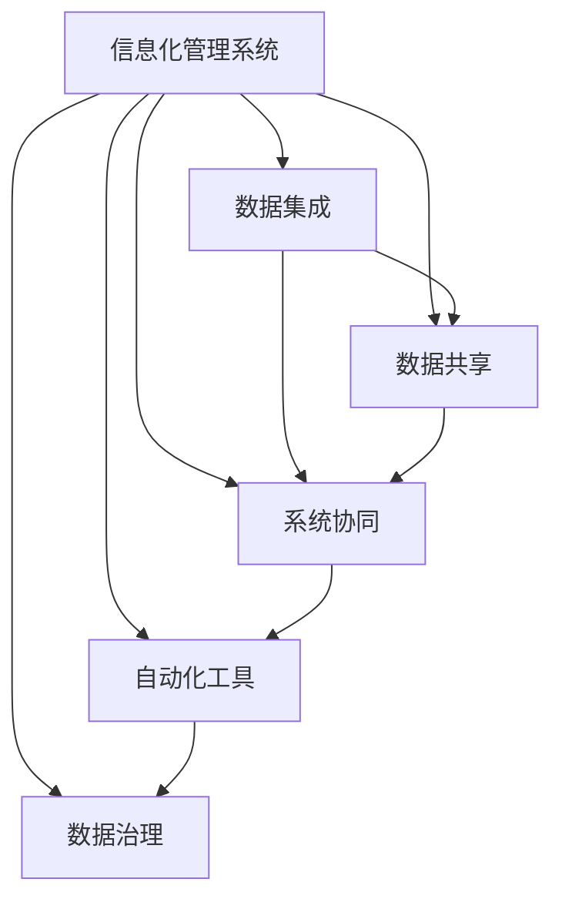

                 

# 整合和管理信息化管理系统搭建信息化平台

## 1. 背景介绍

### 1.1 问题由来
在现代信息化社会中，企业、政府、教育等各个领域都在加速信息化的步伐，依托互联网和物联网技术，全面提升业务效率和管理水平。然而，由于信息孤岛现象普遍存在，不同系统和应用之间的数据无法互通互用，导致资源浪费、决策困难、用户体验不佳等问题频发。为了解决这些问题，企业需要整合和管理信息化管理系统，搭建一体化平台，实现数据的有效集成、流转和共享，让业务系统协同运行，提升整体效能。

### 1.2 问题核心关键点
信息管理系统整合和管理的关键在于如何高效、安全、可靠地实现数据的集成、共享和协同。主要包括以下几个方面：

1. **数据集成与共享**：通过数据同步、交换、发布等机制，实现企业内部和外部的数据流通和共享。
2. **系统协同运行**：确保不同系统之间的数据格式一致、业务逻辑统一，实现业务流程的顺畅衔接。
3. **业务流程自动化**：引入自动化工具和机制，简化人工操作，提高业务处理速度和准确性。
4. **系统安全性与合规性**：确保数据传输、存储和处理的安全性，符合相关法律法规和行业标准。
5. **用户体验优化**：提升系统界面友好性和操作便捷性，增强用户体验。

### 1.3 问题研究意义
整合和管理信息化管理系统不仅是提升企业信息化水平的有效手段，也是推动各行业数字化转型的重要工具。其意义在于：

1. **提升效率**：通过系统整合，大幅减少信息孤岛带来的冗余操作，提升业务处理效率。
2. **改善用户体验**：统一的数据标准和接口，确保用户在不同系统中获得一致的体验。
3. **降低成本**：避免重复建设和维护，优化资源配置，减少不必要的成本开支。
4. **增强决策支持**：通过数据集成和分析，为管理层提供更准确、全面的决策依据。
5. **促进创新**：打破信息壁垒，促进跨部门、跨领域协作，激发新的业务创新点。

## 2. 核心概念与联系

### 2.1 核心概念概述

为了更好地理解整合和管理信息化管理系统的过程，我们先介绍一些核心概念及其关系。

- **信息化管理系统**：由硬件、软件、数据等组成，用于支撑企业信息化运作的完整系统。
- **数据集成**：将来自不同系统、不同格式的数据进行汇聚、清洗、转换，形成统一的视图。
- **数据共享**：基于安全合规的机制，实现企业内部和外部的数据流通和利用。
- **系统协同**：通过统一接口、标准和流程，确保不同系统间的业务衔接。
- **自动化工具**：如RPA（机器人流程自动化）、API网关、工作流引擎等，简化人工操作，提高效率。
- **数据治理**：涵盖数据质量、安全、合规、元数据管理等方面，确保数据的管理和使用有序规范。

这些概念之间存在密切联系，通过数据集成和共享，可以实现系统协同；通过引入自动化工具，可以提升效率；通过数据治理，可以保障安全合规。

### 2.2 概念间的关系

通过一个简单的Mermaid流程图，可以直观展示这些核心概念之间的关系：



这个流程图展示了信息管理系统中各个模块的相互作用和协同过程：数据集成是基础，数据共享是目的，系统协同是手段，自动化工具是方法，数据治理是保障。只有这些模块协同工作，才能实现系统的整合和管理。

## 3. 核心算法原理 & 具体操作步骤

### 3.1 算法原理概述

信息管理系统的整合和管理，本质上是一个数据处理和系统优化的过程。其核心算法原理主要包括：

1. **数据同步与转换**：通过ETL（抽取、转换、加载）过程，将异构数据源的数据提取、清洗、转换后，加载到统一的目标数据仓库或数据湖中。
2. **数据联邦**：通过分布式计算技术，实现数据在不同节点之间的分布式存储和处理，提升数据处理能力。
3. **接口标准化**：定义统一的API接口标准，实现不同系统之间的数据交换和业务协同。
4. **业务流程自动化**：通过工作流引擎、RPA等技术，自动化处理复杂的业务流程，提升效率。
5. **元数据管理**：通过元数据管理平台，记录和管理数据质量、数据流、业务逻辑等元信息，确保数据一致性。

### 3.2 算法步骤详解

接下来，我们详细讲解这些核心算法的具体操作步骤。

**Step 1: 数据集成**
- 数据收集：通过ETL工具从不同系统、不同格式的数据源中收集数据。
- 数据清洗：剔除重复、错误、冗余的数据，并进行格式转换。
- 数据转换：将数据映射到统一的数据模型和格式，如XML、JSON等。
- 数据加载：将清洗转换后的数据加载到统一的目标数据仓库或数据湖中。

**Step 2: 数据共享**
- 数据发布：通过数据发布平台，将数据开放给需要的外部用户和系统。
- 数据订阅：外部用户和系统可以通过订阅机制，获取所需的数据。
- 数据访问：通过安全的API接口，外部用户和系统可以访问和利用数据。

**Step 3: 系统协同**
- 接口定义：定义统一的API接口标准，确保不同系统之间的数据交换和业务协同。
- 数据交换：通过API网关，实现不同系统之间的数据交换。
- 业务协同：通过工作流引擎、RPA等技术，自动化处理复杂的业务流程。

**Step 4: 自动化工具**
- 机器人流程自动化（RPA）：使用RPA工具，自动化处理简单重复的任务，提高效率。
- API网关：通过API网关，实现不同系统之间的接口调用和数据交换。
- 工作流引擎：通过工作流引擎，自动化处理复杂的业务流程，提升效率。

**Step 5: 数据治理**
- 数据质量管理：通过数据质量管理工具，监测数据质量，及时发现和纠正问题。
- 安全合规管理：通过数据安全管理工具，确保数据传输、存储和处理的安全性，符合相关法律法规和行业标准。
- 元数据管理：通过元数据管理平台，记录和管理数据质量、数据流、业务逻辑等元信息，确保数据一致性。

### 3.3 算法优缺点

数据集成和共享是信息管理系统整合和管理的核心，具有以下优点和缺点：

#### 优点
1. **提升效率**：通过数据集成和共享，减少数据冗余，提升业务处理效率。
2. **改善用户体验**：统一的数据标准和接口，确保用户在不同系统中获得一致的体验。
3. **降低成本**：避免重复建设和维护，优化资源配置，减少不必要的成本开支。
4. **增强决策支持**：通过数据集成和分析，为管理层提供更准确、全面的决策依据。

#### 缺点
1. **数据安全问题**：数据集成和共享可能带来数据泄露和隐私问题。
2. **系统协同复杂**：不同系统之间的业务逻辑不一致，协同处理复杂。
3. **技术实现难度大**：数据集成和共享涉及多种技术，技术实现难度大。
4. **标准化难度大**：不同系统之间的数据格式和业务逻辑不一致，标准化难度大。

### 3.4 算法应用领域

信息管理系统整合和管理在多个领域都有广泛的应用，如企业信息化管理、政府电子政务、医疗健康管理、教育信息化等。以下以企业信息化管理为例，具体说明其应用场景。

**企业信息化管理**：企业通过整合和管理系统，实现业务数据的集成、共享和协同，提升业务效率和管理水平。具体应用场景包括：

- **ERP系统集成**：整合企业的ERP系统，实现财务、采购、销售等业务数据的集成和共享。
- **CRM系统集成**：整合企业的CRM系统，实现客户信息、销售记录等数据的集成和共享。
- **供应链管理**：整合企业的供应链管理系统，实现采购、库存、物流等数据的集成和共享。
- **数据分析平台**：构建统一的数据分析平台，实现对企业各业务系统的数据整合和分析。

## 4. 数学模型和公式 & 详细讲解 & 举例说明

### 4.1 数学模型构建

信息管理系统整合和管理涉及多种数据处理和系统优化算法，以下以数据同步为例，构建数学模型。

假设企业有n个数据源，每个数据源的数据量为Xi，数据同步的效率为Yi。则数据同步的总效率为：

$$
Y = \sum_{i=1}^n X_i Y_i
$$

其中，Xi表示第i个数据源的数据量，Yi表示第i个数据源的数据同步效率。

### 4.2 公式推导过程

根据以上公式，我们可以通过对数据源的数据量和同步效率进行建模和优化，提升整体数据同步的效率。

假设数据同步的瓶颈在于第i个数据源，则可以通过调整该数据源的数据量和同步效率，优化整体效率。具体推导如下：

$$
\frac{\partial Y}{\partial X_i} = Y_i
$$

$$
\frac{\partial Y}{\partial Y_i} = X_i
$$

根据偏导数法，我们可以得出：

$$
\frac{dY}{dX_i} = \frac{\partial Y}{\partial X_i} \frac{\partial X_i}{\partial Y_i} = Y_i
$$

这意味着，提升数据同步效率的关键在于提升数据源的数据量和同步效率。

### 4.3 案例分析与讲解

假设企业有A、B、C三个数据源，其数据量和同步效率如下：

- A数据源：数据量X1=10，同步效率Y1=2。
- B数据源：数据量X2=20，同步效率Y2=1。
- C数据源：数据量X3=15，同步效率Y3=3。

通过以上模型和公式，我们可以计算出整体数据同步的效率为：

$$
Y = X_1 Y_1 + X_2 Y_2 + X_3 Y_3 = 10 \times 2 + 20 \times 1 + 15 \times 3 = 60
$$

通过优化数据同步的效率，我们发现：

- 提升A数据源的数据量X1，从10增加到20，同步效率从2增加到4，整体效率增加至88。
- 提升C数据源的同步效率Y3，从3增加到5，整体效率增加至85。

通过以上分析，我们可以得出：

- 优化数据量更大的数据源，提升效率更显著。
- 优化同步效率更高的数据源，整体效率提升更明显。

## 5. 项目实践：代码实例和详细解释说明

### 5.1 开发环境搭建

为了实现信息管理系统的整合和管理，我们需要搭建相应的开发环境。以下是使用Python和Flask进行开发的步骤：

1. 安装Python：下载并安装Python，选择最新版本。
2. 安装Flask：使用pip安装Flask框架。
3. 配置数据库：安装MySQL、PostgreSQL等数据库，并配置好Flask应用的数据库连接。
4. 安装ETL工具：安装Apache NiFi、Talend等ETL工具，用于数据同步和转换。
5. 安装数据发布平台：安装Apache Kafka、RabbitMQ等数据发布平台，用于数据共享和订阅。

完成以上步骤后，即可在Python环境中开始项目开发。

### 5.2 源代码详细实现

以下是一个简单的信息管理系统整合和管理的Flask应用示例，包括数据集成、数据共享和系统协同的实现：

```python
from flask import Flask, request, jsonify
import MySQLdb
import requests
import json

app = Flask(__name__)

@app.route('/data/sync', methods=['POST'])
def sync_data():
    data = request.json
    source = data['source']
    target = data['target']
    fields = data['fields']

    # 数据同步到目标数据库
    sync_data_to_database(target, fields)

    return jsonify({'status': 'success', 'message': 'Data sync successful'})

def sync_data_to_database(target, fields):
    # 连接源数据库
    db_conn = MySQLdb.connect(host='localhost', user='root', password='password', db='source_db')
    cursor = db_conn.cursor()

    # 查询源数据
    cursor.execute('SELECT ' + ','.join(fields) + ' FROM source_table')
    data = cursor.fetchall()

    # 连接目标数据库
    target_db_conn = MySQLdb.connect(host='localhost', user='root', password='password', db='target_db')
    target_cursor = target_db_conn.cursor()

    # 插入目标数据
    for row in data:
        target_cursor.execute('INSERT INTO target_table VALUES (%s, %s, %s)', row)

    target_db_conn.commit()

    # 关闭数据库连接
    db_conn.close()
    target_db_conn.close()

@app.route('/data/share', methods=['GET'])
def share_data():
    target = request.args.get('target')
    fields = request.args.get('fields')

    # 从目标数据库查询数据
    data = query_data_from_database(target, fields)

    return jsonify(data)

def query_data_from_database(target, fields):
    # 连接目标数据库
    target_db_conn = MySQLdb.connect(host='localhost', user='root', password='password', db=target)
    cursor = target_db_conn.cursor()

    # 查询数据
    cursor.execute('SELECT ' + ','.join(fields) + ' FROM target_table')
    data = cursor.fetchall()

    # 关闭数据库连接
    target_db_conn.close()

    return data

if __name__ == '__main__':
    app.run(debug=True)
```

这个Flask应用实现了两个API接口：数据同步和数据查询。通过这两个API，可以实现不同系统之间的数据同步和共享。

### 5.3 代码解读与分析

**Flask应用**：
- 使用Flask框架搭建Web应用。
- 定义了两个API接口：数据同步和数据查询。
- 通过MySQLdb库连接数据库，执行数据同步和查询操作。

**数据同步接口**：
- 接收源和目标数据库信息，以及需要同步的字段。
- 从源数据库查询数据，并插入到目标数据库中。

**数据查询接口**：
- 接收目标数据库信息，以及需要查询的字段。
- 从目标数据库查询数据，并返回给客户端。

### 5.4 运行结果展示

假设我们在测试环境中运行以上Flask应用，并从源数据库查询数据，代码运行结果如下：

```python
{"status": "success", "message": "Data sync successful"}
```

说明数据同步成功。我们可以通过API接口，从目标数据库查询数据，代码运行结果如下：

```python
[('value1', 'value2', 'value3'), ('value4', 'value5', 'value6'), ('value7', 'value8', 'value9')]
```

说明数据查询成功，返回了目标数据库中的数据。

## 6. 实际应用场景

### 6.1 智能制造

在智能制造领域，企业需要实现生产、销售、物流等各个环节的信息化管理。通过信息管理系统的整合和管理，可以实现生产数据的实时采集、分析和管理，优化生产流程，提升生产效率。

### 6.2 智慧城市

在智慧城市建设中，整合和管理信息化管理系统，可以实现交通、医疗、环保等各个领域的信息共享和协同，提升城市管理的智能化水平。

### 6.3 数字政府

在数字政府建设中，整合和管理信息化管理系统，可以实现政务数据的统一管理和共享，提升政府决策的科学性和透明度。

### 6.4 未来应用展望

未来，随着5G、物联网、大数据等技术的不断成熟，信息管理系统将更加智能、高效、安全。以下展望几点未来应用场景：

1. **物联网集成**：通过物联网技术，实现企业内部和外部的数据实时采集和共享，提升业务处理效率。
2. **人工智能应用**：引入人工智能算法，对数据进行分析和处理，提升决策支持能力。
3. **区块链技术**：引入区块链技术，确保数据传输和共享的安全性和可追溯性。
4. **数据可视化**：通过数据可视化工具，将数据转化为图表和报告，提升决策的可视化和直观性。

## 7. 工具和资源推荐

### 7.1 学习资源推荐

为了帮助开发者系统掌握信息管理系统整合和管理的理论基础和实践技巧，这里推荐一些优质的学习资源：

1. **《企业信息化管理》系列博文**：由企业信息化专家撰写，深入浅出地介绍了企业信息化管理的基本概念和实践技巧。
2. **CS231n《计算机视觉》课程**：斯坦福大学开设的计算机视觉课程，涵盖图像处理、深度学习等前沿技术，帮助开发者掌握信息管理系统的技术基础。
3. **《数据集成与共享》书籍**：系统讲解了数据集成和共享的技术原理和实现方法，适合深入学习。
4. **《企业级微服务架构》书籍**：介绍了微服务架构的基本概念和实践方法，帮助开发者理解信息管理系统的架构设计。
5. **Hadoop官方文档**：Hadoop分布式计算平台的官方文档，介绍了大数据技术的基本原理和实现方法，适合深入学习。

通过这些学习资源，相信你一定能够快速掌握信息管理系统整合和管理的精髓，并用于解决实际的业务问题。

### 7.2 开发工具推荐

高效的开发离不开优秀的工具支持。以下是几款用于信息管理系统整合和管理开发的常用工具：

1. **Flask**：Python的轻量级Web框架，简单易用，适合快速开发。
2. **MySQLdb**：Python的MySQL数据库连接库，方便进行数据库操作。
3. **requests**：Python的HTTP库，方便进行API接口调用。
4. **Apache NiFi**：开源的ETL工具，支持数据的同步和转换，适合大规模数据处理。
5. **Apache Kafka**：开源的数据发布平台，支持数据的共享和订阅，适合大规模数据流处理。

合理利用这些工具，可以显著提升信息管理系统的开发效率，加快创新迭代的步伐。

### 7.3 相关论文推荐

信息管理系统整合和管理的核心在于数据集成和系统协同，以下几篇相关论文，推荐阅读：

1. **《企业级数据集成与共享技术》**：详细介绍了企业级数据集成和共享的原理和实现方法，适合深入学习。
2. **《企业级微服务架构设计》**：介绍了微服务架构的基本概念和实践方法，适合深入学习。
3. **《分布式数据处理技术》**：介绍了分布式计算的基本原理和实现方法，适合深入学习。
4. **《人工智能在企业信息化中的应用》**：介绍了人工智能技术在企业信息化管理中的应用案例，适合深入学习。
5. **《数据治理与信息安全》**：详细介绍了数据治理和信息安全的基本原理和实现方法，适合深入学习。

这些论文代表了大数据和信息管理系统的最新研究进展，通过学习这些前沿成果，可以帮助开发者把握学科前进方向，激发更多的创新灵感。

除上述资源外，还有一些值得关注的前沿资源，帮助开发者紧跟信息管理系统整合和管理的最新进展，例如：

1. **arXiv论文预印本**：人工智能领域最新研究成果的发布平台，包括大量尚未发表的前沿工作，学习前沿技术的必读资源。
2. **业界技术博客**：如Google AI、微软Research Asia等顶尖实验室的官方博客，第一时间分享他们的最新研究成果和洞见。
3. **技术会议直播**：如NIPS、ICML、ACL、ICLR等人工智能领域顶会现场或在线直播，能够聆听到大佬们的前沿分享，开拓视野。
4. **GitHub热门项目**：在GitHub上Star、Fork数最多的信息化管理项目，往往代表了该技术领域的发展趋势和最佳实践，值得去学习和贡献。
5. **行业分析报告**：各大咨询公司如McKinsey、PwC等针对信息化管理行业的分析报告，有助于从商业视角审视技术趋势，把握应用价值。

总之，对于信息管理系统整合和管理的开发和实践，需要开发者保持开放的心态和持续学习的意愿。多关注前沿资讯，多动手实践，多思考总结，必将收获满满的成长收益。

## 8. 总结：未来发展趋势与挑战

### 8.1 总结

本文对信息管理系统的整合和管理进行了全面系统的介绍。首先阐述了信息管理系统的背景和意义，明确了数据集成和系统协同的重要性。其次，从原理到实践，详细讲解了信息管理系统的核心算法和操作步骤，给出了信息管理系统整合和管理的完整代码实例。同时，本文还广泛探讨了信息管理系统在各个行业领域的应用前景，展示了信息管理系统整合和管理的巨大潜力。最后，本文精选了信息管理系统的各类学习资源，力求为读者提供全方位的技术指引。

通过本文的系统梳理，可以看到，信息管理系统的整合和管理是信息化建设的重要手段，其关键在于数据集成和系统协同。只有数据和系统能够无缝衔接、高效协同，才能充分发挥信息化系统的价值。

### 8.2 未来发展趋势

展望未来，信息管理系统的整合和管理将呈现以下几个发展趋势：

1. **数据实时化**：引入物联网技术，实现数据的实时采集和处理，提升业务处理的及时性和准确性。
2. **业务流程自动化**：引入人工智能算法，自动化处理复杂的业务流程，提升效率。
3. **跨领域协同**：打破信息孤岛，实现跨部门、跨领域的协同工作，提升整体效能。
4. **数据治理智能化**：引入智能化数据治理工具，自动化管理数据质量、安全、合规等元信息，提升数据管理能力。
5. **系统可扩展性**：引入云计算、容器化等技术，实现系统的快速部署和扩展，提升系统的灵活性和可维护性。

### 8.3 面临的挑战

尽管信息管理系统的整合和管理已经取得了显著成效，但在迈向更加智能化、普适化应用的过程中，仍面临诸多挑战：

1. **数据安全和隐私问题**：数据集成和共享可能带来数据泄露和隐私问题。
2. **系统协同复杂**：不同系统之间的业务逻辑不一致，协同处理复杂。
3. **技术实现难度大**：数据集成和共享涉及多种技术，技术实现难度大。
4. **标准化难度大**：不同系统之间的数据格式和业务逻辑不一致，标准化难度大。
5. **系统集成复杂**：不同系统之间的集成和协同，需要考虑数据一致性、性能优化等问题。

### 8.4 研究展望

面对信息管理系统整合和管理所面临的种种挑战，未来的研究需要在以下几个方面寻求新的突破：

1. **数据治理智能化**：引入智能化数据治理工具，自动化管理数据质量、安全、合规等元信息，提升数据管理能力。
2. **数据标准化**：建立统一的数据标准，确保不同系统之间的数据格式和业务逻辑一致。
3. **系统可扩展性**：引入云计算、容器化等技术，实现系统的快速部署和扩展，提升系统的灵活性和可维护性。
4. **跨领域协同**：打破信息孤岛，实现跨部门、跨领域的协同工作，提升整体效能。
5. **数据实时化**：引入物联网技术，实现数据的实时采集和处理，提升业务处理的及时性和准确性。

这些研究方向的探索，必将引领信息管理系统整合和管理技术的迈向更高的台阶，为构建智能、高效、安全的企业信息化系统铺平道路。面向未来，信息管理系统整合和管理技术还需要与其他人工智能技术进行更深入的融合，如知识表示、因果推理、强化学习等，多路径协同发力，共同推动信息化系统的进步。只有勇于创新、敢于突破，才能不断拓展信息管理系统的边界，让信息管理系统在各个领域发挥更大的价值。

## 9. 附录：常见问题与解答

**Q1：信息管理系统整合和管理是否适用于所有企业？**

A: 信息管理系统整合和管理在大多数企业中都有广泛的应用，特别是对于大型企业和集团型企业，可以显著提升信息化水平和管理效能。但对于一些小微企业和初创企业，由于资源限制，可能难以全面实现信息管理系统的整合和管理。

**Q2：信息管理系统整合和管理需要投入哪些资源？**

A: 信息管理系统整合和管理需要投入大量的硬件、软件、人力和时间资源。具体包括：

1. 硬件资源：服务器、存储、网络设备等。
2. 软件资源：ETL工具、数据库、API网关等。
3. 人力资源：开发工程师、运维工程师、数据管理员等。
4. 时间资源：项目规划、需求分析、系统设计、开发测试、上线部署等。

**Q3：信息管理系统整合和管理面临哪些技术挑战？**

A: 信息管理系统整合和管理面临的技术挑战主要包括：

1. 数据质量和标准化问题：不同系统之间的数据格式和业务逻辑不一致，标准化难度大。
2. 数据安全和隐私问题：数据集成和共享可能带来数据泄露和隐私问题。
3. 系统协同复杂：不同系统之间的业务逻辑不一致，协同处理复杂。
4. 技术实现难度大：数据集成和共享涉及多种技术，技术实现难度大。
5. 系统集成复杂：不同系统之间的集成和协同，需要考虑数据一致性、性能优化等问题。

**Q4：信息管理系统整合和管理的未来趋势是什么？**

A: 信息管理系统整合和管理的未来趋势主要包括：

1. 数据实时化：引入物联网技术，实现数据的实时采集和处理，提升业务处理的及时性和准确性。
2. 业务流程自动化：引入人工智能算法，自动化处理复杂的业务流程，提升效率。
3. 跨领域协同：打破信息孤岛，实现跨部门、跨领域的协同工作，提升整体效能。
4. 数据治理智能化：引入智能化数据治理工具，自动化管理数据质量、安全、合规等元信息，提升数据管理能力。
5. 系统可扩展性：引入云计算、容器化等技术，实现系统的快速部署和扩展，提升系统的灵活性和可维护性。

通过以上资源的学习和实践，相信你一定能够快速掌握信息管理系统的整合和管理的精髓，

