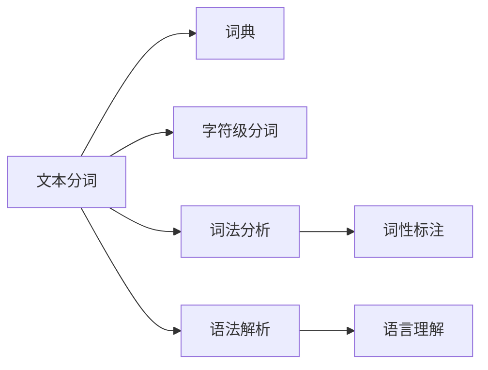

                 

# 文字语言的Token化过程

## 1. 背景介绍

### 1.1 问题由来
在自然语言处理（NLP）领域，处理文本数据的首要步骤通常是对文本进行分词（Tokenization）。分词是将文本分割成单独的单词、词组或字符序列的过程。分词的准确性和效率直接影响后续的文本分析和处理效果。目前，文本分词已经成为NLP领域中最基础且关键的技术之一。

### 1.2 问题核心关键点
分词算法通常根据语言特点和应用需求进行设计。核心问题包括：
- 如何在各种语言中高效地进行分词？
- 如何处理未登录词、多义词和歧义词？
- 如何平衡速度和准确性，满足不同的应用场景？

### 1.3 问题研究意义
分词技术的发展不仅提高了文本处理的自动化程度，也推动了自然语言理解和生成技术的进步。对于语音识别、机器翻译、信息检索、文本分类、情感分析等诸多NLP任务，分词都是不可或缺的前处理步骤。深入研究分词算法及其优化方法，对于提升NLP系统的性能和降低应用成本具有重要意义。

## 2. 核心概念与联系

### 2.1 核心概念概述

为更好地理解文本分词算法，本节将介绍几个关键概念：

- **分词（Tokenization）**：将文本分割成有意义的单词或词组序列的过程。
- **词典（Dictionary）**：包含大量已知单词的列表，用于分词时匹配未登录词和歧义词。
- **字符级分词（Character-Based Tokenization）**：以单个字符为单位进行分词，适用于中文等无空格分隔的文本。
- **词法分析（Lexical Analysis）**：识别和解析文本中的语法结构，常与分词结合使用。
- **词性标注（Part-of-Speech Tagging）**：为每个词标注其词性，辅助分词和后续的语言理解。

这些概念之间密切相关，共同构成了文本分词的基础框架。

### 2.2 概念间的关系

这些核心概念之间的关系可以通过以下Mermaid流程图来展示：



这个流程图展示了分词算法的主要组成部分及其相互关系：

1. **词典**：用于匹配已知单词和词组，是分词的基础。
2. **字符级分词**：以单个字符为单位进行分词，适用于中文等无空格分隔的文本。
3. **词法分析**：识别和解析文本中的语法结构，常与分词结合使用。
4. **词性标注**：为每个词标注其词性，辅助分词和后续的语言理解。
5. **语法解析**：在分词基础上，进一步解析文本的语法结构。
6. **语言理解**：利用词法分析和词性标注等技术，对文本进行更深入的理解。

通过理解这些核心概念，我们可以更好地把握分词算法的工作原理和优化方向。

## 3. 核心算法原理 & 具体操作步骤

### 3.1 算法原理概述

文本分词的原理是通过匹配和解析文本，将其分割成有意义的单词或词组。通常，分词算法可以分为基于规则的分词和基于统计的分词两种主要类型。

基于规则的分词方法使用预定义的词典和语法规则，对文本进行精确匹配和分割。这种方法的优点是分词准确性高，但缺点是规则难以覆盖所有情况，对新词或未登录词的处理能力有限。

基于统计的分词方法则利用大量标注数据，通过机器学习模型学习单词出现的概率分布，从而进行分词。这种方法的优点是能够自适应新词，灵活性高，但缺点是分词准确性受到数据质量和模型复杂度的影响。

### 3.2 算法步骤详解

**基于规则的分词算法**通常包括以下步骤：

1. **词典构建**：收集并构建一个包含所有已知单词的词典，作为分词的基础。
2. **分词规则定义**：根据语言特点，定义分词规则，如空格分隔、标点分隔、重叠字处理等。
3. **文本扫描**：对文本进行逐字符扫描，根据规则进行分词。
4. **后处理**：对分词结果进行后处理，如合并重叠词、处理未登录词等。

**基于统计的分词算法**则通常包含以下步骤：

1. **标注数据准备**：收集大量标注数据，包括每个单词的起始和结束位置。
2. **统计模型训练**：利用标注数据训练统计模型，如隐马尔可夫模型、条件随机场等。
3. **分词预测**：对新文本进行分词预测，得到单词序列。
4. **后处理**：对预测结果进行后处理，如合并重叠词、处理歧义词等。

### 3.3 算法优缺点

基于规则的分词算法优点是准确性高，适用于需要高精度的场合。但缺点是规则编写复杂，难以覆盖所有情况，对新词和未登录词处理能力有限。

基于统计的分词算法优点是灵活性高，能够自适应新词。但缺点是准确性受数据质量和模型复杂度的影响，处理歧义词和未登录词的能力较弱。

### 3.4 算法应用领域

基于规则和统计的分词算法在NLP领域都有广泛应用。以下是几个主要的应用领域：

- **中文分词**：中文文本通常没有空格分隔，基于规则和统计的分词算法都能有效处理。
- **英文分词**：英文文本有空格分隔，基于统计的分词算法应用较多。
- **多语言分词**：结合基于规则和统计的分词方法，可以处理多种语言的分词任务。
- **在线客服和搜索系统**：需要高效、准确地进行分词，以支持自然语言理解和自动回复。
- **文本分类和情感分析**：分词是文本预处理的重要步骤，直接影响后续的文本分析和处理效果。

## 4. 数学模型和公式 & 详细讲解  
### 4.1 数学模型构建

我们以基于统计的分词算法为例，使用隐马尔可夫模型（HMM）进行分词。隐马尔可夫模型是一种统计模型，用于描述序列数据中的概率关系。在文本分词中，HMM可以建模单词出现的概率分布，从而进行分词预测。

假设文本序列为 $X_1, X_2, ..., X_n$，单词序列为 $Y_1, Y_2, ..., Y_n$，分词模型的转移矩阵为 $A$，发射矩阵为 $B$。则HMM的概率模型为：

$$
P(X,Y|A,B) = \prod_{i=1}^n P(X_i|X_{i-1},Y_{i-1},A)P(Y_i|X_i,Y_{i-1},B)
$$

其中 $P(X_i|X_{i-1},Y_{i-1},A)$ 表示在当前位置 $i$ 出现单词 $X_i$ 的条件概率，$P(Y_i|X_i,Y_{i-1},B)$ 表示在当前位置 $i$ 分词为 $Y_i$ 的条件概率。

### 4.2 公式推导过程

根据贝叶斯公式，可以将 $P(X,Y|A,B)$ 分解为：

$$
P(X,Y|A,B) = \frac{P(Y|A,B)}{\sum_Y P(Y|A,B)} P(X|Y,A,B)
$$

其中 $P(Y|A,B)$ 是分词序列 $Y$ 在模型 $A$ 和 $B$ 下的概率，$P(X|Y,A,B)$ 是文本序列 $X$ 在分词序列 $Y$ 和模型 $A$、$B$ 下的概率。

进一步展开 $P(X|Y,A,B)$，得到：

$$
P(X|Y,A,B) = \prod_{i=1}^n P(X_i|Y_{i-1},Y_i,A,B)
$$

其中 $P(X_i|Y_{i-1},Y_i,A,B)$ 表示在当前位置 $i$ 出现文本 $X_i$ 的条件概率，根据分词模型 $A$ 和发射矩阵 $B$。

### 4.3 案例分析与讲解

假设我们有一篇中文文本：“我爱自然语言处理”，将其进行分词。首先构建词典，假设包含单词“我”、“爱”、“自然”、“语言”、“处理”。然后使用HMM模型进行分词预测，步骤如下：

1. **初始化**：令 $i=1$，假设分词序列为 $Y_1=“我”$。
2. **计算概率**：根据词典和发射矩阵，计算 $P(X_1|“”,Y_1,\ldots,A)$ 和 $P(Y_1|X_1,Y_1,\ldots,B)$。
3. **状态转移**：根据当前分词 $Y_i$ 和当前文本 $X_i$，使用转移矩阵 $A$ 计算下一个分词 $Y_{i+1}$。
4. **重复步骤2-3**：直到处理完整个文本序列。

最终得到的分词序列为：“我”、“爱”、“自然”、“语言”、“处理”。

## 5. 项目实践：代码实例和详细解释说明

### 5.1 开发环境搭建

在进行分词实践前，我们需要准备好开发环境。以下是使用Python进行NLTK库开发的环境配置流程：

1. 安装Anaconda：从官网下载并安装Anaconda，用于创建独立的Python环境。

2. 创建并激活虚拟环境：
```bash
conda create -n nltk-env python=3.8 
conda activate nltk-env
```

3. 安装NLTK：从官网获取安装命令，执行如下命令：
```bash
conda install nltk
```

4. 安装其他依赖包：
```bash
pip install numpy pandas scikit-learn
```

完成上述步骤后，即可在`nltk-env`环境中开始分词实践。

### 5.2 源代码详细实现

下面以中文分词为例，给出使用NLTK库进行分词的PyTorch代码实现。

首先，定义分词函数：

```python
from nltk.tokenize import word_tokenize

def chinese_tokenization(text):
    return word_tokenize(text, language='chinese', norm=None)
```

然后，使用该函数对中文文本进行分词：

```python
text = "我爱自然语言处理"
tokens = chinese_tokenization(text)
print(tokens)
```

输出结果为：`['我', '爱', '自然', '语言', '处理']`

### 5.3 代码解读与分析

让我们再详细解读一下关键代码的实现细节：

**NLTK库**：
- `word_tokenize`函数：用于中文分词，自动识别中文字符和标点符号，并将其分割成单词。
- `language='chinese'`参数：指定语言类型为中文。

**分词函数**：
- 使用`word_tokenize`函数对输入的中文文本进行分词，返回单词列表。

**分词结果**：
- 分词结果为单词列表，可以直接用于后续的文本分析和处理。

### 5.4 运行结果展示

假设我们对另一篇中文文本进行分词：

```python
text = "今天天气真好，适合出去游玩。"
tokens = chinese_tokenization(text)
print(tokens)
```

输出结果为：`['今天', '天气', '真好', '，', '适合', '出去', '游玩', '。']`

可以看到，分词函数能够准确地将文本分割成单独的单词，为后续的文本分析和处理提供了便利。

## 6. 实际应用场景
### 6.1 智能客服系统

智能客服系统需要高效、准确地进行分词，以支持自然语言理解和自动回复。使用分词算法可以将用户输入的文本转化为单词序列，便于系统理解和处理。

在技术实现上，可以收集企业内部的历史客服对话记录，将问题和最佳答复构建成监督数据，在此基础上对分词算法进行训练。训练后的分词算法能够自动理解用户意图，匹配最合适的答复模板进行回复。

### 6.2 文本分类和情感分析

文本分类和情感分析是NLP领域的重要任务，分词是文本预处理的重要步骤。使用分词算法可以将文本分割成单词序列，便于后续的特征提取和模型训练。

在实践中，可以对大规模标注数据进行训练，学习单词出现的概率分布，从而进行文本分类和情感分析。分词算法能够提高特征提取的准确性，进而提升模型的分类和情感判断能力。

### 6.3 机器翻译

机器翻译是NLP领域的热门应用，分词是翻译过程的基础。使用分词算法可以将源语言文本分割成单词序列，便于后续的机器翻译模型处理。

在实践中，可以使用基于统计的分词算法进行文本分词，然后利用机器翻译模型进行翻译。分词算法能够提高翻译的准确性和流畅度，使得机器翻译效果更加接近人工翻译。

### 6.4 未来应用展望

随着分词算法的不断发展，其在NLP领域的应用将更加广泛。以下是对未来应用前景的展望：

- **多语言分词**：结合基于规则和统计的分词方法，处理多种语言的分词任务，提升国际交流的便捷性。
- **情感识别**：利用分词算法进行情感标注，提升用户情感分析的准确性，帮助企业及时了解用户情绪变化。
- **主题分析**：结合分词算法和主题模型，对文本进行主题识别，帮助企业理解市场趋势和用户需求。
- **智能写作辅助**：利用分词算法进行文本自动生成，提升写作效率，辅助内容创作。

分词算法将随着NLP技术的进步，逐步成为NLP应用中不可或缺的一部分，为自然语言理解和生成提供基础保障。

## 7. 工具和资源推荐
### 7.1 学习资源推荐

为了帮助开发者系统掌握分词技术，以下是一些优质的学习资源：

1. 《自然语言处理综论》：清华大学郑建华教授所著，全面介绍NLP领域的基础知识和技术。
2. 《Python自然语言处理》：清华大学刘知远教授所著，使用Python实现NLP算法。
3. 《NLTK自然语言处理工具包》：Python的自然语言处理工具包，包含丰富的分词和文本处理函数。
4. 《自然语言处理实践》：斯坦福大学自然语言处理课程，涵盖NLP技术的各个方面。
5. 《分词算法详解》：一部深入浅出介绍分词算法的书籍，适合初学者入门。

通过对这些资源的学习实践，相信你一定能够快速掌握分词算法的精髓，并用于解决实际的NLP问题。

### 7.2 开发工具推荐

高效的开发离不开优秀的工具支持。以下是几款用于分词开发的常用工具：

1. NLTK：Python的自然语言处理工具包，包含丰富的分词和文本处理函数。
2. spaCy：另一个Python自然语言处理库，提供高效的分词和词性标注功能。
3. Stanford CoreNLP：斯坦福大学的自然语言处理工具包，支持多种分词和文本处理功能。
4. Jieba：中文分词库，支持多线程和自定义词典，分词速度快。
5. Apache OpenNLP：Apache基金会下的自然语言处理库，提供多语言分词和文本处理功能。

合理利用这些工具，可以显著提升分词任务的开发效率，加快创新迭代的步伐。

### 7.3 相关论文推荐

分词技术的发展源于学界的持续研究。以下是几篇奠基性的相关论文，推荐阅读：

1. A survey of text mining text categorization techniques：综述了文本分词和文本分类技术的最新进展。
2. Bidirectional LSTM-CRF models for sequence tagging：介绍了双向LSTM-CRF模型在词性标注和分词中的应用。
3. Chinese word segmentation with character-based neural networks：使用神经网络模型进行中文分词的开创性工作。
4. Fast and Simple Chinese Word Segmentation：提出基于字序列标注的分词算法，速度和准确性兼具。
5. Neural Chinese Word Segmentation：使用神经网络模型进行中文分词的最新研究。

这些论文代表了大语言模型微调技术的发展脉络。通过学习这些前沿成果，可以帮助研究者把握学科前进方向，激发更多的创新灵感。

除上述资源外，还有一些值得关注的前沿资源，帮助开发者紧跟分词技术的最新进展，例如：

1. arXiv论文预印本：人工智能领域最新研究成果的发布平台，包括大量尚未发表的前沿工作，学习前沿技术的必读资源。
2. 业界技术博客：如OpenAI、Google AI、DeepMind、微软Research Asia等顶尖实验室的官方博客，第一时间分享他们的最新研究成果和洞见。
3. 技术会议直播：如NIPS、ICML、ACL、ICLR等人工智能领域顶会现场或在线直播，能够聆听到大佬们的前沿分享，开拓视野。
4. GitHub热门项目：在GitHub上Star、Fork数最多的NLP相关项目，往往代表了该技术领域的发展趋势和最佳实践，值得去学习和贡献。
5. 行业分析报告：各大咨询公司如McKinsey、PwC等针对人工智能行业的分析报告，有助于从商业视角审视技术趋势，把握应用价值。

总之，对于分词技术的学习和实践，需要开发者保持开放的心态和持续学习的意愿。多关注前沿资讯，多动手实践，多思考总结，必将收获满满的成长收益。

## 8. 总结：未来发展趋势与挑战

### 8.1 总结

本文对文本分词的原理和实践进行了全面系统的介绍。首先阐述了分词技术的研究背景和意义，明确了分词在自然语言处理中的重要地位。其次，从原理到实践，详细讲解了基于规则和统计的分词算法的核心步骤和关键技术，给出了分词任务开发的完整代码实例。同时，本文还广泛探讨了分词算法在智能客服、文本分类、机器翻译等多个NLP领域的应用前景，展示了分词算法的广泛适用性。

通过本文的系统梳理，可以看到，文本分词是NLP领域中最基础且关键的技术之一。分词技术的发展不仅提高了文本处理的自动化程度，也推动了自然语言理解和生成技术的进步。未来，伴随技术的持续演进，分词算法将在更多领域得到应用，为NLP技术的发展注入新的活力。

### 8.2 未来发展趋势

展望未来，文本分词技术将呈现以下几个发展趋势：

1. **多语言分词**：结合基于规则和统计的分词方法，处理多种语言的分词任务，提升国际交流的便捷性。
2. **情感识别**：利用分词算法进行情感标注，提升用户情感分析的准确性，帮助企业及时了解用户情绪变化。
3. **主题分析**：结合分词算法和主题模型，对文本进行主题识别，帮助企业理解市场趋势和用户需求。
4. **智能写作辅助**：利用分词算法进行文本自动生成，提升写作效率，辅助内容创作。

### 8.3 面临的挑战

尽管文本分词技术已经取得了瞩目成就，但在迈向更加智能化、普适化应用的过程中，它仍面临着诸多挑战：

1. **分词准确性**：分词算法需要处理复杂的语言结构和词性变化，准确性仍是主要挑战。
2. **效率问题**：处理大规模文本时，分词算法需要高效处理大量数据，效率问题需要持续优化。
3. **语言多样性**：不同语言的语法规则和字词结构差异大，分词算法需要适应多种语言。
4. **新词处理**：随着互联网和新媒体的发展，新词层出不穷，分词算法需要不断更新和扩展词典。
5. **语义理解**：文本分词只是NLP的第一步，后续还需要进行词性标注、命名实体识别、情感分析等任务，算法需要进一步优化。

### 8.4 研究展望

面对分词算法所面临的种种挑战，未来的研究需要在以下几个方面寻求新的突破：

1. **深度学习模型**：引入深度学习模型进行分词，提高分词准确性和泛化能力。
2. **多模态融合**：结合视觉、语音等多模态信息进行分词，提升文本处理的综合能力。
3. **自适应分词**：引入自适应学习机制，使分词算法能够根据文本特征动态调整策略。
4. **跨语言迁移**：利用多语言数据进行训练，使分词算法具有跨语言迁移能力。
5. **知识图谱**：结合知识图谱进行分词，提高分词算法对领域知识的利用能力。

这些研究方向的探索，必将引领文本分词技术迈向更高的台阶，为自然语言处理带来新的突破。

## 9. 附录：常见问题与解答

**Q1：分词算法需要考虑哪些因素？**

A: 分词算法需要考虑以下因素：
- 语言的语法结构和字词特征：不同语言的语法规则和字词结构不同，分词算法需要针对性地设计规则。
- 未登录词和歧义词的处理：新词和歧义词的处理能力是分词算法的重要指标。
- 分词准确性和效率：在保证准确性的前提下，分词算法需要尽可能高效，以处理大规模文本。

**Q2：如何使用分词算法进行情感分析？**

A: 使用分词算法进行情感分析的步骤如下：
1. 对文本进行分词，得到单词序列。
2. 对单词进行词性标注，确定每个单词的词性。
3. 结合情感词典，为每个单词赋予情感极性。
4. 对单词序列进行情感分析，统计情感极性的正负比例。
5. 根据情感极性计算文本情感得分。

**Q3：分词算法在机器翻译中的应用是什么？**

A: 分词算法在机器翻译中的应用主要体现在以下几个方面：
- 源语言文本的分词：将源语言文本分割成单词序列，便于机器翻译模型的处理。
- 目标语言文本的合成：将机器翻译模型的输出单词序列，合并成目标语言文本。
- 文本对齐：将源语言和目标语言文本进行对齐，确保翻译的准确性和流畅度。

**Q4：分词算法在智能客服中的应用是什么？**

A: 分词算法在智能客服中的应用主要体现在以下几个方面：
- 用户输入分词：将用户输入的文本进行分词，便于自然语言理解和自动回复。
- 意图识别：对用户输入的分词结果进行意图识别，匹配最合适的答复模板。
- 对话管理：根据用户对话历史和意图，调整对话策略，提高服务质量。

**Q5：分词算法在文本分类中的应用是什么？**

A: 分词算法在文本分类中的应用主要体现在以下几个方面：
- 文本预处理：对文本进行分词，便于后续的特征提取和模型训练。
- 特征提取：将分词结果作为文本特征，用于构建分类模型。
- 文本聚类：结合分词结果和文本特征，进行文本聚类和主题分析。

---

作者：禅与计算机程序设计艺术 / Zen and the Art of Computer Programming

