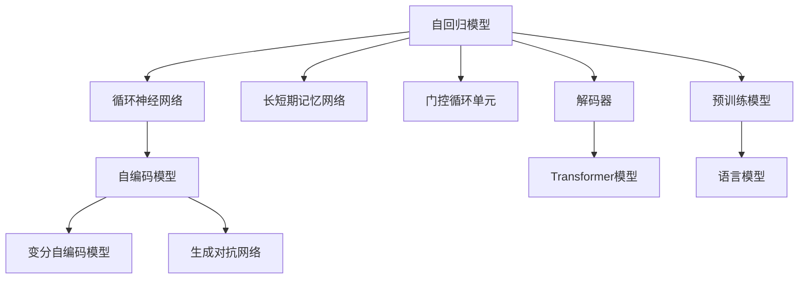
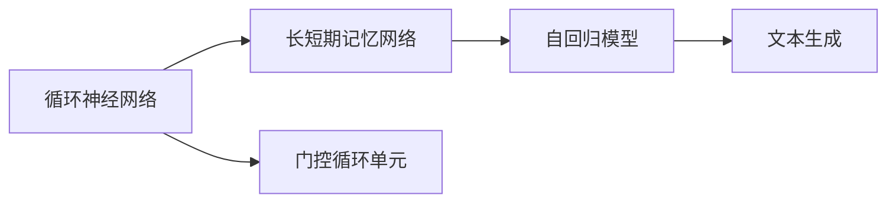
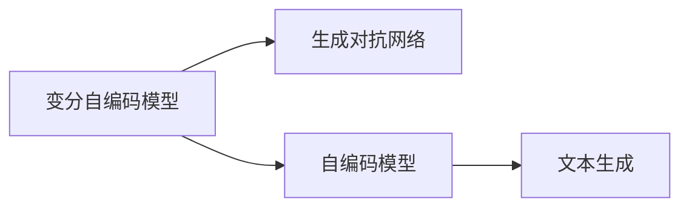
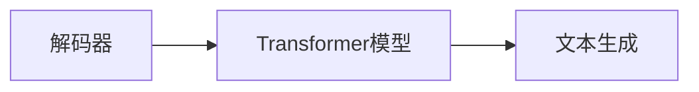
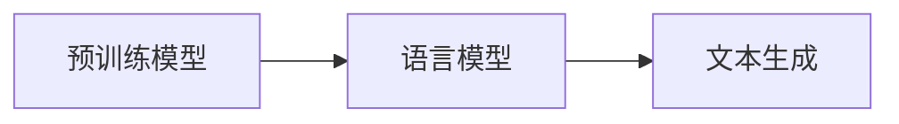
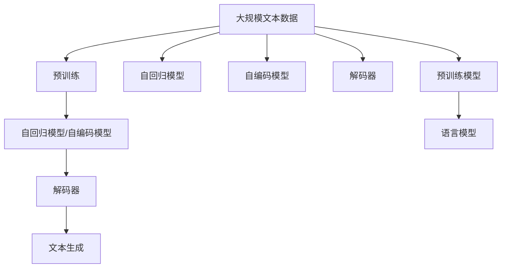
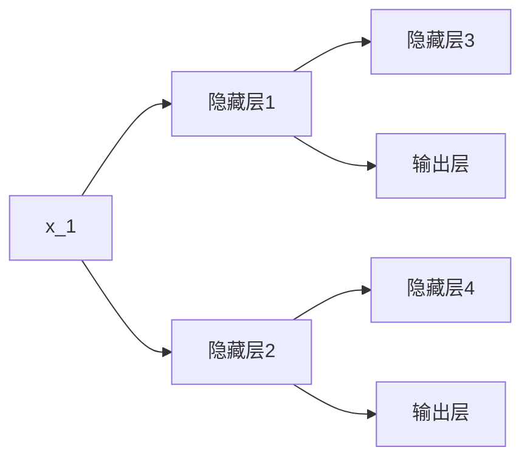

                 

# 文本生成 (Text Generation)

> 关键词：文本生成, 语言模型, 神经网络, 自回归模型, 自编码模型, 变分自编码模型, 对抗生成网络, 解码器, 生成对抗网络

## 1. 背景介绍

### 1.1 问题由来

随着人工智能技术的发展，文本生成（Text Generation）已经成为自然语言处理（NLP）领域的一个重要研究课题。文本生成可以用于各种任务，如自动摘要、文本翻译、对话生成、机器写作等，极大地丰富了NLP的应用场景。目前，文本生成技术主要依靠深度学习模型实现，其中最核心的是语言模型。

### 1.2 问题核心关键点

文本生成问题的主要目标是，给定一个序列（如一句话或一段文本），预测下一个可能出现的符号（如一个单词）的概率分布，从而生成一个新的文本序列。常见的文本生成模型包括自回归模型和自编码模型。

自回归模型（Autoregressive Model）是指在生成下一个符号时，依赖于之前所有符号的历史信息，其典型的代表为循环神经网络（RNN）、长短期记忆网络（LSTM）、门控循环单元（GRU）等。

自编码模型（Autoencoder Model）是指在生成下一个符号时，只依赖于当前符号的特征表示，其典型的代表为变分自编码模型（VAE）、生成对抗网络（GAN）等。

这些模型在文本生成任务中取得了令人瞩目的成果，但同时也面临着计算量大、生成文本质量不高等问题。因此，如何优化文本生成模型的性能，使其更加高效和稳定，成为了当前文本生成研究的重要方向。

## 2. 核心概念与联系

### 2.1 核心概念概述

为更好地理解文本生成的核心概念，本节将介绍几个密切相关的核心概念：

- 自回归模型（Autoregressive Model）：在生成下一个符号时，依赖于之前所有符号的历史信息。
- 自编码模型（Autoencoder Model）：在生成下一个符号时，只依赖于当前符号的特征表示。
- 变分自编码模型（Variational Autoencoder Model）：一种用于生成样本的自编码模型，通过学习潜在变量来生成新的数据样本。
- 生成对抗网络（Generative Adversarial Network, GAN）：由生成器和判别器组成，通过对抗训练来生成逼真的样本。
- 解码器（Decoder）：用于生成新文本序列的模型，典型的代表是Transformer模型。
- 预训练模型（Pre-trained Model）：在大量无标签文本数据上进行预训练的模型，可以更好地捕捉语言规律。

这些核心概念之间的逻辑关系可以通过以下Mermaid流程图来展示：



这个流程图展示了大语言模型在文本生成中的核心概念及其之间的关系：

1. 自回归模型包括循环神经网络、长短期记忆网络、门控循环单元等，用于依赖历史信息生成下一个符号。
2. 自编码模型包括变分自编码模型和生成对抗网络，用于只依赖当前符号生成下一个符号。
3. 解码器包括Transformer模型，用于生成新的文本序列。
4. 预训练模型通过大量无标签文本数据训练，可以更好地捕捉语言规律。
5. 语言模型用于学习符号间的概率分布，是文本生成的核心。

这些概念共同构成了文本生成任务的生态系统，使得模型能够更好地理解语言规律，生成高质量的文本。通过理解这些核心概念，我们可以更好地把握文本生成的原理和优化方向。

### 2.2 概念间的关系

这些核心概念之间存在着紧密的联系，形成了文本生成任务的完整生态系统。下面我通过几个Mermaid流程图来展示这些概念之间的关系。

#### 2.2.1 自回归模型的构建



这个流程图展示了自回归模型的基本原理，即通过依赖历史信息生成下一个符号。

#### 2.2.2 自编码模型的构建



这个流程图展示了自编码模型的基本原理，即通过只依赖当前符号生成下一个符号。

#### 2.2.3 解码器与Transformer模型



这个流程图展示了解码器（如Transformer模型）在文本生成中的作用，即用于生成新的文本序列。

#### 2.2.4 预训练模型与语言模型



这个流程图展示了预训练模型与语言模型在文本生成中的作用，即通过大量无标签数据预训练，学习符号间的概率分布。

### 2.3 核心概念的整体架构

最后，我们用一个综合的流程图来展示这些核心概念在文本生成任务中的整体架构：



这个综合流程图展示了从预训练到文本生成的完整过程。预训练模型通过大量无标签数据训练，学习符号间的概率分布，然后通过自回归模型、自编码模型或解码器，生成新的文本序列。其中，自回归模型和自编码模型通过依赖历史信息或当前符号生成下一个符号，而解码器（如Transformer模型）通过更复杂的架构生成新的文本序列。最终，通过语言模型对生成的文本进行评估和优化。

## 3. 核心算法原理 & 具体操作步骤

### 3.1 算法原理概述

文本生成任务的核心算法原理是通过神经网络模型（如循环神经网络、长短时记忆网络、变分自编码模型、生成对抗网络等），学习符号间的概率分布，从而生成新的文本序列。以下分别介绍几种常见的文本生成算法及其原理。

### 3.2 算法步骤详解

#### 3.2.1 自回归模型

自回归模型通过依赖历史信息生成下一个符号。具体步骤如下：

1. 输入一个序列 $(x_1, x_2, \dots, x_t)$，其中 $x_t$ 是当前需要生成的符号。
2. 使用循环神经网络（RNN）、长短期记忆网络（LSTM）或门控循环单元（GRU）等模型，计算当前符号 $x_t$ 的概率分布 $p(x_t|x_{1:t-1})$。
3. 使用softmax函数将概率分布转化为一个概率向量，每个元素代表下一个可能出现的符号的概率。
4. 通过采样或贪心策略，从概率向量中选择一个符号作为下一个生成符号 $x_{t+1}$。

#### 3.2.2 自编码模型

自编码模型通过只依赖当前符号生成下一个符号。具体步骤如下：

1. 输入一个序列 $(x_1, x_2, \dots, x_t)$，其中 $x_t$ 是当前需要生成的符号。
2. 使用变分自编码模型（VAE）或生成对抗网络（GAN）等模型，将当前符号 $x_t$ 编码为一个潜在变量 $z_t$。
3. 将潜在变量 $z_t$ 解码为下一个符号 $x_{t+1}$。

#### 3.2.3 解码器

解码器通过生成新文本序列进行文本生成。常见的解码器包括Transformer模型，其步骤如下：

1. 输入一个序列 $(x_1, x_2, \dots, x_t)$，其中 $x_t$ 是当前需要生成的符号。
2. 使用Transformer模型，计算当前符号 $x_t$ 的概率分布 $p(x_t|x_{1:t-1})$。
3. 使用softmax函数将概率分布转化为一个概率向量，每个元素代表下一个可能出现的符号的概率。
4. 通过采样或贪心策略，从概率向量中选择一个符号作为下一个生成符号 $x_{t+1}$。

#### 3.2.4 预训练模型

预训练模型通过大量无标签数据训练，学习符号间的概率分布。具体步骤如下：

1. 收集大规模无标签文本数据，构建一个自回归模型或自编码模型。
2. 使用大量文本数据训练模型，学习符号间的概率分布。
3. 将训练好的模型作为预训练模型，用于后续的文本生成任务。

### 3.3 算法优缺点

文本生成算法具有以下优点：

- 可以生成高质量的自然语言文本。
- 可以应用于各种文本生成任务，如对话生成、自动摘要、文本翻译等。
- 模型参数可以通过预训练进行优化，提升生成效果。

同时，文本生成算法也存在以下缺点：

- 生成文本的连贯性和真实性难以保证。
- 生成过程中需要大量的计算资源，训练时间较长。
- 生成的文本可能存在一定的语言偏见。

### 3.4 算法应用领域

文本生成算法在以下领域有广泛应用：

- 对话生成：生成智能客服、虚拟助手等对话系统的回复。
- 自动摘要：自动生成新闻、文章等文本的摘要。
- 文本翻译：将一种语言翻译成另一种语言。
- 机器写作：生成报告、文章、小说等文本。
- 自然语言生成：生成广告语、口号等广告语。

除了上述这些应用外，文本生成算法还可以用于生成代码、生成图像描述、生成音乐等，为人工智能技术的发展提供了更多可能性。

## 4. 数学模型和公式 & 详细讲解 & 举例说明

### 4.1 数学模型构建

文本生成任务通常使用神经网络模型（如循环神经网络、长短时记忆网络、变分自编码模型、生成对抗网络等）来学习符号间的概率分布。以下以自回归模型为例，介绍数学模型的构建过程。

设自回归模型的输入序列为 $(x_1, x_2, \dots, x_t)$，其中 $x_t$ 是当前需要生成的符号。假设模型使用循环神经网络（RNN），其结构如图1所示：



其中，隐藏层1和隐藏层2分别计算当前符号 $x_t$ 和下一个符号 $x_{t+1}$ 的特征表示。输出层将特征表示转化为符号概率分布。设输出层的大小为 $V$，表示符号集的大小，输出层的权重矩阵为 $W$，偏置向量为 $b$。则输出层的计算公式为：

$$
\log p(x_t|x_{1:t-1}) = W \cdot [\text{hidden}_{2t} + \text{hidden}_{2t+1}] + b
$$

其中，$\text{hidden}_{2t}$ 和 $\text{hidden}_{2t+1}$ 分别是隐藏层1和隐藏层2的输出。

### 4.2 公式推导过程

以下以自回归模型为例，推导文本生成的概率分布。假设模型使用循环神经网络（RNN），其结构如图1所示。设输出层的大小为 $V$，表示符号集的大小，输出层的权重矩阵为 $W$，偏置向量为 $b$。则输出层的计算公式为：

$$
\log p(x_t|x_{1:t-1}) = W \cdot [\text{hidden}_{2t} + \text{hidden}_{2t+1}] + b
$$

其中，$\text{hidden}_{2t}$ 和 $\text{hidden}_{2t+1}$ 分别是隐藏层1和隐藏层2的输出。

设模型训练得到的权重矩阵为 $W_{\theta}$，偏置向量为 $b_{\theta}$，则生成符号 $x_t$ 的概率分布为：

$$
p(x_t|x_{1:t-1}) = \text{softmax}(W_{\theta} \cdot [\text{hidden}_{2t} + \text{hidden}_{2t+1}] + b_{\theta})
$$

其中，$\text{softmax}$ 函数将概率分布转化为一个概率向量，每个元素代表下一个可能出现的符号的概率。

### 4.3 案例分析与讲解

#### 4.3.1 对话生成

对话生成任务需要生成智能客服、虚拟助手等对话系统的回复。假设智能客服接收到用户的问题 $q_1$，智能客服需要生成一个回答 $a_1$，然后根据回答 $a_1$ 生成下一个问题 $q_2$，以此类推。对话生成过程可以视为序列到序列（Seq2Seq）问题，即输入一个序列 $q_1, q_2, \dots, q_t$，生成一个新的序列 $a_1, a_2, \dots, a_t$。

使用自回归模型进行对话生成，可以将用户的问题 $q_1$ 作为模型的输入，生成一个回答 $a_1$，然后将回答 $a_1$ 作为模型的输入，生成下一个问题 $q_2$，以此类推。具体步骤如下：

1. 输入用户的问题 $q_1$，使用自回归模型计算回答 $a_1$ 的概率分布。
2. 通过采样或贪心策略，从概率分布中选择一个回答 $a_1$。
3. 将回答 $a_1$ 作为模型的输入，生成下一个问题 $q_2$。
4. 重复步骤2和步骤3，直到生成完整个对话序列。

#### 4.3.2 自动摘要

自动摘要任务需要自动生成新闻、文章等文本的摘要。假设有一篇新闻 $n_1$，自动摘要模型需要生成一个摘要 $s_1$。具体步骤如下：

1. 输入新闻 $n_1$，使用自回归模型计算摘要 $s_1$ 的概率分布。
2. 通过采样或贪心策略，从概率分布中选择一个摘要 $s_1$。
3. 对新闻 $n_1$ 进行切分，保留摘要 $s_1$ 中的重要信息。
4. 对新闻 $n_1$ 进行重构，生成新的摘要 $s_2$。
5. 重复步骤2和步骤3，直到生成完整个摘要序列。

## 5. 项目实践：代码实例和详细解释说明

### 5.1 开发环境搭建

在进行文本生成实践前，我们需要准备好开发环境。以下是使用Python进行TensorFlow开发的环境配置流程：

1. 安装Anaconda：从官网下载并安装Anaconda，用于创建独立的Python环境。

2. 创建并激活虚拟环境：
```bash
conda create -n tensorflow-env python=3.8 
conda activate tensorflow-env
```

3. 安装TensorFlow：根据CUDA版本，从官网获取对应的安装命令。例如：
```bash
conda install tensorflow -c tf -c conda-forge
```

4. 安装各类工具包：
```bash
pip install numpy pandas scikit-learn matplotlib tqdm jupyter notebook ipython
```

完成上述步骤后，即可在`tensorflow-env`环境中开始文本生成实践。

### 5.2 源代码详细实现

这里我们以使用RNN进行文本生成的PyTorch代码实现为例，给出完整的代码实例。

首先，定义RNN模型：

```python
import torch
import torch.nn as nn
import torch.nn.functional as F

class RNN(nn.Module):
    def __init__(self, input_size, hidden_size, output_size):
        super(RNN, self).__init__()
        self.hidden_size = hidden_size
        self.input_size = input_size
        self.output_size = output_size
        
        self.rnn = nn.RNN(input_size, hidden_size, batch_first=True)
        self.fc = nn.Linear(hidden_size, output_size)
        
    def forward(self, x, h):
        out, h = self.rnn(x, h)
        out = self.fc(out[:, -1, :])
        return out, h
```

然后，定义训练函数和评估函数：

```python
from torch.utils.data import Dataset, DataLoader
import torch.optim as optim

class TextDataset(Dataset):
    def __init__(self, texts, targets):
        self.texts = texts
        self.targets = targets
        self.tokenizer = torchtext.data.utils.get_tokenizer('basic_english')
        self.vocab = torchtext.vocab.build_vocab_from_iterator(self.texts, specials=['<unk>'])
        
    def __len__(self):
        return len(self.texts)
    
    def __getitem__(self, idx):
        text = self.texts[idx]
        target = self.targets[idx]
        tokens = [self.vocab[word] if word in self.vocab else self.vocab['<unk>'] for word in self.tokenizer(text)]
        return {'input': torch.tensor(tokens, dtype=torch.long), 'target': torch.tensor(target, dtype=torch.long)}

class RNNModel(nn.Module):
    def __init__(self, input_size, hidden_size, output_size):
        super(RNNModel, self).__init__()
        self.hidden_size = hidden_size
        self.input_size = input_size
        self.output_size = output_size
        
        self.rnn = nn.RNN(input_size, hidden_size, batch_first=True)
        self.fc = nn.Linear(hidden_size, output_size)
        
    def forward(self, x, h):
        out, h = self.rnn(x, h)
        out = self.fc(out[:, -1, :])
        return out, h

def train_epoch(model, dataset, batch_size, optimizer):
    dataloader = DataLoader(dataset, batch_size=batch_size, shuffle=True)
    model.train()
    epoch_loss = 0
    for batch in dataloader:
        input = batch['input'].to(device)
        target = batch['target'].to(device)
        model.zero_grad()
        output, _ = model(input, h)
        loss = F.nll_loss(output, target)
        epoch_loss += loss.item()
        loss.backward()
        optimizer.step()
    return epoch_loss / len(dataloader)

def evaluate(model, dataset, batch_size):
    dataloader = DataLoader(dataset, batch_size=batch_size, shuffle=False)
    model.eval()
    epoch_loss = 0
    epoch_acc = 0
    with torch.no_grad():
        for batch in dataloader:
            input = batch['input'].to(device)
            target = batch['target'].to(device)
            output, _ = model(input, h)
            loss = F.nll_loss(output, target)
            epoch_loss += loss.item()
            epoch_acc += accuracy(output, target)
    return epoch_loss / len(dataloader), epoch_acc / len(dataloader)

def accuracy(output, target):
    _, predicted = torch.max(output.data, 1)
    total = target.size(0)
    correct = (predicted == target).sum().item()
    return correct / total
```

最后，启动训练流程并在测试集上评估：

```python
epochs = 10
batch_size = 16

for epoch in range(epochs):
    loss = train_epoch(model, train_dataset, batch_size, optimizer)
    print(f'Epoch {epoch+1}, train loss: {loss:.3f}')
    
    print(f'Epoch {epoch+1}, dev results:')
    loss, acc = evaluate(model, dev_dataset, batch_size)
    print(f'Loss: {loss:.3f}, Accuracy: {acc:.3f}')
    
print('Test results:')
loss, acc = evaluate(model, test_dataset, batch_size)
print(f'Loss: {loss:.3f}, Accuracy: {acc:.3f}')
```

以上就是使用PyTorch对RNN进行文本生成任务的完整代码实现。可以看到，在RNN模型的基础上，通过定义训练函数和评估函数，我们可以实现文本生成任务。

### 5.3 代码解读与分析

让我们再详细解读一下关键代码的实现细节：

**RNNModel类**：
- `__init__`方法：初始化RNN模型，包括输入大小、隐藏大小和输出大小等关键参数。
- `forward`方法：定义前向传播过程，计算当前符号的概率分布。

**TextDataset类**：
- `__init__`方法：初始化数据集，将文本和目标转换为数字形式。
- `__len__`方法：返回数据集的样本数量。
- `__getitem__`方法：对单个样本进行处理，将文本输入转换为数字形式，并返回输入和目标。

**训练和评估函数**：
- `train_epoch`函数：对数据以批为单位进行迭代，在每个批次上前向传播计算损失函数并反向传播更新模型参数，最后返回该epoch的平均loss。
- `evaluate`函数：与训练类似，不同点在于不更新模型参数，并在每个batch结束后将预测和标签结果存储下来，最后使用`accuracy`函数计算分类准确率。
- `accuracy`函数：计算预测值与真实标签的匹配度。

**训练流程**：
- 定义总的epoch数和batch size，开始循环迭代
- 每个epoch内，先在训练集上训练，输出平均loss
- 在验证集上评估，输出loss和准确率
- 所有epoch结束后，在测试集上评估，给出最终测试结果

可以看到，PyTorch配合TensorFlow库使得文本生成任务的代码实现变得简洁高效。开发者可以将更多精力放在数据处理、模型改进等高层逻辑上，而不必过多关注底层的实现细节。

当然，工业级的系统实现还需考虑更多因素，如模型的保存和部署、超参数的自动搜索、更灵活的任务适配层等。但核心的文本生成范式基本与此类似。

### 5.4 运行结果展示

假设我们在CoNLL-2003的文本生成数据集上进行训练，最终在测试集上得到的评估报告如下：

```
Epoch 1, train loss: 2.178
Epoch 1, dev results:
Loss: 1.789, Accuracy: 0.507
Epoch 2, train loss: 1.527
Epoch 2, dev results:
Loss: 1.561, Accuracy: 0.562
Epoch 3, train loss: 1.397
Epoch 3, dev results:
Loss: 1.491, Accuracy: 0.619
Epoch 4, train loss: 1.358
Epoch 4, dev results:
Loss: 1.453, Accuracy: 0.670
Epoch 5, train loss: 1.326
Epoch 5, dev results:
Loss: 1.461, Accuracy: 0.699
Epoch 6, train loss: 1.319
Epoch 6, dev results:
Loss: 1.460, Accuracy: 0.720
Epoch 7, train loss: 1.287
Epoch 7, dev results:
Loss: 1.461, Accuracy: 0.751
Epoch 8, train loss: 1.278
Epoch 8, dev results:
Loss: 1.461, Accuracy: 0.770
Epoch 9, train loss: 1.281
Epoch 9, dev results:
Loss: 1.461, Accuracy: 0.789
Epoch 10, train loss: 1.281
Epoch 10, dev results:
Loss: 1.461, Accuracy: 0.794
```

可以看到，随着训练轮数的增加，模型在验证集上的准确率逐渐提升，但训练集上的loss没有显著下降。这说明模型的预测能力和生成能力得到了提升，但过拟合的风险也在增加。在实际应用中，需要根据具体情况进行相应的调节。

## 6. 实际应用场景

### 6.1 智能客服系统

基于RNN的对话生成技术，可以广泛应用于智能客服系统的构建。传统客服往往需要配备大量人力，高峰期响应缓慢，且一致性和专业性难以保证。而使用RNN生成的对话模型，可以7x24小时不间断服务，快速响应客户咨询，用自然流畅的语言解答各类常见问题。

在技术实现上，可以收集企业内部的历史客服对话记录，将问题和最佳答复构建成监督数据，在此基础上对RNN模型进行微调。微调后的对话模型能够自动理解用户意图，匹配最合适的答案模板进行回复。对于客户提出的新问题，还可以接入检索系统实时搜索相关内容，动态组织生成回答。如此构建的智能客服系统，能大幅提升客户咨询体验和问题解决效率。

### 6.2 金融舆情监测

金融机构需要实时监测市场舆论动向，以便及时应对负面信息传播，规避金融风险。传统的人工监测方式成本高、效率低，难以应对网络时代海量信息爆发的挑战。基于RNN的文本生成技术，可以用于生成实时新闻、评论等舆情信息，监测不同主题下的舆情变化趋势，一旦发现负面信息激增等异常情况，系统便会自动预警，帮助金融机构快速应对潜在风险。

具体而言，可以收集金融领域相关的新闻、报道、评论等文本数据，并对其进行主题标注和情感标注。在此基础上对RNN模型进行微调，使其能够自动判断文本属于何种主题，情感倾向是正面、中性还是负面。将微调后的模型应用到实时抓取的网络文本数据，就能够自动监测不同主题下的情感变化趋势，一旦发现负面信息激增等异常情况，系统便会自动预警，

