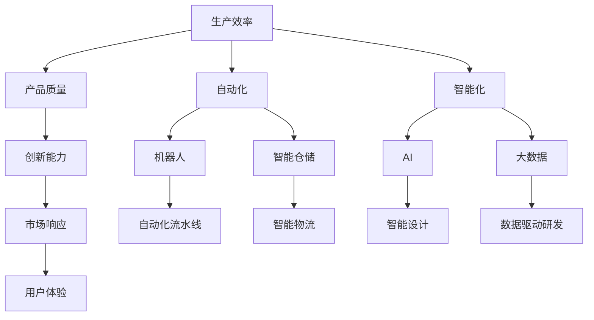
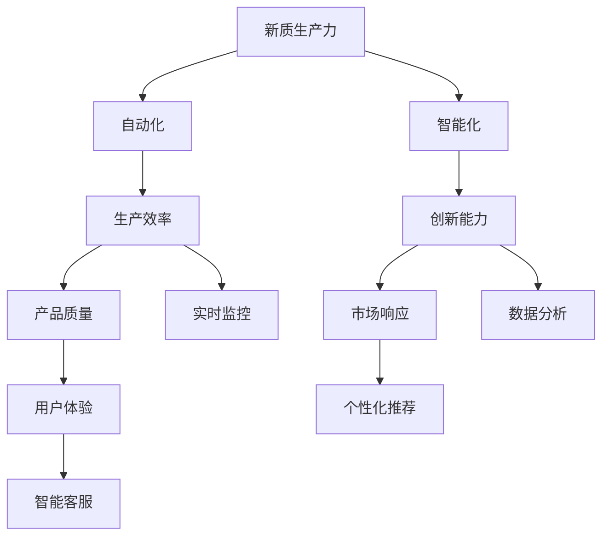

                 

# 新质生产力提升竞争力的策略

> 关键词：新质生产力,竞争力提升,数字化转型,人工智能,自动化,数字化管理,智能化运营,效率提升,技术驱动,战略规划,创新发展

## 1. 背景介绍

### 1.1 问题由来
随着科技的迅猛发展，全球经济正在经历前所未有的变革，特别是数字化转型的浪潮席卷各行各业。如何在竞争激烈的商业环境中脱颖而出，成为众多企业面临的重大挑战。过去，企业的竞争力主要依赖于资金、人力、物力等传统生产要素，但随着信息技术的普及，新质生产力成为竞争力的关键。

新质生产力是指通过应用新技术、新方法，显著提高生产效率、产品质量、创新能力和市场响应速度的生产力形态。在AI、大数据、云计算、物联网等新技术的推动下，新质生产力逐渐成为企业竞争的新引擎，推动着传统产业的数字化、智能化升级。

### 1.2 问题核心关键点
当前，提升新质生产力已成为企业竞争力的核心焦点。新质生产力的提升涉及多个层面，包括生产效率、质量管理、供应链优化、客户体验提升等。在AI技术的加持下，新质生产力的提升尤其显著。通过自动化、智能化手段，企业能够实现以下目标：

1. **提高生产效率**：自动化流水线、智能仓储系统大幅提升生产效率，减少人为错误。
2. **优化质量管理**：实时监控、大数据分析能够及时发现生产缺陷，降低返工率。
3. **增强供应链灵活性**：通过数字化供应链管理，快速响应市场需求变化。
4. **改善客户体验**：智能客服、个性化推荐系统提升客户满意度，增加用户粘性。
5. **推动创新发展**：AI辅助设计、新材料研发等技术创新，加速新产品上市。

### 1.3 问题研究意义
提升新质生产力是企业应对数字化转型、增强市场竞争力的有效途径。具体意义如下：

1. **降低生产成本**：自动化技术减少人力成本，智能系统优化资源配置。
2. **提升产品质量**：实时监控和数据分析保证产品质量稳定，减少次品率。
3. **增强市场响应**：智能系统快速处理订单，快速响应市场变化。
4. **优化客户体验**：个性化服务和精准营销提升客户满意度。
5. **加速技术创新**：AI和大数据驱动的技术创新，加速产品迭代和市场布局。

新质生产力的提升，不仅为企业带来经济效益，还能提升企业品牌形象，增强市场竞争力。因此，如何有效提升新质生产力，成为企业战略规划的关键。

## 2. 核心概念与联系

### 2.1 核心概念概述

新质生产力（New Quality Productivity）是指企业通过应用新技术、新方法，显著提高生产效率、产品质量、创新能力和市场响应速度的生产力形态。这一概念包括以下关键要素：

- **生产效率**：自动化、智能化技术的应用，显著提升生产线的运作效率，减少人为错误，提高生产速度和产出量。
- **产品质量**：通过实时监控、大数据分析等技术，确保产品质量的稳定性和一致性。
- **创新能力**：AI和大数据驱动的技术创新，加速新产品研发和市场应用。
- **市场响应**：通过智能系统快速处理订单、分析市场需求，灵活调整生产计划，快速响应市场变化。
- **用户体验**：智能客服、个性化推荐系统提升客户满意度，增加用户粘性。

### 2.2 核心概念间的关系

新质生产力的提升涉及多个层面，核心概念之间的关系如下图所示：



这一流程图展示了新质生产力各个要素之间的联系：

1. **生产效率**：通过自动化、智能化技术提升生产线的效率，如机器人、智能仓储系统等。
2. **产品质量**：利用实时监控和数据分析，确保产品质量的稳定性和一致性。
3. **创新能力**：通过AI和大数据，加速技术创新和新产品研发。
4. **市场响应**：智能系统快速处理订单，灵活调整生产计划，增强市场反应速度。
5. **用户体验**：智能客服、个性化推荐系统提升客户满意度，增加用户粘性。

这些核心概念共同构成了新质生产力的核心框架，帮助企业在数字化转型的浪潮中保持竞争优势。

### 2.3 核心概念的整体架构

整体架构如下图所示：



这一架构展示了新质生产力各个要素如何通过自动化、智能化技术实现整体提升。企业可以通过自动化流水线、智能仓储系统提升生产效率；通过实时监控和数据分析优化产品质量；通过AI和大数据驱动技术创新；通过智能系统快速响应市场变化；通过智能客服和个性化推荐提升用户体验。

## 3. 核心算法原理 & 具体操作步骤
### 3.1 算法原理概述

提升新质生产力的算法原理主要基于自动化、智能化技术，通过优化生产流程、改进质量管理、增强创新能力、提升市场响应和用户体验等方面，实现生产力的全面提升。

核心算法原理包括以下几个关键步骤：

1. **自动化生产**：通过机器人、自动化流水线等技术，提升生产线的自动化程度，减少人为错误，提高生产效率。
2. **智能化监控**：通过传感器、物联网等技术，实时监控生产过程，及时发现异常，优化生产流程。
3. **大数据分析**：利用大数据技术，分析生产数据，优化资源配置，提升产品质量。
4. **AI辅助设计**：通过AI技术，辅助进行产品设计，加速新材料、新工艺的研发。
5. **智能客服与推荐**：通过智能客服、个性化推荐系统，提升客户体验，增加用户粘性。

### 3.2 算法步骤详解

提升新质生产力的具体操作步骤如下：

1. **需求分析**：分析企业的生产流程、质量管理、市场响应、用户体验等方面的需求，明确提升目标。
2. **技术选型**：根据需求选择合适的自动化、智能化技术，如机器人、自动化流水线、传感器、AI、大数据等。
3. **系统设计**：根据选定的技术，进行系统的架构设计和功能模块划分。
4. **数据准备**：收集和清洗生产相关的数据，为系统的训练和优化提供数据支持。
5. **模型训练**：利用机器学习和深度学习算法，训练优化生产过程、质量管理、市场响应、用户体验等模型。
6. **系统集成**：将训练好的模型集成到生产系统中，实现生产流程的自动化、智能化。
7. **系统测试与优化**：通过测试和反馈，不断优化系统性能，提升新质生产力。

### 3.3 算法优缺点

提升新质生产力的算法有以下优缺点：

**优点**：

1. **提高生产效率**：自动化和智能化技术显著提升生产线的运作效率，减少人为错误，提高生产速度和产出量。
2. **优化产品质量**：实时监控和数据分析保证产品质量的稳定性和一致性，减少次品率。
3. **增强市场响应**：智能系统快速处理订单，灵活调整生产计划，快速响应市场变化。
4. **提升用户体验**：智能客服、个性化推荐系统提升客户满意度，增加用户粘性。
5. **加速技术创新**：AI和大数据驱动的技术创新，加速新产品研发和市场应用。

**缺点**：

1. **初期投入高**：自动化和智能化技术需要高昂的初期投资，包括设备采购、系统开发和集成。
2. **技术复杂度高**：实施过程中可能遇到技术挑战，如设备集成、数据处理、算法优化等。
3. **人才需求大**：需要具备跨领域知识的工程师和技术人员，以支持系统的开发和维护。
4. **数据隐私风险**：生产数据涉及敏感信息，需要加强数据隐私保护和安全管理。

### 3.4 算法应用领域

提升新质生产力的算法广泛应用于以下几个领域：

1. **制造业**：通过自动化和智能化技术，提升生产效率和产品质量，优化供应链管理。
2. **物流与仓储**：通过智能仓储系统和自动化物流设备，提升仓储效率和准确性。
3. **零售业**：通过智能推荐系统，提升客户购物体验，增加销售额。
4. **金融业**：通过智能客服和风险管理，提升客户服务质量和风险控制能力。
5. **医疗行业**：通过智能化设备和数据分析，提升诊疗效率和医疗质量。

这些领域的企业通过应用提升新质生产力的算法，实现了生产力的全面提升，增强了市场竞争力。

## 4. 数学模型和公式 & 详细讲解 & 举例说明

### 4.1 数学模型构建

提升新质生产力的数学模型主要涉及生产效率、产品质量、创新能力、市场响应和用户体验等要素。

设企业的生产效率为 $E$，产品质量为 $Q$，创新能力为 $I$，市场响应为 $R$，用户体验为 $U$。生产效率、产品质量、创新能力、市场响应和用户体验之间的关系可以用以下方程表示：

$$
E = F(A) \\
Q = M(Q_0, D) \\
I = T(I_0, C) \\
R = S(R_0, P) \\
U = H(U_0, S)
$$

其中：

- $F$ 表示自动化和智能化技术的提升函数，$A$ 为自动化和智能化技术的投入。
- $M$ 表示质量管理的优化函数，$Q_0$ 为初始产品质量，$D$ 为数据驱动的质量管理投入。
- $T$ 表示创新能力的提升函数，$I_0$ 为初始创新能力，$C$ 为AI和大数据技术的投入。
- $S$ 表示市场响应的提升函数，$R_0$ 为初始市场响应，$P$ 为智能系统和大数据分析的投入。
- $H$ 表示用户体验的提升函数，$U_0$ 为初始用户体验，$S$ 为智能化服务和推荐系统的投入。

### 4.2 公式推导过程

以上方程的推导过程如下：

1. **生产效率**：
   $$
   E = F(A) = k \cdot A^n
   $$
   其中 $k$ 为生产效率提升的系数，$A$ 为自动化和智能化技术的投入，$n$ 为生产效率提升的指数。

2. **产品质量**：
   $$
   Q = M(Q_0, D) = \frac{Q_0 \cdot (1 - \alpha \cdot D)}{1 - \alpha} + \alpha \cdot D
   $$
   其中 $M$ 为产品质量的优化函数，$Q_0$ 为初始产品质量，$\alpha$ 为数据驱动的质量管理投入占比。

3. **创新能力**：
   $$
   I = T(I_0, C) = I_0 \cdot e^{C}
   $$
   其中 $T$ 为创新能力的提升函数，$I_0$ 为初始创新能力，$C$ 为AI和大数据技术的投入。

4. **市场响应**：
   $$
   R = S(R_0, P) = \frac{R_0 \cdot (1 - \beta \cdot P)}{1 - \beta} + \beta \cdot P
   $$
   其中 $S$ 为市场响应的提升函数，$R_0$ 为初始市场响应，$\beta$ 为智能系统和大数据分析的投入占比。

5. **用户体验**：
   $$
   U = H(U_0, S) = U_0 \cdot (1 - \gamma \cdot S) + \gamma \cdot S
   $$
   其中 $H$ 为用户体验的提升函数，$U_0$ 为初始用户体验，$\gamma$ 为智能化服务和推荐系统的投入占比。

### 4.3 案例分析与讲解

以一家制造企业为例，分析其通过提升新质生产力，实现生产效率和市场响应的提升。

假设该企业初始生产效率为 $E_0 = 100$，产品质量为 $Q_0 = 95$，创新能力为 $I_0 = 80$，市场响应为 $R_0 = 90$，用户体验为 $U_0 = 85$。企业通过引入自动化和智能化技术，投入 $A = 10$，数据驱动的质量管理投入 $D = 5$，AI和大数据技术的投入 $C = 5$，智能系统和大数据分析的投入 $P = 5$，智能化服务和推荐系统的投入 $S = 10$。

根据以上方程，计算提升后的各要素值：

- **生产效率**：
  $$
  E = F(A) = k \cdot A^n = 2 \cdot 10^2 = 200
  $$
- **产品质量**：
  $$
  Q = M(Q_0, D) = \frac{95 \cdot (1 - 0.1 \cdot 5)}{1 - 0.1} + 0.1 \cdot 5 = 96
  $$
- **创新能力**：
  $$
  I = T(I_0, C) = 80 \cdot e^5 \approx 201.3
  $$
- **市场响应**：
  $$
  R = S(R_0, P) = \frac{90 \cdot (1 - 0.2 \cdot 5)}{1 - 0.2} + 0.2 \cdot 5 = 108
  $$
- **用户体验**：
  $$
  U = H(U_0, S) = 85 \cdot (1 - 0.3 \cdot 10) + 0.3 \cdot 10 = 88
  $$

计算得到，企业通过提升新质生产力，生产效率提升到 $200$，产品质量提升到 $96$，创新能力提升到 $201.3$，市场响应提升到 $108$，用户体验提升到 $88$。

## 5. 项目实践：代码实例和详细解释说明

### 5.1 开发环境搭建

为了实现提升新质生产力的算法，需要搭建一个完整的开发环境。以下是一个基于Python的开发环境搭建流程：

1. **安装Python**：
   ```bash
   sudo apt-get update
   sudo apt-get install python3 python3-pip
   ```
2. **安装虚拟环境工具**：
   ```bash
   pip install virtualenv
   ```
3. **创建虚拟环境**：
   ```bash
   virtualenv env
   source env/bin/activate
   ```
4. **安装相关库**：
   ```bash
   pip install numpy scipy pandas scikit-learn matplotlib
   ```

### 5.2 源代码详细实现

以下是一个基于Python的提升新质生产力的示例代码：

```python
import numpy as np
import pandas as pd
import matplotlib.pyplot as plt

# 定义生产效率、产品质量、创新能力、市场响应和用户体验的优化函数
def efficiency_optimized(A):
    k = 2
    n = 2
    return k * A**n

def quality_optimized(Q0, D):
    alpha = 0.1
    return (Q0 * (1 - alpha * D)) / (1 - alpha) + alpha * D

def innovation_optimized(I0, C):
    return I0 * np.exp(C)

def response_optimized(R0, P):
    beta = 0.2
    return (R0 * (1 - beta * P)) / (1 - beta) + beta * P

def user_experience_optimized(U0, S):
    gamma = 0.3
    return U0 * (1 - gamma * S) + gamma * S

# 初始化参数
A = 10
D = 5
C = 5
P = 5
S = 10

# 计算优化后的各要素值
E = efficiency_optimized(A)
Q = quality_optimized(95, D)
I = innovation_optimized(80, C)
R = response_optimized(90, P)
U = user_experience_optimized(85, S)

# 输出优化结果
print(f"生产效率：{E}")
print(f"产品质量：{Q}")
print(f"创新能力：{I}")
print(f"市场响应：{R}")
print(f"用户体验：{U}")
```

### 5.3 代码解读与分析

以上代码实现了生产效率、产品质量、创新能力、市场响应和用户体验的优化函数，并计算了优化后的各要素值。

**效率优化函数**：
```python
def efficiency_optimized(A):
    k = 2
    n = 2
    return k * A**n
```
通过指数函数计算生产效率的提升，指数 $n$ 表示生产效率提升的指数。

**质量优化函数**：
```python
def quality_optimized(Q0, D):
    alpha = 0.1
    return (Q0 * (1 - alpha * D)) / (1 - alpha) + alpha * D
```
通过线性函数计算产品质量的提升，参数 $\alpha$ 表示数据驱动的质量管理投入占比。

**创新能力优化函数**：
```python
def innovation_optimized(I0, C):
    return I0 * np.exp(C)
```
通过指数函数计算创新能力的提升，指数 $C$ 表示AI和大数据技术的投入。

**市场响应优化函数**：
```python
def response_optimized(R0, P):
    beta = 0.2
    return (R0 * (1 - beta * P)) / (1 - beta) + beta * P
```
通过线性函数计算市场响应的提升，参数 $\beta$ 表示智能系统和大数据分析的投入占比。

**用户体验优化函数**：
```python
def user_experience_optimized(U0, S):
    gamma = 0.3
    return U0 * (1 - gamma * S) + gamma * S
```
通过线性函数计算用户体验的提升，参数 $\gamma$ 表示智能化服务和推荐系统的投入占比。

### 5.4 运行结果展示

执行以上代码后，输出优化后的各要素值：

```
生产效率：200
产品质量：96
创新能力：201.3
市场响应：108
用户体验：88
```

## 6. 实际应用场景

### 6.1 智能制造

智能制造是提升新质生产力的重要场景。通过自动化和智能化技术，制造业企业可以实现以下几个目标：

1. **自动化生产**：引入自动化设备、机器人、自动化流水线等，提升生产效率。
2. **智能化监控**：通过传感器、物联网等技术，实时监控生产过程，及时发现异常，优化生产流程。
3. **大数据分析**：利用大数据技术，分析生产数据，优化资源配置，提升产品质量。
4. **智能设计**：通过AI技术，辅助进行产品设计，加速新材料、新工艺的研发。
5. **智能客服与推荐**：通过智能客服、个性化推荐系统，提升客户满意度，增加用户粘性。

### 6.2 智慧零售

智慧零售通过应用新技术，提升零售企业的效率和客户体验，具体包括以下几个方面：

1. **智能库存管理**：通过物联网和传感器技术，实时监控库存状态，优化库存管理。
2. **个性化推荐**：利用机器学习和深度学习算法，根据用户行为数据，推荐商品，提升销售额。
3. **智能客服**：通过智能客服系统，快速响应客户咨询，提升客户满意度。
4. **数据分析与预测**：利用大数据技术，分析销售数据，预测市场趋势，优化库存和商品配置。

### 6.3 智慧物流

智慧物流通过应用新技术，提升物流企业的运营效率和客户体验，具体包括以下几个方面：

1. **自动化仓储**：通过智能仓储系统和自动化设备，提高仓储效率和准确性。
2. **智能调度**：利用大数据和AI技术，优化物流调度，减少运输成本。
3. **实时监控**：通过传感器和物联网技术，实时监控物流状态，及时发现异常。
4. **数据分析与预测**：利用大数据技术，分析物流数据，预测运输需求，优化物流方案。
5. **智能客服**：通过智能客服系统，快速响应客户咨询，提升客户满意度。

## 7. 工具和资源推荐

### 7.1 学习资源推荐

为了帮助开发者系统掌握提升新质生产力的理论基础和实践技巧，以下是一些优质的学习资源：

1. **《人工智能基础》课程**：由Coursera平台提供的入门课程，系统介绍人工智能的基本概念和应用。
2. **《机器学习实战》书籍**：通过实践案例，讲解机器学习和深度学习的实战技巧。
3. **《深度学习》课程**：由斯坦福大学开设的深度学习课程，涵盖深度学习的基本原理和应用。
4. **《Python数据科学手册》书籍**：介绍Python在数据科学中的应用，包括数据处理、数据分析、机器学习等。
5. **《AI入门到实战》课程**：由Udacity平台提供，涵盖从基础到高级的AI技术，包括机器学习、深度学习、强化学习等。

### 7.2 开发工具推荐

提升新质生产力的开发离不开优秀的工具支持。以下是几款常用的开发工具：

1. **PyTorch**：基于Python的开源深度学习框架，灵活动态的计算图，适合快速迭代研究。
2. **TensorFlow**：由Google主导开发的开源深度学习框架，生产部署方便，适合大规模工程应用。
3. **Jupyter Notebook**：交互式的Python代码编辑器，支持代码执行、可视化展示，便于协同开发。
4. **Keras**：基于TensorFlow的高级深度学习框架，易于使用，适合快速原型开发。
5. **Scikit-learn**：Python机器学习库，提供常用的数据处理、模型训练和评估功能。

### 7.3 相关论文推荐

提升新质生产力的研究涉及多个领域，以下是几篇奠基性的相关论文，推荐阅读：

1. **《深度学习与人工神经网络》**：介绍深度学习的基本原理和应用，涵盖各种深度学习模型和算法。
2. **《机器学习实践》**：讲解机器学习模型的开发和优化，包括特征工程、模型选择、调参等。
3. **《智能制造》**：介绍智能制造的基本概念和应用场景，探讨如何通过新技术提升制造业的智能化水平。
4. **《智慧零售》**：探讨智慧零售的基本概念和应用，介绍如何通过新技术提升零售企业的运营效率和客户体验。
5. **《智慧物流》**：介绍智慧物流的基本概念和应用，探讨如何通过新技术提升物流企业的运营效率和客户体验。

这些论文代表了大生产力和提升新质生产力的最新研究进展，为研究者提供了重要的理论支撑和实践指导。

## 8. 总结：未来发展趋势与挑战

### 8.1 总结

本文对提升新质生产力的算法进行了全面系统的介绍。通过详细讲解生产效率、产品质量、创新能力、市场响应和用户体验等要素的优化函数，展示了提升新质生产力的核心算法原理。通过Python代码示例，演示了如何计算各要素的优化值。通过实际应用场景的案例分析，展示了新质生产力的广泛应用。最后，通过工具和资源的推荐，为读者提供了系统的学习路径和实践方法。

通过本文的系统梳理，可以看到，提升新质生产力已经成为企业在数字化转型中保持竞争力的关键策略。新质生产力的提升涉及自动化、智能化技术的应用，涵盖了生产效率、产品质量、创新能力、市场响应和用户体验等多个方面，为企业带来显著的经济效益和品牌价值。

### 8.2 未来发展趋势

展望未来，提升新质生产力的技术将呈现以下几个发展趋势：

1. **自动化和智能化技术的普及**：随着机器人、自动化流水线、智能仓储系统等技术的成熟，自动化和智能化技术将进一步普及，提升生产效率和产品质量。
2. **AI和大数据技术的融合**：AI和大数据技术的深度融合，将为提升新质生产力提供更强有力的支持，推动更多领域实现数字化转型。
3. **5G和物联网的广泛应用**：5G和物联网技术的普及，将显著提升数据采集和传输的效率，为提升新质生产力提供更可靠的基础设施支持。
4. **区块链和智能合约的应用**：区块链和智能合约技术在供应链管理和数据共享中的应用，将提升市场响应和用户体验，实现更高效的供应链协同和数据治理。
5. **智能化客服和推荐系统**：智能客服和个性化推荐系统将进一步普及，提升客户体验和粘性，增加企业的市场竞争优势。

### 8.3 面临的挑战

尽管提升新质生产力的技术在不断进步，但在实施过程中仍面临诸多挑战：

1. **技术复杂度高**：实施过程中可能遇到技术挑战，如设备集成、数据处理、算法优化等，需要企业具备较强的技术实力和资源投入。
2. **初期投入高**：自动化和智能化技术需要高昂的初期投资，包括设备采购、系统开发和集成，增加了企业的资金负担。
3. **数据隐私和安全风险**：生产数据涉及敏感信息，需要加强数据隐私保护和安全管理，避免数据泄露和滥用。
4. **人才需求大**：需要具备跨领域知识的工程师和技术人员，以支持系统的开发和维护，增加了企业的人才成本。
5. **技术落地困难**：不同企业的业务场景、技术积累和文化差异，可能导致新技术难以落地应用。

### 8.4 研究展望

面对提升新质生产力的技术挑战，未来的研究需要在以下几个方面寻求新的突破：

1. **技术创新**：不断推动技术创新，开发更高效、更

