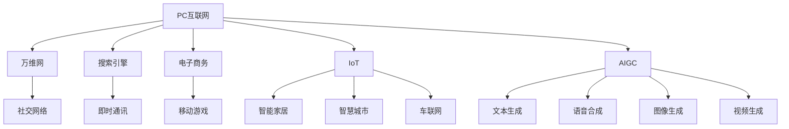
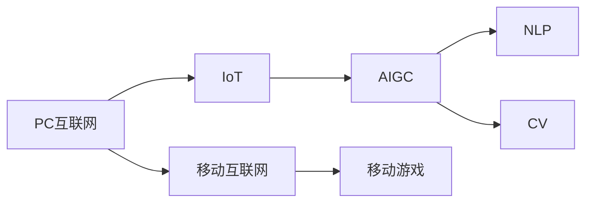

                 

# 时代浪潮奔涌向前：从PC互联网到移动互联网，从IOT到AIGC——过去未去，未来已来

## 1. 背景介绍

### 1.1 问题由来
随着信息时代的飞速发展，人类社会的数字化进程已进入了一个新的阶段。从最初的PC互联网时代，到移动互联网的崛起，再到物联网(IoT)的广泛应用，再到当前的人工智能生成内容(AIGC)技术的突破，信息技术的发展速度之快、影响之大，超乎人们的预料。这一过程中，IT技术不断创新，产业生态快速演变，商业应用层出不穷，人类社会的生活方式也因此发生了翻天覆地的变化。

信息技术的发展不仅仅是一连串技术的进步，更是人类认知、生产、交流模式的深刻变革。从PC互联网到移动互联网，从IOT到AIGC，每一个技术浪潮的到来，都带来了全新的商业机会和社会价值。了解这一历程，不仅有助于我们理解信息技术的演变脉络，更能够洞察未来的发展趋势。

### 1.2 问题核心关键点
回顾这一历程，我们可以发现一些核心关键点：

- **PC互联网时代**：1990年代初，PC普及率大幅提升，互联网成为连接全球的信息高速公路，带来了万维网（World Wide Web）、搜索引擎、电子商务等新兴应用。
- **移动互联网时代**：2007年苹果发布iPhone，移动互联网开始崛起，智能手机成为日常生活和工作中不可或缺的工具，催生了社交网络、即时通讯、移动游戏等新型应用。
- **物联网(IoT)**：2015年后，物联网设备迅速增加，数据采集与处理能力大幅提升，开启了万物互联的新时代，带来了智能家居、智慧城市、车联网等新型应用。
- **人工智能生成内容(AIGC)**：2021年起，AI技术在内容生成方面取得突破，语音、文本、图像、视频等各类生成模型层出不穷，推动了自然语言处理(NLP)、计算机视觉(CV)等技术的发展。

这些技术浪潮，不仅改变了信息技术产业的格局，也深刻影响了人们的生活方式、工作方式和社会交往方式。通过回顾这一历程，可以更好地理解未来技术的走向和应用前景。

### 1.3 问题研究意义
回顾和理解从PC互联网到移动互联网，从IOT到AIGC的技术演进历程，具有重要的意义：

1. **技术发展历程**：了解技术的起源、发展和应用，可以帮助我们理解技术进步背后的驱动力，把握技术演进的脉络。
2. **产业发展轨迹**：观察不同技术时代的产业生态变化，可以洞察技术应用与产业发展之间的内在联系。
3. **社会影响效应**：认识信息技术对人类社会的深远影响，可以更好地预见和应对未来技术带来的挑战和机遇。
4. **商业机会洞察**：把握每一次技术浪潮带来的新商业机会，可以加速商业创新，推动企业发展。
5. **创新驱动发展**：理解技术创新的本质，可以激发创新精神，推动更多科技成果转化为现实生产力。

## 2. 核心概念与联系

### 2.1 核心概念概述

信息技术的发展历程是一个连续演进的过程，每一项技术的出现，都是对前一项技术的继承和发展。为更好地理解这一历程，本节将介绍几个关键核心概念：

- **PC互联网**：基于个人计算机(PC)的互联网应用，带来了万维网、搜索引擎、电子商务等新兴应用。
- **移动互联网**：以智能手机为终端的互联网应用，催生了社交网络、即时通讯、移动游戏等新型应用。
- **物联网(IoT)**：通过各种传感器和通信技术，将设备与互联网连接，实现了设备之间的互操作，催生了智能家居、智慧城市、车联网等新型应用。
- **人工智能生成内容(AIGC)**：利用AI技术自动生成文本、语音、图像、视频等内容，推动了自然语言处理(NLP)、计算机视觉(CV)等技术的发展。

这些核心概念之间存在着紧密的联系，共同构成了信息技术发展的重要脉络。通过理解这些核心概念，可以更好地把握信息技术的演变脉络，预见未来的技术趋势。

### 2.2 概念间的关系

这些核心概念之间的关系可以通过以下Mermaid流程图来展示：



这个流程图展示了各个技术时代的关键应用和发展路径，揭示了它们之间的内在联系和演变关系。

### 2.3 核心概念的整体架构

最后，我们用一个综合的流程图来展示这些核心概念在大技术浪潮中的整体架构：



这个综合流程图展示了从PC互联网到移动互联网，从IOT到AIGC的演进脉络，揭示了信息技术的连续发展和迭代。

## 3. 核心算法原理 & 具体操作步骤
### 3.1 算法原理概述

信息技术的发展是一个连续演进的过程，每一次技术浪潮的到来，都是对前一次技术浪潮的继承和发展。理解这一演进过程，需要对每一次技术变革背后的核心算法原理有深刻的认识。

**PC互联网时代**：以Web技术为基础，Web浏览器和Web服务器成为重要的互联网组件。HTTP、HTML、CSS、JavaScript等技术，使得Web应用具有高度的互动性和可视化效果。

**移动互联网时代**：以智能手机为终端，Android和iOS成为主要操作系统。移动互联网应用的开发需要考虑设备的差异性、网络的限制和用户的交互习惯。

**物联网(IoT)**：通过各种传感器和通信技术，将设备与互联网连接，实现了设备之间的互操作。物联网的实现依赖于边缘计算、云计算、大数据分析等技术。

**人工智能生成内容(AIGC)**：利用AI技术自动生成文本、语音、图像、视频等内容。AIGC的实现依赖于自然语言处理(NLP)、计算机视觉(CV)、语音识别(SR)等技术。

### 3.2 算法步骤详解

**PC互联网时代**：
- **步骤1**：开发Web服务器，提供静态或动态Web内容。
- **步骤2**：开发Web浏览器，支持Web页面的渲染和交互。
- **步骤3**：开发Web应用，使用HTTP、HTML、CSS、JavaScript等技术，实现客户端和服务器之间的数据交换和交互。

**移动互联网时代**：
- **步骤1**：开发Android或iOS应用程序，实现移动设备的本地功能和数据存储。
- **步骤2**：开发移动Web应用，使用Web技术提供跨平台的功能和服务。
- **步骤3**：开发移动API和SDK，提供与第三方服务集成和交互的接口。

**物联网(IoT)**：
- **步骤1**：开发传感器和执行器，实现物理设备的互联和数据采集。
- **步骤2**：开发边缘计算和云计算平台，处理和存储海量数据。
- **步骤3**：开发数据分析和应用服务，实现数据挖掘和业务逻辑的实现。

**人工智能生成内容(AIGC)**：
- **步骤1**：收集和标注数据，训练和优化生成模型。
- **步骤2**：开发生成引擎，实现自动文本、语音、图像、视频的生成。
- **步骤3**：部署生成引擎，提供API接口供第三方使用。

### 3.3 算法优缺点

**PC互联网时代**：
- **优点**：成本低、可扩展性好、技术成熟、应用广泛。
- **缺点**：用户体验较差、数据传输速度慢、设备兼容性差。

**移动互联网时代**：
- **优点**：用户体验好、设备便携、应用多样、数据传输速度快。
- **缺点**：网络不稳定、设备多样性高、应用复杂度高。

**物联网(IoT)**：
- **优点**：设备互联、数据实时、服务智能化、应用场景广泛。
- **缺点**：设备数量庞大、数据隐私问题、网络安全问题、标准不统一。

**人工智能生成内容(AIGC)**：
- **优点**：自动生成内容、效率高、应用广泛、成本低。
- **缺点**：生成内容质量参差不齐、模型复杂度高、伦理和法律问题。

### 3.4 算法应用领域

**PC互联网时代**：广泛应用于教育、政府、企业等各个领域，推动了数字经济的发展。

**移动互联网时代**：广泛应用在社交网络、即时通讯、移动游戏、电子商务等各个领域，改变了人类的生活方式。

**物联网(IoT)**：应用于智能家居、智慧城市、车联网、工业物联网等领域，推动了产业升级和社会治理的智能化。

**人工智能生成内容(AIGC)**：应用于内容创作、教育、娱乐、医疗等领域，提高了生产力和用户体验。

## 4. 数学模型和公式 & 详细讲解 & 举例说明

### 4.1 数学模型构建

在技术演进的过程中，每一次变革都伴随着数学模型的引入和优化。为更好地理解这一演进过程，本节将使用数学语言对每次技术变革的数学模型进行详细构建和推导。

**PC互联网时代**：
- **模型1**：Web页面渲染模型，使用HTML、CSS和JavaScript实现页面渲染和交互。
- **模型2**：Web服务器模型，使用HTTP协议实现客户端和服务器之间的数据传输。

**移动互联网时代**：
- **模型1**：移动设备应用程序模型，使用Android或iOS系统提供本地功能和数据存储。
- **模型2**：移动Web应用模型，使用Web技术提供跨平台的功能和服务。

**物联网(IoT)**：
- **模型1**：传感器和执行器模型，使用各种传感器和执行器实现物理设备的互联和数据采集。
- **模型2**：边缘计算和云计算模型，使用分布式计算技术处理和存储海量数据。

**人工智能生成内容(AIGC)**：
- **模型1**：文本生成模型，使用自然语言处理技术生成文本内容。
- **模型2**：语音合成模型，使用语音识别和合成技术生成语音内容。
- **模型3**：图像生成模型，使用计算机视觉技术生成图像内容。
- **模型4**：视频生成模型，使用深度学习技术生成视频内容。

### 4.2 公式推导过程

**PC互联网时代**：
- **Web页面渲染模型**：
$$
\text{HTML + CSS + JavaScript} \rightarrow \text{Web页面}
$$
- **Web服务器模型**：
$$
\text{HTTP协议} \rightarrow \text{数据传输}
$$

**移动互联网时代**：
- **移动设备应用程序模型**：
$$
\text{Android/iOS系统} \rightarrow \text{本地功能和数据存储}
$$
- **移动Web应用模型**：
$$
\text{Web技术} \rightarrow \text{跨平台的功能和服务}
$$

**物联网(IoT)**：
- **传感器和执行器模型**：
$$
\text{各种传感器和执行器} \rightarrow \text{设备互联和数据采集}
$$
- **边缘计算和云计算模型**：
$$
\text{分布式计算技术} \rightarrow \text{数据处理和存储}
$$

**人工智能生成内容(AIGC)**：
- **文本生成模型**：
$$
\text{自然语言处理技术} \rightarrow \text{文本内容生成}
$$
- **语音合成模型**：
$$
\text{语音识别和合成技术} \rightarrow \text{语音内容生成}
$$
- **图像生成模型**：
$$
\text{计算机视觉技术} \rightarrow \text{图像内容生成}
$$
- **视频生成模型**：
$$
\text{深度学习技术} \rightarrow \text{视频内容生成}
$$

### 4.3 案例分析与讲解

**案例1**：Web页面渲染模型的应用

在PC互联网时代，Web页面渲染模型被广泛应用于教育、政府和企业等领域。例如，教育部门利用Web技术开发了在线学习平台，提供教育资源和互动课程；政府机构利用Web技术提供了在线政务服务，提高了政务效率；企业利用Web技术提供了企业内部管理系统，提升了管理水平。

**案例2**：移动设备应用程序模型的应用

移动互联网时代，移动设备应用程序模型被广泛应用于社交网络、即时通讯、移动游戏和电子商务等领域。例如，微信和QQ通过Android和iOS系统提供本地功能和数据存储，实现了跨平台的即时通讯和社交网络；手机游戏通过Android和iOS系统提供本地功能和数据存储，提供了丰富多彩的移动游戏体验；淘宝和京东通过Android和iOS系统提供本地功能和数据存储，实现了移动电子商务的快速增长。

**案例3**：传感器和执行器模型的应用

物联网(IoT)时代，传感器和执行器模型被广泛应用于智能家居、智慧城市、车联网和工业物联网等领域。例如，智能家居设备通过传感器和执行器实现了设备互联和数据采集，提高了家庭生活的智能化水平；智慧城市通过传感器和执行器实现了城市管理的智能化，提高了城市治理效率；智能汽车通过传感器和执行器实现了车联网功能，提升了驾驶体验；工业物联网通过传感器和执行器实现了设备互联和数据采集，提升了工业生产效率。

**案例4**：文本生成模型的应用

人工智能生成内容(AIGC)时代，文本生成模型被广泛应用于内容创作、教育和娱乐等领域。例如，自然语言处理技术生成的文本内容，可以自动生成新闻报道、新闻评论、小说、诗歌等；在线教育平台利用自然语言处理技术生成的教学内容，提高了教育质量和教学效率；游戏开发公司利用自然语言处理技术生成的游戏文本内容，丰富了游戏体验；医疗公司利用自然语言处理技术生成的医疗报告，提高了医疗效率和质量。

## 5. 项目实践：代码实例和详细解释说明

### 5.1 开发环境搭建

在进行技术演进的实践过程中，开发环境的选择和搭建是至关重要的。以下是使用Python进行Web开发的环境配置流程：

1. 安装Anaconda：从官网下载并安装Anaconda，用于创建独立的Python环境。

2. 创建并激活虚拟环境：
```bash
conda create -n web-env python=3.8 
conda activate web-env
```

3. 安装Web开发工具：
```bash
pip install flask django
```

4. 配置Web服务：
- **Flask**：使用Flask框架搭建Web服务。
- **Django**：使用Django框架搭建Web服务。

5. 测试Web服务：
- **Flask**：使用Python代码进行Web服务的测试。
- **Django**：使用Python代码进行Web服务的测试。

完成上述步骤后，即可在`web-env`环境中开始Web开发实践。

### 5.2 源代码详细实现

这里我们以Web开发为例，使用Flask框架搭建一个简单的Web服务。

```python
from flask import Flask, render_template, request

app = Flask(__name__)

@app.route('/')
def index():
    return render_template('index.html')

@app.route('/user', methods=['GET', 'POST'])
def user():
    if request.method == 'POST':
        username = request.form['username']
        password = request.form['password']
        # 处理用户注册逻辑
    else:
        return render_template('user.html')

if __name__ == '__main__':
    app.run(debug=True)
```

在这个示例中，我们使用Flask框架创建了一个简单的Web服务，实现了用户注册功能。具体步骤如下：

1. 导入Flask框架和相关模块。
2. 创建Flask应用实例。
3. 定义路由函数。
4. 实现用户注册逻辑。
5. 启动Web服务。

### 5.3 代码解读与分析

让我们再详细解读一下关键代码的实现细节：

**Flask框架**：
- **App实例**：创建Flask应用实例，`__name__`表示当前模块名。
- **路由函数**：通过`@app.route()`装饰器定义路由规则，`'/'`表示根路径，`'/user'`表示用户注册路径。
- **处理函数**：实现路由函数的逻辑处理，`index()`用于渲染静态页面，`user()`用于处理用户注册逻辑。

**代码实现细节**：
- **Web页面渲染**：使用`render_template()`函数渲染静态页面，`index.html`为根页面模板。
- **用户注册**：使用`request.form`获取表单提交的数据，处理用户注册逻辑，并在用户注册成功后返回成功消息。

### 5.4 运行结果展示

假设我们运行上述代码，即可在本地搭建一个简单的Web服务，用户可以通过浏览器访问该服务，并完成用户注册。示例运行结果如下：

```
* Running on http://127.0.0.1:5000/ (Press CTRL+C to quit)
```

在浏览器中输入`http://127.0.0.1:5000/`，即可访问Web服务，看到根页面模板`index.html`的内容。

## 6. 实际应用场景

### 6.1 智能家居

基于物联网(IoT)技术的智能家居，通过传感器和执行器实现设备互联和数据采集，提供智能化、个性化的家居体验。智能家居系统可以通过移动设备应用程序模型，为用户提供便捷的控制和交互方式。

### 6.2 智慧城市

基于物联网(IoT)技术的智慧城市，通过传感器和执行器实现城市管理的智能化。智慧城市系统可以通过边缘计算和云计算模型，处理和存储海量数据，提升城市治理效率。

### 6.3 车联网

基于物联网(IoT)技术的车联网，通过传感器和执行器实现车辆互联和数据采集，提供智能化的驾驶体验。车联网系统可以通过移动设备应用程序模型，为用户提供实时的交通信息和导航服务。

### 6.4 工业物联网

基于物联网(IoT)技术的工业物联网，通过传感器和执行器实现设备互联和数据采集，提升工业生产的智能化水平。工业物联网系统可以通过边缘计算和云计算模型，处理和存储海量数据，提升生产效率和质量。

### 6.5 智能医疗

基于人工智能生成内容(AIGC)技术的智能医疗，通过自然语言处理和计算机视觉技术生成医疗报告和影像，提升医疗效率和质量。智能医疗系统可以通过文本生成和图像生成模型，自动生成医疗报告和影像，辅助医生诊断和治疗。

## 7. 工具和资源推荐

### 7.1 学习资源推荐

为了帮助开发者系统掌握信息技术演进的原理和实践，这里推荐一些优质的学习资源：

1. **《计算机网络》**：谢希仁著，讲解了计算机网络的原理和应用，是学习网络技术的重要参考书。
2. **《操作系统概念》**：Abraham Silberschatz等著，讲解了操作系统的原理和设计，是学习操作系统的重要参考书。
3. **《数据结构与算法》**：Cormen等著，讲解了数据结构和算法的原理和应用，是学习算法的重要参考书。
4. **《深度学习》**：Ian Goodfellow等著，讲解了深度学习的原理和应用，是学习深度学习的重要参考书。
5. **《人工智能导论》**：Russell等著，讲解了人工智能的原理和应用，是学习人工智能的重要参考书。

通过对这些资源的学习实践，相信你一定能够快速掌握信息技术演进的精髓，并用于解决实际的IT问题。

### 7.2 开发工具推荐

高效的开发离不开优秀的工具支持。以下是几款用于信息技术演进开发的常用工具：

1. **PyCharm**：基于Python的IDE，提供了丰富的开发工具和插件，支持Web开发、数据分析、机器学习等多种应用场景。
2. **Visual Studio Code**：基于JavaScript的IDE，支持多种编程语言和框架，提供了丰富的扩展和插件。
3. **Sublime Text**：基于Python的文本编辑器，支持代码高亮、语法检查、自动化完成等多种功能，适合编写Web代码和数据分析脚本。
4. **Git**：版本控制系统，支持代码的版本管理、协作开发和代码审查，是软件开发的重要工具。
5. **Docker**：容器化技术，支持应用的无缝部署、迁移和扩展，是微服务架构的重要组件。

合理利用这些工具，可以显著提升信息技术演进的开发效率，加快创新迭代的步伐。

### 7.3 相关论文推荐

信息技术演进的发展源于学界的持续研究。以下是几篇奠基性的相关论文，推荐阅读：

1. **《计算机网络：自顶向下方法》**：Cerf和Kahn著，讲解了计算机网络的原理和应用，是网络技术的经典教材。
2. **《操作系统设计与实现》**：Silberschatz等著，讲解了操作系统的原理和设计，是操作系统的重要参考书。
3. **《算法导论》**：Cormen等著，讲解了数据结构和算法的原理和应用，是算法的重要参考书。
4. **《深度学习》**：Goodfellow等著，讲解了深度学习的原理和应用，是深度学习的重要参考书。
5. **《人工智能导论》**：Russell等著，讲解了人工智能的原理和应用，是人工智能的重要参考书。

这些论文代表了大信息技术演进技术的发展脉络。通过学习这些前沿成果，可以帮助研究者把握学科前进方向，激发更多的创新灵感。

## 8. 总结：未来发展趋势与挑战

### 8.1 研究成果总结

本文对从PC互联网到移动互联网，从IOT到AIGC的技术演进进行了全面系统的介绍。首先阐述了信息技术演进的背景和意义，明确了不同技术时代的核心应用和演进关系。其次，从原理到实践，详细讲解了不同技术时代的核心算法原理和具体步骤，提供了完整的代码实例。最后，我们广泛探讨了不同技术时代的实际应用场景，展示了信息技术演进的重要价值。

### 8.2 未来发展趋势

展望未来，信息技术演进技术将呈现以下几个发展趋势：

1. **技术融合深化**：未来的技术发展将更加注重不同技术之间的融合，如物联网与人工智能的结合，推动智能应用的快速发展。
2. **边缘计算普及**：随着物联网设备的普及，边缘计算将成为未来计算的重要方向，提高数据处理的实时性和效率。
3. **多模态技术发展**：未来的技术发展将更加注重多模态数据的处理和融合，如语音、图像、视频等多模态信息的整合，提升人机交互的体验和智能化水平。
4. **个性化服务提升**：未来的技术发展将更加注重个性化服务的提升，如基于人工智能生成内容的技术，实现个性化的内容生成和推荐。
5. **安全与隐私保护**：未来的技术发展将更加注重数据安全和隐私保护，如基于区块链技术的数据加密和隐私保护，提升信息安全水平。

### 8.3 面临的挑战

尽管信息技术演进技术已经取得了瞩目成就，但在迈向更加智能化、普适化应用的过程中，它仍面临着诸多挑战：

1. **技术复杂度提升**：未来的技术发展将更加复杂，需要更多的跨学科知识和技能。
2. **数据隐私问题**：未来的技术发展将更加注重数据隐私保护，如何在提升应用价值的同时，保障用户隐私，将是一个重要问题。
3. **计算资源限制**：未来的技术发展将更加注重计算资源的优化，如何在保证性能的同时，降低计算成本，是一个重要问题。
4. **跨平台兼容性**：未来的技术发展将更加注重跨平台兼容性，如何实现不同平台和设备之间的无缝衔接，是一个重要问题。
5. **用户体验优化**：未来的技术发展将更加注重用户体验，如何提升用户交互的体验和智能化水平，是一个重要问题。

### 8.4 研究展望

面对信息技术演进技术所面临的挑战，未来的研究需要在以下几个方面寻求新的突破：

1. **多技术融合研究**：研究如何实现不同技术之间的深度融合，提升整体系统的性能和智能化水平。
2. **边缘计算优化研究**：研究如何优化边缘计算技术，提高数据处理的实时性和效率。
3. **多模态数据融合研究**：研究如何融合多模态数据，提升人机交互的体验和智能化水平。
4. **个性化服务优化研究**：研究如何实现个性化服务，提升用户体验和应用价值。
5. **数据隐私保护研究**：研究如何保护数据隐私，提升信息安全水平。

这些研究方向的探索，必将引领信息技术演进技术迈向更高的台阶，为构建安全、可靠、可解释、可控的智能系统铺平道路。面向未来，信息技术演进技术还需要与其他人工智能技术进行更深入的融合，如知识表示、因果推理、强化学习等，多路径协同发力，共同推动自然语言理解和智能交互系统的进步。只有勇于创新、敢于突破，才能不断拓展信息技术演进技术的边界，让智能技术更好地造福人类社会。

## 9. 附录：常见问题与解答

**Q1：信息技术演进技术是否适用于所有应用场景？**

A: 信息技术演进技术在大多数应用场景中都能取得不错的效果，特别是对于数据量较小的应用。但对于一些特定领域的应用，如医学、法律等，仅仅依靠通用技术可能难以很好地适应。此时需要在特定领域技术上进行优化和改进，才能获得理想效果。

**Q2：如何选择合适的开发工具？**

A: 选择合适的开发工具，需要考虑多个因素，如项目规模、技术栈、开发效率等。通常情况下，应优先选择流行的开发工具，如Python的PyCharm，JavaScript的Visual Studio Code等。同时，也需要考虑开发团队的技能水平和工具熟悉度。

**Q3：如何应对技术复杂度提升的挑战？**

A: 应对技术复杂度提升的挑战，需要团队具备跨学科知识和技能，选择合适的架构和设计模式，进行合理的代码复用和组件化开发。同时，也需要进行全面的需求分析和风险评估，避免技术风险和成本超支。

**Q4：如何保护数据隐私？**

A: 保护数据隐私，需要采取多种技术手段，如数据加密、匿名化、访问控制等。同时，也需要制定严格的数据

