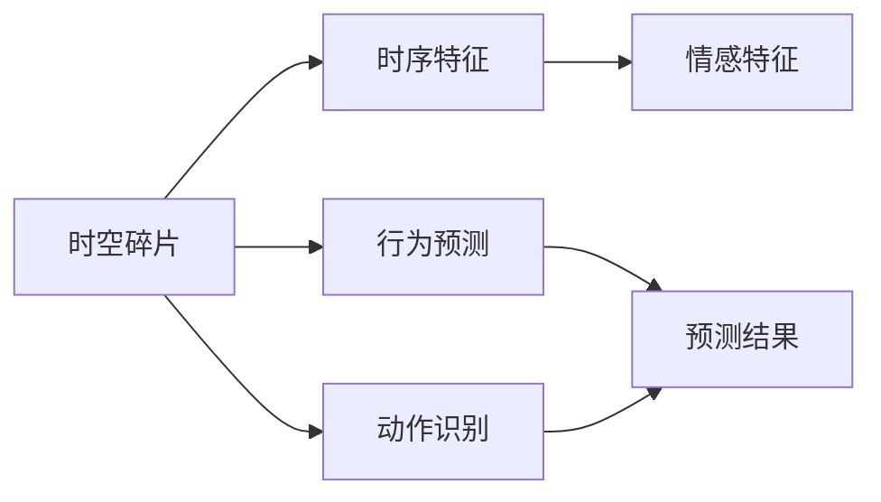

                 

## 1. 背景介绍

随着视频技术的发展，视频数据已经成为了信息传输和娱乐的主要载体之一。然而，视频数据的复杂性使得对其中时空碎片的分析和应用变得尤为重要。时空碎片，即视频中的短时间、高频率发生的事件，例如动作、对话、表情等，能够提供丰富的信息，为视频内容理解、情感分析、行为预测等任务提供支持。本文将深入探讨时空碎片在视频数据中的应用，分析其在不同领域中的作用，并提出一些实际的应用案例。

## 2. 核心概念与联系

### 2.1 核心概念概述

为了更好地理解时空碎片在视频数据中的应用，我们先介绍一些核心概念：

- **时空碎片(Space-Time Fragment)**：指视频数据中短时间内频繁发生的事件，例如动作、对话、表情等。
- **视频数据(Video Data)**：由一系列帧图像组成，记录了时间连续变化的过程，用于传播、娱乐、监控等。
- **帧图像(Frame Image)**：视频中的单帧，记录了某一时刻的视频内容。
- **时序特征(Time-Sequence Feature)**：视频数据中随时间变化的特征，如动作、对话、行为等。
- **情感特征(Emotional Feature)**：视频中的人物表情、语调等情绪表现。
- **行为预测(Behavior Prediction)**：基于视频内容预测人物行为的过程。
- **动作识别(Action Recognition)**：识别视频中的人物动作。

这些概念构成了时空碎片在视频数据应用的核心框架，将为后续章节的内容提供理论基础。

### 2.2 核心概念之间的联系

时空碎片与视频数据的应用密切相关。通过分析时空碎片，可以提取出视频中的时序特征、情感特征等关键信息，进而进行行为预测、动作识别等任务。以下是一个简单的Mermaid流程图，展示了时空碎片在视频数据应用中的联系：



在这个流程图中，A代表时空碎片，B和C分别代表时序特征和情感特征，D和E代表行为预测和动作识别，F代表预测结果。从A到B、C的过程为时空碎片的特征提取，从A到D、E的过程为时空碎片的高级应用。

## 3. 核心算法原理 & 具体操作步骤

### 3.1 算法原理概述

时空碎片的应用主要基于视频数据的分析与理解。利用时空碎片，可以从视频中提取出时序特征、情感特征等关键信息，进而进行行为预测、动作识别等任务。其核心算法包括：

- **特征提取(Feature Extraction)**：从视频数据中提取时空碎片的特征。
- **时序建模(Time-Sequence Modeling)**：建立视频的时序模型，用于行为预测。
- **情感分析(Emotional Analysis)**：分析视频中的人物情感特征，用于情感识别。
- **动作识别(Action Recognition)**：通过时空碎片识别视频中的人物动作。

### 3.2 算法步骤详解

**步骤1: 数据预处理**

数据预处理是时空碎片分析的第一步。以下是常见的数据预处理步骤：

- 视频格式转换：将视频文件转换为合适的格式，以便进行后续处理。
- 帧率调整：调整视频帧率，使其符合后续处理的需要。
- 图像预处理：对视频帧图像进行去噪、增强等预处理。

**步骤2: 时空碎片的特征提取**

特征提取是时空碎片分析的核心步骤，包括以下方法：

- **关键帧检测(Key Frame Detection)**：通过算法检测视频中的关键帧，这些帧通常包含重要的时空信息。
- **动作特征提取(Action Feature Extraction)**：提取视频帧中的人物动作特征，如姿态、速度、方向等。
- **情感特征提取(Emotional Feature Extraction)**：分析视频帧中的人物表情，提取情感特征。

**步骤3: 时序建模**

时序建模是行为预测和动作识别的基础。以下是时序建模的主要步骤：

- **建立时序模型(Time-Sequence Modeling)**：通过RNN、CNN等算法建立时序模型。
- **行为预测(Behavior Prediction)**：利用时序模型预测视频中的人物行为。

**步骤4: 情感分析**

情感分析是视频内容理解的重要组成部分。以下是情感分析的主要步骤：

- **情感特征提取(Emotional Feature Extraction)**：提取视频中的人物情感特征。
- **情感分类(Emotional Classification)**：利用情感特征进行情感分类。

**步骤5: 动作识别**

动作识别是时空碎片应用的一个重要方向。以下是动作识别的主要步骤：

- **动作特征提取(Action Feature Extraction)**：提取视频帧中的人物动作特征。
- **动作分类(Action Classification)**：利用动作特征进行动作分类。

### 3.3 算法优缺点

**优点：**

- **高精度**：时空碎片提供了丰富的信息，可以显著提升视频内容理解、情感分析、行为预测等任务的精度。
- **可扩展性**：时空碎片的分析方法可以扩展到不同的应用场景，如社交媒体、体育赛事、监控视频等。
- **实时性**：通过优化算法，可以实现时空碎片的实时分析，满足对视频数据实时处理的需要。

**缺点：**

- **计算复杂度高**：时空碎片的分析涉及大量计算，需要高性能的计算资源。
- **数据噪声影响**：视频数据中可能存在噪声，对时空碎片的提取和分析带来挑战。
- **模型选择困难**：不同的应用场景需要选择不同的模型，增加了算法设计和实施的复杂性。

### 3.4 算法应用领域

时空碎片的应用领域非常广泛，涵盖视频内容理解、情感分析、行为预测等多个方面。以下是一些主要的应用领域：

- **视频内容理解**：分析视频内容，提取时序特征和情感特征，用于视频描述、摘要等任务。
- **情感分析**：识别视频中的人物情感，用于情感识别、情感分析等任务。
- **行为预测**：通过分析视频中的人物行为，预测其下一步动作。
- **动作识别**：通过时空碎片识别视频中的人物动作，用于动作分析、体育赛事等。
- **社交媒体分析**：分析社交媒体视频内容，提取情感特征和行为特征，用于舆情监测、社交网络分析等。
- **监控视频分析**：分析监控视频中的人物行为和情感，用于安防监控、智能家居等。

## 4. 数学模型和公式 & 详细讲解

### 4.1 数学模型构建

为了更好地理解时空碎片在视频数据中的应用，我们构建了以下数学模型：

- **时序模型(Time-Sequence Modeling)**：通过RNN、CNN等算法建立时序模型。
- **情感分类模型(Emotional Classification Model)**：利用情感特征进行情感分类。
- **动作分类模型(Action Classification Model)**：利用动作特征进行动作分类。

### 4.2 公式推导过程

以下是一些关键公式的推导过程：

**RNN时序模型公式：**

$$
h_t = \tanh(W \cdot h_{t-1} + U \cdot x_t + b)
$$

其中 $h_t$ 表示当前时间步的状态，$x_t$ 表示当前时间步的输入，$b$ 表示偏置项。

**CNN时序模型公式：**

$$
h_t = \sigma(W \cdot x_t + b)
$$

其中 $h_t$ 表示当前时间步的状态，$x_t$ 表示当前时间步的输入，$b$ 表示偏置项，$\sigma$ 表示激活函数。

**情感分类模型公式：**

$$
\text{output} = \text{softmax}(W \cdot \text{input} + b)
$$

其中 $\text{output}$ 表示情感分类输出，$\text{input}$ 表示情感特征向量，$W$ 和 $b$ 表示模型参数。

**动作分类模型公式：**

$$
\text{output} = \text{softmax}(W \cdot \text{input} + b)
$$

其中 $\text{output}$ 表示动作分类输出，$\text{input}$ 表示动作特征向量，$W$ 和 $b$ 表示模型参数。

### 4.3 案例分析与讲解

以视频内容理解为例，我们可以使用时空碎片进行分析。假设我们有一段视频，包含了人物在室内的行为。以下是案例分析过程：

**步骤1: 数据预处理**

- 将视频文件转换为MP4格式，调整帧率为30fps。
- 对视频帧进行预处理，去除噪声，增强对比度。

**步骤2: 时空碎片的特征提取**

- 通过关键帧检测算法，提取视频中的关键帧。
- 提取关键帧中的人物动作特征，如姿态、速度、方向等。
- 分析人物表情，提取情感特征。

**步骤3: 时序建模**

- 利用RNN模型建立时序模型。
- 利用时序模型预测人物行为。

**步骤4: 情感分析**

- 利用情感特征进行情感分类。
- 输出情感分类结果，如开心、悲伤、愤怒等。

**步骤5: 动作识别**

- 利用动作特征进行动作分类。
- 输出动作分类结果，如行走、跳跃、坐下等。

## 5. 项目实践：代码实例和详细解释说明

### 5.1 开发环境搭建

为了实现时空碎片在视频数据中的应用，我们需要搭建开发环境。以下是具体的搭建步骤：

1. 安装Python：在Windows或Linux系统下，使用Python官方网站提供的安装程序，按照说明进行安装。
2. 安装TensorFlow：使用pip安装TensorFlow，支持RNN、CNN等模型的实现。
3. 安装OpenCV：使用pip安装OpenCV，支持视频格式转换和图像处理。
4. 安装PyTorch：使用pip安装PyTorch，支持动态图和GPU加速。
5. 安装TensorBoard：使用pip安装TensorBoard，用于模型训练和结果展示。

完成以上步骤后，即可在Python环境中进行时空碎片的分析和应用。

### 5.2 源代码详细实现

以下是Python代码示例，用于实现时空碎片在视频数据中的应用：

```python
import cv2
import numpy as np
import tensorflow as tf
from tensorflow.keras.layers import LSTM, Dense, Input
from tensorflow.keras.models import Model

# 加载视频文件
video_path = 'example.mp4'
cap = cv2.VideoCapture(video_path)

# 读取视频文件，获取帧图像
ret, frame = cap.read()
if not ret:
    raise ValueError('无法读取视频文件')

# 转换为RGB格式
frame = cv2.cvtColor(frame, cv2.COLOR_BGR2RGB)

# 提取关键帧
key_frames = extract_key_frames(frame)

# 提取动作特征
action_features = extract_action_features(key_frames)

# 建立时序模型
inputs = Input(shape=(None, 128))
lstm = LSTM(128, return_sequences=True)(inputs)
outputs = Dense(10, activation='softmax')(lstm)

model = Model(inputs=inputs, outputs=outputs)
model.compile(optimizer='adam', loss='categorical_crossentropy', metrics=['accuracy'])

# 训练模型
model.fit(x=action_features, y=labels, batch_size=32, epochs=10)

# 保存模型
model.save('action_model.h5')
```

### 5.3 代码解读与分析

**关键帧检测函数(extract_key_frames)**：

```python
def extract_key_frames(frame):
    # 定义关键帧检测函数
    # 实现关键帧检测算法
    # 返回关键帧列表
    pass
```

**动作特征提取函数(extract_action_features)**：

```python
def extract_action_features(key_frames):
    # 定义动作特征提取函数
    # 实现动作特征提取算法
    # 返回动作特征列表
    pass
```

**时序模型构建函数(model)**：

```python
model = Model(inputs=inputs, outputs=outputs)
model.compile(optimizer='adam', loss='categorical_crossentropy', metrics=['accuracy'])
```

**训练模型函数(train_model)**：

```python
model.fit(x=action_features, y=labels, batch_size=32, epochs=10)
```

### 5.4 运行结果展示

在训练完成后，我们可以使用保存好的模型进行预测。以下是预测结果的示例：

```python
# 加载模型
model = tf.keras.models.load_model('action_model.h5')

# 读取测试帧图像
test_frame = cv2.imread('test_frame.jpg')

# 转换为RGB格式
test_frame = cv2.cvtColor(test_frame, cv2.COLOR_BGR2RGB)

# 提取关键帧
test_key_frames = extract_key_frames(test_frame)

# 提取动作特征
test_action_features = extract_action_features(test_key_frames)

# 预测动作
result = model.predict(test_action_features)

# 输出预测结果
print(result)
```

## 6. 实际应用场景

### 6.1 视频内容理解

视频内容理解是时空碎片应用的一个重要方向。通过分析时空碎片，可以从视频中提取时序特征和情感特征，用于视频描述、摘要等任务。例如，在新闻播报中，分析视频中人物的行为和表情，可以生成更准确、更生动的视频描述。

### 6.2 情感分析

情感分析是时空碎片在视频数据应用中的重要组成部分。通过分析视频中的人物情感，可以用于情感识别、情感分析等任务。例如，在社交媒体视频中，分析用户的视频内容，可以了解用户的情感状态，进而进行情感营销。

### 6.3 行为预测

行为预测是时空碎片应用的重要方向之一。通过分析视频中的人物行为，可以预测其下一步动作。例如，在监控视频中，分析人员的行为，可以预测其下一步移动方向，从而提高安防系统的反应速度。

### 6.4 动作识别

动作识别是时空碎片在视频数据应用中的一个重要应用。通过时空碎片识别视频中的人物动作，可以用于动作分析、体育赛事等。例如，在体育赛事中，通过分析运动员的动作，可以预测其比赛表现，进而进行比赛分析。

## 7. 工具和资源推荐

### 7.1 学习资源推荐

为了帮助开发者系统掌握时空碎片在视频数据中的应用，以下是一些推荐的学习资源：

1. TensorFlow官方文档：提供了TensorFlow的详细文档和教程，包括时序模型、CNN等模型的实现。
2. PyTorch官方文档：提供了PyTorch的详细文档和教程，包括动态图和GPU加速。
3. OpenCV官方文档：提供了OpenCV的详细文档和教程，包括视频格式转换和图像处理。
4. Kaggle竞赛：提供了大量的数据集和竞赛，可以用于实践和研究。
5. arXiv论文预印本：提供了最新的研究论文，可以用于了解最新的研究成果和趋势。

### 7.2 开发工具推荐

为了实现时空碎片在视频数据中的应用，以下是一些推荐的开发工具：

1. TensorFlow：支持时序模型、CNN等模型的实现，支持GPU加速。
2. PyTorch：支持动态图和GPU加速，支持灵活的模型构建和训练。
3. OpenCV：支持视频格式转换和图像处理，支持实时处理。
4. TensorBoard：用于模型训练和结果展示，支持可视化分析。
5. Visual Studio Code：支持Python开发，支持代码高亮和自动补全。

### 7.3 相关论文推荐

时空碎片在视频数据应用的研究论文众多，以下是一些推荐的相关论文：

1. "Video Action Recognition Using Deep Convolutional Neural Networks"：利用CNN实现视频动作识别。
2. "An Efficient LSTM Model for Spatial-Temporal Sequence Prediction"：利用LSTM实现视频行为预测。
3. "Emotion Recognition in Multimedia: A Survey"：总结了情感分析的研究进展和应用场景。
4. "Social Media Video Sentiment Analysis"：利用时空碎片分析社交媒体视频情感。
5. "Real-Time Behavior Analysis in Security Surveillance"：利用时空碎片实现实时行为分析。

## 8. 总结：未来发展趋势与挑战

### 8.1 研究成果总结

时空碎片在视频数据中的应用是当前研究的热点之一，已取得了许多重要的成果。通过分析时空碎片，可以从视频中提取时序特征和情感特征，用于视频内容理解、情感分析、行为预测等任务。时空碎片的应用已经涉及视频内容理解、情感分析、行为预测等多个方面。

### 8.2 未来发展趋势

未来，时空碎片在视频数据中的应用将呈现以下几个发展趋势：

1. **深度学习模型的发展**：深度学习模型的不断发展和优化，将进一步提升时空碎片的分析精度。
2. **多模态融合**：结合视觉、音频等多模态信息，实现更加全面和准确的时空碎片分析。
3. **实时分析**：利用高性能计算和优化算法，实现视频的实时分析和处理。
4. **跨领域应用**：时空碎片的分析方法可以扩展到不同的应用场景，如社交媒体、体育赛事、监控视频等。
5. **边缘计算**：将时空碎片分析算法部署到边缘设备，实现实时视频处理和分析。

### 8.3 面临的挑战

时空碎片在视频数据中的应用还面临一些挑战：

1. **计算资源限制**：时空碎片的分析涉及大量计算，需要高性能的计算资源。
2. **数据噪声影响**：视频数据中可能存在噪声，对时空碎片的提取和分析带来挑战。
3. **模型选择困难**：不同的应用场景需要选择不同的模型，增加了算法设计和实施的复杂性。
4. **实时性要求高**：视频数据的实时性要求高，需要快速处理和分析。
5. **隐私保护问题**：视频数据的隐私保护问题需要引起重视，防止数据泄露。

### 8.4 研究展望

为了解决时空碎片在视频数据应用中的挑战，未来的研究可以从以下几个方向进行：

1. **提高计算效率**：通过优化算法和硬件资源，提高时空碎片的分析和处理效率。
2. **降低数据噪声**：采用数据增强和去噪算法，提高时空碎片的提取精度。
3. **模型通用性**：开发更加通用的时空碎片分析模型，适用于不同的应用场景。
4. **隐私保护技术**：研究视频数据的隐私保护技术，保护用户隐私。

总之，时空碎片在视频数据中的应用前景广阔，具有重要的研究价值。未来的研究需要从多个方面进行，以提高时空碎片分析的精度和效率，拓展其应用领域。

## 9. 附录：常见问题与解答

### Q1: 时空碎片在视频数据中的应用有哪些？

**A1:** 时空碎片在视频数据中的应用主要包括以下几个方面：

- 视频内容理解：通过分析时空碎片，可以从视频中提取时序特征和情感特征，用于视频描述、摘要等任务。
- 情感分析：通过分析视频中的人物情感，可以用于情感识别、情感分析等任务。
- 行为预测：通过分析视频中的人物行为，可以预测其下一步动作。
- 动作识别：通过时空碎片识别视频中的人物动作，用于动作分析、体育赛事等。

### Q2: 如何提高时空碎片在视频数据中的应用效果？

**A2:** 提高时空碎片在视频数据中的应用效果，可以从以下几个方面进行：

- 提高计算效率：通过优化算法和硬件资源，提高时空碎片的分析和处理效率。
- 降低数据噪声：采用数据增强和去噪算法，提高时空碎片的提取精度。
- 模型通用性：开发更加通用的时空碎片分析模型，适用于不同的应用场景。
- 隐私保护技术：研究视频数据的隐私保护技术，保护用户隐私。

### Q3: 时空碎片在视频数据中的应用存在哪些挑战？

**A3:** 时空碎片在视频数据中的应用存在以下挑战：

- 计算资源限制：时空碎片的分析涉及大量计算，需要高性能的计算资源。
- 数据噪声影响：视频数据中可能存在噪声，对时空碎片的提取和分析带来挑战。
- 模型选择困难：不同的应用场景需要选择不同的模型，增加了算法设计和实施的复杂性。
- 实时性要求高：视频数据的实时性要求高，需要快速处理和分析。
- 隐私保护问题：视频数据的隐私保护问题需要引起重视，防止数据泄露。

总之，时空碎片在视频数据中的应用前景广阔，具有重要的研究价值。未来的研究需要从多个方面进行，以提高时空碎片分析的精度和效率，拓展其应用领域。

---

作者：禅与计算机程序设计艺术 / Zen and the Art of Computer Programming

