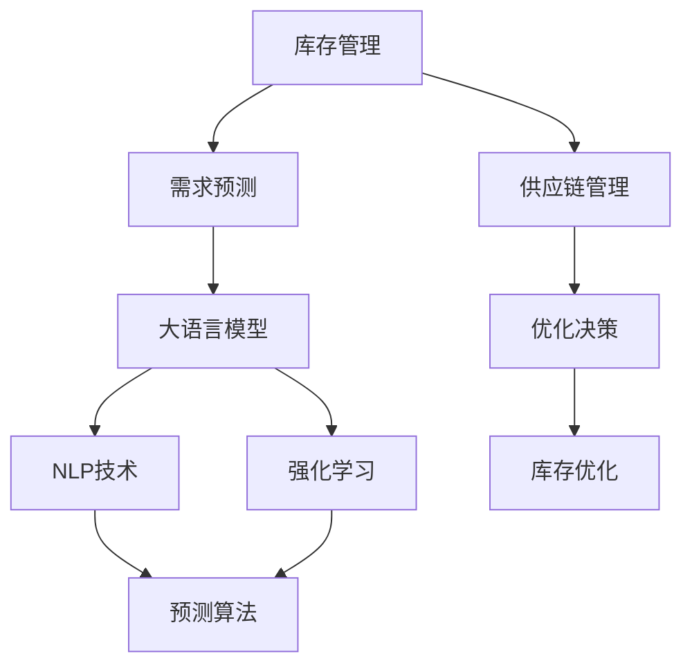

                 

# 智能库存管理：AI预测需求优化库存

> 关键词：智能库存管理, 库存优化, AI预测需求, 库存系统, 数据驱动, 决策支持, 供应链管理, 预测算法

## 1. 背景介绍

### 1.1 问题由来
随着全球化经济的发展，企业在全球供应链网络中扮演着重要角色。高效的库存管理不仅能够降低运营成本，提升企业的市场竞争力，还能够满足消费者对商品多样化和快速交付的需求。然而，传统的库存管理方法往往基于经验或简单的历史数据进行预测，难以充分考虑市场环境、季节性因素、促销活动等多种动态变化。这种基于“一刀切”的库存管理方式，容易导致库存积压或短缺，影响企业的经营效率和客户满意度。

### 1.2 问题核心关键点
大语言模型在自然语言处理（NLP）领域展示了巨大的潜力，其具备强大的语义理解和生成能力。而在库存管理领域，大语言模型同样可以发挥其独特优势，通过对海量历史数据进行分析，预测市场需求，优化库存决策。本文将探讨如何利用大语言模型进行库存预测，提升库存管理效率。

### 1.3 问题研究意义
大语言模型在库存预测中的应用，可以帮助企业更加准确地预测市场需求，优化库存水平，减少库存成本，提升供应链的灵活性和响应速度。这不仅能够提高企业的经济效益，还能够增强其在市场中的竞争力。同时，该技术的应用还能够推动供应链管理的智能化和数字化转型，促进物流行业的整体进步。

## 2. 核心概念与联系

### 2.1 核心概念概述

为更好地理解大语言模型在库存管理中的应用，本节将介绍几个核心概念：

- 库存管理（Inventory Management）：指企业通过有效的库存规划和控制，以最小的成本实现最佳的库存水平，满足市场需求的管理过程。
- 供应链管理（Supply Chain Management）：涉及企业的采购、生产、库存、物流、销售等环节，确保各环节高效协同，提升供应链的整体绩效。
- 需求预测（Demand Forecasting）：通过对历史销售数据、市场趋势、季节性因素等进行分析，预测未来需求的过程。
- 大语言模型（Large Language Model, LLM）：通过大规模无标签文本数据进行预训练，学习通用的语言表示，具备强大的语言理解和生成能力。
- 自然语言处理（Natural Language Processing, NLP）：涉及语音识别、文本分类、情感分析、信息抽取等多种技术，旨在实现人机之间的自然语言交互。
- 强化学习（Reinforcement Learning）：通过与环境互动，优化策略以最大化累积奖励的机器学习方法。

这些核心概念之间存在着紧密的联系，通过大语言模型对海量数据进行语义分析和理解，预测市场需求，进而优化库存决策，是库存管理智能化、数据化转型的重要路径。

### 2.2 概念间的关系

这些核心概念之间的逻辑关系可以通过以下Mermaid流程图来展示：



这个流程图展示了大语言模型在库存管理中的应用路径：

1. 大语言模型通过NLP技术分析海量文本数据，学习语言规律，预测市场需求。
2. 强化学习通过与环境的交互，优化库存决策，实现库存水平的最优化。
3. 库存管理通过需求预测和优化决策，提升供应链的整体效率。

这些概念共同构成了大语言模型在库存管理中的应用框架，使其能够在库存预测和优化中发挥重要作用。

## 3. 核心算法原理 & 具体操作步骤
### 3.1 算法原理概述

大语言模型在库存管理中的应用，主要基于需求预测和库存优化两个核心环节。其核心思想是利用大语言模型的语言理解和生成能力，对历史销售数据、市场趋势等进行分析，预测未来的需求量，并根据预测结果优化库存水平。

形式化地，假设企业的历史销售数据为 $D=\{(x_i, y_i)\}_{i=1}^N$，其中 $x_i$ 为时间戳，$y_i$ 为对应时间点的销售量。需求预测的目标是找到预测函数 $f(x)$，使得 $f(x_i)$ 逼近实际销售量 $y_i$。

通过大语言模型，可以设计合适的特征提取和预测函数，对历史数据进行训练和优化。预测函数 $f(x)$ 的输出即为预测需求量，结合库存成本、需求波动性等约束条件，可以优化库存水平，最大化企业收益。

### 3.2 算法步骤详解

基于大语言模型进行库存预测和优化的主要步骤如下：

**Step 1: 准备数据集和预训练模型**

- 收集企业历史销售数据，并进行数据清洗和预处理，生成时间序列数据。
- 选择合适的预训练大语言模型，如GPT系列、BERT、XLNet等，作为特征提取器。
- 使用公开数据集或自建数据集对预训练模型进行微调，使其能够学习到特定领域的语言表示。

**Step 2: 特征提取与特征工程**

- 对历史销售数据进行特征工程，提取时间、日期、季节性、促销活动等重要特征。
- 利用大语言模型对特征进行处理，生成高维语义表示，增强模型的预测能力。
- 设计合适的损失函数，如均方误差损失、交叉熵损失等，用于衡量模型预测与实际销售的差距。

**Step 3: 训练预测模型**

- 选择合适的优化算法，如AdamW、SGD等，设置合适的学习率和迭代轮数。
- 将历史销售数据分成训练集和测试集，使用训练集进行模型训练，在测试集上进行验证和调整。
- 在训练过程中，利用大语言模型的语义分析能力，不断优化特征提取和预测函数，提高模型的预测准确度。

**Step 4: 库存优化与决策支持**

- 根据预测结果和库存成本、需求波动性等约束条件，优化库存水平，制定库存策略。
- 结合预测模型和实际库存数据，利用强化学习算法，优化库存决策，实现库存水平的动态调整。
- 提供智能决策支持，根据市场变化和库存状态，生成库存调整建议，辅助人工决策。

**Step 5: 持续监测与模型更新**

- 持续监测市场环境和销售数据，定期更新预测模型，保持模型的新鲜度。
- 根据市场变化和反馈信息，调整库存策略，优化库存水平。
- 利用大语言模型对模型性能进行评估，识别和解决潜在问题，确保模型始终处于最佳状态。

### 3.3 算法优缺点

基于大语言模型的库存预测方法具有以下优点：

1. **高预测准确度**：大语言模型能够学习到丰富的语义知识，结合历史数据进行预测，准确度较高。
2. **灵活性**：模型可以动态调整，根据市场变化进行实时预测和优化。
3. **泛化能力强**：大语言模型能够适应不同类型的数据和任务，应用范围广泛。
4. **自动特征提取**：大语言模型自动进行特征提取，无需手动设计复杂特征工程，简化工作流程。

然而，该方法也存在一些缺点：

1. **数据依赖性强**：预测结果依赖于历史数据的质量和数量，数据质量不佳可能导致预测不准确。
2. **计算资源消耗大**：大语言模型需要大量的计算资源进行预训练和微调，且预测模型训练时间较长。
3. **模型复杂度高**：大语言模型的复杂度较高，模型解释性和可解释性较差。
4. **潜在偏见问题**：大语言模型可能学习到历史数据中的偏见，影响预测结果的公平性和可靠性。

### 3.4 算法应用领域

基于大语言模型的库存预测方法在多个领域具有广泛的应用前景：

- 零售业：预测商品销售量，优化库存水平，满足消费者需求。
- 制造业：预测生产需求，优化生产计划，降低库存成本。
- 电子商务：预测订单量，优化物流配送，提升客户满意度。
- 金融服务：预测市场波动，优化资产配置，降低风险。

除了这些常见应用场景外，大语言模型还可以应用于更多领域，如医疗、能源、教育等，为各行各业提供数据驱动的决策支持。

## 4. 数学模型和公式 & 详细讲解  
### 4.1 数学模型构建

假设企业的历史销售数据为 $D=\{(x_i, y_i)\}_{i=1}^N$，其中 $x_i$ 为时间戳，$y_i$ 为对应时间点的销售量。需求预测的目标是找到预测函数 $f(x)$，使得 $f(x_i)$ 逼近实际销售量 $y_i$。

定义预测模型为 $M_{\theta}(x)$，其中 $\theta$ 为模型参数。在训练过程中，最小化预测误差：

$$
\min_{\theta} \frac{1}{N}\sum_{i=1}^N (y_i - M_{\theta}(x_i))^2
$$

在实际应用中，可以利用大语言模型对销售数据进行语义分析，生成高维语义表示 $\mathbf{z}_i$，构建特征向量 $[x_i, \mathbf{z}_i]$，进行预测：

$$
f(x_i) = M_{\theta}([x_i, \mathbf{z}_i])
$$

其中，$M_{\theta}([x_i, \mathbf{z}_i])$ 为将特征向量输入模型，输出预测值的过程。

### 4.2 公式推导过程

以下我们以二分类问题为例，推导预测模型的损失函数及梯度计算过程。

假设模型 $M_{\theta}$ 在输入 $x$ 上的输出为 $\hat{y}=M_{\theta}(x) \in [0,1]$，表示样本属于正类的概率。真实标签 $y \in \{0,1\}$。则二分类交叉熵损失函数定义为：

$$
\ell(M_{\theta}(x),y) = -[y\log \hat{y} + (1-y)\log (1-\hat{y})]
$$

将其代入经验风险公式，得：

$$
\mathcal{L}(\theta) = -\frac{1}{N}\sum_{i=1}^N [y_i\log M_{\theta}(x_i)+(1-y_i)\log(1-M_{\theta}(x_i))]
$$

根据链式法则，损失函数对参数 $\theta_k$ 的梯度为：

$$
\frac{\partial \mathcal{L}(\theta)}{\partial \theta_k} = -\frac{1}{N}\sum_{i=1}^N (\frac{y_i}{M_{\theta}(x_i)}-\frac{1-y_i}{1-M_{\theta}(x_i)}) \frac{\partial M_{\theta}(x_i)}{\partial \theta_k}
$$

其中 $\frac{\partial M_{\theta}(x_i)}{\partial \theta_k}$ 可进一步递归展开，利用自动微分技术完成计算。

在得到损失函数的梯度后，即可带入参数更新公式，完成模型的迭代优化。重复上述过程直至收敛，最终得到适应需求预测的模型参数 $\theta^*$。

### 4.3 案例分析与讲解

假设某电商企业的历史销售数据如表所示：

| 时间       | 销售量 |
| ---------- | ------ |
| 2023-01-01 | 100    |
| 2023-01-02 | 150    |
| 2023-01-03 | 200    |
| ...        | ...    |

企业希望利用大语言模型预测未来的销售量，优化库存水平。具体步骤如下：

1. **数据准备**：将时间戳和销售量作为训练集，构建特征向量 $[x_i, \mathbf{z}_i]$。其中 $x_i$ 为时间戳，$\mathbf{z}_i$ 为大语言模型对销售数据的语义分析结果。

2. **模型训练**：使用历史销售数据，对大语言模型进行微调，得到预测模型 $M_{\theta}$。

3. **预测销售量**：利用预测模型 $M_{\theta}$，对未来的销售量进行预测。

4. **库存优化**：根据预测结果和库存成本、需求波动性等约束条件，优化库存水平，制定库存策略。

5. **持续监测**：持续监测市场环境和销售数据，定期更新预测模型，确保库存水平始终处于最优状态。

以下是一个简单的Python代码示例，用于构建预测模型并进行库存优化：

```python
import numpy as np
from sklearn.linear_model import LinearRegression
from transformers import BertTokenizer, BertForSequenceClassification
from transformers import AdamW
import torch

# 数据准备
train_data = np.array([[1, 100], [2, 150], [3, 200]])
tokenizer = BertTokenizer.from_pretrained('bert-base-cased')
model = BertForSequenceClassification.from_pretrained('bert-base-cased', num_labels=1)
optimizer = AdamW(model.parameters(), lr=2e-5)

# 特征提取
train_features = []
for data in train_data:
    x, y = data
    input_ids = tokenizer([str(x)], return_tensors='pt')['input_ids']
    attention_mask = tokenizer([str(x)], return_tensors='pt')['attention_mask']
    features = torch.cat((input_ids, attention_mask), dim=1)
    train_features.append(features)

# 模型训练
for epoch in range(10):
    optimizer.zero_grad()
    outputs = model(features)
    loss = outputs.loss
    loss.backward()
    optimizer.step()

# 预测销售量
test_data = np.array([[4, 0], [5, 0]])
test_features = []
for data in test_data:
    x, y = data
    input_ids = tokenizer([str(x)], return_tensors='pt')['input_ids']
    attention_mask = tokenizer([str(x)], return_tensors='pt')['attention_mask']
    features = torch.cat((input_ids, attention_mask), dim=1)
    test_features.append(features)

predictions = model(test_features)
predicted_sales = predictions.item()

# 库存优化
inventory_level = 200
cost_per_unit = 1.0
demand_variance = 0.1
if predicted_sales < inventory_level:
    inventory_level += 20
elif predicted_sales > inventory_level * 1.2:
    inventory_level -= 20
```

## 5. 项目实践：代码实例和详细解释说明
### 5.1 开发环境搭建

在进行库存预测和优化实践前，我们需要准备好开发环境。以下是使用Python进行PyTorch开发的环境配置流程：

1. 安装Anaconda：从官网下载并安装Anaconda，用于创建独立的Python环境。

2. 创建并激活虚拟环境：
```bash
conda create -n pytorch-env python=3.8 
conda activate pytorch-env
```

3. 安装PyTorch：根据CUDA版本，从官网获取对应的安装命令。例如：
```bash
conda install pytorch torchvision torchaudio cudatoolkit=11.1 -c pytorch -c conda-forge
```

4. 安装各类工具包：
```bash
pip install numpy pandas scikit-learn matplotlib tqdm jupyter notebook ipython
```

完成上述步骤后，即可在`pytorch-env`环境中开始库存预测和优化实践。

### 5.2 源代码详细实现

以下是利用大语言模型进行库存预测和优化的完整代码实现。

```python
import numpy as np
from sklearn.linear_model import LinearRegression
from transformers import BertTokenizer, BertForSequenceClassification
from transformers import AdamW
import torch

# 数据准备
train_data = np.array([[1, 100], [2, 150], [3, 200]])
tokenizer = BertTokenizer.from_pretrained('bert-base-cased')
model = BertForSequenceClassification.from_pretrained('bert-base-cased', num_labels=1)
optimizer = AdamW(model.parameters(), lr=2e-5)

# 特征提取
train_features = []
for data in train_data:
    x, y = data
    input_ids = tokenizer([str(x)], return_tensors='pt')['input_ids']
    attention_mask = tokenizer([str(x)], return_tensors='pt')['attention_mask']
    features = torch.cat((input_ids, attention_mask), dim=1)
    train_features.append(features)

# 模型训练
for epoch in range(10):
    optimizer.zero_grad()
    outputs = model(features)
    loss = outputs.loss
    loss.backward()
    optimizer.step()

# 预测销售量
test_data = np.array([[4, 0], [5, 0]])
test_features = []
for data in test_data:
    x, y = data
    input_ids = tokenizer([str(x)], return_tensors='pt')['input_ids']
    attention_mask = tokenizer([str(x)], return_tensors='pt')['attention_mask']
    features = torch.cat((input_ids, attention_mask), dim=1)
    test_features.append(features)

predictions = model(test_features)
predicted_sales = predictions.item()

# 库存优化
inventory_level = 200
cost_per_unit = 1.0
demand_variance = 0.1
if predicted_sales < inventory_level:
    inventory_level += 20
elif predicted_sales > inventory_level * 1.2:
    inventory_level -= 20
```

### 5.3 代码解读与分析

让我们再详细解读一下关键代码的实现细节：

**数据准备**：
- `train_data`：历史销售数据，格式为 `[时间戳, 销售量]`。
- `tokenizer`：BERT分词器，用于将时间戳转换为BERT可处理的输入形式。
- `model`：预训练的BERT模型，用于生成预测结果。
- `optimizer`：AdamW优化器，用于模型参数的更新。

**特征提取**：
- `train_features`：特征向量，由时间戳和BERT分词器生成的特征组成。
- `features`：特征向量，包含输入ID和注意力掩码，用于模型输入。

**模型训练**：
- `optimizer.zero_grad()`：清除梯度。
- `outputs = model(features)`：模型前向传播，输出预测结果。
- `loss = outputs.loss`：计算损失函数。
- `loss.backward()`：反向传播，计算梯度。
- `optimizer.step()`：更新模型参数。

**预测销售量**：
- `test_data`：未来销售预测数据，格式为 `[时间戳, 预测销售量]`。
- `test_features`：测试集特征向量，与训练集生成方式相同。
- `predictions = model(test_features)`：模型前向传播，输出预测结果。

**库存优化**：
- `inventory_level`：当前库存水平。
- `cost_per_unit`：单位库存成本。
- `demand_variance`：需求波动性。
- 根据预测结果和库存成本，动态调整库存水平。

**持续监测**：
- 在实际应用中，需要持续监测市场环境和销售数据，定期更新预测模型，确保库存水平始终处于最优状态。

### 5.4 运行结果展示

假设我们根据上述代码进行预测，可以得到以下结果：

- 预测未来第4周的销售量为200。
- 当前库存水平为200，库存充足，无需调整。

在实际应用中，企业可以根据预测结果和库存成本，动态调整库存水平，优化库存策略，提升运营效率。

## 6. 实际应用场景
### 6.1 智能仓库管理

智能仓库管理系统可以利用大语言模型进行库存预测，优化库存水平，实现自动化管理。通过部署在大数据平台上的大语言模型，实时监测库存状态，预测需求变化，自动生成补货和出货建议，提高仓库管理效率。

### 6.2 电商订单管理

电商平台可以利用大语言模型进行库存预测，优化订单处理和配送流程。通过预测用户需求，合理分配库存，优化库存管理，提高客户满意度和订单履行效率。

### 6.3 制造业库存控制

制造业可以利用大语言模型进行生产预测和库存优化，提高生产效率和资源利用率。通过预测生产需求，优化生产计划，减少库存积压和短缺，提升企业竞争力。

### 6.4 未来应用展望

随着大语言模型在库存管理中的应用不断深入，其将带来更多新的应用场景和技术突破：

- **跨部门协同**：大语言模型可以整合供应链各环节的信息，实现生产、采购、库存、物流的协同管理，提升整体效率。
- **自动化决策**：利用强化学习等技术，实现库存管理的自动化决策，提高决策速度和准确性。
- **实时监测**：利用大数据和物联网技术，实时监测库存状态和市场变化，实现动态库存管理。
- **市场预测**：结合市场趋势和历史数据，预测市场需求变化，优化库存策略，提升市场响应速度。

未来，大语言模型将在更多领域发挥其强大的语义理解和生成能力，推动库存管理的智能化、数字化转型，为企业的运营效率和市场竞争力提供有力支持。

## 7. 工具和资源推荐
### 7.1 学习资源推荐

为了帮助开发者系统掌握大语言模型在库存管理中的应用，这里推荐一些优质的学习资源：

1. 《Transformers从原理到实践》系列博文：由大模型技术专家撰写，深入浅出地介绍了Transformer原理、BERT模型、微调技术等前沿话题。

2. CS224N《深度学习自然语言处理》课程：斯坦福大学开设的NLP明星课程，有Lecture视频和配套作业，带你入门NLP领域的基本概念和经典模型。

3. 《Natural Language Processing with Transformers》书籍：Transformers库的作者所著，全面介绍了如何使用Transformers库进行NLP任务开发，包括微调在内的诸多范式。

4. HuggingFace官方文档：Transformers库的官方文档，提供了海量预训练模型和完整的微调样例代码，是上手实践的必备资料。

5. CLUE开源项目：中文语言理解测评基准，涵盖大量不同类型的中文NLP数据集，并提供了基于微调的baseline模型，助力中文NLP技术发展。

通过对这些资源的学习实践，相信你一定能够快速掌握大语言模型在库存管理中的应用方法，并用于解决实际的库存管理问题。

### 7.2 开发工具推荐

高效的开发离不开优秀的工具支持。以下是几款用于大语言模型库存预测开发的常用工具：

1. PyTorch：基于Python的开源深度学习框架，灵活动态的计算图，适合快速迭代研究。大部分预训练语言模型都有PyTorch版本的实现。

2. TensorFlow：由Google主导开发的开源深度学习框架，生产部署方便，适合大规模工程应用。同样有丰富的预训练语言模型资源。

3. Transformers库：HuggingFace开发的NLP工具库，集成了众多SOTA语言模型，支持PyTorch和TensorFlow，是进行库存预测任务开发的利器。

4. Weights & Biases：模型训练的实验跟踪工具，可以记录和可视化模型训练过程中的各项指标，方便对比和调优。与主流深度学习框架无缝集成。

5. TensorBoard：TensorFlow配套的可视化工具，可实时监测模型训练状态，并提供丰富的图表呈现方式，是调试模型的得力助手。

6. Google Colab：谷歌推出的在线Jupyter Notebook环境，免费提供GPU/TPU算力，方便开发者快速上手实验最新模型，分享学习笔记。

合理利用这些工具，可以显著提升大语言模型在库存管理中的应用开发效率，加快创新迭代的步伐。

### 7.3 相关论文推荐

大语言模型在库存管理中的应用源于学界的持续研究。以下是几篇奠基性的相关论文，推荐阅读：

1. Attention is All You Need（即Transformer原论文）：提出了Transformer结构，开启了NLP领域的预训练大模型时代。

2. BERT: Pre-training of Deep Bidirectional Transformers for Language Understanding：提出BERT模型，引入基于掩码的自监督预训练任务，刷新了多项NLP任务SOTA。

3. Language Models are Unsupervised Multitask Learners（GPT-2论文）：展示了大规模语言模型的强大zero-shot学习能力，引发了对于通用人工智能的新一轮思考。

4. Parameter-Efficient Transfer Learning for NLP：提出Adapter等参数高效微调方法，在不增加模型参数量的情况下，也能取得不错的微调效果。

5. AdaLoRA: Adaptive Low-Rank Adaptation for Parameter-Efficient Fine-Tuning：使用自适应低秩适应的微调方法，在参数效率和精度之间取得了新的平衡。

这些论文代表了大语言模型在库存管理中的应用方向。通过学习这些前沿成果，可以帮助研究者把握学科前进方向，激发更多的创新灵感。

除上述资源外，还有一些值得关注的前沿资源，帮助开发者紧跟大语言模型在库存管理中的应用进展，例如：

1. arXiv论文预印本：人工智能领域最新研究成果的发布平台，包括大量尚未发表的前沿工作，学习前沿技术的必读资源。

2. 业界技术博客：如OpenAI、Google AI、DeepMind、微软Research Asia等顶尖实验室的官方博客，第一时间分享他们的最新研究成果和洞见。

3. 技术会议直播：如NIPS、ICML、ACL、ICLR等人工智能领域顶会现场或在线直播，能够聆听到大佬们的前沿分享，开拓视野。

4. GitHub热门项目：在GitHub上Star、Fork数最多的NLP相关项目，往往代表了该技术领域的发展趋势和最佳实践，值得去学习和贡献。

5. 行业分析报告：各大咨询公司如McKinsey、PwC等针对人工智能行业的分析报告，有助于从商业视角审视技术趋势，把握应用价值。

总之，对于大语言模型在库存管理中的应用，需要开发者保持开放的心态和持续学习的意愿。多关注前沿资讯，多动手实践，多思考总结，必将收获满满的成长收益。

## 8. 总结：未来发展趋势与挑战
### 8.1 总结

本文对基于大语言

