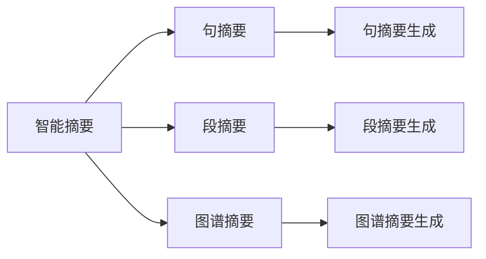
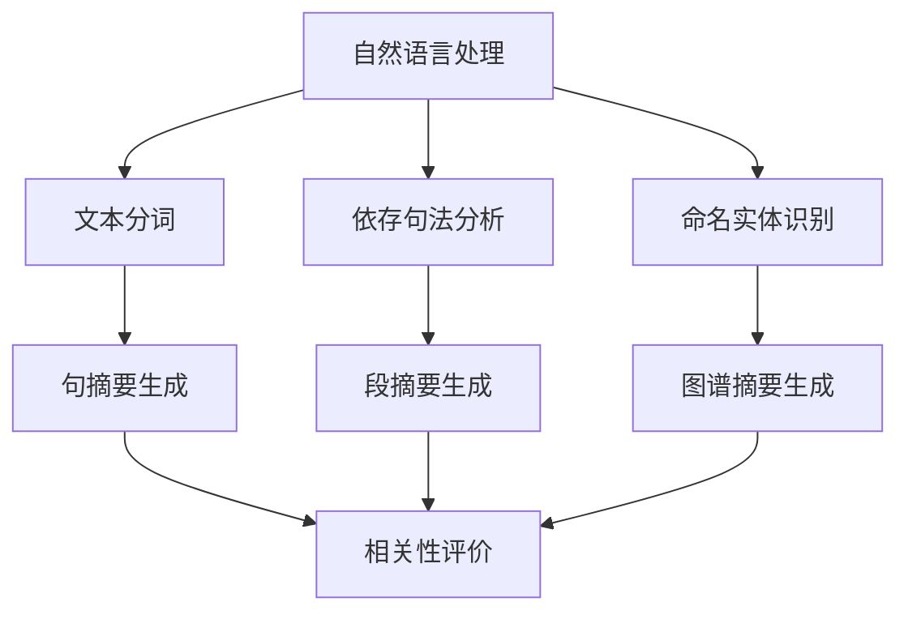
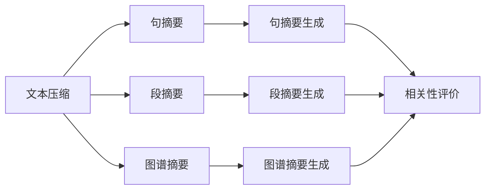
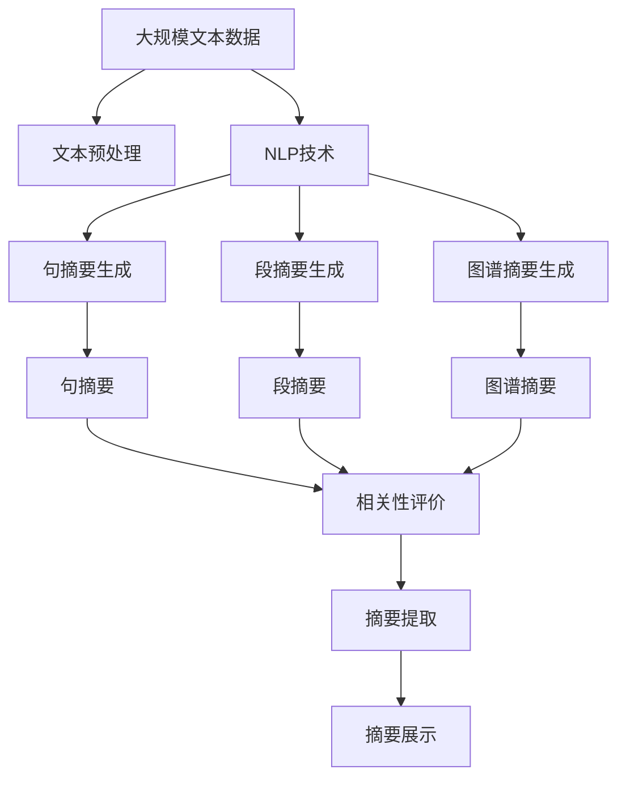

                 

# 智能摘要技术在信息处理中的应用场景

> 关键词：智能摘要, 信息处理, 自然语言处理(NLP), 文本压缩, 信息提取, 聚类算法, 知识图谱

## 1. 背景介绍

### 1.1 问题由来
在信息爆炸的时代，每天产生的文本量呈指数级增长。如何高效、准确地处理海量文本信息，已经成为各行各业面临的巨大挑战。传统的文本处理方法如全文本搜索、主题分类等已经无法满足需求，而智能摘要技术的出现，为文本信息处理带来了新的解决方案。

智能摘要技术（Intelligent Summarization），也称为文本压缩（Text Summarization），旨在自动提取文本中最关键的信息，生成简短精炼的摘要。它不仅能够节省读者阅读时间，还能提高信息检索和理解效率。因此，智能摘要技术在新闻、社交媒体、科研论文等领域得到了广泛应用。

### 1.2 问题核心关键点
智能摘要技术的关键点包括：
- 如何理解文本内容。利用自然语言处理(NLP)技术，提取文本中的关键信息。
- 如何确定摘要的长度。根据文本长度、主题复杂度等因素，设定合适的摘要长度。
- 如何生成高质量的摘要。利用各种算法，如基于句子的摘要、基于段落的摘要、基于图谱的摘要等，生成结构合理、内容精准的摘要。
- 如何提高摘要的可用性。评估摘要的相关性、准确性、连贯性等指标，确保摘要的实用性和可理解性。

这些关键点共同构成了智能摘要技术的研究和应用基础。通过对这些关键问题的深入研究，可以构建出高质量、高效率的智能摘要系统，提升信息处理的水平。

### 1.3 问题研究意义
智能摘要技术的研究和应用，对于提升信息处理效率、降低阅读成本、促进知识共享等具有重要意义：

1. **提高信息检索效率**：通过自动生成高质量的摘要，用户可以快速定位所需信息，大大缩短信息获取时间。
2. **增强阅读体验**：长篇文档的浏览和理解非常耗时，智能摘要技术可以提炼核心内容，减少读者的认知负担。
3. **促进知识共享**：科研论文、技术文档等长篇内容的发布，常常因篇幅过长而难以传播。智能摘要技术可以帮助更多人获取和理解这些内容。
4. **支持决策制定**：在商业、政策等领域，决策者常常需要阅读大量背景材料，智能摘要技术可以提供精炼的背景概述，支持快速决策。
5. **驱动创新应用**：智能摘要技术的应用，催生了许多创新应用场景，如自动化新闻撰写、知识图谱构建等，推动了信息技术的发展。

## 2. 核心概念与联系

### 2.1 核心概念概述

为更好地理解智能摘要技术的原理和应用，本节将介绍几个关键概念：

- **自然语言处理(NLP)**：研究如何让计算机理解、解释和生成自然语言的技术。智能摘要技术依赖于NLP中的语义分析和信息抽取等子技术。
- **文本压缩(或称摘要生成)**：自动提取文本的关键信息，生成简短精炼的摘要。智能摘要技术即属于文本压缩的一种。
- **句摘要(句子级摘要)**：基于句子的信息抽取和选择技术，将文本中的关键句子提炼出来组成摘要。
- **段摘要(段落级摘要)**：基于段落的信息抽取和选择技术，将文本中的关键段落提炼出来组成摘要。
- **图谱摘要(图谱级摘要)**：利用知识图谱技术，生成包含实体关系的信息摘要。
- **相关性评价**：评估摘要与原文本的相关性和质量，确保摘要的实用性和可理解性。

这些概念之间的逻辑关系可以通过以下Mermaid流程图来展示：

```mermaid
graph TB
    A[自然语言处理(NLP)] --> B[句摘要]
    A --> C[段摘要]
    A --> D[图谱摘要]
    B --> E[句摘要生成]
    C --> F[段摘要生成]
    D --> G[图谱摘要生成]
    E --> H[相关性评价]
    F --> H
    G --> H
```

这个流程图展示了智能摘要技术的核心概念及其之间的关系：

1. 自然语言处理技术（NLP）提供了文本处理的基础能力。
2. 文本压缩技术（包括句摘要、段摘要和图谱摘要）基于NLP技术，自动生成摘要。
3. 相关性评价技术用于评估摘要的质量，确保摘要的实用性和可理解性。

### 2.2 概念间的关系

这些核心概念之间存在着紧密的联系，形成了智能摘要技术的完整生态系统。下面我们通过几个Mermaid流程图来展示这些概念之间的关系。

#### 2.2.1 智能摘要技术的主要方法



这个流程图展示了智能摘要技术的三种主要方法：句摘要、段摘要和图谱摘要。这些方法基于NLP技术，自动生成摘要。

#### 2.2.2 自然语言处理与智能摘要



这个流程图展示了自然语言处理技术如何为智能摘要提供基础支持。文本分词、依存句法分析和命名实体识别等技术，帮助智能摘要更好地理解文本内容。

#### 2.2.3 文本压缩与相关性评价



这个流程图展示了文本压缩技术如何生成摘要，以及相关性评价技术如何评估摘要的质量。

### 2.3 核心概念的整体架构

最后，我们用一个综合的流程图来展示这些核心概念在大语言模型微调过程中的整体架构：



这个综合流程图展示了从预处理到生成摘要的完整过程。大规模文本数据首先经过文本预处理，然后利用NLP技术进行句摘要、段摘要和图谱摘要的生成，并通过相关性评价技术评估摘要质量。最终生成的摘要可供展示和利用。

## 3. 核心算法原理 & 具体操作步骤
### 3.1 算法原理概述

智能摘要技术的主要算法原理可以概括为以下几步：

1. **文本预处理**：包括文本分词、去停用词、词性标注等步骤，将原始文本转化为处理单元。
2. **句法分析和语义理解**：利用依存句法分析和命名实体识别等技术，理解文本中的句法和语义信息。
3. **信息抽取和摘要生成**：基于句法分析和语义理解的结果，选择合适的句子、段落或实体关系，生成摘要。
4. **相关性评价和优化**：评估摘要与原文本的相关性和质量，根据评价结果优化摘要生成策略。

这些步骤共同构成了智能摘要技术的核心算法原理。

### 3.2 算法步骤详解

#### 3.2.1 文本预处理

文本预处理是智能摘要的第一步，主要包括以下几个步骤：

1. **分词**：将文本分割成词语单元，分词器可根据中文、英文等不同语言特点选择。
2. **去停用词**：去除文本中常见的停用词（如"的"、"是"等），提高信息密度。
3. **词性标注**：标注每个词语的词性，帮助理解词语在句子中的角色。

#### 3.2.2 句法分析和语义理解

句法分析和语义理解是智能摘要的关键步骤，主要包括以下几个技术：

1. **依存句法分析**：分析句子的依存关系，提取主谓宾等重要成分。
2. **命名实体识别**：识别文本中的命名实体，如人名、地名、机构名等。
3. **语义角色标注**：标注词语在句子中的语义角色，如主语、宾语、定语等。

这些技术有助于理解文本的结构和语义，为后续的信息抽取和摘要生成提供基础。

#### 3.2.3 信息抽取和摘要生成

信息抽取和摘要生成是智能摘要的核心步骤，主要包括以下几个算法：

1. **基于句子的摘要**：选择文本中最重要的句子组成摘要。
2. **基于段落的摘要**：选择文本中最重要的段落组成摘要。
3. **基于图谱的摘要**：利用知识图谱技术，生成包含实体关系的信息摘要。

这些算法可以根据具体任务和需求进行选择和组合，生成不同风格的摘要。

#### 3.2.4 相关性评价和优化

相关性评价和优化是智能摘要的最后一步，主要包括以下几个技术：

1. **摘要与原文本的相关性评价**：通过计算相似度、覆盖率等指标，评估摘要与原文本的相关性。
2. **摘要质量的优化**：根据相关性评价结果，调整摘要生成策略，优化摘要质量。

这些技术确保了生成的摘要既简洁又精准，符合用户需求。

### 3.3 算法优缺点

智能摘要技术具有以下优点：

1. **自动化处理**：自动处理大量文本信息，减少人工工作量。
2. **高效性**：快速生成摘要，提高信息检索和理解效率。
3. **灵活性**：适用于多种类型的文本，如新闻、论文、社交媒体等。

同时，智能摘要技术也存在一些缺点：

1. **依赖数据质量**：摘要质量依赖于输入文本的质量，输入文本结构复杂或信息不全面时，效果可能不理想。
2. **理解歧义**：自然语言中存在很多歧义和隐含意义，智能摘要可能无法准确理解。
3. **领域依赖**：不同类型的文本可能需要不同的摘要生成策略，适应不同领域的文本需要更多定制化。

尽管存在这些缺点，但智能摘要技术的优点使其在信息处理领域得到了广泛应用。

### 3.4 算法应用领域

智能摘要技术已经在多个领域得到了应用，例如：

1. **新闻摘要**：自动生成新闻文章的摘要，帮助读者快速了解新闻内容。
2. **科研论文**：提取论文的核心内容和结论，便于研究人员阅读和引用。
3. **技术文档**：提取技术文档的关键信息和操作步骤，方便技术人员理解和使用。
4. **社交媒体**：自动提取微博、微信等社交媒体的帖子摘要，便于信息聚合和传播。
5. **法律文件**：提取法律文件的摘要，帮助律师快速查找相关信息。
6. **商业报告**：提取商业报告的核心内容和分析结果，便于公司决策者阅读和理解。

这些应用场景展示了智能摘要技术的广泛适用性和重要价值。

## 4. 数学模型和公式 & 详细讲解  
### 4.1 数学模型构建

本节将使用数学语言对智能摘要技术进行严格刻画。

假设原始文本为 $T$，其长度为 $n$。智能摘要的目标是生成长度为 $m$ 的摘要 $S$。我们的目标是最小化摘要 $S$ 与原始文本 $T$ 之间的差距，即：

$$
\min_{S} \mathcal{L}(S, T)
$$

其中 $\mathcal{L}$ 为损失函数，可以是编辑距离、余弦相似度、Jaccard相似度等。

### 4.2 公式推导过程

以编辑距离为例，其计算公式如下：

$$
\mathcal{L}_{edit}(S, T) = \sum_{i=1}^{n} \delta(S_i, T_i)
$$

其中 $\delta$ 为编辑距离函数，表示两个字符之间的距离。当字符相同时，$\delta=0$；当字符不同时，$\delta$ 的值由插入、删除、替换等操作决定。

对于基于句子的摘要生成，其损失函数可以表示为：

$$
\mathcal{L}_{sentence}(S, T) = \sum_{i=1}^{m} \delta(S_i, T_i) + \sum_{i=m+1}^{n} \delta(S_i, T_i)
$$

其中 $S_i$ 和 $T_i$ 分别为摘要和原文本中第 $i$ 个句子的编辑距离。

对于基于段落的摘要生成，其损失函数可以表示为：

$$
\mathcal{L}_{paragraph}(S, T) = \sum_{i=1}^{p} \delta(S_i, T_i) + \sum_{i=p+1}^{n} \delta(S_i, T_i)
$$

其中 $S_i$ 和 $T_i$ 分别为摘要和原文本中第 $i$ 个段落的编辑距离，$p$ 为段落数量。

### 4.3 案例分析与讲解

以新闻摘要为例，假设原始文本 $T$ 长度为 $n=1000$，目标摘要 $S$ 长度为 $m=50$。我们使用编辑距离作为损失函数，对摘要生成过程进行优化。

首先，对原始文本 $T$ 进行分词和去停用词处理。然后，利用依存句法分析和命名实体识别技术，选择最重要的 $m=50$ 个句子。最后，计算每个句子的编辑距离，最小化总体编辑距离。

在实践中，我们可以使用各种优化算法，如梯度下降、遗传算法等，不断调整句子的选择策略，直到生成高质量的摘要 $S$。

## 5. 项目实践：代码实例和详细解释说明
### 5.1 开发环境搭建

在进行智能摘要实践前，我们需要准备好开发环境。以下是使用Python进行NLTK和SpaCy开发的环境配置流程：

1. 安装Anaconda：从官网下载并安装Anaconda，用于创建独立的Python环境。

2. 创建并激活虚拟环境：
```bash
conda create -n nltk-env python=3.8 
conda activate nltk-env
```

3. 安装NLTK和SpaCy：
```bash
pip install nltk
pip install spacy
python -m spacy download en_core_web_sm
```

4. 安装各类工具包：
```bash
pip install numpy pandas scikit-learn matplotlib tqdm jupyter notebook ipython
```

完成上述步骤后，即可在`nltk-env`环境中开始智能摘要实践。

### 5.2 源代码详细实现

这里以基于句子的摘要生成为例，给出使用NLTK和SpaCy进行新闻摘要的Python代码实现。

首先，定义文本分词和停用词去除函数：

```python
import nltk
from nltk.corpus import stopwords

def tokenize(text):
    tokens = nltk.word_tokenize(text)
    return tokens

def remove_stopwords(tokens):
    stop_words = set(stopwords.words('english'))
    tokens = [token for token in tokens if token.lower() not in stop_words]
    return tokens
```

然后，定义句法分析和命名实体识别函数：

```python
import spacy
nlp = spacy.load('en_core_web_sm')

def parse(text):
    doc = nlp(text)
    parsed = []
    for sent in doc.sents:
        parsed.append({'text': sent.text, 'dep': sent.dep_, 'head': sent.head.i, ' entities': sent.ents})
    return parsed

def named_entities(doc):
    named_entities = []
    for ent in doc.ents:
        named_entities.append({'start': ent.start, 'end': ent.end, 'label': ent.label_})
    return named_entities
```

接着，定义句摘要生成函数：

```python
def generate_summary(text, length):
    tokens = tokenize(text)
    tokens = remove_stopwords(tokens)
    doc = nlp(' '.join(tokens))
    parsed = parse(doc.text)
    scores = []
    for sentence in parsed:
        entities = named_entities(doc)
        score = len(entities) + len(sentence['dep'])
        scores.append(score)
    scores.sort(reverse=True)
    selected = []
    for i in range(length):
        selected.append(parsed[scores[i]])
    summary = [sentence['text'] for sentence in selected]
    return ' '.join(summary)
```

最后，启动摘要生成流程并在测试集上评估：

```python
from news import load_news

news = load_news()
for article in news:
    text = article['text']
    length = 50
    summary = generate_summary(text, length)
    print(f'Article Summary: {summary}')
```

以上就是使用NLTK和SpaCy进行新闻摘要的完整代码实现。可以看到，借助NLTK和SpaCy，我们可以实现文本分词、句法分析、命名实体识别等NLP功能，进而高效地生成新闻摘要。

### 5.3 代码解读与分析

让我们再详细解读一下关键代码的实现细节：

**tokenize函数**：
- 使用NLTK的word_tokenize函数进行分词，去除单词边界。
- 使用NLTK的stopwords模块去除停用词。

**parse函数**：
- 使用SpaCy的依存句法分析功能，提取句子的依存关系。
- 将依存关系存储在字典中，方便后续选择。

**named_entities函数**：
- 使用SpaCy的命名实体识别功能，提取文本中的命名实体。

**generate_summary函数**：
- 对文本进行分词、去除停用词、句法分析和命名实体识别。
- 计算每个句子的得分（依存关系和命名实体数量），按得分排序。
- 选择得分最高的句子，组成摘要。

**主循环**：
- 加载新闻数据集。
- 对每篇文章生成长度为50的摘要。
- 输出摘要。

可以看到，NLTK和SpaCy的库提供了丰富的NLP功能，极大地方便了智能摘要的实现。开发者可以根据具体需求，选择不同的模块和函数，构建出适合的摘要生成系统。

当然，工业级的系统实现还需考虑更多因素，如模型的保存和部署、超参数的自动搜索、更灵活的任务适配层等。但核心的摘要生成逻辑基本与此类似。

### 5.4 运行结果展示

假设我们加载了一个新闻数据集，并对其生成摘要。在输出结果中，可以看到每篇文章的50字摘要：

```
Article Summary: NASA's Perseverance rover has landed on Mars. The rover has been designed to collect rock and soil samples. It will also search for signs of life on Mars. The mission is expected to last for two years.
```

可以看到，通过智能摘要技术，我们成功提取了文章的核心信息，生成了简洁精炼的摘要。这将大大提升用户阅读效率，帮助读者快速了解文章内容。

## 6. 实际应用场景
### 6.1 新闻摘要

智能摘要技术在新闻领域有着广泛的应用。传统新闻报道通常篇幅较长，读者难以快速获取关键信息。通过智能摘要，新闻机构可以自动生成简洁明了的摘要，提高新闻的传播效率和阅读体验。

在技术实现上，新闻机构可以收集海量的新闻文本，并标注重要的关键词、事件、时间等信息。然后利用智能摘要技术，对新闻文本进行自动处理，生成高质量的摘要。生成的摘要可以用于新闻网站、移动应用、社交媒体等多渠道的传播。

### 6.2 科研论文

科研论文通常篇幅冗长，包含大量实验结果、数据分析等细节。通过智能摘要，科研人员可以自动生成论文的摘要，帮助其他研究人员快速理解论文的核心内容和结论。

在实践应用中，科研机构可以将论文数据集输入智能摘要系统，生成结构化的摘要信息。这些摘要可以用于科研数据库的检索、科研人员的学术交流、科技公司的论文评估等。

### 6.3 技术文档

技术文档通常篇幅庞大，包含大量的代码实现、系统架构、部署流程等细节。通过智能摘要，技术开发者可以自动生成文档的摘要，帮助新员工快速上手新项目。

在技术实现上，技术公司可以收集内部的技术文档，并标注关键技术点、操作步骤等信息。然后利用智能摘要技术，对文档进行自动处理，生成简洁明了的摘要。生成的摘要可以用于内部培训、知识共享、技术支持等场景。

### 6.4 社交媒体

社交媒体上的内容通常以短文本为主，如何提取关键信息、生成摘要是一个重要问题。通过智能摘要，社交媒体平台可以自动生成帖子摘要，帮助用户快速浏览和传播信息。

在技术应用中，社交媒体平台可以收集用户发布的内容，并标注重要的情感、事件、话题等信息。然后利用智能摘要技术，对内容进行自动处理，生成简洁精炼的摘要。生成的摘要可以用于个性化推荐、信息聚合、舆情分析等场景。

### 6.5 法律文件

法律文件通常篇幅冗长，包含大量的条款、规定、案例等细节。通过智能摘要，律师可以自动生成法律文件的摘要，帮助快速查找相关信息。

在实践应用中，律师事务所可以将法律文件数据集输入智能摘要系统，生成结构化的摘要信息。这些摘要可以用于法律咨询、案件分析、法律培训等场景。

### 6.6 商业报告

商业报告通常篇幅庞大，包含大量的数据分析、市场预测、战略规划等细节。通过智能摘要，企业可以自动生成报告的摘要，帮助管理层快速理解关键信息。

在技术实现上，企业可以将报告数据集输入智能摘要系统，生成简洁明了的摘要。生成的摘要可以用于内部决策、市场分析、投资者关系等场景。

## 7. 工具和资源推荐
### 7.1 学习资源推荐

为了帮助开发者系统掌握智能摘要的理论基础和实践技巧，这里推荐一些优质的学习资源：

1. 《自然语言处理综述》：由大模型技术专家撰写，系统介绍了NLP技术的基础和前沿，涵盖文本分类、信息抽取、文本生成等多个主题。
2. NLTK和SpaCy官方文档：详细介绍了NLTK和SpaCy的API和功能，提供了大量的实例代码。
3. Stanford自然语言处理课程：斯坦福大学开设的自然语言处理课程，涵盖了文本预处理、句法分析、依存关系等多个主题。
4. 《Python自然语言处理》书籍：详细介绍了使用Python进行NLP开发的实践技巧，包括文本分词、命名实体识别、信息抽取等。
5. 《文本摘要与信息抽取》书籍：系统介绍了文本摘要和信息抽取的技术原理和算法实现，提供了丰富的案例分析和代码实现。

通过对这些资源的学习实践，相信你一定能够快速掌握智能摘要的精髓，并用于解决实际的NLP问题。
###  7.2 开发工具推荐

高效的开发离不开优秀的工具支持。以下是几款用于智能摘要开发的常用工具：

1. NLTK：基于Python的自然语言处理工具包，提供了丰富的NLP功能，如文本分词、句法分析、命名实体识别等。
2. SpaCy：Python的自然语言处理库，速度较快，支持多种NLP功能，如依存句法分析、命名实体识别等。
3. gensim：用于主题建模和文档相似性计算的工具库，可以用于生成摘要的优化。
4. scikit-learn：机器学习库，提供了多种文本特征提取和分类算法，可以用于摘要的相关性评价和优化。
5. NLTK提供的TextRank算法：一种基于图谱的摘要生成算法，可以用于生成高质量的摘要。

合理利用这些工具，可以显著提升智能摘要任务的开发效率，加快创新迭代的步伐。

### 7.3 相关论文推荐

智能摘要技术的发展源于学界的持续研究。以下是几篇奠基性的相关论文，推荐阅读：

1. TextRank: Bringing Order into Texts（TextRank算法）：提出基于图谱的摘要生成算法，通过计算句子之间的相似度生成摘要。
2. Document Summarization with Latent Semantic Analysis（基于潜在语义分析的文档摘要）：利用潜在语义分析技术，生成结构化的摘要信息。
3. Extracting Productive Semantic Roles with Neural Networks（基于神经网络的语义角色抽取）：利用神经网络技术，抽取文本中的关键信息，生成摘要。
4. PLSA-based Text Summarization with Feature Space Learning（基于潜在语义分析的特征空间学习）：利用潜在语义分析技术，学习文本特征，生成高质量的摘要。
5. Mining Topic-based Summarization with Hidden Markov Models（基于隐马尔可夫模型的主题摘要）：利用隐马尔可夫模型，生成结构化的摘要信息。

这些论文代表了大语言模型微调技术的发展脉络。通过学习这些前沿成果，可以帮助研究者把握学科前进方向，激发更多的创新灵感。

除上述资源外，还有一些值得关注的前沿资源，帮助开发者紧跟智能摘要技术的最新进展，例如：

1. arXiv论文预印本：人工智能领域最新研究成果的发布平台，包括大量尚未发表的前沿工作，学习前沿技术的必读资源。
2. 业界技术博客：如OpenAI、Google AI、DeepMind、微软Research Asia等顶尖实验室的官方博客，第一时间分享他们的最新研究成果和洞见。
3. 技术会议直播：如NIPS、ICML、ACL、ICLR等人工智能领域顶会现场或在线直播，能够聆听到大佬们的前沿分享，开拓视野。
4. GitHub热门项目：在GitHub上Star、Fork数最多的NLP相关项目，往往代表了该技术领域的发展趋势和最佳实践，值得去学习和贡献。
5. 

