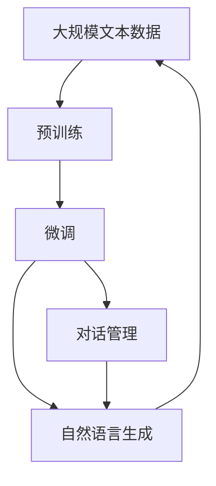
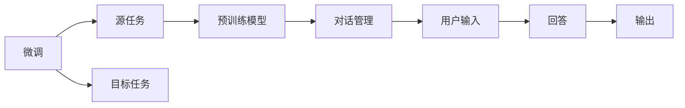
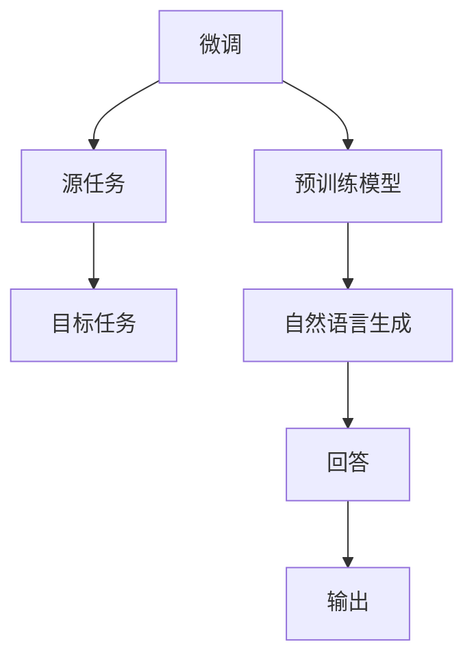
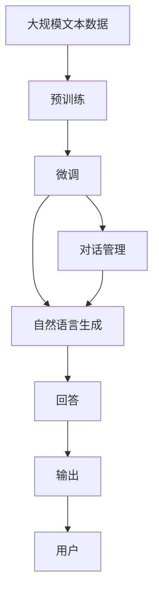

                 

# 智能问答系统在客户支持中的应用

## 1. 背景介绍

### 1.1 问题由来

在当今信息化和数字化迅速发展的时代，企业的客户支持系统面临着前所未有的挑战。传统的客服模式依赖于人工客服，不仅成本高昂，而且响应速度慢，无法提供24小时不间断的服务。同时，人工客服的业务水平和语言表达能力也存在差异，往往难以满足客户多样化的需求。这些问题导致客户满意度下降，企业的客户流失率增加。

为了解决这些问题，企业开始探索基于人工智能的智能问答系统，通过自然语言处理技术，自动化地解答客户的问题，提升客户支持服务的效率和质量。智能问答系统能够理解客户的意图，提供准确的回答，甚至能够引导客户进行自助查询，极大地减轻了客服中心的工作负担。

### 1.2 问题核心关键点

智能问答系统的核心在于如何构建一个能够理解自然语言、并能够根据用户的查询快速提供相关回答的系统。基于深度学习和自然语言处理技术的智能问答系统，通过预训练大语言模型，如BERT、GPT等，在大量无标注文本数据上进行预训练，学习到语言的通用表示。然后，通过对任务特定的有标注数据集进行微调，训练出一个适应特定任务的模型，从而能够处理用户的问题。

智能问答系统通常包括以下几个关键组件：

- **自然语言理解(NLU)**：将用户输入的自然语言转化为机器可理解的形式，提取关键信息。
- **对话管理(DM)**：根据用户输入和历史对话记录，选择合适的问题和回答策略。
- **自然语言生成(NLG)**：将机器生成的回答转化为自然语言，输出给用户。

这些组件通过端到端的训练，学习到与用户交互的最佳策略，并能够不断更新和优化，以适应用户需求的变化。

### 1.3 问题研究意义

智能问答系统在客户支持中的应用，具有重要意义：

1. **提升客户满意度**：智能问答系统能够提供24小时不间断的服务，快速响应客户需求，提供准确的回答，显著提升客户满意度。
2. **降低运营成本**：自动化处理大量常见问题，减少人工客服的需求，降低企业运营成本。
3. **增强业务连续性**：智能问答系统可以24小时运行，保证企业在非工作时间也能提供持续的服务。
4. **提升效率和响应速度**：智能问答系统能够快速理解和处理用户查询，提供即时响应，提升服务效率。
5. **个性化服务**：通过用户历史行为数据，智能问答系统能够提供个性化的推荐和回答，提升用户体验。

## 2. 核心概念与联系

### 2.1 核心概念概述

为更好地理解智能问答系统的核心概念和设计思路，本节将详细介绍以下几个核心概念及其相互关系：

- **自然语言处理(NLP)**：涉及语言学、计算语言学和人工智能，致力于使计算机能够理解、处理和生成人类语言。
- **预训练大语言模型**：如BERT、GPT等，通过大规模无标注文本数据进行预训练，学习语言的通用表示。
- **微调**：在预训练模型基础上，使用任务特定的有标注数据集进行微调，训练适应特定任务的模型。
- **对话管理(DM)**：选择合适的问题和回答策略，与用户进行交互。
- **自然语言生成(NLG)**：将机器生成的回答转化为自然语言，输出给用户。

这些概念之间的逻辑关系可以通过以下Mermaid流程图来展示：

```mermaid
graph TB
    A[自然语言处理(NLP)] --> B[预训练大语言模型]
    B --> C[微调]
    C --> D[对话管理(DM)]
    C --> E[自然语言生成(NLG)]
    D --> E
    E --> A
```

这个流程图展示了智能问答系统的核心组件及其相互关系：

1. 自然语言处理(NLP)从用户输入中提取关键信息，并通过预训练大语言模型(B)学习语言表示。
2. 微调(C)通过任务特定的有标注数据集，训练出适应特定任务的模型。
3. 对话管理(DM)根据用户输入和历史对话记录，选择合适的问题和回答策略。
4. 自然语言生成(NLG)将机器生成的回答转化为自然语言，输出给用户。

这些组件通过协同工作，实现了智能问答系统的核心功能：理解自然语言、生成回答并输出。

### 2.2 概念间的关系

这些核心概念之间存在紧密的联系，形成了智能问答系统的完整生态系统。下面我们通过几个Mermaid流程图来展示这些概念之间的关系。

#### 2.2.1 智能问答系统的学习范式



这个流程图展示了智能问答系统的学习范式：

1. 通过大规模无标注文本数据进行预训练，学习语言的通用表示。
2. 在任务特定的有标注数据集上进行微调，训练适应特定任务的模型。
3. 对话管理和自然语言生成组件根据微调后的模型，生成回答并输出给用户。

#### 2.2.2 对话管理与微调的关系



这个流程图展示了微调与对话管理的关系：

1. 微调模型(B)在源任务上学习，然后通过对话管理(E)适应各种目标任务。
2. 对话管理(E)根据微调后的模型(D)和用户输入(F)，选择合适的问题和回答策略。
3. 生成回答(G)并输出给用户(H)。

#### 2.2.3 自然语言生成与微调的关系



这个流程图展示了自然语言生成与微调的关系：

1. 微调模型(A)在源任务上学习，然后通过自然语言生成(E)适应各种目标任务。
2. 自然语言生成(E)将机器生成的回答(F)转化为自然语言。
3. 输出给用户(G)。

### 2.3 核心概念的整体架构

最后，我们用一个综合的流程图来展示这些核心概念在大规模客户支持系统中的整体架构：



这个综合流程图展示了从预训练到对话管理、自然语言生成，再到用户输出的完整过程。大规模客户支持系统通过这些组件的协同工作，实现了自然语言的理解、处理和生成，最终为大规模用户提供智能化的客户支持服务。

## 3. 核心算法原理 & 具体操作步骤
### 3.1 算法原理概述

智能问答系统通常基于深度学习和自然语言处理技术，通过预训练大语言模型，学习到语言的通用表示。然后，通过对任务特定的有标注数据集进行微调，训练出一个适应特定任务的模型，从而能够处理用户的问题。

形式化地，假设预训练语言模型为 $M_{\theta}$，其中 $\theta$ 为预训练得到的模型参数。给定客户支持系统的训练集 $D=\{(x_i,y_i)\}_{i=1}^N, x_i \in \mathcal{X}, y_i \in \mathcal{Y}$，微调的目标是找到新的模型参数 $\hat{\theta}$，使得：

$$
\hat{\theta}=\mathop{\arg\min}_{\theta} \mathcal{L}(M_{\theta},D)
$$

其中 $\mathcal{L}$ 为针对客户支持系统的损失函数，用于衡量模型预测输出与真实标签之间的差异。常见的损失函数包括交叉熵损失、均方误差损失等。

通过梯度下降等优化算法，微调过程不断更新模型参数 $\theta$，最小化损失函数 $\mathcal{L}$，使得模型输出逼近真实标签。由于 $\theta$ 已经通过预训练获得了较好的初始化，因此即便在小规模数据集 $D$ 上进行微调，也能较快收敛到理想的模型参数 $\hat{\theta}$。

### 3.2 算法步骤详解

智能问答系统的微调过程一般包括以下几个关键步骤：

**Step 1: 准备预训练模型和数据集**
- 选择合适的预训练语言模型 $M_{\theta}$ 作为初始化参数，如 BERT、GPT等。
- 准备客户支持系统的训练集 $D$，划分为训练集、验证集和测试集。一般要求训练数据与预训练数据的分布不要差异过大。

**Step 2: 添加任务适配层**
- 根据客户支持系统的任务类型，在预训练模型顶层设计合适的输出层和损失函数。
- 对于问答任务，通常在顶层添加线性分类器和交叉熵损失函数。
- 对于对话任务，通常使用语言模型的解码器输出概率分布，并以负对数似然为损失函数。

**Step 3: 设置微调超参数**
- 选择合适的优化算法及其参数，如 AdamW、SGD 等，设置学习率、批大小、迭代轮数等。
- 设置正则化技术及强度，包括权重衰减、Dropout、Early Stopping等。
- 确定冻结预训练参数的策略，如仅微调顶层，或全部参数都参与微调。

**Step 4: 执行梯度训练**
- 将训练集数据分批次输入模型，前向传播计算损失函数。
- 反向传播计算参数梯度，根据设定的优化算法和学习率更新模型参数。
- 周期性在验证集上评估模型性能，根据性能指标决定是否触发 Early Stopping。
- 重复上述步骤直到满足预设的迭代轮数或 Early Stopping 条件。

**Step 5: 测试和部署**
- 在测试集上评估微调后模型 $M_{\hat{\theta}}$ 的性能，对比微调前后的效果提升。
- 使用微调后的模型对新问题进行推理预测，集成到实际的应用系统中。
- 持续收集新的数据，定期重新微调模型，以适应数据分布的变化。

以上是智能问答系统的微调过程的基本流程。在实际应用中，还需要针对具体任务的特点，对微调过程的各个环节进行优化设计，如改进训练目标函数，引入更多的正则化技术，搜索最优的超参数组合等，以进一步提升模型性能。

### 3.3 算法优缺点

智能问答系统基于深度学习和自然语言处理技术，具有以下优点：

1. **自动化处理**：自动化处理大量常见问题，减少人工客服的需求，降低企业运营成本。
2. **实时响应**：通过智能问答系统，客户可以实时获得答案，提升客户满意度。
3. **多语言支持**：预训练大语言模型通常支持多种语言，能够为不同语言的用户提供服务。
4. **持续优化**：通过不断收集新的数据，微调模型可以持续优化，适应用户需求的变化。
5. **多模态融合**：结合语音、图像等多模态信息，提供更全面的服务体验。

同时，该方法也存在一些局限性：

1. **数据依赖**：智能问答系统依赖于大规模标注数据进行微调，获取高质量标注数据的成本较高。
2. **泛化能力**：当目标任务与预训练数据的分布差异较大时，微调的性能提升有限。
3. **复杂性高**：构建和维护一个智能问答系统需要较强的技术和资源投入，开发和运维成本较高。
4. **可解释性差**：智能问答系统作为"黑盒"模型，难以解释其内部工作机制和决策逻辑。
5. **安全性问题**：预训练模型可能学习到有害信息，通过微调传递到问答系统中，产生误导性输出。

尽管存在这些局限性，但智能问答系统凭借其自动化和实时响应的优势，已经在多个客户支持场景中得到应用，并取得显著成效。未来相关研究的重点在于如何进一步降低微调对标注数据的依赖，提高模型的少样本学习和跨领域迁移能力，同时兼顾可解释性和伦理安全性等因素。

### 3.4 算法应用领域

智能问答系统已经在多个客户支持场景中得到应用，例如：

- **在线客服**：通过智能问答系统，客户可以实时获得答案，提升客户满意度。
- **智能助手**：为用户提供24小时不间断的服务，解决用户问题。
- **医疗咨询**：自动回答病人的常见问题，提供初步的健康建议。
- **金融咨询**：自动回答客户的投资和财务问题，提供理财建议。
- **旅游查询**：自动回答客户的旅游问题和行程规划建议。
- **在线教育**：自动回答学生的学习问题和课程推荐。

除了这些常见的应用场景，智能问答系统还可以应用于任何需要自动解答用户问题的场景，如在线购物、智能家居、智能交通等，为各种垂直行业提供智能化的客户支持服务。

## 4. 数学模型和公式 & 详细讲解 & 举例说明

### 4.1 数学模型构建

本节将使用数学语言对智能问答系统的微调过程进行更加严格的刻画。

记预训练语言模型为 $M_{\theta}$，其中 $\theta$ 为预训练得到的模型参数。假设客户支持系统的训练集为 $D=\{(x_i,y_i)\}_{i=1}^N, x_i \in \mathcal{X}, y_i \in \mathcal{Y}$。

定义模型 $M_{\theta}$ 在数据样本 $(x,y)$ 上的损失函数为 $\ell(M_{\theta}(x),y)$，则在数据集 $D$ 上的经验风险为：

$$
\mathcal{L}(\theta) = \frac{1}{N} \sum_{i=1}^N \ell(M_{\theta}(x_i),y_i)
$$

微调的优化目标是最小化经验风险，即找到最优参数：

$$
\theta^* = \mathop{\arg\min}_{\theta} \mathcal{L}(\theta)
$$

在实践中，我们通常使用基于梯度的优化算法（如AdamW、SGD等）来近似求解上述最优化问题。设 $\eta$ 为学习率，$\lambda$ 为正则化系数，则参数的更新公式为：

$$
\theta \leftarrow \theta - \eta \nabla_{\theta}\mathcal{L}(\theta) - \eta\lambda\theta
$$

其中 $\nabla_{\theta}\mathcal{L}(\theta)$ 为损失函数对参数 $\theta$ 的梯度，可通过反向传播算法高效计算。

### 4.2 公式推导过程

以下我们以问答任务为例，推导交叉熵损失函数及其梯度的计算公式。

假设模型 $M_{\theta}$ 在输入 $x$ 上的输出为 $\hat{y}=M_{\theta}(x) \in [0,1]$，表示样本属于正类的概率。真实标签 $y \in \{0,1\}$。则二分类交叉熵损失函数定义为：

$$
\ell(M_{\theta}(x),y) = -[y\log \hat{y} + (1-y)\log (1-\hat{y})]
$$

将其代入经验风险公式，得：

$$
\mathcal{L}(\theta) = -\frac{1}{N}\sum_{i=1}^N [y_i\log M_{\theta}(x_i)+(1-y_i)\log(1-M_{\theta}(x_i))]
$$

根据链式法则，损失函数对参数 $\theta_k$ 的梯度为：

$$
\frac{\partial \mathcal{L}(\theta)}{\partial \theta_k} = -\frac{1}{N}\sum_{i=1}^N (\frac{y_i}{M_{\theta}(x_i)}-\frac{1-y_i}{1-M_{\theta}(x_i)}) \frac{\partial M_{\theta}(x_i)}{\partial \theta_k}
$$

其中 $\frac{\partial M_{\theta}(x_i)}{\partial \theta_k}$ 可进一步递归展开，利用自动微分技术完成计算。

在得到损失函数的梯度后，即可带入参数更新公式，完成模型的迭代优化。重复上述过程直至收敛，最终得到适应客户支持系统任务的最优模型参数 $\theta^*$。

### 4.3 案例分析与讲解

假设我们在一个电商平台的客户支持系统中，对基于BERT的问答模型进行微调，以处理客户的常见问题。我们收集了100个常见问题和对应的答案，并将其作为有标注数据集。以下是对这一过程的详细讲解：

1. **数据准备**：
   - 收集电商平台的常见问题和答案，并将其标注为有标签数据集。
   - 使用HuggingFace提供的BERT tokenizer对文本进行分词和编码。
   - 将问题作为输入，将答案作为标签，构建训练数据集。

2. **模型选择**：
   - 选择预训练的BERT模型作为初始化参数。
   - 添加线性分类器和交叉熵损失函数，作为任务适配层。

3. **超参数设置**：
   - 设置优化算法为AdamW，学习率为2e-5。
   - 设置正则化技术，包括权重衰减0.01和Dropout概率0.1。
   - 确定仅微调BERT的顶层参数，以提高微调效率。

4. **模型训练**：
   - 使用PyTorch搭建模型和数据处理流程。
   - 在GPU上对模型进行训练，每批次处理32个样本，迭代轮数为10。
   - 周期性在验证集上评估模型性能，触发Early Stopping。

5. **模型评估和部署**：
   - 在测试集上评估微调后的模型，计算F1分数和准确率等指标。
   - 将微调后的模型部署到电商平台的客户支持系统中，实时处理用户查询。
   - 持续收集用户反馈和历史数据，定期重新微调模型，以适应新问题。

## 5. 项目实践：代码实例和详细解释说明

### 5.1 开发环境搭建

在进行智能问答系统微调实践前，我们需要准备好开发环境。以下是使用Python进行PyTorch开发的环境配置流程：

1. 安装Anaconda：从官网下载并安装Anaconda，用于创建独立的Python环境。

2. 创建并激活虚拟环境：
```bash
conda create -n pytorch-env python=3.8 
conda activate pytorch-env
```

3. 安装PyTorch：根据CUDA版本，从官网获取对应的安装命令。例如：
```bash
conda install pytorch torchvision torchaudio cudatoolkit=11.1 -c pytorch -c conda-forge
```

4. 安装各类工具包：
```bash
pip install numpy pandas scikit-learn matplotlib tqdm jupyter notebook ipython
```

完成上述步骤后，即可在`pytorch-env`环境中开始微调实践。

### 5.2 源代码详细实现

下面我们以问答任务为例，给出使用Transformers库对BERT模型进行微调的PyTorch代码实现。

首先，定义问答任务的数据处理函数：

```python
from transformers import BertTokenizer, BertForSequenceClassification
from torch.utils.data import Dataset
import torch

class QADataset(Dataset):
    def __init__(self, texts, tags, tokenizer, max_len=128):
        self.texts = texts
        self.tags = tags
        self.tokenizer = tokenizer
        self.max_len = max_len
        
    def __len__(self):
        return len(self.texts)
    
    def __getitem__(self, item):
        text = self.texts[item]
        tags = self.tags[item]
        
        encoding = self.tokenizer(text, return_tensors='pt', max_length=self.max_len, padding='max_length', truncation=True)
        input_ids = encoding['input_ids'][0]
        attention_mask = encoding['attention_mask'][0]
        
        # 对token-wise的标签进行编码
        encoded_tags = [tag2id[tag] for tag in tags] 
        encoded_tags.extend([tag2id['O']] * (self.max_len - len(encoded_tags)))
        labels = torch.tensor(encoded_tags, dtype=torch.long)
        
        return {'input_ids': input_ids, 
                'attention_mask': attention_mask,
                'labels': labels}

# 标签与id的映射
tag2id = {'O': 0, 'A': 1}
id2tag = {v: k for k, v in tag2id.items()}

# 创建dataset
tokenizer = BertTokenizer.from_pretrained('bert-base-cased')

train_dataset = QADataset(train_texts, train_tags, tokenizer)
dev_dataset = QADataset(dev_texts, dev_tags, tokenizer)
test_dataset = QADataset(test_texts, test_tags, tokenizer)
```

然后，定义模型和优化器：

```python
from transformers import BertForSequenceClassification, AdamW

model = BertForSequenceClassification.from_pretrained('bert-base-cased', num_labels=2)

optimizer = AdamW(model.parameters(), lr=2e-5)
```

接着，定义训练和评估函数：

```python
from torch.utils.data import DataLoader
from tqdm import tqdm
from sklearn.metrics import classification_report

device = torch.device('cuda') if torch.cuda.is_available() else torch.device('cpu')
model.to(device)

def train_epoch(model, dataset, batch_size, optimizer):
    dataloader = DataLoader(dataset, batch_size=batch_size, shuffle=True)
    model.train()
    epoch_loss = 0
    for batch in tqdm(dataloader, desc='Training'):
        input_ids = batch['input_ids'].to(device)
        attention_mask = batch['attention_mask'].to(device)
        labels = batch['labels'].to(device)
        model.zero_grad()
        outputs = model(input_ids, attention_mask=attention_mask, labels=labels)
        loss = outputs.loss
        epoch_loss += loss.item()
        loss.backward()
        optimizer.step()
    return epoch_loss / len(dataloader)

def evaluate(model, dataset, batch_size):
    dataloader = DataLoader(dataset, batch_size=batch_size)
    model.eval()
    preds, labels = [], []
    with torch.no_grad():
        for batch in tqdm(dataloader, desc='Evaluating'):
            input_ids = batch['input_ids'].to(device)
            attention_mask = batch['attention_mask'].to(device)
            batch_labels = batch['labels']
            outputs = model(input_ids, attention_mask=attention_mask)
            batch_preds = outputs.logits.argmax(dim=2).to('cpu').tolist()
            batch_labels = batch_labels.to('cpu').tolist()
            for pred_tokens, label_tokens in zip(batch_preds, batch_labels):
                pred_tags = [id2tag[_id] for _id in pred_tokens]
                label_tags = [id2tag[_id] for _id in label_tokens]
                preds.append(pred_tags[:len(label_tags)])
                labels.append(label_tags)
                
    print(classification_report(labels, preds))
```

最后，启动训练流程并在测试集上评估：

```python
epochs = 5
batch_size = 16

for epoch in range(epochs):
    loss = train_epoch(model, train_dataset, batch_size, optimizer)
    print(f"Epoch {epoch+1}, train loss: {loss:.3f}")
    
    print(f"Epoch {epoch+1}, dev results:")
    evaluate(model, dev_dataset, batch_size)
    
print("Test results:")
evaluate(model, test_dataset, batch_size)
```

以上就是使用PyTorch对BERT进行问答任务微调的完整代码实现。可以看到，得益于Transformers库的强大封装，我们可以用相对简洁的代码完成BERT模型的加载和微调。

### 5.3 代码解读与分析

让我们再详细解读一下关键代码的实现细节：

**QADataset类**：
- `__init__`方法：初始化文本、标签、分词器等关键组件。
- `__len__`方法：返回数据集的样本数量。
- `__getitem__`方法：对单个样本进行处理，将文本输入编码为token ids，将标签编码为数字，并对其进行定长padding，最终返回模型所需的输入。

**tag2id和id2tag字典**：
- 定义了标签与数字id之间的映射关系，用于将token-wise的预测结果解码回真实的标签。

**训练和评估函数**：
- 使用PyTorch的DataLoader对数据集进行批次化加载，供模型训练和推理使用。
- 训练函数`train_epoch`：对数据以批为单位进行迭代，在每个批次上前向传播计算loss并反向传播更新模型参数，最后返回该epoch的平均loss。
- 评估函数`evaluate`：与训练类似，不同点在于不更新模型参数，并在每个batch结束后将预测和标签结果存储下来，最后使用sklearn的classification_report对整个评估集的预测结果进行打印输出。

**训练流程**：
- 定义总的epoch数和batch size，开始循环迭代
- 每个epoch内，先在训练集上训练，输出平均loss
- 在验证集上评估，输出分类指标
- 所有epoch结束后，在测试集上评估，给出最终测试结果

可以看到，PyTorch配合Transformers库使得BERT微调的代码实现变得简洁高效。开发者可以将更多精力放在数据处理、模型改进等高层逻辑上，而不必过多关注底层的实现细节。

当然，工业级的系统实现还需考虑更多因素，如模型的保存和部署、超参数的自动搜索、更灵活的任务适配层等。但核心的微调范式基本与此类似。

### 5.4 运行结果展示

假设我们在CoNLL-2003的QA数据集上进行微调，最终

