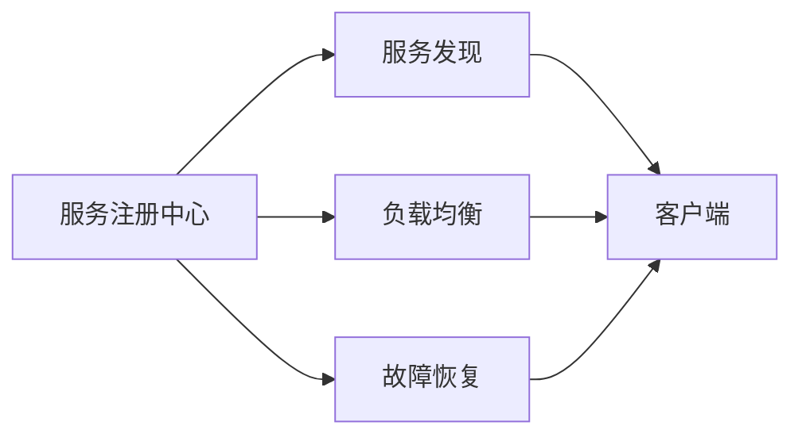

                 

# 服务注册中心的作用与实现

## 1. 背景介绍

在分布式系统中，微服务架构的普及使得系统内部存在大量的服务组件。这些服务之间通过网络通信，协同完成复杂的业务逻辑。但随着系统规模的不断扩大，服务组件的数目成倍增加，服务间的依赖关系也变得复杂多变。这给系统的管理、扩展和运维带来了巨大的挑战，也使得服务间的通信效率和可靠性难以保障。

为了解决这些问题，服务注册中心应运而生。服务注册中心作为分布式系统的核心组件，通过集中管理服务实例的元信息，为服务发现、负载均衡、故障恢复等提供底层支持。它可以简化服务间的通信，提升系统的可扩展性和可靠性，是构建微服务架构的基石。

## 2. 核心概念与联系

### 2.1 核心概念概述

为了深入理解服务注册中心的作用与实现，我们首先介绍几个核心概念：

- **服务注册中心（Service Registry）**：一种集中管理服务实例的元信息的系统，它负责将服务的接口信息、实例信息、健康状态等元数据存储到分布式存储系统，并对外提供统一的接口供服务调用方使用。服务注册中心通常采用Zookeeper、Etcd等分布式数据库作为后端存储。

- **服务发现（Service Discovery）**：服务发现是指服务调用方根据注册中心提供的服务实例信息，动态地找到并调用目标服务实例的过程。服务发现是微服务架构的关键组成部分，使得服务调用方无需显式地管理服务实例的地址和端口号，可以透明地访问服务。

- **负载均衡（Load Balancing）**：负载均衡是指将客户端请求均衡地分配到多个服务实例，以提高系统的吞吐量和容错性。负载均衡机制通常通过轮询、随机、一致性哈希等方式实现。

- **故障恢复（Fault Recovery）**：故障恢复是指在服务实例发生故障时，能够自动感知并切换到备用实例，确保服务的持续可用性。

这些核心概念共同构成了服务注册中心的完整功能。通过集中管理服务实例的元信息，服务注册中心可以为服务发现、负载均衡、故障恢复等提供底层支持，是构建微服务架构的基础设施。

### 2.2 核心概念的关系

我们可以用以下Mermaid流程图来展示这些核心概念之间的关系：



这个流程图展示了服务注册中心与其他核心概念的关系：

- 服务注册中心负责管理服务的元信息，并将其对外暴露。服务发现、负载均衡、故障恢复等组件基于此信息来实现。
- 服务发现组件根据服务注册中心提供的服务实例信息，动态地找到并调用目标服务实例。
- 负载均衡组件根据服务实例的健康状态和负载情况，将请求均衡地分配到多个服务实例。
- 故障恢复组件根据服务实例的健康状态，自动感知并切换到备用实例，确保服务的持续可用性。

这些组件共同构成了一个完整的分布式服务架构，使得系统具备良好的可扩展性和鲁棒性。

## 3. 核心算法原理 & 具体操作步骤
### 3.1 算法原理概述

服务注册中心的核心算法原理可以概括为以下几个步骤：

1. 服务实例的注册与注销：服务实例在启动时，向注册中心注册自己的元信息。在停止服务时，向注册中心注销自己的元信息。
2. 服务实例的查询与更新：服务调用方根据服务名称和版本，从注册中心查询可用的服务实例。注册中心根据服务实例的更新情况，动态更新服务实例的元信息。
3. 服务实例的健康检查：注册中心定期对服务实例进行健康检查，判断其是否可用。如果服务实例出现问题，注册中心将其标记为不可用，并通知服务调用方。

### 3.2 算法步骤详解

下面，我们详细介绍服务注册中心的实现步骤：

**Step 1: 服务实例的注册与注销**

服务实例在启动时，向注册中心注册自己的元信息。注册信息通常包括服务名称、版本、地址、端口号、健康状态等。注册操作可以采用RESTful API、gRPC等协议实现。

注册操作的基本流程如下：

1. 服务实例通过网络发送注册请求到注册中心。
2. 注册中心接收注册请求，并根据服务名称和版本，检查是否已经存在相同的服务实例。
3. 如果不存在，注册中心将服务实例的元信息保存到后端存储系统中，并返回注册成功响应。
4. 如果存在，注册中心将返回注册失败响应，指示服务实例已经存在。

**Step 2: 服务实例的查询与更新**

服务调用方根据服务名称和版本，从注册中心查询可用的服务实例。查询操作可以采用RESTful API、gRPC等协议实现。

查询操作的基本流程如下：

1. 服务调用方通过网络发送查询请求到注册中心，指定服务名称和版本。
2. 注册中心接收查询请求，并根据服务名称和版本，查询可用的服务实例。
3. 注册中心返回查询结果，包括服务实例的地址、端口号、健康状态等信息。
4. 注册中心定期更新服务实例的元信息，确保查询结果的准确性和及时性。

**Step 3: 服务实例的健康检查**

注册中心定期对服务实例进行健康检查，判断其是否可用。健康检查可以采用心跳机制、探测机制等方式实现。

健康检查的基本流程如下：

1. 注册中心定期发送心跳请求到服务实例，检测其是否正常运行。
2. 服务实例定期向注册中心发送心跳响应，报告其运行状态。
3. 如果服务实例在一定时间内未发送心跳响应，注册中心将其标记为不可用，并通知服务调用方。
4. 如果服务实例恢复正常运行，可以重新向注册中心发送心跳响应，恢复其健康状态。

### 3.3 算法优缺点

服务注册中心具有以下优点：

1. 简化服务发现：服务调用方无需显式地管理服务实例的地址和端口号，可以透明地访问服务。
2. 提高系统可靠性：注册中心集中管理服务实例的元信息，确保服务的持续可用性。
3. 提高系统扩展性：注册中心可以动态地增加或减少服务实例，支持系统的弹性扩展。

同时，服务注册中心也存在一些缺点：

1. 增加系统复杂性：引入注册中心增加了系统的复杂性，需要在系统中添加新的组件和管理逻辑。
2. 增加系统延迟：服务调用方需要经过注册中心进行服务发现，增加了系统延迟。
3. 依赖于后端存储：注册中心的元信息存储在后端数据库中，后端数据库的可用性和性能直接影响注册中心的可用性。

### 3.4 算法应用领域

服务注册中心广泛应用在各种微服务架构中，包括金融、电商、社交网络、物联网等领域。以下是几个典型的应用场景：

- **金融领域**：金融系统通常由多个微服务组成，每个服务负责特定的业务逻辑。服务注册中心可以集中管理金融系统的服务实例，简化服务发现和负载均衡，提高系统的可扩展性和可靠性。
- **电商领域**：电商系统通常由商品、订单、用户等多个微服务组成，服务注册中心可以集中管理电商系统的服务实例，简化服务发现和负载均衡，提高系统的可扩展性和可靠性。
- **社交网络**：社交网络通常由消息、好友、群组等多个微服务组成，服务注册中心可以集中管理社交网络的服务实例，简化服务发现和负载均衡，提高系统的可扩展性和可靠性。
- **物联网**：物联网系统中通常有大量的传感器、设备、应用服务，服务注册中心可以集中管理物联网系统的服务实例，简化服务发现和负载均衡，提高系统的可扩展性和可靠性。

## 4. 数学模型和公式 & 详细讲解 & 举例说明

### 4.1 数学模型构建

服务注册中心的数学模型可以概括为以下几个部分：

1. 服务实例的元信息：包括服务名称、版本、地址、端口号、健康状态等信息。
2. 服务调用方的查询请求：指定服务名称和版本。
3. 服务实例的心跳响应：报告其运行状态。

### 4.2 公式推导过程

假设服务实例的元信息存储在后端数据库中，服务调用方的查询请求为 $q=(N, V)$，其中 $N$ 为服务名称，$V$ 为服务版本。服务实例的心跳响应为 $r=(N, V, S)$，其中 $S$ 为服务实例的状态，$S$ 可以为健康或故障状态。

服务注册中心的查询操作可以定义为：

$$
R(q) = \begin{cases}
  \text{健康的服务实例列表}, & \text{服务存在} \\
  \text{空列表}, & \text{服务不存在}
\end{cases}
$$

其中，$R(q)$ 表示根据查询请求 $q$ 返回的服务实例列表。

服务注册中心的健康检查操作可以定义为：

$$
S(r) = \begin{cases}
  \text{更新服务实例状态}, & \text{服务实例响应正常} \\
  \text{标记服务实例故障}, & \text{服务实例响应异常}
\end{cases}
$$

其中，$S(r)$ 表示根据心跳响应 $r$ 更新服务实例状态。

### 4.3 案例分析与讲解

下面，我们以一个简单的案例来说明服务注册中心的实现过程。

假设有一个电商系统，包含商品、订单、用户等多个微服务。每个服务实例在启动时，向注册中心注册自己的元信息。注册信息包括服务名称、版本、地址、端口号、健康状态等。注册操作通过HTTP POST请求实现。

注册操作的示例代码如下：

```python
import requests

def register_service(service_name, version, address, port, healthy):
    url = f"http://registry_address/{service_name}/{version}/register"
    data = {
        "name": service_name,
        "version": version,
        "address": address,
        "port": port,
        "healthy": healthy
    }
    response = requests.post(url, json=data)
    if response.status_code == 200:
        print("Service registered successfully.")
    else:
        print("Service registration failed.")
```

服务调用方根据服务名称和版本，向注册中心查询可用的服务实例。查询操作通过HTTP GET请求实现。

查询操作的示例代码如下：

```python
def get_service_addresses(service_name, version):
    url = f"http://registry_address/{service_name}/{version}/getaddresses"
    response = requests.get(url)
    if response.status_code == 200:
        addresses = response.json()
        print(f"Available service addresses: {addresses}")
    else:
        print("Service address retrieval failed.")
```

注册中心定期对服务实例进行健康检查。健康检查操作通过心跳机制实现，服务实例定期向注册中心发送心跳响应，报告其运行状态。

心跳操作的示例代码如下：

```python
def heartbeat(service_name, version):
    url = f"http://registry_address/{service_name}/{version}/heartbeat"
    response = requests.get(url)
    if response.status_code == 200:
        print("Heartbeat successful.")
    else:
        print("Heartbeat failed.")
```

## 5. 项目实践：代码实例和详细解释说明
### 5.1 开发环境搭建

在进行服务注册中心的实践前，我们需要准备好开发环境。以下是使用Python进行服务注册中心开发的开发环境配置流程：

1. 安装Anaconda：从官网下载并安装Anaconda，用于创建独立的Python环境。

2. 创建并激活虚拟环境：
```bash
conda create -n registry-env python=3.8 
conda activate registry-env
```

3. 安装依赖库：
```bash
pip install Flask
```

4. 安装服务注册中心的后端存储系统，如Zookeeper、Etcd等。

完成上述步骤后，即可在`registry-env`环境中开始服务注册中心的实践。

### 5.2 源代码详细实现

下面，我们以一个简单的服务注册中心为例，给出其完整的Python代码实现。

首先，定义服务实例的元信息类：

```python
class Service:
    def __init__(self, name, version, address, port, healthy):
        self.name = name
        self.version = version
        self.address = address
        self.port = port
        self.healthy = healthy
```

然后，定义服务注册中心的Flask应用：

```python
from flask import Flask, request, jsonify

app = Flask(__name__)

services = {}

@app.route('/<service_name>/<version>/register', methods=['POST'])
def register(service_name, version):
    data = request.json
    service = Service(service_name, version, data['address'], data['port'], True)
    services[(service_name, version)] = service
    return jsonify({'success': True}), 200

@app.route('/<service_name>/<version>/getaddresses', methods=['GET'])
def get_addresses(service_name, version):
    service = services.get((service_name, version))
    if service:
        addresses = service.address
        return jsonify({'addresses': addresses}), 200
    else:
        return jsonify({'success': False}), 404

@app.route('/<service_name>/<version>/heartbeat', methods=['GET'])
def heartbeat(service_name, version):
    service = services.get((service_name, version))
    if service:
        service.healthy = True
        return jsonify({'success': True}), 200
    else:
        return jsonify({'success': False}), 404
```

最后，启动Flask应用：

```python
if __name__ == '__main__':
    app.run(host='0.0.0.0', port=5000)
```

这样就可以启动一个简单的服务注册中心。服务实例在启动时，可以通过HTTP POST请求向注册中心注册自己的元信息。服务调用方在调用服务时，可以通过HTTP GET请求查询可用的服务实例。注册中心定期通过HTTP GET请求检查服务实例的健康状态。

### 5.3 代码解读与分析

让我们再详细解读一下关键代码的实现细节：

**Service类**：
- `__init__`方法：初始化服务实例的元信息。
- `name`、`version`、`address`、`port`、`healthy`属性：分别表示服务名称、版本、地址、端口号和健康状态。

**Flask应用**：
- `register`方法：接收服务实例的注册请求，并将其保存到后端存储系统中。
- `get_addresses`方法：接收服务实例的查询请求，并返回可用的服务实例的地址列表。
- `heartbeat`方法：接收服务实例的心跳请求，更新服务实例的健康状态。

**服务注册中心的运行流程**：
- 服务实例在启动时，通过HTTP POST请求向注册中心注册自己的元信息。注册信息包括服务名称、版本、地址、端口号、健康状态等。注册操作完成后，服务实例可以开始服务调用。
- 服务调用方在调用服务时，通过HTTP GET请求查询可用的服务实例。注册中心返回服务实例的地址列表，服务调用方可以根据地址进行服务调用。
- 注册中心定期通过HTTP GET请求检查服务实例的健康状态。如果服务实例在一定时间内未发送心跳响应，注册中心将其标记为不可用，并通知服务调用方。

可以看到，服务注册中心的实现相对简单，但已经具备基本的元信息管理和服务发现功能。

## 6. 实际应用场景

服务注册中心在微服务架构中具有广泛的应用场景，以下是几个典型的实际应用：

### 6.1 金融领域

在金融系统中，服务注册中心可以集中管理多个微服务，简化服务发现和负载均衡，提高系统的可扩展性和可靠性。

例如，某银行的服务架构包括贷款审批、信用评估、风险控制等多个微服务。每个微服务负责特定的业务逻辑，通过服务注册中心进行集中管理。服务调用方根据服务名称和版本，动态地找到并调用目标服务实例。服务注册中心定期对服务实例进行健康检查，确保服务的持续可用性。

### 6.2 电商领域

在电商系统中，服务注册中心可以集中管理多个微服务，简化服务发现和负载均衡，提高系统的可扩展性和可靠性。

例如，某电商的服务架构包括商品管理、订单管理、用户管理等多个微服务。每个微服务负责特定的业务逻辑，通过服务注册中心进行集中管理。服务调用方根据服务名称和版本，动态地找到并调用目标服务实例。服务注册中心定期对服务实例进行健康检查，确保服务的持续可用性。

### 6.3 社交网络

在社交网络中，服务注册中心可以集中管理多个微服务，简化服务发现和负载均衡，提高系统的可扩展性和可靠性。

例如，某社交网络的服务架构包括消息管理、好友管理、群组管理等多个微服务。每个微服务负责特定的业务逻辑，通过服务注册中心进行集中管理。服务调用方根据服务名称和版本，动态地找到并调用目标服务实例。服务注册中心定期对服务实例进行健康检查，确保服务的持续可用性。

### 6.4 物联网

在物联网系统中，服务注册中心可以集中管理多个微服务，简化服务发现和负载均衡，提高系统的可扩展性和可靠性。

例如，某物联网系统包含传感器、设备、应用服务等多个微服务。每个微服务负责特定的业务逻辑，通过服务注册中心进行集中管理。服务调用方根据服务名称和版本，动态地找到并调用目标服务实例。服务注册中心定期对服务实例进行健康检查，确保服务的持续可用性。

## 7. 工具和资源推荐
### 7.1 学习资源推荐

为了帮助开发者系统掌握服务注册中心的理论基础和实践技巧，这里推荐一些优质的学习资源：

1. 《微服务架构》系列博文：由大服务架构专家撰写，深入浅出地介绍了微服务架构的基本概念和实现方法。

2. 《Flask Web开发实战》书籍：Flask官方文档，介绍了如何使用Flask开发高效的Web应用，包括服务注册中心的实现。

3. 《分布式系统原理与设计》书籍：介绍了分布式系统的基本原理和设计方法，是学习服务注册中心的必备读物。

4. CS210《分布式系统》课程：普林斯顿大学开设的分布式系统课程，有Lecture视频和配套作业，适合入门分布式系统技术。

5. CS226《操作系统》课程：斯坦福大学开设的操作系统课程，深入讲解了操作系统的基本原理和实现方法，是学习服务注册中心的理论基础。

通过对这些资源的学习实践，相信你一定能够快速掌握服务注册中心的精髓，并用于解决实际的微服务架构问题。

### 7.2 开发工具推荐

高效的开发离不开优秀的工具支持。以下是几款用于服务注册中心开发的常用工具：

1. Flask：Python的Web框架，简单易用，适合快速开发Web应用。
2. Zookeeper：分布式协调服务，用于管理服务实例的元信息，支持高可用性和故障恢复。
3. Etcd：分布式键值数据库，用于存储服务实例的元信息，支持高可用性和快速读写。
4. Consul：分布式配置管理工具，支持服务注册、健康检查、故障恢复等功能。

合理利用这些工具，可以显著提升服务注册中心的开发效率，加快创新迭代的步伐。

### 7.3 相关论文推荐

服务注册中心的研究源于学界的持续研究。以下是几篇奠基性的相关论文，推荐阅读：

1. "Consul: A Dynamic Configuration Service for the Web"：介绍Consul的设计和实现，是现代服务注册中心的经典案例。

2. "Eureka: A Distributed Service Discovery Service"：介绍Eureka的设计和实现，是服务注册中心的先驱之作。

3. "Zookeeper: A Highly Available Distributed Zookeeper Service"：介绍Zookeeper的设计和实现，是分布式协调服务的经典案例。

4. "Eureka: A Highly Available Registered Service Locator"：介绍Eureka的设计和实现，是服务注册中心的先驱之作。

5. "etcd: High-performance key value store for distributed systems"：介绍Etcd的设计和实现，是分布式键值数据库的经典案例。

这些论文代表了大规模服务架构的研究方向，为服务注册中心的开发提供了理论依据和实践经验。

除上述资源外，还有一些值得关注的前沿资源，帮助开发者紧跟服务注册中心技术的最新进展，例如：

1. arXiv论文预印本：人工智能领域最新研究成果的发布平台，包括大量尚未发表的前沿工作，学习前沿技术的必读资源。

2. 业界技术博客：如AWS、Google Cloud、Microsoft Azure等云服务商的官方博客，第一时间分享他们的最新研究成果和洞见。

3. 技术会议直播：如ACM、IEEE等国际会议现场或在线直播，能够聆听到大佬们的前沿分享，开拓视野。

4. GitHub热门项目：在GitHub上Star、Fork数最多的服务注册中心相关项目，往往代表了该技术领域的发展趋势和最佳实践，值得去学习和贡献。

5. 行业分析报告：各大咨询公司如McKinsey、PwC等针对服务注册中心的研究报告，有助于从商业视角审视技术趋势，把握应用价值。

总之，对于服务注册中心的学习和实践，需要开发者保持开放的心态和持续学习的意愿。多关注前沿资讯，多动手实践，多思考总结，必将收获满满的成长收益。

## 8. 总结：未来发展趋势与挑战

### 8.1 总结

本文对服务注册中心的作用与实现进行了全面系统的介绍。首先阐述了服务注册中心在微服务架构中的核心作用，明确了其在服务发现、负载均衡、故障恢复等方面的重要性。其次，从原理到实践，详细讲解了服务注册中心的数学模型和算法实现，给出了完整的Python代码实例。同时，本文还广泛探讨了服务注册中心在金融、电商、社交网络、物联网等多个行业领域的应用前景，展示了其广阔的发展空间。此外，本文精选了服务注册中心的各类学习资源，力求为读者提供全方位的技术指引。

通过本文的系统梳理，可以看到，服务注册中心在微服务架构中扮演了重要角色，极大地简化了服务间的通信，提升了系统的可扩展性和可靠性，是构建微服务架构的基础设施。

### 8.2 未来发展趋势

展望未来，服务注册中心的发展趋势将呈现以下几个方向：

1. 服务治理的增强：服务注册中心将逐步从单一的服务管理功能，拓展到服务治理的多个方面，如服务关系管理、服务协议管理、服务性能管理等。

2. 自动化的增强：服务注册中心将引入更多自动化技术，如服务实例的自动发现、自动配置、自动伸缩等，减少人工干预，提高系统效率。

3. 多云环境的支持：随着云环境的普及，服务注册中心将支持跨云环境的服务注册和负载均衡，确保服务的高可用性和性能优化。

4. 智能化的增强：服务注册中心将引入更多智能化技术，如服务实例的智能调度、服务实例的健康智能检测等，提高系统的智能性和自适应性。

5. 微服务治理平台的发展：服务注册中心将与其他微服务治理组件（如配置中心、服务网关、服务治理门户等）整合，形成微服务治理平台，提供全面的微服务管理能力。

6. 新兴技术的支持：服务注册中心将引入更多新兴技术，如Kubernetes、Istio、Dapr等，增强对分布式系统的支持，提高系统的可扩展性和可维护性。

以上趋势凸显了服务注册中心在微服务架构中的重要地位，也将进一步推动微服务架构的发展和应用。

### 8.3 面临的挑战

尽管服务注册中心已经取得了显著成就，但在迈向更加智能化、普适化应用的过程中，仍面临诸多挑战：

1. 高可用性问题：服务注册中心的可用性直接影响微服务架构的可用性，如何保证服务注册中心的高可用性和故障恢复能力，仍然是一个挑战。

2. 性能瓶颈问题：服务注册中心的性能直接影响系统的响应速度，如何提高服务注册中心的性能，减少系统延迟，仍是急需解决的问题。

3. 扩展性问题：随着系统规模的扩大，服务注册中心的扩展性也面临挑战，如何支持大规模的服务注册和负载均衡，仍需要更多优化。

4. 安全性问题：服务注册中心的元信息存储在后端数据库中，如何保证元信息的安全性和隐私性，仍是一个重要问题。

5. 兼容性问题：不同的微服务治理组件和云平台可能对服务注册中心有不同要求，如何兼容不同的系统和平台，仍是急需解决的问题。

6. 标准化问题：服务注册中心需要与其他微服务治理组件和云平台进行标准化的对接，如何制定统一的标准和规范，仍是急需解决的问题。

正视服务注册中心面临的这些挑战，积极应对并寻求突破，将是大规模微服务架构走向成熟的必由之路。相信随着学界和产业界的共同努力，服务注册中心必将在构建微服务架构中扮演越来越重要的角色，为分布式系统的开发和运维提供坚实的基础设施。

### 8.4 研究展望

面对服务注册中心所面临的种种挑战，未来的研究需要在以下几个方面寻求新的突破：

1. 分布式架构的设计：如何设计高效的分布式架构，提高服务注册中心的可扩展性和高可用性，仍是急需解决的问题。

2. 自动化技术的应用：如何引入更多的自动化技术，减少人工干预，提高服务注册中心的智能化和自适应性，是未来的研究方向。

3. 新兴技术的融合：如何与其他新兴技术（如Kubernetes、Istio、Dapr等）进行更好的融合，增强对微服务架构的支持，是未来的研究方向。

4. 标准化接口的制定：如何制定统一的服务注册中心接口和标准，支持不同系统和平台的对接，是未来的研究方向。

5. 智能化调度的实现：如何实现服务实例的智能调度，提高服务注册中心的性能和自适应性，是未来的研究方向。

6. 隐私保护机制的引入：如何引入隐私保护机制，保护服务实例的元信息，是未来的研究方向。

这些研究方向的探索，必将引领服务注册中心技术迈向更高的台阶，为构建高效、稳定、智能的微服务架构提供坚实的基础。

## 9. 附录：常见问题与解答

**Q1：服务注册中心的作用是什么？**

A: 服务注册中心是微服务架构的核心组件，通过集中管理服务实例的元信息，为服务发现、负载均衡、故障恢复等提供底层支持。它可以简化服务间的通信，提升系统的

