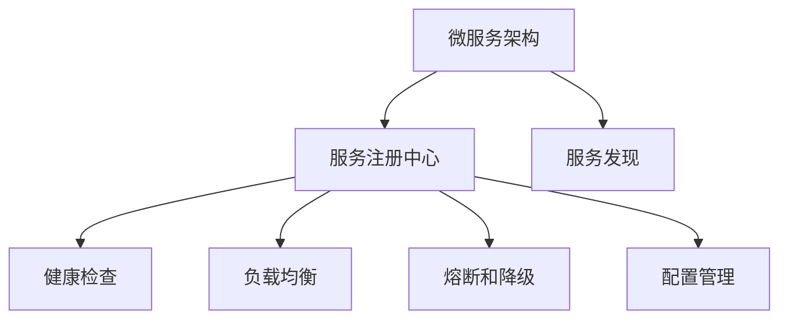
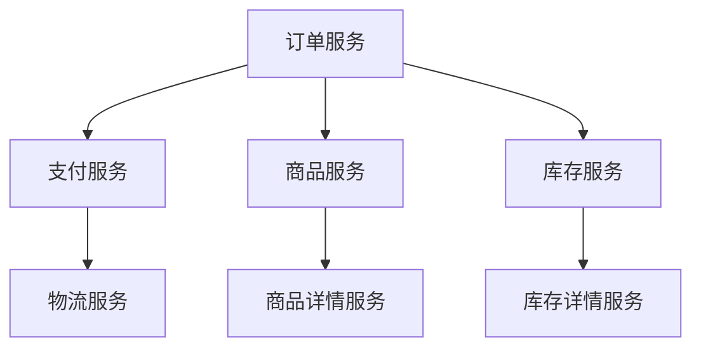

                 

# 服务注册中心的实例应用

## 1. 背景介绍

### 1.1 问题由来
随着微服务架构的普及，系统由单一的单体应用演变为多个相互独立的服务模块，这些服务模块之间依赖关系复杂，管理和协调难度增大。如何在动态环境中高效管理和调度这些服务，是分布式系统设计中的一大难题。服务注册中心作为一种集中式的服务管理机制，成为了微服务架构的关键组件之一。

服务注册中心主要解决如下几个问题：
1. **服务发现**：动态注册和发现服务实例，确保请求能够正确路由到目标服务。
2. **服务实例管理**：实时监控服务实例的健康状态，及时发现并处理异常。
3. **负载均衡**：自动均衡服务请求，避免单点故障和系统过载。
4. **配置管理**：集中管理服务配置信息，支持动态更新和回滚。
5. **熔断和降级**：通过熔断和降级策略，防止局部故障影响全局系统。

### 1.2 问题核心关键点
服务注册中心的核心功能主要包括服务发现、服务实例管理、负载均衡、配置管理、熔断和降级等。在实际应用中，需要根据系统需求选择合适的注册中心，并合理配置其各项功能，以实现高效的服务管理。

目前主流的服务注册中心包括：
1. **Consul**：由HashiCorp开发，支持动态配置、健康检查、多数据中心部署等功能。
2. **Eureka**：由Netflix开发，提供了服务发现、负载均衡、故障转移等功能。
3. **Zookeeper**：由Apache开发，主要用于分布式配置管理和服务发现。
4. **etcd**：由CoreOS开发，提供分布式键值存储和同步功能。
5. **Kubernetes Service**：由Kubernetes提供，用于内部服务发现和负载均衡。

选择合适注册中心的同时，还需要根据系统架构和应用场景，设计合理的微服务架构，确保注册中心的高效运行。

## 2. 核心概念与联系

### 2.1 核心概念概述

为更好地理解服务注册中心的原理和应用，本节将介绍几个关键概念：

- **微服务架构**：将单体应用拆分为多个独立的服务模块，通过分布式通信和协调，实现系统功能的解耦合和扩展。
- **服务注册中心**：集中式服务管理机制，用于动态注册、发现、管理和调度服务实例。
- **健康检查**：定期检测服务实例的状态，及时发现异常和故障。
- **负载均衡**：基于策略（如轮询、随机、加权等）自动分配服务请求，避免单点过载。
- **熔断和降级**：在系统故障时，通过断路器和降级策略，防止局部故障影响全局系统。
- **配置管理**：集中管理服务的配置信息，支持动态更新和回滚。

这些概念之间存在紧密的联系，共同构成了微服务架构的服务管理框架。

### 2.2 概念间的关系

这些核心概念之间存在紧密的联系，形成了服务注册中心的完整生态系统。以下是这些概念的关系图：



这个关系图展示了微服务架构与服务注册中心的关系，以及服务注册中心内部各个功能的关联。

## 3. 核心算法原理 & 具体操作步骤
### 3.1 算法原理概述

服务注册中心的算法原理主要基于以下几个核心概念：
1. **服务发现**：通过心跳机制，动态注册和发现服务实例。
2. **健康检查**：定期检测服务实例的状态，及时发现异常和故障。
3. **负载均衡**：根据策略自动分配服务请求，避免单点过载。
4. **熔断和降级**：在系统故障时，通过断路器和降级策略，防止局部故障影响全局系统。
5. **配置管理**：集中管理服务的配置信息，支持动态更新和回滚。

### 3.2 算法步骤详解

服务注册中心的核心算法步骤主要包括以下几个方面：

1. **服务注册**：
   - 服务实例启动时，通过接口向注册中心注册，提供实例ID、IP、端口、状态等信息。
   - 注册中心记录服务实例信息，并在服务实例健康时进行心跳检查。

2. **服务发现**：
   - 客户端请求服务时，向注册中心查询可用的服务实例列表。
   - 注册中心返回可用实例的IP和端口信息，客户端根据负载均衡策略选择目标实例。

3. **健康检查**：
   - 注册中心定期检测服务实例的状态，检查其是否健康。
   - 若发现实例异常，则移除其注册信息，重新分配请求。

4. **负载均衡**：
   - 注册中心根据负载均衡策略，将请求分配给可用实例。
   - 常见的负载均衡策略包括轮询、随机、加权等。

5. **熔断和降级**：
   - 在服务实例出现故障时，通过断路器策略，防止请求继续发送。
   - 在降级策略下，可切换到备用实例或简化服务。

6. **配置管理**：
   - 集中管理服务的配置信息，支持动态更新和回滚。
   - 配置变化时，注册中心自动通知服务实例重新加载配置。

### 3.3 算法优缺点

服务注册中心的主要优点包括：
1. **集中管理**：统一管理服务实例，减少服务间耦合。
2. **动态适应**：实时监控服务状态，自动调整请求路由。
3. **高可用性**：基于分布式架构，具备较好的容错性和扩展性。
4. **性能优化**：支持负载均衡和健康检查，提升系统吞吐量。

同时，也存在一些缺点：
1. **单点瓶颈**：注册中心是单点故障，可能成为系统的瓶颈。
2. **性能消耗**：心跳机制和定期检查增加了系统负担。
3. **资源消耗**：健康检查和负载均衡等策略需要消耗额外资源。
4. **配置复杂**：需要合理配置负载均衡、健康检查等策略，才能实现最佳效果。

### 3.4 算法应用领域

服务注册中心在微服务架构中广泛应用，具体包括以下几个领域：

1. **分布式系统**：应用于各种分布式系统，如电商、金融、互联网服务等。
2. **云服务**：支持云服务的动态部署和负载均衡，如AWS、阿里云等。
3. **高可用系统**：提升系统的可靠性和可用性，支持自动故障转移。
4. **微服务**：作为微服务架构的核心组件，支持服务的动态注册和发现。

## 4. 数学模型和公式 & 详细讲解 & 举例说明

### 4.1 数学模型构建

服务注册中心的核心算法可以抽象为以下几个数学模型：

1. **服务发现模型**：
   - 服务实例注册函数 $r(i)$：注册服务实例 $i$，提供实例ID、IP、端口、状态等信息。
   - 服务实例查询函数 $q(j)$：查询可用的服务实例 $j$。

2. **健康检查模型**：
   - 服务实例检查函数 $c(k)$：检查服务实例 $k$ 的健康状态，返回健康值 $h$。
   - 健康状态更新函数 $u(l)$：根据健康值 $h$，更新服务实例 $l$ 的状态。

3. **负载均衡模型**：
   - 负载均衡函数 $b(m)$：根据策略，将请求分配给服务实例 $m$。

4. **熔断和降级模型**：
   - 断路器函数 $f(n)$：根据服务状态，决定是否允许请求继续发送。
   - 降级函数 $d(o)$：在降级策略下，选择备用实例或简化服务。

5. **配置管理模型**：
   - 配置更新函数 $c(p)$：集中管理服务的配置信息，支持动态更新和回滚。
   - 配置加载函数 $l(q)$：根据配置信息，加载服务实例。

### 4.2 公式推导过程

以负载均衡为例，假设服务实例数量为 $N$，每次请求选择一个实例的概率为 $p$。在轮询策略下，每次请求的负载均衡函数可以表示为：

$$
b(m) = \frac{1}{N}\sum_{i=1}^N i
$$

在随机策略下，每次请求的负载均衡函数可以表示为：

$$
b(m) = \sum_{i=1}^N \frac{1}{N}
$$

在加权策略下，每次请求的负载均衡函数可以表示为：

$$
b(m) = \frac{\sum_{i=1}^N \frac{w_i}{\sum_{j=1}^N w_j}}{\sum_{i=1}^N \frac{w_i}{\sum_{j=1}^N w_j}}
$$

其中 $w_i$ 为服务实例 $i$ 的权重，可以根据实例的负载、故障率等指标进行动态调整。

### 4.3 案例分析与讲解

假设某电商系统采用Consul作为服务注册中心，基于Consul进行动态服务注册和发现。系统的微服务架构如图：



系统启动时，订单服务、支付服务、商品服务、库存服务等依次向Consul注册，Consul记录服务实例的ID、IP、端口、状态等信息。当商品详情服务启动时，通过Consul查询可用的商品详情服务实例，Consul返回可用实例的IP和端口信息，商品详情服务实例基于轮询策略，将请求分配给可用的商品详情服务实例。

在服务运行过程中，Consul定期检查服务实例的健康状态，发现故障实例后，将其从Consul中移除，并重新分配请求。同时，Consul支持动态更新配置信息，如商品详情服务增加缓存层，Consul自动通知订单服务重新加载配置。

## 5. 项目实践：代码实例和详细解释说明
### 5.1 开发环境搭建

在实践前，我们需要准备好开发环境。以下是使用Java进行Consul开发的Environment配置流程：

1. 安装JDK：从官网下载并安装JDK，如Oracle JDK 8或OpenJDK。

2. 安装Maven：从官网下载并安装Maven，配置好环境变量。

3. 安装Consul：从官网下载安装包，解压并启动Consul服务。

4. 创建Spring Boot应用：使用Maven创建Spring Boot应用，添加Consul依赖。

5. 配置Consul：在application.properties文件中配置Consul地址和端口。

6. 运行Spring Boot应用：启动Spring Boot应用，向Consul注册服务实例。

完成上述步骤后，即可在Consul中动态管理微服务实例。

### 5.2 源代码详细实现

以下是使用Spring Boot实现Consul服务注册的示例代码：

```java
@Service
public class ConsulServiceRegistration {

    @Autowired
    private ServiceRegistration serviceRegistration;

    @Autowired
    private ConsulConfig consulConfig;

    public void registerService() {
        serviceRegistration.register(new ServiceRegistration() {
            @Override
            public String getId() {
                return "order-service";
            }

            @Override
            public String getName() {
                return "Order Service";
            }

            @Override
            public String getHealthCheck() {
                return consulConfig.getHealthCheck();
            }

            @Override
            public List<String> getTags() {
                return Arrays.asList("order-service", "payment-service");
            }

            @Override
            public Map<String, String> getMetadata() {
                return new HashMap<>();
            }

            @Override
            public Collection<String> getInstances() {
                return Arrays.asList(consulConfig.getIp(), consulConfig.getPort());
            }
        });
    }
}
```

在这个代码中，我们使用Spring Boot的ServiceRegistration接口，向Consul注册订单服务实例。其中，获取服务实例的ID、名称、健康检查、标签、元数据和实例列表，并在Consul中保存。

### 5.3 代码解读与分析

让我们再详细解读一下关键代码的实现细节：

**ConsulServiceRegistration类**：
- `@Autowired`注解：自动注入ConsulConfig配置类。
- `registerService`方法：向Consul注册订单服务实例，提供实例ID、名称、健康检查、标签、元数据和实例列表。

**ConsulConfig类**：
- 定义Consul的服务配置信息，包括IP、端口、健康检查等。

**Spring Boot框架**：
- Spring Boot提供了丰富的依赖注入、自动配置等功能，使得Consul服务注册的实现更加便捷。

**ConsulClient**：
- ConsulClient用于与服务实例进行健康检查，支持动态更新服务状态。

**ConsulConfig类**：
- 定义Consul的服务配置信息，包括IP、端口、健康检查等。

**应用逻辑**：
- 在订单服务启动时，调用ConsulServiceRegistration的registerService方法，向Consul注册服务实例。
- Consul自动记录服务实例的信息，支持动态更新和健康检查。

### 5.4 运行结果展示

假设我们在Consul中注册了订单服务实例，Consul的实例列表如图：

```text
127.0.0.1:8080
127.0.0.1:8081
127.0.0.1:8082
```

Consul自动记录服务实例的IP、端口、健康检查等信息，并支持动态更新和健康检查。

## 6. 实际应用场景
### 6.1 智能客服系统

基于Consul的服务注册中心，可以构建智能客服系统。系统由多个独立的微服务组成，如语音识别、自然语言处理、知识库查询、回答生成等。通过Consul进行动态注册和发现，确保请求能够正确路由到目标服务，提升系统的稳定性和可扩展性。

在实际应用中，Consul还可以支持服务实例的负载均衡和健康检查，避免单点故障和系统过载，提高系统的可靠性和可用性。

### 6.2 金融交易系统

金融交易系统需要实时处理大量交易请求，服务实例的可用性对系统的稳定性和性能至关重要。通过Consul进行服务注册和发现，可以确保交易请求能够快速路由到可用实例，提升系统的响应速度和吞吐量。

Consul还支持负载均衡和健康检查，避免单点过载和故障影响全局系统，提升系统的可靠性和可用性。

### 6.3 电商系统

电商系统由多个微服务组成，如商品管理、订单处理、物流跟踪等。通过Consul进行动态注册和发现，确保请求能够正确路由到目标服务，提升系统的稳定性和可扩展性。

Consul还支持负载均衡和健康检查，避免单点故障和系统过载，提高系统的可靠性和可用性。

### 6.4 未来应用展望

随着Consul等服务注册中心的发展，服务注册中心将在微服务架构中发挥更加重要的作用，带来更多应用场景和创新思路：

1. **多数据中心支持**：Consul等注册中心支持多数据中心部署，能够实现跨地域的服务管理。
2. **容器化支持**：结合Docker等容器技术，Consul能够更好地支持容器化服务实例的注册和发现。
3. **自动化部署**：结合CI/CD工具，Consul能够实现服务的自动部署和回滚，提升系统的自动化水平。
4. **微服务治理**：Consul结合其他治理工具，如Prometheus、Grafana等，实现更全面的微服务治理。

## 7. 工具和资源推荐
### 7.1 学习资源推荐

为了帮助开发者系统掌握Consul等服务注册中心的原理和应用，这里推荐一些优质的学习资源：

1. **Consul官方文档**：Consul的官方文档，提供了完整的API、配置和操作手册，是学习Consul的必备资料。
2. **Spring Cloud Consul**：Spring Cloud Consul的官方文档，介绍了Consul的Spring Boot集成和应用示例，适合初学者。
3. **《分布式系统设计》系列书籍**：该书系统介绍了分布式系统设计的基础理论和实践经验，涵盖了服务注册中心的原理和应用。
4. **《Consul实战》书籍**：该书介绍了Consul的详细配置和应用案例，适合中级开发者。
5. **Consul官方社区**：Consul的官方社区，提供技术讨论、代码分享和实践经验，是学习Consul的好去处。

通过对这些资源的学习实践，相信你一定能够快速掌握Consul的精髓，并用于解决实际的分布式系统问题。

### 7.2 开发工具推荐

高效的开发离不开优秀的工具支持。以下是几款用于Consul开发和管理的常用工具：

1. **Maven**：构建和管理Consul依赖，简化开发流程。
2. **Spring Boot**：提供了丰富的依赖注入、自动配置等功能，使得Consul服务注册的实现更加便捷。
3. **ConsulClient**：ConsulClient用于与服务实例进行健康检查，支持动态更新服务状态。
4. **Prometheus**：Consul结合Prometheus，可以实时监控服务实例的健康状态，提供详细的指标和告警功能。
5. **Grafana**：Consul结合Grafana，可以可视化服务实例的指标，帮助开发者实时了解系统状态。

合理利用这些工具，可以显著提升Consul服务的开发效率，加快创新迭代的步伐。

### 7.3 相关论文推荐

Consul等注册中心的研究源于学界的持续研究。以下是几篇奠基性的相关论文，推荐阅读：

1. **Consul论文**：Consul的原始论文，介绍了Consul的设计思想和实现细节，是学习Consul的必读资料。
2. **分布式服务管理**：该论文介绍了分布式服务管理的原理和实现，涵盖了服务注册中心的原理和应用。
3. **Consul性能优化**：该论文介绍了Consul的性能优化策略，提升Consul的响应速度和吞吐量。
4. **Consul可靠性分析**：该论文介绍了Consul的可靠性分析和故障恢复策略，提升Consul的稳定性和可用性。

这些论文代表了大语言模型微调技术的发展脉络。通过学习这些前沿成果，可以帮助研究者把握学科前进方向，激发更多的创新灵感。

除上述资源外，还有一些值得关注的前沿资源，帮助开发者紧跟Consul的发展趋势，例如：

1. **arXiv论文预印本**：人工智能领域最新研究成果的发布平台，包括大量尚未发表的前沿工作，学习前沿技术的必读资源。
2. **Consul官方博客**：Consul的官方博客，分享最新的技术进展、应用案例和实践经验，是学习Consul的好去处。
3. **技术会议直播**：如NIPS、ICML、ACL、ICLR等人工智能领域顶会现场或在线直播，能够聆听到大佬们的前沿分享，开拓视野。
4. **GitHub热门项目**：在GitHub上Star、Fork数最多的Consul相关项目，往往代表了该技术领域的发展趋势和最佳实践，值得去学习和贡献。
5. **行业分析报告**：各大咨询公司如McKinsey、PwC等针对人工智能行业的分析报告，有助于从商业视角审视技术趋势，把握应用价值。

总之，对于Consul等服务注册中心的学习和实践，需要开发者保持开放的心态和持续学习的意愿。多关注前沿资讯，多动手实践，多思考总结，必将收获满满的成长收益。

## 8. 总结：未来发展趋势与挑战
### 8.1 总结

本文对Consul等服务注册中心的原理和应用进行了全面系统的介绍。首先阐述了服务注册中心的背景和重要性，明确了Consul等注册中心在微服务架构中的关键作用。其次，从原理到实践，详细讲解了Consul的注册、发现、健康检查、负载均衡、熔断和降级等核心功能，并给出了Consul的代码实现示例。同时，本文还广泛探讨了Consul在智能客服、金融交易、电商系统等多个领域的应用前景，展示了Consul等注册中心的巨大潜力。

通过本文的系统梳理，可以看到，Consul等服务注册中心正在成为微服务架构的重要组成部分，极大地提升了微服务系统的管理和调度能力。基于Consul的服务注册中心，能够在动态环境中高效管理和调度服务实例，实现系统的高可靠性和高可用性。未来，随着Consul等注册中心的发展，服务注册中心必将在更多领域得到应用，为分布式系统的管理和调度带来新的突破。

### 8.2 未来发展趋势

展望未来，Consul等服务注册中心将呈现以下几个发展趋势：

1. **多数据中心支持**：支持跨地域的服务管理，实现微服务的全球分布和负载均衡。
2. **容器化支持**：结合Docker等容器技术，实现容器化服务实例的注册和发现。
3. **自动化部署**：结合CI/CD工具，实现服务的自动部署和回滚，提升系统的自动化水平。
4. **微服务治理**：结合其他治理工具，如Prometheus、Grafana等，实现更全面的微服务治理。
5. **多协议支持**：支持HTTP、TCP等多种协议，扩展服务注册中心的应用范围。
6. **可扩展性和可定制性**：实现更灵活的扩展和定制，满足不同应用场景的需求。

以上趋势凸显了Consul等服务注册中心的发展方向。这些方向的探索发展，必将进一步提升Consul等注册中心的性能和应用范围，为微服务架构的落地应用提供更强大的支持。

### 8.3 面临的挑战

尽管Consul等服务注册中心已经取得了瞩目成就，但在迈向更加智能化、普适化应用的过程中，它仍面临着诸多挑战：

1. **单点瓶颈**：Consul等服务注册中心是单点故障，可能成为系统的瓶颈。
2. **性能消耗**：心跳机制和定期检查增加了系统负担，如何优化性能消耗是一个重要问题。
3. **资源消耗**：健康检查和负载均衡等策略需要消耗额外资源，如何优化资源消耗是一个关键问题。
4. **配置复杂**：需要合理配置负载均衡、健康检查等策略，才能实现最佳效果，如何简化配置是一个重要问题。
5. **安全性**：Consul等服务注册中心需要保证数据和通信的安全性，如何防范安全威胁是一个重要问题。

### 8.4 研究展望

面对Consul等服务注册中心所面临的挑战，未来的研究需要在以下几个方面寻求新的突破：

1. **分布式一致性**：实现Consul等服务注册中心的高可用性和分布式一致性，提升系统的稳定性和可靠性。
2. **性能优化**：通过优化心跳机制、定期检查等策略，降低性能消耗，提升系统的响应速度和吞吐量。
3. **资源优化**：通过优化健康检查、负载均衡等策略，降低资源消耗，提升系统的效率和扩展性。
4. **配置简化**：通过简化配置和自动化配置，降低使用门槛，提升系统的易用性和可扩展性。
5. **安全性增强**：通过强化数据加密、访问控制等措施，提升系统的安全性和可靠性。

这些研究方向的探索，必将引领Consul等服务注册中心走向更加成熟和稳定，为微服务架构带来更高效、更可靠、更安全的服务管理体验。面向未来，Consul等服务注册中心的研究仍需持续深入，以应对更多复杂和多样化的应用场景，为分布式系统的管理和调度提供更强大的支持。

## 9. 附录：常见问题与解答

**Q1：Consul等服务注册中心是否适用于所有微服务架构？**

A: Consul等服务注册中心在大多数微服务架构中都能取得不错的效果，但需要根据系统的需求和特点进行合理配置和优化。对于一些特殊场景，如高可用性和实时性要求极高的系统，可能需要结合其他技术手段，如RocketMQ、Kafka等消息队列，提升系统的可靠性和实时性。

**Q2：Consul等服务注册中心如何处理服务实例的故障和恢复？**

A: Consul等服务注册中心通过心跳机制和健康检查，定期检测服务实例的状态，发现异常后将其从注册中心移除，并重新分配请求。同时，Consul支持服务的故障转移和恢复，保证系统的高可靠性和可用性。

**Q3：Consul等服务注册中心如何支持跨地域的服务管理？**

A: Consul等服务注册中心支持多数据中心部署，可以在不同地域部署多个Consul集群，实现跨地域的服务管理。同时，Consul还支持跨地域的服务实例注册和发现，提升系统的稳定性和可用性。

**Q4：Consul等服务注册中心如何进行负载均衡？**

A: Consul等服务注册中心支持多种负载均衡策略，如轮询、随机、加权等，可以根据系统需求选择合适的策略。在实际应用中，可以通过配置文件或代码实现负载均衡策略，确保请求能够均衡分配到可用实例。

**Q5：Consul等服务注册中心如何实现服务的自动部署和回滚？**

A: Consul等服务注册中心结合CI/CD工具，可以实现服务的自动部署和回滚。在CI/CD流程中，Consul自动记录服务实例的信息，并根据配置文件或代码自动部署服务实例。在回滚时，Consul自动将请求路由到新部署的服务实例，保证系统的高可靠性和稳定性。

这些回答展示了Consul等服务注册中心的核心功能和应用场景，帮助开发者更好地理解和应用服务注册中心，提升微服务架构的管理和调度能力。

