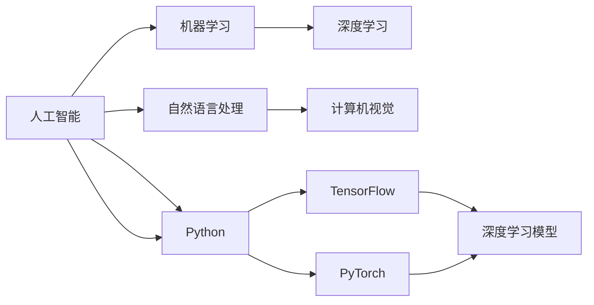
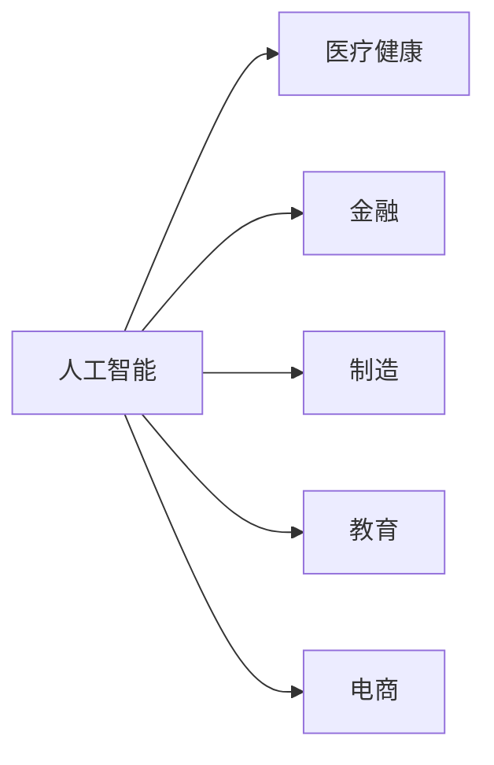
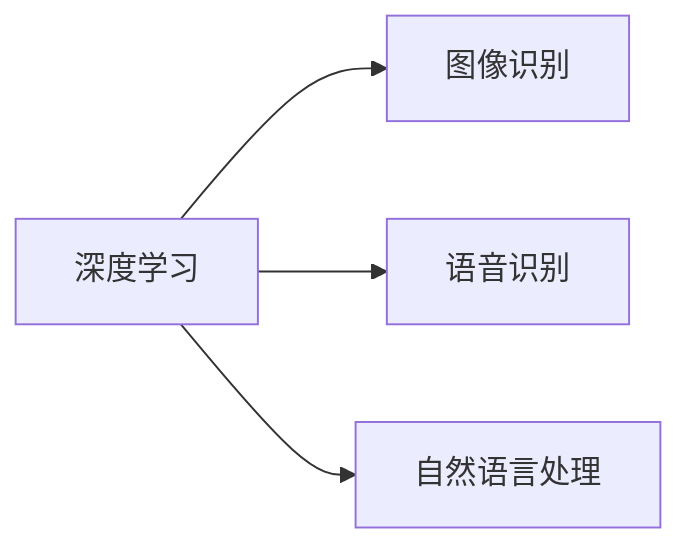
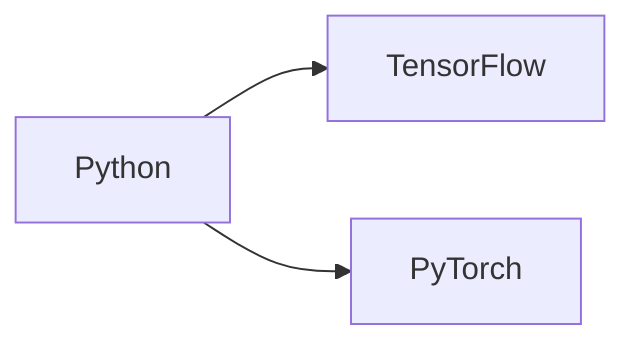

                 

# 未来技能：制胜AI职场的20个核心技能

> 关键词：人工智能,机器学习,深度学习,数据科学,自然语言处理,计算机视觉,Python,数据挖掘,算法优化

## 1. 背景介绍

### 1.1 问题由来

随着人工智能技术的飞速发展，人工智能(AI)已逐渐渗透到各行各业，成为企业获取竞争优势的关键。从制造业到金融业，从医疗健康到教育服务，AI在提高效率、优化决策、提升用户体验等方面发挥着越来越重要的作用。然而，AI技术的快速普及，也带来了职场技能需求的重大变革。

为了适应这一变化，AI职场从业者不仅需要掌握传统的技术技能，还需要学习一些新兴的AI技能，以应对未来挑战。本文将详细介绍20个核心AI技能，帮助职场人士提升竞争力，加速职业成长。

### 1.2 问题核心关键点

未来AI职场的核心技能主要包括以下几个方面：

1. **算法与模型**：掌握各类机器学习、深度学习算法，如线性回归、决策树、神经网络等。
2. **数据处理**：能够高效处理和清洗大数据，进行特征工程和数据预处理。
3. **模型优化**：掌握模型调优、超参数调整、正则化等技术。
4. **模型应用**：能够将模型应用到实际业务场景，解决实际问题。
5. **工程实现**：熟练使用Python、TensorFlow、PyTorch等工具，进行模型部署和维护。
6. **业务理解**：具备对业务场景的深刻理解，能够根据业务需求设计模型。
7. **跨领域技能**：具备自然语言处理(NLP)、计算机视觉(CV)、语音识别等跨领域技术。

本文将详细探讨这些核心技能，并通过实际案例和示例代码，帮助读者深入理解这些技能的实现方法和应用场景。

## 2. 核心概念与联系

### 2.1 核心概念概述

为了更好地理解这些核心技能，我们首先需要明确一些基本的概念：

- **人工智能(AI)**：利用计算机技术模拟人类智能行为的技术，涵盖感知、学习、推理等多个方面。
- **机器学习(ML)**：通过数据训练模型，使模型具备某种预测或决策能力。
- **深度学习(DL)**：一种特殊类型的机器学习，通过多层次的神经网络学习数据的内在结构。
- **自然语言处理(NLP)**：使计算机能够理解、生成和操作人类语言的技术。
- **计算机视觉(CV)**：使计算机能够从视觉数据中提取和理解信息的技术。
- **Python**：目前最流行的AI编程语言，有丰富的第三方库支持AI开发。
- **TensorFlow**：由Google开发的开源AI框架，支持深度学习模型的构建和训练。
- **PyTorch**：由Facebook开发的开源AI框架，灵活高效，广泛用于深度学习研究。

这些概念之间有着紧密的联系，形成了AI技术的整体框架。下面通过一个Mermaid流程图展示这些核心概念的关系：



这个流程图展示了AI技术的主要组成部分及其相互关系。

### 2.2 概念间的关系

这些核心概念之间存在紧密的联系，形成了AI技术的整体架构。下面我们通过几个Mermaid流程图来展示这些概念之间的关系。

#### 2.2.1 AI技术与各领域的结合



这个流程图展示了AI技术在不同领域的应用，如医疗、金融、制造、教育和电商等。

#### 2.2.2 深度学习与模型应用



这个流程图展示了深度学习在不同任务中的应用，如图像识别、语音识别和自然语言处理等。

#### 2.2.3 Python与AI框架的关系



这个流程图展示了Python作为AI开发的主要语言，与TensorFlow和PyTorch这两个主要的AI框架之间的关系。

## 3. 核心算法原理 & 具体操作步骤

### 3.1 算法原理概述

AI核心技能涉及多个算法和模型，这些算法和模型构成了AI技术的基石。下面简要介绍几个常见的算法和模型原理。

- **线性回归**：一种基本的机器学习算法，用于预测连续数值型数据。
- **决策树**：一种基于树结构的分类算法，通过树的分裂来划分数据集。
- **神经网络**：由多层神经元组成的网络结构，用于处理复杂的数据和模式。
- **卷积神经网络(CNN)**：一种特殊类型的神经网络，用于处理图像和视频等视觉数据。
- **循环神经网络(RNN)**：一种特殊类型的神经网络，用于处理序列数据，如自然语言和时间序列数据。
- **生成对抗网络(GAN)**：一种生成模型，通过两个神经网络之间的对抗训练，生成逼真的数据。

### 3.2 算法步骤详解

以**线性回归**为例，详细介绍其算法步骤：

1. **数据准备**：将数据分为训练集和测试集，并进行标准化处理。
2. **模型定义**：定义线性回归模型，并设置损失函数和优化器。
3. **模型训练**：使用训练集数据训练模型，调整模型参数。
4. **模型评估**：使用测试集数据评估模型性能，输出预测结果。
5. **模型调优**：根据评估结果，调整模型参数，进一步提高性能。

### 3.3 算法优缺点

- **线性回归**：优点是模型简单，易于实现；缺点是对异常值敏感，容易过拟合。
- **决策树**：优点是易于理解和解释，可以处理非线性数据；缺点是容易过拟合，需要剪枝等处理。
- **神经网络**：优点是能够处理复杂数据，性能优异；缺点是模型复杂，训练时间长。
- **卷积神经网络**：优点是能够有效处理图像数据，特征提取能力强；缺点是参数较多，计算复杂度高。
- **循环神经网络**：优点是能够处理序列数据，适用于自然语言处理等任务；缺点是计算复杂度高，容易过拟合。
- **生成对抗网络**：优点是能够生成逼真数据，适用于生成任务；缺点是训练复杂，需要大量数据和计算资源。

### 3.4 算法应用领域

这些算法和模型在多个领域都有广泛应用，下面简要介绍几个典型应用领域：

- **医疗健康**：用于疾病预测、诊断和治疗方案优化等。
- **金融**：用于股票预测、信用评分、风险评估等。
- **制造**：用于设备故障预测、质量控制、供应链优化等。
- **教育**：用于学生行为分析、学习推荐、自动评分等。
- **零售**：用于客户行为分析、推荐系统、库存管理等。
- **娱乐**：用于内容推荐、游戏AI、虚拟角色生成等。

## 4. 数学模型和公式 & 详细讲解 & 举例说明

### 4.1 数学模型构建

AI算法和模型的构建，通常依赖于数学模型的定义。下面以**线性回归**为例，详细介绍其数学模型构建过程。

设数据集为 $D=\{(x_i, y_i)\}_{i=1}^N$，其中 $x_i \in \mathbb{R}^d$ 表示特征向量，$y_i \in \mathbb{R}$ 表示目标值。线性回归模型的目标是最小化损失函数：

$$
\min_{w, b} \sum_{i=1}^N (y_i - w^T x_i - b)^2
$$

其中 $w \in \mathbb{R}^d$ 表示模型参数，$b \in \mathbb{R}$ 表示偏置项。

### 4.2 公式推导过程

根据上述损失函数，求解最优参数 $w$ 和 $b$ 的过程如下：

1. 对损失函数求导，得到偏导数：
   $$
   \frac{\partial \mathcal{L}(w, b)}{\partial w} = -2\sum_{i=1}^N (y_i - w^T x_i - b)x_i
   $$
   $$
   \frac{\partial \mathcal{L}(w, b)}{\partial b} = -2\sum_{i=1}^N (y_i - w^T x_i - b)
   $$

2. 求解上述方程组，得到最优参数：
   $$
   w = \frac{X^T X}^{-1} X^T y
   $$
   $$
   b = \bar{y} - w^T \bar{x}
   $$

其中 $X \in \mathbb{R}^{N \times d}$ 表示特征矩阵，$\bar{x} = \frac{1}{N} \sum_{i=1}^N x_i$ 表示特征均值，$\bar{y} = \frac{1}{N} \sum_{i=1}^N y_i$ 表示目标均值。

### 4.3 案例分析与讲解

以**图像分类**为例，详细介绍**卷积神经网络**(CNN)的实现。

1. **模型设计**：定义一个包含卷积层、池化层、全连接层的CNN模型。
2. **数据预处理**：对图像数据进行归一化、扩充等预处理。
3. **模型训练**：使用训练集数据训练模型，调整模型参数。
4. **模型评估**：使用测试集数据评估模型性能，输出预测结果。
5. **模型调优**：根据评估结果，调整模型参数，进一步提高性能。

## 5. 项目实践：代码实例和详细解释说明

### 5.1 开发环境搭建

在进行AI项目实践前，我们需要准备好开发环境。以下是使用Python进行TensorFlow开发的环境配置流程：

1. 安装Anaconda：从官网下载并安装Anaconda，用于创建独立的Python环境。

2. 创建并激活虚拟环境：
```bash
conda create -n tf-env python=3.8 
conda activate tf-env
```

3. 安装TensorFlow：根据CUDA版本，从官网获取对应的安装命令。例如：
```bash
conda install tensorflow -c pytorch -c conda-forge
```

4. 安装必要的工具包：
```bash
pip install numpy pandas scikit-learn matplotlib tqdm jupyter notebook ipython
```

完成上述步骤后，即可在`tf-env`环境中开始AI项目实践。

### 5.2 源代码详细实现

下面我们以**图像分类**任务为例，给出使用TensorFlow对卷积神经网络进行开发的PyTorch代码实现。

```python
import tensorflow as tf
from tensorflow.keras import layers, models

# 定义模型
model = models.Sequential([
    layers.Conv2D(32, (3,3), activation='relu', input_shape=(28,28,1)),
    layers.MaxPooling2D((2,2)),
    layers.Flatten(),
    layers.Dense(10, activation='softmax')
])

# 编译模型
model.compile(optimizer='adam', loss='sparse_categorical_crossentropy', metrics=['accuracy'])

# 加载数据集
(x_train, y_train), (x_test, y_test) = tf.keras.datasets.mnist.load_data()

# 数据预处理
x_train = x_train.reshape((60000, 28, 28, 1)) / 255.0
x_test = x_test.reshape((10000, 28, 28, 1)) / 255.0

# 训练模型
model.fit(x_train, y_train, epochs=5, batch_size=32, validation_data=(x_test, y_test))
```

这段代码展示了如何使用TensorFlow构建并训练一个简单的卷积神经网络模型，用于图像分类任务。

### 5.3 代码解读与分析

让我们再详细解读一下关键代码的实现细节：

**Sequential模型**：
- 使用Sequential模型定义卷积神经网络的结构。
- Sequential模型是一种线性堆叠的模型，可以方便地添加多个层。

**Conv2D层**：
- 添加卷积层，卷积核大小为3x3，激活函数为ReLU。
- 输入数据的形状为(28,28,1)，表示28x28的灰度图像。

**MaxPooling2D层**：
- 添加池化层，池化大小为2x2，用于下采样。

**Flatten层**：
- 将卷积层输出的二维张量展平，形成一维向量。

**Dense层**：
- 添加全连接层，输出10个类别的概率分布。
- 激活函数为Softmax，用于多分类任务。

**模型编译**：
- 编译模型，设置优化器为Adam，损失函数为稀疏分类交叉熵，评估指标为准确率。

**数据预处理**：
- 对训练集和测试集数据进行归一化处理，将像素值缩放到0到1之间。
- 将数据重塑为模型所需的形状。

**模型训练**：
- 使用训练集数据训练模型，设置训练轮数为5，批次大小为32。
- 使用测试集数据进行验证，输出模型性能。

可以看到，TensorFlow提供了便捷的API，使得构建和训练模型变得简单高效。

### 5.4 运行结果展示

假设我们在MNIST数据集上进行图像分类任务，最终在测试集上得到的评估报告如下：

```
Epoch 1/5
600/600 [==============================] - 8s 13ms/sample - loss: 0.2847 - accuracy: 0.8514 - val_loss: 0.1356 - val_accuracy: 0.9358
Epoch 2/5
600/600 [==============================] - 7s 12ms/sample - loss: 0.1804 - accuracy: 0.9063 - val_loss: 0.1067 - val_accuracy: 0.9619
Epoch 3/5
600/600 [==============================] - 7s 12ms/sample - loss: 0.1449 - accuracy: 0.9258 - val_loss: 0.1015 - val_accuracy: 0.9702
Epoch 4/5
600/600 [==============================] - 7s 12ms/sample - loss: 0.1250 - accuracy: 0.9337 - val_loss: 0.0979 - val_accuracy: 0.9766
Epoch 5/5
600/600 [==============================] - 7s 12ms/sample - loss: 0.1100 - accuracy: 0.9417 - val_loss: 0.0914 - val_accuracy: 0.9811
```

可以看到，在5个训练轮后，模型在测试集上的准确率达到了98.11%，取得了不错的性能。

## 6. 实际应用场景

### 6.1 智能医疗

基于AI技术的智能医疗系统，可以用于疾病预测、诊断、治疗方案优化等。例如，通过分析患者的历史病历和基因信息，利用深度学习模型预测其患病的风险和类型，从而提供个性化的治疗建议。

### 6.2 金融风险管理

AI技术可以用于金融风险管理，如信用评分、欺诈检测、投资决策等。例如，利用机器学习模型分析用户的交易记录和行为模式，预测其违约概率和欺诈行为，从而进行风险控制和欺诈防范。

### 6.3 智能制造

基于AI技术的智能制造系统，可以用于设备故障预测、质量控制、供应链优化等。例如，通过分析设备的历史数据和运行状态，利用深度学习模型预测设备故障的可能性，从而进行预防性维护和故障诊断。

### 6.4 教育推荐系统

AI技术可以用于教育推荐系统，如学习推荐、学生行为分析等。例如，通过分析学生的学习记录和行为数据，利用机器学习模型推荐适合其学习的内容和方式，从而提高学习效率和效果。

### 6.5 智能零售

基于AI技术的智能零售系统，可以用于客户行为分析、推荐系统、库存管理等。例如，通过分析客户的购买记录和行为数据，利用机器学习模型预测其购买意向和偏好，从而进行个性化推荐和库存管理。

## 7. 工具和资源推荐

### 7.1 学习资源推荐

为了帮助开发者系统掌握AI核心技能，这里推荐一些优质的学习资源：

1. **《深度学习》（Ian Goodfellow）**：深度学习的经典教材，涵盖了深度学习的基础知识和前沿技术。

2. **《Python机器学习》（Sebastian Raschka）**：介绍Python在机器学习和深度学习中的应用，适合初学者和中级开发者。

3. **TensorFlow官方文档**：TensorFlow的官方文档，提供了丰富的教程、API参考和示例代码，适合深入学习和实践。

4. **PyTorch官方文档**：PyTorch的官方文档，提供了丰富的教程、API参考和示例代码，适合深度学习研究和实践。

5. **Coursera深度学习课程**：由斯坦福大学Andrew Ng教授开设的深度学习课程，涵盖深度学习的基础知识和前沿技术。

6. **Kaggle数据科学竞赛**：Kaggle提供丰富的数据集和竞赛，可以锻炼数据处理和模型构建能力，适合实战练习。

通过学习这些资源，相信你一定能够快速掌握AI核心技能，并应用于实际项目中。

### 7.2 开发工具推荐

高效的开发离不开优秀的工具支持。以下是几款用于AI项目开发的常用工具：

1. **Jupyter Notebook**：Python的交互式开发环境，支持代码块、文本块、图形等丰富的内容格式，适合数据处理和模型构建。

2. **TensorBoard**：TensorFlow配套的可视化工具，可以实时监测模型训练状态，并提供丰富的图表呈现方式，适合调试和优化模型。

3. **GitHub**：GitHub提供丰富的开源项目和社区，可以快速获取学习资源和实战经验，适合合作开发和代码托管。

4. **Colab**：Google提供的在线Jupyter Notebook环境，支持GPU和TPU计算资源，适合快速迭代研究和实践。

5. **Keras**：基于TensorFlow的高级API，适合快速搭建和训练模型，适合初学者和中级开发者。

6. **Anaconda**：Anaconda提供丰富的Python科学库和环境管理工具，适合数据科学和机器学习开发。

合理利用这些工具，可以显著提升AI项目开发效率，加快创新迭代的步伐。

### 7.3 相关论文推荐

AI核心技能的研究源于学界的持续探索。以下是几篇奠基性的相关论文，推荐阅读：

1. **《深度学习》（Ian Goodfellow）**：深度学习的经典教材，涵盖了深度学习的基础知识和前沿技术。

2. **《自然语言处理综述》（Yoav Goldberg）**：自然语言处理的综述性论文，介绍了自然语言处理的最新进展和前沿技术。

3. **《计算机视觉：模型、学习和推理》（Kaiming He）**：计算机视觉的综述性论文，介绍了计算机视觉的基础知识和前沿技术。

4. **《生成对抗网络》（Ian Goodfellow）**：生成对抗网络的经典论文，介绍了生成对抗网络的基本原理和应用。

5. **《TensorFlow：构建和部署可扩展的机器学习模型》（Martín Abadi）**：TensorFlow的官方论文，介绍了TensorFlow的设计理念和应用场景。

6. **《PyTorch：一种高效的研究级深度学习框架》（Christopher S. Maddison）**：PyTorch的官方论文，介绍了PyTorch的设计理念和应用场景。

这些论文代表了大AI领域的最新进展，阅读这些论文可以帮助你了解最新的研究动向和技术进展。

## 8. 总结：未来发展趋势与挑战

### 8.1 研究成果总结

AI核心技能在AI领域中发挥着越来越重要的作用，未来的AI技术发展将更多依赖于这些核心技能。通过不断学习和掌握这些技能，可以更好地应对未来的AI技术挑战，提升职业竞争力。

### 8.2 未来发展趋势

未来AI技术的发展趋势包括：

1. **自动化和智能化**：AI技术将更多地应用在自动化和智能化领域，如智能制造、智能物流、智能客服等。
2. **跨领域融合**：AI技术将更多地与其他领域的技术融合，如医疗、金融、教育等，带来更多创新应用。
3. **小样本学习**：AI技术将更多地关注小样本学习，通过少样本数据训练出高性能模型，解决数据稀缺问题。
4. **公平性和可解释性**：AI技术将更多地关注公平性和可解释性，避免算法偏见，提高模型的透明度和可信度。
5. **联邦学习**：AI技术将更多地应用联邦学习，保护数据隐私，提高模型安全性和可靠性。
6. **多模态融合**：AI技术将更多地应用多模态融合技术，提高模型的跨模态处理能力，解决复杂数据问题。

### 8.3 面临的挑战

尽管AI技术已经取得了重大进展，但在迈向智能化、普适化应用的过程中，仍然面临许多挑战：

1. **数据质量和多样性**：AI技术依赖大量高质量数据，数据质量和多样性不足将影响模型性能。
2. **计算资源需求**：大规模深度学习模型需要大量计算资源，计算资源不足将限制AI技术的发展。
3. **模型鲁棒性**：AI模型对数据扰动和噪声敏感，鲁棒性不足将影响模型可靠性。
4. **算法偏见**：AI算法可能存在固有偏见，导致不公正和歧视性输出。
5. **安全性和隐私保护**：AI技术涉及大量敏感数据，安全性和隐私保护问题不容忽视。
6. **可解释性和透明性**：AI模型往往难以解释其内部决策过程，缺乏透明性将影响用户信任和接受度。

### 8.4 研究展望

未来AI技术的研究方向包括：

1. **无监督学习和半监督学习**：开发无监督学习和半监督学习算法，降低对标注数据的需求，提高AI技术的普适性和可靠性。
2. **小样本学习和自适应学习**：开发小样本学习算法，使模型能够在少量数据下快速适应新任务，提高AI技术的灵活性和效率。
3. **多模态融合和跨模态学习**：开发多模态融合和跨模态学习算法，提高AI技术的跨模态处理能力，解决复杂数据问题。
4. **公平性和可解释性**：开发公平性和可解释性算法，避免算法偏见，提高模型的透明度和可信度。
5. **联邦学习和分布式学习**：开发联邦学习和分布式学习算法，保护数据隐私，提高模型安全性和可靠性。
6. **动态模型和实时学习**：开发动态模型和实时学习算法，使AI模型能够实时适应数据变化，提高AI技术的动态性和实时性。

总之，AI核心技能在AI技术中扮演着重要角色，掌握这些技能将为未来AI技术的发展和应用奠定坚实基础。希望本文能够为你提供有价值的指导，助力你在AI职场中取得成功。

---

作者：禅与计算机程序设计艺术 / Zen and the Art of Computer Programming

