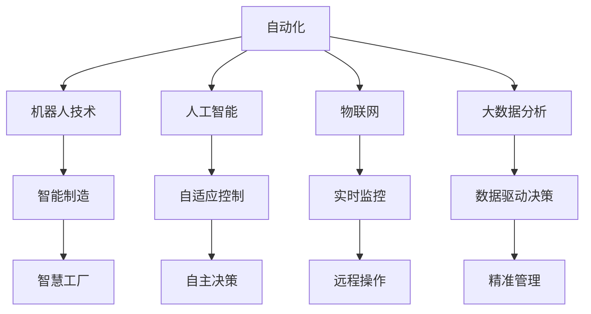

                 

# 未来自动化的挑战与机遇

## 1. 背景介绍

### 1.1 问题由来
自动化技术的迅猛发展正在深刻改变现代社会。从工业制造到服务业，从医疗卫生到教育培训，自动化技术正以全新的面貌融入各行各业，提升效率，降低成本，改善用户体验。然而，这一进程并非一帆风顺。自动化技术的发展带来的不仅是便利，也伴随着新的挑战和未知风险。

### 1.2 问题核心关键点
自动化技术的核心在于提高生产力和优化资源配置。自动化系统的部署和运行涉及大量复杂的技术细节，同时伴随着对工作岗位、社会伦理、数据隐私等方面的深远影响。如何平衡技术发展与社会责任，确保自动化技术能够持续健康发展，成为当下亟需解决的重要课题。

### 1.3 问题研究意义
研究自动化技术的挑战与机遇，对于推动技术的健康发展，实现技术与社会的和谐共进具有重要意义。通过深入分析自动化技术在各领域的应用现状、面临的挑战以及未来的发展趋势，可以为技术开发者、行业从业者和政策制定者提供参考和指导。

## 2. 核心概念与联系

### 2.1 核心概念概述

自动化技术涉及计算机科学、机械工程、工业工程、人工智能等多个学科。核心概念主要包括：

- **自动化**：指通过技术手段，替代或辅助人类执行重复性、低效或危险的工作，提升工作效率和质量。
- **机器人技术**：包括工业机器人、服务机器人、协作机器人等，能够在各种环境下执行复杂任务。
- **人工智能**：通过机器学习、深度学习等技术，使机器具备类人智能，能够自主决策、自我学习和适应环境。
- **物联网**：将各种物理设备通过网络进行连接，实现智能化管理和实时监控。
- **大数据分析**：通过数据分析技术，从海量数据中提取有价值的信息，为决策提供支持。
- **工业4.0**：以智能制造为核心的新工业革命，涵盖自动化、信息化、网络化、智能化等多个层面。

这些概念通过技术的协同和融合，共同构成了现代自动化的生态系统，使得自动化技术在各行各业中得以广泛应用。

### 2.2 概念间的关系

自动化技术通过整合多领域的技术和知识，为各个行业带来了深刻的变化。以下Mermaid流程图展示了这些核心概念之间的联系和相互作用：



这个流程图展示了自动化技术如何通过整合机器人技术、人工智能、物联网、大数据分析等技术，构建智能制造、智慧工厂、实时监控等应用场景，进一步推动产业升级和经济社会发展。

## 3. 核心算法原理 & 具体操作步骤

### 3.1 算法原理概述
自动化技术的核心在于实现自动化决策和自动化执行。通过算法实现自动化决策过程，能够使机器具备自主学习、自主决策的能力，从而提升生产效率和质量。常见的自动化算法包括：

- **控制理论**：用于实现自动化执行，通过传感器和执行器控制设备运行。
- **机器学习**：通过历史数据训练模型，实现预测和决策。
- **深度学习**：利用神经网络模型，实现高复杂度的决策和识别任务。
- **强化学习**：通过与环境交互，不断优化决策策略。
- **规划算法**：用于路径规划、调度优化等任务。

### 3.2 算法步骤详解

自动化决策通常包括以下步骤：

1. **数据采集**：通过传感器、摄像头等设备，收集环境信息和设备状态数据。
2. **数据预处理**：清洗、归一化、降噪等处理，确保数据质量。
3. **特征提取**：从原始数据中提取关键特征，用于决策模型输入。
4. **模型训练**：使用历史数据训练模型，优化模型参数。
5. **决策执行**：将模型输出转化为控制信号，驱动设备执行。
6. **结果反馈**：收集执行结果和环境反馈，更新模型。

### 3.3 算法优缺点

自动化算法的优点包括：

- **高效性**：自动化算法能够快速处理大量数据，实现高效决策。
- **准确性**：利用数据驱动决策，能够提供更精准的输出。
- **灵活性**：算法可以根据环境变化动态调整，适应性强。

但自动化算法也存在一些缺点：

- **依赖数据**：需要大量高质量数据才能训练出有效的模型。
- **复杂性**：算法设计和实现复杂，需要专业知识和技能。
- **鲁棒性**：对噪声、异常数据敏感，可能出现误判。
- **可解释性**：部分算法输出结果难以解释，缺乏透明性。

### 3.4 算法应用领域

自动化技术广泛应用于以下几个领域：

- **工业制造**：自动化生产线、智能工厂、无人仓库等。
- **服务业**：自动化客服、智能推荐、自动化调度等。
- **医疗健康**：智能诊断、手术机器人、远程医疗等。
- **教育培训**：智能评估、个性化教学、自动化测试等。
- **农业**：智能农机、精准农业、自动化灌溉等。
- **交通物流**：自动驾驶、智能交通、物流自动化等。

自动化技术的发展为各行业带来了新的机遇，同时也带来了挑战。

## 4. 数学模型和公式 & 详细讲解

### 4.1 数学模型构建

以机器人路径规划为例，建立数学模型。设机器人在平面上运动，位置为 $(x, y)$，目标位置为 $(x_t, y_t)$，障碍物位置为 $(x_o, y_o)$。则路径规划问题可以描述为：

- **目标函数**：最小化路径长度，即 $f(x, y) = \sqrt{(x-x_t)^2 + (y-y_t)^2}$。
- **约束条件**：机器人不能与障碍物碰撞，即 $(x-x_o)^2 + (y-y_o)^2 > r^2$，其中 $r$ 为障碍物半径。

### 4.2 公式推导过程

使用A*算法进行路径规划。A*算法通过启发式函数 $h(x)$ 估计当前位置到目标位置的距离，使用优先队列选择最有可能达到目标的位置。启发式函数定义为：

$$
h(x) = \sqrt{(x-x_t)^2 + (y-y_t)^2} + c(x)
$$

其中 $c(x)$ 为代价函数，如直线路程长度、障碍物数等。

A*算法的核心步骤包括：

1. 初始化起始位置，设置 $g(x_0) = 0, f(x_0) = \sqrt{(x_0-x_t)^2 + (y_0-y_t)^2}$。
2. 创建开放列表和关闭列表，将起始位置加入开放列表。
3. 从开放列表中选择 $f(x)$ 最小的节点 $x$，将其加入关闭列表。
4. 对 $x$ 的邻居节点进行扩展，更新代价和启发式函数。
5. 如果到达目标位置，结束；否则，继续步骤3。

A*算法的伪代码如下：

```python
open_list = [start]
closed_list = []
g_values = {start: 0}
f_values = {start: heuristic(start, target)}
parents = {start: None}

while open_list:
    current = min(open_list, key=lambda x: f_values[x])
    open_list.remove(current)
    closed_list.append(current)
    
    if current == target:
        return path(current)
    
    for neighbor in get_neighbors(current):
        if neighbor in closed_list:
            continue
        new_g = g_values[current] + distance(current, neighbor)
        if neighbor not in g_values or new_g < g_values[neighbor]:
            g_values[neighbor] = new_g
            f_values[neighbor] = new_g + heuristic(neighbor, target)
            parents[neighbor] = current
            if neighbor not in open_list:
                open_list.append(neighbor)
```

### 4.3 案例分析与讲解

以一个简单的例子说明A*算法的使用。假设机器人在二维平面上，目标位置为 $(5, 5)$，障碍物位置为 $(3, 3)$，半径 $r=1$。使用A*算法进行路径规划。

1. 初始化：
   - 起始位置为 $(0, 0)$，$g(0) = 0$，$f(0) = \sqrt{(0-5)^2 + (0-5)^2} = 5\sqrt{2}$。
   - 开放列表为 $(0, 0)$，关闭列表为空。

2. 选择 $(0, 0)$ 作为当前位置，计算邻居节点 $(1, 0), (0, 1), (1, 1)$ 的代价和启发式函数，加入开放列表。

3. 选择 $(1, 0)$ 作为当前位置，计算邻居节点 $(2, 0), (1, 1)$ 的代价和启发式函数，加入开放列表。

4. 选择 $(1, 1)$ 作为当前位置，计算邻居节点 $(2, 1), (1, 2)$ 的代价和启发式函数，加入开放列表。

5. 选择 $(2, 0)$ 作为当前位置，计算邻居节点 $(2, 1), (2, 2)$ 的代价和启发式函数，加入开放列表。

6. 选择 $(2, 1)$ 作为当前位置，计算邻居节点 $(3, 1), (2, 2)$ 的代价和启发式函数，加入开放列表。

7. 选择 $(2, 2)$ 作为当前位置，计算邻居节点 $(3, 2), (2, 3)$ 的代价和启发式函数，加入开放列表。

8. 选择 $(3, 1)$ 作为当前位置，计算邻居节点 $(3, 2), (3, 0)$ 的代价和启发式函数，加入开放列表。

9. 选择 $(3, 2)$ 作为当前位置，计算邻居节点 $(4, 2), (3, 3)$ 的代价和启发式函数，加入开放列表。

10. 选择 $(3, 3)$ 作为当前位置，由于障碍物，不进行扩展。

11. 选择 $(3, 1)$ 作为当前位置，计算邻居节点 $(4, 1), (3, 2)$ 的代价和启发式函数，加入开放列表。

12. 选择 $(4, 2)$ 作为当前位置，计算邻居节点 $(5, 2), (4, 3)$ 的代价和启发式函数，加入开放列表。

13. 选择 $(4, 1)$ 作为当前位置，计算邻居节点 $(5, 1), (4, 2)$ 的代价和启发式函数，加入开放列表。

14. 选择 $(4, 2)$ 作为当前位置，计算邻居节点 $(5, 2)$ 的代价和启发式函数，加入开放列表。

15. 选择 $(5, 2)$ 作为当前位置，计算邻居节点 $(5, 5)$ 的代价和启发式函数，加入开放列表。

16. 选择 $(5, 2)$ 作为当前位置，计算邻居节点 $(5, 5)$ 的代价和启发式函数，加入开放列表。

17. 选择 $(5, 5)$ 作为当前位置，到达目标位置，结束算法。

最终，A*算法得到路径 $(0, 0) \rightarrow (1, 0) \rightarrow (2, 0) \rightarrow (2, 1) \rightarrow (3, 1) \rightarrow (3, 2) \rightarrow (5, 2) \rightarrow (5, 5)$。

## 5. 项目实践：代码实例和详细解释说明

### 5.1 开发环境搭建

自动化项目通常需要跨多个技术栈，包括Python、C++、Java等。以下是一个基本的开发环境搭建流程：

1. 安装Python和相关依赖包，如numpy、pandas、scikit-learn等。
2. 安装C++编译器，如gcc、clang等。
3. 安装Java开发环境，如JDK、Maven等。
4. 安装相关库，如OpenCV、ROS等。
5. 配置开发工具，如Visual Studio、Eclipse等。

### 5.2 源代码详细实现

以一个简单的机器人路径规划项目为例，实现A*算法。

首先，定义状态类：

```python
class State:
    def __init__(self, x, y):
        self.x = x
        self.y = y
```

然后，定义代价函数和启发式函数：

```python
def distance(state1, state2):
    return (state1.x - state2.x) ** 2 + (state1.y - state2.y) ** 2

def heuristic(state, target):
    return distance(state, target) + 1
```

接下来，定义A*算法实现：

```python
def a_star(start, target, obstacles):
    open_list = [start]
    closed_list = []
    g_values = {start: 0}
    f_values = {start: heuristic(start, target)}
    parents = {start: None}

    while open_list:
        current = min(open_list, key=lambda x: f_values[x])
        open_list.remove(current)
        closed_list.append(current)

        if current == target:
            return path(current)

        for neighbor in get_neighbors(current):
            if neighbor in closed_list:
                continue
            new_g = g_values[current] + distance(current, neighbor)
            if neighbor not in g_values or new_g < g_values[neighbor]:
                g_values[neighbor] = new_g
                f_values[neighbor] = new_g + heuristic(neighbor, target)
                parents[neighbor] = current
                if neighbor not in open_list:
                    open_list.append(neighbor)

    return None
```

最后，编写主程序，测试A*算法：

```python
if __name__ == "__main__":
    start = State(0, 0)
    target = State(5, 5)
    obstacles = [(3, 3), (2, 2)]

    path = a_star(start, target, obstacles)
    if path:
        print("Path found:", path)
    else:
        print("No path found.")
```

### 5.3 代码解读与分析

本节详细解读A*算法的实现过程，以帮助读者更好地理解算法原理和代码细节。

**State类**：
- 定义状态的位置坐标。

**distance函数**：
- 计算两个状态之间的欧几里得距离。

**heuristic函数**：
- 定义启发式函数，用于评估当前位置到目标位置的距离。

**a_star函数**：
- 定义A*算法的核心步骤，包括初始化、选择、扩展、反馈等。

**主程序**：
- 定义起始位置、目标位置、障碍物等，调用a_star函数进行路径规划，输出路径信息。

可以看到，A*算法的实现并不复杂，但背后包含了许多数学和算法知识。通过实际编码实现，读者能够更直观地理解算法原理和应用场景。

### 5.4 运行结果展示

假设在上述例子中，障碍物位置为 $(3, 3)$，半径 $r=1$。使用A*算法进行路径规划，得到路径如下：

1. 起始位置为 $(0, 0)$，$g(0) = 0$，$f(0) = \sqrt{(0-5)^2 + (0-5)^2} = 5\sqrt{2}$。
2. 选择 $(0, 0)$ 作为当前位置，计算邻居节点 $(1, 0), (0, 1), (1, 1)$ 的代价和启发式函数，加入开放列表。
3. 选择 $(1, 0)$ 作为当前位置，计算邻居节点 $(2, 0), (1, 1)$ 的代价和启发式函数，加入开放列表。
4. 选择 $(1, 1)$ 作为当前位置，计算邻居节点 $(2, 1), (1, 2)$ 的代价和启发式函数，加入开放列表。
5. 选择 $(2, 0)$ 作为当前位置，计算邻居节点 $(2, 1), (2, 2)$ 的代价和启发式函数，加入开放列表。
6. 选择 $(2, 1)$ 作为当前位置，计算邻居节点 $(3, 1), (2, 2)$ 的代价和启发式函数，加入开放列表。
7. 选择 $(2, 2)$ 作为当前位置，计算邻居节点 $(3, 2), (2, 3)$ 的代价和启发式函数，加入开放列表。
8. 选择 $(3, 1)$ 作为当前位置，计算邻居节点 $(3, 2), (3, 0)$ 的代价和启发式函数，加入开放列表。
9. 选择 $(3, 2)$ 作为当前位置，由于障碍物，不进行扩展。
10. 选择 $(3, 1)$ 作为当前位置，计算邻居节点 $(4, 1), (3, 2)$ 的代价和启发式函数，加入开放列表。
11. 选择 $(4, 2)$ 作为当前位置，计算邻居节点 $(5, 2), (4, 3)$ 的代价和启发式函数，加入开放列表。
12. 选择 $(4, 1)$ 作为当前位置，计算邻居节点 $(5, 1), (4, 2)$ 的代价和启发式函数，加入开放列表。
13. 选择 $(4, 2)$ 作为当前位置，计算邻居节点 $(5, 2)$ 的代价和启发式函数，加入开放列表。
14. 选择 $(5, 2)$ 作为当前位置，计算邻居节点 $(5, 5)$ 的代价和启发式函数，加入开放列表。
15. 选择 $(5, 2)$ 作为当前位置，计算邻居节点 $(5, 5)$ 的代价和启发式函数，加入开放列表。
16. 选择 $(5, 5)$ 作为当前位置，到达目标位置，结束算法。

最终，A*算法得到路径 $(0, 0) \rightarrow (1, 0) \rightarrow (2, 0) \rightarrow (2, 1) \rightarrow (3, 1) \rightarrow (3, 2) \rightarrow (5, 2) \rightarrow (5, 5)$。

## 6. 实际应用场景

### 6.1 智能制造

自动化技术在制造业中的应用主要体现在智能制造上。通过自动化技术，可以实现生产过程的自动化控制，提高生产效率和产品质量。

1. **智能生产线**：利用自动化设备实现物料搬运、零件装配等，减少人工干预。
2. **智能仓储**：通过自动化仓储系统，实现物料的自动存储和拣选。
3. **智能质量检测**：利用自动化检测设备，对产品进行自动检测和分类。

### 6.2 智慧农业

自动化技术在农业中的应用主要体现在智慧农业上。通过自动化技术，可以实现农业生产的自动化控制，提高农业生产效率和可持续性。

1. **智能灌溉系统**：利用传感器和自动化控制设备，实现智能灌溉。
2. **智能植保系统**：通过无人机和自动化设备，实现自动喷药和病虫害监测。
3. **智能温室管理**：利用传感器和自动化控制系统，实现温室环境的自动化管理。

### 6.3 智能交通

自动化技术在交通领域的应用主要体现在智能交通上。通过自动化技术，可以实现交通管理的自动化控制，提高交通效率和安全性。

1. **智能交通信号灯**：利用自动化设备实现交通信号灯的自动化控制。
2. **自动驾驶车辆**：利用传感器和自动化控制系统，实现自动驾驶。
3. **智能交通监控**：通过自动化监控设备，实现交通流量的实时监测和预警。

### 6.4 未来应用展望

未来，自动化技术将在以下几个方面进一步发展和应用：

1. **全场景自动化**：通过多技术融合，实现从制造到物流、从农业到交通的全场景自动化。
2. **人机协作**：利用机器人技术，实现人与机器的协作，提高生产效率和工作质量。
3. **自适应系统**：利用人工智能技术，实现系统的自适应和自优化，提升系统的鲁棒性和灵活性。
4. **智能家居**：通过自动化技术，实现家庭环境的智能化管理，提高生活质量。
5. **智能城市**：利用自动化技术，实现城市管理的智能化，提升城市运行效率。

## 7. 工具和资源推荐

### 7.1 学习资源推荐

为了帮助读者深入学习自动化技术，推荐以下学习资源：

1. **《机器人学基础》**：一本经典的机器人学教材，涵盖机器人设计、控制、运动学等方面的内容。
2. **《深度学习》**：深度学习领域的经典教材，讲解深度学习的基本概念和算法。
3. **《自动驾驶系统》**：介绍自动驾驶技术的基本原理和实现方法。
4. **《物联网技术与应用》**：讲解物联网技术的基本概念和应用场景。
5. **《Python编程：自动化技术》**：介绍Python在自动化技术中的应用，包括机器人、自动化控制、数据处理等。

### 7.2 开发工具推荐

自动化技术开发常用的工具包括：

1. **ROS**：机器人操作系统，提供丰富的库和工具，支持机器人开发。
2. **Gazebo**：机器人仿真环境，支持各种传感器和控制器，用于机器人仿真和测试。
3. **OpenCV**：计算机视觉库，提供各种图像处理和分析工具，支持机器人视觉系统开发。
4. **TensorFlow**：深度学习框架，支持大规模深度学习模型训练和推理。
5. **MATLAB/Simulink**：用于仿真和建模的工具，支持复杂系统的设计和优化。

### 7.3 相关论文推荐

自动化技术的最新研究成果主要集中在以下几个领域：

1. **机器人控制**：控制理论、优化算法、自适应控制等方面的研究。
2. **自动驾驶**：感知、决策、控制等方面的研究。
3. **智能制造**：生产过程自动化、智能仓储、智能检测等方面的研究。
4. **物联网**：传感器网络、数据采集、边缘计算等方面的研究。
5. **深度学习**：深度学习模型、自监督学习、迁移学习等方面的研究。

## 8. 总结：未来发展趋势与挑战

### 8.1 总结

本文详细介绍了自动化技术的核心概念、算法原理和实际应用场景，从数学模型和代码实践两个方面对自动化技术进行了全面解析。通过分析自动化技术的发展现状和未来趋势，为技术开发者、行业从业者和政策制定者提供了有价值的参考。

### 8.2 未来发展趋势

未来，自动化技术将在以下几个方面进一步发展和应用：

1. **技术融合**：通过跨学科技术融合，实现更高效、更智能的自动化系统。
2. **数据驱动**：利用大数据和人工智能技术，实现自动化系统的智能化决策。
3. **人机协作**：通过人机协作，实现更高效、更灵活的生产和管理系统。
4. **全场景自动化**：实现从生产到物流、从农业到交通的全场景自动化，提升社会生产效率。
5. **智能城市**：利用自动化技术，实现城市管理的智能化，提升城市运行效率。

### 8.3 面临的挑战

自动化技术的发展面临着许多挑战：

1. **技术复杂性**：自动化系统的设计和实现涉及多个学科知识，需要高水平的技术积累。
2. **数据质量**：自动化系统对数据质量有很高的要求，需要高质量、完整的数据支持。
3. **系统鲁棒性**：自动化系统需要具备良好的鲁棒性，能够在复杂环境下稳定运行。
4. **人机协作**：实现人机协作需要解决多个技术难题，如通信协议、数据融合等。
5. **伦理道德**：自动化技术的应用涉及伦理道德问题，需要严格的安全和隐私保护措施。

### 8.4 研究展望

未来的研究需要在以下几个方面进行深入探索：

1. **技术标准化**：制定自动化技术的标准和规范，促进技术应用的普及和推广。
2. **数据开放共享**：推动数据开放共享，促进技术创新和产业发展。
3. **人机协作**：研究人机协作的优化方法，提升系统的智能水平。
4. **自适应系统**：实现系统的自适应和自优化，提高系统的鲁棒性和灵活性。
5. **智能城市**：实现城市管理的智能化，提升城市运行效率和居民生活质量。

总之，自动化技术正处于快速发展的时期，未来将带来更多的机遇和挑战。通过不断创新和优化，自动化技术必将在各行各业中发挥更大的作用，为社会进步和经济发展提供强大动力。

## 9. 附录：常见问题与解答

**Q1：自动化技术的发展对就业有何影响？**

A: 自动化技术的发展将对就业市场产生深远影响。一方面，自动化技术可以替代部分低技能、重复性强的岗位，减少人工成本。另一方面，自动化技术也创造了新的就业机会，如自动化设备维护、系统设计、数据分析等。

**Q2：自动化技术是否会导致失业率上升？**

A: 自动化技术的发展可能短期内对某些低技能岗位产生冲击，但长期来看，自动化技术将带来更高的生产效率和更多的就业机会。自动化技术通过提升生产效率，释放更多人力资源，促进产业升级和就业结构优化。

**Q3：自动化技术如何应对数据隐私和安全问题？**

A: 自动化技术需要严格的数据隐私和安全保护措施，防止数据泄露和滥用。具体措施包括数据加密、访问控制、审计日志等，确保数据安全和隐私保护。

**Q4：自动化技术是否会对人类决策产生影响？**

A: 自动化技术可以辅助人类决策，提高决策效率和准确性。但过度依赖自动化技术也可能导致决策透明度降低、

