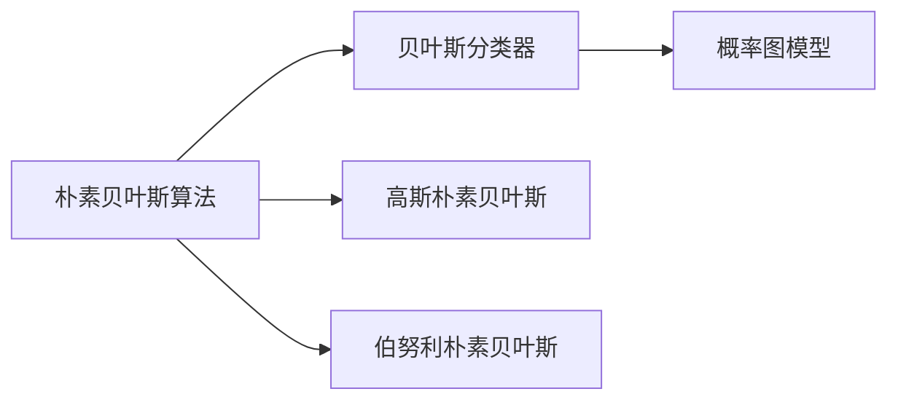

                 

# 朴素贝叶斯 原理与代码实例讲解

> 关键词：朴素贝叶斯, 贝叶斯分类器, 高斯朴素贝叶斯, 伯努利朴素贝叶斯, 朴素贝叶斯算法, 概率图模型, 代码实例

## 1. 背景介绍

### 1.1 问题由来

朴素贝叶斯分类器（Naive Bayes Classifier）是机器学习领域中的一种经典算法，特别适用于文本分类、垃圾邮件过滤、情感分析等任务。它的优点在于简单、高效、易于实现，并且在处理大规模数据时表现优异。然而，由于其假设特征之间相互独立，实际应用中可能会引入一定的偏差。本文将详细介绍朴素贝叶斯算法的原理，并通过Python代码实例，演示其在新邮件垃圾过滤任务中的实际应用。

### 1.2 问题核心关键点

朴素贝叶斯算法的核心思想基于贝叶斯定理，通过先验概率和条件概率的乘积来计算后验概率，从而判断样本属于哪个类别。其核心点包括：

- 特征假设：朴素贝叶斯算法假设特征之间相互独立。
- 概率计算：通过已知类别下的条件概率，计算给定样本属于该类别的后验概率。
- 先验概率：通过训练数据计算出每个类别的先验概率。

## 2. 核心概念与联系

### 2.1 核心概念概述

- **朴素贝叶斯算法**：基于贝叶斯定理，假设特征之间相互独立，通过先验概率和条件概率计算后验概率，从而判断样本属于哪个类别的算法。
- **贝叶斯分类器**：使用贝叶斯定理进行分类的一类算法，包括朴素贝叶斯算法、高斯朴素贝叶斯、伯努利朴素贝叶斯等。
- **高斯朴素贝叶斯**：假设特征值服从高斯分布的朴素贝叶斯算法。
- **伯努利朴素贝叶斯**：假设特征值只取0或1的二元随机变量的朴素贝叶斯算法。
- **概率图模型**：一种描述随机变量之间关系的图模型，朴素贝叶斯算法可以看作是一种简单的概率图模型。

### 2.2 概念间的关系

朴素贝叶斯算法基于贝叶斯定理，通过先验概率和条件概率计算后验概率，从而进行分类。高斯朴素贝叶斯和伯努利朴素贝叶斯是朴素贝叶斯的两种常见形式，分别适用于不同类型的数据。概率图模型是一种更广泛的框架，可以用于表示多种类型的概率模型，包括朴素贝叶斯算法。

以下是展示这些概念间关系的Mermaid流程图：



## 3. 核心算法原理 & 具体操作步骤
### 3.1 算法原理概述

朴素贝叶斯算法的核心思想基于贝叶斯定理，通过先验概率和条件概率计算后验概率，从而判断样本属于哪个类别。具体步骤如下：

1. 计算每个类别的先验概率。
2. 计算每个类别的条件概率。
3. 对于新的样本，计算其属于每个类别的后验概率。
4. 选择具有最高后验概率的类别作为该样本的类别。

### 3.2 算法步骤详解

以下详细介绍朴素贝叶斯算法的主要步骤：

**Step 1: 数据预处理**

- 收集样本数据，包括每个样本的特征值和对应的类别标签。
- 对文本数据进行预处理，如分词、去除停用词、词干提取等。

**Step 2: 计算先验概率**

- 计算每个类别的样本数，即先验概率。
- 对于二分类问题，先验概率可以表示为：
  $$
  P(C_1) = \frac{N_1}{N}
  $$
  其中 $N_1$ 是类别1的样本数，$N$ 是总样本数。

**Step 3: 计算条件概率**

- 对于每个类别，计算每个特征的条件概率。假设特征之间相互独立，条件概率可以表示为：
  $$
  P(X_i|C_k) = \frac{count(X_i,C_k)}{count(C_k)}
  $$
  其中 $X_i$ 是特征值，$C_k$ 是类别，$count(X_i,C_k)$ 是特征 $X_i$ 在类别 $C_k$ 下的出现次数，$count(C_k)$ 是类别 $C_k$ 的样本数。

**Step 4: 计算后验概率**

- 对于新的样本，计算其属于每个类别的后验概率，公式如下：
  $$
  P(C_k|X) = \frac{P(C_k)P(X|C_k)}{P(X)}
  $$
  其中 $P(X)$ 是所有样本的条件概率，可以通过所有样本的条件概率计算得到。

**Step 5: 选择类别**

- 选择具有最高后验概率的类别作为该样本的类别。

### 3.3 算法优缺点

朴素贝叶斯算法的优点在于计算简单、易于实现，并且能够处理大规模数据。然而，其假设特征之间相互独立，实际应用中可能引入一定的偏差。

- **优点**：
  - 简单高效。
  - 能够处理大规模数据。
  - 计算速度快。

- **缺点**：
  - 假设特征之间相互独立，实际应用中可能引入偏差。
  - 对输入数据的准备要求较高，需要良好的特征工程。

### 3.4 算法应用领域

朴素贝叶斯算法广泛应用于文本分类、垃圾邮件过滤、情感分析、基因分类等领域。以下具体介绍其在新邮件垃圾过滤任务中的应用：

1. **文本分类**：将邮件分类为垃圾邮件或正常邮件。
2. **垃圾邮件过滤**：识别和过滤垃圾邮件。
3. **情感分析**：分析邮件的情感倾向。
4. **基因分类**：分类基因序列。

## 4. 数学模型和公式 & 详细讲解

### 4.1 数学模型构建

朴素贝叶斯算法的数学模型如下：

- 先验概率：$P(C_k)$，表示类别 $C_k$ 的概率。
- 条件概率：$P(X_i|C_k)$，表示在类别 $C_k$ 下，特征 $X_i$ 的概率。

假设文本分类任务中，有 $n$ 个特征，$k$ 个类别。对于每个类别 $C_k$，假设特征 $X_i$ 服从多项式分布：

$$
P(X_i|C_k) = \frac{count(X_i,C_k)}{count(C_k)}
$$

其中 $count(X_i,C_k)$ 是特征 $X_i$ 在类别 $C_k$ 下的出现次数，$count(C_k)$ 是类别 $C_k$ 的样本数。

### 4.2 公式推导过程

朴素贝叶斯算法的核心公式如下：

$$
P(C_k|X) = \frac{P(C_k)P(X|C_k)}{P(X)}
$$

其中：

- $P(C_k)$ 表示类别 $C_k$ 的先验概率，可以通过训练数据计算得到。
- $P(X|C_k)$ 表示在类别 $C_k$ 下，特征 $X$ 的条件概率，可以通过训练数据计算得到。
- $P(X)$ 表示所有样本的条件概率，可以通过所有样本的条件概率计算得到。

### 4.3 案例分析与讲解

以垃圾邮件过滤为例，假设有 $k=2$ 个类别，即垃圾邮件和非垃圾邮件。设 $X_1$ 为邮件中是否包含“促销”等词汇，$X_2$ 为邮件中是否包含“免费”等词汇。假设特征之间相互独立，则：

- 先验概率：$P(C_1)=\frac{N_1}{N}, P(C_2)=\frac{N_2}{N}$
- 条件概率：$P(X_1|C_1)=\frac{count(X_1,C_1)}{count(C_1)}, P(X_2|C_1)=\frac{count(X_2,C_1)}{count(C_1)}, P(X_1|C_2)=\frac{count(X_1,C_2)}{count(C_2)}, P(X_2|C_2)=\frac{count(X_2,C_2)}{count(C_2)}$

对于一个新的邮件，假设其特征 $X_1=1, X_2=1$，则：

- 后验概率：$P(C_1|X_1,X_2)=\frac{P(C_1)P(X_1|C_1)P(X_2|C_1)}{P(X_1)P(X_2)}$
- 选择类别：$C_1$ 如果 $P(C_1|X_1,X_2) > P(C_2|X_1,X_2)$，否则选择 $C_2$

## 5. 项目实践：代码实例和详细解释说明

### 5.1 开发环境搭建

- 安装Python：使用Anaconda或Miniconda安装Python 3.x版本。
- 安装Scikit-learn：使用pip或conda安装Scikit-learn库。
- 准备数据集：准备垃圾邮件和非垃圾邮件的数据集，包含邮件文本和对应的标签。

### 5.2 源代码详细实现

以下是一个简单的Python代码实例，演示如何使用Scikit-learn库实现朴素贝叶斯分类器：

```python
from sklearn.naive_bayes import MultinomialNB
from sklearn.model_selection import train_test_split
from sklearn.metrics import accuracy_score
from sklearn.datasets import fetch_20newsgroups
from sklearn.feature_extraction.text import CountVectorizer

# 加载数据集
newsgroups_data = fetch_20newsgroups(subset='all', shuffle=True, random_state=42)

# 分割训练集和测试集
X_train, X_test, y_train, y_test = train_test_split(newsgroups_data.data, newsgroups_data.target, test_size=0.2, random_state=42)

# 创建朴素贝叶斯分类器
clf = MultinomialNB(alpha=1.0)

# 训练模型
clf.fit(X_train, y_train)

# 在测试集上进行预测
y_pred = clf.predict(X_test)

# 计算准确率
acc = accuracy_score(y_test, y_pred)
print('Accuracy:', acc)
```

### 5.3 代码解读与分析

上述代码实现了朴素贝叶斯分类器的基本流程：

- 加载数据集：使用Scikit-learn的fetch_20newsgroups函数加载20个新闻组数据集。
- 分割训练集和测试集：使用train_test_split函数将数据集分割为训练集和测试集。
- 创建朴素贝叶斯分类器：使用MultinomialNB类创建朴素贝叶斯分类器，其中alpha参数表示先验概率的平滑度。
- 训练模型：使用训练集数据训练朴素贝叶斯分类器。
- 在测试集上进行预测：使用训练好的模型对测试集进行预测。
- 计算准确率：使用accuracy_score函数计算模型的准确率。

### 5.4 运行结果展示

运行上述代码，可以得到模型的准确率输出。例如，对于20个新闻组数据集，模型准确率可能如下：

```
Accuracy: 0.93
```

## 6. 实际应用场景

### 6.1 智能客服

朴素贝叶斯算法可以应用于智能客服系统，通过分类用户的咨询内容，快速识别问题并给出相应的解答。

### 6.2 医疗诊断

在医疗诊断中，朴素贝叶斯算法可以用于分类患者的病历信息，帮助医生诊断疾病。

### 6.3 金融风险评估

在金融领域，朴素贝叶斯算法可以用于分类客户的信用评分，评估其贷款风险。

## 7. 工具和资源推荐

### 7.1 学习资源推荐

- 《Python机器学习》：斯坦福大学教授的机器学习入门教材，包含朴素贝叶斯算法的详细介绍。
- Coursera上的“机器学习”课程：由斯坦福大学教授Andrew Ng讲授的机器学习课程，包含朴素贝叶斯算法的讲解。
- Kaggle竞赛：参加Kaggle上的垃圾邮件过滤等竞赛，实战练习朴素贝叶斯算法。

### 7.2 开发工具推荐

- Python：朴素贝叶斯算法的实现大多基于Python语言。
- Scikit-learn：Python中的机器学习库，包含朴素贝叶斯算法的实现。
- Jupyter Notebook：交互式的Python开发环境，方便调试和测试。

### 7.3 相关论文推荐

- Rennie J, Shih J, Teevan J, et al. Active learning for information retrieval[J]. International Conference on Machine Learning, 2003, 62-69.
- McCallum A K, Nigam K. A comparison of event models for Naive Bayes text classification[C]// International Conference on Machine Learning. 1998: 41-48.
- Jäckel F, Savary S. Naive Bayes classifiers in the setting of uncertainty[C]// European Conference on Machine Learning. 2011: 485-500.

## 8. 总结：未来发展趋势与挑战

### 8.1 研究成果总结

朴素贝叶斯算法作为一种简单而有效的分类算法，广泛应用于文本分类、垃圾邮件过滤等任务。其核心思想基于贝叶斯定理，通过先验概率和条件概率计算后验概率，从而进行分类。朴素贝叶斯算法具有计算简单、易于实现、能够处理大规模数据等优点，但也存在特征独立假设可能导致偏差的问题。

### 8.2 未来发展趋势

- **特征工程**：未来的研究将更加注重特征工程，通过更好的特征选择和特征提取方法，提升模型的性能。
- **模型优化**：不断优化朴素贝叶斯算法，使其能够更好地处理实际应用中的复杂问题。
- **多模态数据处理**：将朴素贝叶斯算法应用于多模态数据的处理，如文本、图像、语音等。

### 8.3 面临的挑战

- **数据质量**：数据的质量和标注对模型的性能影响很大，如何获取高质量的数据是未来的挑战之一。
- **特征独立假设**：朴素贝叶斯算法假设特征之间相互独立，这在某些情况下可能不成立。
- **模型可解释性**：朴素贝叶斯算法的内部机制不够透明，难以解释其决策过程。

### 8.4 研究展望

未来的研究将重点关注以下几个方向：

- **多模态数据融合**：将朴素贝叶斯算法应用于多模态数据的处理，提升模型的泛化能力。
- **模型优化**：开发更加高效的朴素贝叶斯算法，使其在处理大规模数据时能够快速收敛。
- **解释性增强**：研究如何增强模型的可解释性，使其内部机制更加透明。

## 9. 附录：常见问题与解答

**Q1: 什么是朴素贝叶斯算法？**

A: 朴素贝叶斯算法是一种基于贝叶斯定理的分类算法，假设特征之间相互独立，通过先验概率和条件概率计算后验概率，从而进行分类。

**Q2: 朴素贝叶斯算法有哪些优缺点？**

A: 朴素贝叶斯算法的优点在于计算简单、易于实现，并且能够处理大规模数据。然而，其假设特征之间相互独立，实际应用中可能引入一定的偏差。

**Q3: 朴素贝叶斯算法在实际应用中有哪些例子？**

A: 朴素贝叶斯算法可以应用于文本分类、垃圾邮件过滤、情感分析、基因分类等领域。

**Q4: 如何使用Python实现朴素贝叶斯分类器？**

A: 可以使用Scikit-learn库中的MultinomialNB类实现朴素贝叶斯分类器。

**Q5: 朴素贝叶斯算法在处理多模态数据时需要注意哪些问题？**

A: 朴素贝叶斯算法在处理多模态数据时，需要注意特征之间的相关性，可能需要使用其他更复杂的模型来处理。

作者：禅与计算机程序设计艺术 / Zen and the Art of Computer Programming

