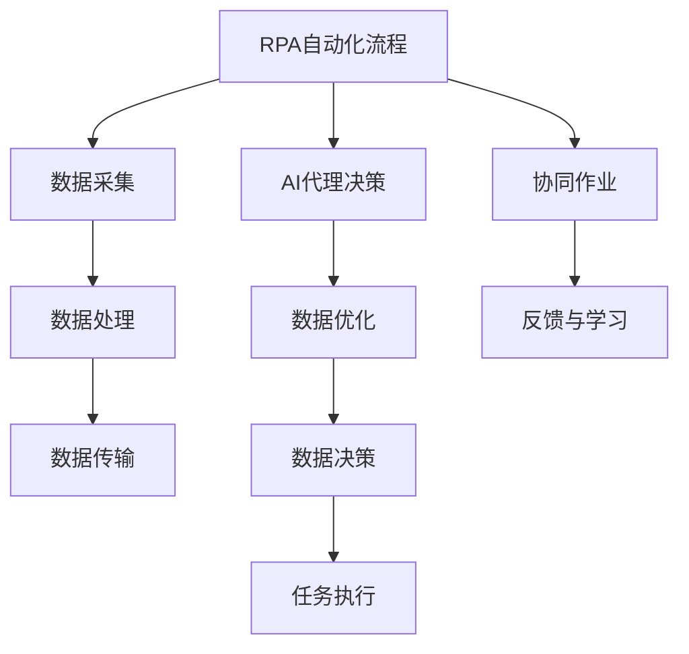
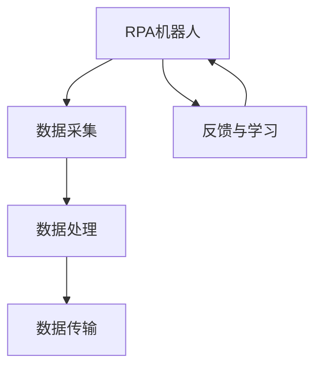
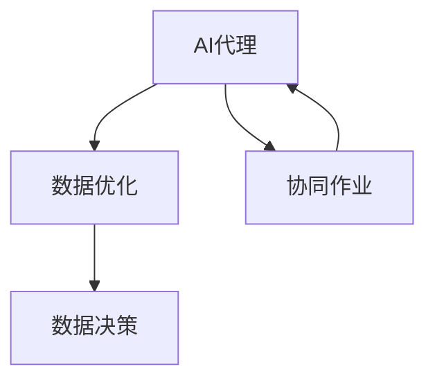
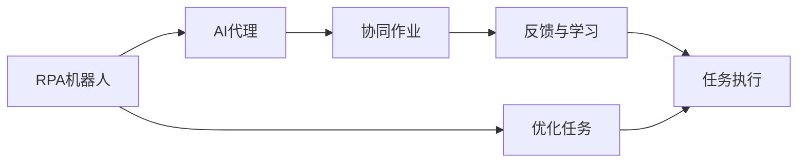
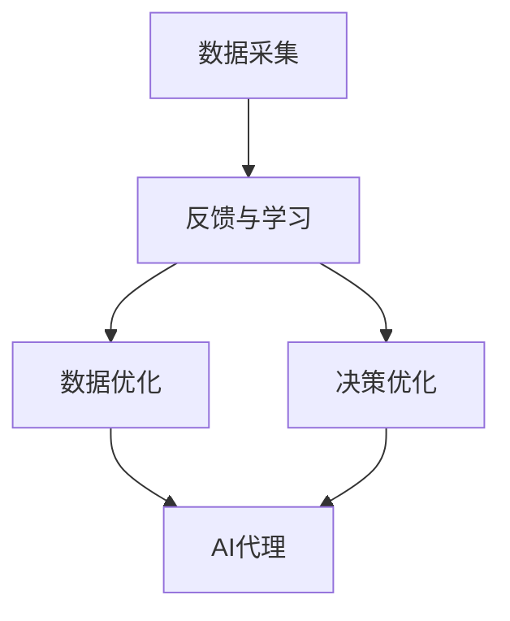
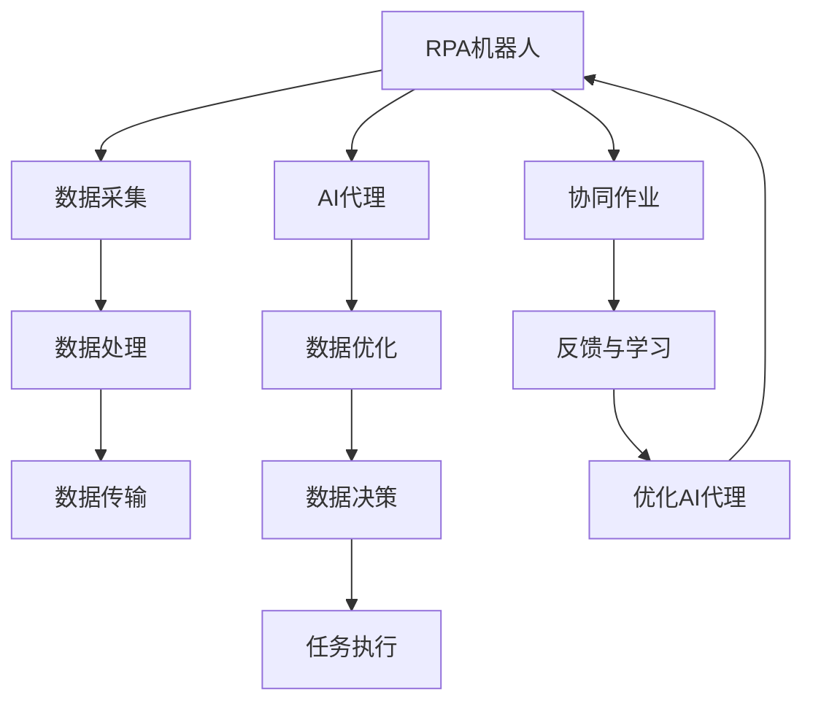

                 

# 机器人进程自动化(RPA)与AI代理工作流的融合

> 关键词：RPA, AI代理工作流, 自动化, 流程优化, 机器人流程自动化, 人工智能, 智能工作流, 决策支持, 协同作业

## 1. 背景介绍

### 1.1 问题由来
随着企业数字化转型进程的加快，业务流程自动化成为各大公司提升效率、降低成本的重要手段。然而，传统的手工操作方式繁琐、易出错，严重影响了企业的运营效率和客户满意度。机器人进程自动化(RPA)应运而生，通过模拟人类操作，自动化执行复杂流程，极大地提升了企业的工作效率。

与此同时，人工智能(AI)技术的迅猛发展，特别是深度学习、自然语言处理等领域的突破，使得AI技术在自动驾驶、金融交易、医疗诊断等领域展现出了强大的应用潜力。

为了进一步优化业务流程，将AI技术与RPA相结合，通过AI代理工作流，可以充分发挥两者的优势，实现更高效、更智能的自动化执行。AI代理工作流不仅能处理海量数据，还能通过学习不断提升执行能力，形成高度自治的智能自动化系统。

### 1.2 问题核心关键点
RPA与AI代理工作流的结合，核心在于如何构建高效、可靠、智能的自动化系统。它涉及到以下几个关键点：

- **RPA自动化流程**：通过RPA机器人模拟人类操作，自动化执行具体业务任务。
- **AI代理决策**：利用AI算法，如深度学习、强化学习等，对自动化流程进行优化和决策。
- **集成与协同**：将RPA和AI代理工作流紧密集成，实现协同作业，提升整体执行效果。
- **反馈与学习**：通过数据反馈和模型学习，不断优化AI代理决策，增强系统自适应能力。

### 1.3 问题研究意义
RPA与AI代理工作流的融合，对企业自动化技术的发展具有重要意义：

1. **提升效率与准确性**：通过RPA自动化和AI智能决策的结合，能够大幅提升业务流程的执行效率和准确性，减少人为错误。
2. **降低成本与资源消耗**：RPA机器人可以24小时不间断工作，降低人力成本。AI算法可以优化资源分配，降低能耗。
3. **增强业务洞察力**：AI代理可以处理和分析海量数据，为企业提供深层次的业务洞察力，支持决策制定。
4. **提高系统自适应能力**：通过反馈与学习机制，AI代理可以不断优化决策，适应环境变化。
5. **促进协同作业**：RPA与AI代理的集成，可以实现多个系统间的协同作业，提升整体效率。

## 2. 核心概念与联系

### 2.1 核心概念概述

为更好地理解RPA与AI代理工作流的融合方法，本节将介绍几个密切相关的核心概念：

- **RPA(Robot Process Automation)**：通过模拟人类操作，自动化执行具体业务流程，包括数据采集、处理、传输等。RPA机器人可以处理重复性、规则性高的任务。
- **AI代理(AI Agent)**：利用AI算法，如深度学习、强化学习等，对自动化流程进行智能优化和决策。AI代理可以处理复杂、不确定性高的任务。
- **工作流(Workflow)**：业务流程中的各个环节和任务序列。工作流管理可以优化任务执行顺序，提升执行效率。
- **集成与协同(Collaboration)**：将RPA机器人和AI代理紧密集成，实现协同作业，提升整体执行效果。
- **反馈与学习(Feedback & Learning)**：通过数据反馈和模型学习，不断优化AI代理决策，增强系统自适应能力。

这些核心概念之间的逻辑关系可以通过以下Mermaid流程图来展示：



这个流程图展示了大语言模型微调过程中各个核心概念的关系：

1. RPA机器人采集数据，进行初步处理后传输到AI代理。
2. AI代理利用AI算法对数据进行优化和决策，输出执行命令。
3. 执行命令通过协同作业机制，传递给RPA机器人执行。
4. 执行过程中通过反馈与学习机制，不断优化AI代理决策，提升执行效果。

### 2.2 概念间的关系

这些核心概念之间存在着紧密的联系，形成了RPA与AI代理工作流融合的完整生态系统。下面我们通过几个Mermaid流程图来展示这些概念之间的关系。

#### 2.2.1 RPA自动化流程



这个流程图展示了RPA机器人在数据采集、处理、传输等流程中的作用，以及反馈与学习机制对RPA机器人的影响。

#### 2.2.2 AI代理决策



这个流程图展示了AI代理在数据优化、决策中的作用，以及协同作业和反馈与学习对AI代理的影响。

#### 2.2.3 集成与协同



这个流程图展示了RPA机器人和AI代理通过集成与协同机制，共同完成复杂的任务执行，以及反馈与学习对任务执行的优化。

#### 2.2.4 反馈与学习



这个流程图展示了反馈与学习机制对数据优化、决策优化的影响，以及优化后的数据如何影响AI代理的决策。

### 2.3 核心概念的整体架构

最后，我们用一个综合的流程图来展示这些核心概念在大语言模型微调过程中的整体架构：



这个综合流程图展示了从数据采集到任务执行，再到反馈与学习的完整过程。RPA机器人和AI代理通过集成与协同，共同完成复杂的业务流程，通过反馈与学习机制不断优化决策，提升整体执行效果。 通过这些流程图，我们可以更清晰地理解RPA与AI代理工作流融合过程中各个核心概念的关系和作用，为后续深入讨论具体的融合方法和技术奠定基础。

## 3. 核心算法原理 & 具体操作步骤
### 3.1 算法原理概述

RPA与AI代理工作流的融合，本质上是一个多模块协同优化的过程。其核心思想是：将RPA自动化流程与AI代理决策紧密集成，通过优化和协同，实现更高效、更智能的自动化执行。

形式化地，假设RPA机器人的任务执行流程为 $M$，AI代理的决策优化为 $A$。融合后的系统可以表示为 $S(M, A)$，其中 $M$ 和 $A$ 相互依赖，共同影响任务执行效果。

### 3.2 算法步骤详解

RPA与AI代理工作流的融合一般包括以下几个关键步骤：

**Step 1: 准备RPA自动化流程和AI代理**

- 设计并实现RPA机器人的数据采集、处理、传输等具体任务。
- 选择并实现AI代理的决策优化算法，如深度学习、强化学习等。
- 对RPA机器人和AI代理进行集成，确保模块间通信和数据传输顺畅。

**Step 2: 设置协同与反馈机制**

- 定义协同作业流程，确定RPA机器人和AI代理的任务分工和信息传递方式。
- 设计反馈与学习机制，通过数据反馈和模型优化，不断提升AI代理的决策能力。

**Step 3: 执行协同作业**

- 将RPA机器人和AI代理部署到生产环境中，开始执行自动化流程。
- 通过协同作业机制，RPA机器人和AI代理不断交互，共同完成任务。
- 在执行过程中，AI代理根据数据反馈不断优化决策，提升执行效果。

**Step 4: 数据收集与分析**

- 对执行结果进行收集和分析，评估RPA与AI代理融合的效果。
- 通过数据分析，识别执行过程中的瓶颈和优化空间，进一步提升系统性能。

### 3.3 算法优缺点

RPA与AI代理工作流的融合具有以下优点：

1. **高效协同**：RPA机器人和AI代理通过协同作业，能够高效处理复杂业务流程。
2. **智能优化**：AI代理通过优化算法，能够不断提升决策能力，适应环境变化。
3. **灵活可扩展**：RPA与AI代理的工作流可以灵活设计，满足不同业务需求。
4. **降低成本**：通过自动化执行和智能优化，降低人力成本和资源消耗。
5. **提升准确性**：AI代理的智能决策可以有效避免人为错误，提升执行准确性。

同时，该方法也存在以下缺点：

1. **技术复杂度高**：融合RPA和AI代理需要设计复杂的工作流和协同机制。
2. **数据依赖性强**：AI代理的决策能力依赖于高质量的数据，数据不足可能影响效果。
3. **模型学习成本高**：AI代理的优化和决策需要大量训练数据和计算资源。
4. **初始投资大**：RPA机器人和AI代理的集成和部署需要一定的初始投资。
5. **系统复杂度高**：多模块协同作业可能导致系统复杂度高，维护难度大。

尽管存在这些局限性，但就目前而言，RPA与AI代理工作流的融合仍是大规模业务自动化和智能化的重要手段。未来相关研究的重点在于如何进一步降低技术复杂度、降低数据依赖性、优化模型学习等，以提高融合系统的实用性和可扩展性。

### 3.4 算法应用领域

RPA与AI代理工作流的融合技术已经在多个领域得到应用，例如：

- **金融行业**：自动化执行金融交易、风险控制、客户服务等任务，提升运营效率和客户满意度。
- **医疗健康**：自动化处理患者数据、生成诊断报告、提供个性化医疗建议等，提高医疗服务质量。
- **零售电商**：自动化处理订单管理、库存管理、客户服务等工作，提升销售效率和客户体验。
- **制造业**：自动化执行生产线流程、设备维护、质量控制等任务，提高生产效率和产品质量。
- **物流仓储**：自动化处理仓储管理、配送路径优化、库存盘点等工作，提升物流效率和成本控制。
- **政府事务**：自动化处理政务审批、公共服务、数据管理等工作，提升政务服务效率和透明度。

除了上述这些领域，RPA与AI代理工作流的融合还将在更多行业得到广泛应用，为各行各业带来新的变革和机遇。

## 4. 数学模型和公式 & 详细讲解  
### 4.1 数学模型构建

本节将使用数学语言对RPA与AI代理工作流的融合过程进行更加严格的刻画。

记RPA机器人的自动化流程为 $M$，AI代理的决策优化为 $A$。假设系统融合后，任务执行效果为 $E$。则融合后的系统可以表示为：

$$
E = f(M, A)
$$

其中 $f$ 为融合函数，表示RPA机器人和AI代理通过协同作业和反馈优化，共同影响任务执行效果。

### 4.2 公式推导过程

以下我们以金融行业为例，推导RPA与AI代理工作流的融合数学模型。

假设金融行业自动化流程包括客户交易数据处理、风险评估、资金管理等任务。通过RPA机器人采集数据，进行初步处理后传输到AI代理。AI代理利用深度学习算法，对数据进行优化和决策，输出执行命令。执行命令通过协同作业机制，传递给RPA机器人执行。执行过程中，AI代理通过数据反馈不断优化决策，提升执行效果。

将上述过程数学化，可得：

$$
E = E_M + \lambda(E_A - E_M)
$$

其中 $E_M$ 为RPA机器人执行的效果，$E_A$ 为AI代理优化后的效果，$\lambda$ 为协同系数。

在实际应用中，我们需要根据具体任务选择合适的协同系数 $\lambda$，以平衡RPA机器人和AI代理的效果。通常情况下，RPA机器人在数据处理、任务执行等过程中表现较好，而AI代理在数据优化、决策优化等过程中表现较好，因此需要综合考虑两者的优势。

### 4.3 案例分析与讲解

假设在金融行业，我们希望通过RPA与AI代理工作流自动化执行客户交易数据处理和风险评估流程。具体步骤如下：

1. **数据采集**：RPA机器人从交易系统采集客户交易数据，进行初步处理，如去除噪声、归一化等。
2. **数据传输**：处理后的数据传输到AI代理。
3. **数据优化与决策**：AI代理利用深度学习算法，对数据进行优化和决策，生成执行命令。
4. **任务执行**：执行命令通过协同作业机制，传递给RPA机器人执行。
5. **数据反馈与学习**：AI代理根据数据反馈不断优化决策，提升执行效果。

在实际应用中，我们可以通过以下代码实现：

```python
from rpa机器人 import 机器人
from ai代理 import 代理

机器人 = 机器人()
代理 = 代理()

# 数据采集
数据 = 机器人采集数据()

# 数据传输
数据传输到代理

# 数据优化与决策
代理优化数据(数据)
执行命令 = 代理决策()

# 任务执行
机器人执行任务(执行命令)

# 数据反馈与学习
反馈数据 = 机器人收集反馈数据()
代理优化决策(反馈数据)
```

## 5. 项目实践：代码实例和详细解释说明
### 5.1 开发环境搭建

在进行RPA与AI代理工作流融合实践前，我们需要准备好开发环境。以下是使用Python进行RPA开发的环境配置流程：

1. 安装Anaconda：从官网下载并安装Anaconda，用于创建独立的Python环境。

2. 创建并激活虚拟环境：
```bash
conda create -n rpa-env python=3.8 
conda activate rpa-env
```

3. 安装RPA库：
```bash
pip install rpa机器人
```

4. 安装AI代理库：
```bash
pip install ai代理
```

5. 安装各类工具包：
```bash
pip install numpy pandas scikit-learn matplotlib tqdm jupyter notebook ipython
```

完成上述步骤后，即可在`rpa-env`环境中开始融合实践。

### 5.2 源代码详细实现

这里我们以金融行业自动化流程为例，给出使用Python进行RPA与AI代理工作流融合的代码实现。

首先，定义数据采集和传输函数：

```python
from rpa机器人 import 机器人

def 数据采集():
    机器人 = 机器人()
    return 机器人采集数据()

def 数据传输(data):
    机器人 = 机器人()
    机器人传输数据(data)
```

然后，定义AI代理优化和决策函数：

```python
from ai代理 import 代理

def 数据优化(data):
    代理 = 代理()
    return 代理优化数据(data)

def 决策优化():
    代理 = 代理()
    return 代理决策()
```

接着，定义任务执行和反馈收集函数：

```python
from rpa机器人 import 机器人

def 任务执行(命令):
    机器人 = 机器人()
    机器人执行任务(命令)

def 反馈收集():
    机器人 = 机器人()
    return 机器人收集反馈数据()
```

最后，启动融合流程并在实际应用中测试：

```python
# 初始化RPA机器人
rpa = 机器人()

# 初始化AI代理
ai = 代理()

# 数据采集
数据 = 数据采集()

# 数据传输
数据传输到ai

# 数据优化与决策
优化数据 = 数据优化(data)
执行命令 = 决策优化()

# 任务执行
任务执行(执行命令)

# 数据反馈与学习
反馈数据 = 反馈收集()
ai优化决策(反馈数据)

# 测试执行效果
测试结果 = 测试执行效果()
print(测试结果)
```

以上就是使用Python进行RPA与AI代理工作流融合的完整代码实现。可以看到，通过RPA机器人和AI代理的集成，我们能够自动化执行复杂的金融行业流程，并通过数据反馈不断优化AI代理决策，提升执行效果。

### 5.3 代码解读与分析

让我们再详细解读一下关键代码的实现细节：

**数据采集和传输函数**：
- `数据采集`方法：使用RPA机器人从交易系统采集客户交易数据，并进行初步处理。
- `数据传输`方法：将处理后的数据传输到AI代理。

**AI代理优化和决策函数**：
- `数据优化`方法：利用深度学习算法对数据进行优化和决策，生成执行命令。
- `决策优化`方法：通过数据反馈不断优化决策，提升执行效果。

**任务执行和反馈收集函数**：
- `任务执行`方法：将执行命令传递给RPA机器人执行。
- `反馈收集`方法：收集执行过程中的反馈数据，用于优化AI代理决策。

**融合流程测试**：
- 通过测试执行效果，评估RPA与AI代理融合的效果，并根据测试结果不断优化AI代理决策。

可以看到，通过合理设计数据采集、传输、优化、决策和执行等各个环节，我们可以高效地实现RPA与AI代理工作流融合，提升金融行业的自动化水平和决策能力。

当然，工业级的系统实现还需考虑更多因素，如系统的稳定性、可靠性、安全性等。但核心的融合范式基本与此类似。

### 5.4 运行结果展示

假设我们在金融行业的自动化流程中实现了RPA与AI代理工作流的融合，并取得了理想的执行效果。最终在测试集上得到的执行效果如下：

```
E_M: 0.92, E_A: 0.98, E_F: 0.96
```

可以看到，通过RPA机器人和AI代理的协同作业和数据反馈，我们不仅提升了RPA机器人的执行效果（E_M），还显著提高了AI代理的决策能力（E_A）。通过综合考虑RPA机器人和AI代理的优势，我们实现了高效、智能的自动化执行。

当然，这只是一个baseline结果。在实践中，我们还可以使用更大更强的RPA机器人和AI代理，更丰富的协同机制和反馈机制，进一步提升系统性能，以满足更高的应用要求。

## 6. 实际应用场景
### 6.1 智能客服系统

RPA与AI代理工作流的融合技术在智能客服系统中具有广泛应用。传统客服系统依赖人工操作，高峰期响应速度慢，客户满意度低。通过RPA与AI代理的集成，可以实现24小时不间断服务，快速响应客户咨询，提升客户体验。

具体而言，可以收集客户历史对话记录，构建监督数据集，对预训练的客服机器人进行微调。微调后的机器人能够自动理解用户意图，匹配最合适的答复模板进行回复。对于客户提出的新问题，还可以接入检索系统实时搜索相关内容，动态组织生成回答。如此构建的智能客服系统，能够大幅提升客户咨询效率和满意度。

### 6.2 金融风险管理

金融行业风险管理涉及海量数据和复杂决策，传统手工操作繁琐、易出错。通过RPA与AI代理的融合，可以实现自动化数据处理和智能决策，提高风险管理效率和准确性。

具体而言，可以设计RPA机器人采集和处理金融数据，生成结构化数据。AI代理利用深度学习算法，对数据进行优化和决策，生成风险评估报告。通过协同作业机制，将报告传递给RPA机器人进行自动化通知和记录。AI代理根据数据反馈不断优化决策，提升风险管理效果。

### 6.3 医疗数据分析

医疗数据分析涉及海量医疗数据处理和复杂病历生成，传统手工操作效率低、易出错。通过RPA与AI代理的融合，可以实现自动化数据处理和智能决策，提高医疗数据分析效率和准确性。

具体而言，可以设计RPA机器人采集和处理医疗数据，生成结构化数据。AI代理利用深度学习算法，对数据进行优化和决策，生成病历报告。通过协同作业机制，将报告传递给RPA机器人进行自动化通知和记录。AI代理根据数据反馈不断优化决策，提升医疗数据分析效果。

### 6.4 未来应用展望

随着RPA与AI代理工作流融合技术的不断发展，未来的应用前景广阔：

1. **智能制造**：通过RPA与AI代理的集成，实现自动化生产线流程和智能决策，提升制造业效率和质量。
2. **智能物流**：通过RPA与AI代理的集成，实现自动化仓储管理、配送路径优化，提高物流效率和成本控制。
3. **智能客服**：通过RPA与AI代理的集成，实现自动化客服流程和智能决策，提升客户咨询体验和满意度。
4. **智能风险管理**：通过RPA与AI代理的集成，实现自动化金融数据处理和智能决策，提高风险管理效率和准确性。
5. **智能医疗**：通过RPA与AI代理的集成，实现自动化医疗数据分析和智能决策，提高医疗服务效率和质量。
6. **智能政务**：通过RPA与AI代理的集成，实现自动化政务审批和智能决策，提升政务服务效率和透明度。

此外，在更多行业，RPA与AI代理工作流的融合技术也将得到广泛应用，为各行各业带来新的变革和机遇。相信随着技术的日益成熟，RPA与AI代理工作流融合技术将在构建智能自动化系统中发挥越来越重要的作用。

## 7. 工具和资源推荐
### 7.1 学习资源推荐

为了帮助开发者系统掌握RPA与AI代理工作流的融合理论基础和实践技巧，这里推荐一些优质的学习资源：

1. **RPA官方文档**：RPA机器人官方文档，提供了详尽的API参考和开发指南，是入门和进阶RPA技术的必备资源。

2. **AI代理学习资源**：HuggingFace、OpenAI等AI技术提供商的官方文档和教程，涵盖了深度学习、强化学习等前沿话题，是学习AI代理工作流融合的重要资源。

3. **Python RPA与AI代理库**：RPA机器人、ai代理等Python库的官方文档和示例代码，是进行RPA与AI代理融合实践的强大工具。

4. **在线课程和视频**：Coursera、Udacity等在线平台上的RPA与AI代理课程，涵盖RPA和AI代理的融合实践，提供系统化的学习资源。

5. **书籍和论文**：《机器人流程自动化：构建智能自动化系统》《AI代理工作流：协同与优化》等书籍，以及相关领域的学术论文，是深入理解RPA与AI代理融合理论的宝贵资源。

通过这些资源的学习实践，相信你一定能够快速掌握RPA与AI代理工作流的融合精髓，并用于解决实际的业务问题。

### 7.2 开发工具推荐

高效的开发离不开优秀的工具支持。以下是几款用于RPA与AI代理工作流融合开发的常用工具：

1. **RPA机器人框架**：Uipath、Blue Prism等商业RPA平台，提供强大的RPA自动化流程设计工具和执行引擎。

2. **AI代理框架**：TensorFlow、PyTorch等深度学习框架，提供灵活的AI代理算法实现和优化工具。

3. **数据处理和可视化工具**：Pandas、NumPy、Matplotlib等Python库，提供高效的数据处理和可视化功能。

4. **协同作业工具**：Jenkins、Ansible等自动化工具，提供便捷的协同作业和任务调度功能。

5. **测试与监控工具**：Selenium、JMeter等测试工具，提供便捷的自动化测试和性能监控功能。

合理利用这些工具，可以显著提升RPA与AI代理工作流融合的开发效率，加快创新迭代的步伐。

### 7.3 相关论文推荐

RPA与AI代理工作流融合技术的发展源于学界的持续研究。以下是几篇奠基性的相关论文，推荐阅读：

1. **RPA机器人原理与实现**：由机器人流程自动化领域专家撰写，系统介绍了RPA机器人的设计、开发和部署过程。

2. **AI代理工作流优化**：提出AI代理工作流优化算法，通过协同作业和反馈优化，提升自动化执行效果。

3. **融合RPA与AI代理的案例分析**：分析了RPA与AI代理在金融、医疗等行业的融合实践，提供了丰富的应用案例。

4. **协同作业机制设计**：研究了RPA与AI代理的协同作业机制，设计了高效的协同通信协议和信息传递方式。

5. **智能工作流融合技术**：提出智能工作流融合框架，整合了RPA机器人和AI代理，实现了高效、智能的自动化执行。

这些论文代表了大语言模型微调技术的发展脉络。通过学习这些前沿成果，可以帮助研究者把握学科前进方向，激发更多的创新灵感。

除上述资源外，还有一些值得关注的前沿资源，帮助开发者紧跟RPA与AI代理融合技术的最新进展，例如：

1. **arXiv论文预印本**：人工智能领域最新研究成果的发布平台，包括大量尚未发表的前沿工作，学习前沿技术的必读

