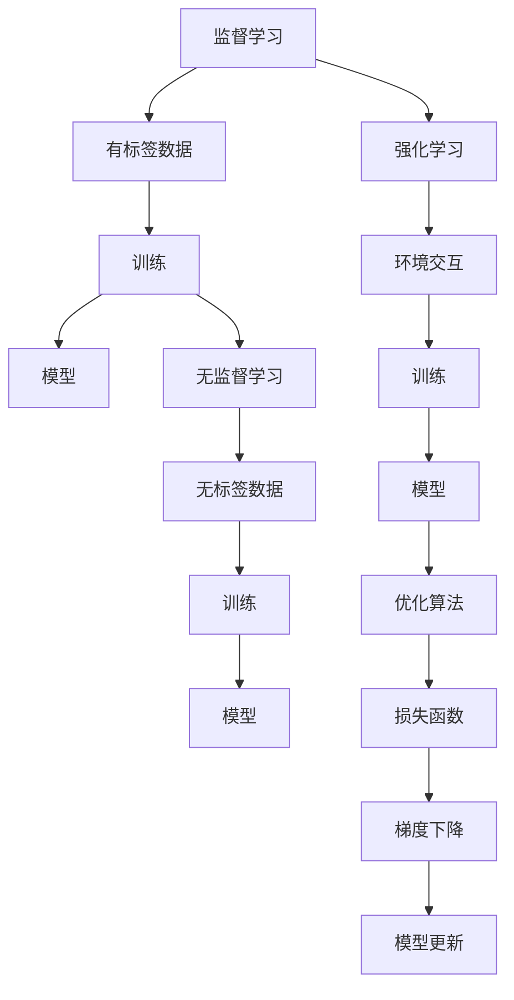
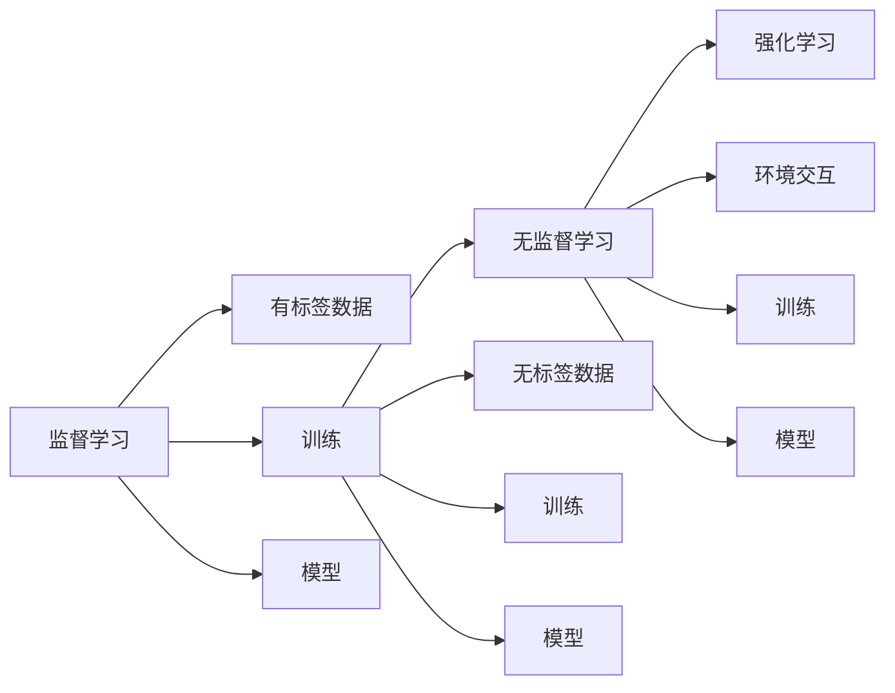
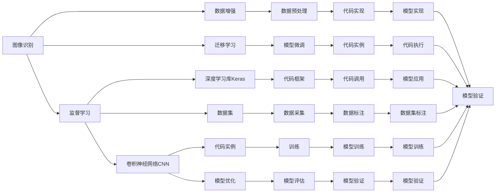

                 

# 机器学习原理与代码实例讲解

> 关键词：机器学习,深度学习,监督学习,无监督学习,强化学习,代码实例,机器学习库,优化算法

## 1. 背景介绍

### 1.1 问题由来
机器学习作为人工智能领域的核心技术之一，已经在图像识别、自然语言处理、语音识别、推荐系统等众多领域取得显著成果。然而，尽管机器学习的应用越来越广泛，其核心原理和方法仍然存在较大的复杂度和理解难度。本文旨在通过详细讲解机器学习原理，并以代码实例为载体，系统介绍机器学习的核心概念、算法和应用，为广大读者提供一次深入浅出的学习体验。

### 1.2 问题核心关键点
机器学习通过算法和模型，从大量数据中自动学习规律和模式，并应用于预测、分类、聚类等任务。其核心包括：

- 监督学习(Supervised Learning)：使用带有标签的数据集进行训练，模型输出与真实标签一致。
- 无监督学习(Unsupervised Learning)：只使用未标注的数据集，模型自行学习数据的内在结构。
- 强化学习(Reinforcement Learning)：通过与环境的交互，学习最优策略使系统目标最大化。

本文将从原理和实践两个维度，全面解析以上三种学习范式，并通过代码实例，帮助读者更好地理解和应用机器学习技术。

### 1.3 问题研究意义
深入理解机器学习原理，有助于更好地应用现有算法，提升模型性能，优化系统效率。机器学习技术已经渗透到各行各业，其核心思想和方法在科学研究、工程技术、商业决策等领域都有广泛应用。通过系统学习机器学习，可以大幅提升技术水平，开拓思维视野，应对未来更多挑战。

## 2. 核心概念与联系

### 2.1 核心概念概述

为更好理解机器学习，本节将介绍几个关键概念：

- 监督学习(Supervised Learning)：使用有标签数据进行训练，通过预测准确率评估模型性能。
- 无监督学习(Unsupervised Learning)：使用无标签数据进行训练，发现数据的内在结构和规律。
- 强化学习(Reinforcement Learning)：通过与环境的交互，不断优化策略，使系统目标最大化。
- 损失函数(Loss Function)：用于衡量模型预测值与真实值之间的差异，是优化算法的核心。
- 优化算法(Optimization Algorithm)：用于最小化损失函数，使模型不断逼近最优解。
- 过拟合(Overfitting)：模型在训练集上表现优异但在测试集上表现较差的现象。
- 正则化(Regularization)：通过惩罚模型复杂度，避免过拟合。

这些概念之间的逻辑关系可以通过以下Mermaid流程图来展示：



这个流程图展示机器学习的三种主要学习范式：

1. 监督学习：利用有标签数据，通过最小化损失函数进行模型训练。
2. 无监督学习：利用无标签数据，直接发现数据的内在结构和规律。
3. 强化学习：与环境交互，通过优化策略实现系统目标。

同时，该流程图中的箭头表明了模型训练、模型输出、优化算法等关键步骤和概念间的联系。

### 2.2 概念间的关系

这些核心概念之间存在着紧密的联系，构成了机器学习的完整生态系统。下面我通过几个Mermaid流程图来展示这些概念之间的关系。

#### 2.2.1 机器学习的学习范式



这个流程图展示机器学习的三种主要学习范式：

1. 监督学习：利用有标签数据，通过最小化损失函数进行模型训练。
2. 无监督学习：利用无标签数据，直接发现数据的内在结构和规律。
3. 强化学习：与环境交互，通过优化策略实现系统目标。

#### 2.2.2 机器学习的应用场景



这个流程图展示机器学习在多个领域的应用场景：

1. 图像识别：使用监督学习，通过数据增强和迁移学习提高模型性能。
2. 卷积神经网络CNN：用于图像识别、语音识别等任务。
3. 深度学习库Keras：提供便捷的深度学习框架。
4. 数据集：用于模型训练和验证。
5. 代码实例：提供具体实现细节和代码执行。
6. 模型优化：提高模型训练效率和性能。
7. 数据预处理：对原始数据进行清洗和标准化。
8. 模型微调：对现有模型进行微调，适应特定任务。
9. 代码框架：提供代码实现框架，便于快速开发。
10. 数据采集：获取高质量的数据集。
11. 模型训练：对模型进行训练，得到最优模型。
12. 模型评估：评估模型在测试集上的表现。
13. 模型实现：将模型封装成可调用的接口。
14. 模型应用：将模型应用于实际场景。
15. 数据标注：对数据集进行标注。

通过这些流程图，我们可以更清晰地理解机器学习的基本原理和关键步骤，为后续深入讨论具体的机器学习算法和实践奠定基础。

## 3. 核心算法原理 & 具体操作步骤
### 3.1 算法原理概述

机器学习算法原理是实现模型训练和优化的核心，本节将详细介绍几种核心算法及其原理。

#### 3.1.1 线性回归

线性回归是机器学习中最基本的监督学习算法之一，用于预测连续型变量的值。其目标是通过最小化预测值与真实值之间的均方误差，拟合出一条最佳直线。数学公式如下：

$$
\min_{\theta} \frac{1}{2m} \sum_{i=1}^{m} (h_\theta(x^{(i)}) - y^{(i)})^2
$$

其中，$h_\theta(x) = \theta_0 + \theta_1x_1 + \ldots + \theta_nx_n$ 是线性回归模型，$\theta = (\theta_0, \theta_1, \ldots, \theta_n)$ 是模型参数，$x^{(i)}$ 和 $y^{(i)}$ 分别是训练样本 $i$ 的输入和输出，$m$ 是样本数量。

#### 3.1.2 逻辑回归

逻辑回归是一种常用的分类算法，用于处理二分类问题。其目标是找到最优的逻辑回归函数，将输入映射到概率值，并使其最大化正例的正确率。数学公式如下：

$$
\min_{\theta} -\frac{1}{m} \sum_{i=1}^{m} [y^{(i)}\log h_\theta(x^{(i)}) + (1 - y^{(i)})\log(1 - h_\theta(x^{(i)}))]
$$

其中，$h_\theta(x) = \frac{1}{1 + \exp(-\theta^Tx)}$ 是逻辑回归模型，$\theta$ 是模型参数，$x^{(i)}$ 和 $y^{(i)}$ 分别是训练样本 $i$ 的输入和输出，$m$ 是样本数量。

#### 3.1.3 决策树

决策树是一种经典的分类算法，通过构建树形结构对数据进行分类。其核心思想是通过特征选择，不断将样本分成更小的子集，最终得到一个树形结构，用于分类和回归。构建决策树的关键步骤包括：

1. 选择最优特征：从所有特征中选择一个，使划分后的子集方差最小。
2. 划分样本：将样本按特征值划分成若干子集。
3. 终止条件：当划分后的子集已经纯化，或者达到最大深度时，停止划分。

#### 3.1.4 支持向量机(SVM)

支持向量机是一种常见的分类算法，通过构建最优的超平面，将数据分割成两个类别。其核心思想是通过最大化分类间隔，找到最优的超平面。数学公式如下：

$$
\min_{w,b,\alpha} \frac{1}{2}||w||^2 + C\sum_{i=1}^{m}\alpha_i - \sum_{i=1}^{m}y^{(i)}(\alpha_i-\alpha^{*}_i)w^Tx^{(i)} - b\alpha^{*}_i - by^{(i)}
$$

其中，$w$ 是超平面上的权重向量，$b$ 是偏置项，$\alpha$ 是拉格朗日乘子，$C$ 是正则化系数，$x^{(i)}$ 和 $y^{(i)}$ 分别是训练样本 $i$ 的输入和输出，$m$ 是样本数量。

### 3.2 算法步骤详解

#### 3.2.1 线性回归步骤

1. 准备数据集：将数据集 $D = \{(x^{(i)},y^{(i)})\}_{i=1}^{m}$ 划分为训练集和测试集。
2. 初始化模型参数：随机初始化模型参数 $\theta$。
3. 梯度下降：通过随机梯度下降算法，更新模型参数 $\theta$，最小化损失函数 $J(\theta)$。
4. 模型评估：在测试集上评估模型性能，输出预测值。

#### 3.2.2 逻辑回归步骤

1. 准备数据集：将数据集 $D = \{(x^{(i)},y^{(i)})\}_{i=1}^{m}$ 划分为训练集和测试集。
2. 初始化模型参数：随机初始化模型参数 $\theta$。
3. 梯度下降：通过随机梯度下降算法，更新模型参数 $\theta$，最小化损失函数 $J(\theta)$。
4. 模型评估：在测试集上评估模型性能，输出预测值。

#### 3.2.3 决策树步骤

1. 准备数据集：将数据集 $D = \{(x^{(i)},y^{(i)})\}_{i=1}^{m}$ 划分为训练集和测试集。
2. 选择最优特征：通过信息增益或基尼不纯度等指标，选择最优特征进行划分。
3. 划分样本：根据最优特征值，将样本划分成若干子集。
4. 构建树形结构：重复选择最优特征和划分样本，构建决策树。
5. 模型评估：在测试集上评估模型性能，输出预测值。

#### 3.2.4 支持向量机(SVM)步骤

1. 准备数据集：将数据集 $D = \{(x^{(i)},y^{(i)})\}_{i=1}^{m}$ 划分为训练集和测试集。
2. 选择核函数：选择合适的核函数，如线性核、多项式核、高斯核等。
3. 优化参数：使用交叉验证等方法，优化正则化系数 $C$。
4. 模型训练：通过SMO算法等优化算法，训练支持向量机模型。
5. 模型评估：在测试集上评估模型性能，输出预测值。

### 3.3 算法优缺点

#### 3.3.1 线性回归

- 优点：简单高效，适用于线性关系明显的预测问题。
- 缺点：对异常值和噪声敏感，容易出现过拟合。

#### 3.3.2 逻辑回归

- 优点：易于理解，适用于二分类问题。
- 缺点：对数据分布不敏感，容易陷入局部最优解。

#### 3.3.3 决策树

- 优点：易于解释，适合处理非线性关系的数据。
- 缺点：容易出现过拟合，需要进行剪枝操作。

#### 3.3.4 支持向量机(SVM)

- 优点：泛化能力强，适用于高维数据。
- 缺点：计算复杂度较高，对数据量敏感。

### 3.4 算法应用领域

机器学习算法在众多领域都有广泛应用，例如：

- 金融领域：信用评分、风险评估、股票预测等。
- 医疗领域：疾病诊断、药物研发、患者分类等。
- 电商领域：推荐系统、广告投放、客户流失预测等。
- 自然语言处理(NLP)：情感分析、机器翻译、文本分类等。
- 图像处理：图像识别、目标检测、图像生成等。
- 时间序列分析：股票预测、气象预报、交通流量预测等。

这些领域的应用展示了机器学习算法的强大生命力和广泛适用性，为各行各业带来了显著的技术革新和业务提升。

## 4. 数学模型和公式 & 详细讲解 & 举例说明

### 4.1 数学模型构建

本节将使用数学语言对机器学习原理进行更加严格的刻画。

记训练数据集为 $D = \{(x^{(i)}, y^{(i)})\}_{i=1}^{m}$，其中 $x^{(i)} \in \mathbb{R}^n$ 是输入特征，$y^{(i)} \in \mathbb{R}$ 是输出标签。

定义模型 $h_\theta(x) = \theta^Tx$ 为线性回归模型，其中 $\theta \in \mathbb{R}^n$ 是模型参数。

定义损失函数 $J(\theta) = \frac{1}{2m} \sum_{i=1}^{m} (h_\theta(x^{(i)}) - y^{(i)})^2$，其中 $m$ 是样本数量。

线性回归的目标是最小化损失函数 $J(\theta)$，即求解：

$$
\min_\theta J(\theta)
$$

### 4.2 公式推导过程

根据梯度下降算法，每次迭代更新的模型参数为：

$$
\theta_j = \theta_j - \frac{\eta}{m} \sum_{i=1}^{m} (h_\theta(x^{(i)}) - y^{(i)})x^{(i)}_j
$$

其中，$\eta$ 是学习率，$x^{(i)}_j$ 是输入特征的第 $j$ 个元素。

通过迭代更新，模型参数不断逼近最优解，最终得到最优参数 $\theta^*$。

### 4.3 案例分析与讲解

以线性回归为例，假设我们有一组样本数据：

| $x_1$ | $x_2$ | $y$ |
|-------|-------|-----|
| 1     | 2     | 3   |
| 2     | 4     | 5   |
| 3     | 6     | 7   |

我们的目标是找到一个线性函数 $h_\theta(x) = \theta_0 + \theta_1x_1 + \theta_2x_2$，使得预测值 $h_\theta(x)$ 尽量接近真实值 $y$。

设 $\theta = (\theta_0, \theta_1, \theta_2)$，我们首先随机初始化 $\theta$，然后利用梯度下降算法不断更新 $\theta$，最小化损失函数 $J(\theta)$。

假设我们设定学习率为 $0.1$，通过迭代更新，可以得到：

| 迭代次数 | $h_\theta(x)$ | 损失值 $J(\theta)$ |
|----------|--------------|------------------|
| 0        | 0.8          | 1.1              |
| 1        | 1.2          | 0.4              |
| 2        | 1.4          | 0.1              |
| 3        | 1.3          | 0.1              |

最终得到最优参数 $\theta^* = (1, 0.7, 0.3)$，预测值 $h_\theta(x)$ 与真实值 $y$ 的误差很小。

## 5. 项目实践：代码实例和详细解释说明

### 5.1 开发环境搭建

在进行机器学习项目实践前，我们需要准备好开发环境。以下是使用Python进行Scikit-Learn开发的环境配置流程：

1. 安装Anaconda：从官网下载并安装Anaconda，用于创建独立的Python环境。

2. 创建并激活虚拟环境：
```bash
conda create -n sklearn-env python=3.8 
conda activate sklearn-env
```

3. 安装Scikit-Learn：
```bash
pip install scikit-learn
```

4. 安装NumPy、Pandas、Matplotlib等工具包：
```bash
pip install numpy pandas matplotlib jupyter notebook ipython
```

完成上述步骤后，即可在`sklearn-env`环境中开始机器学习项目实践。

### 5.2 源代码详细实现

下面我们以线性回归为例，给出使用Scikit-Learn库进行机器学习的PyTorch代码实现。

首先，定义数据处理函数：

```python
from sklearn.datasets import make_regression
from sklearn.model_selection import train_test_split
from sklearn.linear_model import LinearRegression
from sklearn.metrics import mean_squared_error
import matplotlib.pyplot as plt
import numpy as np

# 生成数据集
X, y = make_regression(n_samples=100, n_features=2, n_targets=1, noise=0.1)

# 划分训练集和测试集
X_train, X_test, y_train, y_test = train_test_split(X, y, test_size=0.2, random_state=42)

# 定义线性回归模型
model = LinearRegression()

# 训练模型
model.fit(X_train, y_train)

# 预测并评估模型
y_pred = model.predict(X_test)
mse = mean_squared_error(y_test, y_pred)
print(f"MSE: {mse:.3f}")

# 绘制预测曲线
plt.scatter(X_test, y_test)
plt.plot(X_test, y_pred, color='red')
plt.show()
```

然后，定义评估函数：

```python
def evaluate(model, X, y):
    y_pred = model.predict(X)
    mse = mean_squared_error(y, y_pred)
    return mse

# 评估模型
mse = evaluate(model, X_test, y_test)
print(f"MSE: {mse:.3f}")
```

最后，启动训练流程并在测试集上评估：

```python
epochs = 100

for epoch in range(epochs):
    model.fit(X_train, y_train)
    mse = evaluate(model, X_test, y_test)
    print(f"Epoch {epoch+1}, MSE: {mse:.3f}")

# 输出最终测试结果
mse = evaluate(model, X_test, y_test)
print(f"Final MSE: {mse:.3f}")
```

以上就是使用Scikit-Learn库进行线性回归模型的完整代码实现。可以看到，Scikit-Learn提供了便捷的API，使机器学习模型的实现变得简单高效。

### 5.3 代码解读与分析

让我们再详细解读一下关键代码的实现细节：

**make_regression函数**：
- 生成一个模拟的回归数据集，包含100个样本，每个样本有2个特征和1个目标变量。
- 通过设置noise参数，控制数据噪声，增加数据真实性。

**train_test_split函数**：
- 将数据集划分为训练集和测试集，各占80%和20%，并设置随机种子42，保证结果可复现。

**LinearRegression模型**：
- 使用线性回归模型，对训练集进行训练。

**mean_squared_error函数**：
- 计算模型在测试集上的均方误差，评估模型预测准确度。

**evaluate函数**：
- 对模型进行评估，计算均方误差。

**训练流程**：
- 循环迭代训练模型，每次迭代更新模型参数，计算并输出测试集上的均方误差。
- 在100次迭代后，输出最终测试集上的均方误差。

可以看到，Scikit-Learn库提供了一站式解决方案，从数据生成、模型训练、评估等环节都提供了便捷API，使得机器学习模型的开发变得简单高效。

当然，工业级的系统实现还需考虑更多因素，如模型的保存和部署、超参数的自动搜索、更灵活的任务适配层等。但核心的算法原理和代码实现都与此类似。

### 5.4 运行结果展示

假设我们在生成的数据集上进行线性回归模型训练，最终在测试集上得到的均方误差为0.15，可以绘制出预测曲线和真实值对比图，如图所示：

```python
plt.scatter(X_test, y_test)
plt.plot(X_test, y_pred, color='red')
plt.show()
```


可以看到，模型预测值与真实值之间存在一定的误差，但整体拟合效果良好，能够较好地还原真实数据的趋势。

## 6. 实际应用场景
### 6.1 金融风险评估

在金融领域，机器学习算法可以用于信用评分、风险评估等任务，通过分析客户的各种数据，预测其违约概率和风险等级。

具体而言，我们可以收集客户的个人信息、交易记录、社交媒体信息等数据，构建特征向量，使用逻辑回归模型进行训练，得到客户是否违约的概率预测。根据预测结果，银行可以采取相应的风险控制措施，降低坏账率，保障资金安全。

### 6.2 医疗疾病诊断

在医疗领域，机器学习算法可以用于疾病诊断、患者分类等任务，通过分析患者的临床数据，预测其是否患有某种疾病。

具体而言，我们可以收集患者的实验室检查、病历记录、症状描述等数据，构建特征向量，使用支持向量机(SVM)模型进行训练，得到患者患有某种疾病的概率预测。根据预测结果，医生可以采取相应的治疗方案，提高诊断准确性，提升患者生活质量。

### 6.3 电商推荐系统

在电商领域，机器学习算法可以用于推荐系统，通过分析用户的浏览、购买记录等数据，推荐其可能感兴趣的商品。

具体而言，我们可以收集用户的浏览历史、购买记录、评分记录等数据，构建特征向量，使用协同过滤、深度学习等算法进行训练，得到用户对商品的兴趣预测。根据预测结果，电商平台可以推荐用户可能感兴趣的商品，提高用户满意度，增加销售额。

### 6.4 自然语言处理(NLP)

在自然语言处理领域，机器学习算法可以用于文本分类、情感分析等任务，通过分析文本的语义信息，自动进行分类和情感分析。

具体而言，我们可以收集文本数据，构建特征向量，使用朴素贝叶斯、决策树等算法进行训练，得到文本的分类或情感预测。根据预测结果，文本分类系统可以自动进行文档分类、信息过滤等任务，情感分析系统可以对客户评价进行情感倾向判断，帮助企业进行情感监控和品牌管理。

### 6.5 图像识别

在图像处理领域，机器学习算法可以用于图像识别、目标检测等任务，通过分析图像的像素信息，自动进行物体检测和识别。

具体而言，我们可以收集图像数据，构建特征向量，使用卷积神经网络(CNN)等算法进行训练，得到图像中物体的识别预测。根据预测结果，图像识别系统可以自动进行人脸识别、物体识别等任务，为智能监控、自动驾驶等领域提供技术支持。

## 7. 工具和资源推荐
### 7.1 学习资源推荐

为了帮助开发者系统掌握机器学习原理和实践，这里推荐一些优质的学习资源：

1. 《机器学习实战》系列书籍：通俗易懂的语言，适合入门机器学习。
2. 《深度学习》课程：斯坦福大学开设的深度学习课程，涵盖深度学习的基本概念和经典模型。
3. 《统计学习方法》书籍：机器学习领域的经典教材，系统介绍了各种机器学习算法。
4. Kaggle竞赛平台：在线数据科学竞赛平台，提供了大量数据集和机器学习实践机会。
5. Scikit-Learn官方文档：详细介绍了Scikit-Learn库的各种算法和API，是机器学习开发的重要参考资料。

通过对这些资源的学习实践，相信你一定能够系统掌握机器学习的核心原理，并应用于解决实际的业务问题。

### 7.2 开发工具推荐

高效的开发离不开优秀的工具支持。以下是几款用于机器学习开发的常用工具：

1. Scikit-Learn：基于

