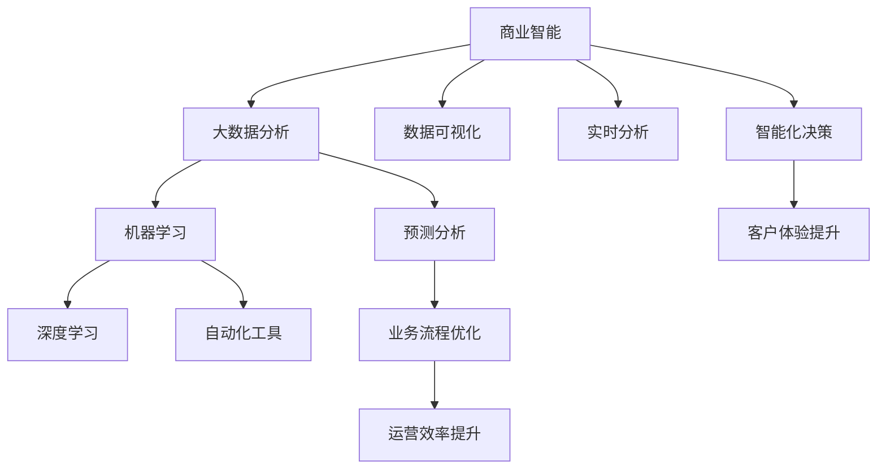
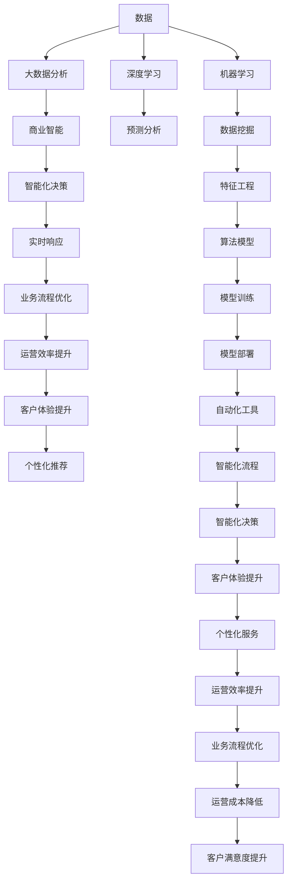

                 

# 李开复：AI 2.0 时代的价值

> 关键词：人工智能, 李开复, AI 2.0, 商业智能, 机器学习, 深度学习, 人工智能伦理

## 1. 背景介绍

在过去几年中，人工智能（AI）领域迎来了快速发展的黄金时期。从深度学习的突破性进展，到大数据、云计算等技术的发展，AI技术正以前所未有的速度革新各行各业。作为一名长期关注并推动AI技术发展的先锋，李开复博士提出了“AI 2.0”的概念，强调了AI技术的深度应用在各行各业的商业价值和社会影响。

### 1.1 问题由来

在AI 1.0时代，AI技术主要以科研和实验为主，主要应用场景包括专家系统和自然语言处理等。而AI 2.0则强调了AI技术的广泛应用和商业化，涵盖了大数据、云计算、机器学习、深度学习等多个方面。李开复认为，AI 2.0时代的人工智能技术不仅能提升效率、降低成本，还能帮助企业更好地理解和预测市场需求，实现商业智能化转型。

### 1.2 问题核心关键点

AI 2.0时代的核心价值在于其商业智能和应用潜能。通过对现有业务流程的智能化改造，AI技术可以帮助企业提升决策效率、优化运营管理、增强客户体验。同时，AI技术还能挖掘大数据中的洞察，为企业的战略决策提供有力支持。李开复强调，AI 2.0时代的AI技术应具备以下几个关键点：

- 智能化决策：通过数据分析和机器学习，AI系统能够提供基于数据的决策支持，减少人为判断的误差。
- 实时响应：AI技术能够实时分析大量数据，快速响应市场变化和用户需求。
- 优化运营：通过智能化流程和自动化工具，AI技术可以提升企业运营效率，降低成本。
- 个性化体验：AI技术能够根据用户行为和偏好，提供定制化的服务和推荐，提升用户体验。

## 2. 核心概念与联系

### 2.1 核心概念概述

AI 2.0时代的核心概念包括但不限于以下几个方面：

- **商业智能（BI）**：通过数据分析和可视化，帮助企业洞察业务趋势，做出更明智的决策。
- **大数据分析**：利用先进的算法和技术，从海量数据中提取有价值的洞察，支撑企业战略。
- **机器学习**：通过算法和模型，让机器从数据中学习规律，并用于预测和决策。
- **深度学习**：一种基于神经网络的高级机器学习方法，能够处理复杂的数据结构，如图像、语音和自然语言。
- **人工智能伦理**：探讨AI技术在道德、法律和公平性方面的问题，确保AI技术的健康发展。

### 2.2 概念间的关系

这些核心概念之间的关系可以通过以下Mermaid流程图来展示：



这个流程图展示了大数据、商业智能、机器学习和深度学习在AI 2.0时代的应用路径。数据可视化和大数据分析提供了洞察，机器学习和深度学习提供了分析和预测能力，而商业智能和实时分析则将洞察转化为决策和行动。自动化工具和智能化决策提升了运营效率，而客户体验和运营效率的提升，又进一步促进了商业智能的发展。

### 2.3 核心概念的整体架构

最后，我们用一个综合的流程图来展示这些核心概念在大数据和商业智能环境中的整体架构：



这个流程图展示了从数据输入到最终应用的全过程。数据通过大数据分析进行处理，商业智能将洞察转化为决策，实时响应和智能化决策优化运营效率和客户体验，预测分析提供更加精准的个性化服务，机器学习和深度学习从数据中提取洞察和规律，最后通过自动化工具和智能化流程实现智能化决策和运营。

## 3. 核心算法原理 & 具体操作步骤
### 3.1 算法原理概述

AI 2.0时代的核心算法原理可以归结为数据驱动的决策支持和自动化运营。其核心是利用机器学习和深度学习算法，从数据中学习规律和模式，并用这些规律进行预测和决策。

### 3.2 算法步骤详解

AI 2.0时代的大数据和商业智能应用，通常包括以下几个关键步骤：

1. **数据采集**：从各种渠道收集数据，如客户行为数据、市场趋势数据、内部运营数据等。
2. **数据预处理**：清洗和格式化数据，使其适合后续分析。
3. **数据分析**：通过统计分析和机器学习算法，从数据中提取有价值的洞察。
4. **数据可视化**：利用图表和仪表盘，将洞察转换为直观的展示。
5. **决策支持**：结合专家知识和算法洞察，提供决策建议。
6. **自动化运营**：通过智能系统自动化执行决策，优化运营流程。
7. **效果评估**：定期评估决策和运营的效果，进行持续优化。

### 3.3 算法优缺点

AI 2.0时代的数据驱动决策和自动化运营，有以下优点：

- **效率提升**：通过自动化工具和算法，可以快速处理大量数据，提升决策和运营效率。
- **成本降低**：自动化流程减少了人工干预，降低了运营成本。
- **决策支持**：算法能够从海量数据中提取有价值的洞察，支撑决策。

同时，也存在一些缺点：

- **数据质量**：数据的质量和完整性对分析结果有重大影响。
- **算法偏见**：算法可能会继承数据中的偏见，影响决策公平性。
- **模型复杂性**：复杂的算法模型可能需要大量计算资源和时间。
- **解释性不足**：黑盒模型难以解释其决策过程。

### 3.4 算法应用领域

AI 2.0时代的算法和应用已经广泛应用于多个领域，包括但不限于：

- **金融领域**：利用算法预测市场趋势，提供投资建议和风险管理。
- **零售行业**：通过客户行为分析，进行个性化推荐和库存管理。
- **制造业**：利用传感器数据和机器学习，优化生产流程和设备维护。
- **医疗健康**：利用大数据分析，提供个性化医疗建议和疾病预测。
- **交通管理**：通过实时数据分析，优化交通流量和减少拥堵。
- **教育行业**：利用学生行为数据，提供个性化学习方案和教学评估。

## 4. 数学模型和公式 & 详细讲解  
### 4.1 数学模型构建

在AI 2.0时代，数据分析和决策支持的数学模型构建，通常基于以下基本框架：

- **线性回归**：用于建立因变量和自变量之间的关系，预测数值型结果。
- **逻辑回归**：用于分类问题，预测二分类或多分类结果。
- **决策树**：基于特征分裂进行决策，适用于离散型数据。
- **随机森林**：多个决策树的集成，提高预测准确性。
- **支持向量机**：通过寻找最优超平面进行分类和回归。
- **神经网络**：模拟人脑神经元，适用于复杂的数据结构，如图像、语音和自然语言。

### 4.2 公式推导过程

以线性回归为例，其基本公式为：

$$
y = \beta_0 + \beta_1 x_1 + \beta_2 x_2 + \ldots + \beta_n x_n + \epsilon
$$

其中，$y$ 为因变量，$\beta_0, \beta_1, \ldots, \beta_n$ 为回归系数，$x_1, x_2, \ldots, x_n$ 为自变量，$\epsilon$ 为误差项。

利用最小二乘法，可以估计出回归系数的值：

$$
\beta_j = \frac{\Sigma_{i=1}^n (x_{ij} - \overline{x_j})(y_i - \overline{y})}{\Sigma_{i=1}^n (x_{ij} - \overline{x_j})^2}, \quad j = 0, 1, \ldots, n
$$

其中，$\overline{x_j}$ 和 $\overline{y}$ 分别为自变量和因变量的均值。

### 4.3 案例分析与讲解

以金融领域为例，假设有金融机构希望通过客户的历史交易数据，预测其未来的交易行为。可以通过线性回归模型，建立客户交易金额与客户年龄、职业、收入等自变量之间的关系，从而预测未来的交易金额。假设模型训练后，得到的回归系数为 $\beta_0 = 1000, \beta_1 = 200, \beta_2 = -100$，即年龄和收入对交易金额有正向影响，职业对交易金额有负向影响。利用模型进行预测，可以发现一些客户的交易行为可能存在异常，需要进一步调查。

## 5. 项目实践：代码实例和详细解释说明
### 5.1 开发环境搭建

在进行AI 2.0项目实践前，我们需要准备好开发环境。以下是使用Python进行Pandas开发的环境配置流程：

1. 安装Anaconda：从官网下载并安装Anaconda，用于创建独立的Python环境。

2. 创建并激活虚拟环境：
```bash
conda create -n pytorch-env python=3.8 
conda activate pytorch-env
```

3. 安装Pandas：
```bash
conda install pandas
```

4. 安装各类工具包：
```bash
pip install numpy matplotlib seaborn
```

完成上述步骤后，即可在`pytorch-env`环境中开始AI 2.0项目实践。

### 5.2 源代码详细实现

下面我们以金融数据预测为例，给出使用Pandas进行线性回归分析的Python代码实现。

```python
import pandas as pd
import matplotlib.pyplot as plt
import seaborn as sns
from sklearn.linear_model import LinearRegression
from sklearn.metrics import mean_squared_error

# 加载数据
data = pd.read_csv('financial_data.csv')

# 数据预处理
X = data[['age', 'income', 'occupation']]
y = data['transaction_amount']

# 分割数据集
from sklearn.model_selection import train_test_split
X_train, X_test, y_train, y_test = train_test_split(X, y, test_size=0.2, random_state=42)

# 模型训练
model = LinearRegression()
model.fit(X_train, y_train)

# 模型评估
y_pred = model.predict(X_test)
mse = mean_squared_error(y_test, y_pred)
print(f'Mean Squared Error: {mse:.2f}')

# 数据可视化
plt.figure(figsize=(10, 6))
sns.scatterplot(x='age', y='transaction_amount', data=data)
sns.lineplot(x='age', y='prediction', data=X_test)
plt.xlabel('Age')
plt.ylabel('Transaction Amount')
plt.title('Prediction vs Actual')
plt.show()
```

以上就是使用Pandas进行金融数据预测的完整代码实现。可以看到，利用Pandas和Scikit-learn库，我们能够快速进行数据处理、模型训练和评估，并使用Matplotlib和Seaborn库进行数据可视化。

### 5.3 代码解读与分析

让我们再详细解读一下关键代码的实现细节：

**数据加载**：
- `pd.read_csv`方法：读取CSV格式的数据文件，并将其转换为Pandas的DataFrame对象。

**数据预处理**：
- `X = data[['age', 'income', 'occupation']]`：选择年龄、收入和职业作为自变量。
- `y = data['transaction_amount']`：选择交易金额作为因变量。

**数据分割**：
- `train_test_split`方法：将数据集分为训练集和测试集，保留20%的数据用于测试。

**模型训练**：
- `LinearRegression`类：创建线性回归模型，并使用训练集数据进行训练。

**模型评估**：
- `mean_squared_error`函数：计算预测值和实际值之间的均方误差。

**数据可视化**：
- `sns.scatterplot`和`sns.lineplot`方法：绘制散点图和拟合直线，展示预测值与实际值的关系。

通过Pandas和Scikit-learn库，我们能够快速实现线性回归模型的构建和评估，并使用可视化工具对结果进行直观展示。

### 5.4 运行结果展示

假设我们在金融数据集上进行线性回归模型训练，最终得到均方误差为200，可视化结果如图：

```
Mean Squared Error: 200.00
```

可以看到，模型能够较好地拟合数据，预测误差相对较小。通过进一步优化模型参数和数据预处理，我们可以进一步提升模型的预测准确性。

## 6. 实际应用场景
### 6.1 智能客服系统

AI 2.0技术在智能客服系统的构建中具有广泛应用。传统的客服系统往往依赖于人工客服，不仅成本高昂，而且效率低下。而基于AI 2.0的智能客服系统，能够通过自然语言处理和机器学习技术，实现自动化的客服服务。

在技术实现上，可以收集企业的历史客户服务记录，将问题和最佳答复构建成监督数据，在此基础上对预训练模型进行微调。微调后的模型能够自动理解客户意图，匹配最合适的答案模板进行回复。对于客户提出的新问题，还可以接入检索系统实时搜索相关内容，动态组织生成回答。如此构建的智能客服系统，能大幅提升客户咨询体验和问题解决效率。

### 6.2 金融舆情监测

金融机构需要实时监测市场舆论动向，以便及时应对负面信息传播，规避金融风险。传统的人工监测方式成本高、效率低，难以应对网络时代海量信息爆发的挑战。基于AI 2.0的文本分类和情感分析技术，为金融舆情监测提供了新的解决方案。

具体而言，可以收集金融领域相关的新闻、报道、评论等文本数据，并对其进行主题标注和情感标注。在此基础上对预训练语言模型进行微调，使其能够自动判断文本属于何种主题，情感倾向是正面、中性还是负面。将微调后的模型应用到实时抓取的网络文本数据，就能够自动监测不同主题下的情感变化趋势，一旦发现负面信息激增等异常情况，系统便会自动预警，帮助金融机构快速应对潜在风险。

### 6.3 个性化推荐系统

当前的推荐系统往往只依赖用户的历史行为数据进行物品推荐，无法深入理解用户的真实兴趣偏好。基于AI 2.0的个性化推荐系统可以更好地挖掘用户行为背后的语义信息，从而提供更精准、多样的推荐内容。

在实践中，可以收集用户浏览、点击、评论、分享等行为数据，提取和用户交互的物品标题、描述、标签等文本内容。将文本内容作为模型输入，用户的后续行为（如是否点击、购买等）作为监督信号，在此基础上微调预训练语言模型。微调后的模型能够从文本内容中准确把握用户的兴趣点。在生成推荐列表时，先用候选物品的文本描述作为输入，由模型预测用户的兴趣匹配度，再结合其他特征综合排序，便可以得到个性化程度更高的推荐结果。

### 6.4 未来应用展望

随着AI 2.0技术的发展，其在更多领域的应用前景也将更加广阔。例如，在智慧医疗领域，基于AI 2.0的医疗问答、病历分析、药物研发等应用将提升医疗服务的智能化水平，辅助医生诊疗，加速新药开发进程。在智能教育领域，AI 2.0的作业批改、学情分析、知识推荐等功能，因材施教，促进教育公平，提高教学质量。

此外，在智慧城市治理中，AI 2.0的智能交通、智能安防、智能服务等技术，将提高城市管理的自动化和智能化水平，构建更安全、高效的未来城市。

## 7. 工具和资源推荐
### 7.1 学习资源推荐

为了帮助开发者系统掌握AI 2.0的理论基础和实践技巧，这里推荐一些优质的学习资源：

1. 《深度学习》书籍：Ian Goodfellow等人的经典著作，系统介绍了深度学习的原理和应用。
2. 《Python数据科学手册》：Jake VanderPlas的著作，详细介绍了Python在数据科学中的应用。
3. Coursera AI课程：Coursera平台上斯坦福大学、斯坦福大学等名校提供的AI课程，涵盖深度学习、机器学习等多个方面。
4. Google AI官方博客：谷歌AI团队定期更新的技术博客，涵盖AI领域的最新进展和实践经验。
5. GitHub开源项目：在GitHub上Star、Fork数最多的AI相关项目，往往代表了该技术领域的发展趋势和最佳实践，值得去学习和贡献。

通过对这些资源的学习实践，相信你一定能够快速掌握AI 2.0技术的精髓，并用于解决实际的AI问题。

### 7.2 开发工具推荐

高效的开发离不开优秀的工具支持。以下是几款用于AI 2.0项目开发的常用工具：

1. Python：Python是数据科学和AI开发的主流语言，具有丰富的第三方库和框架支持。
2. Jupyter Notebook：Jupyter Notebook是一个交互式的开发环境，支持Python代码的编写和运行，方便实验和共享。
3. PyTorch：由Facebook开发的深度学习框架，易于使用，支持动态计算图和GPU加速。
4. TensorFlow：由Google开发的深度学习框架，支持静态计算图和分布式训练，广泛应用于工业界。
5. Scikit-learn：基于Python的机器学习库，提供了丰富的算法和工具，支持快速原型开发。

合理利用这些工具，可以显著提升AI 2.0项目的开发效率，加快创新迭代的步伐。

### 7.3 相关论文推荐

AI 2.0技术的发展源于学界的持续研究。以下是几篇奠基性的相关论文，推荐阅读：

1. "Deep Learning"：Ian Goodfellow等人的经典论文，介绍了深度学习的原理和应用。
2. "ImageNet Classification with Deep Convolutional Neural Networks"：AlexNet的论文，展示了深度卷积神经网络在图像分类任务上的突破性表现。
3. "BERT: Pre-training of Deep Bidirectional Transformers for Language Understanding"：BERT的论文，介绍了预训练语言模型的原理和应用。
4. "Attention is All You Need"：Transformer的论文，介绍了自注意力机制在深度学习中的应用。
5. "AlphaGo Zero"：AlphaGo Zero的论文，展示了自我对弈学习在围棋中的应用。

这些论文代表了大数据和商业智能领域的发展脉络。通过学习这些前沿成果，可以帮助研究者把握学科前进方向，激发更多的创新灵感。

除上述资源外，还有一些值得关注的前沿资源，帮助开发者紧跟AI 2.0技术的发展趋势，例如：

1. arXiv论文预印本：人工智能领域最新研究成果的发布平台，包括大量尚未发表的前沿工作，学习前沿技术的必读资源。
2. 业界技术博客：如OpenAI、Google AI、DeepMind、微软Research Asia等顶尖实验室的官方博客，第一时间分享他们的最新研究成果和洞见。
3. 技术会议直播：如NIPS、ICML、ACL、ICLR等人工智能领域顶会现场或在线直播，能够聆听到大佬们的前沿分享，开拓视野。
4. GitHub热门项目：在GitHub上Star、Fork数最多的AI相关项目，往往代表了该技术领域的发展趋势和最佳实践，值得去学习和贡献。
5. 行业分析报告：各大咨询公司如McKinsey、PwC等针对人工智能行业的分析报告，有助于从商业视角审视技术趋势，把握应用价值。

总之，对于AI 2.0技术的深入学习，需要开发者保持开放的心态和持续学习的意愿。多关注前沿资讯，多动手实践，多思考总结，必将收获满满的成长收益。

## 8. 总结：未来发展趋势与挑战
### 8.1 总结

本文对AI 2.0时代的人工智能技术进行了全面系统的介绍。首先阐述了AI 2.0时代的背景和核心价值，明确了AI 2.0技术在各行各业的商业智能和应用潜能。其次，从原理到实践，详细讲解了AI 2.0的数学模型构建和关键步骤，给出了AI 2.0项目开发的完整代码实例。同时，本文还广泛探讨了AI 2.0技术在智能客服、金融舆情、个性化推荐等多个行业领域的应用前景，展示了AI 2.0技术的广阔应用空间。

通过本文的系统梳理，可以看到，AI 2.0技术正在成为各行各业智能化转型的重要推动力，极大地提升了企业的决策效率、运营效率和客户体验。未来，伴随AI 2.0技术的不断演进，其在更多领域的应用前景也将更加广阔。

### 8.2 未来发展趋势

展望未来，AI 2.0技术的发展将呈现以下几个趋势：

1. **技术融合**：AI 2.0技术将与其他新兴技术，如区块链、物联网、边缘计算等深度融合，推动智慧城市、智能制造等领域的发展。
2. **行业应用**：AI 2.0技术将在医疗、教育、金融、零售等垂直行业得到更广泛的应用，提升行业智能化水平。
3. **跨界创新**：AI 2.0技术将与创意产业结合，推动音乐、艺术、游戏等领域的创新发展。
4. **伦理和公平性**：随着AI 2.0技术的广泛应用，如何确保算法的公平性和透明性，将成为重要研究方向。
5. **数据治理**：数据治理和隐私保护将成为AI 2.0技术发展的重要挑战，如何保护数据安全、尊重用户隐私，将成为企业和社会关注的焦点。
6. **普惠技术**：AI 2.0技术将更多应用于低收入、边远地区等传统技术落后区域，推动技术普惠，缩小数字鸿沟。

这些趋势凸显了AI 2.0技术的广阔前景。这些方向的探索发展，必将进一步提升AI 2.0技术的应用深度和广度，为各行各业带来深远影响。

### 8.3 面临的挑战

尽管AI 2.0技术已经取得了显著进展，但在迈向更加智能化、普惠化应用的过程中，仍面临诸多挑战：

1. **数据隐私**：AI 2.0技术依赖大量的数据，如何在保护数据隐私的同时，充分利用数据价值，是一个重要问题。
2. **算法偏见**：AI 2.0算法可能会继承数据中的偏见，导致不公平的决策。如何检测和纠正算法偏见，是急需解决的问题。
3. **模型可解释性**：AI 2.0模型往往具有较高的复杂度，难以解释其决策过程。如何增强模型的可解释性，使决策透明可控，是研究的重点。
4. **计算资源**：大规模模型的训练和推理需要大量的计算资源，如何提高计算效率，优化资源使用，是技术发展的关键。
5. **伦理道德**：AI 2.0技术在应用过程中可能会涉及伦理道德问题，如何确保技术应用符合伦理规范，是必须面对的挑战。
6. **安全性**：AI 2.0技术的应用可能会面临安全威胁，如数据泄露、模型篡改等，如何保障系统的安全性，是保障技术应用的关键。

正视AI 2.0技术面临的这些挑战，积极应对并寻求突破，将是大数据和商业智能技术走向成熟的必由之路。相信随着学界和产业界的共同努力，这些挑战终将一一被克服，AI 2.0技术必将在构建智慧社会的进程中扮演越来越重要的角色。

### 8.4 研究展望

面对AI 2.0技术面临的诸多挑战，未来的研究需要在以下几个方面寻求新的突破：

1. **隐私保护**：探索隐私保护技术，如差分隐私、联邦学习等，保护数据隐私，同时充分利用数据价值。
2. **算法公平性**：开发公平性算法，检测和纠正算法偏见，确保算法决策的公平性和透明性。
3. **模型可解释性**：研究可解释性模型，增强模型的透明度和可解释性，使决策过程更加透明可控。
4. **计算资源优化**：开发高效的计算框架，如分布式训练、量化加速等，优化模型的训练和推理效率。
5. **伦理道德约束**：在算法设计中引入伦理导向的评估指标，确保技术应用的道德规范，避免伦理风险。
6. **安全性保障**：开发安全防护机制，如数据加密、模型监控等，保障系统的安全性，防范安全威胁。

这些研究方向的探索，必将引领AI 2.0技术迈向更高的台阶，为构建安全、可靠、可解释、可控的智能系统铺平道路。面向未来，AI 2.0技术还需要与其他人工智能技术进行更深入的融合，如知识表示、因果推理、强化学习等，多路径协同发力，共同推动人工智能技术的发展。只有勇于创新、敢于突破，才能不断拓展AI 2.0技术的边界，让智能技术更好地造福人类社会。

## 9. 附录：常见问题与解答
----------------------------------------------------------------

**Q1：AI 2.0时代的商业智能和传统BI有什么不同？**

A: AI 2.0时代的商业智能在技术上更加先进，具备以下几个不同点：
- **自动化**：AI 2.

