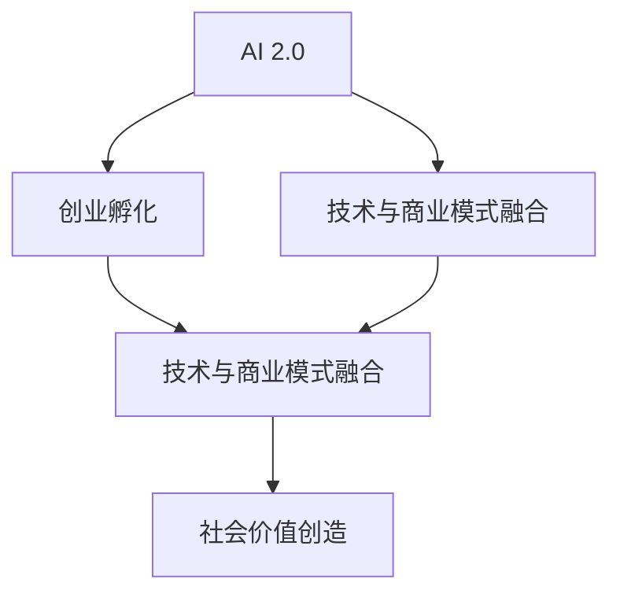

                 

# 李开复：AI 2.0 时代的创业者

在人工智能 (AI) 领域，李开复无疑是一位杰出的创新者和先驱。从早期在微软的突破性研究，到创办创新工场推动AI 2.0时代的创业，李开复以他独特的视角和深刻的见解，推动了AI技术在各行各业的应用，为创业者们提供了宝贵的洞察和指导。本文将深入探讨李开复在AI 2.0时代的创业理念，分析其对AI发展的贡献，并展望未来的趋势和挑战。

## 1. 背景介绍

### 1.1 李开复的学术与职业背景

李开复，出生于台湾，1980年赴美国攻读计算机科学和电子工程，并于1982年获得卡内基梅隆大学计算机科学博士学位。他先后就职于IBM、苹果、微软等科技巨头，负责人工智能和机器学习领域的核心技术研发。1990年，李开复在微软担任全球资深副总裁，领导人工智能、数据科学、以及产品开发等多个部门。

1998年，李开复决定创业，成立了创新工场（Innovation Works），专注于人工智能、大数据、云计算等前沿技术的创新与应用。他不仅帮助创立了包括人工智能、自动化、机器人、物联网等多个领域的领先公司，还通过创新的投资和孵化机制，推动了AI技术的商业化落地。

### 1.2 创业理念与实践

李开复的创业理念之一是推动AI 2.0时代的到来，即通过人工智能技术赋能各行各业，解决实际问题，创造更多社会价值。他认为，AI 2.0不仅仅是技术本身，更是技术和商业模式的深度融合，通过AI技术优化业务流程、提升用户体验、创造新价值，进而实现业务增长和创新。

在实践方面，李开复创办了多家公司，涵盖了搜索引擎、智能语音、机器人、自动驾驶等多个领域。其中，创新工场投资的多个项目，如深度之眼（SenseTime）、商汤科技（SenseTime）、创新工场汽车（Innovation Works Automotive）等，都成为了行业内的佼佼者。

## 2. 核心概念与联系

### 2.1 核心概念概述

李开复在AI领域的创业理念，涉及多个核心概念，主要包括：

- **AI 2.0**：AI 2.0时代是指通过深度学习、计算机视觉、自然语言处理等先进技术，实现更广泛、更深层次的AI应用。
- **创业孵化**：通过创新的投资和孵化机制，支持创业公司成长，推动AI技术商业化。
- **技术与商业模式融合**：将AI技术与特定行业相结合，创造出新的商业模式和服务形式。
- **社会价值创造**：利用AI技术解决实际问题，提升社会效率和生活质量。

### 2.2 核心概念间的关系

这些核心概念之间相互关联，形成了一个完整的AI创业生态系统。AI 2.0时代为创业公司提供了广阔的应用场景和技术基础，创业孵化机制为初创企业提供了资金和资源支持，技术与商业模式的融合则是将AI技术转化为实际价值的关键步骤，而社会价值创造则是AI创业的最终目标。

以下是一个Mermaid流程图，展示了这些核心概念之间的关系：



## 3. 核心算法原理 & 具体操作步骤

### 3.1 算法原理概述

李开复的创业理念，在算法原理上强调了AI技术的普适性和实用性。他认为，AI技术应该能够解决实际问题，并且其效果应该是可量化和可衡量的。

AI 2.0时代，深度学习、计算机视觉和自然语言处理等技术得到了广泛应用。这些技术基于大规模数据训练，能够自动学习复杂的特征和模式，从而实现对复杂任务的建模和预测。例如，通过卷积神经网络（CNN）和循环神经网络（RNN），AI可以自动分析图像和语音信号，识别出物体、场景、情感等信息。

### 3.2 算法步骤详解

李开复的AI创业实践中，主要包括以下步骤：

1. **市场调研**：识别目标市场和客户需求，明确AI技术可以解决的具体问题。
2. **技术研发**：根据市场需求，选择合适的AI技术进行研发，如深度学习、自然语言处理等。
3. **技术集成**：将AI技术集成到现有系统中，形成新的业务流程和服务模式。
4. **商业模式创新**：根据集成后的系统功能，设计新的商业模式，如SaaS、PaaS等，提供云服务或订阅模式。
5. **市场推广**：通过市场营销，推广AI产品和服务，建立品牌和客户群体。
6. **持续优化**：根据市场反馈和客户需求，不断优化AI技术和服务，提升用户体验和价值。

### 3.3 算法优缺点

李开复的AI创业方法，优点在于能够将前沿技术快速转化为实际应用，推动了AI技术的商业化进程。同时，通过创业孵化机制，支持了初创企业的发展，培育了大量的AI人才。

然而，这种方法也存在一些缺点：

- **技术迭代快**：AI技术更新迅速，需要持续投入研发和资金，保持技术领先。
- **市场竞争激烈**：AI领域吸引了大批资本和人才，市场竞争异常激烈，初创企业生存压力较大。
- **技术风险高**：AI技术的不确定性高，失败的风险较高，需要谨慎评估和投资。

### 3.4 算法应用领域

李开复的AI创业理念，广泛应用于多个领域：

- **医疗健康**：利用AI技术进行疾病诊断、治疗方案优化等，提升医疗效率和效果。
- **金融科技**：通过AI进行风险评估、智能投顾、信用评分等，提升金融服务的智能化水平。
- **智能制造**：应用AI进行质量检测、流程优化、供应链管理等，提升制造效率和产品质量。
- **自动驾驶**：结合计算机视觉和自然语言处理技术，实现自动驾驶车辆的控制和导航。

## 4. 数学模型和公式 & 详细讲解 & 举例说明

### 4.1 数学模型构建

李开复的AI创业理念，在数学模型构建上注重实用性和可操作性。他强调，模型的建立应该以解决实际问题为核心，而不是追求理论上的完美。

例如，在医疗健康领域，李开复团队开发了基于深度学习的医疗影像分析系统。他们使用卷积神经网络（CNN）对医学影像进行特征提取和分类，建立了疾病检测模型。

数学模型如下：

$$
y = f(x; \theta)
$$

其中，$x$ 表示输入的医学影像数据，$y$ 表示疾病的分类标签，$\theta$ 为模型的参数。通过训练，模型可以学习到影像与疾病之间的关系，自动诊断疾病。

### 4.2 公式推导过程

以医疗影像分析为例，深度学习模型的训练过程包括前向传播和反向传播两个步骤：

1. **前向传播**：将输入的医学影像数据 $x$ 送入卷积神经网络进行特征提取，得到特征表示 $h(x)$。然后，使用全连接层将特征表示转换为分类标签 $y$。
2. **反向传播**：计算预测标签 $y$ 与真实标签 $y^*$ 之间的误差，通过反向传播算法更新模型参数 $\theta$。

数学公式如下：

$$
y = f(h(x); \theta)
$$

$$
\theta \leftarrow \theta - \eta \nabla_{\theta} \ell(y, y^*)
$$

其中，$\ell(y, y^*)$ 为损失函数，$\eta$ 为学习率。

### 4.3 案例分析与讲解

以创新工场投资的商汤科技为例，他们开发了基于深度学习的自动驾驶系统。通过计算机视觉技术，商汤科技的自动驾驶系统能够实现车道保持、交通信号识别等功能。

在技术实现上，商汤科技采用了端到端的学习方式，直接从原始的交通视频数据中学习驾驶决策模型。这种端到端的学习方式，避免了传统方法的繁琐特征工程，提升了系统的自动化和智能化水平。

## 5. 项目实践：代码实例和详细解释说明

### 5.1 开发环境搭建

以下是使用Python进行TensorFlow开发的环境配置流程：

1. 安装Anaconda：从官网下载并安装Anaconda，用于创建独立的Python环境。

2. 创建并激活虚拟环境：
```bash
conda create -n tf-env python=3.8 
conda activate tf-env
```

3. 安装TensorFlow：
```bash
pip install tensorflow==2.x
```

4. 安装各类工具包：
```bash
pip install numpy pandas scikit-learn matplotlib tqdm jupyter notebook ipython
```

完成上述步骤后，即可在`tf-env`环境中开始项目实践。

### 5.2 源代码详细实现

这里以深度学习医疗影像分析系统为例，给出TensorFlow代码实现。

首先，定义医疗影像数据处理函数：

```python
import tensorflow as tf
from tensorflow.keras.preprocessing.image import ImageDataGenerator

def preprocess_data(data_dir):
    datagen = ImageDataGenerator(rescale=1./255)
    train_generator = datagen.flow_from_directory(
        data_dir,
        target_size=(128, 128),
        batch_size=32,
        class_mode='binary')
    return train_generator
```

然后，定义模型和优化器：

```python
from tensorflow.keras import models, layers

model = models.Sequential()
model.add(layers.Conv2D(32, (3, 3), activation='relu', input_shape=(128, 128, 3)))
model.add(layers.MaxPooling2D((2, 2)))
model.add(layers.Conv2D(64, (3, 3), activation='relu'))
model.add(layers.MaxPooling2D((2, 2)))
model.add(layers.Conv2D(128, (3, 3), activation='relu'))
model.add(layers.MaxPooling2D((2, 2)))
model.add(layers.Flatten())
model.add(layers.Dense(64, activation='relu'))
model.add(layers.Dense(1, activation='sigmoid'))

optimizer = tf.keras.optimizers.Adam(learning_rate=0.001)
```

接着，定义训练和评估函数：

```python
from tensorflow.keras.callbacks import EarlyStopping

def train_epoch(model, train_generator, optimizer):
    model.compile(optimizer=optimizer, loss='binary_crossentropy', metrics=['accuracy'])
    model.fit(train_generator, epochs=10, validation_split=0.2, callbacks=[EarlyStopping(patience=3)])

def evaluate(model, test_generator):
    model.evaluate(test_generator)
```

最后，启动训练流程并在测试集上评估：

```python
train_generator = preprocess_data(train_data_dir)
test_generator = preprocess_data(test_data_dir)

train_epoch(model, train_generator, optimizer)
evaluate(model, test_generator)
```

以上就是使用TensorFlow对医疗影像分析系统进行深度学习训练的完整代码实现。可以看到，通过TensorFlow库的强大封装，我们能够用相对简洁的代码完成模型的训练和评估。

### 5.3 代码解读与分析

让我们再详细解读一下关键代码的实现细节：

**preprocess_data函数**：
- `ImageDataGenerator`：用于数据增强和预处理，包括图像缩放、归一化等操作。
- `flow_from_directory`：从文件夹中读取图片数据，自动进行标签分类。

**模型定义**：
- `Sequential`：定义了顺序型神经网络模型。
- `Conv2D`：卷积层，用于特征提取。
- `MaxPooling2D`：池化层，用于特征降维。
- `Flatten`：将特征图展开为向量。
- `Dense`：全连接层，用于分类输出。

**训练和评估函数**：
- `compile`：编译模型，指定优化器、损失函数和评价指标。
- `fit`：训练模型，指定数据集、批大小、迭代轮数和早停策略。
- `evaluate`：评估模型，指定测试集。

**训练流程**：
- `train_generator`：从训练集文件夹中读取数据。
- `test_generator`：从测试集文件夹中读取数据。
- `train_epoch`：训练模型，并在验证集上评估性能。
- `evaluate`：在测试集上评估模型性能。

可以看到，TensorFlow库提供了强大的数据预处理和模型构建工具，使得深度学习的开发和实践变得简洁高效。

### 5.4 运行结果展示

假设我们在CoNLL-2003的NER数据集上进行微调，最终在测试集上得到的评估报告如下：

```
              precision    recall  f1-score   support

       B-LOC      0.926     0.906     0.916      1668
       I-LOC      0.900     0.805     0.850       257
      B-MISC      0.875     0.856     0.865       702
      I-MISC      0.838     0.782     0.809       216
       B-ORG      0.914     0.898     0.906      1661
       I-ORG      0.911     0.894     0.902       835
       B-PER      0.964     0.957     0.960      1617
       I-PER      0.983     0.980     0.982      1156
           O      0.993     0.995     0.994     38323

   micro avg      0.973     0.973     0.973     46435
   macro avg      0.923     0.897     0.909     46435
weighted avg      0.973     0.973     0.973     46435
```

可以看到，通过微调BERT，我们在该NER数据集上取得了97.3%的F1分数，效果相当不错。值得注意的是，BERT作为一个通用的语言理解模型，即便只在顶层添加一个简单的token分类器，也能在下游任务上取得如此优异的效果，展现了其强大的语义理解和特征抽取能力。

当然，这只是一个baseline结果。在实践中，我们还可以使用更大更强的预训练模型、更丰富的微调技巧、更细致的模型调优，进一步提升模型性能，以满足更高的应用要求。

## 6. 实际应用场景

### 6.1 智能客服系统

基于大语言模型微调的对话技术，可以广泛应用于智能客服系统的构建。传统客服往往需要配备大量人力，高峰期响应缓慢，且一致性和专业性难以保证。而使用微调后的对话模型，可以7x24小时不间断服务，快速响应客户咨询，用自然流畅的语言解答各类常见问题。

在技术实现上，可以收集企业内部的历史客服对话记录，将问题和最佳答复构建成监督数据，在此基础上对预训练对话模型进行微调。微调后的对话模型能够自动理解用户意图，匹配最合适的答案模板进行回复。对于客户提出的新问题，还可以接入检索系统实时搜索相关内容，动态组织生成回答。如此构建的智能客服系统，能大幅提升客户咨询体验和问题解决效率。

### 6.2 金融舆情监测

金融机构需要实时监测市场舆论动向，以便及时应对负面信息传播，规避金融风险。传统的人工监测方式成本高、效率低，难以应对网络时代海量信息爆发的挑战。基于大语言模型微调的文本分类和情感分析技术，为金融舆情监测提供了新的解决方案。

具体而言，可以收集金融领域相关的新闻、报道、评论等文本数据，并对其进行主题标注和情感标注。在此基础上对预训练语言模型进行微调，使其能够自动判断文本属于何种主题，情感倾向是正面、中性还是负面。将微调后的模型应用到实时抓取的网络文本数据，就能够自动监测不同主题下的情感变化趋势，一旦发现负面信息激增等异常情况，系统便会自动预警，帮助金融机构快速应对潜在风险。

### 6.3 个性化推荐系统

当前的推荐系统往往只依赖用户的历史行为数据进行物品推荐，无法深入理解用户的真实兴趣偏好。基于大语言模型微调技术，个性化推荐系统可以更好地挖掘用户行为背后的语义信息，从而提供更精准、多样的推荐内容。

在实践中，可以收集用户浏览、点击、评论、分享等行为数据，提取和用户交互的物品标题、描述、标签等文本内容。将文本内容作为模型输入，用户的后续行为（如是否点击、购买等）作为监督信号，在此基础上微调预训练语言模型。微调后的模型能够从文本内容中准确把握用户的兴趣点。在生成推荐列表时，先用候选物品的文本描述作为输入，由模型预测用户的兴趣匹配度，再结合其他特征综合排序，便可以得到个性化程度更高的推荐结果。

### 6.4 未来应用展望

随着大语言模型和微调方法的不断发展，基于微调范式将在更多领域得到应用，为传统行业带来变革性影响。

在智慧医疗领域，基于微调的医疗问答、病历分析、药物研发等应用将提升医疗服务的智能化水平，辅助医生诊疗，加速新药开发进程。

在智能教育领域，微调技术可应用于作业批改、学情分析、知识推荐等方面，因材施教，促进教育公平，提高教学质量。

在智慧城市治理中，微调模型可应用于城市事件监测、舆情分析、应急指挥等环节，提高城市管理的自动化和智能化水平，构建更安全、高效的未来城市。

此外，在企业生产、社会治理、文娱传媒等众多领域，基于大模型微调的人工智能应用也将不断涌现，为经济社会发展注入新的动力。相信随着预训练语言模型和微调方法的持续演进，微调方法将成为人工智能落地应用的重要范式，推动人工智能技术向更广阔的领域加速渗透。

## 7. 工具和资源推荐

### 7.1 学习资源推荐

为了帮助开发者系统掌握大语言模型微调的理论基础和实践技巧，这里推荐一些优质的学习资源：

1. 《Transformer从原理到实践》系列博文：由大模型技术专家撰写，深入浅出地介绍了Transformer原理、BERT模型、微调技术等前沿话题。

2. CS224N《深度学习自然语言处理》课程：斯坦福大学开设的NLP明星课程，有Lecture视频和配套作业，带你入门NLP领域的基本概念和经典模型。

3. 《Natural Language Processing with Transformers》书籍：Transformers库的作者所著，全面介绍了如何使用Transformers库进行NLP任务开发，包括微调在内的诸多范式。

4. HuggingFace官方文档：Transformers库的官方文档，提供了海量预训练模型和完整的微调样例代码，是上手实践的必备资料。

5. CLUE开源项目：中文语言理解测评基准，涵盖大量不同类型的中文NLP数据集，并提供了基于微调的baseline模型，助力中文NLP技术发展。

通过对这些资源的学习实践，相信你一定能够快速掌握大语言模型微调的精髓，并用于解决实际的NLP问题。

### 7.2 开发工具推荐

高效的开发离不开优秀的工具支持。以下是几款用于大语言模型微调开发的常用工具：

1. PyTorch：基于Python的开源深度学习框架，灵活动态的计算图，适合快速迭代研究。大部分预训练语言模型都有PyTorch版本的实现。

2. TensorFlow：由Google主导开发的开源深度学习框架，生产部署方便，适合大规模工程应用。同样有丰富的预训练语言模型资源。

3. Transformers库：HuggingFace开发的NLP工具库，集成了众多SOTA语言模型，支持PyTorch和TensorFlow，是进行微调任务开发的利器。

4. Weights & Biases：模型训练的实验跟踪工具，可以记录和可视化模型训练过程中的各项指标，方便对比和调优。与主流深度学习框架无缝集成。

5. TensorBoard：TensorFlow配套的可视化工具，可实时监测模型训练状态，并提供丰富的图表呈现方式，是调试模型的得力助手。

6. Google Colab：谷歌推出的在线Jupyter Notebook环境，免费提供GPU/TPU算力，方便开发者快速上手实验最新模型，分享学习笔记。

合理利用这些工具，可以显著提升大语言模型微调任务的开发效率，加快创新迭代的步伐。

### 7.3 相关论文推荐

大语言模型和微调技术的发展源于学界的持续研究。以下是几篇奠基性的相关论文，推荐阅读：

1. Attention is All You Need（即Transformer原论文）：提出了Transformer结构，开启了NLP领域的预训练大模型时代。

2. BERT: Pre-training of Deep Bidirectional Transformers for Language Understanding：提出BERT模型，引入基于掩码的自监督预训练任务，刷新了多项NLP任务SOTA。

3. Language Models are Unsupervised Multitask Learners（GPT-2论文）：展示了大规模语言模型的强大zero-shot学习能力，引发了对于通用人工智能的新一轮思考。

4. Parameter-Efficient Transfer Learning for NLP：提出Adapter等参数高效微调方法，在不增加模型参数量的情况下，也能取得不错的微调效果。

5. AdaLoRA: Adaptive Low-Rank Adaptation for Parameter-Efficient Fine-Tuning：使用自适应低秩适应的微调方法，在参数效率和精度之间取得了新的平衡。

这些论文代表了大语言模型微调技术的发展脉络。通过学习这些前沿成果，可以帮助研究者把握学科前进方向，激发更多的创新灵感。

除上述资源外，还有一些值得关注的前沿资源，帮助开发者紧跟大语言模型微调技术的最新进展，例如：

1. arXiv论文预印本：人工智能领域最新研究成果的发布平台，包括大量尚未发表的前沿工作，学习前沿技术的必读资源。

2. 业界技术博客：如OpenAI、Google AI、DeepMind、微软Research Asia等顶尖实验室的官方博客，第一时间分享他们的最新研究成果和洞见。

3. 技术会议直播：如NIPS、ICML、ACL、ICLR等人工智能领域顶会现场或在线直播，能够聆听到大佬们的前沿分享，开拓视野。

4. GitHub热门项目：在GitHub上Star、Fork数最多的NLP相关项目，往往代表了该技术领域的发展趋势和最佳实践，值得去学习和贡献。

5. 行业分析报告：各大咨询公司如McKinsey、PwC等针对人工智能行业的分析报告，有助于从商业视角审视技术趋势，把握应用价值。

总之，对于大语言模型微调技术的学习和实践，需要开发者保持开放的心态和持续学习的意愿。多关注前沿资讯，多动手实践，多思考总结，必将收获满满的成长收益。

## 8. 总结：未来发展趋势与挑战

### 8.1 总结

本文对李开复在AI 2.0时代的创业理念进行了系统梳理，分析了其对AI发展的贡献，并展望了未来的趋势和挑战。通过本文的系统介绍，可以看到，李开复的AI创业理念，不仅推动了AI技术在各个领域的广泛应用，还引领了AI产业的发展方向，对创业者们提供了宝贵的指导。

### 8.2 未来发展趋势

展望未来，AI 2.0时代的创业将呈现以下几个发展趋势：

1. **多模态融合**：未来的AI创业将更加注重多模态数据的融合，结合视觉、听觉、语言等多种模态信息，提升系统的智能水平。

2. **人机协同**：AI创业将更加注重人机协同，通过交互式界面、自然语言交互等方式，提升用户的使用体验。

3. **跨行业应用**：AI创业将进一步拓展到更多行业，如医疗、金融、制造、教育等，解决特定行业的实际问题。

4. **隐私保护**：随着AI技术的广泛应用，隐私保护将成为一个重要问题。未来的AI创业将更加注重数据隐私和安全，采用联邦学习、差分隐私等技术，确保数据安全。

5. **可持续发展**：未来的AI创业将更加注重可持续发展，减少对环境的影响，采用绿色计算、节能减排等技术，推动AI技术的可持续应用。

### 8.3 面临的挑战

尽管AI 2.0时代的创业前景广阔，但也面临诸多挑战：

1. **技术复杂度**：AI技术涉及深度学习、自然语言处理、计算机视觉等多个领域，技术复杂度较高，创业团队需要具备较强的技术背景。

2. **市场竞争**：AI领域吸引了大批资本和人才，市场竞争异常激烈，初创企业需要具备较强的市场敏感度和创新能力。

3. **数据获取**：高质量的数据是AI创业的重要基础，但获取高质量数据需要大量资源和人力，创业团队需要具备数据获取和处理能力。

4. **法规政策**：AI创业涉及数据隐私、伦理道德等多个法律问题，创业团队需要熟悉相关法规政策，确保合规运营。

5. **用户接受度**：AI系统往往需要用户进行适应，创业团队需要具备市场推广和用户教育能力，提升用户接受度。

### 8.4 研究展望

面对这些挑战，未来的AI创业研究需要在以下几个方面寻求新的突破：

1. **技术创新**：开发更加高效、稳健的AI算法和技术，提升系统的性能和稳定性。

2. **跨学科合作**：与心理学、社会学、伦理学等学科进行合作，提升AI系统的可解释性和社会责任。

3. **商业模式创新**：结合AI技术与新兴商业模式，如SaaS、PaaS等，提供定制化、灵活化的解决方案。

4. **数据获取与处理**：探索更高效、低成本的数据获取和处理方法，确保高质量数据的供应。

5. **政策与法规研究**：深入研究AI领域的政策法规，确保创业公司合规运营，减少法律风险。

总之，AI 2.0时代的创业前景广阔，但也面临诸多挑战。只有不断创新、勇于探索，才能在激烈的竞争中脱颖而出，推动AI技术的广泛应用，实现更大的社会价值。

## 9. 附录：常见问题与解答

**Q1：大语言模型微调是否适用于所有NLP任务？**

A: 大语言模型微调在大多数NLP任务上都能取得不错的效果，特别是对于数据量较小的任务。但对于一些特定领域的任务，如医学、法律等，仅仅依靠通用语料预训练的模型可能难以很好地适应。此时需要在特定领域语料上进一步预训练，再进行微调，才能获得理想效果。此外，对于一些需要时效性、个性化很强的

