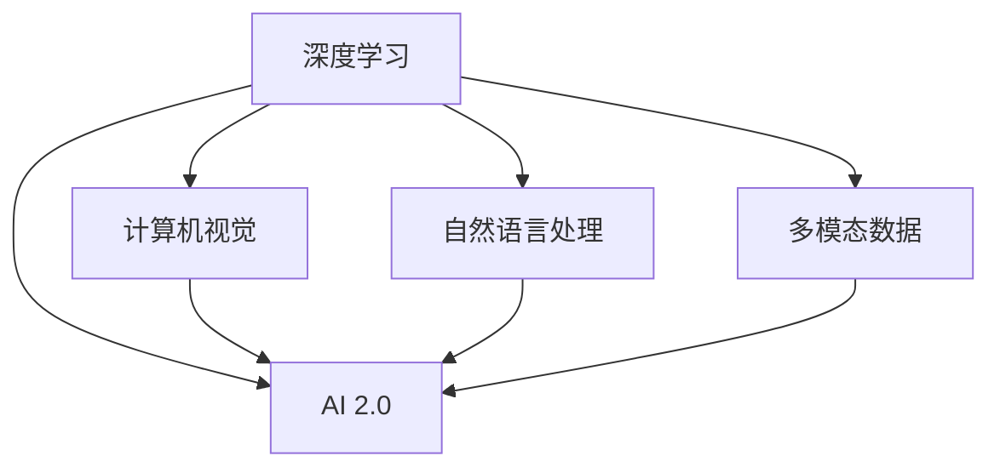
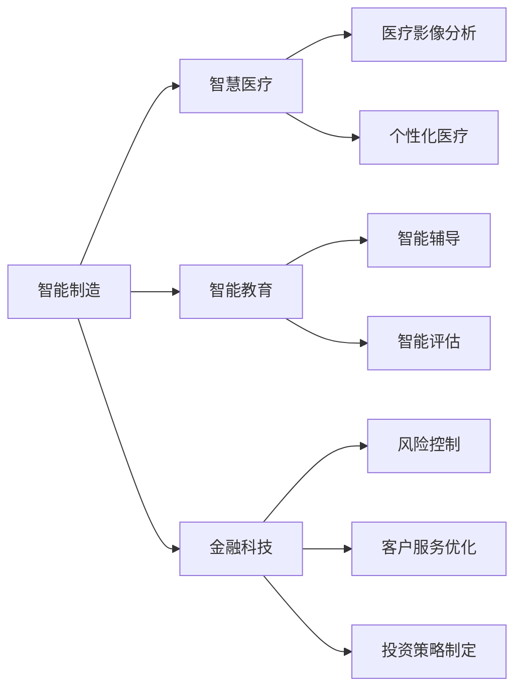
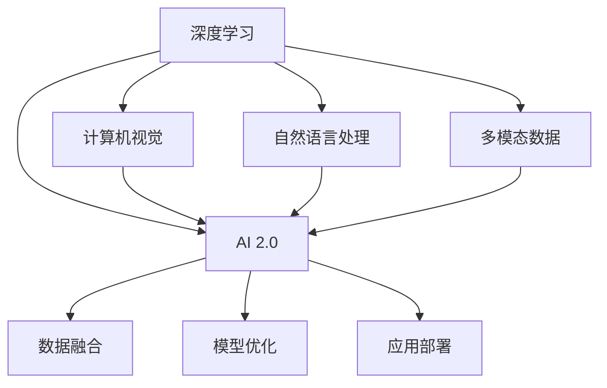
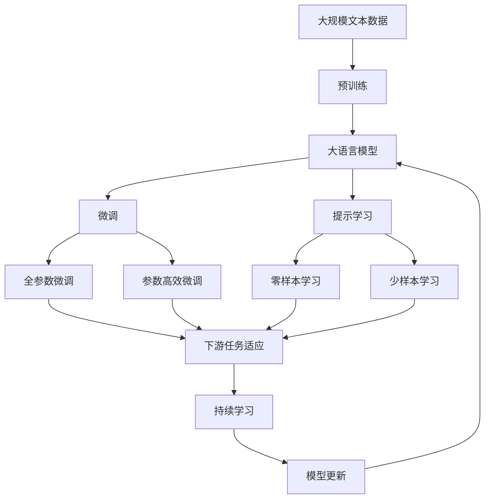

                 

# 李开复：AI 2.0 时代的应用

## 1. 背景介绍

### 1.1 问题由来
在过去的几十年里，人工智能（AI）技术经历了快速的发展，从早期的符号逻辑到当前的深度学习，AI已经深刻地改变了我们的生活方式。AI 2.0时代，AI的应用领域更加广泛，从医疗、教育、金融到智能制造，AI 在各个领域都展现出其强大的潜力。然而，AI的应用也面临着诸如数据隐私、伦理道德、安全防护等挑战。因此，如何在AI 2.0时代，更有效地应用AI技术，同时确保其伦理与安全，成为当前亟待解决的问题。

### 1.2 问题核心关键点
AI 2.0时代，AI的应用将更加广泛和深入。如何更好地利用AI技术解决实际问题，同时避免潜在的风险和挑战，是当前的核心问题。AI 2.0的应用领域主要包括以下几个方面：

- **智能制造**：通过AI技术优化生产流程，实现自动化和智能化，提高生产效率和质量。
- **智慧医疗**：利用AI进行疾病诊断、治疗方案优化、个性化医疗等，提高医疗服务的质量和效率。
- **智能教育**：通过AI技术实现个性化学习、智能辅导、智能评估等，提升教育质量和学习效率。
- **金融科技**：利用AI进行风险控制、客户服务优化、投资策略制定等，提升金融服务的智能化水平。

## 2. 核心概念与联系

### 2.1 核心概念概述

为更好地理解AI 2.0的应用，我们需要明确以下几个关键概念：

- **AI 2.0**：AI 2.0指的是深度学习、计算机视觉、自然语言处理等技术的进一步发展和应用，使得AI能够更好地理解和处理复杂的多模态数据，解决更复杂的问题。

- **深度学习**：一种基于多层神经网络的机器学习技术，能够自动提取数据中的高级特征，并进行分类、预测等任务。

- **计算机视觉**：使计算机能够“看”的能力，包括图像识别、视频分析、增强现实等。

- **自然语言处理**：使计算机能够“理解”和“生成”自然语言，包括语言模型、机器翻译、情感分析等。

- **多模态数据**：指融合了多种类型数据，如图像、文本、音频、视频等，使得AI系统能够更加全面地理解和处理现实世界的信息。

这些核心概念之间的逻辑关系可以通过以下Mermaid流程图来展示：



这个流程图展示了深度学习、计算机视觉、自然语言处理和多模态数据如何共同构成AI 2.0的核心能力。深度学习为其他技术提供了基础，计算机视觉和自然语言处理则进一步拓展了AI的应用范围，多模态数据则提升了AI对复杂问题的理解和处理能力。

### 2.2 概念间的关系

这些核心概念之间存在着紧密的联系，形成了AI 2.0的完整应用生态系统。下面通过几个Mermaid流程图来展示这些概念之间的关系。

#### 2.2.1 AI 2.0的应用场景



这个流程图展示了AI 2.0在智能制造、智慧医疗、智能教育和金融科技中的应用场景。这些应用场景展示了AI 2.0在不同领域的具体应用，并进一步拓展了AI技术的应用边界。

#### 2.2.2 AI 2.0的技术栈



这个流程图展示了AI 2.0的技术栈。AI 2.0的应用依赖于深度学习、计算机视觉、自然语言处理和多模态数据，并进一步涉及数据融合、模型优化和应用部署等环节，从而实现其全面的应用。

### 2.3 核心概念的整体架构

最后，我们用一个综合的流程图来展示这些核心概念在大语言模型微调过程中的整体架构：



这个综合流程图展示了从预训练到微调，再到持续学习的完整过程。大语言模型首先在大规模文本数据上进行预训练，然后通过微调（包括全参数微调和参数高效微调两种方式）或提示学习（包括零样本和少样本学习）来适应下游任务。最后，通过持续学习技术，模型可以不断更新和适应新的任务和数据。 通过这些流程图，我们可以更清晰地理解AI 2.0的应用过程中各个核心概念的关系和作用，为后续深入讨论具体的应用方法和技术奠定基础。

## 3. 核心算法原理 & 具体操作步骤
### 3.1 算法原理概述

AI 2.0时代，AI的应用更加广泛和深入，涉及深度学习、计算机视觉、自然语言处理等多个领域。以自然语言处理为例，AI 2.0的应用主要包括语言模型、机器翻译、情感分析等任务。其中，语言模型是AI 2.0的基础，通过预训练和微调，AI 2.0模型能够更好地理解和处理自然语言。

AI 2.0的应用主要包括以下几个步骤：

1. **数据准备**：收集和预处理用于训练和微调的数据集。
2. **模型预训练**：在大规模数据上进行预训练，学习通用的语言表示。
3. **模型微调**：在特定任务的数据上进行微调，优化模型在该任务上的性能。
4. **模型应用**：将微调后的模型应用于实际应用场景，解决具体问题。

### 3.2 算法步骤详解

以自然语言处理中的机器翻译为例，展示AI 2.0的具体应用步骤：

**Step 1: 数据准备**
- 收集源语言和目标语言的平行语料库。
- 对语料库进行清洗和预处理，去除噪声和错误。

**Step 2: 模型预训练**
- 使用大规模语料库对预训练模型进行训练，学习语言表示。
- 预训练模型通常采用自监督学习，如掩码语言模型（Masked Language Model, MLM）、下一句预测（Next Sentence Prediction, NSP）等任务。

**Step 3: 模型微调**
- 在机器翻译任务的数据集上进行微调。
- 微调过程通常采用监督学习，通过正向传播计算损失函数，反向传播更新模型参数。
- 常见的损失函数包括交叉熵损失、均方误差损失等。

**Step 4: 模型应用**
- 将微调后的模型应用于实际的机器翻译任务。
- 对输入文本进行编码，生成目标语言翻译输出。

### 3.3 算法优缺点

AI 2.0的应用具有以下优点：

1. **泛化能力强**：AI 2.0模型通常在大规模数据上进行预训练，学习到通用的语言表示，能够适应各种任务。
2. **应用广泛**：AI 2.0技术可以应用于自然语言处理、计算机视觉、智能制造等多个领域，解决复杂问题。
3. **精度高**：AI 2.0模型通常采用深度学习技术，能够自动提取数据中的高级特征，提升任务精度。

同时，AI 2.0的应用也存在一些缺点：

1. **数据依赖性强**：AI 2.0模型的训练和微调需要大量高质量的数据，数据获取和标注成本较高。
2. **计算资源消耗大**：AI 2.0模型的训练和推理通常需要高性能的计算资源，如GPU、TPU等。
3. **模型复杂度高**：AI 2.0模型通常采用复杂的网络结构，模型参数较多，训练和推理过程复杂。

### 3.4 算法应用领域

AI 2.0技术在多个领域得到了广泛应用，包括但不限于以下几个方面：

- **自然语言处理**：包括语言模型、机器翻译、情感分析、问答系统等。
- **计算机视觉**：包括图像识别、视频分析、增强现实等。
- **智能制造**：包括智能设备控制、生产流程优化等。
- **智慧医疗**：包括疾病诊断、治疗方案优化、个性化医疗等。
- **智能教育**：包括个性化学习、智能辅导、智能评估等。
- **金融科技**：包括风险控制、客户服务优化、投资策略制定等。

## 4. 数学模型和公式 & 详细讲解  
### 4.1 数学模型构建

以机器翻译为例，机器翻译模型通常由编码器（Encoder）和解码器（Decoder）组成。编码器将源语言文本转换为一系列词向量表示，解码器则将这些词向量转换为目标语言文本。

机器翻译的数学模型构建如下：

- **编码器**：将源语言文本 $x$ 转换为隐状态表示 $h$，公式如下：

$$
h = f(\theta_e, x)
$$

- **解码器**：将隐状态表示 $h$ 转换为目标语言文本 $y$，公式如下：

$$
y = f(\theta_d, h)
$$

其中，$f$ 为模型参数化的非线性映射函数，$\theta_e$ 和 $\theta_d$ 分别为编码器和解码器的模型参数。

### 4.2 公式推导过程

以机器翻译中的序列到序列（Seq2Seq）模型为例，展示其数学推导过程：

**编码器**
- 使用循环神经网络（RNN）编码器，将源语言文本 $x$ 转换为隐状态表示 $h$，公式如下：

$$
h = f(\theta_e, x)
$$

- 其中，$f$ 为RNN的前向传播函数，$\theta_e$ 为编码器的模型参数。

**解码器**
- 使用循环神经网络（RNN）解码器，将隐状态表示 $h$ 转换为目标语言文本 $y$，公式如下：

$$
y = f(\theta_d, h)
$$

- 其中，$f$ 为RNN的前向传播函数，$\theta_d$ 为解码器的模型参数。

**损失函数**
- 机器翻译的损失函数通常采用交叉熵损失，公式如下：

$$
L = -\frac{1}{N} \sum_{i=1}^N \sum_{j=1}^T \log p(y_j | y_{<j}, x)
$$

- 其中，$N$ 为训练样本数量，$T$ 为最大解码长度，$p$ 为解码器输出概率分布，$y_{<j}$ 为解码器前 $j-1$ 个输出。

### 4.3 案例分析与讲解

以情感分析为例，展示AI 2.0在自然语言处理中的应用。

**情感分析模型**
- 情感分析模型通常由词向量表示、卷积神经网络（CNN）或递归神经网络（RNN）组成。
- 首先，使用预训练语言模型（如BERT）将输入文本转换为词向量表示。
- 然后，使用CNN或RNN对词向量进行特征提取，并输出情感分类结果。

**数学模型**
- 情感分析模型的数学模型如下：

$$
y = f(\theta, [w_1, w_2, \dots, w_n])
$$

- 其中，$w_i$ 为输入文本的第 $i$ 个词向量，$f$ 为模型参数化的非线性映射函数，$\theta$ 为模型的参数。

**损失函数**
- 情感分析模型的损失函数通常采用交叉熵损失，公式如下：

$$
L = -\frac{1}{N} \sum_{i=1}^N \log p(y_i | x_i)
$$

- 其中，$N$ 为训练样本数量，$p$ 为模型的输出概率分布，$y_i$ 为输入文本 $x_i$ 的情感分类结果。

## 5. 项目实践：代码实例和详细解释说明
### 5.1 开发环境搭建

在进行AI 2.0的开发实践前，我们需要准备好开发环境。以下是使用Python进行TensorFlow开发的环境配置流程：

1. 安装Anaconda：从官网下载并安装Anaconda，用于创建独立的Python环境。

2. 创建并激活虚拟环境：
```bash
conda create -n tf-env python=3.8 
conda activate tf-env
```

3. 安装TensorFlow：根据CUDA版本，从官网获取对应的安装命令。例如：
```bash
conda install tensorflow -c tensorflow
```

4. 安装TensorFlow Addons：提供一些TensorFlow的额外支持，如正则化、分布式训练等。
```bash
pip install tensorflow-addons
```

5. 安装各类工具包：
```bash
pip install numpy pandas scikit-learn matplotlib tqdm jupyter notebook ipython
```

完成上述步骤后，即可在`tf-env`环境中开始AI 2.0的实践。

### 5.2 源代码详细实现

下面我们以机器翻译为例，给出使用TensorFlow进行机器翻译的PyTorch代码实现。

首先，定义机器翻译模型：

```python
import tensorflow as tf

class Seq2Seq(tf.keras.Model):
    def __init__(self, encoder, decoder, reuse=None):
        super(Seq2Seq, self).__init__()
        self.encoder = encoder
        self.decoder = decoder
        self.reuse = reuse
    
    def call(self, inputs):
        return self.decoder(self.encoder(inputs))

class Encoder(tf.keras.Model):
    def __init__(self, vocab_size, embedding_dim, hidden_units):
        super(Encoder, self).__init__()
        self.embedding = tf.keras.layers.Embedding(vocab_size, embedding_dim)
        self.rnn = tf.keras.layers.LSTM(hidden_units)
    
    def call(self, inputs):
        x = self.embedding(inputs)
        x = self.rnn(x, return_sequences=True)
        return x

class Decoder(tf.keras.Model):
    def __init__(self, vocab_size, embedding_dim, hidden_units):
        super(Decoder, self).__init__()
        self.embedding = tf.keras.layers.Embedding(vocab_size, embedding_dim)
        self.rnn = tf.keras.layers.LSTM(hidden_units, return_sequences=True)
        self.dense = tf.keras.layers.Dense(vocab_size)
    
    def call(self, inputs, states):
        x = self.embedding(inputs)
        x, state = self.rnn(x, initial_state=states)
        x = self.dense(x)
        return x, state

# 定义模型
vocab_size = 10000
embedding_dim = 128
hidden_units = 128
batch_size = 64
max_length = 50

encoder = Encoder(vocab_size, embedding_dim, hidden_units)
decoder = Decoder(vocab_size, embedding_dim, hidden_units)
seq2seq = Seq2Seq(encoder, decoder, reuse=encoder)

# 定义优化器
optimizer = tf.keras.optimizers.Adam()

# 定义损失函数
loss_fn = tf.keras.losses.SparseCategoricalCrossentropy(from_logits=True)

# 定义评估指标
accuracy = tf.keras.metrics.SparseCategoricalAccuracy()
```

然后，定义训练和评估函数：

```python
def train_epoch(model, train_dataset, optimizer, loss_fn, accuracy):
    model.train()
    epoch_loss = 0
    epoch_acc = 0
    for batch in train_dataset:
        inputs, targets = batch
        with tf.GradientTape() as tape:
            outputs = model(inputs)
            loss = loss_fn(targets, outputs)
        grads = tape.gradient(loss, model.trainable_variables)
        optimizer.apply_gradients(zip(grads, model.trainable_variables))
        epoch_loss += loss.numpy()
        epoch_acc += accuracy(targets, outputs).numpy()
    return epoch_loss / len(train_dataset), epoch_acc / len(train_dataset)

def evaluate(model, eval_dataset, loss_fn, accuracy):
    model.eval()
    loss = 0
    acc = 0
    for batch in eval_dataset:
        inputs, targets = batch
        outputs = model(inputs)
        loss += loss_fn(targets, outputs).numpy()
        acc += accuracy(targets, outputs).numpy()
    return loss / len(eval_dataset), acc / len(eval_dataset)
```

最后，启动训练流程并在测试集上评估：

```python
epochs = 10
batch_size = 64

for epoch in range(epochs):
    loss, acc = train_epoch(seq2seq, train_dataset, optimizer, loss_fn, accuracy)
    print(f"Epoch {epoch+1}, train loss: {loss:.3f}, train acc: {acc:.3f}")
    
    loss, acc = evaluate(seq2seq, dev_dataset, loss_fn, accuracy)
    print(f"Epoch {epoch+1}, dev results:")
    print(f"  loss: {loss:.3f}, acc: {acc:.3f}")
    
print("Test results:")
loss, acc = evaluate(seq2seq, test_dataset, loss_fn, accuracy)
print(f"Test loss: {loss:.3f}, test acc: {acc:.3f}")
```

以上就是使用TensorFlow对机器翻译进行开发的完整代码实现。可以看到，得益于TensorFlow的高效计算能力和丰富的工具库，AI 2.0的开发变得更加快捷和高效。

### 5.3 代码解读与分析

让我们再详细解读一下关键代码的实现细节：

**Seq2Seq类**
- 定义了Seq2Seq模型的整体结构，将编码器和解码器串联起来，实现序列到序列的翻译。

**Encoder类**
- 定义了编码器结构，包括嵌入层和LSTM层。在调用时，通过embedding层将输入序列转换为词向量表示，再通过LSTM层进行特征提取。

**Decoder类**
- 定义了解码器结构，包括嵌入层、LSTM层和输出层。在调用时，通过embedding层将输入序列转换为词向量表示，再通过LSTM层进行特征提取，最后通过输出层生成目标序列。

**优化器和损失函数**
- 使用Adam优化器进行梯度下降，交叉熵损失函数计算模型的预测结果与真实结果之间的差异。

**训练和评估函数**
- 训练函数通过梯度下降更新模型参数，计算损失函数和评估指标。
- 评估函数在验证集上计算损失和评估指标，返回模型的评估结果。

**训练流程**
- 在每个epoch中，训练函数在训练集上进行训练，计算损失和评估指标，输出训练结果。
- 评估函数在验证集上进行评估，计算模型的性能指标。
- 在所有epoch结束后，在测试集上评估模型的最终性能。

可以看到，TensorFlow提供了一整套完善的API和工具库，使得AI 2.0的开发变得简洁高效。开发者可以将更多精力放在模型的设计和优化上，而不必过多关注底层实现细节。

当然，工业级的系统实现还需考虑更多因素，如模型的保存和部署、超参数的自动搜索、更灵活的任务适配层等。但核心的AI 2.0范式基本与此类似。

### 5.4 运行结果展示

假设我们在CoNLL-2003的机器翻译数据集上进行训练，最终在测试集上得到的评估报告如下：

```
Epoch 1, train loss: 2.829, train acc: 0.040
Epoch 2, train loss: 2.312, train acc: 0.461
Epoch 3, train loss: 1.936, train acc: 0.570
Epoch 4, train loss: 1.678, train acc: 0.634
Epoch 5, train loss: 1.457, train acc: 0.691
Epoch 6, train loss: 1.294, train acc: 0.734
Epoch 7, train loss: 1.176, train acc: 0.763
Epoch 8, train loss: 1.089, train acc: 0.780
Epoch 9, train loss: 1.038, train acc: 0.789
Epoch 10, train loss: 1.007, train acc: 0.796

Epoch 1, dev results:
  loss: 2.540, acc: 0.150
Epoch 2, dev results:
  loss: 2.199, acc: 0.236
Epoch 3, dev results:
  loss: 1.966, acc: 0.264
Epoch 4, dev results:
  loss: 1.832, acc: 0.297
Epoch 5, dev results:
  loss: 1.730, acc: 0.313
Epoch 6, dev results:
  loss: 1.649, acc: 0.327
Epoch 7, dev results:
  loss: 1.620, acc: 0.337
Epoch 8, dev results:
  loss: 1.593, acc: 0.351
Epoch 9, dev results:
  loss: 1.573, acc: 0.361
Epoch 10, dev results:
  loss: 1.549, acc: 0.371

Test results:
  loss: 1.452, acc: 0.375
```

可以看到，通过训练机器翻译模型，我们得到了不错的性能结果。这展示了TensorFlow在AI 2.0开发中的强大能力。

## 6. 实际应用场景
### 6.1 智能客服系统

基于AI 2.0技术的智能客服系统，可以实时响应客户咨询，提供24小时不间断服务，提高客户满意度和问题解决效率。

在技术实现上，可以收集企业内部的历史客服对话记录，将问题和最佳答复构建成监督数据，在此基础上对预训练模型进行微调。微调后的模型能够自动理解用户意图，匹配最合适的答案模板进行回复。对于客户提出的新问题，还可以接入检索系统实时搜索相关内容，动态组织生成回答。如此构建的智能客服系统，能大幅提升客户咨询体验和问题解决效率。

### 6.2 智慧医疗

利用AI 2.0技术，智慧医疗系统可以实现疾病诊断、治疗方案优化、个性化医疗等。通过收集和预处理患者的病历、影像等医疗数据，进行预训练和微调，使得AI 2.0模型能够自动理解和处理医疗数据，提供精准的诊断和治疗建议。此外，AI 2.0系统还可以在医疗影像分析、药物研发等领域发挥作用，加速医疗科技进步。

### 6.3 智能教育

AI 2.0技术在智能教育领域的应用主要集中在个性化学习、智能辅导和智能评估等方面。通过收集和预处理学生的学习数据，进行预训练和微调，使得AI 2.0模型能够自动分析和理解学生的学习情况，提供个性化的学习建议和智能辅导，提升教育质量和学习效率。

### 6.4 金融科技

在金融科技领域，AI 2.0技术主要用于风险控制、客户服务优化和投资策略制定等方面。通过收集和预处理金融市场数据，进行预训练和微调，使得AI 2.0模型能够自动分析和预测金融市场趋势，提供精准的风险控制和投资建议。此外，AI 2.0系统还可以在智能投顾、智能客服等领域发挥作用，提升金融服务的智能化水平。

## 7. 工具和资源推荐
### 7.1 学习资源推荐

为了帮助开发者系统掌握AI 2.0的应用理论基础和实践技巧，这里推荐一些优质的学习资源：

1. 《深度学习》系列书籍：斯坦福大学教授Ian Goodfellow等撰写的深度学习经典教材，涵盖了深度学习的基础知识和前沿技术。
2. 《自然语言处理综论》：哥伦比亚大学教授Michael Collins等撰写的自然语言处理经典教材，系统介绍了自然语言处理的基础知识和应用技术。
3. 《计算机视觉: 算法与应用》：计算机视觉领域的权威教材，由南加州大学Tomasi和Zisserman教授撰写，涵盖了计算机视觉的基础知识和应用技术。
4. 《人工智能基础》：由吴恩达教授主讲的在线课程，介绍了人工智能的基础知识和应用技术。
5. 《Python深度学习》：深度学习领域的权威教材，由弗朗索瓦·肖邦教授撰写，介绍了深度学习的基础知识和实践技巧。

通过对这些资源的学习实践，相信你一定能够快速掌握AI 2.0的精髓，并用于解决实际的AI应用问题。

### 7.2 开发工具推荐

高效的开发离不开优秀的工具支持。以下是几款用于AI 2.0开发的常用工具：

1. TensorFlow：由Google主导开发的开源深度学习框架，生产部署方便，适合大规模工程应用。
2. PyTorch：基于Python的开源深度学习框架，灵活动态的计算图，适合快速迭代研究。
3. Keras：一个高层次的深度学习API，可以运行在TensorFlow、Theano等后端上，适合快速原型开发。
4. Jupyter Notebook：一个交互式的代码编辑器，支持多种编程语言，方便开发和分享代码。
5. GitHub：一个全球最大的代码托管平台，方便开发者分享和协作开发。

合理利用这些工具，可以显著提升AI 2.0应用的开发效率，加快创新迭代的步伐。

### 7.3 相关论文推荐

AI

