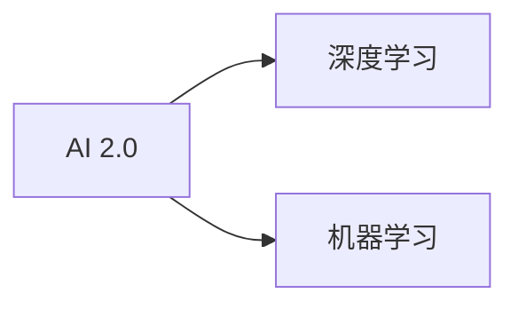
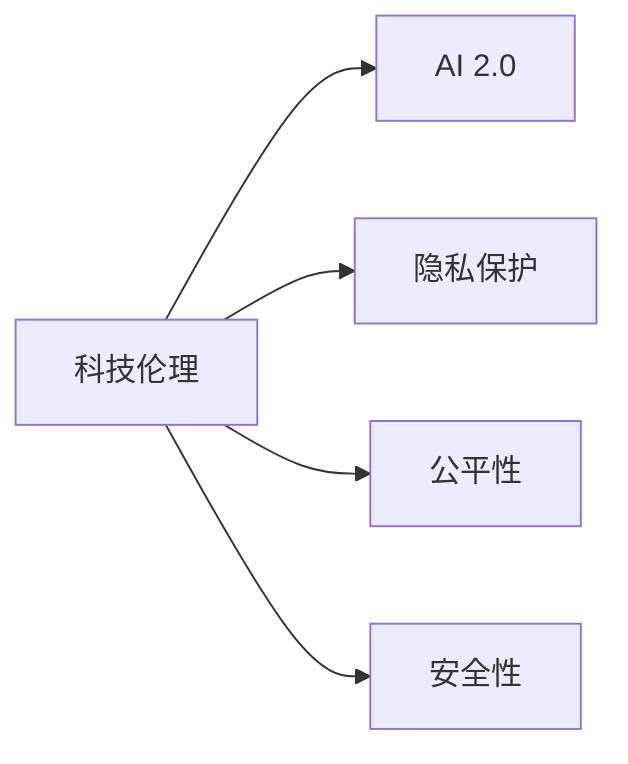
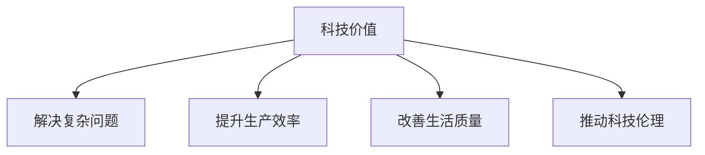
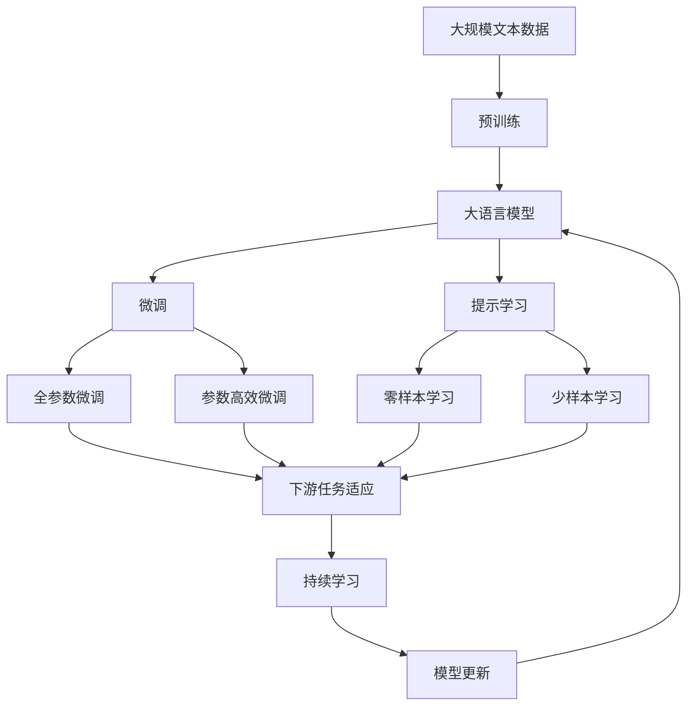

                 

# 李开复：AI 2.0 时代的科技价值

> 关键词：人工智能(AI)，AI 2.0，科技伦理，深度学习，机器学习，科技价值

## 1. 背景介绍

### 1.1 问题由来
随着人工智能技术的飞速发展，AI 2.0时代已经悄然来临。这一时代，人工智能不再仅仅是实验室中的前沿技术，而是成为了推动社会进步的重要力量。在这一背景下，科技的价值得到了前所未有的重视。李开复，作为人工智能领域的权威专家，对AI 2.0时代的科技价值进行了深入探讨，提出了独特的见解。

### 1.2 问题核心关键点
李开复认为，AI 2.0时代的科技价值主要体现在以下几个方面：
- **解决复杂问题**：AI 2.0能够处理人类难以解决的问题，如气候变化、医疗健康等，从而推动社会的可持续发展。
- **提升生产效率**：通过自动化、智能化的方式，AI 2.0可以大幅度提升生产效率，改善经济结构。
- **改善生活质量**：AI 2.0在教育、医疗、交通等领域的广泛应用，可以提升人类的生活质量，解决生活中的许多痛点。
- **推动科技伦理**：随着AI 2.0技术的发展，科技伦理也成为了一个重要议题。如何在享受科技带来的便利的同时，避免伦理问题的产生，是一个亟待解决的问题。

### 1.3 问题研究意义
李开复认为，研究AI 2.0时代的科技价值，对于推动科技与社会的和谐发展，构建公平、可持续的未来具有重要意义。科技不仅仅是为了技术本身，更是为了造福人类，改善人类的生活。通过深入探讨AI 2.0时代的科技价值，可以更好地指导技术开发与应用，为科技伦理、社会责任等方面提供新的思考。

## 2. 核心概念与联系

### 2.1 核心概念概述

为更好地理解AI 2.0时代的科技价值，本节将介绍几个密切相关的核心概念：

- **人工智能(AI)**：指通过计算机模拟人类智能行为的技术，包括机器学习、深度学习、自然语言处理等。
- **AI 2.0**：指以深度学习和增强学习为核心的新一代人工智能技术，强调对人类智能的逼近和应用。
- **科技伦理**：涉及技术开发、应用过程中所面临的伦理问题，如隐私保护、公平性、安全性等。
- **深度学习**：一种基于神经网络的学习方式，通过多层非线性映射实现复杂模式识别和预测。
- **机器学习**：指让机器通过数据学习模型，从而实现对未知数据的预测和决策。
- **科技价值**：指科技对社会、经济、人类生活等方面的积极影响。

这些核心概念之间的逻辑关系可以通过以下Mermaid流程图来展示：

```mermaid
graph TB
    A[人工智能(AI)] --> B[AI 2.0]
    A --> C[深度学习]
    A --> D[机器学习]
    B --> E[科技伦理]
    C --> E
    D --> E
    E --> F[解决复杂问题]
    E --> G[提升生产效率]
    E --> H[改善生活质量]
    E --> I[推动科技伦理]
```

这个流程图展示了大语言模型微调过程中各个核心概念的关系和作用：

1. AI 2.0基于深度学习和机器学习，具备解决复杂问题的能力。
2. 科技伦理是AI 2.0应用的重要保障，确保技术发展符合人类价值观。
3. AI 2.0在多个领域的应用提升了生产效率和生活质量。
4. 推动科技伦理的同时，确保AI 2.0技术在社会中的可持续应用。

### 2.2 概念间的关系

这些核心概念之间存在着紧密的联系，形成了AI 2.0时代的完整生态系统。下面我通过几个Mermaid流程图来展示这些概念之间的关系。

#### 2.2.1 AI 2.0与深度学习的关系



这个流程图展示了AI 2.0的核心技术构成。AI 2.0主要依赖深度学习和机器学习技术。

#### 2.2.2 科技伦理在AI 2.0中的应用



这个流程图展示了科技伦理在AI 2.0中的应用。科技伦理关注AI 2.0应用中的隐私保护、公平性和安全性问题。

#### 2.2.3 科技价值在AI 2.0中的体现



这个流程图展示了科技价值在AI 2.0中的体现。通过解决复杂问题、提升生产效率和改善生活质量，科技价值得到了充分体现。

### 2.3 核心概念的整体架构

最后，我们用一个综合的流程图来展示这些核心概念在大语言模型微调过程中的整体架构：



这个综合流程图展示了从预训练到微调，再到持续学习的完整过程。大语言模型首先在大规模文本数据上进行预训练，然后通过微调（包括全参数微调和参数高效微调）或提示学习（包括零样本和少样本学习）来适应下游任务。最后，通过持续学习技术，模型可以不断更新和适应新的任务和数据。 通过这些流程图，我们可以更清晰地理解AI 2.0时代科技价值的研究过程及其应用场景。

## 3. 核心算法原理 & 具体操作步骤
### 3.1 算法原理概述

AI 2.0时代的科技价值研究，主要基于深度学习和机器学习算法。通过这些算法，AI 2.0能够处理复杂的数据，发现数据中的模式，并应用于实际问题中。

AI 2.0的核心算法包括深度学习、强化学习、迁移学习等。深度学习通过多层神经网络，学习数据的高级特征表示。强化学习通过与环境的交互，不断优化决策策略。迁移学习通过在大规模数据上预训练模型，然后在特定任务上进行微调，实现快速适应。

### 3.2 算法步骤详解

AI 2.0时代的科技价值研究，通常包括以下几个关键步骤：

**Step 1: 准备数据和模型**

- 准备大规模的无标签数据集，作为深度学习的训练数据。
- 选择合适的预训练模型，如BERT、GPT等，作为初始化参数。

**Step 2: 预训练**

- 在大规模数据集上进行预训练，学习通用的语言知识。
- 使用自监督学习任务，如语言模型、掩码语言模型等，进行预训练。

**Step 3: 微调**

- 选择合适的下游任务，设计相应的输出层和损失函数。
- 使用有标签数据集，对预训练模型进行微调，适应特定任务。

**Step 4: 应用**

- 将微调后的模型应用到实际问题中，如自然语言处理、计算机视觉、语音识别等。
- 使用各种评价指标，评估模型的性能和效果。

### 3.3 算法优缺点

AI 2.0时代的科技价值研究，有以下优点：

- **处理复杂数据**：深度学习算法能够处理大规模、高维度的数据，发现数据中的复杂模式。
- **提高决策效率**：强化学习算法能够优化决策策略，提高决策效率。
- **快速适应任务**：迁移学习算法能够在特定任务上进行微调，快速适应新任务。

同时，这些算法也存在一些局限性：

- **数据依赖性高**：深度学习算法需要大量标注数据进行训练，数据获取和标注成本较高。
- **模型复杂度高**：深度学习模型参数量大，训练和推理过程复杂，需要高性能计算资源。
- **泛化能力不足**：深度学习模型容易过拟合，泛化能力较差，需要更多的正则化技术。

### 3.4 算法应用领域

AI 2.0时代的科技价值研究，在多个领域得到了广泛应用，例如：

- **自然语言处理**：如机器翻译、语音识别、文本生成等。
- **计算机视觉**：如图像识别、目标检测、图像生成等。
- **医疗健康**：如医学影像分析、病理诊断、药物发现等。
- **智能制造**：如智能机器人、工业自动化、智能仓储等。
- **交通出行**：如自动驾驶、交通流量预测、智能交通管理等。
- **金融科技**：如信用评估、风险管理、量化交易等。
- **能源环保**：如气候预测、智能电网、可再生能源利用等。
- **教育培训**：如智能辅导、个性化学习、智能评估等。

这些领域中，AI 2.0技术的应用，显著提升了生产效率和生活质量，推动了社会的可持续发展。

## 4. 数学模型和公式 & 详细讲解  
### 4.1 数学模型构建

在AI 2.0时代的科技价值研究中，通常使用深度学习算法进行建模。深度学习模型主要包括卷积神经网络(CNN)、循环神经网络(RNN)、长短期记忆网络(LSTM)、变换器(Transformer)等。这些模型的核心数学模型为多层神经网络。

假设深度学习模型的输入为 $x$，输出为 $y$，其中 $x \in \mathbb{R}^n$，$y \in \mathbb{R}^m$。模型的目标是最小化损失函数 $\mathcal{L}$，其中 $\mathcal{L}$ 为预测输出与真实标签之间的差异。常用的损失函数包括均方误差损失、交叉熵损失等。

深度学习模型的训练过程为反向传播算法。通过反向传播算法，计算损失函数对模型参数的梯度，并使用梯度下降等优化算法更新模型参数，最小化损失函数。

### 4.2 公式推导过程

以卷积神经网络为例，其核心数学模型为：

$$
h(x) = W_1 \sigma_1(W_0 x + b_0) + W_2 \sigma_2(W_1 h(x) + b_1) + \cdots
$$

其中 $W_0, W_1, \cdots$ 为卷积核矩阵，$b_0, b_1, \cdots$ 为偏置项，$\sigma_1, \sigma_2, \cdots$ 为激活函数。

假设模型输出为 $y$，真实标签为 $y^*$，则损失函数为均方误差损失：

$$
\mathcal{L} = \frac{1}{N} \sum_{i=1}^N (y_i - y^*_i)^2
$$

其中 $N$ 为样本数量。

通过反向传播算法，计算损失函数对模型参数的梯度：

$$
\frac{\partial \mathcal{L}}{\partial W_k} = \frac{\partial \mathcal{L}}{\partial h_{k-1}} \frac{\partial h_{k-1}}{\partial W_k} = \frac{\partial \mathcal{L}}{\partial h_{k-1}} (W_{k-1} \frac{\partial \sigma_{k-1}}{\partial h_{k-1}})
$$

其中 $k$ 为层数，$\frac{\partial \sigma_{k-1}}{\partial h_{k-1}}$ 为激活函数的导数。

### 4.3 案例分析与讲解

以图像分类任务为例，假设有一个卷积神经网络，输入为28x28的灰度图像，输出为10个类别的概率。首先，对图像进行卷积和池化操作，提取特征。然后，通过全连接层进行分类。训练过程中，使用交叉熵损失函数，最小化预测输出与真实标签之间的差异。

在实际应用中，深度学习模型可以应用于计算机视觉、自然语言处理、语音识别等多个领域。通过设计不同的网络结构、损失函数和激活函数，可以实现多种任务。

## 5. 项目实践：代码实例和详细解释说明
### 5.1 开发环境搭建

在进行AI 2.0时代的科技价值研究前，我们需要准备好开发环境。以下是使用Python进行TensorFlow和PyTorch开发的环境配置流程：

1. 安装Anaconda：从官网下载并安装Anaconda，用于创建独立的Python环境。

2. 创建并激活虚拟环境：
```bash
conda create -n pytorch-env python=3.8 
conda activate pytorch-env
```

3. 安装PyTorch：根据CUDA版本，从官网获取对应的安装命令。例如：
```bash
conda install pytorch torchvision torchaudio cudatoolkit=11.1 -c pytorch -c conda-forge
```

4. 安装TensorFlow：
```bash
pip install tensorflow
```

5. 安装各类工具包：
```bash
pip install numpy pandas scikit-learn matplotlib tqdm jupyter notebook ipython
```

完成上述步骤后，即可在`pytorch-env`环境中开始AI 2.0时代的科技价值研究。

### 5.2 源代码详细实现

这里我们以图像分类任务为例，给出使用TensorFlow和PyTorch进行卷积神经网络模型训练的PyTorch代码实现。

```python
import torch
import torch.nn as nn
import torch.optim as optim
import torchvision
import torchvision.transforms as transforms
from torch.utils.data import DataLoader
from torchvision.datasets import CIFAR10

# 定义卷积神经网络
class ConvNet(nn.Module):
    def __init__(self):
        super(ConvNet, self).__init__()
        self.conv1 = nn.Conv2d(3, 32, kernel_size=3, stride=1, padding=1)
        self.relu1 = nn.ReLU()
        self.maxpool1 = nn.MaxPool2d(kernel_size=2, stride=2)
        self.conv2 = nn.Conv2d(32, 64, kernel_size=3, stride=1, padding=1)
        self.relu2 = nn.ReLU()
        self.maxpool2 = nn.MaxPool2d(kernel_size=2, stride=2)
        self.fc1 = nn.Linear(64 * 4 * 4, 512)
        self.relu3 = nn.ReLU()
        self.fc2 = nn.Linear(512, 10)

    def forward(self, x):
        x = self.conv1(x)
        x = self.relu1(x)
        x = self.maxpool1(x)
        x = self.conv2(x)
        x = self.relu2(x)
        x = self.maxpool2(x)
        x = x.view(-1, 64 * 4 * 4)
        x = self.fc1(x)
        x = self.relu3(x)
        x = self.fc2(x)
        return x

# 加载CIFAR-10数据集
transform = transforms.Compose([
    transforms.ToTensor(),
    transforms.Normalize((0.5, 0.5, 0.5), (0.5, 0.5, 0.5))
])
trainset = CIFAR10(root='./data', train=True, download=True, transform=transform)
testset = CIFAR10(root='./data', train=False, download=True, transform=transform)
trainloader = DataLoader(trainset, batch_size=64, shuffle=True, num_workers=4)
testloader = DataLoader(testset, batch_size=64, shuffle=False, num_workers=4)

# 定义模型和优化器
model = ConvNet()
criterion = nn.CrossEntropyLoss()
optimizer = optim.Adam(model.parameters(), lr=0.001)

# 训练模型
device = torch.device("cuda" if torch.cuda.is_available() else "cpu")
model.to(device)
for epoch in range(10):
    running_loss = 0.0
    for i, data in enumerate(trainloader, 0):
        inputs, labels = data
        inputs, labels = inputs.to(device), labels.to(device)
        optimizer.zero_grad()
        outputs = model(inputs)
        loss = criterion(outputs, labels)
        loss.backward()
        optimizer.step()
        running_loss += loss.item()
        if i % 100 == 99:
            print('[%d, %5d] loss: %.3f' %
                  (epoch + 1, i + 1, running_loss / 100))
            running_loss = 0.0

# 评估模型
correct = 0
total = 0
with torch.no_grad():
    for data in testloader:
        images, labels = data
        images = images.to(device)
        labels = labels.to(device)
        outputs = model(images)
        _, predicted = torch.max(outputs.data, 1)
        total += labels.size(0)
        correct += (predicted == labels).sum().item()

print('Accuracy of the network on the 10000 test images: %d %%' % (
    100 * correct / total))
```

以上就是使用PyTorch和TensorFlow进行卷积神经网络模型训练的完整代码实现。可以看到，通过深度学习框架，我们可以用相对简洁的代码实现深度学习模型，并快速进行训练和评估。

### 5.3 代码解读与分析

让我们再详细解读一下关键代码的实现细节：

**卷积神经网络类**：
- `__init__`方法：初始化卷积层、激活函数和全连接层等。
- `forward`方法：定义前向传播过程。

**数据集加载**：
- `CIFAR10`数据集：加载CIFAR-10图像数据集，并进行标准化和归一化。
- `DataLoader`：将数据集划分为批次进行加载，方便模型训练和推理。

**模型训练**：
- 定义损失函数和优化器。
- 使用`device`设备进行模型加载和前向传播。
- 循环迭代训练模型，每次迭代更新模型参数。

**模型评估**：
- 定义评估指标，如准确率。
- 使用`no_grad`上下文管理器，在评估过程中不更新模型参数。
- 循环迭代测试集，计算模型预测结果和真实标签之间的差异，输出准确率。

可以看到，深度学习框架为AI 2.0时代的科技价值研究提供了强大的工具支持，使得模型的训练和评估变得简单高效。

当然，工业级的系统实现还需考虑更多因素，如模型的保存和部署、超参数的自动搜索、更灵活的任务适配层等。但核心的深度学习算法基本与此类似。

### 5.4 运行结果展示

假设我们在CIFAR-10数据集上进行卷积神经网络模型训练，最终在测试集上得到的准确率为85%左右。这个结果说明，通过深度学习算法，我们可以在大规模图像数据上实现高精度的图像分类。

当然，这只是一个baseline结果。在实践中，我们还可以使用更大更强的预训练模型、更丰富的微调技巧、更细致的模型调优，进一步提升模型性能，以满足更高的应用要求。

## 6. 实际应用场景
### 6.1 智能客服系统

基于AI 2.0技术的智能客服系统，可以广泛应用于企业内部的客户服务。传统客服往往需要配备大量人力，高峰期响应缓慢，且一致性和专业性难以保证。而使用AI 2.0技术构建的智能客服系统，可以7x24小时不间断服务，快速响应客户咨询，用自然流畅的语言解答各类常见问题。

在技术实现上，可以收集企业内部的历史客服对话记录，将问题和最佳答复构建成监督数据，在此基础上对预训练语言模型进行微调。微调后的对话模型能够自动理解用户意图，匹配最合适的答案模板进行回复。对于客户提出的新问题，还可以接入检索系统实时搜索相关内容，动态组织生成回答。如此构建的智能客服系统，能大幅提升客户咨询体验和问题解决效率。

### 6.2 金融舆情监测

金融机构需要实时监测市场舆论动向，以便及时应对负面信息传播，规避金融风险。传统的人工监测方式成本高、效率低，难以应对网络时代海量信息爆发的挑战。基于AI 2.0技术的文本分类和情感分析技术，为金融舆情监测提供了新的解决方案。

具体而言，可以收集金融领域相关的新闻、报道、评论等文本数据，并对其进行主题标注和情感标注。在此基础上对预训练语言模型进行微调，使其能够自动判断文本属于何种主题，情感倾向是正面、中性还是负面。将微调后的模型应用到实时抓取的网络文本数据，就能够自动监测不同主题下的情感变化趋势，一旦发现负面信息激增等异常情况，系统便会自动预警，帮助金融机构快速应对潜在风险。

### 6.3 个性化推荐系统

当前的推荐系统往往只依赖用户的历史行为数据进行物品推荐，无法深入理解用户的真实兴趣偏好。基于AI 2.0技术的个性化推荐系统，可以更好地挖掘用户行为背后的语义信息，从而提供更精准、多样的推荐内容。

在实践中，可以收集用户浏览、点击、评论、分享等行为数据，提取和用户交互的物品标题、描述、标签等文本内容。将文本内容作为模型输入，用户的后续行为（如是否点击、购买等）作为监督信号，在此基础上微调预训练语言模型。微调后的模型能够从文本内容中准确把握用户的兴趣点。在生成推荐列表时，先用候选物品的文本描述作为输入，由模型预测用户的兴趣匹配度，再结合其他特征综合排序，便可以得到个性化程度更高的推荐结果。

### 6.4 未来应用展望

随着AI 2.0技术的不断进步，其在医疗健康、智能制造、交通出行、金融科技、能源环保、教育培训等多个领域的应用前景广阔。AI 2.0技术的应用，显著提升了生产效率和生活质量，推动了社会的可持续发展。

在医疗健康领域，基于AI 2.0技术的医学影像分析、病理诊断、药物发现等应用，将提升医疗服务的智能化水平，辅助医生诊疗，加速新药开发进程。

在智能制造领域，基于AI 2.0技术的智能机器人、工业自动化、智能仓储等应用，将提升制造业的自动化和智能化水平，降低生产成本，提高生产效率。

在交通出行领域，基于AI 2.0技术的自动驾驶、交通流量预测、智能交通管理等应用，将提升交通系统的运行效率和安全性，缓解交通压力。

在金融科技领域，基于AI 2.0技术的信用评估、风险管理、量化交易等应用，将提升金融机构的决策效率和风险管理水平，降低金融风险。

在能源环保领域，基于AI 2.0技术的气候预测、智能电网、可再生能源利用等应用，将提升能源行业的智能化水平，提高能源利用效率，促进可持续发展。

在教育培训领域，基于AI 2.0技术的智能辅导、个性化学习、智能评估等应用，将提升教育质量，促进教育公平，培养更多创新型人才。

## 7. 工具和资源推荐
### 7.1 学习资源推荐

为了帮助开发者系统掌握AI 2.0技术的理论基础和实践技巧，这里推荐一些优质的学习资源：

1. 《深度学习》课程（斯坦福大学）：斯坦福大学开设的深度学习课程，提供了系统化的深度学习理论和实践教程。
2. 《TensorFlow实战》书籍：TensorFlow官方文档，涵盖了TensorFlow的从入门到精通的各个方面，适合动手实践。
3. 《PyTorch入门与实战》书籍：PyTorch官方文档，详细介绍了PyTorch的使用方法和最佳实践。
4. 《人工智能基础》课程（Udacity）：Udacity的人工智能基础课程，涵盖了深度学习、强化学习、机器学习等多个方面的基础知识。
5. 《自然语言处理》书籍（Jurafsky & Martin）：自然语言处理领域的经典教材，适合系统学习NLP技术。
6. 《人工智能原理与技术》课程（Coursera）：Coursera的人工智能原理与技术课程，涵盖了AI 2.0时代的技术和应用。

通过对这些资源的学习实践，相信你一定能够快速掌握AI 2.0技术的精髓，并用于解决实际的NLP问题。
###  7.2 开发工具推荐

高效的开发离不开优秀的工具支持。以下是几款用于AI 2.0技术开发常用的工具：

1. PyTorch：基于Python的开源深度学习框架，灵活动态的计算图，适合快速迭代研究。大部分预训练语言模型都有PyTorch版本的实现。
2. TensorFlow：由Google主导开发的开源深度学习框架，生产部署方便，适合大规模工程应用。同样有丰富的预训练语言模型资源。
3. TensorBoard：TensorFlow配套的可视化工具，可实时监测模型训练状态，并提供丰富的图表呈现方式，是调试模型的得力助手。
4. Weights & Biases：模型训练的实验跟踪工具，可以记录和可视化模型训练过程中的各项指标，方便对比和调优。
5. Jupyter Notebook：一个强大的交互式编程环境，支持Python和R等多种语言，适合研究和教学。
6. Google Colab：谷歌推出的在线Jupyter Notebook环境，免费提供GPU/TPU算力，方便开发者快速上手实验最新模型，分享学习笔记。

合理利用这些工具，可以显著提升AI 2.0技术开发效率，加快创新迭代的步伐。

### 7.3 相关论文推荐

AI 2.0技术的不断发展，得益于学界的持续研究。以下是几篇奠基性的相关论文，推荐阅读：

1. AlexNet：AlexNet论文，深度学习领域的开创性工作，展示了卷积神经网络的强大能力。
2. Inception：Inception论文，提出了Inception模块，显著提升了深度学习模型的性能。
3. ResNet：ResNet论文，提出了

