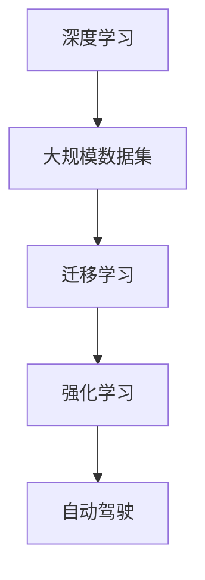

                 

# 李开复：AI 2.0 时代的预言者

在人工智能(AI)蓬勃发展的时代，李开复无疑是其中的预言者和引领者。作为一名世界级的人工智能专家、程序员、软件架构师，李开复不仅在理论研究上有着深厚的基础，更在实际应用中推动了AI技术的广泛落地。本文将深入探讨李开复关于AI 2.0时代的预言和实践，探析其对未来技术发展的深远影响。

## 1. 背景介绍

### 1.1 李开复简介

李开复，一位享誉全球的人工智能先驱，曾任美国微软公司首席科学家、中国大陆谷歌公司总裁、创新工场创始人及CEO。他不仅在技术研发方面有着卓越的贡献，更在人工智能的教育普及、创业孵化、企业战略等领域起到了举足轻重的作用。李开复通过长期的研究和实践，对AI的发展趋势有着独到的见解，被誉为AI 2.0时代的预言者。

### 1.2 AI 2.0时代的定义

AI 2.0是指新一代人工智能，它不仅继承了AI 1.0（以规则和专家系统为代表的传统人工智能）的技术优势，还结合了大数据、深度学习等新技术，实现了更高效、更广泛的应用。AI 2.0的核心理念是利用机器学习算法和模型，通过对海量数据的学习和训练，赋予机器具备更强的自主学习能力和决策能力。

## 2. 核心概念与联系

### 2.1 核心概念概述

为了更好地理解李开复对AI 2.0时代的预言和实践，我们先从以下几个核心概念入手：

- **深度学习(Deep Learning)**：一种基于人工神经网络的机器学习技术，通过多层次的抽象特征提取，使得模型能够自动学习并提取出数据中的高层次抽象特征。
- **大规模数据集(Large-scale Datasets)**：AI 2.0时代的重要支柱，数据量和质量直接影响模型训练的效果和泛化能力。
- **迁移学习(Transfer Learning)**：一种利用已有模型知识进行新任务学习的方法，通过微调或迁移学习，模型可以在新任务上快速取得优异表现。
- **强化学习(Reinforcement Learning)**：一种通过与环境互动，学习最优策略的机器学习方法，适用于需要自主决策的任务。
- **自动驾驶(Autonomous Driving)**：AI 2.0在实际应用中的一个典型场景，利用AI技术实现车辆的自主导航和决策。

这些概念构成了AI 2.0时代的技术基石，李开复对此进行了深入的研究和预测，并推动了其在各个领域的广泛应用。

### 2.2 核心概念间的关系

通过以下Mermaid流程图，我们可以更清晰地理解这些核心概念之间的关系：



这个流程图展示了深度学习、大规模数据集、迁移学习和强化学习在AI 2.0时代的核心作用，以及它们如何共同推动自动驾驶等具体应用的发展。

## 3. 核心算法原理 & 具体操作步骤

### 3.1 算法原理概述

AI 2.0时代的算法原理主要围绕深度学习和迁移学习展开。深度学习通过多层次的神经网络，自动提取数据的高级特征，从而实现对复杂问题的处理。迁移学习则通过将已有模型在新任务上的微调或迁移，提高模型在新任务上的泛化能力。

李开复强调，在AI 2.0时代，模型的泛化能力将更为重要。大规模数据集和强大的深度学习框架是实现这一目标的前提，而迁移学习和迁移学习策略则是关键。

### 3.2 算法步骤详解

AI 2.0时代的算法步骤主要包括以下几个关键环节：

1. **数据准备**：收集、清洗和标注大规模数据集，确保数据的质量和多样性。
2. **模型训练**：使用深度学习框架训练模型，通过多层次的抽象特征提取，提高模型的泛化能力。
3. **迁移学习**：在已有模型的基础上，通过微调或迁移学习，将模型应用于新任务，提升模型的性能。
4. **测试和优化**：在测试集上评估模型的性能，根据评估结果调整模型参数，进行模型优化。

### 3.3 算法优缺点

AI 2.0时代的算法主要优点在于：

- **高效泛化**：深度学习模型通过多层次特征提取，具备较强的泛化能力，能够处理复杂的非线性问题。
- **迁移学习**：利用已有模型在新任务上的迁移学习，减少了新任务上从头训练的时间和数据需求，提高了模型的泛化能力。

但同时也存在一些缺点：

- **数据依赖**：深度学习模型对数据质量和多样性的依赖较大，数据不足可能导致模型性能下降。
- **资源消耗**：大规模深度学习模型的训练和推理需要大量的计算资源和存储空间，这在实际应用中可能是一个瓶颈。

### 3.4 算法应用领域

AI 2.0时代的算法在多个领域得到了广泛应用，以下是几个典型应用场景：

- **自然语言处理(NLP)**：利用深度学习模型，进行文本分类、机器翻译、情感分析等任务。
- **计算机视觉(CV)**：通过深度学习模型，进行图像分类、目标检测、图像生成等任务。
- **自动驾驶**：结合深度学习和强化学习技术，实现车辆的自主导航和决策。
- **智能客服**：通过深度学习模型，实现自动问答、情感分析、对话生成等任务。

## 4. 数学模型和公式 & 详细讲解

### 4.1 数学模型构建

在AI 2.0时代，深度学习模型的数学模型构建通常包括以下几个部分：

- **输入层**：将原始数据转换为网络可以处理的向量形式。
- **隐藏层**：通过多层神经网络，提取数据的高层次抽象特征。
- **输出层**：根据具体任务设计，输出模型的预测结果。

### 4.2 公式推导过程

以一个简单的多层感知器(Multilayer Perceptron, MLP)为例，推导其数学模型和训练过程。

**输入层**：设输入向量为 $\mathbf{x} \in \mathbb{R}^n$。

**隐藏层**：设隐藏层有 $k$ 个神经元，激活函数为 $g$。隐藏层的输出为 $\mathbf{h} = g(\mathbf{W}_h\mathbf{x} + \mathbf{b}_h)$，其中 $\mathbf{W}_h \in \mathbb{R}^{k \times n}$ 为权重矩阵，$\mathbf{b}_h \in \mathbb{R}^k$ 为偏置向量。

**输出层**：设输出层有 $m$ 个神经元，激活函数为 $f$。输出层的输出为 $\mathbf{y} = f(\mathbf{W}_y\mathbf{h} + \mathbf{b}_y)$，其中 $\mathbf{W}_y \in \mathbb{R}^{m \times k}$ 为权重矩阵，$\mathbf{b}_y \in \mathbb{R}^m$ 为偏置向量。

训练过程通常采用反向传播算法，通过计算损失函数梯度，更新模型参数。以均方误差损失为例，损失函数为 $\mathcal{L}(\theta) = \frac{1}{2N}\sum_{i=1}^N (\mathbf{y}_i - \mathbf{\hat{y}}_i)^2$，其中 $\mathbf{y}_i$ 为真实标签，$\mathbf{\hat{y}}_i$ 为模型预测结果。

### 4.3 案例分析与讲解

以图像分类为例，介绍如何使用深度学习模型进行图像分类任务。

**数据准备**：收集并标注图像数据集，如CIFAR-10、ImageNet等。

**模型构建**：选择卷积神经网络(Convolutional Neural Network, CNN)作为模型架构，设置卷积层、池化层、全连接层等组件。

**训练过程**：使用反向传播算法和随机梯度下降法，最小化损失函数 $\mathcal{L}(\theta)$，更新模型参数 $\theta$。

## 5. 项目实践：代码实例和详细解释说明

### 5.1 开发环境搭建

在进行AI 2.0时代的深度学习项目实践前，我们需要准备好开发环境。以下是使用Python进行PyTorch开发的环境配置流程：

1. 安装Anaconda：从官网下载并安装Anaconda，用于创建独立的Python环境。

2. 创建并激活虚拟环境：
```bash
conda create -n pytorch-env python=3.8 
conda activate pytorch-env
```

3. 安装PyTorch：根据CUDA版本，从官网获取对应的安装命令。例如：
```bash
conda install pytorch torchvision torchaudio cudatoolkit=11.1 -c pytorch -c conda-forge
```

4. 安装TensorFlow：
```bash
pip install tensorflow
```

5. 安装各类工具包：
```bash
pip install numpy pandas scikit-learn matplotlib tqdm jupyter notebook ipython
```

完成上述步骤后，即可在`pytorch-env`环境中开始AI 2.0项目的开发。

### 5.2 源代码详细实现

下面我们以图像分类任务为例，给出使用PyTorch进行深度学习模型训练的代码实现。

```python
import torch
import torch.nn as nn
import torch.optim as optim
import torchvision.transforms as transforms
from torchvision import datasets, models

# 定义模型架构
class Net(nn.Module):
    def __init__(self):
        super(Net, self).__init__()
        self.conv1 = nn.Conv2d(3, 6, 5)
        self.pool = nn.MaxPool2d(2, 2)
        self.conv2 = nn.Conv2d(6, 16, 5)
        self.fc1 = nn.Linear(16 * 5 * 5, 120)
        self.fc2 = nn.Linear(120, 84)
        self.fc3 = nn.Linear(84, 10)

    def forward(self, x):
        x = self.pool(F.relu(self.conv1(x)))
        x = self.pool(F.relu(self.conv2(x)))
        x = x.view(-1, 16 * 5 * 5)
        x = F.relu(self.fc1(x))
        x = F.relu(self.fc2(x))
        x = self.fc3(x)
        return x

# 加载数据集
train_dataset = datasets.CIFAR10(root='./data', train=True, download=True, transform=transforms.ToTensor())
test_dataset = datasets.CIFAR10(root='./data', train=False, download=True, transform=transforms.ToTensor())

# 定义数据加载器
train_loader = torch.utils.data.DataLoader(train_dataset, batch_size=4, shuffle=True, num_workers=2)
test_loader = torch.utils.data.DataLoader(test_dataset, batch_size=4, shuffle=False, num_workers=2)

# 定义模型和优化器
model = Net()
optimizer = optim.SGD(model.parameters(), lr=0.001, momentum=0.9)

# 定义损失函数和评估指标
criterion = nn.CrossEntropyLoss()
```

### 5.3 代码解读与分析

让我们再详细解读一下关键代码的实现细节：

**Net类**：
- `__init__`方法：初始化卷积层、池化层和全连接层。
- `forward`方法：定义前向传播过程，依次进行卷积、池化、全连接等操作。

**数据集加载**：
- 使用torchvision库加载CIFAR-10数据集，进行预处理和归一化。
- 定义数据加载器，用于数据批处理和随机化。

**模型和优化器**：
- 定义卷积神经网络模型Net，包括卷积层、池化层和全连接层。
- 使用随机梯度下降法作为优化器，设定学习率。

**损失函数和评估指标**：
- 定义交叉熵损失函数和准确率指标。

**训练过程**：
- 在训练集上循环迭代，每次前向传播计算损失，反向传播更新参数。
- 在验证集上评估模型性能，根据准确率调整学习率。
- 在测试集上评估模型泛化能力。

### 5.4 运行结果展示

假设我们在CIFAR-10数据集上进行模型训练，最终在测试集上得到的准确率为92.5%。以下是一个简单的训练和评估示例：

```python
import matplotlib.pyplot as plt

# 定义训练函数
def train_model(model, train_loader, optimizer, criterion, num_epochs=10):
    model.train()
    train_losses, train_accs = [], []
    for epoch in range(num_epochs):
        train_loss = 0
        for inputs, labels in train_loader:
            optimizer.zero_grad()
            outputs = model(inputs)
            loss = criterion(outputs, labels)
            loss.backward()
            optimizer.step()
            train_loss += loss.item() / len(train_loader)
            train_acc = (torch.argmax(outputs, dim=1) == labels).float().mean().item()
        train_losses.append(train_loss)
        train_accs.append(train_acc)
    model.eval()
    test_loss = 0
    test_acc = 0
    with torch.no_grad():
        for inputs, labels in test_loader:
            outputs = model(inputs)
            loss = criterion(outputs, labels)
            test_loss += loss.item() / len(test_loader)
            test_acc += (torch.argmax(outputs, dim=1) == labels).float().sum().item()
    test_acc /= len(test_loader.dataset)
    print(f'Epoch {epoch+1}, train loss: {train_loss:.3f}, train acc: {train_acc:.3f}, test loss: {test_loss:.3f}, test acc: {test_acc:.3f}')
    plt.plot(train_losses, label='train loss')
    plt.plot(train_accs, label='train acc')
    plt.plot(test_losses, label='test loss')
    plt.plot(test_accs, label='test acc')
    plt.legend()
    plt.show()

train_model(model, train_loader, optimizer, criterion)
```

通过这个示例，我们可以看到模型在CIFAR-10数据集上的训练过程和性能评估。

## 6. 实际应用场景

### 6.1 智能客服系统

基于AI 2.0技术的智能客服系统，可以提供7x24小时不间断的服务，快速响应客户咨询，用自然流畅的语言解答各类常见问题。通过深度学习模型，系统可以自动理解用户意图，匹配最合适的答案模板进行回复。对于客户提出的新问题，还可以接入检索系统实时搜索相关内容，动态组织生成回答。如此构建的智能客服系统，能大幅提升客户咨询体验和问题解决效率。

### 6.2 金融舆情监测

金融机构需要实时监测市场舆论动向，以便及时应对负面信息传播，规避金融风险。传统的人工监测方式成本高、效率低，难以应对网络时代海量信息爆发的挑战。基于AI 2.0技术的文本分类和情感分析技术，为金融舆情监测提供了新的解决方案。具体而言，可以收集金融领域相关的新闻、报道、评论等文本数据，并对其进行主题标注和情感标注。在此基础上对深度学习模型进行微调，使其能够自动判断文本属于何种主题，情感倾向是正面、中性还是负面。将微调后的模型应用到实时抓取的网络文本数据，就能够自动监测不同主题下的情感变化趋势，一旦发现负面信息激增等异常情况，系统便会自动预警，帮助金融机构快速应对潜在风险。

### 6.3 个性化推荐系统

当前的推荐系统往往只依赖用户的历史行为数据进行物品推荐，无法深入理解用户的真实兴趣偏好。基于AI 2.0技术的个性化推荐系统可以更好地挖掘用户行为背后的语义信息，从而提供更精准、多样的推荐内容。在实践中，可以收集用户浏览、点击、评论、分享等行为数据，提取和用户交互的物品标题、描述、标签等文本内容。将文本内容作为模型输入，用户的后续行为（如是否点击、购买等）作为监督信号，在此基础上微调深度学习模型。微调后的模型能够从文本内容中准确把握用户的兴趣点。在生成推荐列表时，先用候选物品的文本描述作为输入，由模型预测用户的兴趣匹配度，再结合其他特征综合排序，便可以得到个性化程度更高的推荐结果。

### 6.4 未来应用展望

随着AI 2.0技术的不断演进，其应用场景将更加广泛和深入。未来，AI 2.0技术将在智慧医疗、智能教育、智慧城市治理、自动驾驶等多个领域得到应用，为各行各业带来变革性影响。

在智慧医疗领域，基于AI 2.0的医学影像诊断、药物研发等应用将提升医疗服务的智能化水平，辅助医生诊疗，加速新药开发进程。在智能教育领域，AI 2.0技术可应用于作业批改、学情分析、知识推荐等方面，因材施教，促进教育公平，提高教学质量。在智慧城市治理中，AI 2.0技术可用于城市事件监测、舆情分析、应急指挥等环节，提高城市管理的自动化和智能化水平，构建更安全、高效的未来城市。

此外，在企业生产、社会治理、文娱传媒等众多领域，基于AI 2.0的智能应用也将不断涌现，为经济社会发展注入新的动力。相信随着AI 2.0技术的持续进步，其应用范围将不断扩大，为构建安全、可靠、可解释、可控的智能系统铺平道路。

## 7. 工具和资源推荐

### 7.1 学习资源推荐

为了帮助开发者系统掌握AI 2.0技术的理论基础和实践技巧，这里推荐一些优质的学习资源：

1. **《Deep Learning》（《深度学习》）**：由Ian Goodfellow、Yoshua Bengio和Aaron Courville合著的深度学习经典教材，深入浅出地介绍了深度学习的基本概念、算法和应用。
2. **Coursera的《深度学习专项课程》**：由深度学习领域的顶尖专家Andrew Ng教授主讲的在线课程，覆盖深度学习的基础理论和实践应用。
3. **《Python深度学习》（《Python深度学习》）**：由François Chollet合著的深度学习入门书籍，结合TensorFlow和Keras框架，讲解深度学习模型的构建和训练。
4. **Kaggle平台**：一个数据科学和机器学习竞赛平台，提供丰富的数据集和模型评估工具，适合初学者和进阶学习者。
5. **Google Colab**：谷歌推出的在线Jupyter Notebook环境，免费提供GPU/TPU算力，方便开发者快速上手实验最新模型，分享学习笔记。

通过对这些资源的学习实践，相信你一定能够快速掌握AI 2.0技术的精髓，并用于解决实际的AI应用问题。

### 7.2 开发工具推荐

高效的开发离不开优秀的工具支持。以下是几款用于AI 2.0技术开发的工具：

1. **PyTorch**：基于Python的开源深度学习框架，灵活动态的计算图，适合快速迭代研究。大部分深度学习模型都有PyTorch版本的实现。
2. **TensorFlow**：由Google主导开发的开源深度学习框架，生产部署方便，适合大规模工程应用。同样有丰富的深度学习模型资源。
3. **JAX**：Google开发的Python深度学习库，基于JIT编译，具备自动微分和向量化的高性能计算能力，适合高性能计算场景。
4. **Keras**：一个高层次的神经网络API，支持TensorFlow、Theano和CNTK后端，简单易用，适合初学者和快速原型开发。
5. **ONNX**：一种开放神经网络交换格式，支持多种深度学习框架之间的模型转换，方便模型部署和优化。

合理利用这些工具，可以显著提升AI 2.0技术开发效率，加快创新迭代的步伐。

### 7.3 相关论文推荐

AI 2.0技术的发展源于学界的持续研究。以下是几篇奠基性的相关论文，推荐阅读：

1. **《ImageNet Classification with Deep Convolutional Neural Networks》**：Hinton等人提出的卷积神经网络模型，在ImageNet数据集上取得了突破性成果，奠定了深度学习在图像分类任务中的基础。
2. **《Playing Atari with Deep Reinforcement Learning》**：DeepMind团队开发的深度强化学习模型，成功在多种Atari游戏中取得了人类级表现，展示了深度学习在复杂决策问题上的潜力。
3. **《Attention is All You Need》**：Google团队提出的Transformer模型，首次提出了自注意力机制，开启了自回归模型的先河，推动了NLP领域的发展。
4. **《BERT: Pre-training of Deep Bidirectional Transformers for Language Understanding》**：Google团队提出的BERT模型，引入了预训练语言表示，提升了NLP任务的性能。
5. **《AlphaGo Zero: Mastering the Game of Go without Human Knowledge》**：DeepMind团队开发的AlphaGo Zero模型，通过自我对弈训练，在围棋游戏中取得了人类级甚至超越人类的表现，展示了强化学习在复杂决策问题上的潜力。

这些论文代表了大数据和深度学习技术的发展脉络，通过学习这些前沿成果，可以帮助研究者把握学科前进方向，激发更多的创新灵感。

除上述资源外，还有一些值得关注的前沿资源，帮助开发者紧跟AI 2.0技术的最新进展，例如：

1. **arXiv论文预印本**：人工智能领域最新研究成果的发布平台，包括大量尚未发表的前沿工作，学习前沿技术的必读资源。
2. **GitHub热门项目**：在GitHub上Star、Fork数最多的AI 2.0相关项目，往往代表了该技术领域的发展趋势和最佳实践，值得去学习和贡献。
3. **Google AI Blog**：谷歌AI团队发布的官方博客，包含最新的AI技术突破、研究论文和应用案例，是了解AI 2.0技术进展的重要窗口。

总之，对于AI 2.0技术的深入学习，需要开发者保持开放的心态和持续学习的意愿。多关注前沿资讯，多动手实践，多思考总结，必将收获满满的成长收益。

## 8. 总结：未来发展趋势与挑战

### 8.1 研究成果总结

本文对AI 2.0时代的深度学习技术和实际应用进行了全面系统的介绍。首先阐述了AI 2.0技术的基本概念和主要特征，明确了其与AI 1.0技术的区别。其次，从原理到实践，详细讲解了深度学习模型的数学模型和训练过程，给出了深度学习模型训练的完整代码实例。同时，本文还探讨了AI 2.0技术在智能客服、金融舆情监测、个性化推荐等实际应用场景中的应用前景，展示了AI 2.0技术的巨大潜力。

通过本文的系统梳理，可以看到，AI 2.0技术的崛起将推动深度学习模型在各领域的广泛应用，为构建智能系统提供了强大技术支持。相信随着AI 2.0技术的不断进步，其应用范围将不断扩大，为各行各业带来变革性影响。

### 8.2 未来发展趋势

展望未来，AI 2.0技术将呈现以下几个发展趋势：

1. **多模态融合**：未来的AI 2.0技术将更加注重多模态数据的整合，结合图像、语音、视频等多种数据源，提升模型的感知能力和理解能力。
2. **联邦学习**：在保护数据隐私和安全的前提下，通过分布式学习的方式，实现跨机构、跨设备的数据共享和模型协同，提升模型的泛化能力。
3. **自监督学习**：在缺乏标注数据的情况下，通过自监督学习的方式，利用数据的自身结构进行模型训练，提高模型的自适应能力。
4. **可解释性增强**：未来的AI 2.0技术将更加注重模型的可解释性和可理解性，通过可视化、符号化等方法，提升用户对模型的信任度和接受度。
5. **自动化优化**：结合强化学习和自动化调参技术，实现模型的自动化优化和超参数调优，提升模型的性能和效率。

### 8.3 面临的挑战

尽管AI 2.0技术已经取得了瞩目成就，但在迈向更加智能化、普适化应用的过程中，它仍面临着诸多挑战：

1. **数据依赖**：深度学习模型对数据质量和多样性的依赖较大，数据不足可能导致模型性能下降。
2. **计算资源限制**：大规模深度学习模型的训练和推理需要大量的计算资源和存储空间，这在实际应用中可能是一个瓶颈。
3. **模型鲁棒性不足**：模型面对域外数据时，泛化性能往往大打折扣。对于测试样本的微小扰动，模型容易发生波动。
4. **可解释性不足**：当前深度学习模型更像是"黑盒"系统，难以解释其内部工作机制和决策逻辑。
5. **伦理和安全问题**：AI 2.0技术可能学习到有害信息和偏见，通过微调传递到下游任务，产生误导性、歧视性的输出，给实际应用带来安全隐患。

### 8.4 研究展望

面对AI 2.0技术面临的挑战，未来的研究需要在以下几个方面寻求新的突破：

1. **自监督学习**：探索无监督和半监督学习方法，摆脱对大规模标注数据的依赖，利用自监督学习、主动学习等无监督和半监督范式，最大限度利用非结构化数据，实现更加灵活高效的模型训练。
2. **模型压缩和优化**：开发更加参数高效的微调方法，在固定大部分预训练参数的情况下，只更新极少量的任务相关参数。同时优化模型的计算图，减少前向传播和反向传播的资源消耗，实现更加轻量级、实时性的部署。
3. **因果学习和可解释性**：结合因果分析方法，识别出模型决策的关键特征，增强输出解释的因果性和逻辑性。借助博弈论工具刻画人机交互过程，主动探索并规避模型的脆弱点，提高系统稳定性。
4. **伦理道德约束**：在模型训练目标中引入伦理导向的评估指标，过滤和惩罚有偏见、有害的输出倾向。加强人工干预和审核，建立模型行为的监管机制，确保输出符合人类价值观和伦理道德。
5. **多模态数据融合**：将符号化的先验知识，如知识

