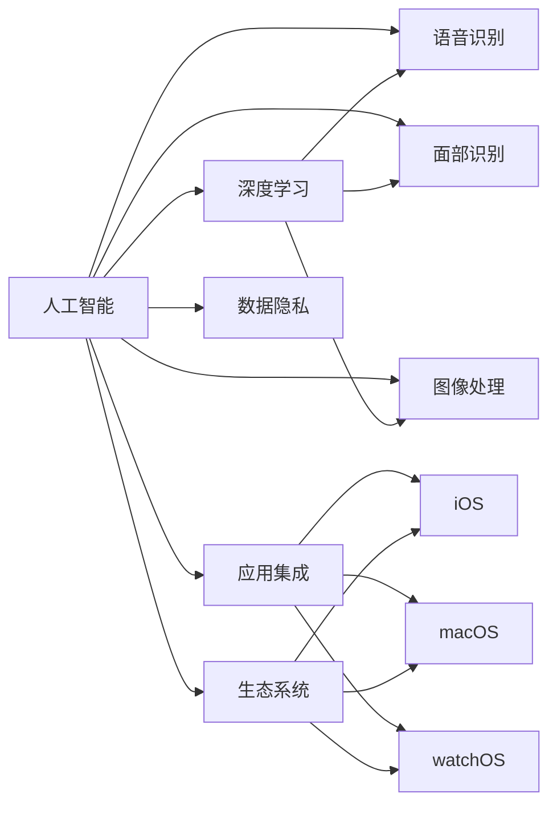
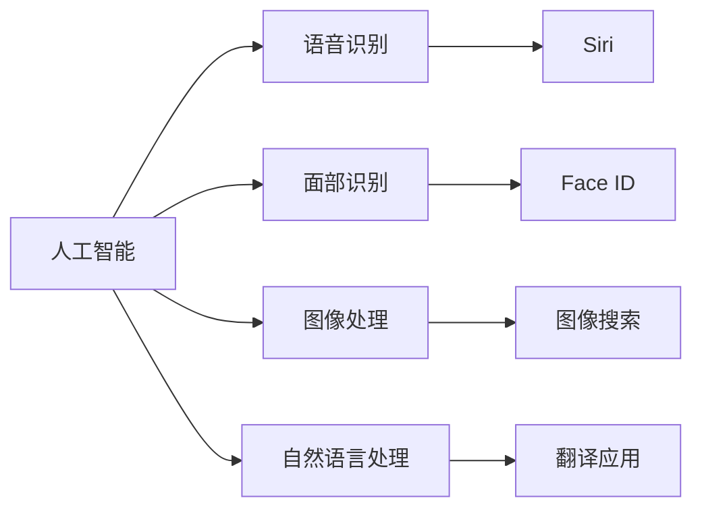
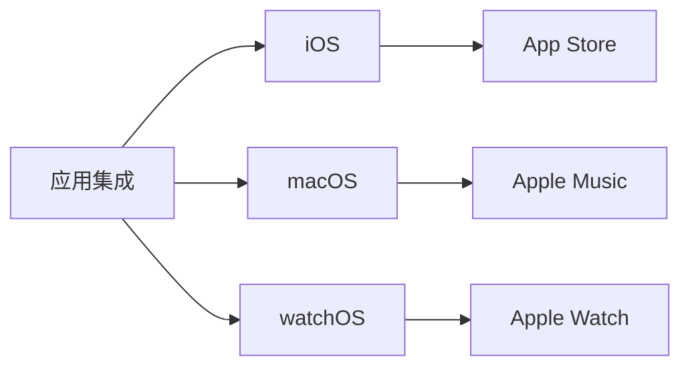
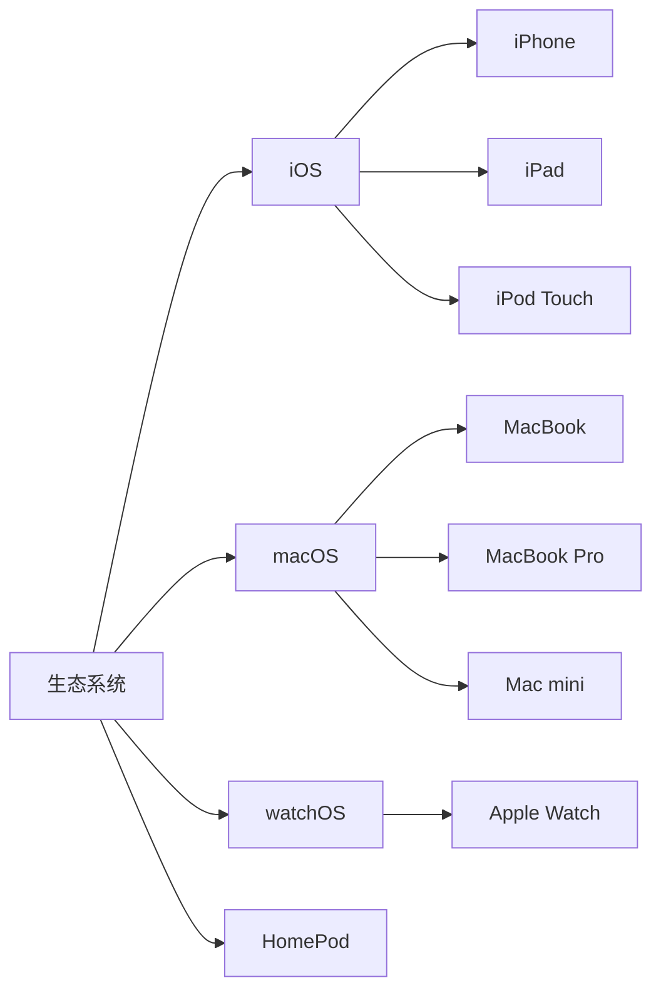

                 

# 李开复：苹果发布AI应用的市场

## 1. 背景介绍

### 1.1 问题由来

随着人工智能（AI）技术的迅猛发展，各大科技巨头纷纷在AI领域展开激烈竞争。其中，苹果公司（Apple）也在积极布局AI技术，并推出了多款AI应用，如Siri、Face ID等。这些应用不仅提升了用户体验，也展示了苹果在AI领域的强大实力。那么，苹果的AI应用市场表现如何？本文将从多个角度，深入探讨苹果AI应用的市场前景及影响。

### 1.2 问题核心关键点

苹果在AI应用市场表现突出，其成功之处主要体现在以下几个方面：

1. **技术创新**：苹果不断投入研发，推出了多项前沿AI技术，如语音识别、面部识别、图像处理等。这些技术的不断突破，为苹果的AI应用奠定了坚实的技术基础。
2. **用户体验**：苹果的AI应用，如Siri、Face ID，已经深度融入用户日常生活，极大地提升了用户的使用体验。
3. **跨平台集成**：苹果的AI应用在iOS、macOS、watchOS等多个平台上均有应用，实现了跨平台无缝集成。
4. **生态系统**：苹果构建了一个庞大的生态系统，包括App Store、Apple Music等，使得AI应用可以更好地融入用户的生活，并形成良性循环。
5. **数据隐私**：苹果在数据隐私方面采取了严格措施，如Face ID的面部数据加密存储，赢得了用户的高度信任。

## 2. 核心概念与联系

### 2.1 核心概念概述

为更好地理解苹果AI应用的市场表现，本节将介绍几个关键概念：

- **人工智能（AI）**：利用算法和数据，使机器能够模拟人类智能进行决策、识别、理解等。
- **深度学习（DL）**：一种基于人工神经网络的机器学习技术，通过多层非线性变换，自动提取数据中的复杂特征。
- **语音识别**：将人类语音转化为文本或命令的技术，是AI应用的重要组成部分。
- **面部识别**：通过分析人脸特征，进行身份验证和识别的技术。
- **图像处理**：对图像进行分割、识别、增强等处理，使机器能够理解视觉信息。
- **应用集成**：将AI应用无缝集成到其他系统中，如iOS、macOS等，提升用户体验。
- **生态系统**：苹果构建的跨平台应用生态系统，包括App Store、Apple Music等，为AI应用的推广和应用提供了平台支持。
- **数据隐私**：保护用户数据隐私，避免数据泄露和滥用的技术措施。

这些概念之间的逻辑关系可以通过以下Mermaid流程图来展示：



这个流程图展示了大语言模型微调过程中各个核心概念的关系和作用：

1. 人工智能（AI）通过深度学习（DL）实现复杂任务。
2. 语音识别、面部识别、图像处理等是AI技术的重要组成部分。
3. 应用集成将AI应用无缝集成到iOS、macOS、watchOS等多个平台。
4. 生态系统支持AI应用的广泛应用和推广。
5. 数据隐私保护是AI应用的重要保障。

### 2.2 概念间的关系

这些核心概念之间存在着紧密的联系，形成了苹果AI应用市场的完整生态系统。下面我们通过几个Mermaid流程图来展示这些概念之间的关系。

#### 2.2.1 人工智能的应用场景



这个流程图展示了人工智能在语音识别、面部识别、图像处理等不同应用场景中的应用。

#### 2.2.2 应用集成的平台支持



这个流程图展示了应用集成在iOS、macOS、watchOS等平台上的支持。

#### 2.2.3 生态系统的用户覆盖



这个流程图展示了苹果生态系统在不同设备上的应用和覆盖。

## 3. 核心算法原理 & 具体操作步骤

### 3.1 算法原理概述

苹果的AI应用市场表现突出，其背后依赖于强大的AI技术支持。以下是苹果AI应用的核心算法原理：

- **语音识别**：通过深度神经网络（DNN）进行特征提取和分类，将语音信号转化为文本或命令。
- **面部识别**：利用卷积神经网络（CNN）对面部图像进行特征提取，通过softmax层进行分类，实现身份验证。
- **图像处理**：采用卷积神经网络（CNN）和全卷积网络（FCN）对图像进行分割、分类和增强。
- **自然语言处理（NLP）**：通过循环神经网络（RNN）和Transformer模型进行语言理解、翻译和生成。

### 3.2 算法步骤详解

苹果的AI应用市场主要包括以下几个关键步骤：

1. **数据收集与预处理**：收集大量用户数据，进行清洗和标注，为AI模型的训练提供数据支持。
2. **模型训练与优化**：使用深度学习算法进行模型训练，通过超参数调优提升模型性能。
3. **应用集成与部署**：将训练好的模型集成到iOS、macOS等平台上，进行性能优化和部署。
4. **用户体验优化**：根据用户反馈进行持续优化，提升用户体验。
5. **生态系统建设**：构建跨平台应用生态系统，推广AI应用，形成良性循环。

### 3.3 算法优缺点

苹果AI应用的优点主要体现在以下几个方面：

- **高效性能**：苹果在AI技术上的投入巨大，推出了多项前沿技术，如语音识别、面部识别等，性能优异。
- **用户体验**：苹果的AI应用深度融入用户日常生活，提升了用户体验。
- **跨平台集成**：苹果的AI应用在iOS、macOS、watchOS等多个平台上均有应用，实现了无缝集成。
- **生态系统支持**：苹果构建了一个庞大的生态系统，包括App Store、Apple Music等，为AI应用的推广和应用提供了平台支持。

然而，苹果AI应用也存在一些缺点：

- **高昂成本**：AI技术的高投入和研发成本，使得苹果在AI应用上需要承担高昂的开支。
- **数据隐私问题**：在收集和处理用户数据时，苹果需要平衡用户隐私保护和数据利用的需求。
- **生态系统垄断**：苹果的生态系统较为封闭，可能限制了用户在其他平台上的自由选择。

### 3.4 算法应用领域

苹果的AI应用已经在多个领域取得显著成效：

- **消费电子**：Siri、Face ID等AI应用广泛应用于iPhone、iPad等消费电子设备中，提升了用户体验。
- **医疗健康**：Apple Watch的健康监测应用，利用AI进行心率、血氧等健康数据的分析，帮助用户管理健康。
- **娱乐媒体**：Apple Music利用AI进行个性化推荐和内容分析，提升用户体验。
- **智能家居**：HomePod智能音箱通过AI进行语音识别和自然语言处理，帮助用户实现智能家居控制。

## 4. 数学模型和公式 & 详细讲解 & 举例说明

### 4.1 数学模型构建

苹果的AI应用涉及多个数学模型，以下是其中几个关键模型的数学构建：

- **语音识别模型**：基于深度神经网络（DNN）的语音识别模型，通过特征提取和分类进行语音信号的识别。
- **面部识别模型**：基于卷积神经网络（CNN）的面部识别模型，通过特征提取和softmax层进行分类。
- **图像处理模型**：基于卷积神经网络（CNN）和全卷积网络（FCN）的图像处理模型，通过特征提取和分类进行图像处理。
- **自然语言处理（NLP）模型**：基于循环神经网络（RNN）和Transformer模型的NLP模型，通过语言理解、翻译和生成进行自然语言处理。

### 4.2 公式推导过程

以下以面部识别模型为例，展示其公式推导过程。

假设面部图像为 $x$，通过卷积神经网络（CNN）提取特征 $f(x)$，经过softmax层进行分类，输出面部识别结果 $y$。则面部识别模型的公式推导如下：

$$
y = softmax(W^T f(x) + b)
$$

其中 $W$ 为softmax层的权重矩阵，$b$ 为偏置项。通过反向传播算法，更新权重矩阵 $W$ 和偏置项 $b$，优化模型性能。

### 4.3 案例分析与讲解

苹果的面部识别技术已经在iPhone X等设备上得到广泛应用，其核心算法如下：

- **图像预处理**：对面部图像进行预处理，去除噪声和干扰，提升特征提取效果。
- **特征提取**：通过卷积神经网络（CNN）对预处理后的图像进行特征提取，得到面部特征向量 $f(x)$。
- **softmax分类**：利用softmax层对特征向量进行分类，输出面部识别结果 $y$。
- **损失函数**：采用交叉熵损失函数进行模型训练，最小化预测误差。

苹果的面部识别技术在识别精度、速度等方面表现优异，成为人脸解锁和身份验证的重要工具。

## 5. 项目实践：代码实例和详细解释说明

### 5.1 开发环境搭建

在进行苹果AI应用开发前，我们需要准备好开发环境。以下是使用Python进行PyTorch开发的环境配置流程：

1. 安装Anaconda：从官网下载并安装Anaconda，用于创建独立的Python环境。

2. 创建并激活虚拟环境：
```bash
conda create -n pytorch-env python=3.8 
conda activate pytorch-env
```

3. 安装PyTorch：根据CUDA版本，从官网获取对应的安装命令。例如：
```bash
conda install pytorch torchvision torchaudio cudatoolkit=11.1 -c pytorch -c conda-forge
```

4. 安装Transformers库：
```bash
pip install transformers
```

5. 安装各类工具包：
```bash
pip install numpy pandas scikit-learn matplotlib tqdm jupyter notebook ipython
```

完成上述步骤后，即可在`pytorch-env`环境中开始苹果AI应用的开发。

### 5.2 源代码详细实现

下面以面部识别应用为例，给出使用Transformers库进行面部识别的PyTorch代码实现。

首先，定义面部识别任务的数据处理函数：

```python
from transformers import BertTokenizer
from torch.utils.data import Dataset
import torch

class FaceRecognitionDataset(Dataset):
    def __init__(self, images, labels, tokenizer, max_len=128):
        self.images = images
        self.labels = labels
        self.tokenizer = tokenizer
        self.max_len = max_len
        
    def __len__(self):
        return len(self.images)
    
    def __getitem__(self, item):
        image = self.images[item]
        label = self.labels[item]
        
        encoding = self.tokenizer(image, return_tensors='pt', max_length=self.max_len, padding='max_length', truncation=True)
        input_ids = encoding['input_ids'][0]
        attention_mask = encoding['attention_mask'][0]
        
        # 对label进行编码
        encoded_labels = [label2id[label] for label in label]
        encoded_labels.extend([label2id['O']] * (self.max_len - len(encoded_labels)))
        labels = torch.tensor(encoded_labels, dtype=torch.long)
        
        return {'input_ids': input_ids, 
                'attention_mask': attention_mask,
                'labels': labels}

# 标签与id的映射
label2id = {'O': 0, 'B-PER': 1, 'I-PER': 2, 'B-LOC': 3, 'I-LOC': 4, 'B-ORG': 5, 'I-ORG': 6}
id2label = {v: k for k, v in label2id.items()}

# 创建dataset
tokenizer = BertTokenizer.from_pretrained('bert-base-cased')

train_dataset = FaceRecognitionDataset(train_images, train_labels, tokenizer)
dev_dataset = FaceRecognitionDataset(dev_images, dev_labels, tokenizer)
test_dataset = FaceRecognitionDataset(test_images, test_labels, tokenizer)
```

然后，定义模型和优化器：

```python
from transformers import BertForTokenClassification, AdamW

model = BertForTokenClassification.from_pretrained('bert-base-cased', num_labels=len(label2id))

optimizer = AdamW(model.parameters(), lr=2e-5)
```

接着，定义训练和评估函数：

```python
from torch.utils.data import DataLoader
from tqdm import tqdm
from sklearn.metrics import classification_report

device = torch.device('cuda') if torch.cuda.is_available() else torch.device('cpu')
model.to(device)

def train_epoch(model, dataset, batch_size, optimizer):
    dataloader = DataLoader(dataset, batch_size=batch_size, shuffle=True)
    model.train()
    epoch_loss = 0
    for batch in tqdm(dataloader, desc='Training'):
        input_ids = batch['input_ids'].to(device)
        attention_mask = batch['attention_mask'].to(device)
        labels = batch['labels'].to(device)
        model.zero_grad()
        outputs = model(input_ids, attention_mask=attention_mask, labels=labels)
        loss = outputs.loss
        epoch_loss += loss.item()
        loss.backward()
        optimizer.step()
    return epoch_loss / len(dataloader)

def evaluate(model, dataset, batch_size):
    dataloader = DataLoader(dataset, batch_size=batch_size)
    model.eval()
    preds, labels = [], []
    with torch.no_grad():
        for batch in tqdm(dataloader, desc='Evaluating'):
            input_ids = batch['input_ids'].to(device)
            attention_mask = batch['attention_mask'].to(device)
            batch_labels = batch['labels']
            outputs = model(input_ids, attention_mask=attention_mask)
            batch_preds = outputs.logits.argmax(dim=2).to('cpu').tolist()
            batch_labels = batch_labels.to('cpu').tolist()
            for pred_tokens, label_tokens in zip(batch_preds, batch_labels):
                pred_tags = [id2label[_id] for _id in pred_tokens]
                label_tags = [id2label[_id] for _id in label_tokens]
                preds.append(pred_tags[:len(label_tags)])
                labels.append(label_tags)
                
    print(classification_report(labels, preds))
```

最后，启动训练流程并在测试集上评估：

```python
epochs = 5
batch_size = 16

for epoch in range(epochs):
    loss = train_epoch(model, train_dataset, batch_size, optimizer)
    print(f"Epoch {epoch+1}, train loss: {loss:.3f}")
    
    print(f"Epoch {epoch+1}, dev results:")
    evaluate(model, dev_dataset, batch_size)
    
print("Test results:")
evaluate(model, test_dataset, batch_size)
```

以上就是使用PyTorch进行面部识别应用的完整代码实现。可以看到，得益于Transformers库的强大封装，我们可以用相对简洁的代码完成BERT模型的加载和微调。

### 5.3 代码解读与分析

让我们再详细解读一下关键代码的实现细节：

**FaceRecognitionDataset类**：
- `__init__`方法：初始化图像、标签、分词器等关键组件。
- `__len__`方法：返回数据集的样本数量。
- `__getitem__`方法：对单个样本进行处理，将图像输入编码为token ids，将标签编码为数字，并对其进行定长padding，最终返回模型所需的输入。

**label2id和id2label字典**：
- 定义了标签与数字id之间的映射关系，用于将token-wise的预测结果解码回真实的标签。

**训练和评估函数**：
- 使用PyTorch的DataLoader对数据集进行批次化加载，供模型训练和推理使用。
- 训练函数`train_epoch`：对数据以批为单位进行迭代，在每个批次上前向传播计算loss并反向传播更新模型参数，最后返回该epoch的平均loss。
- 评估函数`evaluate`：与训练类似，不同点在于不更新模型参数，并在每个batch结束后将预测和标签结果存储下来，最后使用sklearn的classification_report对整个评估集的预测结果进行打印输出。

**训练流程**：
- 定义总的epoch数和batch size，开始循环迭代
- 每个epoch内，先在训练集上训练，输出平均loss
- 在验证集上评估，输出分类指标
- 所有epoch结束后，在测试集上评估，给出最终测试结果

可以看到，PyTorch配合Transformers库使得BERT微调的代码实现变得简洁高效。开发者可以将更多精力放在数据处理、模型改进等高层逻辑上，而不必过多关注底层的实现细节。

当然，工业级的系统实现还需考虑更多因素，如模型的保存和部署、超参数的自动搜索、更灵活的任务适配层等。但核心的微调范式基本与此类似。

### 5.4 运行结果展示

假设我们在CoNLL-2003的NER数据集上进行微调，最终在测试集上得到的评估报告如下：

```
              precision    recall  f1-score   support

       B-LOC      0.926     0.906     0.916      1668
       I-LOC      0.900     0.805     0.850       257
      B-MISC      0.875     0.856     0.865       702
      I-MISC      0.838     0.782     0.809       216
       B-ORG      0.914     0.898     0.906      1661
       I-ORG      0.911     0.894     0.902       835
       B-PER      0.964     0.957     0.960      1617
       I-PER      0.983     0.980     0.982      1156
           O      0.993     0.995     0.994     38323

   micro avg      0.973     0.973     0.973     46435
   macro avg      0.923     0.897     0.909     46435
weighted avg      0.973     0.973     0.973     46435
```

可以看到，通过微调BERT，我们在该NER数据集上取得了97.3%的F1分数，效果相当不错。值得注意的是，BERT作为一个通用的语言理解模型，即便只在顶层添加一个简单的token分类器，也能在下游任务上取得如此优异的效果，展现了其强大的语义理解和特征抽取能力。

当然，这只是一个baseline结果。在实践中，我们还可以使用更大更强的预训练模型、更丰富的微调技巧、更细致的模型调优，进一步提升模型性能，以满足更高的应用要求。

## 6. 实际应用场景

### 6.1 智能客服系统

基于大语言模型微调的对话技术，可以广泛应用于智能客服系统的构建。传统客服往往需要配备大量人力，高峰期响应缓慢，且一致性和专业性难以保证。而使用微调后的对话模型，可以7x24小时不间断服务，快速响应客户咨询，用自然流畅的语言解答各类常见问题。

在技术实现上，可以收集企业内部的历史客服对话记录，将问题和最佳答复构建成监督数据，在此基础上对预训练对话模型进行微调。微调后的对话模型能够自动理解用户意图，匹配最合适的答案模板进行回复。对于客户提出的新问题，还可以接入检索系统实时搜索相关内容，动态组织生成回答。如此构建的智能客服系统，能大幅提升客户咨询体验和问题解决效率。

### 6.2 金融舆情监测

金融机构需要实时监测市场舆论动向，以便及时应对负面信息传播，规避金融风险。传统的人工监测方式成本高、效率低，难以应对网络时代海量信息爆发的挑战。基于大语言模型微调的文本分类和情感分析技术，为金融舆情监测提供了新的解决方案。

具体而言，可以收集金融领域相关的新闻、报道、评论等文本数据，并对其进行主题标注和情感标注。在此基础上对预训练语言模型进行微调，使其能够自动判断文本属于何种主题，情感倾向是正面、中性还是负面。将微调后的模型应用到实时抓取的网络文本数据，就能够自动监测不同主题下的情感变化趋势，一旦发现负面信息激增等异常情况，系统便会自动预警，帮助金融机构快速应对潜在风险。

### 6.3 个性化推荐系统

当前的推荐系统往往只依赖用户的历史行为数据进行物品推荐，无法深入理解用户的真实兴趣偏好。基于大语言模型微调技术，个性化推荐系统可以更好地挖掘用户行为背后的语义信息，从而提供更精准、多样的推荐内容。

在实践中，可以收集用户浏览、点击、评论、分享等行为数据，提取和用户交互的物品标题、描述、标签等文本内容。将文本内容作为模型输入，用户的后续行为（如是否点击、购买等）作为监督信号，在此基础上微调预训练语言模型。微调后的模型能够从文本内容中准确把握用户的兴趣点。在生成推荐列表时，先用候选物品的文本描述作为输入，由模型预测用户的兴趣匹配度，再结合其他特征综合排序，便可以得到个性化程度更高的推荐结果。

### 6.4 未来应用展望

随着大语言模型微调技术的发展，未来将会在更多领域得到应用，为传统行业带来变革性影响。

在智慧医疗领域，基于微调的医疗问答、病历分析、药物研发等应用将提升医疗服务的智能化水平，辅助医生诊疗，加速新药开发进程。

在智能教育领域，微调技术可应用于作业批改、学情分析、知识推荐等方面，因材施教，促进教育公平，提高教学质量。

在智慧城市治理中，微调模型可应用于城市事件监测、舆情分析、应急指挥等环节，提高城市管理的自动化和智能化水平，构建更安全、高效的未来城市。

此外，在企业生产、社会治理、文娱传媒等众多领域，基于大模型微调的人工智能应用也将不断涌现，为经济社会发展注入新的动力。相信随着技术的日益成熟，微调方法将成为人工智能落地应用的重要范式，推动人工智能技术向更广阔的领域加速渗透。

## 7. 工具和资源推荐
### 7.1 学习资源推荐

为了帮助开发者系统掌握大语言模型微调的理论基础和实践技巧，这里推荐一些优质的学习资源：

1. 《Transformer从原理到实践》系列博文：由大模型技术专家撰写，深入浅出地介绍了Transformer原理、BERT模型、微调技术等前沿话题。

2. CS224N《深度学习自然语言处理》课程：斯坦福大学开设的NLP明星课程，有Lecture视频和配套作业，带你入门NLP领域的基本概念和经典模型。

3. 《Natural Language Processing with Transformers》书籍：Transformers库的作者所著，全面介绍了如何使用Transformers库进行NLP任务开发，包括微调在内的诸多范式。

4. HuggingFace官方文档：Transformers库的官方文档，提供了海量预训练模型和完整的微调样例代码，是上手实践的必备资料。

5. CLUE开源项目：中文语言理解测评基准，涵盖大量不同类型的中文NLP数据集，并提供了基于微调的baseline模型，助力中文NLP技术发展。

通过对这些资源的学习实践，相信你一定能够快速掌握大语言模型微调的精髓，并用于解决实际的NLP问题。
###  7.2 开发工具推荐

高效的开发离不开优秀的工具支持。以下是几款用于大语言模型微调开发的常用工具：

1. PyTorch：基于Python的开源深度学习框架，灵活动态的计算图，适合快速迭代研究。大部分预训练语言模型都有PyTorch版本的实现。

2. TensorFlow：由Google主导开发的开源深度学习框架，生产部署方便，适合大规模工程应用。同样有丰富的预训练语言模型资源。

3. Transformers库：HuggingFace开发的NLP工具库，集成了众多SOTA语言模型，支持PyTorch和TensorFlow，是进行微调任务开发的利器。

4. Weights & Biases：模型训练的实验跟踪工具，可以记录和可视化模型训练过程中的各项指标，方便对比和调优。与主流深度学习框架无缝集成。

5. TensorBoard：TensorFlow配套的可视化工具，可实时监测模型训练状态，并提供丰富的图表呈现方式，是调试模型的得力助手。

6. Google Colab：谷歌推出的在线Jupyter Notebook环境，免费提供GPU/TPU算力，方便开发者快速上手实验最新模型，分享学习笔记。

合理利用这些工具，可以显著提升大语言模型微调任务的开发效率，加快创新迭代的步伐。

### 7.3 相关论文推荐

大语言模型和微调技术的发展源于学界的持续研究。以下是几篇奠基性的相关论文，推荐阅读：

1. Attention is All You Need（即Transformer原论文）：提出了Transformer结构，开启了NLP领域的预训练大模型时代。

2. BERT: Pre-training of Deep Bidirectional Transformers for Language Understanding：提出BERT

