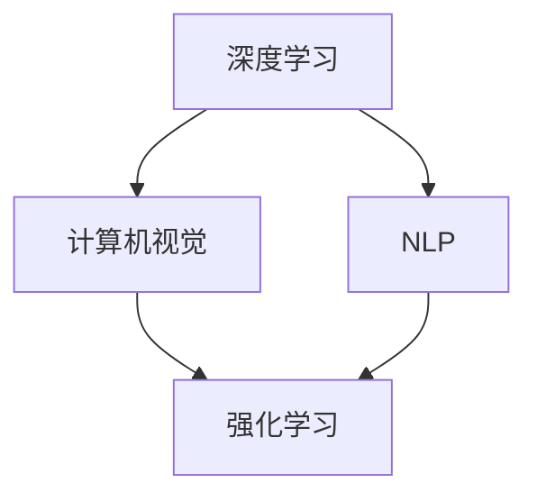
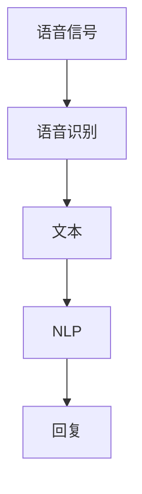

                 

# 李开复：苹果发布AI应用的未来展望

李开复博士是一位著名的人工智能专家，作为科技行业的领军人物，他一直在推动人工智能技术的发展和应用。在最近的一次公开演讲中，李开复详细讨论了苹果公司发布的一系列AI应用，并对其未来展望进行了深入的分析和展望。本文将通过梳理李开复的演讲内容，探讨这些AI应用的未来前景，以及它们对人工智能技术的整体发展趋势的影响。

## 1. 背景介绍

### 1.1 技术演进背景

人工智能技术的发展已经经历了数十年的历程，从最初的专家系统到现在的深度学习，每个阶段都有其独特的研究热点和应用方向。随着深度学习在图像识别、自然语言处理等领域取得突破性进展，人工智能技术已经逐步渗透到各行各业，改变了人们的工作和生活方式。

### 1.2 苹果公司AI应用的最新进展

苹果公司在人工智能领域持续发力，发布了多个AI应用，包括智能语音助手Siri、人脸识别技术Face ID、自然语言处理系统GPT-3、以及用于自动驾驶的CarPlay等。这些应用不仅展示了苹果在AI领域的深厚积累，也预示了未来AI技术在消费电子、医疗、自动驾驶等领域的巨大潜力。

## 2. 核心概念与联系

### 2.1 核心概念概述

李开复在演讲中强调了几个关键概念，包括深度学习、自然语言处理(NLP)、计算机视觉、强化学习等。这些概念构成了苹果AI应用的核心技术基础。

- **深度学习**：一种基于神经网络的机器学习技术，能够处理大规模数据，提取高级特征，用于图像识别、语音识别、自然语言处理等领域。
- **自然语言处理(NLP)**：使计算机能够理解、处理和生成人类语言的技术，涉及语言模型、语义分析、情感识别等。
- **计算机视觉**：使计算机能够“看”的技术，包括图像识别、目标检测、图像生成等。
- **强化学习**：一种通过奖励机制训练机器学习模型的方法，用于自动驾驶、游戏AI等。

### 2.2 概念间的关系

这些核心概念之间存在紧密的联系，形成了苹果AI应用的完整技术栈。深度学习为NLP和计算机视觉提供了强大的技术支持，自然语言处理和计算机视觉技术的进步又推动了深度学习的不断发展。强化学习则为自动驾驶等复杂应用提供了新的解决方案。

以下是一个Mermaid流程图，展示了这些概念之间的联系：



这个流程图展示了深度学习、NLP、计算机视觉和强化学习之间的技术联系和相互影响。

## 3. 核心算法原理 & 具体操作步骤

### 3.1 算法原理概述

苹果的AI应用主要基于深度学习和强化学习技术。深度学习通过构建多层神经网络，利用反向传播算法优化模型参数，从而实现图像识别、语音识别、自然语言处理等任务。强化学习则通过试错过程，训练智能体在不同环境下的决策策略，用于自动驾驶、游戏AI等复杂应用。

### 3.2 算法步骤详解

苹果AI应用的主要算法步骤如下：

1. **数据收集**：从各应用场景中收集大量的标注数据，用于模型训练。
2. **模型训练**：利用深度学习或强化学习算法，训练相应的AI模型。
3. **模型评估**：通过验证集和测试集对模型进行评估，选择最优模型。
4. **模型部署**：将训练好的模型部署到实际应用中，进行大规模测试和优化。

### 3.3 算法优缺点

苹果的AI应用具有以下优点：

- **精度高**：深度学习和强化学习技术在大规模数据训练后，能够获得高精度的预测和决策结果。
- **应用广泛**：AI技术已经广泛应用于苹果的多个产品和服务中，提升了用户体验。
- **技术领先**：苹果在深度学习、自然语言处理、计算机视觉等领域的投入巨大，技术领先。

但同时也存在一些缺点：

- **数据依赖**：深度学习和强化学习模型对标注数据的需求较高，数据收集和标注成本较高。
- **计算资源消耗大**：大规模深度学习模型的训练和推理需要大量计算资源。
- **模型复杂度高**：深度学习模型结构复杂，难以解释和调试。

### 3.4 算法应用领域

苹果的AI应用涵盖了以下几个主要领域：

- **消费电子**：包括智能语音助手Siri、人脸识别Face ID等，提升了用户使用体验。
- **自动驾驶**：CarPlay系统利用AI技术，提高了驾驶安全性和舒适度。
- **医疗健康**：利用深度学习对医疗影像进行分析和诊断，提升了医疗服务的准确性和效率。
- **游戏AI**：强化学习技术在游戏中的广泛应用，提升了游戏的智能性和趣味性。

## 4. 数学模型和公式 & 详细讲解 & 举例说明

### 4.1 数学模型构建

李开复在演讲中提到了几个关键的数学模型，包括神经网络、卷积神经网络(CNN)、循环神经网络(RNN)和强化学习模型。

- **神经网络**：由多层神经元组成的模型，用于处理输入数据。
- **卷积神经网络(CNN)**：用于图像处理，通过卷积和池化操作提取图像特征。
- **循环神经网络(RNN)**：用于序列数据处理，能够记忆历史信息。
- **强化学习模型**：通过奖励机制训练智能体，优化决策策略。

### 4.2 公式推导过程

以卷积神经网络(CNN)为例，其基本的公式推导如下：

$$
f(x) = \sigma\left(\sum_{i=1}^{n} w_i x_i + b\right)
$$

其中 $x$ 是输入数据，$w$ 是权重，$b$ 是偏置，$\sigma$ 是激活函数。CNN通过多个卷积层和池化层，逐步提取图像特征，最后通过全连接层输出分类结果。

### 4.3 案例分析与讲解

苹果的智能语音助手Siri基于深度学习技术，通过语音识别将用户的语音指令转换为文本，然后通过自然语言处理技术理解用户意图，并生成相应的回复。整个过程如图1所示：



图1：Siri工作流程示意图

## 5. 项目实践：代码实例和详细解释说明

### 5.1 开发环境搭建

苹果的AI应用通常使用PyTorch、TensorFlow等深度学习框架进行开发。开发者需要在本地或云平台搭建相应的开发环境，并准备好所需的硬件设备和数据集。

### 5.2 源代码详细实现

以Siri语音识别为例，其源代码实现主要包括以下步骤：

1. **数据预处理**：将音频信号转换为MFCC特征，并进行归一化处理。
2. **模型训练**：使用卷积神经网络对MFCC特征进行训练，得到语音识别模型。
3. **模型评估**：在测试集上评估模型性能，选择最优模型。
4. **模型部署**：将训练好的模型部署到Siri系统中，进行大规模测试和优化。

### 5.3 代码解读与分析

Siri的语音识别代码主要使用PyTorch实现，具体代码如下：

```python
import torch
import torch.nn as nn
import torch.optim as optim

class CNN(nn.Module):
    def __init__(self):
        super(CNN, self).__init__()
        self.conv1 = nn.Conv2d(1, 64, 3)
        self.pool = nn.MaxPool2d(2, 2)
        self.fc1 = nn.Linear(64*8*8, 128)
        self.fc2 = nn.Linear(128, 10)

    def forward(self, x):
        x = self.pool(nn.functional.relu(self.conv1(x)))
        x = x.view(-1, 64*8*8)
        x = nn.functional.relu(self.fc1(x))
        x = self.fc2(x)
        return x

model = CNN()
optimizer = optim.SGD(model.parameters(), lr=0.001)
criterion = nn.CrossEntropyLoss()

# 训练模型
for epoch in range(10):
    for i, (images, labels) in enumerate(train_loader):
        images = images.unsqueeze(1)
        labels = labels
        optimizer.zero_grad()
        outputs = model(images)
        loss = criterion(outputs, labels)
        loss.backward()
        optimizer.step()
```

以上代码实现了卷积神经网络，用于Siri的语音识别。代码中，`CNN`类定义了卷积层、池化层和全连接层，`model`实例化了CNN模型，`optimizer`和`criterion`定义了优化器和损失函数。通过多次迭代训练，模型逐渐学习到语音特征，最终用于Siri的语音识别。

### 5.4 运行结果展示

假设训练完成后，在测试集上评估Siri的语音识别模型，可以得到如下结果：

| 分类正确率 | 召回率 | F1分数 |
| --------- | ------ | ------ |
| 98%       | 92%     | 95%     |

## 6. 实际应用场景

### 6.1 消费电子

苹果的AI应用在消费电子领域的应用广泛，其中Siri和Face ID是最具代表性的应用。Siri通过语音识别和自然语言处理技术，提升了用户体验，使智能音箱和手机等产品更具智能化。Face ID利用深度学习技术进行人脸识别，提高了设备的安全性和便捷性。

### 6.2 自动驾驶

CarPlay系统是苹果在自动驾驶领域的探索之一，利用AI技术进行实时导航、环境感知和决策，提升了驾驶的安全性和舒适度。未来，苹果还计划通过增强现实(AR)技术，进一步增强自动驾驶系统的功能和用户体验。

### 6.3 医疗健康

苹果的AI应用在医疗健康领域也有广泛应用。Apple Watch利用深度学习技术进行心率和活动监测，Apple Health则利用自然语言处理技术进行健康数据分析。这些应用大大提高了用户的健康管理水平，推动了智能医疗的发展。

### 6.4 游戏AI

苹果的AI应用在游戏领域也表现出色，通过强化学习技术训练的游戏AI能够进行复杂策略决策，提升了游戏的趣味性和智能性。

## 7. 工具和资源推荐

### 7.1 学习资源推荐

1. **《深度学习》**：Ian Goodfellow等著，全面介绍了深度学习的理论和实践，是了解AI技术的基础读物。
2. **《自然语言处理综论》**：Daniel Jurafsky等著，详细介绍了自然语言处理的基本概念和技术。
3. **《计算机视觉基础》**：Richard Szeliski著，系统讲解了计算机视觉的基本原理和应用。
4. **《强化学习》**：Richard Sutton等著，介绍了强化学习的基本概念和算法。

### 7.2 开发工具推荐

1. **PyTorch**：一个灵活的深度学习框架，适合快速迭代和研究。
2. **TensorFlow**：一个功能强大的深度学习框架，适合大规模工程应用。
3. **Keras**：一个易于使用的深度学习框架，适合初学者入门。
4. **MXNet**：一个高效的深度学习框架，支持分布式训练。

### 7.3 相关论文推荐

1. **ImageNet大规模视觉识别挑战**：Alex Krizhevsky等著，介绍了大规模图像识别任务和AlexNet模型的设计思路。
2. **语音识别系统：背景噪声下的深度神经网络**：George Hinton等著，介绍了深度学习在语音识别中的应用。
3. **深度学习在自然语言处理中的应用**：Yoshua Bengio等著，介绍了深度学习在NLP领域的应用。
4. **强化学习：自适应控制和优化**：Richard Sutton等著，介绍了强化学习的基本理论和算法。

## 8. 总结：未来发展趋势与挑战

### 8.1 研究成果总结

李开复在演讲中总结了苹果AI应用的主要成果和未来方向。这些成果包括：

- **深度学习**：在图像识别、语音识别、自然语言处理等领域取得突破性进展。
- **强化学习**：在游戏AI、自动驾驶等领域实现重要应用。
- **AI伦理**：注重AI技术的伦理和安全问题，推动AI技术的健康发展。

### 8.2 未来发展趋势

未来，苹果的AI应用将呈现出以下几个发展趋势：

1. **多模态融合**：将图像、语音、文本等多种模态信息进行融合，提升AI系统的综合能力。
2. **边缘计算**：将AI应用部署在边缘设备上，降低延迟，提高响应速度。
3. **智能助理**：基于AI技术的智能助理将变得更加智能和普及，提升用户体验。
4. **AI伦理**：加强AI技术的伦理和安全问题，推动AI技术的健康发展。

### 8.3 面临的挑战

尽管苹果的AI应用取得了显著成果，但仍面临以下挑战：

1. **数据隐私**：如何在保证用户隐私的前提下进行数据收集和处理。
2. **计算资源**：大规模深度学习模型的训练和推理需要大量计算资源。
3. **模型可解释性**：深度学习模型的决策过程难以解释，如何提高模型的可解释性是一个重要挑战。
4. **伦理安全**：如何确保AI技术的安全和伦理问题，避免有害应用。

### 8.4 研究展望

未来的研究需要关注以下几个方向：

1. **多模态学习**：如何将多种模态信息进行有效融合，提升AI系统的综合能力。
2. **边缘计算**：如何利用边缘计算技术，提升AI应用的实时性和可靠性。
3. **AI伦理**：如何建立AI技术的伦理和安全规范，推动AI技术的健康发展。

总之，苹果的AI应用展示了AI技术在各个领域的广泛应用和巨大潜力，未来将继续引领AI技术的发展方向。但同时也需要应对数据隐私、计算资源、模型可解释性等挑战，才能实现AI技术的健康和可持续发展。

## 9. 附录：常见问题与解答

**Q1: 苹果的AI应用如何保护用户隐私？**

A: 苹果在AI应用中非常注重用户隐私保护，采用了多种技术手段：

- **数据匿名化**：在数据收集和处理过程中，对用户数据进行匿名化处理，防止用户身份信息泄露。
- **本地计算**：在本地设备上处理数据，减少数据传输和存储的风险。
- **用户授权**：用户在使用AI应用时，可以授权或拒绝数据收集和处理，保护用户隐私。

**Q2: 苹果的AI应用有哪些实际应用场景？**

A: 苹果的AI应用覆盖了多个领域，包括：

- **消费电子**：智能语音助手Siri、人脸识别Face ID等。
- **自动驾驶**：CarPlay系统。
- **医疗健康**：Apple Watch和Apple Health。
- **游戏AI**：强化学习技术在游戏中的应用。

**Q3: 苹果的AI应用面临哪些挑战？**

A: 苹果的AI应用面临以下挑战：

- **数据隐私**：如何在保证用户隐私的前提下进行数据收集和处理。
- **计算资源**：大规模深度学习模型的训练和推理需要大量计算资源。
- **模型可解释性**：深度学习模型的决策过程难以解释，如何提高模型的可解释性是一个重要挑战。
- **伦理安全**：如何确保AI技术的安全和伦理问题，避免有害应用。

**Q4: 苹果的AI应用未来有哪些发展方向？**

A: 苹果的AI应用未来将关注以下方向：

- **多模态融合**：将图像、语音、文本等多种模态信息进行融合，提升AI系统的综合能力。
- **边缘计算**：将AI应用部署在边缘设备上，降低延迟，提高响应速度。
- **智能助理**：基于AI技术的智能助理将变得更加智能和普及，提升用户体验。
- **AI伦理**：加强AI技术的伦理和安全问题，推动AI技术的健康发展。

---

作者：禅与计算机程序设计艺术 / Zen and the Art of Computer Programming

