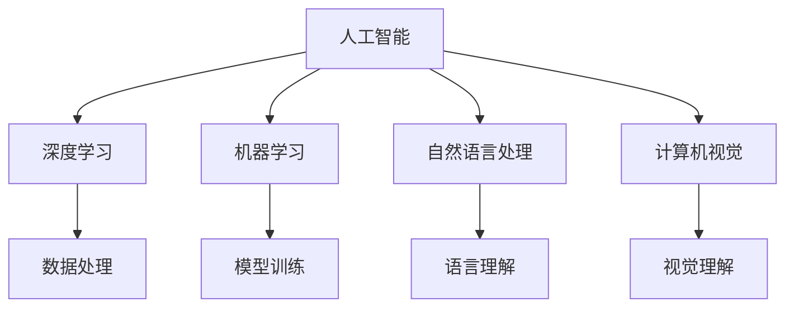

                 

# 李开复：苹果发布AI应用的机会

## 1. 背景介绍

在科技迅猛发展的今天，人工智能（AI）已经成为推动技术革新的重要力量。苹果公司作为全球领先的科技企业，近年来在AI领域也展开了诸多布局，通过发布一系列的AI应用，向市场展示了其对AI技术的应用潜力和对未来的前瞻性思考。

本文将围绕苹果公司的AI应用展开讨论，探讨其在AI领域的发展方向及其应用场景，同时展望未来AI技术的发展趋势。

## 2. 核心概念与联系

### 2.1 核心概念概述

要理解苹果公司如何利用AI技术，首先需要明确几个核心概念：

- **人工智能（AI）**：指计算机系统能够通过学习、推理、感知等能力，模拟人类智能行为的技术。
- **深度学习（Deep Learning）**：一种基于神经网络的AI技术，通过多层次的特征提取，实现对复杂数据模式的学习。
- **机器学习（Machine Learning）**：让计算机从数据中自动学习和改进的技术，包括监督学习、无监督学习和强化学习等。
- **自然语言处理（NLP）**：使计算机能够理解、处理和生成人类语言的技术。
- **计算机视觉（CV）**：使计算机能够理解和分析图像、视频等视觉信息的技术。

### 2.2 核心概念间的联系

这些核心概念间存在密切的联系，它们共同构成了人工智能技术的基础。具体来说，深度学习和机器学习提供了强大的数据处理和模式识别能力，而自然语言处理和计算机视觉则扩展了AI的应用范围。苹果公司通过在这些技术上的持续投入和创新，不断推出具有革新意义的AI应用。

以下是一个简单的Mermaid流程图，展示了这些核心概念之间的联系：



该图表明，深度学习与机器学习为基础，提供强大的数据处理和模型训练能力，自然语言处理和计算机视觉则在此基础上，拓展AI的应用场景。苹果公司正是利用这些技术，不断推出满足不同需求的AI应用。

## 3. 核心算法原理 & 具体操作步骤

### 3.1 算法原理概述

苹果公司的AI应用主要基于深度学习和机器学习技术，通过构建和优化神经网络模型，实现对复杂数据的学习和分析。以下是几种核心的算法原理：

- **卷积神经网络（CNN）**：主要应用于计算机视觉任务，通过卷积操作提取图像特征，并进行分类、检测等操作。
- **循环神经网络（RNN）和长短期记忆网络（LSTM）**：主要应用于自然语言处理任务，通过递归结构捕捉文本的序列信息。
- **自编码器（Autoencoder）**：通过学习数据的压缩表示，实现数据降维和重构，提高模型的泛化能力。

### 3.2 算法步骤详解

以下是苹果公司AI应用开发的基本步骤：

1. **数据收集与预处理**：从公开数据集或合作伙伴处获取数据，并进行数据清洗、标注等预处理。
2. **模型构建**：选择合适的神经网络模型架构，并根据任务需求进行参数初始化。
3. **模型训练**：使用GPU或TPU等硬件资源，对模型进行训练，并通过交叉验证等方法进行调参。
4. **模型评估与优化**：在验证集上评估模型性能，根据评估结果进行模型微调或重新训练。
5. **模型部署**：将训练好的模型部署到实际应用环境中，并进行持续监控和优化。

### 3.3 算法优缺点

苹果公司的AI应用具有以下优点：

- **高性能计算资源**：苹果公司拥有强大的硬件支持，能够高效地进行模型训练和推理。
- **丰富的数据资源**：通过合作伙伴和内部数据积累，拥有大量高质量的数据资源，为模型训练提供了坚实基础。
- **用户友好的框架**：苹果提供的AI开发框架（如Core ML），使得开发者能够快速构建和部署AI应用。

同时，也存在一些缺点：

- **数据隐私问题**：苹果需要处理大量用户数据，如何保护用户隐私成为一个挑战。
- **模型可解释性**：深度学习模型通常具有黑盒特性，难以解释其内部机制，可能影响用户信任。
- **高昂的开发成本**：AI应用开发需要大量资源投入，包括人力、时间和硬件，可能导致成本高昂。

### 3.4 算法应用领域

苹果公司的AI应用涵盖了多个领域，主要包括：

- **计算机视觉**：如Face ID、图像识别、增强现实（AR）等。
- **自然语言处理**：如Siri语音助手、文字识别、机器翻译等。
- **机器学习**：如推荐系统、个性化搜索、智能推荐等。

此外，苹果还在健康医疗、金融科技、智能家居等领域进行了AI应用的探索，逐步拓展其AI技术的边界。

## 4. 数学模型和公式 & 详细讲解

### 4.1 数学模型构建

以苹果公司的图像识别应用为例，其数学模型构建主要包括以下步骤：

1. **数据集划分**：将数据集分为训练集、验证集和测试集。
2. **模型选择**：选择适合任务的神经网络模型，如卷积神经网络（CNN）。
3. **损失函数选择**：根据任务需求选择损失函数，如交叉熵损失函数。
4. **优化器选择**：选择合适的优化器，如Adam优化器。

### 4.2 公式推导过程

以下是卷积神经网络的基本公式推导：

- **卷积层**：

  $g_{c}(x)=b_{c}+\sum_{k}^{N}a_{k}f(x_{i}, w_{k})$

  其中，$x$为输入数据，$a_{k}$为卷积核权重，$w_{k}$为偏置项，$f$为激活函数。

- **池化层**：

  $g_{p}(x)=\max _{p \in R} f(x_{i}, w_{p})$

  其中，$x$为输入数据，$w_{p}$为池化核权重，$f$为激活函数。

- **全连接层**：

  $g_{fc}(x)=\sum_{k}^{N}a_{k}f(x_{i}, w_{k})$

  其中，$x$为输入数据，$a_{k}$为权重，$w_{k}$为偏置项，$f$为激活函数。

### 4.3 案例分析与讲解

以苹果的面部识别系统Face ID为例，其实现流程如下：

1. **数据收集**：收集用户面部图像数据。
2. **预处理**：对图像进行归一化、缩放等预处理。
3. **特征提取**：使用卷积神经网络提取面部特征。
4. **模型训练**：使用训练集进行模型训练，优化损失函数。
5. **验证与测试**：在验证集上评估模型性能，在测试集上测试模型泛化能力。

## 5. 项目实践：代码实例和详细解释说明

### 5.1 开发环境搭建

要在苹果平台上开发AI应用，需要以下开发环境：

1. **Xcode**：苹果官方开发工具，支持多种语言和框架。
2. **Core ML**：苹果提供的机器学习框架，支持多种神经网络模型。
3. **GPU**：使用GPU进行模型训练和推理，加速计算。

### 5.2 源代码详细实现

以下是使用Core ML进行面部识别的代码示例：

```swift
import CoreML
import UIKit

class ViewController: UIViewController, MLModelDelegate {
    let model: MLModel = try? MLModel(contentsOf: URL(fileURLWithPath: "FaceID.mlmodel"))
    
    override func viewDidLoad() {
        super.viewDidLoad()
        
        // 设置模型委托
        model.delegate = self
        
        // 加载模型
        do {
            try model.load()
        } catch let error {
            print("加载模型失败：\(error.localizedDescription)")
        }
    }
    
    // 处理模型输出
    func didEvaluate(in input: MLArrayBuffer<MLFeatureProvider>) -> MLArrayBuffer<MLFeatureProvider> {
        // 对输入进行预处理
        let preprocessedInput = preprocess(input)
        
        // 进行模型推理
        let output = try? model.predict(preprocessedInput)
        
        // 对输出进行后处理
        let result = postprocess(output)
        
        // 返回处理后的输出
        return result
    }
    
    // 数据预处理
    func preprocessing(input: MLArrayBuffer<MLFeatureProvider>) -> MLArrayBuffer<MLFeatureProvider> {
        // 在这里实现数据预处理逻辑
    }
    
    // 数据后处理
    func postprocessing(output: MLArrayBuffer<MLFeatureProvider>) -> MLArrayBuffer<MLFeatureProvider> {
        // 在这里实现数据后处理逻辑
    }
}
```

### 5.3 代码解读与分析

该代码示例主要展示了如何使用Core ML框架进行面部识别。具体步骤如下：

1. **加载模型**：使用`MLModel(contentsOf:)`方法加载预训练的面部识别模型。
2. **设置委托**：将`ViewController`实例设置为模型委托，以便在模型推理过程中获取输出结果。
3. **模型推理**：使用`model.predict()`方法进行模型推理，将预处理后的输入数据传入模型，获取输出结果。
4. **后处理输出**：对模型输出进行后处理，得到最终的识别结果。

## 6. 实际应用场景

### 6.1 计算机视觉

苹果的计算机视觉应用广泛应用于Face ID、图像识别、增强现实（AR）等领域。以Face ID为例，通过深度学习模型对用户面部特征进行识别，确保设备的安全性。

### 6.2 自然语言处理

苹果的自然语言处理应用主要体现在Siri语音助手和文字识别等产品中。通过构建RNN和LSTM模型，Siri能够理解用户的语音指令，并提供相应的回答。

### 6.3 健康医疗

苹果在健康医疗领域也进行了AI应用的探索，如使用机器学习技术对健康数据进行分析，提供个性化的健康建议。

### 6.4 金融科技

苹果在金融科技领域的应用主要体现在智能推荐和个性化搜索等方面。通过分析用户的消费行为，提供个性化的产品推荐，提升用户体验。

### 6.5 智能家居

苹果通过智能家居设备（如HomePod）集成AI应用，为用户提供更加智能便捷的生活体验。

## 7. 工具和资源推荐

### 7.1 学习资源推荐

为了深入了解苹果公司的AI应用，推荐以下学习资源：

1. **《机器学习实战》**：介绍机器学习的基本概念和应用场景，适合入门学习。
2. **《深度学习》**：讲解深度学习的基本原理和实现技术，深入浅出，适合进阶学习。
3. **苹果官方文档**：提供Core ML等AI框架的详细文档，是学习苹果AI应用的重要参考。

### 7.2 开发工具推荐

以下是苹果公司推荐的使用工具：

1. **Xcode**：苹果官方开发工具，支持多种语言和框架。
2. **Core ML**：苹果提供的机器学习框架，支持多种神经网络模型。
3. **Python**：广泛用于数据处理和模型训练的语言，支持TensorFlow、PyTorch等深度学习框架。

### 7.3 相关论文推荐

以下是一些重要的AI相关论文：

1. **《ImageNet大规模视觉识别挑战赛》**：介绍图像识别技术的最新进展，是深度学习领域的经典论文。
2. **《Google的语音识别技术》**：详细介绍了语音识别技术的实现方法和应用场景。
3. **《深度学习》**：深度学习领域的经典教材，涵盖基本概念和最新研究。

## 8. 总结：未来发展趋势与挑战

### 8.1 研究成果总结

苹果公司通过AI技术的应用，展示了其在计算机视觉、自然语言处理、健康医疗等领域的前沿探索。其AI应用不仅提升了设备的用户体验，也为未来的技术发展提供了新的方向。

### 8.2 未来发展趋势

未来，AI技术将继续在各个领域得到广泛应用，苹果公司也有望在这一领域发挥更大的影响力。以下是一些未来趋势：

1. **多模态融合**：将图像、语音、文本等多种数据形式进行融合，实现更全面的人机交互。
2. **边缘计算**：通过在设备端进行数据处理和模型推理，减少对云服务的依赖，提升数据安全性和应用效率。
3. **自监督学习**：通过大量无标注数据进行自监督学习，提升模型的泛化能力和鲁棒性。

### 8.3 面临的挑战

尽管苹果在AI领域取得了一定的成绩，但仍面临诸多挑战：

1. **数据隐私保护**：如何在保证数据安全性的同时，充分利用数据资源进行模型训练。
2. **模型可解释性**：提高模型的可解释性，增强用户对AI技术的信任。
3. **计算资源**：高昂的计算资源需求，对公司的成本控制带来挑战。

### 8.4 研究展望

苹果公司需要在数据隐私保护、模型可解释性、计算资源等方面进行持续研究，以应对未来的挑战。同时，继续在AI技术的前沿领域进行探索，推动技术的发展和应用。

## 9. 附录：常见问题与解答

**Q1：苹果的AI应用是否存在数据隐私问题？**

A: 苹果非常重视用户数据隐私保护，通过多种措施确保数据安全。例如，Face ID使用本地数据存储和处理，不将用户面部数据上传到云端。

**Q2：苹果的AI应用如何进行模型训练？**

A: 苹果使用GPU进行模型训练，并使用Core ML框架进行模型部署和推理。开发者可以使用TensorFlow或PyTorch等深度学习框架进行模型训练，然后将训练好的模型转换为Core ML格式进行部署。

**Q3：苹果的AI应用有哪些实际应用场景？**

A: 苹果的AI应用涵盖了计算机视觉、自然语言处理、健康医疗、金融科技等多个领域，如Face ID、Siri语音助手、智能推荐等。

**Q4：苹果的AI应用是否存在计算资源限制？**

A: 苹果的AI应用对计算资源的需求较高，特别是在模型训练和推理过程中。为此，苹果采用了多种优化技术，如模型压缩、梯度积累等，以提升应用效率。

---

作者：禅与计算机程序设计艺术 / Zen and the Art of Computer Programming

