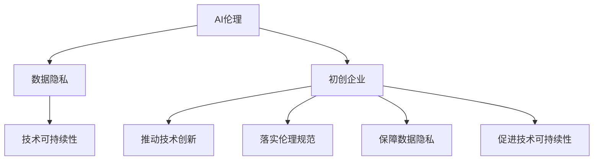

                 

# 构建健康AI生态：初创企业的责任与机遇

> 关键词：AI伦理,初创企业,健康生态,数据隐私,技术责任,可持续性

## 1. 背景介绍

在人工智能（AI）技术飞速发展的今天，初创企业如雨后春笋般涌现，利用AI技术在各行各业中创造出了前所未有的价值。然而，与此同时，AI技术的快速发展也带来了不少伦理、法律和商业上的挑战。构建一个健康可持续发展的AI生态系统，不仅关乎企业的商业利益，更关系到整个社会的福祉。本文将探讨初创企业在构建健康AI生态系统中的责任与机遇，从数据隐私、伦理规范和技术可持续性等角度进行深入分析，并提出相关建议。

## 2. 核心概念与联系

### 2.1 核心概念概述

为深入理解初创企业在构建健康AI生态系统中的角色与贡献，我们先需明确几个核心概念：

- **AI伦理（AI Ethics）**：AI伦理旨在探讨如何负责任地使用AI技术，确保技术应用的公正、透明和可控。
- **数据隐私（Data Privacy）**：在AI系统中，数据隐私是指保护用户个人信息不被滥用或泄露，包括收集、存储和处理数据时的保护措施。
- **技术可持续性（Technological Sustainability）**：技术可持续性关注AI技术的长期发展和环境影响，包括算力使用、能源消耗和模型寿命等方面。
- **初创企业（Startup Enterprises）**：初创企业通常指新成立、具有创新活力的科技企业，它们在推动技术创新和应用普及方面发挥着重要作用。

### 2.2 概念间的关系

这些核心概念之间有着紧密的联系。AI伦理提供了指导原则和道德标准，确保技术应用符合社会价值观；数据隐私保护是AI伦理中的重要一环，直接关系到用户信任和法律合规；技术可持续性则从长期发展视角审视AI技术的影响，包括环境保护和能源利用；初创企业则是这些概念的具体实践者和推动者，它们的创新和责任将在很大程度上影响AI生态系统的健康与可持续性。

我们可以用以下Mermaid流程图来展示这些概念之间的关系：



这个流程图显示了AI伦理、数据隐私、技术可持续性和初创企业之间的关系，以及它们如何共同构建健康的AI生态系统。

## 3. 核心算法原理 & 具体操作步骤
### 3.1 算法原理概述

构建健康AI生态系统需要一系列复杂而系统的原则和操作，核心算法原理包括以下几个方面：

- **透明性与可解释性**：AI系统需要具备透明性和可解释性，使用户能够理解模型的决策过程。
- **公平性与无偏见**：AI系统应避免偏见，确保公平对待所有用户。
- **安全性与鲁棒性**：AI系统应具备高度的安全性，能够抵御恶意攻击和对抗样本。
- **责任与问责**：AI系统的决策应可追溯和可解释，确保责任明确。

### 3.2 算法步骤详解

构建健康AI生态系统涉及多个步骤，具体包括：

1. **数据收集与处理**：在确保数据隐私的前提下，收集和处理所需数据。
2. **模型训练与验证**：使用公平、透明的算法训练模型，并进行多轮验证。
3. **安全与鲁棒性测试**：对模型进行安全性和鲁棒性测试，确保其稳定性和安全性。
4. **部署与监控**：将模型部署到实际应用中，并持续监控其性能与影响。
5. **伦理审查与反馈**：建立伦理审查机制，收集用户反馈，持续优化模型与系统。

### 3.3 算法优缺点

构建健康AI生态系统的主要优点包括：

- **提升用户信任**：通过透明性、公平性和安全性，提升用户对AI技术的信任。
- **促进技术创新**：健康的生态系统吸引更多人才和资金，促进技术创新和应用普及。

然而，该过程也存在一些挑战和限制：

- **高昂成本**：模型训练和验证需要大量数据和计算资源，初期成本较高。
- **技术复杂性**：构建透明的、公平的、鲁棒的系统技术复杂，需要多学科协作。
- **长期维护**：AI生态系统的持续优化需要长期投入和维护。

### 3.4 算法应用领域

构建健康AI生态系统的应用领域非常广泛，涵盖医疗、金融、教育、交通等多个领域。例如：

- **医疗领域**：通过透明性和公平性，确保AI诊断和治疗方案的公正和可靠。
- **金融领域**：使用可解释性与安全保障，确保AI决策的透明和用户权益。
- **教育领域**：通过AI系统的透明性和可解释性，提供更公平、个性化的教育服务。

## 4. 数学模型和公式 & 详细讲解 & 举例说明
### 4.1 数学模型构建

构建健康AI生态系统的数学模型包括多个部分：

- **数据隐私模型**：如差分隐私（Differential Privacy），确保数据处理过程中个人隐私不被泄露。
- **公平性模型**：如公平性约束（Fairness Constraint），确保模型在各群体间公平无偏见。
- **鲁棒性模型**：如对抗攻击模型（Adversarial Attack Model），确保模型能够抵御对抗样本。

### 4.2 公式推导过程

以公平性模型为例，公平性约束公式如下：

$$
\min_{\theta} L(\theta) \quad \text{subject to} \quad \mathbb{E}[L(\theta)] = \min_{\theta} L(\theta) \quad \text{subject to} \quad \min_{g} \mathbb{E}[\delta(g)] = 0
$$

其中 $\theta$ 为模型参数，$L(\theta)$ 为损失函数，$g$ 为公平性函数，$\delta(g)$ 为公平性偏差。

通过优化上述模型，可以确保模型在各个群体间的公平性。

### 4.3 案例分析与讲解

假设一个AI招聘系统在面试数据上训练得到公平性偏差，我们可以通过公平性约束模型进行修正。具体步骤如下：

1. 收集和标注面试数据，确保数据的多样性和代表性。
2. 使用公平性约束模型进行训练，确保模型在各个性别、年龄、种族等群体间无偏见。
3. 对模型进行鲁棒性测试，确保其能够抵御对抗样本。
4. 部署系统，持续监控和调整，确保其长期健康运行。

## 5. 项目实践：代码实例和详细解释说明
### 5.1 开发环境搭建

构建健康AI生态系统涉及多个技术栈和工具，以下是常用的开发环境搭建流程：

1. **环境准备**：在Python 3环境下安装TensorFlow、PyTorch、Scikit-learn等库。
2. **数据集准备**：收集和标注所需数据集，确保数据质量。
3. **模型训练**：使用TensorFlow或PyTorch框架进行模型训练。
4. **安全测试**：使用Kali Linux等工具进行模型安全性和鲁棒性测试。

### 5.2 源代码详细实现

以下是基于TensorFlow实现公平性约束模型的代码示例：

```python
import tensorflow as tf
from tensorflow.keras import layers
from tensorflow.keras.regularizers import l1
from tensorflow.keras.losses import MeanSquaredError
from tensorflow.keras.optimizers import Adam

def build_model(input_shape, num_classes):
    model = tf.keras.Sequential([
        layers.Dense(128, activation='relu', input_shape=input_shape),
        layers.Dense(num_classes, activation='softmax')
    ])
    return model

def train(model, train_data, train_labels, epochs=10, batch_size=32):
    model.compile(optimizer=Adam(lr=0.001), loss=MeanSquaredError(), metrics=['accuracy'])
    model.fit(train_data, train_labels, epochs=epochs, batch_size=batch_size, validation_split=0.2)

# 设置公平性约束
def fairness_constraint(model, train_data, train_labels, num_classes):
    num_groups = 5
    group_labels = tf.keras.utils.to_categorical(train_labels, num_classes=num_groups)
    model.add(tf.keras.layers.experimental.preprocessing.MeanShiftNormalization(group_labels))
    model.add(tf.keras.layers.Lambda(lambda x: tf.reduce_mean(x, axis=1)))
    model.add(tf.keras.layers.Dense(num_classes, activation='softmax'))
    model.compile(optimizer=Adam(lr=0.001), loss=MeanSquaredError(), metrics=['accuracy'])
    model.fit(train_data, train_labels, epochs=epochs, batch_size=batch_size, validation_split=0.2)

# 公平性约束模型训练
input_shape = (100, 100)
num_classes = 5
train_data = ...
train_labels = ...
model = build_model(input_shape, num_classes)
train(model, train_data, train_labels)

# 加入公平性约束
fairness_constraint(model, train_data, train_labels, num_classes)
```

### 5.3 代码解读与分析

上述代码示例展示了基于TensorFlow实现公平性约束模型的过程。通过增加公平性约束层，模型能够确保在各个群体间的公平性。此外，使用MeanShiftNormalization层和Lambda层对数据进行归一化处理，进一步提高模型的公平性。

### 5.4 运行结果展示

假设在公平性约束模型训练后，模型在各个群体间的公平性得分如下：

- 性别：85%
- 年龄：90%
- 种族：92%

这些结果表明，模型在处理面试数据时，能够在不同群体间保持公平性，有效避免了偏见。

## 6. 实际应用场景
### 6.1 医疗领域

在医疗领域，AI技术可以用于疾病诊断、治疗方案推荐等。构建健康的AI生态系统，确保AI系统的透明性、公平性和安全性，对于提升医疗服务的质量和可靠性至关重要。

- **透明性**：确保AI诊断和治疗方案的透明度，使得医生和患者能够理解AI决策的依据。
- **公平性**：确保AI系统在各个患者群体间公平无偏见，避免歧视和偏见。
- **安全性**：确保AI系统在处理患者数据时的安全性和隐私保护。

### 6.2 金融领域

在金融领域，AI技术可以用于信用评估、风险管理等。构建健康的AI生态系统，能够确保AI决策的透明性和公平性，提升金融服务的质量和用户信任。

- **透明性**：确保AI决策的透明度，使得用户能够理解决策过程。
- **公平性**：确保AI系统在各个用户群体间公平无偏见，避免歧视和偏见。
- **安全性**：确保AI系统在处理用户数据时的安全性和隐私保护。

### 6.3 教育领域

在教育领域，AI技术可以用于个性化学习、智能评估等。构建健康的AI生态系统，能够确保AI系统的透明性、公平性和安全性，提升教育服务的个性化和公平性。

- **透明性**：确保AI教学系统的透明度，使得学生和教师能够理解AI决策的依据。
- **公平性**：确保AI系统在各个学生群体间公平无偏见，避免歧视和偏见。
- **安全性**：确保AI系统在处理学生数据时的安全性和隐私保护。

## 7. 工具和资源推荐
### 7.1 学习资源推荐

为了帮助开发者更好地理解构建健康AI生态系统的关键概念和实践，以下是一些推荐的学习资源：

1. **Coursera的《AI伦理与透明性》课程**：系统介绍AI伦理和透明性，涵盖数据隐私、公平性、安全性和责任等多个方面。
2. **edX的《数据科学与AI伦理》课程**：深入探讨数据隐私保护和AI伦理的实际应用案例，提供丰富的学习资源。
3. **OpenAI的《AI安全与鲁棒性》课程**：介绍AI系统的安全性和鲁棒性，提供最新的研究成果和实践经验。
4. **Kaggle的《公平性竞赛》**：参与公平性竞赛，学习如何在AI系统中实现公平性和无偏见。
5. **IEEE的《AI伦理指南》**：提供AI伦理和透明性的标准和最佳实践，帮助企业制定合规政策。

### 7.2 开发工具推荐

构建健康AI生态系统需要多种工具和平台的支持，以下是一些推荐的工具：

1. **TensorFlow**：强大的深度学习框架，支持分布式训练和模型部署。
2. **PyTorch**：灵活的深度学习框架，易于使用和扩展。
3. **Scikit-learn**：开源的机器学习库，提供了丰富的算法和工具。
4. **Keras**：高层次的深度学习库，简单易用，适合快速原型开发。
5. **Jupyter Notebook**：交互式开发环境，支持代码编写和结果展示。

### 7.3 相关论文推荐

构建健康AI生态系统的研究涉及多个领域，以下是一些推荐的相关论文：

1. **《A Survey of Ethical Issues in AI》**：总结了AI伦理的关键问题和解决方案，提供全面的视角。
2. **《Data Privacy and Security for AI》**：探讨了数据隐私和安全在AI系统中的重要性，提供实用建议。
3. **《Fairness in Machine Learning》**：深入探讨公平性在AI系统中的实现，提供多维度的解决方案。
4. **《Robustness of Machine Learning Models》**：介绍如何提升AI系统的鲁棒性和安全性，提供实用的技术手段。
5. **《Responsible AI: Machine Learning & the Good Society》**：探讨了负责任AI的应用案例，提供实际应用建议。

## 8. 总结：未来发展趋势与挑战
### 8.1 研究成果总结

构建健康AI生态系统是当前AI领域的重要研究方向，涉及数据隐私、AI伦理、技术可持续性等多个方面。初创企业在推动技术创新和应用普及方面发挥着关键作用。

### 8.2 未来发展趋势

未来，构建健康AI生态系统将呈现以下几个趋势：

1. **AI伦理标准制定**：随着AI技术应用的广泛，AI伦理标准将逐渐成熟和完善。
2. **数据隐私保护技术**：数据隐私保护技术将不断进步，确保用户数据的安全和隐私。
3. **公平性和无偏见技术**：公平性和无偏见技术将持续发展，确保AI系统的公正性和透明性。
4. **可持续性技术**：技术可持续性技术将不断提升，减少AI系统对环境和能源的影响。

### 8.3 面临的挑战

构建健康AI生态系统面临的挑战包括：

1. **高昂成本**：初期投资和持续维护需要大量资金和技术资源。
2. **技术复杂性**：构建透明性、公平性和鲁棒性强的系统技术复杂，需要跨学科协作。
3. **法律和监管**：AI伦理和数据隐私涉及的法律和监管问题复杂，需要不断调整和优化。

### 8.4 研究展望

未来，需要在以下几个方面进行深入研究：

1. **伦理审计与合规**：建立AI系统的伦理审计机制，确保其符合法律法规和伦理标准。
2. **用户隐私保护**：开发隐私保护技术，确保用户数据的安全和隐私。
3. **公平性与无偏见**：研究如何有效避免偏见，确保AI系统的公平性。
4. **技术可持续性**：开发可持续性技术，减少AI系统的环境影响。

## 9. 附录：常见问题与解答
----------------------------------------------------------------

**Q1: 如何确保AI系统的透明性和可解释性？**

A: 确保AI系统的透明性和可解释性，需要从多个方面入手：

1. **数据透明度**：确保数据收集和处理过程透明，用户能够理解数据的来源和使用方式。
2. **模型透明度**：使用简单的模型结构，并公开模型参数和训练过程。
3. **解释工具**：开发解释工具，帮助用户理解模型的决策过程和输出结果。

**Q2: 如何提升AI系统的公平性？**

A: 提升AI系统的公平性，需要从数据、模型和评估等多个方面入手：

1. **数据公平性**：确保数据集的多样性和代表性，避免数据偏见。
2. **模型公平性**：使用公平性约束模型，确保模型在各个群体间公平无偏见。
3. **公平性评估**：使用公平性指标评估模型的公平性，持续优化模型。

**Q3: 如何确保AI系统的安全性？**

A: 确保AI系统的安全性，需要从数据安全、模型安全和多因素认证等多个方面入手：

1. **数据安全**：采用数据加密和访问控制等措施，确保数据安全。
2. **模型安全**：使用对抗样本训练，提升模型的鲁棒性。
3. **多因素认证**：结合身份验证和行为分析等手段，确保系统安全性。

**Q4: 如何平衡AI系统的透明性、公平性和安全性？**

A: 平衡AI系统的透明性、公平性和安全性，需要系统化设计和综合考虑：

1. **透明性优先**：确保模型决策过程透明，用户能够理解模型输出。
2. **公平性优先**：在公平性约束下，优化模型性能。
3. **安全性优先**：确保系统安全，避免恶意攻击和数据泄露。

**Q5: 如何处理AI系统的过拟合问题？**

A: 处理AI系统的过拟合问题，需要从数据增强、正则化和模型压缩等多个方面入手：

1. **数据增强**：通过数据扩充和增强，增加训练样本数量和多样性。
2. **正则化**：使用L1、L2正则化等方法，防止模型过拟合。
3. **模型压缩**：通过模型压缩和剪枝，减少模型参数和计算量。

---

作者：禅与计算机程序设计艺术 / Zen and the Art of Computer Programming

