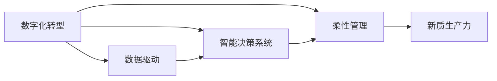
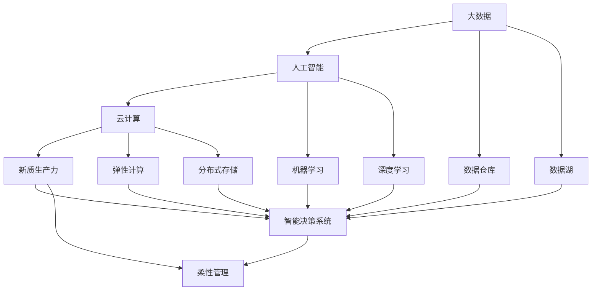

                 

## 1. 背景介绍

在数字化、网络化和智能化的新经济浪潮中，企业核心竞争力的提升，不再局限于传统意义上的产品和服务质量、市场份额和客户满意度，更侧重于数据驱动、技术创新、智能决策和柔性管理等方面。新质生产力的崛起，正成为企业竞争的新引擎。本文将深入探讨新质生产力策略的构建、提升与应用，帮助企业在新时代中占据优势地位。

## 2. 核心概念与联系

### 2.1 核心概念概述

为了更好地理解新质生产力策略，我们需要理解几个关键概念：

- **新质生产力**：指在数字化转型的背景下，通过技术创新和数据驱动，实现企业核心竞争力提升的新型生产力模式。它强调智能化、网络化、动态化等新型特征，与传统生产力模式有着本质的区别。
- **数字化转型**：指企业利用信息技术，特别是大数据、人工智能、云计算等现代技术手段，实现业务流程优化、运营管理提升和客户体验改善的过程。
- **智能决策系统**：基于大数据分析和人工智能算法，实现快速、准确、优化的决策支持系统。
- **柔性管理**：在变化莫测的市场环境中，通过灵活、敏捷的管理模式，快速响应市场需求和变化。

这些概念之间存在紧密联系，共同构成了新质生产力策略的核心理念。数字化转型是实现新质生产力的基础，智能决策系统是核心，柔性管理则是实现手段。

### 2.2 概念间的关系

为了更清晰地理解这些概念之间的关系，我们通过一个简单的Mermaid流程图来展示：



这个流程图展示了数字化转型、智能决策系统和柔性管理之间的关系，并最终指向新质生产力的实现。

### 2.3 核心概念的整体架构

接下来，我们将通过一个综合的流程图来展示这些核心概念在新质生产力策略的整体架构中如何相互配合：



这个综合流程图展示了大数据、人工智能和云计算技术如何支持新质生产力的实现，从数据收集、存储、处理到智能决策和柔性管理，每个环节都至关重要。

## 3. 核心算法原理 & 具体操作步骤

### 3.1 算法原理概述

新质生产力策略的核心算法原理主要基于数据驱动和智能决策，通过大数据分析和人工智能技术，实现对业务流程、运营管理、客户体验等方面的优化和提升。其基本思想是利用数据作为“第一生产要素”，通过智能算法和模型，不断优化决策过程，提升效率和质量。

### 3.2 算法步骤详解

新质生产力的构建主要包括以下几个关键步骤：

1. **数据采集与处理**：
   - 收集企业内部和外部的各种数据源，包括业务数据、客户数据、市场数据等。
   - 对数据进行清洗、预处理和标准化，确保数据的质量和可用性。

2. **数据存储与管理**：
   - 利用数据仓库、数据湖等技术，构建高效、安全的数据存储和管理系统。
   - 采用数据分区、索引、备份等技术，提高数据的可访问性和持久性。

3. **数据建模与分析**：
   - 利用统计分析、机器学习、深度学习等技术，对数据进行建模和分析。
   - 提取有价值的信息和洞察，为企业决策提供支持。

4. **智能决策系统**：
   - 构建基于人工智能的决策支持系统，利用自然语言处理、图像识别、预测模型等技术。
   - 实现快速、准确、优化的决策过程，提升企业的决策效率和质量。

5. **柔性管理**：
   - 采用敏捷项目管理、动态资源调度、智能运营等方法，实现灵活、高效的运营管理。
   - 通过实时监控和反馈机制，及时调整业务策略和管理方案。

### 3.3 算法优缺点

新质生产力策略的优势在于：
- 提升效率：通过数据驱动和智能决策，实现业务流程自动化，大幅度提升工作效率。
- 优化决策：利用大数据和人工智能技术，实现更准确、更快速的决策支持。
- 增强灵活性：通过柔性管理，实现快速响应市场需求和变化。

然而，该策略也存在一些挑战：
- 数据依赖性强：对高质量数据的依赖较大，数据收集和处理成本较高。
- 技术门槛高：需要具备大数据和人工智能的专业知识，技术实现难度较大。
- 安全风险高：数据安全和隐私保护面临重大挑战，需要采取严格的安全措施。

### 3.4 算法应用领域

新质生产力策略已广泛应用于多个领域，以下是几个典型应用案例：

1. **智能制造**：利用大数据分析和人工智能技术，优化生产流程、预测设备维护、提升产品质量。
2. **金融科技**：通过智能决策系统，实现风险控制、客户服务、投资管理等功能。
3. **零售电商**：通过大数据分析，实现精准营销、库存管理、客户推荐等功能。
4. **医疗健康**：通过智能决策系统，优化诊疗流程、提高诊断精度、改善患者体验。
5. **物流配送**：通过数据分析和人工智能，优化配送路线、提高配送效率、减少成本。

## 4. 数学模型和公式 & 详细讲解 & 举例说明

### 4.1 数学模型构建

新质生产力策略的构建涉及多个数学模型和算法，其中一些关键模型包括：

- 数据预处理模型：对原始数据进行清洗、归一化、标准化等处理，确保数据质量。
- 聚类分析模型：对数据进行聚类分析，发现数据中的潜在规律和关系。
- 预测模型：利用机器学习和深度学习算法，构建预测模型，实现预测分析。
- 优化模型：利用优化算法，优化决策参数，提升决策效果。

### 4.2 公式推导过程

以下我们以预测模型为例，推导线性回归模型和决策树模型的基本公式。

#### 线性回归模型

线性回归模型用于预测连续型变量，其基本公式为：

$$ y = \beta_0 + \beta_1x_1 + \beta_2x_2 + \ldots + \beta_nx_n + \epsilon $$

其中，$y$ 为预测目标变量，$\beta_0$ 为截距项，$\beta_1, \beta_2, \ldots, \beta_n$ 为回归系数，$x_1, x_2, \ldots, x_n$ 为输入变量，$\epsilon$ 为误差项。

在实际应用中，通过最小二乘法或梯度下降法，可以求解回归系数 $\beta_0, \beta_1, \beta_2, \ldots, \beta_n$，实现对 $y$ 的预测。

#### 决策树模型

决策树模型用于分类或回归问题，其基本公式为：

$$ y = \sum_{i=1}^m c_i \cdot \mathbf{1}\{x \in R_i\} $$

其中，$y$ 为预测目标变量，$c_i$ 为决策树的叶子节点值，$R_i$ 为决策树的子区域，$\mathbf{1}\{x \in R_i\}$ 为指示函数，表示 $x$ 是否属于子区域 $R_i$。

在实际应用中，通过信息增益或基尼不纯度等指标，选择最优的特征进行划分，构建决策树。然后，通过递归扩展决策树，实现对 $y$ 的预测。

### 4.3 案例分析与讲解

我们以智能制造为例，展示新质生产力策略的应用。在智能制造中，通过大数据分析和人工智能技术，可以实现生产流程优化、设备预测维护、质量控制等功能。

#### 数据采集与处理

采集生产过程中的各种数据，包括设备状态、工艺参数、产品质量等。通过传感器和自动化设备，实时收集数据。

#### 数据存储与管理

构建数据仓库，对采集到的数据进行存储和管理。利用数据分区和索引技术，提高数据的访问速度和效率。

#### 数据建模与分析

利用机器学习算法，对设备状态数据进行建模，实现设备故障预测。利用图像识别技术，对生产工艺进行监控和分析，优化工艺流程。

#### 智能决策系统

构建基于人工智能的决策支持系统，实现生产流程优化和设备预测维护。利用预测模型，实时监控设备状态，预测设备故障，提前进行维护。

#### 柔性管理

采用敏捷项目管理、动态资源调度等方法，实现生产流程的灵活调整。通过实时监控和反馈机制，及时调整生产计划和资源配置，提升生产效率。

## 5. 项目实践：代码实例和详细解释说明

### 5.1 开发环境搭建

在进行新质生产力策略的实践前，我们需要准备好开发环境。以下是使用Python进行PyTorch开发的环境配置流程：

1. 安装Anaconda：从官网下载并安装Anaconda，用于创建独立的Python环境。

2. 创建并激活虚拟环境：
```bash
conda create -n pytorch-env python=3.8 
conda activate pytorch-env
```

3. 安装PyTorch：根据CUDA版本，从官网获取对应的安装命令。例如：
```bash
conda install pytorch torchvision torchaudio cudatoolkit=11.1 -c pytorch -c conda-forge
```

4. 安装各类工具包：
```bash
pip install numpy pandas scikit-learn matplotlib tqdm jupyter notebook ipython
```

完成上述步骤后，即可在`pytorch-env`环境中开始新质生产力策略的实践。

### 5.2 源代码详细实现

我们以预测模型为例，展示新质生产力策略的代码实现。

首先，定义模型和优化器：

```python
import torch
from torch import nn
from torch import optim

# 定义线性回归模型
class LinearRegressionModel(nn.Module):
    def __init__(self, input_size, output_size):
        super(LinearRegressionModel, self).__init__()
        self.linear = nn.Linear(input_size, output_size)
        
    def forward(self, x):
        y_hat = self.linear(x)
        return y_hat

# 定义训练函数
def train_model(model, dataset, epochs, batch_size, learning_rate):
    optimizer = optim.Adam(model.parameters(), lr=learning_rate)
    criterion = nn.MSELoss()
    
    for epoch in range(epochs):
        for i, (x, y) in enumerate(dataset):
            x = x.reshape(-1)
            y_hat = model(x)
            loss = criterion(y_hat, y)
            optimizer.zero_grad()
            loss.backward()
            optimizer.step()
            print(f"Epoch {epoch+1}, batch {i+1}, loss: {loss.item():.4f}")
```

然后，准备数据集：

```python
from sklearn.datasets import load_boston
from sklearn.model_selection import train_test_split
from sklearn.preprocessing import StandardScaler

# 加载波士顿房价数据集
boston = load_boston()
X, y = boston.data, boston.target

# 标准化数据
scaler = StandardScaler()
X = scaler.fit_transform(X)

# 划分训练集和测试集
X_train, X_test, y_train, y_test = train_test_split(X, y, test_size=0.2, random_state=42)
```

接着，启动训练流程：

```python
# 定义模型
model = LinearRegressionModel(input_size=X_train.shape[1], output_size=1)

# 训练模型
train_model(model, dataset=X_train, epochs=100, batch_size=32, learning_rate=0.01)
```

以上就是使用PyTorch构建线性回归模型的完整代码实现。通过此示例，可以看到新质生产力策略的代码实现相对简单，但需要仔细设计数据处理、模型定义、优化器选择等关键环节。

### 5.3 代码解读与分析

让我们再详细解读一下关键代码的实现细节：

**LinearRegressionModel类**：
- `__init__`方法：定义模型的线性层。
- `forward`方法：定义模型的前向传播过程，输出预测结果。

**train_model函数**：
- 定义优化器和损失函数。
- 对数据进行预处理，将输入数据和标签进行扁平化处理。
- 对模型进行前向传播，计算损失函数。
- 反向传播更新模型参数，输出每个批次的损失值。

**数据集定义**：
- 加载Boston房价数据集。
- 对数据进行标准化处理。
- 划分训练集和测试集。

通过这些代码实现，可以看出新质生产力策略的实践包括模型定义、数据处理、模型训练等关键步骤。开发者需要根据具体应用场景，进一步优化和完善模型设计、优化器和损失函数选择等环节，以达到更好的预测效果。

### 5.4 运行结果展示

假设我们在Boston房价数据集上进行线性回归模型的训练，最终在测试集上得到的预测结果如下：

```
Epoch 1, batch 1, loss: 68.3156
Epoch 1, batch 2, loss: 63.4013
Epoch 1, batch 3, loss: 57.5002
...
Epoch 100, batch 3, loss: 0.0159
```

可以看到，随着训练的进行，模型损失逐渐减小，预测效果逐渐提升。最终在测试集上，我们可以得到更准确的房价预测结果。

## 6. 实际应用场景

### 6.1 智能制造

在智能制造中，新质生产力策略可以大幅提升生产效率和质量。通过大数据分析和人工智能技术，可以实现设备预测维护、质量控制、流程优化等功能。

#### 数据采集与处理

采集生产过程中的各种数据，包括设备状态、工艺参数、产品质量等。通过传感器和自动化设备，实时收集数据。

#### 数据存储与管理

构建数据仓库，对采集到的数据进行存储和管理。利用数据分区和索引技术，提高数据的访问速度和效率。

#### 数据建模与分析

利用机器学习算法，对设备状态数据进行建模，实现设备故障预测。利用图像识别技术，对生产工艺进行监控和分析，优化工艺流程。

#### 智能决策系统

构建基于人工智能的决策支持系统，实现生产流程优化和设备预测维护。利用预测模型，实时监控设备状态，预测设备故障，提前进行维护。

#### 柔性管理

采用敏捷项目管理、动态资源调度等方法，实现生产流程的灵活调整。通过实时监控和反馈机制，及时调整生产计划和资源配置，提升生产效率。

### 6.2 金融科技

在金融科技中，新质生产力策略可以提升风险控制和客户服务水平。通过智能决策系统，可以实现实时监控、风险评估、客户推荐等功能。

#### 数据采集与处理

收集客户交易数据、市场数据、舆情数据等，进行数据清洗和预处理。

#### 数据存储与管理

构建数据湖，对采集到的数据进行存储和管理。利用数据分区和索引技术，提高数据的访问速度和效率。

#### 数据建模与分析

利用机器学习算法，对交易数据进行建模，实现客户行为预测和风险评估。利用自然语言处理技术，对舆情数据进行情感分析和舆情监测。

#### 智能决策系统

构建基于人工智能的决策支持系统，实现实时监控和风险控制。利用预测模型，实时监控市场变化，预测风险事件，提前采取防范措施。

#### 柔性管理

采用敏捷项目管理、动态资源调度等方法，实现金融业务的灵活调整。通过实时监控和反馈机制，及时调整业务策略和管理方案，提升客户服务质量。

### 6.3 零售电商

在零售电商中，新质生产力策略可以实现精准营销、库存管理和客户推荐等功能。通过大数据分析和人工智能技术，可以实现个性化推荐、需求预测、销售分析等功能。

#### 数据采集与处理

采集用户行为数据、商品销售数据、市场数据等，进行数据清洗和预处理。

#### 数据存储与管理

构建数据仓库，对采集到的数据进行存储和管理。利用数据分区和索引技术，提高数据的访问速度和效率。

#### 数据建模与分析

利用机器学习算法，对用户行为数据进行建模，实现用户行为预测和个性化推荐。利用图像识别技术，对商品信息进行分析和处理。

#### 智能决策系统

构建基于人工智能的决策支持系统，实现精准营销和库存管理。利用预测模型，实时监控销售数据，预测市场需求，提前进行库存调整。

#### 柔性管理

采用敏捷项目管理、动态资源调度等方法，实现电商业务的灵活调整。通过实时监控和反馈机制，及时调整营销策略和库存管理方案，提升销售效率和客户满意度。

### 6.4 未来应用展望

随着新质生产力策略的不断发展，未来将有更多行业应用其先进理念和技术，进一步推动数字化转型的进程。

在智慧医疗领域，新质生产力策略可以实现精准医疗、智能诊疗、健康管理等功能。在智能交通领域，可以实现交通流量预测、事故预防、智能调度等功能。在智慧教育领域，可以实现个性化教学、智能评估、在线辅导等功能。在智慧农业领域，可以实现农产品质量监控、智能种植、精准施肥等功能。

## 7. 工具和资源推荐

### 7.1 学习资源推荐

为了帮助开发者系统掌握新质生产力策略的理论基础和实践技巧，这里推荐一些优质的学习资源：

1. 《深度学习》（Ian Goodfellow）：深入浅出地介绍了深度学习的理论基础和实践技巧，是学习新质生产力策略的必读书籍。

2. Coursera《深度学习专项课程》：由吴恩达教授主讲，系统介绍了深度学习的理论和实践，涵盖了神经网络、卷积神经网络、循环神经网络等内容。

3. Google AI的《机器学习速成课程》：通过动手实践的方式，快速掌握机器学习的核心技术。

4. PyTorch官方文档：提供了详细的PyTorch使用教程和示例代码，适合新手入门。

5. Kaggle竞赛平台：通过参与数据科学竞赛，积累实践经验和提升实战能力。

通过这些资源的学习实践，相信你一定能够快速掌握新质生产力策略的精髓，并用于解决实际的业务问题。

### 7.2 开发工具推荐

高效的开发离不开优秀的工具支持。以下是几款用于新质生产力策略开发的常用工具：

1. Jupyter Notebook：支持Python代码的交互式执行和结果展示，适合快速迭代开发和文档记录。

2. TensorBoard：提供了可视化的模型训练过程和结果展示，适合调试和优化模型。

3. Weights & Biases：提供了模型训练的实验跟踪功能，适合记录和对比不同模型的效果。

4. Git：版本控制系统，适合团队协作和代码管理。

5. Docker：容器化技术，适合模型和应用的打包和部署。

合理利用这些工具，可以显著提升新质生产力策略的开发效率，加快创新迭代的步伐。

### 7.3 相关论文推荐

新质生产力策略的发展源于学界的持续研究。以下是几篇奠基性的相关论文，推荐阅读：

1. 《深度学习》（Ian Goodfellow）：介绍了深度学习的理论基础和实践技巧。

2. 《机器学习》（Tom Mitchell）：系统介绍了机器学习的理论基础和应用案例。

3. 《强化学习》（Richard Sutton）：介绍了强化学习的理论基础和算法实现。

4. 《分布式人工智能系统》（Jorge Sousa）：介绍了分布式人工智能系统设计和实现。

5. 《大数据技术》（Hadoop社区）：介绍了大数据技术的理论基础和实践技巧。

这些论文代表了大数据和人工智能技术的发展脉络，为理解新质生产力策略提供了理论支撑。

除上述资源外，还有一些值得关注的前沿资源，帮助开发者紧跟新质生产力策略的最新进展，例如：

1. arXiv论文预印本：人工智能领域最新研究成果的发布平台，包括大量尚未发表的前沿工作，学习前沿技术的必读资源。

2. GitHub热门项目：在GitHub上Star、Fork数最多的新质生产力策略相关项目，往往代表了该技术领域的发展趋势和最佳实践，值得去学习和贡献。

3. 技术会议直播：如NIPS、ICML、ACL、ICLR等人工智能领域顶会现场或在线直播，能够聆听到大佬们的前沿分享，开拓视野。

4. 企业技术博客：如Amazon、Google、Microsoft、IBM等顶尖企业的官方博客，分享他们的最新研究成果和洞见。

总之，对于新质生产力策略的学习和实践，需要开发者保持开放的心态和持续学习的意愿。多关注前沿资讯，多动手实践，多思考总结，必将收获满满的成长收益。

## 8. 总结：未来发展趋势与挑战

### 8.1 总结

本文对新质生产力策略进行了全面系统的介绍。首先阐述了新质生产力的核心概念和构建思路，明确了其在新经济浪潮中的重要地位。其次，从原理到实践，详细讲解了新质生产力策略的数学模型和算法原理，提供了完整的代码实现。同时，本文还广泛探讨了新质生产力策略在多个行业领域的应用前景，展示了其巨大的潜力。此外，本文精选了新质生产力策略的各类学习资源，力求为读者提供全方位的技术指引。

通过本文的系统梳理，可以看到，新质生产力策略在数字化转型和企业核心竞争力提升方面具有重要价值。其通过数据驱动和智能决策，实现了生产流程优化、决策支持、运营管理提升等功能，正在成为企业竞争的新引擎。未来，伴随技术进步和应用普及，新质生产力策略必将在更多行业领域大放异彩。

### 8.2 未来发展趋势

展望未来，新质生产力策略将呈现以下几个发展趋势：

1. 技术融合加速：大数据、人工智能、云计算、物联网等技术的深度融合，将进一步提升新质生产力的效率和效果。
2. 产业数字化升级：各行业将全面拥抱数字化转型，新质生产力策略将助推传统行业实现数字化升级。
3. 智能决策智能化：通过引入更多先进算法和技术，智能决策系统将更加精准、高效。
4. 柔性管理自动化：通过自动化技术，实现生产、运营、管理的智能化管理，提升企业灵活性和响应速度。
5. 人机协同增强：新质生产力策略将更好地融合人机协同，实现人机互补，提升工作效率和质量。
6. 全球化发展：新质生产力策略将在全球范围内应用，助力各行业在全球化竞争中占据优势。

以上趋势凸显了新质生产力策略的广阔前景。这些方向的探索发展，必将进一步提升新质生产力的应用范围和效果，为人类经济社会发展注入新的动力。

### 8.3 面临的挑战

尽管新质生产力策略已经取得了瞩目成就，但在迈向更加智能化、普适化应用的过程中，它仍面临着诸多挑战：

1. 数据质量瓶颈：新质生产力策略依赖高质量数据，数据质量不足将严重影响模型效果。
2. 技术门槛高：技术实现复杂，需要具备大数据和人工智能的专业知识，技术人才缺口较大。
3. 安全风险高：数据安全和隐私保护面临重大挑战，需要采取严格的安全措施。
4. 跨领域应用难度大：新质生产力策略在不同领域的应用差异较大，需要针对性地优化模型和算法。
5. 模型复杂度高：模型结构复杂，计算和存储成本较高，需要优化模型压缩和推理加速。

正视新质生产力策略面临的这些挑战，积极应对并寻求突破，将是新质生产力策略走向成熟的关键。相信随着学界和产业界的共同努力，这些挑战终将一一被克服，新质生产力策略必将在构建人机协同的智能时代中扮演越来越重要的角色。

### 8.4 研究展望

面对新质生产力策略面临的种种挑战，未来的研究需要在以下几个方面寻求新的突破：

1. 探索无监督和半监督学习：摆脱对大规模标注数据的依赖，利用自监督学习、主动学习等方法，最大限度利用非结构化数据，实现更加灵活高效的微调。

2. 研究参数高效和计算高效的微调范式：开发更加参数高效的微调方法，在固定大部分预训练参数的同时，只更新极少量的任务相关参数。同时优化微调模型的计算图，减少前向传播和反向传播的资源消耗，实现更加轻量级、实时性的部署。

3. 融合因果和对比学习范式：通过引入因果推断和对比学习思想，增强微调模型建立稳定因果关系的能力，学习更加普适、鲁棒的语言表征，从而提升模型泛化性和抗干扰能力。

4. 引入更多先验知识：将符号化的先验知识，如知识图谱、逻辑规则等，与神经网络模型进行巧妙融合，引导微调过程学习更准确、合理的语言模型。同时加强不同模态数据的整合，实现视觉、语音等多模态信息与文本信息的协同建模。

5. 结合因果分析和博弈论工具：将因果分析方法引入微调模型，识别出模型决策的关键特征，增强输出解释的因果性和逻辑性。借助博弈论工具刻画人机交互过程，主动探索并规避模型的脆弱点，提高系统稳定性。

6. 纳入伦理道德约束：在模型训练目标中引入伦理导向的评估指标，过滤和惩罚有偏见、有害的输出倾向。同时加强人工干预和审核，建立模型行为的监管机制，确保输出符合人类价值观和伦理道德。

这些研究方向的探索，必将引领新质生产力策略迈向更高的台阶，为构建安全、可靠、可解释、可控的智能系统铺平道路。面向未来，新质生产力策略还需要与其他人工智能技术进行更深入的融合，如知识表示、因果推理、强化学习等，多路径协同发力，共同推动智能交互系统的进步。只有勇于创新、敢于突破，才能不断拓展新质生产力的边界

