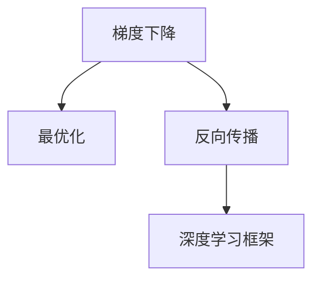
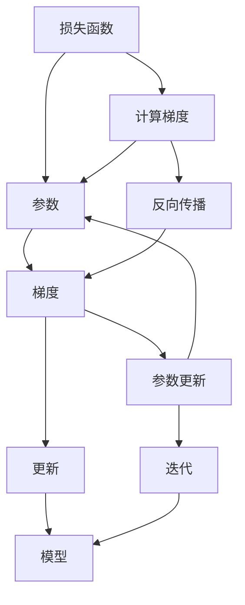

                 

# 梯度下降Gradient Descent原理与代码实例讲解

> 关键词：梯度下降, 最优化, 机器学习, 反向传播, 深度学习, 算法步骤, 数学推导, 深度学习框架, 应用实例, 资源推荐

## 1. 背景介绍

### 1.1 问题由来

梯度下降（Gradient Descent）是一种经典的优化算法，广泛应用于机器学习、深度学习等多个领域，用于求解模型参数的最优值，使得损失函数最小化。梯度下降通过不断更新模型参数，逐步逼近最优解，是现代机器学习算法中最基础、最核心的技术之一。

### 1.2 问题核心关键点

梯度下降的核心理念是通过计算损失函数对模型参数的梯度（Gradient），来确定参数的更新方向和步长。具体来说，每次迭代中，模型参数被更新为当前位置的梯度负方向加上一定的步长，直到损失函数达到最小值或者达到预设的迭代次数。

梯度下降算法主要包括批量梯度下降（Batch Gradient Descent）、随机梯度下降（Stochastic Gradient Descent）和小批量梯度下降（Mini-batch Gradient Descent）等变种。每种变体在计算梯度和更新参数时的策略不同，适用于不同的场景和数据量。

### 1.3 问题研究意义

研究梯度下降算法，对于理解现代机器学习算法的核心原理和优化技术，具有重要的理论意义。此外，梯度下降算法在深度学习中发挥着关键作用，是构建和训练神经网络模型的基础技术，对实际应用中的算法优化和模型调优具有重要的指导价值。

## 2. 核心概念与联系

### 2.1 核心概念概述

- **梯度下降**：一种通过计算损失函数对模型参数的梯度，来更新模型参数的优化算法。通过不断迭代，使得损失函数最小化。
- **最优化**：寻找函数的最小值或最大值，通常用于优化机器学习模型的参数。
- **反向传播**：深度学习中计算梯度的一种方法，通过反向传播算法，可以高效计算复杂神经网络的梯度。
- **深度学习框架**：如TensorFlow、PyTorch等，提供了梯度下降算法的实现，简化了模型的构建和训练。

这些核心概念之间有着密切的联系，梯度下降作为最优化问题的一个常用方法，在反向传播中扮演着关键角色。深度学习框架则提供了高效实现梯度下降算法的工具。

### 2.2 概念间的关系

以下通过几个流程图展示这些核心概念之间的联系：



这个流程图展示了梯度下降在最优化和反向传播中的作用，以及深度学习框架对梯度下降的实现。

### 2.3 核心概念的整体架构

以下是一个综合的流程图，展示梯度下降算法的整体架构：



这个流程图展示了梯度下降从损失函数计算梯度，到参数更新，再到模型迭代的完整过程。

## 3. 核心算法原理 & 具体操作步骤
### 3.1 算法原理概述

梯度下降算法的核心思想是通过迭代更新模型参数，逐步逼近最优解。具体来说，每次迭代中，模型参数被更新为当前位置的梯度负方向加上一定的步长，直到损失函数达到最小值或者达到预设的迭代次数。

梯度下降算法的步骤包括：

1. 初始化模型参数。
2. 计算损失函数对模型参数的梯度。
3. 更新模型参数。
4. 迭代更新，直到达到预设的停止条件。

### 3.2 算法步骤详解

以批量梯度下降（Batch Gradient Descent）为例，详细解释梯度下降算法的具体操作步骤：

1. **初始化模型参数**：设定模型参数的初始值 $\theta_0$。
2. **计算损失函数**：计算当前参数下的损失函数 $J(\theta)$。
3. **计算梯度**：计算损失函数对参数的梯度 $\nabla_{\theta} J(\theta)$。
4. **更新参数**：更新参数 $\theta$：
   $$
   \theta_{t+1} = \theta_t - \eta \nabla_{\theta} J(\theta_t)
   $$
   其中 $\eta$ 为学习率，控制每次更新的步长大小。
5. **迭代更新**：重复步骤 2-4，直到达到预设的停止条件，如达到最大迭代次数、损失函数变化小于预设阈值等。

### 3.3 算法优缺点

梯度下降算法具有以下优点：

1. 算法简单，易于理解和实现。
2. 能够处理大规模数据，适用于多维空间和复杂模型。
3. 收敛速度快，通常能够快速收敛到最优解。

但梯度下降算法也存在以下缺点：

1. 需要选择合适的学习率 $\eta$，过小会导致收敛速度慢，过大可能导致震荡甚至发散。
2. 对数据分布和初始值敏感，可能会陷入局部最优解。
3. 需要存储大量的中间梯度信息，计算复杂度较高。

### 3.4 算法应用领域

梯度下降算法广泛应用于机器学习和深度学习领域，具体包括：

- 线性回归和逻辑回归
- 神经网络
- 支持向量机
- 主成分分析（PCA）
- 深度学习中的反向传播算法

## 4. 数学模型和公式 & 详细讲解 & 举例说明

### 4.1 数学模型构建

假设我们有一个简单的线性回归模型：
$$
y = \theta^T x + \epsilon
$$
其中 $x$ 为输入特征向量，$y$ 为输出标签，$\theta$ 为模型参数，$\epsilon$ 为噪声。我们的目标是最小化损失函数 $J(\theta)$，通常使用均方误差（MSE）损失函数：
$$
J(\theta) = \frac{1}{2N} \sum_{i=1}^N (y_i - \theta^T x_i)^2
$$
其中 $N$ 为样本数。

### 4.2 公式推导过程

对损失函数 $J(\theta)$ 对 $\theta$ 求导，得到梯度：
$$
\nabla_{\theta} J(\theta) = \frac{1}{N} \sum_{i=1}^N (y_i - \theta^T x_i) x_i
$$

使用梯度下降更新模型参数：
$$
\theta_{t+1} = \theta_t - \eta \nabla_{\theta} J(\theta_t)
$$

### 4.3 案例分析与讲解

以线性回归模型为例，展示梯度下降的数学推导和代码实现。

首先，我们需要定义模型参数 $\theta$ 和损失函数 $J(\theta)$：

```python
import numpy as np

# 定义模型参数
theta = np.random.randn(2)

# 定义损失函数
def J(theta):
    y_pred = theta.dot(X) + b
    return (1 / 2 * (y_pred - y) ** 2).sum()
```

然后，我们计算梯度并使用梯度下降更新参数：

```python
# 计算梯度
def gradient(theta):
    return (1 / N) * (y_pred - y) * X

# 更新参数
def gradient_descent(theta, learning_rate, num_iters):
    for i in range(num_iters):
        grad = gradient(theta)
        theta -= learning_rate * grad
        print(f"Iteration {i+1}, loss: {J(theta)}")
    return theta
```

最后，我们调用 `gradient_descent` 函数进行迭代更新：

```python
# 随机生成数据
N = 1000
X = np.random.randn(N, 2)
y = np.dot(X, theta) + b + np.random.randn(N)

# 初始化模型参数
theta_init = np.random.randn(2)

# 使用梯度下降更新参数
theta_opt = gradient_descent(theta_init, 0.01, 1000)
print(f"Optimal parameters: {theta_opt}")
```

## 5. 项目实践：代码实例和详细解释说明

### 5.1 开发环境搭建

要使用梯度下降算法，首先需要安装必要的Python库，如NumPy、SciPy等。以下是安装步骤：

1. 安装Anaconda：
```bash
conda install anaconda
```

2. 创建Python虚拟环境：
```bash
conda create --name myenv python=3.8
conda activate myenv
```

3. 安装必要的库：
```bash
conda install numpy scipy matplotlib
```

### 5.2 源代码详细实现

以下是一个简单的梯度下降算法实现，用于线性回归模型训练：

```python
import numpy as np

# 定义模型参数
theta = np.random.randn(2)

# 定义损失函数
def J(theta):
    y_pred = theta.dot(X) + b
    return (1 / 2 * (y_pred - y) ** 2).sum()

# 计算梯度
def gradient(theta):
    return (1 / N) * (y_pred - y) * X

# 更新参数
def gradient_descent(theta, learning_rate, num_iters):
    for i in range(num_iters):
        grad = gradient(theta)
        theta -= learning_rate * grad
        print(f"Iteration {i+1}, loss: {J(theta)}")
    return theta

# 随机生成数据
N = 1000
X = np.random.randn(N, 2)
y = np.dot(X, theta) + b + np.random.randn(N)

# 初始化模型参数
theta_init = np.random.randn(2)

# 使用梯度下降更新参数
theta_opt = gradient_descent(theta_init, 0.01, 1000)
print(f"Optimal parameters: {theta_opt}")
```

### 5.3 代码解读与分析

1. **模型定义**：首先定义模型参数 $\theta$ 和损失函数 $J(\theta)$，其中 $X$ 和 $y$ 分别表示输入特征和标签。
2. **梯度计算**：定义计算梯度的函数 `gradient`，使用均方误差损失函数对模型参数求导。
3. **参数更新**：定义参数更新函数 `gradient_descent`，通过梯度下降算法更新模型参数。
4. **数据生成**：随机生成数据，用于训练模型。
5. **迭代更新**：调用 `gradient_descent` 函数进行迭代更新，并打印每次迭代的损失函数值。

### 5.4 运行结果展示

运行上述代码，可以观察到随着迭代次数的增加，损失函数值逐渐减小，模型参数逐渐逼近最优解。

## 6. 实际应用场景

### 6.1 线性回归

梯度下降算法在线性回归模型中得到广泛应用。在数据集规模较小的情况下，梯度下降算法能够快速收敛到最优解。

### 6.2 深度学习中的反向传播

梯度下降算法是深度学习中的核心技术，通过反向传播算法，能够高效计算复杂神经网络的梯度。

### 6.3 支持向量机

梯度下降算法可以用于支持向量机的参数求解，在分类问题中广泛应用。

### 6.4 未来应用展望

未来，梯度下降算法将继续在机器学习和深度学习中发挥重要作用。随着算力的提升和模型复杂度的增加，梯度下降算法的应用场景将更加广泛，特别是在大规模数据集和多维特征空间中的优化问题中。

## 7. 工具和资源推荐

### 7.1 学习资源推荐

- 《Deep Learning》：Ian Goodfellow, Yoshua Bengio, Aaron Courville 著，是深度学习的经典教材，详细介绍了梯度下降算法。
- Coursera深度学习课程：由Andrew Ng教授讲授，系统讲解了深度学习中的核心算法和应用。
- TensorFlow官方文档：提供详细的使用指南和API文档，是梯度下降算法的实现工具。

### 7.2 开发工具推荐

- PyTorch：简单易用的深度学习框架，支持梯度下降算法的实现。
- TensorFlow：强大的深度学习框架，提供了高效的梯度计算和模型优化工具。
- Jupyter Notebook：Python的交互式开发环境，方便代码调试和数据分析。

### 7.3 相关论文推荐

- J. Nocedal, S. J. Wright, "Numerical Optimization"：经典优化算法教材，详细讲解了梯度下降算法的数学基础和应用技巧。
- Y. Bengio, I. Goodfellow, A. Courville, "Deep Learning"：深度学习的经典教材，介绍了梯度下降算法在深度学习中的核心作用。

## 8. 总结：未来发展趋势与挑战

### 8.1 研究成果总结

梯度下降算法作为机器学习和深度学习中的核心算法，具有重要的理论意义和实际应用价值。通过不断优化和改进，梯度下降算法在优化问题中发挥了关键作用，推动了现代机器学习技术的发展。

### 8.2 未来发展趋势

未来，梯度下降算法将在以下几个方面继续发展：

1. 算法优化：进一步提升梯度下降算法的收敛速度和稳定性。
2. 应用拓展：将梯度下降算法应用到更多的优化问题中，如强化学习、图像识别等。
3. 硬件加速：利用GPU、TPU等高性能硬件，加速梯度计算和参数更新。

### 8.3 面临的挑战

虽然梯度下降算法具有广泛的应用，但在实际应用中仍面临以下挑战：

1. 收敛速度：在某些高维空间中，梯度下降算法可能需要较长的迭代次数才能收敛。
2. 过拟合问题：在高维空间中，梯度下降算法可能陷入局部最优解，导致过拟合。
3. 计算复杂度：在处理大规模数据集时，梯度计算和参数更新可能导致计算复杂度较高。

### 8.4 研究展望

未来，研究梯度下降算法需要重点关注以下几个方面：

1. 算法优化：研究更加高效的优化算法，如随机梯度下降、Adam等，提升收敛速度和稳定性。
2. 模型结构：研究更加鲁棒的模型结构，如正则化、神经网络结构等，避免过拟合和局部最优解。
3. 硬件加速：研究更加高效的硬件实现，如GPU、TPU等，提升计算效率。

## 9. 附录：常见问题与解答

### Q1: 梯度下降算法中的学习率 $\eta$ 如何选择？

A: 学习率 $\eta$ 的选择对梯度下降算法的性能有很大影响。通常通过实验来确定学习率，如从 $10^{-4}$ 开始，逐步增加学习率，观察损失函数的变化。如果损失函数在迭代过程中持续下降，则说明学习率过大；如果损失函数在迭代过程中波动较大，则说明学习率过小。

### Q2: 梯度下降算法中的学习率衰减策略是什么？

A: 学习率衰减（Learning Rate Decay）策略可以在迭代过程中逐渐减小学习率，避免过拟合和震荡。常见的学习率衰减策略包括固定衰减（Fixed Decay）、指数衰减（Exponential Decay）和余弦衰减（Cosine Decay）等。

### Q3: 梯度下降算法中的正则化技术有哪些？

A: 正则化技术（Regularization）可以避免梯度下降算法过拟合。常见的正则化技术包括L1正则化（L1 Regularization）和L2正则化（L2 Regularization）等。

### Q4: 梯度下降算法中的损失函数有哪些常见类型？

A: 常见的损失函数包括均方误差（Mean Squared Error, MSE）、交叉熵（Cross Entropy）、对数似然（Log-Likelihood）等。不同任务选择不同的损失函数。

### Q5: 梯度下降算法中的迭代次数如何设置？

A: 迭代次数（Number of Iterations）是梯度下降算法的一个重要参数。通常通过实验来确定迭代次数，以确保损失函数收敛。同时，可以设置停止条件，如损失函数变化小于预设阈值，提前停止迭代。

