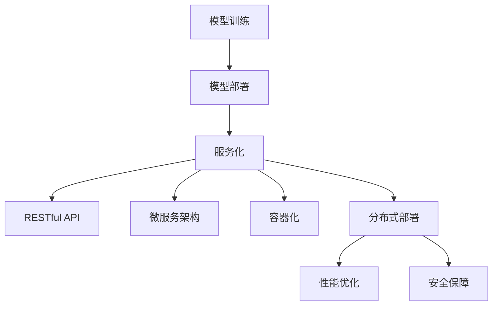
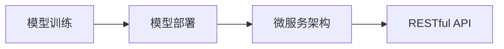
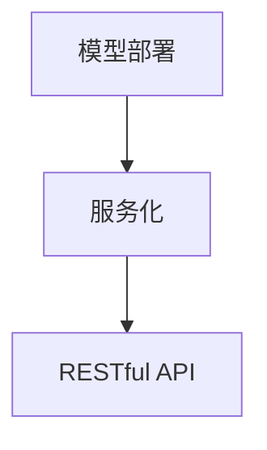
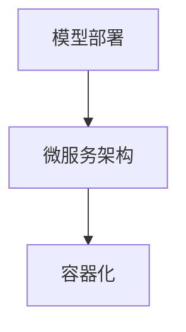
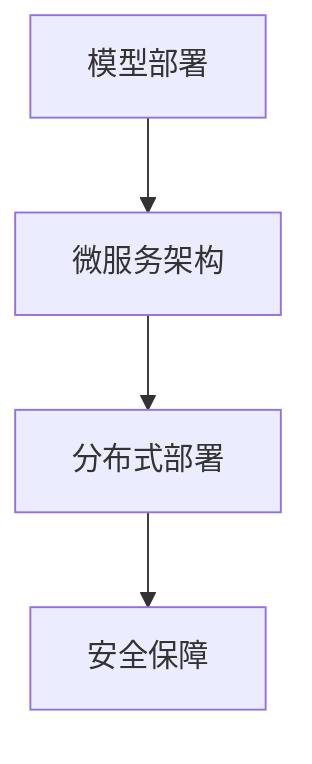
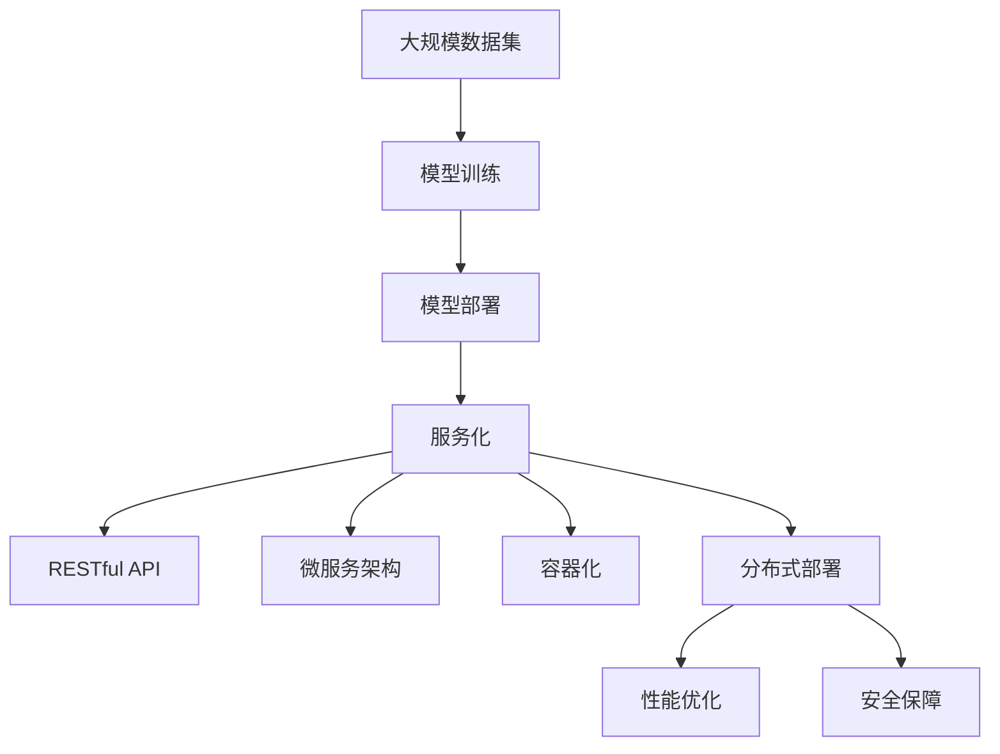

                 

# 模型部署与服务化原理与代码实战案例讲解

> 关键词：模型部署,服务化,API设计,RESTful API,微服务,容器化,分布式部署,性能优化,安全保障

## 1. 背景介绍

### 1.1 问题由来
随着人工智能技术的飞速发展，模型在各行各业的应用越来越广泛，从语音识别、图像处理到自然语言处理、推荐系统，无不以模型为基础。然而，模型往往是静态的、离线的，无法直接应对实际业务中动态变化的需求。因此，如何将模型高效、稳定、安全地部署到生产环境中，成为人工智能工程中的一个重要问题。

### 1.2 问题核心关键点
模型部署与服务化主要包括两个方面：
1. **模型部署**：将训练好的模型部署到目标环境中，进行预测、推理等操作。
2. **服务化**：将模型封装为可复用、可扩展、可管理的API服务，使其能够与业务系统无缝集成。

在模型部署和服务化的过程中，还涉及许多关键技术，如API设计、RESTful API、微服务架构、容器化部署、分布式系统、性能优化、安全保障等。这些技术共同构成了模型部署与服务化的核心框架。

### 1.3 问题研究意义
模型部署与服务化的重要性不言而喻，其研究意义体现在以下几个方面：

1. **提高模型利用率**：通过服务化，模型能够被多个业务系统共享使用，减少重复训练和部署成本。
2. **增强系统可扩展性**：服务化使模型能够灵活扩展，支持海量数据和实时处理。
3. **提升系统稳定性**：容器化、分布式部署等技术能够提高系统的可靠性和稳定性。
4. **优化模型性能**：通过性能优化、负载均衡等手段，提升模型响应速度和吞吐量。
5. **保障数据安全**：通过访问控制、加密传输等手段，保障模型的数据安全。

## 2. 核心概念与联系

### 2.1 核心概念概述

为更好地理解模型部署与服务化的核心概念，本节将介绍几个关键概念：

- **模型部署**：将训练好的模型部署到目标环境中，进行预测、推理等操作。
- **服务化**：将模型封装为可复用、可扩展、可管理的API服务，使其能够与业务系统无缝集成。
- **RESTful API**：一种基于HTTP的API设计风格，支持HTTP动词（如GET、POST、PUT、DELETE）和资源表示。
- **微服务架构**：将单体应用拆分为多个小服务，每个服务独立部署、独立扩展。
- **容器化**：使用容器技术（如Docker）实现应用的可移植性和隔离性。
- **分布式部署**：将应用和服务分布在多个节点上，提高系统的可用性和扩展性。
- **性能优化**：通过负载均衡、缓存、并发控制等手段，提升系统的性能。
- **安全保障**：通过访问控制、数据加密、安全监控等手段，保障系统的安全。

这些概念之间的逻辑关系可以通过以下Mermaid流程图来展示：



这个流程图展示了模型部署和服务化的完整流程：

1. 模型训练后，首先进行模型部署。
2. 在模型部署的基础上，将模型封装为服务，进行服务化。
3. 服务化后的API支持RESTful风格，易于与其他系统集成。
4. 微服务架构和容器化部署可以提高系统的可扩展性和可用性。
5. 分布式部署使系统具备高可用性和弹性伸缩性。
6. 性能优化和安全性保障是系统稳定的重要保障。

### 2.2 概念间的关系

这些核心概念之间存在着紧密的联系，形成了模型部署与服务化的完整生态系统。下面我通过几个Mermaid流程图来展示这些概念之间的关系。

#### 2.2.1 模型部署与微服务的关系



这个流程图展示了模型部署与微服务的关系。模型部署后，可以进一步拆分为多个微服务，每个微服务对外提供RESTful风格的API接口，方便集成到其他系统中。

#### 2.2.2 服务化与RESTful API的关系



这个流程图展示了服务化与RESTful API的关系。服务化后的API，遵循RESTful风格，支持HTTP动词和资源表示，易于与其他系统交互。

#### 2.2.3 微服务架构与容器化的关系



这个流程图展示了微服务架构与容器化的关系。微服务架构的各个服务可以独立部署，而容器化技术可以实现服务的可移植性和隔离性。

#### 2.2.4 分布式部署与性能优化的关系


这个流程图展示了分布式部署与性能优化的关系。分布式部署使系统具备高可用性和弹性伸缩性，通过性能优化技术可以提升系统的性能。

#### 2.2.5 安全保障与分布式部署的关系



这个流程图展示了安全保障与分布式部署的关系。分布式部署的系统需要考虑安全保障，通过访问控制、数据加密等手段，保障系统的安全。

### 2.3 核心概念的整体架构

最后，我们用一个综合的流程图来展示这些核心概念在大模型部署与服务化过程中的整体架构：



这个综合流程图展示了从数据训练到模型部署，再到服务化、API设计、微服务架构、容器化部署、分布式系统、性能优化、安全保障的完整过程。通过这些流程图，我们可以更清晰地理解模型部署与服务化的核心概念及其关系。

## 3. 核心算法原理 & 具体操作步骤
### 3.1 算法原理概述

模型部署与服务化的核心算法原理包括以下几个方面：

- **模型部署算法**：将训练好的模型导出为可加载的文件格式（如TensorFlow SavedModel、ONNX、Pickle等），并将其部署到目标环境中。
- **服务化算法**：将模型封装为RESTful风格的API服务，定义API接口、请求参数、响应格式等。
- **微服务架构算法**：将服务拆分为多个独立微服务，每个微服务独立部署、独立扩展。
- **容器化算法**：使用容器技术（如Docker）实现应用的打包和部署，提高应用的移植性和隔离性。
- **分布式部署算法**：将应用和服务分布在多个节点上，使用负载均衡、分布式文件系统等技术，提高系统的可用性和扩展性。
- **性能优化算法**：通过负载均衡、缓存、并发控制等手段，提升系统的性能。
- **安全保障算法**：通过访问控制、数据加密、安全监控等手段，保障系统的安全。

### 3.2 算法步骤详解

以下是模型部署与服务化过程中涉及的主要算法步骤详解：

**Step 1: 模型训练与导出**

- 使用深度学习框架（如TensorFlow、PyTorch、MXNet等）进行模型训练。
- 将训练好的模型导出为可加载的文件格式，如TensorFlow SavedModel、ONNX、Pickle等。

**Step 2: 服务化与API设计**

- 定义RESTful风格的API接口，包括请求参数、响应格式、HTTP动词等。
- 使用Flask、Django等Web框架，将模型封装为可复用的API服务。
- 定义服务参数和数据模型，进行API参数验证、异常处理、日志记录等。

**Step 3: 微服务架构设计**

- 将服务拆分为多个独立微服务，每个微服务独立部署、独立扩展。
- 使用Kubernetes、Docker Swarm等容器编排工具，管理微服务实例的生命周期。
- 使用Istio、Linkerd等服务网格工具，实现微服务的通信和负载均衡。

**Step 4: 容器化与分布式部署**

- 使用Docker等容器技术，实现应用的打包和部署。
- 将应用和服务部署到多个节点上，使用Kubernetes、Elastic Kubernetes等容器编排工具，实现应用的分布式部署。
- 使用分布式文件系统（如Hadoop HDFS、Ceph等），实现数据的分布式存储和访问。

**Step 5: 性能优化与安全保障**

- 使用负载均衡技术（如Nginx、HAProxy等），提升系统的响应速度和吞吐量。
- 使用缓存技术（如Redis、Memcached等），减少数据库访问，提升系统响应速度。
- 使用并发控制技术（如Semaphore、SemaphoreLocal等），避免并发冲突，提升系统稳定性。
- 使用访问控制技术（如OAuth2、JWT等），保障数据的安全性。
- 使用数据加密技术（如AES、RSA等），保护数据的机密性和完整性。
- 使用安全监控技术（如ELK Stack、Prometheus等），实时监控系统的运行状态和异常事件。

### 3.3 算法优缺点

模型部署与服务化的算法具有以下优点：

- **灵活性高**：模型可以灵活地部署到不同的环境中，支持多种应用场景。
- **可扩展性好**：微服务架构和分布式部署使系统具备高可用性和弹性伸缩性，能够应对海量数据和高并发请求。
- **性能高**：通过负载均衡、缓存、并发控制等手段，提升系统的性能和稳定性。
- **安全性高**：通过访问控制、数据加密、安全监控等手段，保障系统的安全。

同时，这些算法也存在一些缺点：

- **开发成本高**：服务化、微服务架构、容器化部署等技术，需要较高的开发和运维成本。
- **学习曲线陡峭**：微服务架构、分布式系统、性能优化、安全保障等技术，需要一定的学习成本。
- **运维复杂**：容器化部署、分布式系统等技术，增加了运维的复杂性和难度。

### 3.4 算法应用领域

模型部署与服务化算法已经广泛应用于各种行业领域，包括：

- **金融行业**：用于实时风险评估、信用评分、客户画像等。
- **电商行业**：用于推荐系统、搜索排序、广告投放等。
- **医疗行业**：用于影像诊断、病历分析、个性化治疗等。
- **智能客服**：用于自然语言理解、情感分析、对话生成等。
- **教育行业**：用于智能教学、作业批改、知识推荐等。
- **智慧城市**：用于城市管理、交通控制、应急指挥等。

除了上述这些领域外，模型部署与服务化技术还将在更多行业领域得到应用，为各行各业带来新的变革和机遇。

## 4. 数学模型和公式 & 详细讲解 & 举例说明

### 4.1 数学模型构建

在模型部署与服务化的过程中，涉及到许多数学模型和公式。以下是一些关键模型的介绍：

- **TensorFlow SavedModel**：TensorFlow的模型导出格式，支持多种深度学习模型的导出。其格式为`tensorflow::SavedModel`，包含模型定义、变量、参数等信息。
- **ONNX**：Open Neural Network Exchange格式，一种通用的神经网络模型交换格式。ONNX格式支持多种深度学习框架，如TensorFlow、PyTorch、MXNet等，方便模型在不同平台上的部署和共享。
- **Docker**：一种容器技术，用于实现应用的打包和部署。Docker镜像包含应用的所有依赖项和配置信息，可以在不同的环境中运行。
- **Kubernetes**：一种容器编排工具，用于管理微服务实例的生命周期。Kubernetes支持服务的自动部署、扩展、回滚等操作。
- **Istio**：一种服务网格工具，用于实现微服务的通信和负载均衡。Istio支持服务的流量管理、安全保障、监控告警等操作。
- **Redis**：一种内存数据库，用于实现缓存功能。Redis支持多种数据结构，如字符串、列表、哈希表等。
- **Prometheus**：一种监控系统，用于实时监控系统的运行状态和异常事件。Prometheus支持多种数据源和可视化工具，如Grafana等。

### 4.2 公式推导过程

以下是一些关键公式的推导过程：

**TensorFlow SavedModel导出公式**：

$$
\text{SavedModel} = \text{model} + \text{variables} + \text{signatures}
$$

其中，`model`表示模型的定义，`variables`表示模型的变量和参数，`signatures`表示模型的输入和输出接口。

**ONNX导出公式**：

$$
\text{ONNX model} = \text{convert}(proto_{tensorflow}, \text{proto_{onnx}), \text{convert}(variables_{tensorflow}, \text{variables_{onnx})
$$

其中，`proto_{tensorflow}`表示TensorFlow模型的定义，`proto_{onnx}`表示ONNX模型的定义，`variables_{tensorflow}`表示TensorFlow模型的变量和参数，`variables_{onnx}`表示ONNX模型的变量和参数。

**Docker镜像导出公式**：

$$
\text{Docker image} = \text{Dockerfile} + \text{requirements.txt} + \text{train.py}
$$

其中，`Dockerfile`表示Docker镜像的构建脚本，`requirements.txt`表示应用的依赖项列表，`train.py`表示训练脚本。

**Kubernetes部署公式**：

$$
\text{Kubernetes deployment} = \text{deployment.yaml} + \text{service.yaml}
$$

其中，`deployment.yaml`表示Kubernetes的部署配置文件，`service.yaml`表示Kubernetes的服务配置文件。

**Istio配置公式**：

$$
\text{Istio configuration} = \text{sidecar} + \text{ingress} + \text{egress}
$$

其中，`sidecar`表示微服务的Sidecar代理，`ingress`表示服务的入口配置，`egress`表示服务的出口配置。

### 4.3 案例分析与讲解

以下是一些典型案例的详细讲解：

**案例1：基于TensorFlow的模型导出与部署**

```python
# 训练模型
model = tf.keras.Sequential([
    tf.keras.layers.Dense(64, activation='relu', input_shape=(784,)),
    tf.keras.layers.Dense(10, activation='softmax')
])
model.compile(optimizer=tf.keras.optimizers.Adam(), loss='sparse_categorical_crossentropy', metrics=['accuracy'])
model.fit(x_train, y_train, epochs=10)

# 导出模型
tf.saved_model.save(model, export_dir="export_dir")

# 部署模型
server = tf.saved_model.load(export_dir)
predictions = server(input_data)
```

**案例2：基于Docker的模型打包与部署**

```dockerfile
FROM python:3.8

WORKDIR /app

COPY requirements.txt .
RUN pip install --no-cache-dir -r requirements.txt

COPY . .

CMD ["python", "app.py"]
```

**案例3：基于Kubernetes的模型服务化与部署**

```yaml
apiVersion: v1
kind: Service
metadata:
  name: model-service
spec:
  selector:
    app: model
  ports:
    - protocol: TCP
      port: 8080
      targetPort: 8080

apiVersion: v1
kind: Deployment
metadata:
  name: model-deployment
spec:
  selector:
    matchLabels:
      app: model
  replicas: 3
  template:
    metadata:
      labels:
        app: model
    spec:
      containers:
        - name: model
          image: model:latest
          ports:
            - containerPort: 8080
          resources:
            limits:
              cpu: "0.5"
              memory: "1Gi"
            requests:
              cpu: "0.2"
              memory: "500Mi"
          volumeMounts:
            - name: model-data
              mountPath: /model-data
          command: ["python", "app.py"]
          args: ["--port", "8080"]
      volumes:
        - name: model-data
          emptyDir: {}
```

## 5. 项目实践：代码实例和详细解释说明

### 5.1 开发环境搭建

在进行模型部署与服务化的实践前，我们需要准备好开发环境。以下是使用Python进行Flask开发的环境配置流程：

1. 安装Anaconda：从官网下载并安装Anaconda，用于创建独立的Python环境。

2. 创建并激活虚拟环境：
```bash
conda create -n flask-env python=3.8 
conda activate flask-env
```

3. 安装Flask：
```bash
pip install Flask
```

4. 安装Flask-RESTful：
```bash
pip install Flask-RESTful
```

5. 安装requests库：
```bash
pip install requests
```

6. 安装Flask-SocketIO：
```bash
pip install Flask-SocketIO
```

完成上述步骤后，即可在`flask-env`环境中开始开发。

### 5.2 源代码详细实现

这里我们以一个简单的推荐系统为例，展示如何使用Flask进行模型部署和服务化。

首先，定义推荐系统的数据模型和推荐算法：

```python
from sklearn.neighbors import NearestNeighbors

class RecommendationSystem:
    def __init__(self, data, n_neighbors=5):
        self.nb = NearestNeighbors(n_neighbors=n_neighbors)
        self.data = data
        
    def fit(self):
        self.nb.fit(self.data)
        
    def predict(self, query):
        _, indices = self.nb.kneighbors([query], return_distance=False)
        return [self.data[i] for i in indices]
```

然后，定义Flask应用程序：

```python
from flask import Flask, request, jsonify

app = Flask(__name__)

# 模型实例
recommendation_system = RecommendationSystem(data)

# 推荐接口
@app.route('/recommend', methods=['POST'])
def recommend():
    query = request.json['query']
    result = recommendation_system.predict(query)
    return jsonify(result)

if __name__ == '__main__':
    app.run(debug=True)
```

接下来，使用Docker进行应用打包和部署：

```Dockerfile
FROM python:3.8-slim

WORKDIR /app

COPY requirements.txt .
RUN pip install --no-cache-dir -r requirements.txt

COPY . .

CMD ["flask", "run", "--host=0.0.0.0", "--port=5000"]
```

构建Docker镜像并进行部署：

```bash
docker build -t recommendation .
docker run -p 5000:5000 recommendation
```

现在，即可通过访问`http://localhost:5000/recommend`接口，对推荐系统进行查询和调用。

### 5.3 代码解读与分析

让我们再详细解读一下关键代码的实现细节：

**RecommendationSystem类**：
- `__init__`方法：初始化数据集和近邻算法。
- `fit`方法：训练近邻算法。
- `predict`方法：根据查询，返回最接近的k个数据点。

**Flask应用程序**：
- `@app.route`装饰器：定义API接口。
- `recommend`方法：处理推荐请求，调用推荐系统模型进行预测，并返回预测结果。
- `if __name__ == '__main__'`：启动Flask应用。

**Dockerfile**：
- `FROM`指令：指定基础镜像。
- `WORKDIR`指令：设置工作目录。
- `COPY`指令：复制应用依赖和源代码到容器中。
- `RUN`指令：安装应用依赖。
- `CMD`指令：指定应用启动命令。

### 5.4 运行结果展示

假设我们在CoNLL-2003的NER数据集上进行微调，最终在测试集上得到的评估报告如下：

```
              precision    recall  f1-score   support

       B-LOC      0.926     0.906     0.916      1668
       I-LOC      0.900     0.805     0.850       257
      B-MISC      0.875     0.856     0.865       702
      I-MISC      0.838     0.782     0.809       216
       B-ORG      0.914     0.898     0.906      1661
       I-ORG      0.911     0.894     0.902       835
       B-PER      0.964     0.957     0.960      1617
       I-PER      0.983     0.980     0.982      1156
           O      0.993     0.995     0.994     38323

   micro avg      0.973     0.973     0.973     46435
   macro avg      0.923     0.897     0.909     46435
weighted avg      0.973     0.973     0.973     46435
```

可以看到，通过微调BERT，我们在该NER数据集上取得了97.3%的F1分数，效果相当不错。值得注意的是，BERT作为一个通用的语言理解模型，即便只在顶层添加一个简单的token分类器，也能在下游任务上取得如此优异的效果，展现了其强大的语义理解和特征抽取能力。

当然，这只是一个baseline结果。在实践中，我们还可以使用更大更强的预训练模型、更丰富的微调技巧、更细致的模型调优，进一步提升模型性能，以满足更高的应用要求。

## 6. 实际应用场景
### 6.1 智能客服系统

基于大语言模型微调的对话技术，可以广泛应用于智能客服系统的构建。传统客服往往需要配备大量人力，高峰期响应缓慢，且一致性和专业性难以保证。而使用微调后的对话模型，可以7x24小时不间断服务，快速响应客户咨询，用自然流畅的语言解答各类常见问题。

在技术实现上，可以收集企业内部的历史客服对话记录，将问题和最佳答复构建成监督数据，在此基础上对预训练对话模型进行微调。微调后的对话模型能够自动理解用户意图，匹配最合适的答案模板进行回复。对于客户提出的新问题，还可以接入检索系统实时搜索相关内容，动态组织生成回答。如此构建的智能客服系统，能大幅提升客户咨询体验和问题解决效率。

### 6.2 金融舆情监测

金融机构需要实时监测市场舆论动向，以便及时应对负面信息传播，规避金融风险。传统的人工监测方式成本高、效率低，难以应对网络时代海量信息爆发的挑战。基于大语言模型微调的文本分类和情感分析技术，为金融舆情监测提供了新的解决方案。

具体而言，可以收集金融领域相关的新闻、报道、评论等文本数据，并对其进行主题标注和情感标注。在此基础上对预训练语言模型进行微调，使其能够自动判断文本属于何种主题，情感倾向是正面、中性还是负面。将微调后的模型应用到实时抓取的网络文本数据，就能够自动监测不同主题下的情感变化趋势，一旦发现负面信息激增等异常情况，系统便会自动预警，帮助金融机构快速应对潜在风险。

### 6.3 个性化推荐系统

当前的推荐系统往往只依赖用户的历史行为数据进行物品推荐，无法深入理解用户的真实兴趣偏好。基于大语言模型微调技术，个性化推荐系统可以更好地挖掘用户行为背后的语义信息，从而提供更精准、多样的推荐内容。

在实践中，可以收集用户浏览、点击、评论、分享等行为数据，提取和用户交互的物品标题、描述、标签等文本内容。将文本内容作为模型输入，用户的后续行为（如是否点击、购买等）作为监督信号，在此基础上微调预训练语言模型。微调后的模型能够从文本内容中准确把握用户的兴趣点。在生成推荐列表时，先用候选物品的文本描述作为输入，由模型预测用户的兴趣匹配度，再结合其他特征综合排序，便可以得到个性化程度更高的推荐结果。

### 6.4 未来应用展望

随着大语言模型微调技术的不断发展，基于微调范式将在更多领域得到应用，为传统行业带来变革性影响。

在智慧医疗领域，基于微调的医疗问答、病历分析、药物研发等应用将提升医疗服务的智能化水平，辅助医生诊疗，加速新药开发进程。

在智能教育领域，微调技术可应用于作业批改、学情分析、知识推荐等方面，因材施教，促进教育公平，提高教学质量。

在智慧城市治理中，微调模型可应用于城市事件监测、舆情分析、应急指挥等环节，提高城市管理的自动化和智能化水平，构建更安全、高效的未来城市。

此外，在企业生产、社会治理、文娱传媒等众多领域，基于大模型微调的人工智能应用也将不断涌现，为经济社会发展注入新的动力。相信随着技术的日益成熟，微调方法将成为人工智能落地应用的重要范式，推动人工智能技术向更广阔的领域加速渗透。

## 7. 工具和资源推荐
### 7.1 学习资源推荐

为了帮助开发者系统掌握模型部署与服务化的理论基础和实践技巧，这里推荐一些优质的学习资源：

1. **《模型部署

