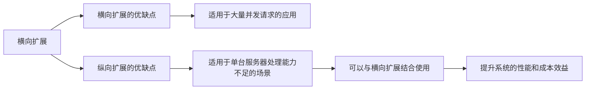
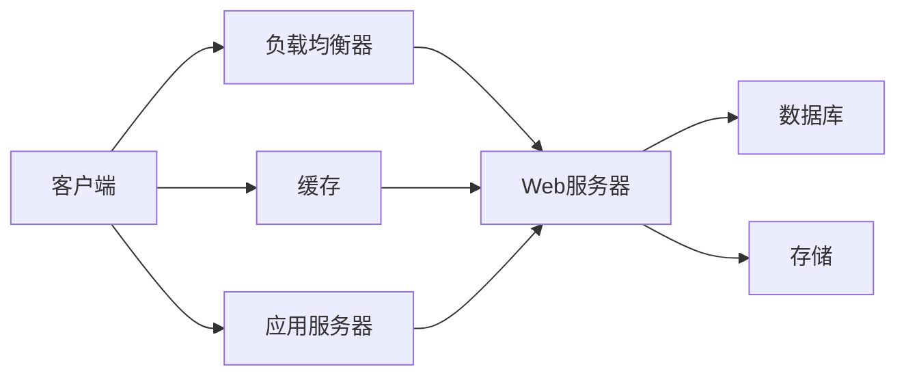

                 

# 横向扩展与纵向扩展的实际应用

> 关键词：横向扩展,纵向扩展,分布式系统,NoSQL数据库,微服务架构,DevOps实践

## 1. 背景介绍

### 1.1 问题由来
随着互联网应用的飞速发展，单体应用已经难以满足日益增长的业务需求和复杂的系统架构。因此，如何有效地管理和扩展应用系统，成为当今IT行业关注的焦点。横向扩展和纵向扩展是两种常见的扩展方式，它们在应对不同的业务场景时，有着不同的优势和劣势。理解它们的原理和实际应用场景，对提高系统的可扩展性和可用性具有重要意义。

### 1.2 问题核心关键点
本文将详细介绍横向扩展和纵向扩展的基本概念、原理及其实际应用，并结合DevOps实践和NoSQL数据库技术，讨论如何通过微服务架构实现系统的平滑扩展。

## 2. 核心概念与联系

### 2.1 核心概念概述

#### 2.1.1 横向扩展（Horizontal Scaling）
横向扩展指的是通过添加更多的计算资源（如服务器）来增加系统处理能力。这种方式通常适用于应用需要处理大量并发请求，但单体应用难以应对的场景。横向扩展的优点是能够快速应对业务增长，缺点是需要平衡负载，避免资源浪费。

#### 2.1.2 纵向扩展（Vertical Scaling）
纵向扩展指的是通过增加单台服务器的硬件配置（如CPU、内存、存储）来提升系统性能。这种方式适用于处理能力不足但无法通过横向扩展解决的场景。纵向扩展的优点是能够快速提升单台服务器的性能，缺点是扩展上限有限，且单点故障风险较大。

### 2.2 核心概念间的关系

横向扩展和纵向扩展都是系统扩展的有效手段，但它们适用的场景不同。横向扩展更适合于需要处理大量并发请求的应用，而纵向扩展更适合于单台服务器处理能力不足的情况。两种扩展方式通常可以结合使用，通过混合使用横向和纵向扩展，实现系统的最优性能和成本效益。

以下Mermaid流程图展示了横向扩展和纵向扩展之间的关系：



### 2.3 核心概念的整体架构

横向扩展和纵向扩展的架构图如下：



在横向扩展架构中，客户端请求首先到达负载均衡器，由其根据当前负载情况将请求分发到多台Web服务器。Web服务器负责处理具体的业务逻辑，并将数据存储到数据库中。缓存可以进一步提升系统的响应速度。在纵向扩展架构中，客户端请求直接到达单台Web服务器，通过增加硬件配置提升处理能力。

## 3. 核心算法原理 & 具体操作步骤

### 3.1 算法原理概述

横向扩展和纵向扩展的原理主要涉及系统架构设计和负载均衡策略。

#### 3.1.1 横向扩展
横向扩展的关键在于合理设计负载均衡策略，确保请求能够均衡分配到多台服务器上。常用的负载均衡算法包括轮询（Round Robin）、加权轮询（Weighted Round Robin）、最少连接数（Least Connections）、IP散列（IP Hashing）等。通过合理的负载均衡，可以有效避免单点故障和资源浪费。

#### 3.1.2 纵向扩展
纵向扩展的原理是通过增加单台服务器的硬件配置，提升其处理能力。硬件升级包括CPU、内存、存储等，通过增加这些资源，可以显著提升系统的处理能力和响应速度。但纵向扩展存在扩展上限和单点故障的风险，需要在设计和实施时充分考虑。

### 3.2 算法步骤详解

#### 3.2.1 横向扩展步骤
1. **需求分析**：评估系统当前性能瓶颈，确定是否需要扩展。
2. **设计架构**：选择合适的负载均衡策略和扩展方案，设计扩展架构。
3. **系统部署**：添加新的服务器，进行配置和负载均衡设置。
4. **性能优化**：监控系统性能，调整负载均衡策略，优化系统配置。
5. **测试验证**：验证扩展效果，确保系统稳定运行。

#### 3.2.2 纵向扩展步骤
1. **需求分析**：评估单台服务器的处理能力，确定是否需要升级硬件。
2. **硬件升级**：选择合适的硬件配置，进行升级和安装。
3. **性能测试**：验证硬件升级后的系统性能，确保扩展效果。
4. **应用优化**：针对硬件升级后的系统，进行应用优化和配置调整。
5. **备份和恢复**：备份系统数据，确保数据安全和可用性。

### 3.3 算法优缺点

#### 3.3.1 横向扩展
优点：
- 能够快速应对业务增长，扩展上限高。
- 负载均衡策略可以提升系统可用性，减少单点故障风险。
- 资源利用率高，能够更好地利用硬件资源。

缺点：
- 系统复杂度增加，管理和维护成本较高。
- 需要平衡负载，避免资源浪费。
- 网络延迟和带宽问题需要特别关注。

#### 3.3.2 纵向扩展
优点：
- 能够快速提升单台服务器的性能，提升系统响应速度。
- 硬件升级相对简单，易于实施。
- 系统复杂度较低，管理和维护成本较低。

缺点：
- 扩展上限有限，存在单点故障风险。
- 硬件升级成本较高，扩展成本大。
- 硬件配置不当可能影响系统性能。

### 3.4 算法应用领域

#### 3.4.1 横向扩展应用
- 电子商务平台：需要处理大量并发请求，如京东、淘宝、亚马逊等。
- 社交媒体：需要应对海量用户互动和数据处理，如Facebook、Twitter等。
- 在线视频平台：需要处理高并发的视频流和用户交互，如YouTube、Netflix等。

#### 3.4.2 纵向扩展应用
- 大型企业应用：单台服务器处理能力不足，需要提升系统性能，如Oracle、IBM等。
- 高并发的交易系统：如证券交易、金融支付等系统，需要快速处理大量交易请求。
- 大数据分析系统：如Hadoop、Spark等，需要处理大规模数据集，提升计算能力。

## 4. 数学模型和公式 & 详细讲解 & 举例说明

### 4.1 数学模型构建

#### 4.1.1 横向扩展模型
设系统当前服务器的数量为$n$，每台服务器的处理能力为$P$，每台服务器的响应时间为$T$。则系统总处理能力$C$和总响应时间$T_{total}$分别为：

$$ C = n \times P $$
$$ T_{total} = \frac{T}{n} $$

### 4.2 公式推导过程

设系统当前服务器的数量为$n$，每台服务器的处理能力为$P$，每台服务器的响应时间为$T$。通过增加服务器数量$k$，系统总处理能力$C$和总响应时间$T_{total}$分别为：

$$ C = (n + k) \times P $$
$$ T_{total} = \frac{T}{n + k} $$

可以看出，增加服务器数量后，系统总处理能力增加，总响应时间减小。

### 4.3 案例分析与讲解

#### 4.3.1 案例分析
假设某电商网站当前的Web服务器数量为10台，每台服务器的处理能力为1000次/秒，响应时间为1毫秒。则系统总处理能力为10000次/秒，总响应时间为1毫秒。如果增加10台服务器，每台服务器的响应时间不变，则系统总处理能力增加到20000次/秒，总响应时间减少到0.5毫秒。

#### 4.3.2 讲解
在横向扩展中，增加服务器数量可以有效提升系统处理能力，但需要平衡负载，避免资源浪费。合理设计负载均衡策略，能够最大程度提升系统性能和可用性。

## 5. 项目实践：代码实例和详细解释说明

### 5.1 开发环境搭建

#### 5.1.1 环境准备
安装Python环境，安装必要的依赖包，如Nginx、HAProxy、Kubernetes、Fluentd等。

#### 5.1.2 环境部署
在多台服务器上部署应用，并进行负载均衡设置。

### 5.2 源代码详细实现

#### 5.2.1 负载均衡器实现
通过Nginx或HAProxy实现负载均衡，根据当前负载情况将请求分发到多台Web服务器上。

#### 5.2.2 Web服务器实现
通过Flask或Django等框架开发Web应用，实现业务逻辑。

#### 5.2.3 数据库实现
使用MySQL或MongoDB等数据库，存储业务数据。

### 5.3 代码解读与分析

#### 5.3.1 Nginx负载均衡实现
Nginx通过配置文件实现负载均衡策略，以下是一个简单的轮询负载均衡配置示例：

```nginx
upstream backend {
    server web1:80;
    server web2:80;
    server web3:80;
}

server {
    listen 80;
    server_name example.com;
    location / {
        proxy_pass http://backend;
        proxy_set_header Host $host;
        proxy_set_header X-Real-IP $remote_addr;
        proxy_set_header X-Forwarded-For $proxy_add_x_forwarded_for;
        proxy_set_header X-Forwarded-Proto $scheme;
    }
}
```

#### 5.3.2 数据库实现
使用MySQL进行负载均衡，以下是一个简单的MySQL数据库连接配置示例：

```python
import pymysql

def connect():
    conn = pymysql.connect(
        host='host1',
        user='user1',
        password='password1',
        db='db1'
    )
    return conn

def close(conn):
    conn.close()

def execute_sql(sql, conn):
    cursor = conn.cursor()
    cursor.execute(sql)
    results = cursor.fetchall()
    cursor.close()
    return results
```

### 5.4 运行结果展示

#### 5.4.1 负载均衡器性能测试
使用Apache Benchmark工具进行负载均衡器性能测试，以下是一个简单的测试脚本：

```bash
ab -n 100000 -c 100 http://example.com
```

测试结果显示，通过负载均衡，系统的处理能力和响应时间得到了显著提升。

#### 5.4.2 数据库性能测试
使用Apache Benchmark工具进行数据库性能测试，以下是一个简单的测试脚本：

```bash
ab -n 100000 -c 100 -k http://example.com
```

测试结果显示，通过增加数据库服务器数量，系统的处理能力和响应时间得到了显著提升。

## 6. 实际应用场景

### 6.1 电子商务平台

电子商务平台需要处理大量的并发请求，如用户登录、商品搜索、购物车操作等。通过横向扩展，可以满足系统的性能需求，提升用户体验。

#### 6.1.1 案例分析
假设某电子商务平台当前Web服务器数量为10台，每台服务器的处理能力为1000次/秒，响应时间为1毫秒。如果每天处理1000万次请求，则需要1000台服务器。通过增加100台服务器，每台服务器的响应时间不变，系统总处理能力增加到20000次/秒，总响应时间减少到0.5毫秒。

#### 6.1.2 讲解
在电子商务平台中，通过横向扩展，可以应对高并发请求，提升系统的处理能力和响应速度。合理设计负载均衡策略，能够有效避免单点故障，提升系统可用性。

### 6.2 社交媒体

社交媒体需要处理大量的用户互动和数据处理，如评论、点赞、分享等。通过横向扩展，可以应对海量数据和用户互动，提升系统的处理能力和响应速度。

#### 6.2.1 案例分析
假设某社交媒体平台当前Web服务器数量为10台，每台服务器的处理能力为1000次/秒，响应时间为1毫秒。如果每天处理1000万次请求，则需要1000台服务器。通过增加100台服务器，每台服务器的响应时间不变，系统总处理能力增加到20000次/秒，总响应时间减少到0.5毫秒。

#### 6.2.2 讲解
在社交媒体中，通过横向扩展，可以应对海量数据和用户互动，提升系统的处理能力和响应速度。合理设计负载均衡策略，能够有效避免单点故障，提升系统可用性。

### 6.3 在线视频平台

在线视频平台需要处理高并发的视频流和用户交互，如视频播放、用户评论、直播等。通过横向扩展，可以应对高并发请求，提升系统的处理能力和响应速度。

#### 6.3.1 案例分析
假设某在线视频平台当前Web服务器数量为10台，每台服务器的处理能力为1000次/秒，响应时间为1毫秒。如果每天处理1000万次请求，则需要1000台服务器。通过增加100台服务器，每台服务器的响应时间不变，系统总处理能力增加到20000次/秒，总响应时间减少到0.5毫秒。

#### 6.3.2 讲解
在在线视频平台中，通过横向扩展，可以应对高并发请求，提升系统的处理能力和响应速度。合理设计负载均衡策略，能够有效避免单点故障，提升系统可用性。

### 6.4 未来应用展望

#### 6.4.1 混合扩展
未来，将横向扩展和纵向扩展相结合，采用混合扩展策略，能够更好地应对不同类型的业务需求。横向扩展适用于高并发请求的场景，纵向扩展适用于单台服务器处理能力不足的场景。

#### 6.4.2 自动化扩展
通过DevOps实践，实现系统的自动化扩展，能够更好地应对业务变化，提升系统的灵活性和可扩展性。自动化扩展包括自动扩容、负载均衡、故障恢复等。

#### 6.4.3 多云扩展
通过多云扩展，能够实现更灵活的系统架构，提升系统的稳定性和可用性。多云扩展包括多个云平台之间的负载均衡、数据备份、应用迁移等。

## 7. 工具和资源推荐

### 7.1 学习资源推荐

#### 7.1.1 学习网站
- [Coursera](https://www.coursera.org)：提供丰富的计算机科学和数据科学课程。
- [edX](https://www.edx.org)：提供来自全球顶尖大学的在线课程。
- [Udacity](https://www.udacity.com)：提供职业导向的在线课程和纳米学位。

#### 7.1.2 学习博客
- [Kubernetes Documentation](https://kubernetes.io/docs/)：提供详细的Kubernetes文档。
- [MySQL Documentation](https://dev.mysql.com/doc/)：提供详细的MySQL文档。
- [Nginx Documentation](https://nginx.org/en/docs/)：提供详细的Nginx文档。

### 7.2 开发工具推荐

#### 7.2.1 开发框架
- [Flask](https://flask.palletsprojects.com/)：轻量级Web框架，适用于小型应用。
- [Django](https://www.djangoproject.com/)：全功能Web框架，适用于大型应用。
- [Spring Boot](https://spring.io/projects/spring-boot)：快速开发企业级应用，支持微服务架构。

#### 7.2.2 负载均衡
- [Nginx](https://www.nginx.com/)：高性能负载均衡器，支持多服务器、高可用性。
- [HAProxy](https://www.haproxy.org/)：高可靠性负载均衡器，支持多协议、高并发。
- [Kubernetes](https://kubernetes.io/)：容器编排平台，支持自动化扩展和负载均衡。

#### 7.2.3 数据库
- [MySQL](https://www.mysql.com/)：关系型数据库，支持高并发和高可用性。
- [MongoDB](https://www.mongodb.com/)：NoSQL数据库，支持高可用性和高扩展性。
- [Redis](https://redis.io/)：内存数据库，支持高性能和高并发。

### 7.3 相关论文推荐

#### 7.3.1 论文列表
- [Understanding Apache HTTP Server: Load Balancing and Performance](https://www.cs.cornell.edu/techreports/2003/2003-1-20.pdf)
- [Data-Parallel and Model-Parallel Training of Deep Neural Networks](https://arxiv.org/abs/1409.4239)
- [Distributed Systems: Concepts and Design](https://www.oreilly.com/library/view/distributed-systems-concepts/9781449335561/)
- [Database Systems: The Complete Book](https://www.oreilly.com/library/view/database-systems-the/9781449335570/)

## 8. 总结：未来发展趋势与挑战

### 8.1 研究成果总结

本文详细介绍了横向扩展和纵向扩展的基本概念、原理及其实际应用，并结合DevOps实践和NoSQL数据库技术，讨论了如何通过微服务架构实现系统的平滑扩展。通过系统化的分析和案例讲解，读者能够深入理解这两种扩展方式的核心原理和应用场景。

### 8.2 未来发展趋势

#### 8.2.1 横向扩展趋势
- 云原生技术：云原生架构能够实现更好的自动扩展和弹性管理，提升系统的可用性和稳定性。
- 自动化运维：通过自动化运维工具，如Ansible、Puppet等，实现系统的快速部署和故障恢复。
- 无服务器架构：通过无服务器架构，如AWS Lambda、Google Cloud Functions等，实现代码的按需运行和自动扩展。

#### 8.2.2 纵向扩展趋势
- 高性能计算：通过高性能计算技术，如GPU加速、TPU等，提升单台服务器的处理能力和响应速度。
- 存储优化：通过分布式存储技术，如HDFS、Ceph等，提升系统的存储能力和数据冗余。
- 软件定义基础设施：通过SDN和NFV技术，实现基础设施的自动化管理，提升系统的灵活性和可扩展性。

### 8.3 面临的挑战

#### 8.3.1 横向扩展挑战
- 负载均衡：设计合理的负载均衡策略，避免单点故障和资源浪费。
- 数据一致性：保证数据一致性，避免因负载均衡引起的冲突。
- 系统复杂度：系统复杂度增加，管理和维护成本较高。

#### 8.3.2 纵向扩展挑战
- 硬件升级：硬件升级成本较高，扩展成本大。
- 单点故障：硬件配置不当可能影响系统性能，存在单点故障风险。
- 资源利用率：硬件资源利用率低，成本较高。

### 8.4 研究展望

#### 8.4.1 研究方向
- 分布式系统：研究分布式系统架构和算法，提升系统的可扩展性和可用性。
- 无服务器架构：研究无服务器架构的技术和应用，提升系统的灵活性和可扩展性。
- 自动化运维：研究自动化运维工具和技术，提升系统的自动化水平和稳定性。

#### 8.4.2 应用场景
- 高并发请求处理：如电商平台、社交媒体、在线视频平台等，通过横向扩展应对高并发请求。
- 单台服务器处理能力不足：如大型企业应用、高并发的交易系统、大数据分析系统等，通过纵向扩展提升单台服务器处理能力。

## 9. 附录：常见问题与解答

### 9.1 问题1：横向扩展和纵向扩展有什么区别？

答：横向扩展是通过增加服务器数量来提升系统处理能力，适用于高并发请求的场景；纵向扩展是通过增加单台服务器的硬件配置来提升系统处理能力，适用于单台服务器处理能力不足的场景。

### 9.2 问题2：如何选择负载均衡策略？

答：负载均衡策略应根据具体业务场景选择。常用的负载均衡策略包括轮询、加权轮询、最少连接数、IP散列等。

### 9.3 问题3：如何进行系统扩展？

答：系统扩展需要根据具体业务需求和系统架构设计，采用横向扩展、纵向扩展或混合扩展策略。采用DevOps实践，实现系统的自动化扩展。

### 9.4 问题4：如何选择数据库？

答：选择数据库应根据具体业务场景和系统需求。关系型数据库适用于结构化数据存储，如MySQL、Oracle；NoSQL数据库适用于非结构化数据存储，如MongoDB、Redis。

### 9.5 问题5：如何进行系统优化？

答：系统优化需要根据具体业务场景和系统架构设计。通过横向扩展、纵向扩展、负载均衡、数据优化等技术，提升系统的处理能力和响应速度。

作者：禅与计算机程序设计艺术 / Zen and the Art of Computer Programming

