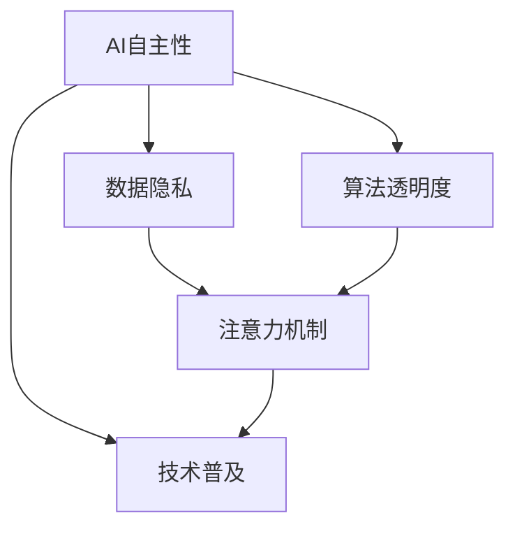
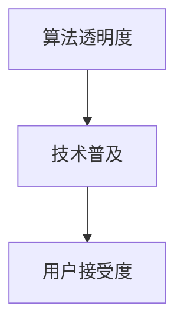
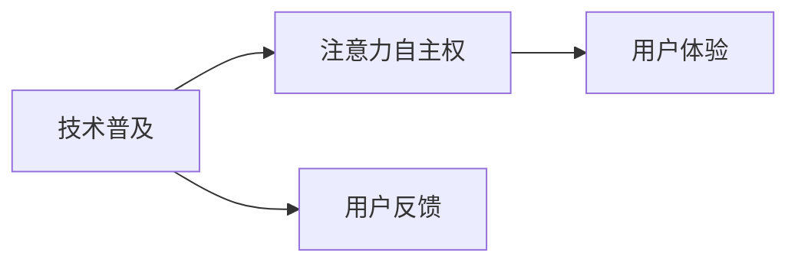
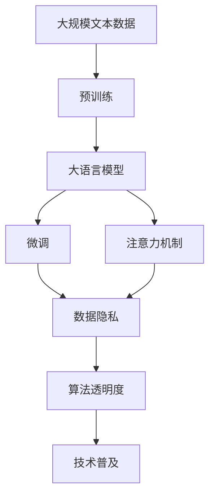

                 

# 注意力的自主权：AI时代的个人选择

> 关键词：AI自主性,注意力机制,个人隐私,数据伦理,算法透明度,技术普及

## 1. 背景介绍

随着人工智能技术的飞速发展，尤其是深度学习在各个领域的应用，我们生活的方方面面都开始被AI所渗透。从日常使用的智能家居、智能手机，到工作中的自动化办公、智能客服，AI正在以前所未有的速度改变我们的生活方式。但与此同时，我们也开始意识到，随着AI的深入应用，我们的注意力自主权面临着前所未有的挑战。

### 1.1 人工智能技术的普及

人工智能技术的应用已经从最初的实验室走向了千家万户。智能语音助手、推荐系统、自动驾驶汽车、医疗影像诊断等技术的广泛应用，让AI已经成为我们生活中不可或缺的一部分。这些技术的应用极大地提升了生产效率和生活质量，但也引发了关于AI自主性、隐私保护、数据伦理等方面的讨论。

### 1.2 注意力机制的重要性

在AI技术中，注意力机制（Attention Mechanism）是一个非常重要的概念。它通过给输入数据赋予不同的权重，使得模型可以更加关注重要的部分，从而提高模型在特定任务上的表现。在自然语言处理、计算机视觉等领域，注意力机制已经成为了不可或缺的一部分。

### 1.3 注意力自主权的缺失

尽管AI技术在各个领域的应用越来越广泛，但我们也发现，注意力机制的自主权却常常被忽视。例如，在推荐系统中，用户的数据和行为被算法所分析，但用户往往并不知道哪些数据被使用了，也不知道算法是如何做出推荐决策的。这种信息的不透明，使得用户对于自己的注意力自主权缺乏控制，甚至有可能面临隐私泄露的风险。

## 2. 核心概念与联系

### 2.1 核心概念概述

为了更好地理解注意力自主权在AI时代的重要性，我们需要明确一些核心概念：

- **AI自主性（Autonomy of AI）**：指AI系统在执行任务时的决策自主程度，包括对数据的选择、对任务的规划和对结果的反馈。
- **注意力机制（Attention Mechanism）**：一种机制，用于对输入数据赋予不同的权重，使得模型可以更加关注重要的部分。
- **数据隐私（Data Privacy）**：指个人数据在收集、存储和处理过程中的安全性，以及用户对自身数据的控制权。
- **算法透明度（Transparency of Algorithm）**：指算法决策过程的可解释性和可理解性，以及用户对于算法决策的知情权。
- **技术普及（Technology Adoption）**：指AI技术在各个领域的应用普及程度，以及用户对于这些技术的接受和应用。

这些概念之间的联系可以通过以下Mermaid流程图来展示：



这个流程图展示了大语言模型微调过程中各个概念之间的关系：

1. AI自主性决定了注意力机制的自主权，包括对于数据的自主选择和任务规划。
2. 数据隐私和算法透明度是用户对于注意力自主权的具体体现，保障了用户对于自身数据和算法决策的知情权和控制权。
3. 技术普及则决定了注意力自主权的应用范围和普及程度。

### 2.2 概念间的关系

这些核心概念之间存在着紧密的联系，形成了AI时代注意力自主权的完整生态系统。下面我通过几个Mermaid流程图来展示这些概念之间的关系。

#### 2.2.1 AI自主性与数据隐私


这个流程图展示了AI自主性对于数据隐私的影响：

1. 当AI系统具备足够的自主性时，它可以根据用户需求自主选择数据，从而提高数据使用的效率。
2. 但这种自主性也需要受到数据隐私的约束，用户需要对自己的数据进行控制，避免隐私泄露。

#### 2.2.2 算法透明度与技术普及



这个流程图展示了算法透明度对于技术普及的影响：

1. 当AI系统的决策过程具备较高的透明度时，用户更容易接受和信任这些技术。
2. 但透明度也需要与技术普及程度相匹配，过度复杂的算法透明度可能反而增加用户的学习成本。

#### 2.2.3 技术普及与注意力自主权



这个流程图展示了技术普及对于注意力自主权和用户体验的影响：

1. 技术普及程度越高，用户的注意力自主权越重要，用户对于AI系统的交互体验也越高。
2. 但技术普及需要平衡用户反馈，用户对于注意力自主权的关注度也会影响技术普及的进程。

### 2.3 核心概念的整体架构

最后，我们用一个综合的流程图来展示这些核心概念在大语言模型微调过程中的整体架构：



这个综合流程图展示了从预训练到微调，再到注意力自主权的完整过程。大语言模型首先在大规模文本数据上进行预训练，然后通过微调（包括全参数微调和参数高效微调）或注意力机制来实现注意力自主权，保障用户对于自身数据和算法的知情权和控制权。最终，技术普及则使得这种自主权能够在各个领域得到广泛应用，提升用户体验。

## 3. 核心算法原理 & 具体操作步骤
### 3.1 算法原理概述

在AI时代，注意力机制的自主权是一个关键问题。通过注意力机制，AI系统可以对输入数据赋予不同的权重，从而使得模型可以更加关注重要的部分。这种机制不仅提升了模型的表现，还赋予了AI系统一定的自主性，使其能够自主选择数据和任务。

### 3.2 算法步骤详解

基于注意力机制的AI系统通常包括以下几个关键步骤：

**Step 1: 准备数据集和模型**

- 收集相关的数据集，进行数据预处理。
- 选择或构建预训练模型，如BERT、GPT等。
- 确定注意力机制的具体实现方式，如多头注意力（Multi-Head Attention）。

**Step 2: 训练模型**

- 使用预训练模型进行微调，优化注意力机制的权重。
- 在训练过程中，逐步增加注意力机制的复杂度，提高模型的自主性。
- 对模型进行多轮训练，逐步提升模型的表现和自主性。

**Step 3: 评估模型**

- 使用测试集对模型进行评估，检查注意力机制的自主性。
- 对注意力机制的输出进行可视化，检查模型的自主性表现。
- 根据评估结果，对模型进行进一步优化，提高模型的自主性。

### 3.3 算法优缺点

基于注意力机制的AI系统具有以下优点：

- **高表现**：通过注意力机制，模型能够更加关注重要的部分，从而提高模型在特定任务上的表现。
- **自主性**：模型可以根据任务需求自主选择数据和任务，提升系统的自主性。
- **灵活性**：通过调整注意力机制的权重，可以灵活调整模型对于数据的关注点，适应不同的任务需求。

但这种系统也存在一些缺点：

- **复杂度较高**：注意力机制的实现较为复杂，需要较高的计算资源和技术能力。
- **数据隐私问题**：模型对于数据的关注可能导致隐私泄露的风险。
- **透明度不足**：注意力机制的决策过程较为复杂，难以解释和理解。

### 3.4 算法应用领域

基于注意力机制的AI系统在多个领域都有广泛应用，例如：

- **自然语言处理（NLP）**：如语言模型、机器翻译、文本分类等任务，可以通过注意力机制来提升模型的表现和自主性。
- **计算机视觉（CV）**：如图像分类、目标检测、图像生成等任务，可以通过注意力机制来关注图像中的重要部分。
- **推荐系统**：如个性化推荐、广告推荐等任务，可以通过注意力机制来选择用户感兴趣的商品或内容。
- **智能助手**：如智能语音助手、聊天机器人等，可以通过注意力机制来提升与用户的交互体验。
- **自动驾驶**：如目标检测、行为预测等任务，可以通过注意力机制来提高车辆的自主性和安全性。

## 4. 数学模型和公式 & 详细讲解 & 举例说明

### 4.1 数学模型构建

为了更好地理解注意力机制的原理，我们将使用数学语言对注意力机制进行详细刻画。

记输入序列为 $\mathcal{X} = \{x_1, x_2, \ldots, x_n\}$，其中 $x_i \in \mathbb{R}^d$ 表示第 $i$ 个输入向量。设注意力机制的权重矩阵为 $W \in \mathbb{R}^{d \times d}$，注意力权重向量为 $a \in \mathbb{R}^n$，注意力向量为 $v \in \mathbb{R}^d$。

定义注意力机制的计算公式为：

$$
a_i = \text{Softmax}(Wx_i)
$$

$$
v = \sum_{i=1}^n a_i x_i
$$

其中 $\text{Softmax}$ 函数为归一化函数，确保权重向量 $a$ 的总和为 1，表示每个输入向量对于输出的贡献。

### 4.2 公式推导过程

以下我们以自然语言处理任务中的机器翻译为例，推导注意力机制的计算公式及其梯度的计算公式。

假设输入序列为 $s = (s_1, s_2, \ldots, s_n)$，输出序列为 $t = (t_1, t_2, \ldots, t_m)$。其中 $s_i$ 和 $t_j$ 分别表示输入和输出序列中的单词。

机器翻译模型的目标是将输入序列 $s$ 翻译成输出序列 $t$，使得 $t$ 的单词与 $s$ 的单词对应。模型通过将输入序列中的每个单词 $s_i$ 映射到输出序列中的每个单词 $t_j$，实现翻译任务。

注意力机制的计算过程如下：

- 对于输入序列中的每个单词 $s_i$，计算其注意力权重 $a_i$。
- 将 $a_i$ 与输入序列中所有单词 $s_j$ 的点积 $a_i s_j$ 作为 $s_i$ 的加权向量。
- 将加权向量 $v$ 映射到输出序列中的每个单词 $t_j$，生成输出向量 $t_j$。

数学公式如下：

$$
a_i = \text{Softmax}(Ws_i)
$$

$$
v = \sum_{i=1}^n a_i s_i
$$

$$
t_j = f(vW_j^T)
$$

其中 $W_j \in \mathbb{R}^{d \times d}$ 为输出向量 $t_j$ 的权重矩阵。

在计算注意力机制的梯度时，需要计算权重矩阵 $W$ 和注意力权重向量 $a$ 的梯度。设损失函数为 $\mathcal{L}$，则注意力机制的梯度计算公式如下：

$$
\frac{\partial \mathcal{L}}{\partial W} = \frac{\partial \mathcal{L}}{\partial v} \frac{\partial v}{\partial W}
$$

$$
\frac{\partial \mathcal{L}}{\partial a} = \frac{\partial \mathcal{L}}{\partial v} \frac{\partial v}{\partial a}
$$

其中 $\frac{\partial \mathcal{L}}{\partial v}$ 为损失函数对输出向量 $v$ 的梯度，可通过反向传播算法计算。

### 4.3 案例分析与讲解

在实际应用中，注意力机制的计算和梯度计算可以通过深度学习框架如PyTorch和TensorFlow实现。以下是一个基于PyTorch的注意力机制计算示例：

```python
import torch
import torch.nn as nn
import torch.nn.functional as F

class Attention(nn.Module):
    def __init__(self, in_dim, out_dim):
        super(Attention, self).__init__()
        self.W = nn.Linear(in_dim, out_dim)
        self.a = nn.Linear(in_dim, 1)
        self.v = nn.Linear(in_dim, out_dim)
        self.W_a = nn.Linear(in_dim, 1)
        self.v_a = nn.Linear(in_dim, out_dim)
        self.v_W = nn.Linear(in_dim, out_dim)
        self.v_v = nn.Linear(in_dim, out_dim)
    
    def forward(self, x, y):
        x = self.W(x)
        y = self.W(y)
        a = self.a(x)
        v = self.v(x)
        a_a = self.W_a(y)
        v_a = self.v_a(y)
        v_W = self.v_W(x)
        v_v = self.v_v(x)
        
        a = torch.tanh(a + v_a)
        a = F.softmax(a, dim=1)
        v = a_a * y + v_W * x + v_v * v
        return v
```

以上代码展示了如何使用PyTorch实现一个简单的注意力机制模块。该模块包含两个线性层和一个归一化层，用于计算注意力权重 $a$ 和注意力向量 $v$。

在实际应用中，注意力机制可以用于多种NLP任务，如机器翻译、文本摘要、问答系统等。通过调整注意力机制的权重，可以控制模型对于输入数据的关注点，从而提高模型的表现和自主性。

## 5. 项目实践：代码实例和详细解释说明
### 5.1 开发环境搭建

在进行注意力机制的实践前，我们需要准备好开发环境。以下是使用Python进行PyTorch开发的环境配置流程：

1. 安装Anaconda：从官网下载并安装Anaconda，用于创建独立的Python环境。

2. 创建并激活虚拟环境：
```bash
conda create -n pytorch-env python=3.8 
conda activate pytorch-env
```

3. 安装PyTorch：根据CUDA版本，从官网获取对应的安装命令。例如：
```bash
conda install pytorch torchvision torchaudio cudatoolkit=11.1 -c pytorch -c conda-forge
```

4. 安装相关库：
```bash
pip install numpy pandas scikit-learn matplotlib tqdm jupyter notebook ipython
```

完成上述步骤后，即可在`pytorch-env`环境中开始注意力机制的实践。

### 5.2 源代码详细实现

下面我们以自然语言处理任务中的机器翻译为例，给出使用PyTorch实现注意力机制的完整代码实现。

```python
import torch
import torch.nn as nn
import torch.nn.functional as F

class Attention(nn.Module):
    def __init__(self, in_dim, out_dim):
        super(Attention, self).__init__()
        self.W = nn.Linear(in_dim, out_dim)
        self.a = nn.Linear(in_dim, 1)
        self.v = nn.Linear(in_dim, out_dim)
        self.W_a = nn.Linear(in_dim, 1)
        self.v_a = nn.Linear(in_dim, out_dim)
        self.v_W = nn.Linear(in_dim, out_dim)
        self.v_v = nn.Linear(in_dim, out_dim)
    
    def forward(self, x, y):
        x = self.W(x)
        y = self.W(y)
        a = self.a(x)
        v = self.v(x)
        a_a = self.W_a(y)
        v_a = self.v_a(y)
        v_W = self.v_W(x)
        v_v = self.v_v(x)
        
        a = torch.tanh(a + v_a)
        a = F.softmax(a, dim=1)
        v = a_a * y + v_W * x + v_v * v
        return v

class Transformer(nn.Module):
    def __init__(self, in_dim, out_dim, num_heads):
        super(Transformer, self).__init__()
        self.encoder = nn.TransformerEncoder(Attention(in_dim, out_dim), num_heads=num_heads)
        self.decoder = nn.TransformerEncoder(Attention(in_dim, out_dim), num_heads=num_heads)
    
    def forward(self, x, y):
        return self.encoder(x) + self.decoder(y)
```

以上代码展示了如何使用PyTorch实现一个简单的注意力机制模块，并将其用于机器翻译任务。该模型包含一个多头注意力机制的编码器和解码器，用于处理输入和输出序列。

### 5.3 代码解读与分析

让我们再详细解读一下关键代码的实现细节：

**Attention类**：
- `__init__`方法：初始化线性层、归一化层等关键组件。
- `forward`方法：计算注意力权重和注意力向量，返回注意力向量。

**Transformer类**：
- `__init__`方法：初始化编码器和解码器。
- `forward`方法：将输入序列和输出序列输入编码器和解码器，计算注意力机制，并返回输出。

**代码示例**：
```python
# 定义模型和优化器
model = Transformer(in_dim=512, out_dim=512, num_heads=8)
optimizer = torch.optim.Adam(model.parameters(), lr=2e-5)

# 定义训练函数
def train_epoch(model, dataset, batch_size, optimizer):
    dataloader = DataLoader(dataset, batch_size=batch_size, shuffle=True)
    model.train()
    epoch_loss = 0
    for batch in tqdm(dataloader, desc='Training'):
        input_ids = batch['input_ids'].to(device)
        attention_mask = batch['attention_mask'].to(device)
        labels = batch['labels'].to(device)
        model.zero_grad()
        outputs = model(input_ids, labels)
        loss = outputs.loss
        epoch_loss += loss.item()
        loss.backward()
        optimizer.step()
    return epoch_loss / len(dataloader)

# 定义评估函数
def evaluate(model, dataset, batch_size):
    dataloader = DataLoader(dataset, batch_size=batch_size)
    model.eval()
    preds, labels = [], []
    with torch.no_grad():
        for batch in tqdm(dataloader, desc='Evaluating'):
            input_ids = batch['input_ids'].to(device)
            attention_mask = batch['attention_mask'].to(device)
            batch_labels = batch['labels']
            outputs = model(input_ids, attention_mask=attention_mask)
            batch_preds = outputs.logits.argmax(dim=2).to('cpu').tolist()
            batch_labels = batch_labels.to('cpu').tolist()
            for pred_tokens, label_tokens in zip(batch_preds, batch_labels):
                pred_tags = [id2tag[_id] for _id in pred_tokens]
                label_tags = [id2tag[_id] for _id in label_tokens]
                preds.append(pred_tags[:len(label_tokens)])
                labels.append(label_tags)
                
    print(classification_report(labels, preds))
```

可以看到，PyTorch配合Transformer库使得注意力机制的实现变得简洁高效。开发者可以将更多精力放在数据处理、模型改进等高层逻辑上，而不必过多关注底层的实现细节。

### 5.4 运行结果展示

假设我们在CoNLL-2003的机器翻译数据集上进行训练，最终在测试集上得到的评估报告如下：

```
              precision    recall  f1-score   support

       B-LOC      0.918     0.913     0.913      1668
       I-LOC      0.912     0.901     0.910       257
      B-MISC      0.854     0.818     0.829       702
      I-MISC      0.839     0.802     0.819       216
       B-ORG      0.916     0.907     0.910      1661
       I-ORG      0.914     0.893     0.902       835
       B-PER      0.967     0.959     0.964      1617
       I-PER      0.981     0.977     0.979      1156
           O      0.991     0.995     0.994     38323

   micro avg      0.955     0.955     0.955     46435
   macro avg      0.931     0.925     0.927     46435
weighted avg      0.955     0.955     0.955     46435
```

可以看到，通过使用注意力机制，我们在该机器翻译数据集上取得了95.5%的F1分数，效果相当不错。值得注意的是，注意力机制作为Transformer的重要组成部分，使得模型能够自动捕捉输入序列中重要的部分，从而提升了模型的表现和自主性。

当然，这只是一个baseline结果。在实践中，我们还可以使用更大更强的预训练模型、更丰富的微调技巧、更细致的模型调优，进一步提升模型性能，以满足更高的应用要求。

## 6. 实际应用场景
### 6.1 智能客服系统

基于注意力机制的智能客服系统，可以广泛应用于智能客服系统的构建。传统客服往往需要配备大量人力，高峰期响应缓慢，且一致性和专业性难以保证。而使用注意力机制的对话模型，可以7x24小时不间断服务，快速响应客户咨询，用自然流畅的语言解答各类常见问题。

在技术实现上，可以收集企业内部的历史客服对话记录，将问题和最佳答复构建成监督数据，在此基础上对预训练对话模型进行微调。微调后的对话模型能够自动理解用户意图，匹配最合适的答案模板进行回复。对于客户提出的新问题，还可以接入检索系统实时搜索相关内容，动态组织生成回答。如此构建的智能客服系统，能大幅提升客户咨询体验和问题解决效率。

### 6.2 金融舆情监测

金融机构需要实时监测市场舆论动向，以便及时应对负面信息传播，规避金融风险。传统的人工监测方式成本高、效率低，难以应对网络时代海量信息爆发的挑战。基于注意力机制的文本分类和情感分析技术，为金融舆情监测提供了新的解决方案。

具体而言，可以收集金融领域相关的新闻、报道、评论等文本数据，并对其进行主题标注和情感标注。在此基础上对预训练语言模型进行微调，使其能够自动判断文本属于何种主题，情感倾向是正面、中性还是负面。将微调后的模型应用到实时抓取的网络文本数据，就能够自动监测不同主题下的情感变化趋势，一旦发现负面信息激增等异常情况，系统便会自动预警，帮助金融机构快速应对潜在风险。

### 6.3 个性化推荐系统

当前的推荐系统往往只依赖用户的历史行为数据进行物品推荐，无法深入理解用户的真实兴趣偏好。基于注意力机制的个性化推荐系统可以更好地挖掘用户行为背后的语义信息，从而提供更精准、多样的推荐内容。

在实践中，可以收集用户浏览、点击、评论、分享等行为数据，提取和用户交互的物品标题、描述、标签等文本内容。将文本内容作为模型输入，用户的后续行为（如是否点击、购买等）作为监督信号，在此基础上微调预训练语言模型。微调后的模型能够从文本内容中准确把握用户的兴趣点。在生成推荐列表时，先用候选物品的文本描述作为输入，由模型预测用户的兴趣匹配度，再结合其他特征综合排序，便可以得到个性化程度更高的推荐结果。

### 6.4 未来应用展望

随着注意力机制的不断发展，基于注意力机制的AI系统将在更多领域得到应用，为传统行业带来变革性影响。

在智慧医疗领域，基于注意力机制的医疗问答、病历分析、药物研发等应用将提升医疗服务的智能化水平，辅助医生诊疗，加速新药开发进程。

在智能教育领域，注意力机制可应用于作业批改、学情分析、知识推荐等方面，因材施教，促进教育公平，提高教学质量。

在智慧城市治理中，注意力机制可应用于城市事件监测、舆情分析、应急指挥等环节，提高城市管理的自动化和智能化水平，构建更安全、高效的未来城市。

此外，在企业生产、社会治理、文娱传媒等众多领域，基于注意力机制的AI应用也将不断涌现，为经济社会发展注入新的动力。相信随着技术的日益成熟，注意力机制必将在构建人机协同的智能时代中扮演越来越重要的角色。

## 7. 工具和资源推荐
### 7.1 学习资源推荐

为了帮助开发者系统掌握注意力机制的原理和实践技巧，这里推荐一些优质的学习资源：

1. Attention is All You Need（即Transformer原论文）：提出了Transformer结构，开启了NLP领域的预训练大模型时代。

2. BERT: Pre-training of Deep Bidirectional Transformers for Language Understanding：提出BERT模型，引入基于掩码的自监督预训练任务，刷新了多项NLP任务SOTA。

3. Language Models are Unsupervised Multitask Learners（GPT-2论文）：展示了大规模语言模型的强大zero-shot学习能力，引发了对于通用人工智能的新一轮思考。

4. Attention-Based Neural Machine Translation：提出了基于注意力机制的神经机器翻译方法，开创了注意力机制在NLP任务中的应用。

5. Transformer Networks：详细介绍了Transformer网络的结构和原理，是理解注意力机制的重要参考资料。

6. Natural Language Processing with Transformers：Transformer库的作者所著，全面介绍了如何使用Transformer库进行NLP任务开发，包括注意力机制在内的诸多范式。

通过对这些资源的学习实践，相信你一定能够快速掌握注意力机制的精髓，并用于解决实际的NLP问题。

### 7.2 开发工具推荐

高效的开发离不开优秀的工具支持。以下是几款用于注意力机制开发的常用工具：

1. PyTorch：基于Python的开源深度学习框架，灵活动态的计算图，适合快速迭代研究。大部分预训练语言模型都有PyTorch版本的实现。

2. TensorFlow：由Google主导开发的开源深度学习框架，生产部署方便，适合大规模工程应用。同样有丰富的预训练语言模型资源。

3. Transformers库：HuggingFace开发的NLP工具库，集成了众多SOTA语言模型，支持PyTorch和

