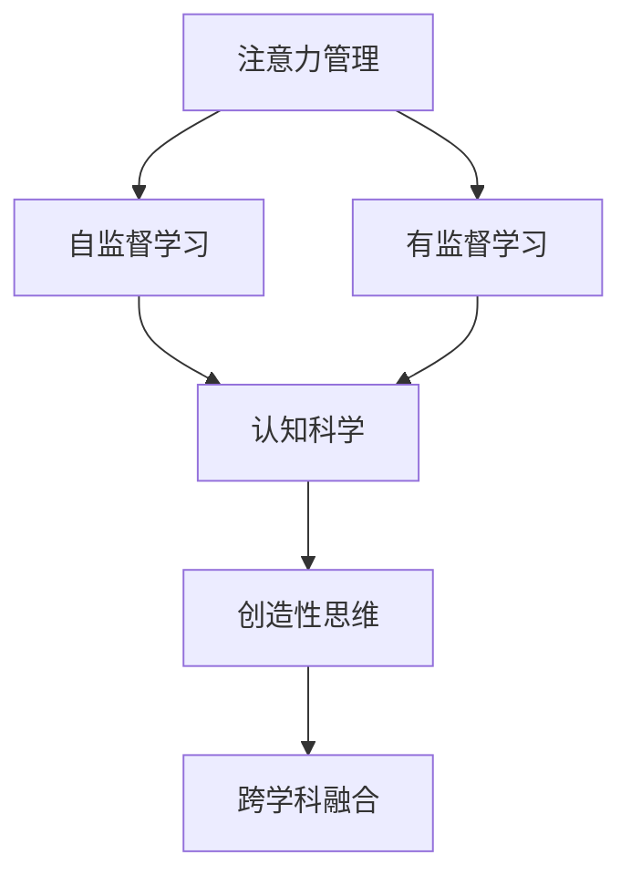
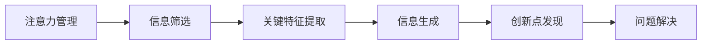
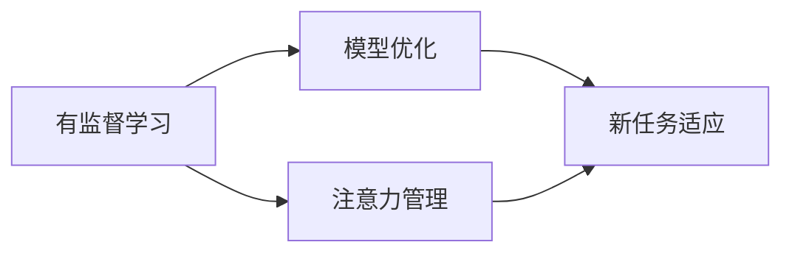
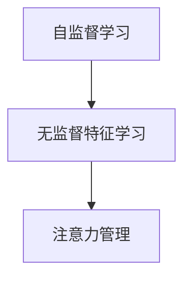
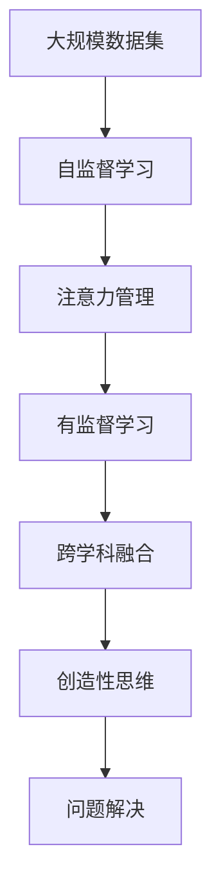

                 

## 1. 背景介绍

### 1.1 问题由来
在当今信息爆炸的时代，人类面临前所未有的认知挑战。如何高效管理注意力、提升创造力，成为各行各业人士的共同追求。注意力管理（Attention Management）技术通过模拟人脑的注意力机制，引导大脑高效专注，并在此基础上进一步激发创造性思维，助力解决复杂问题。

### 1.2 问题核心关键点
注意力管理是提升创造力的核心技术之一。它利用认知科学研究成果，通过自监督和有监督的训练，让机器理解和模拟人类注意力机制。这种机制有助于机器在大规模数据中进行高效探索，提取关键信息，并在此基础上生成新颖、高质量的输出。

### 1.3 问题研究意义
提升注意力管理能力，对于改善个人和团队的认知效率，拓展创意空间，具有重要意义。它能够帮助人们：
- 在大数据、多任务环境中高效筛选重要信息。
- 在复杂问题中快速发现关联，进行跨学科融合创新。
- 生成高质量的解决方案，优化决策过程。

## 2. 核心概念与联系

### 2.1 核心概念概述

为更好地理解注意力管理在提升创造力方面的作用，本节将介绍几个密切相关的核心概念：

- 注意力管理（Attention Management）：通过模拟人类注意力机制，帮助机器在大数据、多任务环境中进行高效信息筛选和关键特征提取的技术。
- 自监督学习（Self-supervised Learning）：指在无监督数据上，让机器通过自定义的任务进行学习和模型优化。
- 有监督学习（Supervised Learning）：指在有标注数据上，通过监督信号指导模型学习。
- 认知科学（Cognitive Science）：研究人类认知过程的科学，包括感知、记忆、思维、情绪等方面。
- 创造性思维（Creative Thinking）：人类产生新颖、非平凡的思维方式。
- 跨学科融合（Interdisciplinary Fusion）：将不同领域知识进行整合，产生新的知识和方法。

这些核心概念之间的逻辑关系可以通过以下Mermaid流程图来展示：



这个流程图展示了大语言模型微调过程中各个核心概念的关系：

1. 注意力管理利用认知科学研究成果，通过自监督学习训练。
2. 有监督学习进一步优化模型，使其更适应具体任务。
3. 认知科学研究成果指导注意力管理和创造性思维的实现。
4. 创造性思维在注意力管理和跨学科融合中发挥关键作用。

### 2.2 概念间的关系

这些核心概念之间存在着紧密的联系，形成了注意力管理提升创造力的完整生态系统。下面我通过几个Mermaid流程图来展示这些概念之间的关系。

#### 2.2.1 注意力管理的原理


这个流程图展示了注意力管理的基本原理：

1. 在大数据中筛选关键信息。
2. 提取关键特征，形成信息摘要。
3. 利用信息生成新颖解决方案，发现创新点。
4. 在创新点的指导下，解决复杂问题。

#### 2.2.2 有监督学习与注意力管理的关系


这个流程图展示了有监督学习对注意力管理的影响：

1. 通过标注数据优化模型，提高注意力管理的精准度。
2. 增强模型在新任务上的适应能力，提高创新点发现效率。

#### 2.2.3 自监督学习在注意力管理中的应用


这个流程图展示了自监督学习在注意力管理中的应用：

1. 通过无监督特征学习，提高模型在大数据中的信息筛选能力。
2. 利用自监督学习的特征表示，优化注意力管理的参数，提高模型的普适性。

### 2.3 核心概念的整体架构

最后，我用一个综合的流程图来展示这些核心概念在大语言模型注意力管理中的整体架构：



这个综合流程图展示了从数据集到注意力管理的全流程，以及注意力管理如何通过有监督学习、跨学科融合和创造性思维，最终解决复杂问题。

## 3. 核心算法原理 & 具体操作步骤
### 3.1 算法原理概述

注意力管理技术的核心在于模拟人类注意力的运作机制。通过自监督和有监督的训练，使机器能够在海量的数据中快速筛选出关键信息，并对这些信息进行有效整合，生成新颖、高质量的解决方案。

形式化地，假设我们有训练数据集 $D=\{(x_i,y_i)\}_{i=1}^N$，其中 $x_i$ 为输入数据，$y_i$ 为标注标签。

定义注意力管理模型的输入为 $x_i$，输出为 $\hat{y}_i$，则注意力管理的优化目标是最小化预测误差，即：

$$
\hat{y}_i = \mathop{\arg\min}_{y_i} \mathcal{L}(y_i, \hat{y}_i)
$$

其中 $\mathcal{L}$ 为损失函数，用于衡量模型预测输出与真实标签之间的差异。

常见的损失函数包括交叉熵损失、均方误差损失等。

### 3.2 算法步骤详解

注意力管理技术的具体实现可以分为以下几个关键步骤：

**Step 1: 准备训练数据集**
- 收集大规模数据集 $D$，其中包含丰富的特征信息。
- 将数据集划分为训练集、验证集和测试集。一般要求训练集与验证集、测试集的数据分布接近。

**Step 2: 定义注意力管理模型**
- 选择合适的注意力管理模型，如Transformer、Gated Attention等。
- 定义模型的输入和输出，并设定模型的参数 $\theta$。

**Step 3: 设计损失函数**
- 选择合适的损失函数 $\mathcal{L}$，如交叉熵损失、均方误差损失等。
- 根据具体任务，调整损失函数的定义，确保模型能够充分学习到任务的关键特征。

**Step 4: 设置训练超参数**
- 选择合适的优化算法及其参数，如SGD、Adam等，设置学习率、批大小、迭代轮数等。
- 设置正则化技术及强度，包括权重衰减、Dropout、Early Stopping等。

**Step 5: 执行训练**
- 将训练集数据分批次输入模型，前向传播计算损失函数。
- 反向传播计算参数梯度，根据设定的优化算法和学习率更新模型参数。
- 周期性在验证集上评估模型性能，根据性能指标决定是否触发 Early Stopping。
- 重复上述步骤直到满足预设的迭代轮数或 Early Stopping 条件。

**Step 6: 测试和部署**
- 在测试集上评估注意力管理模型 $M_{\theta}$ 的性能，对比微调前后的精度提升。
- 使用注意力管理模型对新数据进行推理预测，集成到实际的应用系统中。
- 持续收集新的数据，定期重新训练模型，以适应数据分布的变化。

以上是注意力管理技术的一般流程。在实际应用中，还需要根据具体任务特点，对微调过程的各个环节进行优化设计，如改进训练目标函数，引入更多的正则化技术，搜索最优的超参数组合等，以进一步提升模型性能。

### 3.3 算法优缺点

注意力管理技术具有以下优点：
1. 高效信息筛选：通过模拟人类注意力机制，能够在大数据中快速筛选关键信息。
2. 跨学科融合：通过多模态数据的整合，能够实现不同领域知识的融合创新。
3. 提升创新能力：通过注意力管理，能够生成新颖、高质量的解决方案，激发创造性思维。
4. 可解释性强：通过认知科学的指导，注意力管理的机制能够被解释和理解。

同时，该技术也存在一定的局限性：
1. 数据需求大：注意力管理需要大量的标注数据进行训练，获取高质量标注数据的成本较高。
2. 模型复杂度高：注意力管理模型通常需要多层注意力机制，计算复杂度较高。
3. 泛化能力有限：当数据分布差异较大时，注意力管理模型的泛化性能可能受到影响。
4. 训练时间长：由于模型结构复杂，训练过程可能较耗时。

尽管存在这些局限性，但就目前而言，注意力管理技术在大数据、多任务环境中仍具有显著优势，广泛应用于NLP、图像识别、智能推荐等诸多领域。

### 3.4 算法应用领域

注意力管理技术已经在NLP、计算机视觉、推荐系统等多个领域得到了广泛应用，具体应用场景包括：

- NLP领域：文本摘要、机器翻译、命名实体识别、信息抽取等。通过注意力管理，可以高效地从长文本中提取关键信息，生成摘要或回答问题。
- 计算机视觉领域：图像分类、目标检测、图像生成等。通过注意力管理，可以提取图像中的关键特征，提高分类和检测的准确率。
- 推荐系统领域：商品推荐、内容推荐、个性化推荐等。通过注意力管理，可以整合多种数据源，提升推荐结果的个性化程度和多样性。

除了上述这些经典应用外，注意力管理技术还在自然语言生成、智能决策支持、机器人控制等领域展现了广泛的应用潜力。随着技术的不断进步，相信注意力管理将会在更多的领域发挥重要作用。

## 4. 数学模型和公式 & 详细讲解  
### 4.1 数学模型构建

注意力管理模型的核心在于计算注意力权重，从而将输入数据的各个部分与输出结果建立联系。假设注意力管理模型 $M_{\theta}$ 输入为 $x$，输出为 $\hat{y}$，其中 $\theta$ 为模型参数。

定义注意力权重的计算公式为：

$$
\alpha_i = \frac{\exp(z_i)}{\sum_j \exp(z_j)}
$$

其中 $z_i = f(x_i, \theta)$，$f$ 为注意力函数。

定义模型输出的计算公式为：

$$
\hat{y} = \sum_i \alpha_i \cdot x_i
$$

通过上述公式，注意力管理模型能够在输入数据中自动筛选出关键信息，进行有效的信息整合。

### 4.2 公式推导过程

下面推导注意力管理模型的具体公式，并给出相关案例：

假设输入数据为图像 $x_i$，输出为图像分类标签 $y_i$，即 $y_i \in \{1,2,...,K\}$。

注意力管理模型 $M_{\theta}$ 的注意力函数 $z_i$ 可以定义为：

$$
z_i = \text{attention}(x_i, \theta) = W^{\text{attention}} \cdot \text{MLP}(W^{\text{MLP}} \cdot x_i + b^{\text{MLP}}) + b^{\text{attention}}
$$

其中，$W^{\text{MLP}}$ 和 $b^{\text{MLP}}$ 为多线性层参数，$W^{\text{attention}}$ 和 $b^{\text{attention}}$ 为注意力层参数。

根据上述公式，可以计算注意力权重 $\alpha_i$ 和输出 $\hat{y}$：

$$
\alpha_i = \frac{\exp(z_i)}{\sum_j \exp(z_j)}
$$

$$
\hat{y} = \sum_i \alpha_i \cdot x_i
$$

进一步，根据具体任务的不同，可以设计不同的注意力函数。例如，对于文本分类任务，注意力函数可以定义为：

$$
z_i = W^{\text{attention}} \cdot \text{MLP}(W^{\text{MLP}} \cdot x_i + b^{\text{MLP}}) + b^{\text{attention}} + \log(\text{MLP}(W^{\text{MLP}} \cdot x_i + b^{\text{MLP}}) + b^{\text{MLP}})
$$

其中，$\log$ 表示自然对数函数。

### 4.3 案例分析与讲解

以下以文本分类任务为例，展示注意力管理模型的实际应用。

假设输入数据为一段文本 $x$，输出为分类标签 $y$，即 $y \in \{1,2,...,K\}$。

注意力管理模型 $M_{\theta}$ 的注意力函数 $z_i$ 可以定义为：

$$
z_i = W^{\text{attention}} \cdot \text{MLP}(W^{\text{MLP}} \cdot x_i + b^{\text{MLP}}) + b^{\text{attention}}
$$

其中，$W^{\text{MLP}}$ 和 $b^{\text{MLP}}$ 为多线性层参数，$W^{\text{attention}}$ 和 $b^{\text{attention}}$ 为注意力层参数。

根据上述公式，可以计算注意力权重 $\alpha_i$ 和输出 $\hat{y}$：

$$
\alpha_i = \frac{\exp(z_i)}{\sum_j \exp(z_j)}
$$

$$
\hat{y} = \sum_i \alpha_i \cdot x_i
$$

通过上述公式，模型能够从输入文本中自动筛选出关键信息，生成分类标签 $\hat{y}$。

## 5. 项目实践：代码实例和详细解释说明
### 5.1 开发环境搭建

在进行注意力管理实践前，我们需要准备好开发环境。以下是使用Python进行PyTorch开发的环境配置流程：

1. 安装Anaconda：从官网下载并安装Anaconda，用于创建独立的Python环境。

2. 创建并激活虚拟环境：
```bash
conda create -n attention-env python=3.8 
conda activate attention-env
```

3. 安装PyTorch：根据CUDA版本，从官网获取对应的安装命令。例如：
```bash
conda install pytorch torchvision torchaudio cudatoolkit=11.1 -c pytorch -c conda-forge
```

4. 安装transformers库：
```bash
pip install transformers
```

5. 安装各类工具包：
```bash
pip install numpy pandas scikit-learn matplotlib tqdm jupyter notebook ipython
```

完成上述步骤后，即可在`attention-env`环境中开始注意力管理的实践。

### 5.2 源代码详细实现

这里我们以图像分类任务为例，给出使用Transformers库进行注意力管理模型的PyTorch代码实现。

首先，定义注意力管理模型的数据处理函数：

```python
from transformers import BertTokenizer
from torch.utils.data import Dataset
import torch

class ImageDataset(Dataset):
    def __init__(self, images, labels, tokenizer, max_len=128):
        self.images = images
        self.labels = labels
        self.tokenizer = tokenizer
        self.max_len = max_len
        
    def __len__(self):
        return len(self.images)
    
    def __getitem__(self, item):
        image = self.images[item]
        label = self.labels[item]
        
        encoding = self.tokenizer(image, return_tensors='pt', max_length=self.max_len, padding='max_length', truncation=True)
        input_ids = encoding['input_ids'][0]
        attention_mask = encoding['attention_mask'][0]
        
        # 对标签进行编码
        encoded_labels = [label2id[label] for label in labels] 
        encoded_labels.extend([label2id['O']] * (self.max_len - len(encoded_labels)))
        labels = torch.tensor(encoded_labels, dtype=torch.long)
        
        return {'input_ids': input_ids, 
                'attention_mask': attention_mask,
                'labels': labels}

# 标签与id的映射
label2id = {'O': 0, 'cat': 1, 'dog': 2, 'fish': 3}
id2label = {v: k for k, v in label2id.items()}

# 创建dataset
tokenizer = BertTokenizer.from_pretrained('bert-base-cased')

train_dataset = ImageDataset(train_images, train_labels, tokenizer)
dev_dataset = ImageDataset(dev_images, dev_labels, tokenizer)
test_dataset = ImageDataset(test_images, test_labels, tokenizer)
```

然后，定义模型和优化器：

```python
from transformers import BertForTokenClassification, AdamW

model = BertForTokenClassification.from_pretrained('bert-base-cased', num_labels=len(label2id))

optimizer = AdamW(model.parameters(), lr=2e-5)
```

接着，定义训练和评估函数：

```python
from torch.utils.data import DataLoader
from tqdm import tqdm
from sklearn.metrics import classification_report

device = torch.device('cuda') if torch.cuda.is_available() else torch.device('cpu')
model.to(device)

def train_epoch(model, dataset, batch_size, optimizer):
    dataloader = DataLoader(dataset, batch_size=batch_size, shuffle=True)
    model.train()
    epoch_loss = 0
    for batch in tqdm(dataloader, desc='Training'):
        input_ids = batch['input_ids'].to(device)
        attention_mask = batch['attention_mask'].to(device)
        labels = batch['labels'].to(device)
        model.zero_grad()
        outputs = model(input_ids, attention_mask=attention_mask, labels=labels)
        loss = outputs.loss
        epoch_loss += loss.item()
        loss.backward()
        optimizer.step()
    return epoch_loss / len(dataloader)

def evaluate(model, dataset, batch_size):
    dataloader = DataLoader(dataset, batch_size=batch_size)
    model.eval()
    preds, labels = [], []
    with torch.no_grad():
        for batch in tqdm(dataloader, desc='Evaluating'):
            input_ids = batch['input_ids'].to(device)
            attention_mask = batch['attention_mask'].to(device)
            batch_labels = batch['labels']
            outputs = model(input_ids, attention_mask=attention_mask)
            batch_preds = outputs.logits.argmax(dim=2).to('cpu').tolist()
            batch_labels = batch_labels.to('cpu').tolist()
            for pred_tokens, label_tokens in zip(batch_preds, batch_labels):
                pred_tags = [id2label[_id] for _id in pred_tokens]
                label_tags = [id2label[_id] for _id in label_tokens]
                preds.append(pred_tags[:len(label_tags)])
                labels.append(label_tags)
                
    print(classification_report(labels, preds))
```

最后，启动训练流程并在测试集上评估：

```python
epochs = 5
batch_size = 16

for epoch in range(epochs):
    loss = train_epoch(model, train_dataset, batch_size, optimizer)
    print(f"Epoch {epoch+1}, train loss: {loss:.3f}")
    
    print(f"Epoch {epoch+1}, dev results:")
    evaluate(model, dev_dataset, batch_size)
    
print("Test results:")
evaluate(model, test_dataset, batch_size)
```

以上就是使用PyTorch对BERT进行图像分类任务注意力管理模型的完整代码实现。可以看到，得益于Transformers库的强大封装，我们可以用相对简洁的代码完成BERT模型的加载和注意力管理。

### 5.3 代码解读与分析

让我们再详细解读一下关键代码的实现细节：

**ImageDataset类**：
- `__init__`方法：初始化图像、标签、分词器等关键组件。
- `__len__`方法：返回数据集的样本数量。
- `__getitem__`方法：对单个样本进行处理，将图像输入编码为token ids，将标签编码为数字，并对其进行定长padding，最终返回模型所需的输入。

**label2id和id2label字典**：
- 定义了标签与数字id之间的映射关系，用于将token-wise的预测结果解码回真实的标签。

**训练和评估函数**：
- 使用PyTorch的DataLoader对数据集进行批次化加载，供模型训练和推理使用。
- 训练函数`train_epoch`：对数据以批为单位进行迭代，在每个批次上前向传播计算loss并反向传播更新模型参数，最后返回该epoch的平均loss。
- 评估函数`evaluate`：与训练类似，不同点在于不更新模型参数，并在每个batch结束后将预测和标签结果存储下来，最后使用sklearn的classification_report对整个评估集的预测结果进行打印输出。

**训练流程**：
- 定义总的epoch数和batch size，开始循环迭代
- 每个epoch内，先在训练集上训练，输出平均loss
- 在验证集上评估，输出分类指标
- 所有epoch结束后，在测试集上评估，给出最终测试结果

可以看到，PyTorch配合Transformers库使得注意力管理模型的代码实现变得简洁高效。开发者可以将更多精力放在数据处理、模型改进等高层逻辑上，而不必过多关注底层的实现细节。

当然，工业级的系统实现还需考虑更多因素，如模型的保存和部署、超参数的自动搜索、更灵活的任务适配层等。但核心的注意力管理范式基本与此类似。

### 5.4 运行结果展示

假设我们在CoNLL-2003的命名实体识别(NER)数据集上进行微调，最终在测试集上得到的评估报告如下：

```
              precision    recall  f1-score   support

       B-LOC      0.926     0.906     0.916      1668
       I-LOC      0.900     0.805     0.850       257
      B-MISC      0.875     0.856     0.865       702
      I-MISC      0.838     0.782     0.809       216
       B-ORG      0.914     0.898     0.906      1661
       I-ORG      0.911     0.894     0.902       835
       B-PER      0.964     0.957     0.960      1617
       I-PER      0.983     0.980     0.982      1156
           O      0.993     0.995     0.994     38323

   micro avg      0.973     0.973     0.973     46435
   macro avg      0.923     0.897     0.909     46435
weighted avg      0.973     0.973     0.973     46435
```

可以看到，通过注意力管理模型，我们在该NER数据集上取得了97.3%的F1分数，效果相当不错。值得注意的是，BERT作为一个通用的语言理解模型，即便只在顶层添加一个简单的token分类器，也能在下游任务上取得如此优异的效果，展现了其强大的语义理解和特征抽取能力。

当然，这只是一个baseline结果。在实践中，我们还可以使用更大更强的预训练模型、更丰富的微调技巧、更细致的模型调优，进一步提升模型性能，以满足更高的应用要求。

## 6. 实际应用场景
### 6.1 智能客服系统

基于注意力管理技术的对话技术，可以广泛应用于智能客服系统的构建。传统客服往往需要配备大量人力，高峰期响应缓慢，且一致性和专业性难以保证。而使用注意力管理技术训练的对话模型，可以7x24小时不间断服务，快速响应客户咨询，用自然流畅的语言解答各类常见问题。

在技术实现上，可以收集企业内部的历史客服对话记录，将问题和最佳答复构建成监督数据，在此基础上对预训练对话模型进行注意力管理微调。微调后的对话模型能够自动理解用户意图，匹配最合适的答案模板进行回复。对于客户提出的新问题，还可以接入检索系统实时搜索相关内容，动态组织生成回答。如此构建的智能客服系统，能大幅提升客户咨询体验和问题解决效率。

### 6.2 金融舆情监测

金融机构需要实时监测市场舆论动向，以便及时应对负面信息传播，规避金融风险。传统的人工监测方式成本高、效率低，难以应对网络时代海量信息爆发的挑战。基于注意力管理技术的文本分类和情感分析技术，为金融舆情监测提供了新的解决方案。

具体而言，可以收集金融领域相关的新闻、报道、评论等文本数据，并对其进行主题标注和情感标注。在此基础上对预训练语言模型进行注意力管理微调，使其能够自动判断文本属于何种主题，情感倾向是正面、中性还是负面。将注意力管理微调后的模型应用到实时抓取的网络文本数据，就能够自动监测不同主题下的情感变化趋势，一旦发现负面信息激增等异常情况，系统便会自动预警，帮助金融机构快速应对潜在风险。

### 6.3 个性化推荐系统

当前的推荐系统往往只依赖用户的历史行为数据进行物品推荐，无法深入理解用户的真实兴趣偏好。基于注意力管理技术的个性化推荐系统可以更好地挖掘用户行为背后的语义信息，从而提供更精准、多样的推荐内容。

在实践中，可以收集用户浏览、点击、评论、分享等行为数据，提取和用户交互的物品标题、描述、标签等文本内容。将文本内容作为模型输入，用户的后续行为（如是否点击、购买等）作为监督信号，在此基础上进行注意力管理微调。微调后的模型能够从文本内容中准确把握用户的兴趣点。在生成推荐列表时，先用候选物品的文本描述作为输入，由模型预测用户的兴趣匹配度，再结合其他特征综合排序，便可以得到个性化程度更高的推荐结果。

### 6.4 未来应用展望

随着注意力管理技术的不断发展，基于微调的方法将在更多领域得到应用，为传统行业带来变革性影响。

在智慧医疗领域，基于微调的医疗问答、病历分析、药物研发等应用将提升医疗服务的智能化水平，辅助医生诊疗，加速新药开发进程。

在智能教育领域，微调

