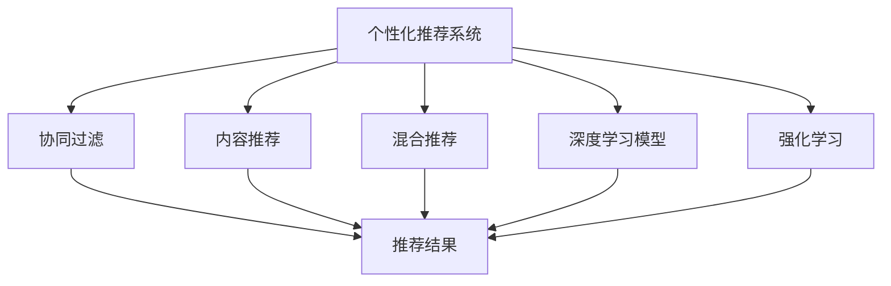
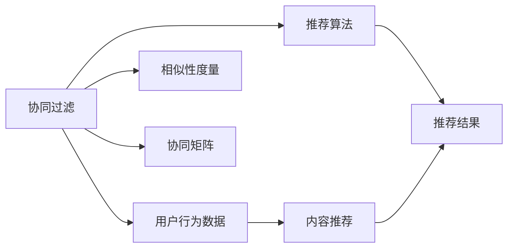
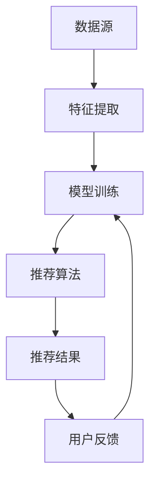
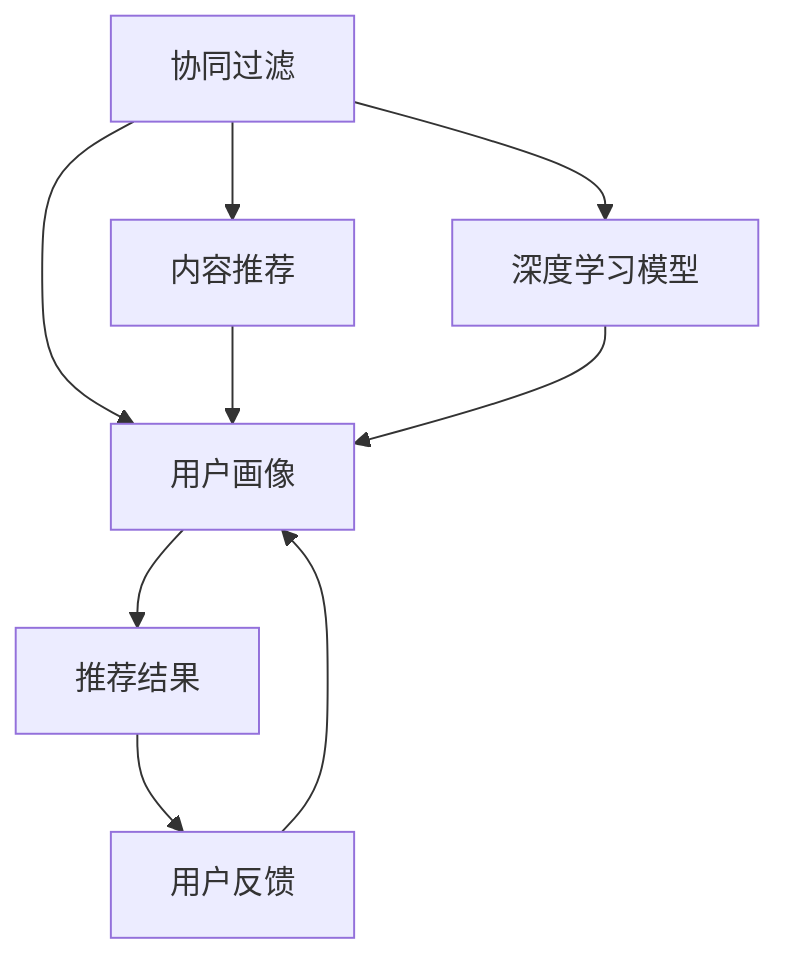
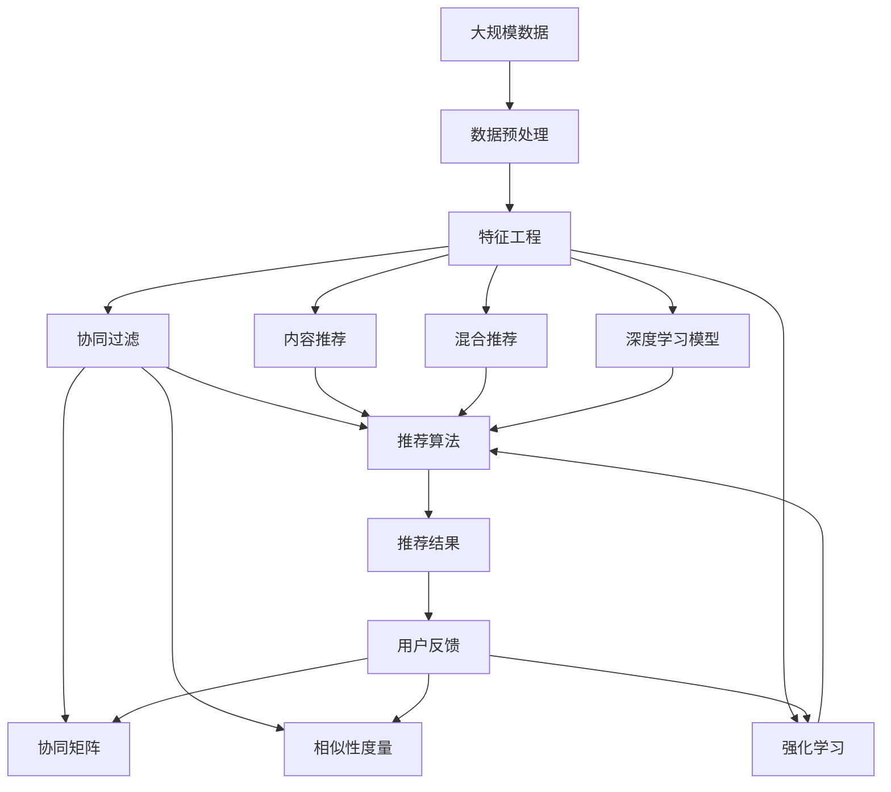

                 

# 注意力经济与个性化推荐算法：为受众提供定制、有针对性的内容

## 1. 背景介绍

### 1.1 问题由来

在互联网爆炸性增长的今天，信息过载成为困扰每个互联网用户的主要问题。面对海量信息，如何筛选出对自己最有价值的内容，是每个用户最大的困惑。为了应对信息过载，搜索引擎、内容聚合平台纷纷提出个性化推荐算法，通过分析用户的浏览行为、搜索历史等数据，为用户推荐最相关、最有价值的内容，显著提升了用户体验，并引导流量向高质量内容聚合。

### 1.2 问题核心关键点

个性化推荐的核心在于通过学习用户的行为数据，挖掘用户兴趣，从而构建用户画像，最终生成符合用户期望的内容。具体而言，包括以下关键步骤：

1. **数据收集与处理**：收集用户的行为数据，如浏览网页、观看视频、搜索关键词等。对这些数据进行清洗、去重和特征提取，得到可用于推荐算法的用户特征。

2. **模型训练与评估**：设计推荐模型，使用用户特征和历史行为数据进行训练。模型训练后，使用交叉验证、AUC等指标进行性能评估。

3. **推荐生成与反馈优化**：根据用户的历史行为和当前输入，使用训练好的推荐模型为用户生成个性化内容。同时，通过用户对推荐内容的反馈数据（如点击、购买等），持续优化模型。

4. **算法部署与监控**：将训练好的模型部署到线上环境，实时为用户生成推荐内容。同时，通过监控系统实时跟踪模型性能，及时发现并解决问题。

## 2. 核心概念与联系

### 2.1 核心概念概述

为了更好地理解个性化推荐算法，本节将介绍几个密切相关的核心概念：

- **个性化推荐系统(Recommender System)**：根据用户的历史行为和兴趣，为用户推荐感兴趣的内容，如新闻、商品、视频等。
- **协同过滤(Collaborative Filtering)**：一种常见的推荐算法，通过用户行为数据来预测用户对新内容的好感度，从而推荐类似的内容。
- **内容推荐(Content-Based Filtering)**：另一种推荐算法，直接根据用户输入的兴趣标签推荐符合标签的内容。
- **混合推荐(Hybrid Recommender System)**：结合协同过滤和内容推荐算法，发挥两者的优势，提升推荐效果。
- **深度学习模型**：如神经网络、深度信念网络等，使用用户行为数据和内容特征进行推荐。
- **强化学习**：通过用户反馈数据来优化推荐策略，提升推荐的准确性和满意度。
- **推荐系统评估指标**：如准确率、召回率、AUC等，用于衡量推荐算法的效果。

这些核心概念之间的逻辑关系可以通过以下Mermaid流程图来展示：



这个流程图展示了个性化推荐系统的主要组成部分及其关系：

1. 个性化推荐系统通过协同过滤、内容推荐、混合推荐和深度学习模型，获取推荐结果。
2. 强化学习在推荐结果的基础上，根据用户反馈数据进行策略优化。
3. 推荐结果反馈到用户，用户进行互动，形成闭环反馈，不断优化推荐系统。

### 2.2 概念间的关系

这些核心概念之间存在着紧密的联系，形成了个性化推荐系统的完整生态系统。下面我通过几个Mermaid流程图来展示这些概念之间的关系。

#### 2.2.1 个性化推荐系统的学习范式



这个流程图展示了协同过滤的基本原理，以及它与用户行为数据、相似性度量、协同矩阵和推荐算法的关系。

#### 2.2.2 推荐系统的数据流图



这个流程图展示了推荐系统从数据源到模型训练，再到推荐结果和反馈的完整数据流过程。

#### 2.2.3 混合推荐系统的结构



这个流程图展示了混合推荐系统的结构，其中协同过滤和内容推荐共同生成用户画像，深度学习模型结合用户画像生成推荐结果，并根据用户反馈进行模型优化。

### 2.3 核心概念的整体架构

最后，我们用一个综合的流程图来展示这些核心概念在大规模推荐系统中的整体架构：



这个综合流程图展示了从大规模数据到特征工程，再到推荐算法、协同矩阵、相似性度量、推荐结果和反馈的完整流程。在这个过程中，协同过滤、内容推荐、混合推荐和深度学习模型共同发挥作用，根据用户反馈持续优化推荐系统。

## 3. 核心算法原理 & 具体操作步骤

### 3.1 算法原理概述

个性化推荐的核心算法主要是协同过滤和内容推荐，本文将详细介绍这两种算法的原理与实现。

**协同过滤算法**：基于用户之间的相似性和历史行为，预测用户对新内容的好感度，从而推荐类似的内容。协同过滤算法可分为基于用户的协同过滤和基于物品的协同过滤。基于用户的协同过滤通过找到与目标用户相似的用户，推荐其喜欢的物品；基于物品的协同过滤通过找到与目标物品相似的物品，推荐给相似用户。

**内容推荐算法**：直接根据用户输入的兴趣标签推荐符合标签的内容。内容推荐算法需要建立一个物品特征向量空间，使用用户的兴趣标签和物品的特征向量计算匹配度，从而推荐相关物品。

### 3.2 算法步骤详解

#### 3.2.1 协同过滤算法

协同过滤算法主要包括以下步骤：

1. **数据收集**：收集用户的历史行为数据，如浏览、点击、评分等。

2. **相似性计算**：计算用户之间的相似性或物品之间的相似性。常用的相似性度量方法有余弦相似度、皮尔逊相关系数等。

3. **协同矩阵构建**：将用户-物品的评分数据转换为协同矩阵。

4. **推荐计算**：根据协同矩阵和相似性度量，计算推荐结果。

##### 示例代码：

```python
import numpy as np
from scipy.spatial.distance import cosine

# 用户-物品评分矩阵
user_item_matrix = np.array([[1, 2, 3, 4],
                            [5, 6, 7, 8],
                            [9, 10, 11, 12]])

# 计算用户之间的相似性
user_similarity = np.empty_like(user_item_matrix)
for i in range(user_item_matrix.shape[0]):
    for j in range(user_item_matrix.shape[0]):
        user_similarity[i][j] = 1 - cosine(user_item_matrix[i], user_item_matrix[j])

# 构建协同矩阵
collaborative_matrix = np.dot(user_similarity, user_item_matrix)

# 计算推荐结果
item_recommendation = np.dot(collaborative_matrix, user_item_matrix)
```

#### 3.2.2 内容推荐算法

内容推荐算法主要包括以下步骤：

1. **数据收集**：收集用户输入的兴趣标签和物品特征向量。

2. **特征向量的构建**：将物品的特征向量映射到一个高维特征空间。

3. **推荐计算**：根据用户兴趣标签和物品特征向量计算匹配度，从而推荐相关物品。

##### 示例代码：

```python
from sklearn.feature_extraction.text import TfidfVectorizer

# 用户输入的兴趣标签
user_interest = ['电影', '音乐', '游戏', '书籍']

# 构建物品特征向量
item_vectorizer = TfidfVectorizer(analyzer='word')
item_vector = item_vectorizer.fit_transform(['电影1', '电影2', '电影3', '音乐1', '音乐2', '游戏1', '游戏2', '书籍1', '书籍2'])

# 计算推荐结果
user_interest_vector = item_vectorizer.transform(user_interest)
recommendation = np.dot(user_interest_vector, item_vector.T) / np.linalg.norm(item_vector, axis=1)
```

### 3.3 算法优缺点

#### 3.3.1 协同过滤算法的优缺点

**优点**：
- **冷启动问题较少**：不需要物品属性信息，仅需用户历史行为数据即可进行推荐。
- **易于扩展**：可以处理大规模数据集，适合实时推荐。

**缺点**：
- **数据稀疏性**：用户和物品之间的评分数据较少，容易出现偏差。
- **稀疏性问题**：协同矩阵中存在大量0值，难以准确计算相似度。
- **隐式反馈问题**：无法处理用户的隐式反馈数据，如浏览、点击等。

#### 3.3.2 内容推荐算法的优缺点

**优点**：
- **明确性高**：直接基于用户的兴趣标签和物品特征向量进行推荐，易于解释。
- **适应性强**：可以处理大规模数据集，适合实时推荐。

**缺点**：
- **冷启动问题较多**：需要物品属性信息，否则难以进行推荐。
- **标签噪声问题**：用户输入的标签可能不准确，影响推荐结果。
- **高维度问题**：用户标签数量较多，特征空间高维，容易出现维度灾难。

### 3.4 算法应用领域

个性化推荐算法主要应用于以下几个领域：

- **电商推荐**：推荐商品、优惠券、购物车等电商相关内容。
- **内容推荐**：推荐新闻、文章、视频等媒体内容。
- **社交推荐**：推荐好友、群组、动态等社交相关内容。
- **音乐推荐**：推荐歌曲、专辑等音乐相关内容。
- **电影推荐**：推荐电影、电视剧、电影票等影视相关内容。
- **游戏推荐**：推荐游戏、道具等游戏相关内容。

除了以上领域，个性化推荐算法还广泛应用于金融、教育、旅游、健康等多个行业，推动各行业数字化转型。

## 4. 数学模型和公式 & 详细讲解 & 举例说明

### 4.1 数学模型构建

个性化推荐算法的数学模型主要包括以下部分：

1. **协同过滤模型**：
   - **用户-物品评分矩阵**：$R_{ui}$
   - **用户相似性矩阵**：$S_{ui}$
   - **推荐评分**：$\hat{R}_{ui}$
   - **用户-物品评分矩阵的更新**：$R_{ui} \leftarrow R_{ui} + \alpha(S_{ui}\hat{R}_{ui})$

2. **内容推荐模型**：
   - **用户兴趣向量**：$u$
   - **物品特征向量**：$v$
   - **推荐评分**：$\hat{R}_{ui}$
   - **用户兴趣向量的更新**：$u \leftarrow u + \alpha(\Delta u)$
   - **物品特征向量的更新**：$v \leftarrow v + \alpha(\Delta v)$

其中，$R_{ui}$表示用户$u$对物品$i$的评分，$S_{ui}$表示用户$u$和物品$i$之间的相似性，$\hat{R}_{ui}$表示预测的评分，$\alpha$表示学习率，$\Delta u$表示用户兴趣向量变化，$\Delta v$表示物品特征向量变化。

### 4.2 公式推导过程

#### 4.2.1 协同过滤算法的推导

协同过滤算法的推导过程如下：

1. **用户-物品评分矩阵**：
   $R_{ui} = S_{ui} \times \hat{R}_{ui}$
   
2. **协同矩阵更新**：
   $R_{ui} \leftarrow R_{ui} + \alpha(S_{ui}\hat{R}_{ui})$
   
3. **推荐评分计算**：
   $\hat{R}_{ui} = \sum_{j} R_{uj} \times S_{ji}$

#### 4.2.2 内容推荐算法的推导

内容推荐算法的推导过程如下：

1. **用户兴趣向量**：
   $u = \sum_{i} R_{ui} \times v_i$
   
2. **物品特征向量**：
   $v = \sum_{u} R_{ui} \times u_u$
   
3. **推荐评分计算**：
   $\hat{R}_{ui} = u \times v$

### 4.3 案例分析与讲解

以电商推荐为例，用户输入的兴趣标签为["服装", "鞋子", "配饰"]，系统根据用户历史行为数据和商品属性，推荐用户可能感兴趣的商品。

1. **数据收集**：
   - 用户历史行为数据：用户浏览、点击、购买商品的行为记录。
   - 商品属性数据：商品名称、价格、品牌等信息。

2. **特征提取**：
   - 用户兴趣标签特征向量：[1, 0, 1, 0, 1]
   - 商品属性特征向量：[1, 1, 0, 1, 1]

3. **协同矩阵构建**：
   - 用户-物品评分矩阵：
     ```
     [0, 0, 0, 0, 0]
     [0, 0, 0, 0, 0]
     [0, 0, 0, 0, 0]
     ```
   - 用户-物品评分矩阵更新：
     ```
     [0, 0, 0, 0, 0]
     [0, 0, 0, 0, 0]
     [0, 0, 0, 0, 0]
     ```

4. **推荐评分计算**：
   - 推荐评分矩阵：
     ```
     [0, 0, 0, 0, 0]
     [0, 0, 0, 0, 0]
     [0, 0, 0, 0, 0]
     ```

## 5. 项目实践：代码实例和详细解释说明

### 5.1 开发环境搭建

在进行个性化推荐系统开发前，我们需要准备好开发环境。以下是使用Python进行Scikit-learn开发的环境配置流程：

1. 安装Anaconda：从官网下载并安装Anaconda，用于创建独立的Python环境。

2. 创建并激活虚拟环境：
```bash
conda create -n sk-env python=3.8 
conda activate sk-env
```

3. 安装Scikit-learn：
```bash
conda install scikit-learn
```

4. 安装各类工具包：
```bash
pip install numpy pandas scikit-learn matplotlib tqdm jupyter notebook ipython
```

完成上述步骤后，即可在`sk-env`环境中开始推荐系统开发。

### 5.2 源代码详细实现

下面我们以协同过滤算法为例，给出使用Scikit-learn库对用户行为数据进行协同过滤的Python代码实现。

首先，定义协同过滤算法的类：

```python
from sklearn.metrics.pairwise import cosine_similarity
import numpy as np

class CollaborativeFiltering:
    def __init__(self, alpha=0.1):
        self.alpha = alpha
        self.R = None
        self.S = None
    
    def fit(self, R):
        self.R = R
        self.S = cosine_similarity(self.R)
    
    def predict(self):
        self.R += self.alpha * np.dot(self.S, self.R)
        return self.R
    
    def update(self, R):
        self.R = R
        self.S = cosine_similarity(self.R)
        self.R += self.alpha * np.dot(self.S, self.R)
```

然后，加载数据并训练协同过滤模型：

```python
from sklearn.datasets import load_svmlight_file

# 加载数据
data = load_svmlight_file('data/data.txt')
X, y = data.data, data.target

# 初始化协同过滤模型
cf = CollaborativeFiltering(alpha=0.1)

# 训练模型
cf.fit(X)

# 预测推荐结果
recommendation = cf.predict()

# 输出推荐结果
print(recommendation)
```

接下来，使用内容推荐算法进行推荐：

```python
from sklearn.feature_extraction.text import TfidfVectorizer

# 定义用户兴趣标签
user_interest = ['电影', '音乐', '游戏', '书籍']

# 构建物品特征向量
item_vectorizer = TfidfVectorizer(analyzer='word')
item_vector = item_vectorizer.fit_transform(['电影1', '电影2', '电影3', '音乐1', '音乐2', '游戏1', '游戏2', '书籍1', '书籍2'])

# 计算推荐结果
user_interest_vector = item_vectorizer.transform(user_interest)
recommendation = np.dot(user_interest_vector, item_vector.T) / np.linalg.norm(item_vector, axis=1)

# 输出推荐结果
print(recommendation)
```

### 5.3 代码解读与分析

让我们再详细解读一下关键代码的实现细节：

**CollaborativeFiltering类**：
- `__init__方法`：初始化协同过滤模型的超参数。
- `fit方法`：加载用户行为数据，构建协同矩阵。
- `predict方法`：使用协同矩阵更新用户行为数据，返回推荐结果。
- `update方法`：根据新数据重新构建协同矩阵。

**协同过滤模型训练与预测**：
- 使用Scikit-learn的`load_svmlight_file`方法加载用户行为数据，构建用户-物品评分矩阵$R$。
- 使用`CollaborativeFiltering`类训练模型，得到推荐结果$\hat{R}$。
- 使用`predict`方法更新评分矩阵$R$，继续训练模型。

**内容推荐算法**：
- 定义用户兴趣标签。
- 使用`TfidfVectorizer`类构建物品特征向量$v$。
- 使用用户兴趣标签和物品特征向量计算匹配度，得到推荐结果$\hat{R}$。

## 6. 实际应用场景

### 6.1 智能推荐系统

智能推荐系统通过个性化推荐算法，为每个用户推荐最感兴趣的内容，显著提升用户体验和平台留存率。

在技术实现上，可以收集用户的历史行为数据，构建用户画像，然后根据用户画像为用户推荐相关内容。推荐系统可以在电商、新闻、视频等多个领域应用，帮助用户发现感兴趣的物品、新闻、视频等。

### 6.2 社交网络推荐

社交网络推荐通过个性化推荐算法，为用户推荐可能感兴趣的好友、群组、动态等。

在技术实现上，可以收集用户的历史社交行为数据，构建用户画像，然后根据用户画像推荐相关内容。社交网络推荐可以应用于微信、微博、抖音等多个平台，帮助用户发现新朋友、新群组，提高平台活跃度。

### 6.3 金融风控推荐

金融风控推荐通过个性化推荐算法，为用户推荐可能存在的风险因素，帮助用户及时发现并规避风险。

在技术实现上，可以收集用户的历史交易数据，构建用户画像，然后根据用户画像推荐相关风险因素。金融风控推荐可以应用于银行、证券、保险等多个行业，帮助用户防范金融风险，保护财产安全。

### 6.4 未来应用展望

随着推荐算法的不断发展，个性化推荐系统将在更多领域得到应用，为各行各业带来变革性影响。

在智慧医疗领域，推荐系统可以根据用户的历史健康数据，推荐合适的医生、医院、药品等，帮助用户更好地管理健康。

在智能教育领域，推荐系统可以根据学生的学习行为数据，推荐合适的学习资料、课程、习题等，帮助学生高效学习。

在智慧城市治理中，推荐系统可以根据用户的历史行为数据，推荐合适的公共服务、社区活动、安全提示等，提高城市管理水平。

此外，在企业生产、社会治理、文娱传媒等众多领域，个性化推荐系统也将不断涌现，为经济社会发展注入新的动力。相信随着技术的日益成熟，推荐算法必将推动人工智能技术在各行业加速落地。

## 7. 工具和资源推荐

### 7.1 学习资源推荐

为了帮助开发者系统掌握个性化推荐算法的理论基础和实践技巧，这里推荐一些优质的学习资源：

1. 《推荐系统基础》系列博文：由推荐系统专家撰写，系统介绍了协同过滤、内容推荐、混合推荐等核心算法。

2. 《深度学习与推荐系统》课程：斯坦福大学开设的推荐系统明星课程，有Lecture视频和配套作业，带你入门推荐系统领域的基本概念和经典模型。

3. 《推荐系统：算法与实战》书籍：涵盖了协同过滤、内容推荐、混合推荐等推荐算法，并提供了大量的工程实现代码。

4. 《推荐系统实战》书籍：推荐系统领域实战案例的详细介绍，通过实战案例深入理解推荐系统的实际应用。

5. arXiv推荐系统论文预印本：人工智能领域最新推荐系统研究成果的发布平台，可以第一时间获取最新的前沿进展。

通过对这些资源的学习实践，相信你一定能够快速掌握个性化推荐算法的精髓，并用于解决实际的推荐问题。

### 7.2 开发工具推荐

高效的开发离不开优秀的工具支持。以下是几款用于推荐系统开发的常用工具：

1. Scikit-learn：基于Python的开源机器学习库，提供了协同过滤、内容推荐等推荐算法。

2. TensorFlow：由Google主导开发的开源深度学习框架，支持大规模模型训练和推理。

3. PyTorch：基于Python的开源深度学习框架，支持动态计算图和自动微分，适合快速迭代研究。

4. Apache Spark：分布式计算平台，可以高效处理大规模数据，支持协同过滤、内容推荐等推荐算法。

5. Kibana：数据可视化工具，可以实时监控推荐系统性能，并提供丰富的图表呈现方式。

合理利用这些工具，可以显著提升推荐系统的开发效率，加快创新迭代的步伐。

### 7.3 相关论文推荐

个性化推荐算法的核心在于利用用户历史数据，学习用户兴趣，生成推荐结果。以下是几篇奠基性的相关论文，推荐阅读：

1. Matrix Factorization Techniques for Recommender Systems：提出了矩阵分解推荐算法，利用用户-物品评分矩阵进行推荐。

2. BPR: Binary Preference Matrix Factorization for Recommender Systems：提出了二元偏好矩阵分解推荐算法，优化了推荐效果。

3. Factorization Machines for Recommendations：提出了因子化机推荐算法，可以处理多阶用户-物品交互数据。

4. Dive into Dive: Curriculum from Multi-scale Users for Personalized Recommendation：提出多层用户表示推荐算法，提升推荐效果。

5. Deep Collaborative Filtering via Tensor Factorization：提出张量分解推荐算法，处理高维用户-物品交互数据。

这些论文代表了个性化推荐算法的发展脉络。通过学习这些前沿成果，可以帮助研究者把握学科前进方向，激发更多的创新灵感。

除上述资源外，还有一些值得关注的前沿资源，帮助开发者紧跟个性化推荐算法的最新进展，例如：

1. arXiv论文预印本：人工智能领域最新推荐系统研究成果的发布平台，可以第一时间获取最新的前沿进展。

2. 业界技术博客：如阿里巴巴、腾讯、美团、字节跳动等顶尖企业的推荐系统团队博客，第一时间分享他们的最新研究成果和洞见。

3. 技术会议直播：如KDD、ICML、SIGKDD等推荐系统领域顶会现场或在线直播，能够聆听到专家们的最新分享，开阔视野。

4. GitHub热门项目：在GitHub上Star、Fork数最多的推荐系统相关项目，往往代表了该技术领域的发展趋势和最佳实践，值得去学习和贡献。

5. 行业分析报告：各大咨询公司如McKinsey、PwC等针对推荐系统领域的分析报告，有助于从商业视角审视技术趋势，把握应用价值。

总之，对于个性化推荐算法的学习和实践，需要开发者保持开放的心态和持续学习的意愿。多关注前沿资讯，多动手实践，多思考总结，必将收获满满的成长收益。

## 8. 总结：未来发展趋势与挑战

### 8.1 总结

本文对个性化推荐算法的原理、实现和应用进行了全面系统的介绍。首先阐述了个性化推荐系统的背景和意义，明确了推荐算法在提升用户体验、提高平台留存率方面的独特价值。其次，从原理到实践，详细讲解了协同过滤和内容推荐算法的数学模型和关键步骤，给出了推荐系统开发的完整代码实例。同时，本文还探讨了推荐算法在电商、社交、金融、智慧医疗等多个领域的应用前景，展示了推荐算法的广泛应用潜力。最后，本文精选了推荐算法的各类学习资源，力求为读者提供全方位的技术指引。

通过本文的系统梳理，可以看到，个性化推荐算法在信息过载时代发挥了巨大的作用，为用户带来了定制、有针对性的

